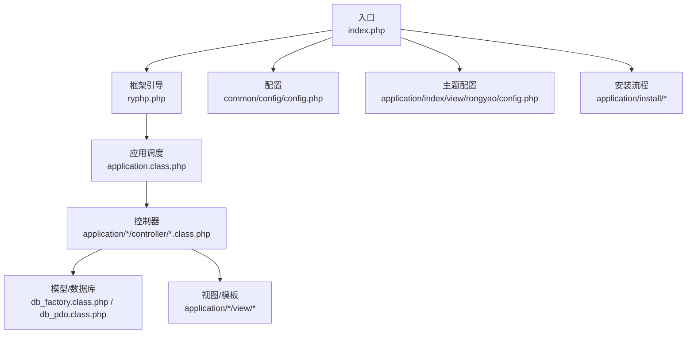
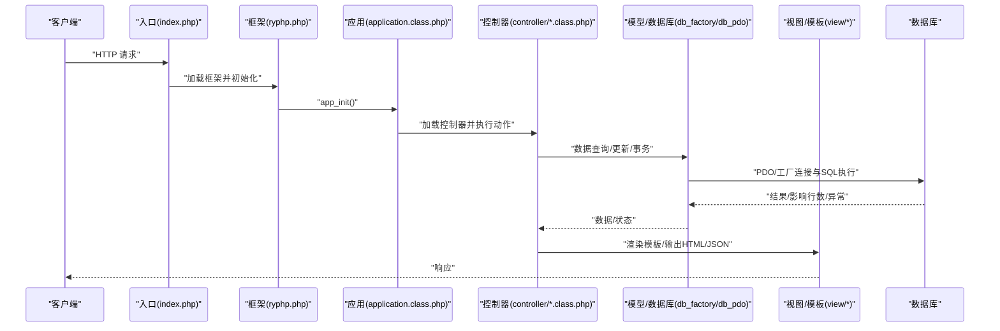
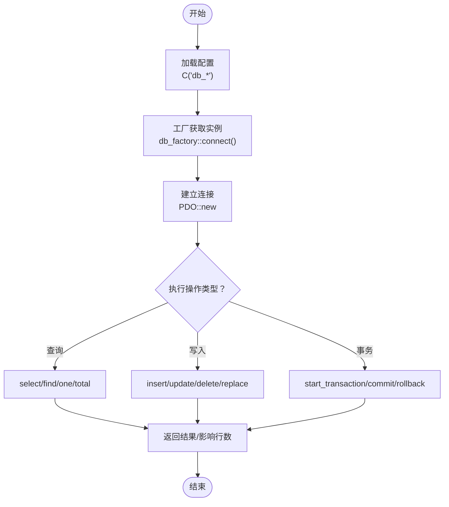
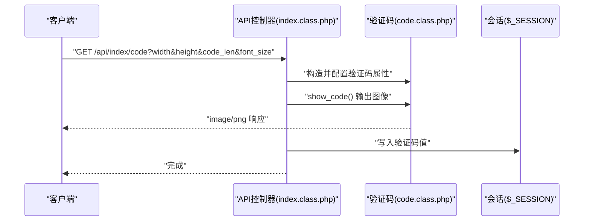
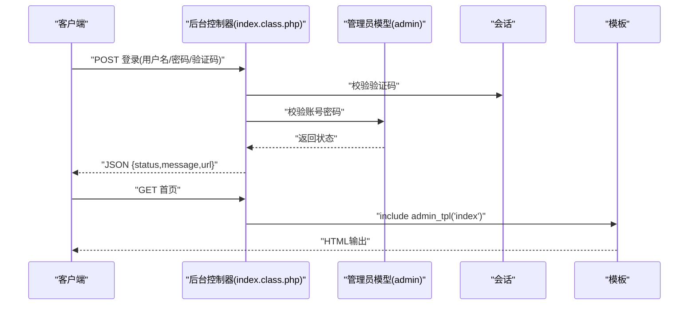
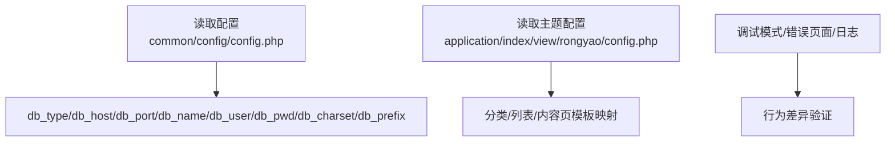
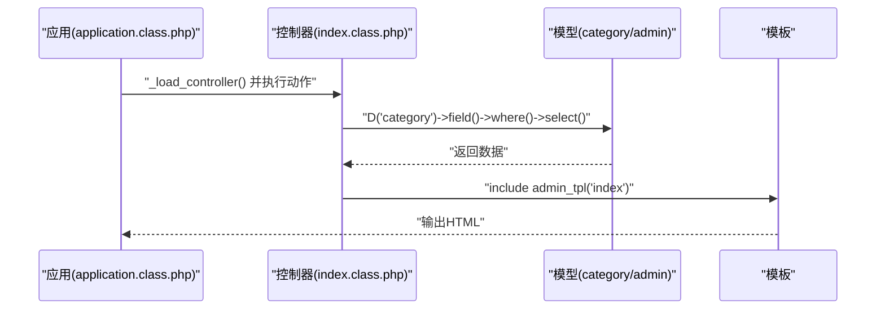
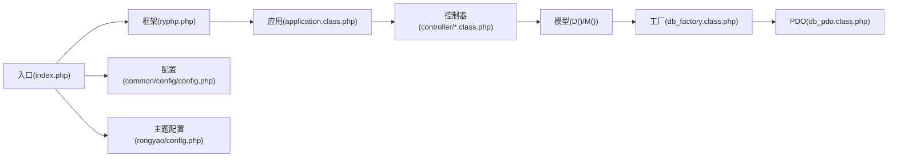

# 集成测试

<cite>
**本文引用的文件**
- [index.php](file://index.php)
- [ryphp.php](file://ryphp/ryphp.php)
- [application.class.php](file://ryphp/core/class/application.class.php)
- [db_factory.class.php](file://ryphp/core/class/db_factory.class.php)
- [db_pdo.class.php](file://ryphp/core/class/db_pdo.class.php)
- [config.php](file://common/config/config.php)
- [config.php](file://application/index/view/rongyao/config.php)
- [index.class.php](file://application/api/controller/index.class.php)
- [index.class.php](file://application/index/controller/index.class.php)
- [index.class.php](file://application/lry_admin_center/controller/index.class.php)
- [global.func.php](file://ryphp/core/function/global.func.php)
- [index.php](file://application/install/index.php)
- [s3.php](file://application/install/templates/s3.php)
</cite>

## 目录
1. [简介](#简介)
2. [项目结构](#项目结构)
3. [核心组件](#核心组件)
4. [架构总览](#架构总览)
5. [详细组件分析](#详细组件分析)
6. [依赖关系分析](#依赖关系分析)
7. [性能考量](#性能考量)
8. [故障排查指南](#故障排查指南)
9. [结论](#结论)
10. [附录](#附录)

## 简介
本文件面向LRYBlog项目的集成测试，系统化阐述数据库集成测试、API接口测试、用户界面集成测试、配置系统测试、模块间通信测试以及测试数据管理策略，并提供环境搭建与测试脚本编写指南。目标是帮助测试人员与开发者在真实或模拟环境中，对系统进行端到端验证，确保控制器-模型-模板-数据库-前端交互的协同工作稳定可靠。

## 项目结构
LRYBlog采用MVC分层与模块化组织，入口文件负责框架引导，应用模块按业务划分（前台、后台、API），数据库访问通过工厂与PDO封装实现，配置集中于公共配置与主题配置，安装流程提供数据库连接与初始化能力。

图表来源
- [index.php:1-18](file://index.php#L1-L18)
- [ryphp.php:83-90](file://ryphp/ryphp.php#L83-L90)
- [application.class.php:24-40](file://ryphp/core/class/application.class.php#L24-L40)
- [db_factory.class.php:11-34](file://ryphp/core/class/db_factory.class.php#L11-L34)
- [db_pdo.class.php:26-31](file://ryphp/core/class/db_pdo.class.php#L26-L31)
- [config.php:1-88](file://common/config/config.php#L1-L88)
- [config.php:1-29](file://application/index/view/rongyao/config.php#L1-L29)
- [index.php:162-193](file://application/install/index.php#L162-L193)

章节来源
- [index.php:1-18](file://index.php#L1-L18)
- [ryphp.php:83-90](file://ryphp/ryphp.php#L83-L90)
- [application.class.php:24-40](file://ryphp/core/class/application.class.php#L24-L40)

## 核心组件
- 入口与框架引导：入口文件定义常量并加载框架，随后初始化应用。
- 应用调度：根据路由参数加载控制器并执行动作，统一错误处理与消息展示。
- 数据库访问：工厂按配置选择具体驱动（PDO/Mysqli/Mysql），统一连接与事务控制。
- 配置系统：全局配置与主题配置分离，支持数据库、缓存、路由、上传等配置项。
- 安装流程：提供数据库连接测试、数据库创建与初始化脚本。

章节来源
- [index.php:10-18](file://index.php#L10-L18)
- [ryphp.php:108-140](file://ryphp/ryphp.php#L108-L140)
- [application.class.php:9-19](file://ryphp/core/class/application.class.php#L9-L19)
- [db_factory.class.php:14-31](file://ryphp/core/class/db_factory.class.php#L14-L31)
- [db_pdo.class.php:26-31](file://ryphp/core/class/db_pdo.class.php#L26-L31)
- [config.php:13-21](file://common/config/config.php#L13-L21)

## 架构总览
下图展示了从HTTP请求到数据库与模板渲染的整体流程，以及关键组件间的依赖关系。

图表来源
- [index.php:14-18](file://index.php#L14-L18)
- [ryphp.php:88-90](file://ryphp/ryphp.php#L88-L90)
- [application.class.php:24-40](file://ryphp/core/class/application.class.php#L24-L40)
- [db_factory.class.php:38-49](file://ryphp/core/class/db_factory.class.php#L38-L49)
- [db_pdo.class.php:100-124](file://ryphp/core/class/db_pdo.class.php#L100-L124)

## 详细组件分析

### 数据库集成测试
目标
- 验证数据库连接、SQL执行、事务控制与错误处理。
- 验证表存在性、字段存在性与主键识别。
- 验证安装流程中的数据库创建与初始化。

测试策略
- 连接测试：基于工厂类按配置加载PDO驱动，构造连接参数并尝试建立连接；在调试模式下捕获异常信息，非调试模式下返回通用错误提示。
- 数据操作测试：使用查询构建器组装where、join、field、order、limit等子句，执行select/find/one/total等查询；执行insert/update/delete/replace等写入操作；验证返回结果与影响行数。
- 事务处理测试：启动事务、执行多步写入、提交或回滚，验证一致性与回滚效果。
- 错误处理测试：触发SQL异常（如连接断开、语法错误）并验证错误上报与日志记录。
- 安装流程测试：在安装步骤中测试数据库连接、数据库创建、SQL初始化脚本执行。

图表来源
- [db_factory.class.php:14-31](file://ryphp/core/class/db_factory.class.php#L14-L31)
- [db_pdo.class.php:32-42](file://ryphp/core/class/db_pdo.class.php#L32-L42)
- [db_pdo.class.php:100-124](file://ryphp/core/class/db_pdo.class.php#L100-L124)
- [db_pdo.class.php:249-296](file://ryphp/core/class/db_pdo.class.php#L249-L296)
- [db_pdo.class.php:365-396](file://ryphp/core/class/db_pdo.class.php#L365-L396)
- [db_pdo.class.php:527-547](file://ryphp/core/class/db_pdo.class.php#L527-L547)
- [index.php:162-193](file://application/install/index.php#L162-L193)

章节来源
- [db_factory.class.php:11-34](file://ryphp/core/class/db_factory.class.php#L11-L34)
- [db_pdo.class.php:26-31](file://ryphp/core/class/db_pdo.class.php#L26-L31)
- [db_pdo.class.php:100-124](file://ryphp/core/class/db_pdo.class.php#L100-L124)
- [db_pdo.class.php:249-296](file://ryphp/core/class/db_pdo.class.php#L249-L296)
- [db_pdo.class.php:365-396](file://ryphp/core/class/db_pdo.class.php#L365-L396)
- [db_pdo.class.php:527-547](file://ryphp/core/class/db_pdo.class.php#L527-L547)
- [index.php:162-193](file://application/install/index.php#L162-L193)

### API接口测试策略
目标
- 验证RESTful风格的HTTP请求、响应格式与错误处理。
- 验证验证码接口的参数校验与会话存储。

测试策略
- HTTP请求测试：构造GET/POST请求，携带参数（如宽高、长度、字体大小），验证响应内容类型与状态码。
- 响应验证：检查验证码接口输出图像内容类型与会话中验证码值的一致性。
- 错误处理测试：传入非法参数范围触发参数校验逻辑，验证响应结构与错误信息。

图表来源
- [index.class.php:6-17](file://application/api/controller/index.class.php#L6-L17)
- [code.class.php:160-165](file://ryphp/core/class/code.class.php#L160-L165)

章节来源
- [index.class.php:6-17](file://application/api/controller/index.class.php#L6-L17)
- [code.class.php:16-38](file://ryphp/core/class/code.class.php#L16-L38)

### 用户界面集成测试
目标
- 验证前台页面渲染、后台登录与管理界面、模板加载与输出。
- 验证AJAX请求、JSON响应与错误提示。

测试策略
- 前台页面渲染：访问前台控制器动作，验证数据查询与页面输出。
- 后台登录：AJAX提交用户名/密码/验证码，验证登录校验、权限判断与重定向。
- 模板渲染：控制器通过include加载模板，验证输出内容与版权检测逻辑。
- AJAX与JSON：使用工具发起POST请求，验证返回JSON结构与状态码。

图表来源
- [index.class.php:19-38](file://application/lry_admin_center/controller/index.class.php#L19-L38)
- [index.class.php:120-147](file://application/lry_admin_center/controller/index.class.php#L120-L147)

章节来源
- [index.class.php:19-38](file://application/lry_admin_center/controller/index.class.php#L19-L38)
- [index.class.php:120-147](file://application/lry_admin_center/controller/index.class.php#L120-L147)

### 配置系统测试
目标
- 验证全局配置与主题配置的有效性与覆盖关系。
- 验证数据库配置项对连接的影响。

测试策略
- 全局配置验证：读取系统配置数组，验证数据库类型、主机、端口、字符集、表前缀等关键项。
- 主题配置验证：读取主题配置数组，验证分类/列表/内容页模板映射。
- 环境变量测试：在不同环境下（调试/非调试）验证错误页面与日志行为差异。

图表来源
- [config.php:13-21](file://common/config/config.php#L13-L21)
- [config.php:2-29](file://application/index/view/rongyao/config.php#L2-L29)

章节来源
- [config.php:13-21](file://common/config/config.php#L13-L21)
- [config.php:2-29](file://application/index/view/rongyao/config.php#L2-L29)

### 模块间通信测试
目标
- 验证控制器与模型的集成调用、模板渲染与输出。
- 验证路由参数解析与控制器动作执行。

测试策略
- 控制器加载：根据路由参数加载对应模块的控制器类，执行动作方法。
- 模型调用：通过D()/M()加载模型，执行查询/统计/插入等操作。
- 模板渲染：控制器通过admin_tpl/include加载模板，输出最终HTML。

图表来源
- [application.class.php:48-65](file://ryphp/core/class/application.class.php#L48-L65)
- [index.class.php:14-17](file://application/index/controller/index.class.php#L14-L17)
- [index.class.php:8-12](file://application/lry_admin_center/controller/index.class.php#L8-L12)

章节来源
- [application.class.php:48-65](file://ryphp/core/class/application.class.php#L48-L65)
- [index.class.php:14-17](file://application/index/controller/index.class.php#L14-L17)
- [index.class.php:8-12](file://application/lry_admin_center/controller/index.class.php#L8-L12)

## 依赖关系分析
- 入口依赖框架引导，框架负责类加载与路由参数注入。
- 应用层负责控制器加载与动作执行，统一错误处理。
- 控制器依赖模型与模板，模型依赖数据库工厂与PDO。
- 配置贯穿全局与主题，影响数据库连接与模板路径。

图表来源
- [index.php:14-18](file://index.php#L14-L18)
- [ryphp.php:108-140](file://ryphp/ryphp.php#L108-L140)
- [application.class.php:24-40](file://ryphp/core/class/application.class.php#L24-L40)
- [db_factory.class.php:38-49](file://ryphp/core/class/db_factory.class.php#L38-L49)
- [db_pdo.class.php:26-31](file://ryphp/core/class/db_pdo.class.php#L26-L31)
- [config.php:1-88](file://common/config/config.php#L1-L88)
- [config.php:1-29](file://application/index/view/rongyao/config.php#L1-L29)

章节来源
- [ryphp.php:108-140](file://ryphp/ryphp.php#L108-L140)
- [application.class.php:24-40](file://ryphp/core/class/application.class.php#L24-L40)
- [db_factory.class.php:38-49](file://ryphp/core/class/db_factory.class.php#L38-L49)
- [db_pdo.class.php:26-31](file://ryphp/core/class/db_pdo.class.php#L26-L31)
- [config.php:1-88](file://common/config/config.php#L1-L88)
- [config.php:1-29](file://application/index/view/rongyao/config.php#L1-L29)

## 性能考量
- 数据库连接池与重连：PDO层在特定异常时自动重建连接，减少服务端断开导致的失败。
- 预处理与绑定：查询构建器使用预处理语句与参数绑定，降低SQL注入风险并提升执行效率。
- 调试模式：调试模式下记录SQL执行时间，便于定位慢查询。
- 缓存配置：支持文件/Redis/Memcache缓存类型，合理配置可减轻数据库压力。

章节来源
- [db_pdo.class.php:118-123](file://ryphp/core/class/db_pdo.class.php#L118-L123)
- [db_pdo.class.php:100-117](file://ryphp/core/class/db_pdo.class.php#L100-L117)
- [config.php:39-66](file://common/config/config.php#L39-L66)

## 故障排查指南
- 数据库连接失败：检查配置项与网络连通性；查看调试模式下的异常信息；确认数据库服务状态。
- SQL执行错误：启用调试模式查看最后执行SQL与错误详情；核对where条件与字段合法性。
- 控制器/动作不存在：确认路由参数与控制器类文件路径；检查动作方法命名与可见性。
- 安装流程异常：在安装步骤中验证数据库连接测试与SQL初始化脚本执行结果。
- AJAX与JSON：使用工具发起请求，检查响应状态码与JSON结构；关注跨域与CORS设置。

章节来源
- [db_pdo.class.php:492-505](file://ryphp/core/class/db_pdo.class.php#L492-L505)
- [application.class.php:37-40](file://ryphp/core/class/application.class.php#L37-L40)
- [index.php:162-193](file://application/install/index.php#L162-L193)

## 结论
通过对入口、框架、应用调度、数据库访问、配置系统与安装流程的系统化测试，可全面验证LRYBlog在真实环境下的稳定性与一致性。建议在持续集成中引入自动化脚本，覆盖数据库连接、API响应、UI渲染与安装初始化等关键路径，并结合调试模式与日志记录快速定位问题。

## 附录

### 测试数据管理策略
- 准备：在测试数据库中准备最小化样例数据（如分类、文章、管理员账户），确保前缀与字符集与配置一致。
- 执行：在测试脚本中先执行数据准备，再执行被测动作，最后断言结果。
- 清理：在测试结束后执行回滚或删除操作，避免污染生产数据。

章节来源
- [config.php:13-21](file://common/config/config.php#L13-L21)
- [db_pdo.class.php:527-547](file://ryphp/core/class/db_pdo.class.php#L527-L547)

### 集成测试环境搭建与脚本编写指南
- 环境要求：PHP运行时、MySQL服务、Web服务器（Apache/Nginx）、GD扩展（验证码）。
- 搭建步骤：
  1) 配置数据库与表前缀，确保字符集兼容。
  2) 启动Web服务，访问安装页面完成数据库创建与初始化。
  3) 在调试模式下运行测试脚本，观察SQL与错误信息。
- 脚本编写要点：
  - 使用HTTP客户端发起请求，覆盖GET/POST/JSON场景。
  - 对数据库操作进行事务包裹，确保可重复执行。
  - 对模板渲染输出进行断言，验证关键字段与版权标识。

章节来源
- [index.php:162-193](file://application/install/index.php#L162-L193)
- [s3.php:142-165](file://application/install/templates/s3.php#L142-L165)
- [global.func.php:303-325](file://ryphp/core/function/global.func.php#L303-L325)