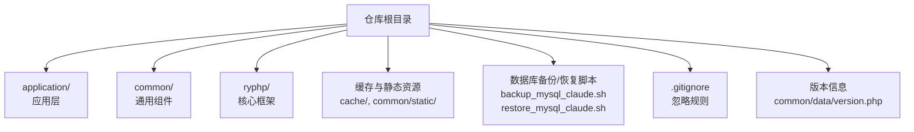
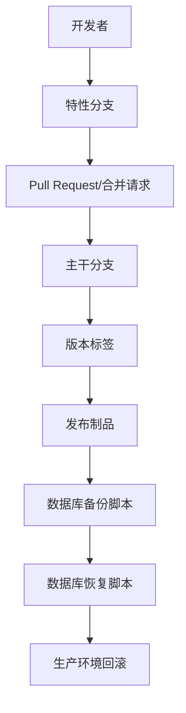
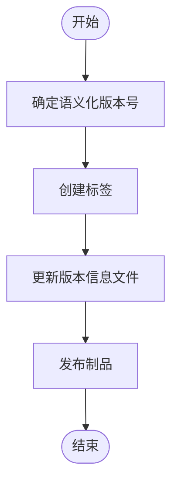
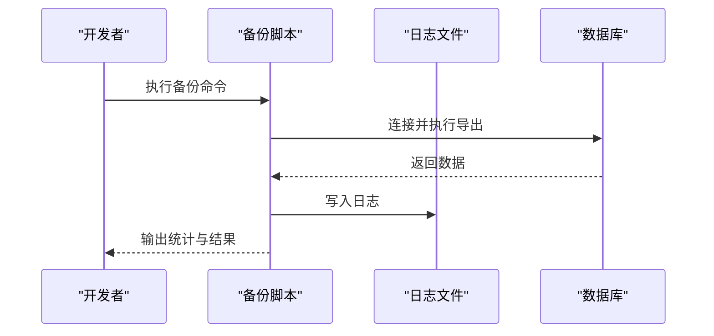
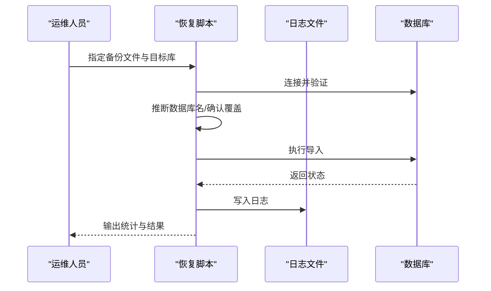
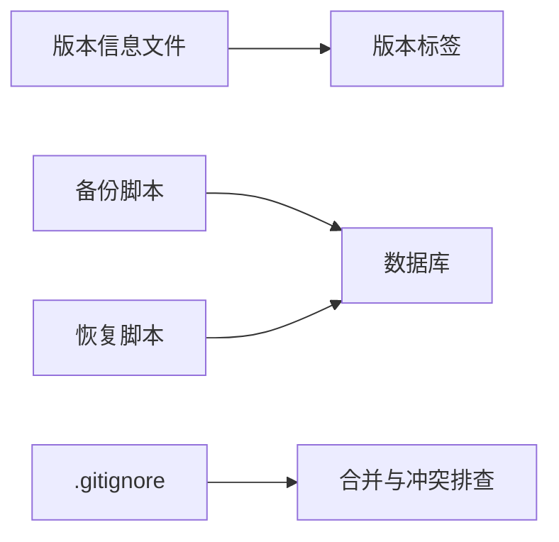

# 版本控制

<cite>
**本文引用的文件**
- [.gitignore](file://.gitignore)
- [README.md](file://README.md)
- [backup_mysql_claude.sh](file://backup_mysql_claude.sh)
- [restore_mysql_claude.sh](file://restore_mysql_claude.sh)
- [common/data/version.php](file://common/data/version.php)
</cite>

## 目录
1. [简介](#简介)
2. [项目结构](#项目结构)
3. [核心组件](#核心组件)
4. [架构总览](#架构总览)
5. [详细组件分析](#详细组件分析)
6. [依赖关系分析](#依赖关系分析)
7. [性能考虑](#性能考虑)
8. [故障排查指南](#故障排查指南)
9. [结论](#结论)
10. [附录](#附录)

## 简介
本指南面向 LRYBlog 项目的版本控制最佳实践，结合仓库现有脚本与配置，系统阐述 Git 工作流、分支策略、合并流程、冲突解决、提交规范、版本标签管理、团队协作流程、紧急修复与回滚、备份与恢复、以及面向开源贡献者的协作原则。文档同时给出可落地的流程图与时序图，帮助不同技术背景的读者快速上手并长期维持高质量的版本管理。

## 项目结构
LRYBlog 采用以应用为中心的模块化组织方式，前端静态资源、PHP 核心框架、后台管理界面与插件等分布在不同目录中；同时仓库根目录包含数据库备份与恢复脚本，便于在版本演进中同步进行数据层面的版本化管理。

图表来源
- [README.md](file://README.md#L1-L6)
- [backup_mysql_claude.sh](file://backup_mysql_claude.sh#L1-L392)
- [restore_mysql_claude.sh](file://restore_mysql_claude.sh#L1-L412)
- [.gitignore](file://.gitignore#L1-L8)
- [common/data/version.php](file://common/data/version.php#L1-L4)

章节来源
- [README.md](file://README.md#L1-L6)
- [.gitignore](file://.gitignore#L1-L8)
- [common/data/version.php](file://common/data/version.php#L1-L4)

## 核心组件
- 版本信息文件：集中定义当前软件版本与更新日期，便于发布与升级信息对接。
- 备份与恢复脚本：提供数据库备份与恢复能力，支持压缩与非压缩格式，具备日志记录与错误处理。
- 忽略规则：明确缓存与 IDE 目录的忽略策略，避免无关文件进入版本控制。

章节来源
- [common/data/version.php](file://common/data/version.php#L1-L4)
- [backup_mysql_claude.sh](file://backup_mysql_claude.sh#L1-L392)
- [restore_mysql_claude.sh](file://restore_mysql_claude.sh#L1-L412)
- [.gitignore](file://.gitignore#L1-L8)

## 架构总览
下图展示版本控制与数据备份的整体关系：开发者在本地进行变更与提交，通过分支与合并流程集成到主干；发布阶段结合版本标签与版本信息文件，配合数据库备份脚本形成完整的发布与回滚基线。

图表来源
- [backup_mysql_claude.sh](file://backup_mysql_claude.sh#L1-L392)
- [restore_mysql_claude.sh](file://restore_mysql_claude.sh#L1-L412)
- [common/data/version.php](file://common/data/version.php#L1-L4)

## 详细组件分析

### 组件A：版本标签与版本信息管理
- 版本号与更新日期集中定义于版本信息文件，便于发布与升级信息对接。
- 发布标签建议遵循语义化版本命名，结合版本信息文件中的版本号作为发布依据。
- 版本历史维护建议在每次打标签时附带简要变更摘要，保持可追溯性。

图表来源
- [common/data/version.php](file://common/data/version.php#L1-L4)

章节来源
- [common/data/version.php](file://common/data/version.php#L1-L4)

### 组件B：数据库备份与恢复脚本
- 备份脚本支持全库与单库备份、压缩与非压缩、事务一致性、存储过程与触发器导出等选项，并对备份文件进行完整性校验与旧备份清理。
- 恢复脚本支持压缩与非压缩文件、目标数据库推断、恢复前确认与覆盖策略、进度显示与错误日志记录。

图表来源
- [backup_mysql_claude.sh](file://backup_mysql_claude.sh#L1-L392)

图表来源
- [restore_mysql_claude.sh](file://restore_mysql_claude.sh#L1-L412)

章节来源
- [backup_mysql_claude.sh](file://backup_mysql_claude.sh#L1-L392)
- [restore_mysql_claude.sh](file://restore_mysql_claude.sh#L1-L412)

### 组件C：忽略规则与缓存管理
- 忽略规则明确缓存目录与 IDE 相关文件的排除范围，减少无关文件进入版本控制，降低仓库体积与冲突概率。
- 建议在团队内统一忽略规则，避免重复提交缓存与临时文件。

章节来源
- [.gitignore](file://.gitignore#L1-L8)

## 依赖关系分析
- 版本信息文件被发布流程依赖，确保版本号与标签一致。
- 备份/恢复脚本依赖 MySQL 服务与配置文件，需在 CI/CD 或发布前进行连通性与权限检查。
- 忽略规则影响分支合并与冲突排查效率，应纳入团队规范。

图表来源
- [common/data/version.php](file://common/data/version.php#L1-L4)
- [backup_mysql_claude.sh](file://backup_mysql_claude.sh#L1-L392)
- [restore_mysql_claude.sh](file://restore_mysql_claude.sh#L1-L412)
- [.gitignore](file://.gitignore#L1-L8)

章节来源
- [common/data/version.php](file://common/data/version.php#L1-L4)
- [backup_mysql_claude.sh](file://backup_mysql_claude.sh#L1-L392)
- [restore_mysql_claude.sh](file://restore_mysql_claude.sh#L1-L412)
- [.gitignore](file://.gitignore#L1-L8)

## 性能考虑
- 备份脚本默认启用单事务导出与压缩，兼顾一致性与存储效率；在大规模数据库场景下，建议结合业务低峰期执行全量备份。
- 恢复脚本支持进度显示与错误日志分离，便于定位性能瓶颈与异常。
- 忽略规则减少无关文件索引与传输，提升拉取与推送速度。

## 故障排查指南
- 备份失败
  - 检查 MySQL 服务状态与配置文件权限，确认连接正常。
  - 关注日志文件中的警告与错误信息，必要时调整导出参数。
- 恢复失败
  - 确认备份文件完整性（压缩格式校验），核对目标数据库名与字符集设置。
  - 在覆盖恢复前做好二次备份，避免不可逆损失。
- 合并与冲突
  - 使用统一的忽略规则与提交规范，减少无意义的差异。
  - 对大文件与二进制资源优先采用外部存储或子模块管理。

章节来源
- [backup_mysql_claude.sh](file://backup_mysql_claude.sh#L170-L198)
- [restore_mysql_claude.sh](file://restore_mysql_claude.sh#L210-L238)

## 结论
通过将版本信息文件、备份/恢复脚本与忽略规则纳入统一的版本控制流程，LRYBlog 可以实现稳定、可追溯且可回滚的发布与运维体系。建议团队在此基础上完善分支策略、提交规范与代码审查流程，持续提升协作效率与质量。

## 附录

### Git 工作流与分支策略
- 主干保护：仅允许通过 Pull Request 合并到主干，主干始终处于可发布状态。
- 特性分支：每个功能或修复在独立分支开发，完成后发起 PR 并进行代码审查。
- 预发布分支：在临近发布时创建预发布分支，收敛修复与回归测试。
- 热修复分支：线上紧急修复通过热修复分支隔离，快速合并至主干与上一稳定标签。

### 提交规范
- 类型与主题：以“类型(作用域): 主题”格式编写标题，类型包括 feat、fix、docs、style、refactor、test、chore 等。
- 变更描述：简明扼要说明变更目的与影响范围；涉及数据库结构变更时，附带迁移脚本或注意事项。
- 提交粒度：一次提交聚焦单一逻辑点，避免“把多个不相关改动塞进一次提交”。

### 版本标签与发布
- 语义化版本：根据功能新增与破坏性变更决定主/次/修订号递增。
- 标签创建：在合并后的提交上创建对应标签，并附带发布说明。
- 版本信息：发布制品中包含版本信息文件，确保升级与漏洞通知机制可用。

### 团队协作与代码审查
- PR 规范：PR 描述清晰、关联问题编号、包含测试要点与风险评估。
- 审查标准：关注代码可读性、安全性、性能与兼容性；至少一名维护者批准方可合并。
- 并行开发：通过短生命周期分支与频繁同步主干，降低集成成本。

### 紧急修复与回滚
- 热修复流程：从上一稳定标签切出热修复分支，修复后同时合并至主干与上一稳定标签。
- 生产回滚：优先采用“反向提交”的幂等回滚策略；若涉及数据，结合备份脚本进行数据回滚。

### 备份与恢复最佳实践
- 备份策略：定期全量+增量备份，保留最近 N 份完整备份集，自动清理过期文件。
- 恢复演练：定期进行恢复演练，验证备份文件完整性与恢复流程有效性。
- 权限与安全：严格限制备份文件与配置文件的访问权限，定期轮换凭据。

### 开源贡献者协作原则
- 讨论先行：重大变更建议先开议题讨论，统一设计后再提交 PR。
- 文档同步：变更涉及用户接口或行为变化时，同步更新文档与示例。
- 社区沟通：保持友好、专业的沟通风格，尊重不同观点与文化背景。