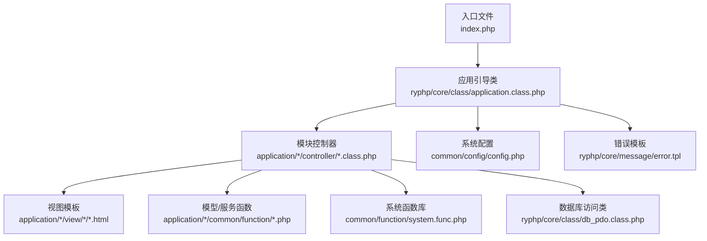
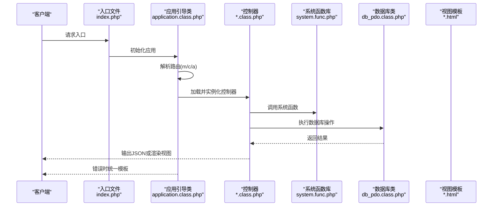
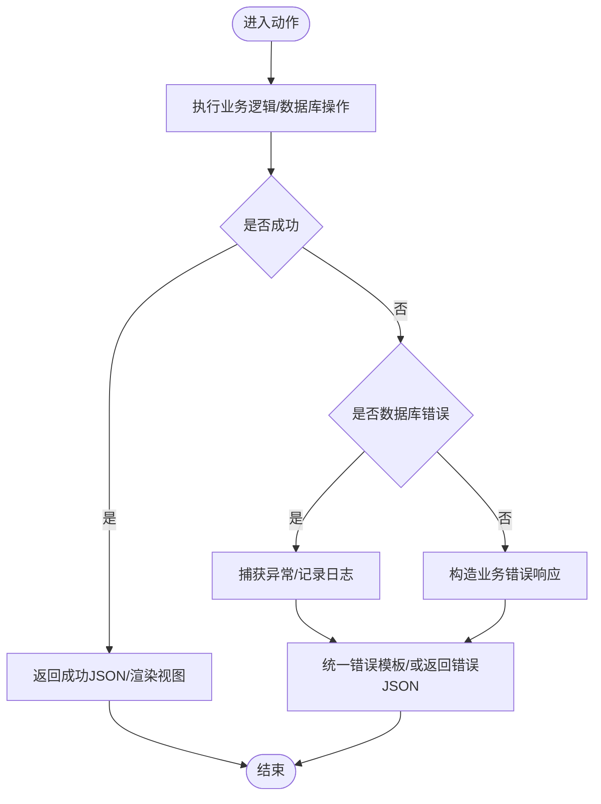
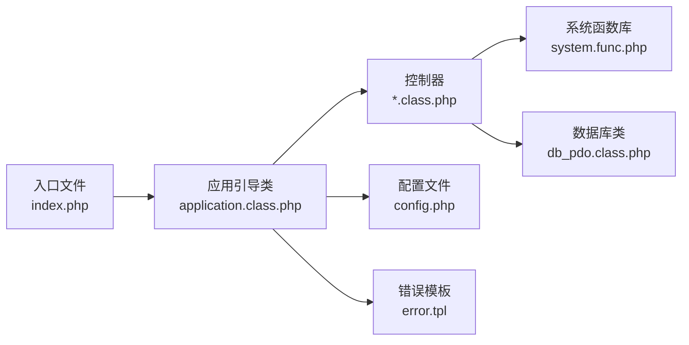

# 编码规范

<cite>
**本文引用的文件**
- [index.php](file://index.php)
- [application/index/controller/index.class.php](file://application/index/controller/index.class.php)
- [application/lry_admin_center/controller/index.class.php](file://application/lry_admin_center/controller/index.class.php)
- [application/lry_admin_center/common/function/function.php](file://application/lry_admin_center/common/function/function.php)
- [common/config/config.php](file://common/config/config.php)
- [ryphp/core/class/application.class.php](file://ryphp/core/class/application.class.php)
- [ryphp/core/class/db_pdo.class.php](file://ryphp/core/class/db_pdo.class.php)
- [ryphp/core/message/error.tpl](file://ryphp/core/message/error.tpl)
- [common/function/system.func.php](file://common/function/system.func.php)
- [application/install/index.php](file://application/install/index.php)
- [README.md](file://README.md)
- [DNS_FIX.md](file://DNS_FIX.md)
</cite>

## 目录
1. [引言](#引言)
2. [项目结构](#项目结构)
3. [核心组件](#核心组件)
4. [架构总览](#架构总览)
5. [详细组件分析](#详细组件分析)
6. [依赖关系分析](#依赖关系分析)
7. [性能考量](#性能考量)
8. [故障排查指南](#故障排查指南)
9. [结论](#结论)
10. [附录](#附录)

## 引言
本文件旨在为 LRYBlog 项目制定统一、可执行的 PHP 编码规范，覆盖命名约定、缩进与格式化、注释与 DocBlock 规范、MVC 架构下的文件组织原则、变量与函数命名、错误处理与异常抛出最佳实践，以及代码风格检查与自动化流程建议。目标是帮助新加入的开发者快速理解并遵循统一规范，提升代码质量与一致性。

## 项目结构
LRYBlog 采用典型的 MVC 分层与模块化目录组织：
- 应用入口与框架引导：入口文件负责常量定义与框架初始化。
- 模块划分：application 下按模块（如 index、lry_admin_center、api、install）组织，每个模块包含 controller、model、view 三层。
- 公共层：common 下包含配置、函数库、静态资源等。
- 框架核心：ryphp 下包含核心类、消息模板与语言包等。

图表来源
- [index.php](file://index.php#L1-L18)
- [ryphp/core/class/application.class.php](file://ryphp/core/class/application.class.php#L1-L118)
- [application/index/controller/index.class.php](file://application/index/controller/index.class.php#L1-L18)
- [common/config/config.php](file://common/config/config.php#L1-L88)
- [common/function/system.func.php](file://common/function/system.func.php#L1-L200)
- [ryphp/core/class/db_pdo.class.php](file://ryphp/core/class/db_pdo.class.php#L1-L120)
- [ryphp/core/message/error.tpl](file://ryphp/core/message/error.tpl#L1-L60)

章节来源
- [index.php](file://index.php#L1-L18)
- [README.md](file://README.md#L1-L6)
- [DNS_FIX.md](file://DNS_FIX.md#L1-L37)

## 核心组件
- 应用入口与初始化：定义调试开关、根路径、加载框架核心并初始化应用。
- 应用引导类：负责路由参数解析、控制器加载与调度、错误与致命错误处理。
- 控制器：接收请求、调用模型/函数、渲染视图或输出 JSON。
- 系统函数库：提供 SEO、URL、站点信息、附件、分页、树形结构等通用能力。
- 数据库访问类：封装 PDO 访问，提供链式查询、事务、错误处理等。
- 配置中心：集中管理数据库、缓存、路由、Cookie、上传等配置。
- 错误模板：统一错误页面样式与信息展示。

章节来源
- [index.php](file://index.php#L1-L18)
- [ryphp/core/class/application.class.php](file://ryphp/core/class/application.class.php#L1-L118)
- [ryphp/core/class/db_pdo.class.php](file://ryphp/core/class/db_pdo.class.php#L1-L120)
- [common/config/config.php](file://common/config/config.php#L1-L88)
- [ryphp/core/message/error.tpl](file://ryphp/core/message/error.tpl#L1-L60)

## 架构总览
LRYBlog 的请求生命周期如下：
- 入口文件加载框架核心并初始化应用。
- 应用引导类解析路由参数，定位模块、控制器与动作。
- 加载对应控制器，调用动作方法；动作内部可调用系统函数或模型函数。
- 输出 JSON 或渲染视图；错误通过统一模板展示。

图表来源
- [index.php](file://index.php#L1-L18)
- [ryphp/core/class/application.class.php](file://ryphp/core/class/application.class.php#L1-L118)
- [application/index/controller/index.class.php](file://application/index/controller/index.class.php#L1-L18)
- [common/function/system.func.php](file://common/function/system.func.php#L1-L200)
- [ryphp/core/class/db_pdo.class.php](file://ryphp/core/class/db_pdo.class.php#L1-L120)
- [ryphp/core/message/error.tpl](file://ryphp/core/message/error.tpl#L1-L60)

## 详细组件分析

### 命名约定与注释规范
- 类名：采用 PascalCase（如 application、db_pdo）。
- 控制器类名：模块名首字母大写（如 index），文件名与类名一致。
- 函数名：采用 camelCase（如 getUrlRule、getSiteModelinfo）。
- 常量：采用 UPPER_CASE（如 RYPHP_DEBUG、IN_RYPHP）。
- 变量：采用小驼峰或下划线风格，避免与 PHP 内置全局变量冲突。
- 私有成员/方法：以下划线前缀（如 _load_controller、_force_logout）。
- 常量定义位置：集中于配置文件或框架常量定义处，避免散落全局。

章节来源
- [ryphp/core/class/application.class.php](file://ryphp/core/class/application.class.php#L4-L118)
- [application/lry_admin_center/controller/index.class.php](file://application/lry_admin_center/controller/index.class.php#L1-L162)
- [ryphp/core/class/db_pdo.class.php](file://ryphp/core/class/db_pdo.class.php#L1-L120)
- [common/config/config.php](file://common/config/config.php#L1-L88)

### 缩进与格式化标准
- 缩进：统一使用 4 个空格，避免混用 Tab 与空格。
- 大括号：控制结构与函数声明独占一行，左大括号单独一行；空函数体与空控制块保留空格。
- 行宽：建议不超过 120 列，超长链式调用分行书写并缩进对齐。
- 空行：函数之间保留空行；逻辑分组使用空行分隔。
- 引号：字符串优先使用单引号，数组键使用单引号包裹，避免不必要的转义。

章节来源
- [ryphp/core/class/db_pdo.class.php](file://ryphp/core/class/db_pdo.class.php#L1-L120)
- [application/lry_admin_center/common/function/function.php](file://application/lry_admin_center/common/function/function.php#L1-L162)

### 注释与 DocBlock 规范
- 文件头部注释：包含文件用途、作者、许可证、最后修改时间。
- 函数注释：使用标准注释块，描述参数、返回值、异常与注意事项。
- 类注释：包含类用途、作者、版本与最后修改时间。
- 特殊注释：TODO/FIXME 使用统一标记并在后续迭代中清理。

章节来源
- [ryphp/core/class/db_pdo.class.php](file://ryphp/core/class/db_pdo.class.php#L1-L120)
- [application/lry_admin_center/common/function/function.php](file://application/lry_admin_center/common/function/function.php#L1-L162)

### MVC 架构下的文件组织原则
- 模块目录：每个模块独立目录，包含 controller、model、view 与 common 子目录。
- 控制器命名：模块名首字母大写，文件名与类名一致，动作方法公开（非下划线开头）。
- 模型与函数：模型层通过 D()/M() 等工厂函数访问；通用业务逻辑放入 common/function。
- 视图：模板文件按模块与页面划分，使用 HTML+PHP 混编，保持结构清晰。

章节来源
- [application/index/controller/index.class.php](file://application/index/controller/index.class.php#L1-L18)
- [application/lry_admin_center/controller/index.class.php](file://application/lry_admin_center/controller/index.class.php#L1-L162)
- [application/lry_admin_center/common/function/function.php](file://application/lry_admin_center/common/function/function.php#L1-L162)

### 变量与函数命名约定
- 变量：尽量使用语义化英文，避免单字母；私有成员以下划线前缀。
- 函数：动词短语，清晰表达意图；工具函数前缀区分领域（如 get_*、is_*、url_*）。
- 常量：全大写，单词间以下划线分隔；放置于配置文件或框架常量区。

章节来源
- [common/function/system.func.php](file://common/function/system.func.php#L1-L200)
- [application/lry_admin_center/common/function/function.php](file://application/lry_admin_center/common/function/function.php#L1-L162)

### 代码风格检查工具与自动化流程
- 工具选择：推荐使用 PHP_CodeSniffer（PSR-12）与 PHP-CS-Fixer。
- 规则配置：基于 PSR-12，补充项目特定规则（如函数命名、注释格式）。
- 自动化：在 CI 中集成 phpcs 与 php-cs-fixer，提交前强制执行；失败阻断合并。
- 本地开发：IDE 集成格式化快捷键与保存时自动修复。

（本节为通用实践建议，不直接分析具体文件）

### 错误处理与异常抛出最佳实践
- 致命错误：通过应用引导类统一捕获并渲染错误模板。
- 数据库错误：在数据库类中集中处理异常，区分调试与生产环境输出。
- 业务错误：使用统一的 JSON 返回结构（状态码、消息、可选数据）。
- 日志记录：生产环境记录错误日志，避免敏感信息泄露。

图表来源
- [ryphp/core/class/application.class.php](file://ryphp/core/class/application.class.php#L108-L118)
- [ryphp/core/class/db_pdo.class.php](file://ryphp/core/class/db_pdo.class.php#L492-L505)
- [ryphp/core/message/error.tpl](file://ryphp/core/message/error.tpl#L1-L60)

章节来源
- [ryphp/core/class/application.class.php](file://ryphp/core/class/application.class.php#L108-L118)
- [ryphp/core/class/db_pdo.class.php](file://ryphp/core/class/db_pdo.class.php#L492-L505)
- [ryphp/core/message/error.tpl](file://ryphp/core/message/error.tpl#L1-L60)

### 具体示例（正确与错误对比）
- 正确示例：控制器动作方法命名使用小驼峰，私有方法以下划线前缀；函数使用 camelCase；类名使用 PascalCase。
- 错误示例：类名使用下划线分隔；函数名混合大小写；变量名无语义；注释缺失或不规范。

章节来源
- [application/index/controller/index.class.php](file://application/index/controller/index.class.php#L1-L18)
- [application/lry_admin_center/controller/index.class.php](file://application/lry_admin_center/controller/index.class.php#L1-L162)
- [ryphp/core/class/application.class.php](file://ryphp/core/class/application.class.php#L1-L118)

## 依赖关系分析
- 入口文件依赖框架核心类进行应用初始化。
- 控制器依赖系统函数库与数据库类完成业务处理。
- 应用引导类负责路由解析与错误处理，是控制流中枢。
- 配置文件贯穿全局，为各层提供参数与策略。

图表来源
- [index.php](file://index.php#L1-L18)
- [ryphp/core/class/application.class.php](file://ryphp/core/class/application.class.php#L1-L118)
- [common/function/system.func.php](file://common/function/system.func.php#L1-L200)
- [ryphp/core/class/db_pdo.class.php](file://ryphp/core/class/db_pdo.class.php#L1-L120)
- [common/config/config.php](file://common/config/config.php#L1-L88)
- [ryphp/core/message/error.tpl](file://ryphp/core/message/error.tpl#L1-L60)

章节来源
- [index.php](file://index.php#L1-L18)
- [ryphp/core/class/application.class.php](file://ryphp/core/class/application.class.php#L1-L118)
- [common/function/system.func.php](file://common/function/system.func.php#L1-L200)
- [ryphp/core/class/db_pdo.class.php](file://ryphp/core/class/db_pdo.class.php#L1-L120)
- [common/config/config.php](file://common/config/config.php#L1-L88)
- [ryphp/core/message/error.tpl](file://ryphp/core/message/error.tpl#L1-L60)

## 性能考量
- 链式查询与绑定参数：使用预处理与绑定参数，避免拼接 SQL，降低注入风险与解析成本。
- 缓存策略：合理使用文件/Redis/Memcache 缓存，减少重复查询与计算。
- 模板渲染：避免在控制器中做复杂逻辑，将渲染与数据分离。
- 错误日志：生产环境避免输出详细错误堆栈，仅记录必要信息。

（本节为通用指导，不直接分析具体文件）

## 故障排查指南
- 致命错误：检查应用引导类的错误处理与模板渲染，确认模板路径与变量。
- 数据库错误：查看数据库类的异常捕获与日志记录，核对连接参数与表前缀。
- 配置问题：核对配置文件中的数据库、缓存、路由等参数，确保与部署环境一致。
- 安装流程：安装脚本会创建数据库、导入数据并写入配置，若失败检查权限与网络。

章节来源
- [ryphp/core/class/application.class.php](file://ryphp/core/class/application.class.php#L108-L118)
- [ryphp/core/class/db_pdo.class.php](file://ryphp/core/class/db_pdo.class.php#L492-L505)
- [common/config/config.php](file://common/config/config.php#L1-L88)
- [application/install/index.php](file://application/install/index.php#L1-L373)

## 结论
通过建立统一的命名、注释、格式与错误处理规范，并配合自动化检查工具与清晰的 MVC 组织结构，LRYBlog 项目能够在保证可维护性的同时提升开发效率。建议团队在日常协作中严格执行规范，并持续优化流程与工具链。

## 附录
- 新手入门清单
  - 遵循命名约定与注释规范
  - 使用统一缩进与格式化
  - 在 CI 中启用代码风格检查
  - 错误处理与日志记录规范化
  - 模块化开发，职责清晰

（本节为通用指导，不直接分析具体文件）