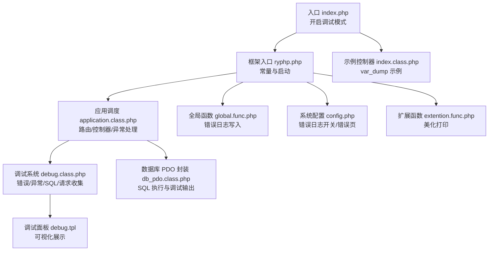
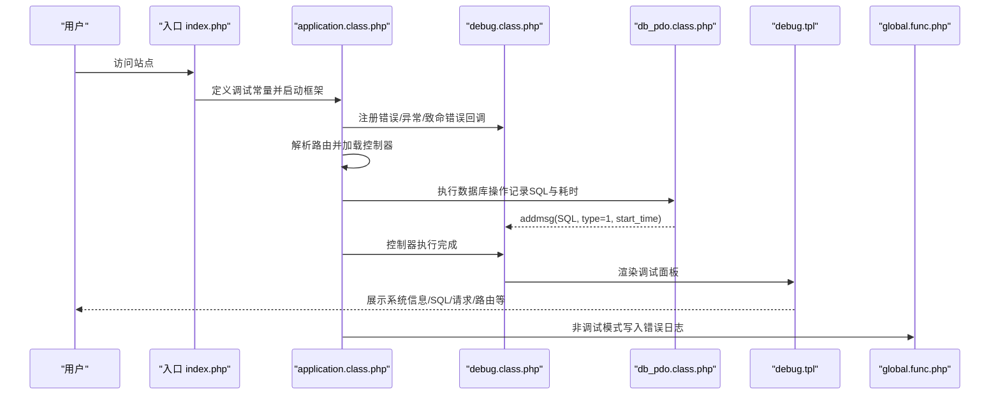
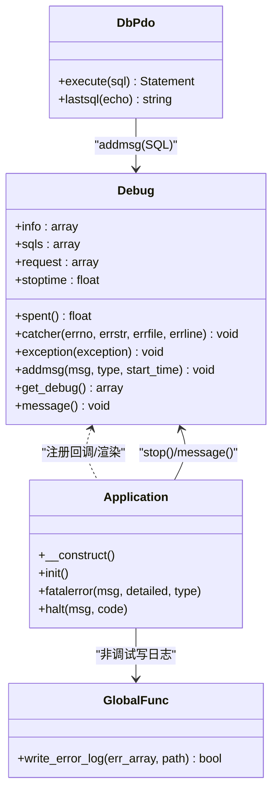
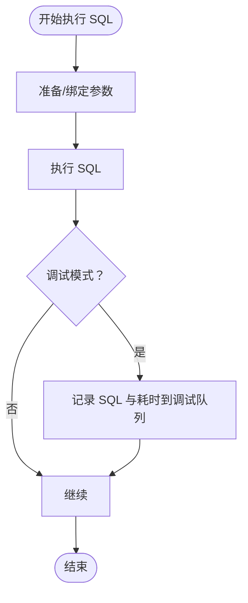
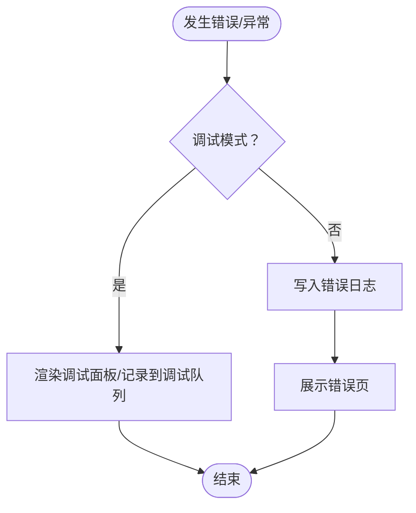
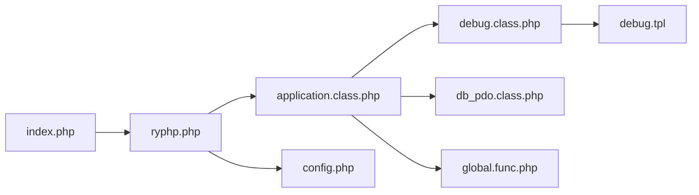

# 调试工具

<cite>
**本文引用的文件**
- [index.php](file://index.php)
- [ryphp.php](file://ryphp/ryphp.php)
- [application.class.php](file://ryphp/core/class/application.class.php)
- [debug.class.php](file://ryphp/core/class/debug.class.php)
- [debug.tpl](file://ryphp/core/message/debug.tpl)
- [global.func.php](file://ryphp/core/function/global.func.php)
- [config.php](file://common/config/config.php)
- [db_pdo.class.php](file://ryphp/core/class/db_pdo.class.php)
- [index.class.php](file://application/index/controller/index.class.php)
- [extention.func.php](file://common/function/extention.func.php)
</cite>

## 目录
1. [简介](#简介)
2. [项目结构](#项目结构)
3. [核心组件](#核心组件)
4. [架构总览](#架构总览)
5. [详细组件分析](#详细组件分析)
6. [依赖关系分析](#依赖关系分析)
7. [性能考量](#性能考量)
8. [故障排查指南](#故障排查指南)
9. [结论](#结论)
10. [附录](#附录)

## 简介
本指南面向 LRYBlog 开发者，系统讲解内置调试体系的使用方法与最佳实践，覆盖调试模式开启、日志记录、错误展示、数据库查询调试、性能分析、浏览器开发者工具配合使用，以及生产环境调试的安全注意事项。同时提供常见问题排查思路与工具组合方案，帮助快速定位并解决问题。

## 项目结构
LRYBlog 采用单入口 + 框架内核的结构，前端入口文件负责开启调试模式并引导框架启动；框架内核负责路由解析、控制器加载、错误与异常捕获、调试面板渲染与日志落盘；数据库层通过 PDO 封装提供 SQL 调试输出与错误处理；系统函数库提供日志写入与辅助调试函数。

**图表来源**
- [index.php](file://index.php#L10-L14)
- [ryphp.php](file://ryphp/ryphp.php#L25-L80)
- [application.class.php](file://ryphp/core/class/application.class.php#L9-L39)
- [debug.class.php](file://ryphp/core/class/debug.class.php#L3-L23)
- [debug.tpl](file://ryphp/core/message/debug.tpl#L1-L75)
- [db_pdo.class.php](file://ryphp/core/class/db_pdo.class.php#L100-L124)
- [global.func.php](file://ryphp/core/function/global.func.php#L835-L858)
- [config.php](file://common/config/config.php#L1-L88)
- [index.class.php](file://application/index/controller/index.class.php#L14-L17)
- [extention.func.php](file://common/function/extention.func.php#L25-L95)

**章节来源**
- [index.php](file://index.php#L10-L14)
- [ryphp.php](file://ryphp/ryphp.php#L25-L80)
- [application.class.php](file://ryphp/core/class/application.class.php#L9-L39)
- [debug.class.php](file://ryphp/core/class/debug.class.php#L3-L23)
- [debug.tpl](file://ryphp/core/message/debug.tpl#L1-L75)
- [db_pdo.class.php](file://ryphp/core/class/db_pdo.class.php#L100-L124)
- [global.func.php](file://ryphp/core/function/global.func.php#L835-L858)
- [config.php](file://common/config/config.php#L1-L88)
- [index.class.php](file://application/index/controller/index.class.php#L14-L17)
- [extention.func.php](file://common/function/extention.func.php#L25-L95)

## 核心组件
- 调试系统：负责错误与异常捕获、SQL 语句与执行耗时记录、HTTP 请求参数记录、调试面板渲染与关闭/最小化交互。
- 应用调度：注册错误/异常/致命错误回调，加载控制器并执行，结束后在调试模式下输出调试面板。
- 数据库封装：PDO 封装，执行 SQL 时记录 SQL 文本与耗时，异常时抛出或记录日志。
- 日志系统：统一错误日志写入，按天/大小轮转，支持关闭写入。
- 配置系统：控制错误页、错误日志开关、路由与缓存等，影响调试行为与错误展示。
- 辅助函数：提供美化打印数组的工具，便于在浏览器中查看结构化数据。

**章节来源**
- [debug.class.php](file://ryphp/core/class/debug.class.php#L3-L23)
- [application.class.php](file://ryphp/core/class/application.class.php#L9-L39)
- [db_pdo.class.php](file://ryphp/core/class/db_pdo.class.php#L100-L124)
- [global.func.php](file://ryphp/core/function/global.func.php#L835-L858)
- [config.php](file://common/config/config.php#L1-L88)
- [extention.func.php](file://common/function/extention.func.php#L25-L95)

## 架构总览
调试流程从入口文件开启调试模式，框架初始化后注册错误/异常处理回调，控制器执行期间数据库层记录 SQL，最终在调试模式下渲染调试面板，非调试模式下将错误写入日志并展示错误页。

**图表来源**
- [index.php](file://index.php#L10-L14)
- [application.class.php](file://ryphp/core/class/application.class.php#L9-L39)
- [debug.class.php](file://ryphp/core/class/debug.class.php#L116-L146)
- [db_pdo.class.php](file://ryphp/core/class/db_pdo.class.php#L100-L124)
- [debug.tpl](file://ryphp/core/message/debug.tpl#L1-L75)
- [global.func.php](file://ryphp/core/function/global.func.php#L835-L858)

## 详细组件分析

### 调试系统与面板
- 错误捕获：将 PHP 错误转换为可读信息并追加到调试信息队列，区分 Notice 与其他严重错误。
- 异常捕获：捕获未处理异常，记录消息与位置，非调试模式写入日志并提示。
- SQL 记录：PDO 执行 SQL 时记录 SQL 文本与执行耗时，类型标记为 SQL。
- 请求记录：记录 GET/POST 请求 URL 与参数，便于核对接口入参。
- 面板渲染：提供展开/最小化/关闭按钮，展示系统信息、SQL 列表、请求参数、路由与会话信息等。

**图表来源**
- [debug.class.php](file://ryphp/core/class/debug.class.php#L3-L146)
- [application.class.php](file://ryphp/core/class/application.class.php#L9-L115)
- [db_pdo.class.php](file://ryphp/core/class/db_pdo.class.php#L100-L124)
- [global.func.php](file://ryphp/core/function/global.func.php#L835-L858)

**章节来源**
- [debug.class.php](file://ryphp/core/class/debug.class.php#L3-L23)
- [debug.class.php](file://ryphp/core/class/debug.class.php#L75-L112)
- [debug.class.php](file://ryphp/core/class/debug.class.php#L116-L128)
- [debug.class.php](file://ryphp/core/class/debug.class.php#L130-L146)
- [debug.tpl](file://ryphp/core/message/debug.tpl#L1-L75)
- [application.class.php](file://ryphp/core/class/application.class.php#L9-L39)
- [application.class.php](file://ryphp/core/class/application.class.php#L93-L97)
- [application.class.php](file://ryphp/core/class/application.class.php#L108-L115)

### 数据库查询调试（PDO）
- SQL 记录：PDO 执行 SQL 时记录 SQL 文本与执行耗时，便于在调试面板中查看。
- 预处理绑定：在调试模式下将绑定参数替换到 SQL 中，便于核对实际执行 SQL。
- 错误处理：捕获 PDO 异常，非调试模式写入日志并提示通用错误，调试模式直接展示详细信息。
- 最后一次 SQL：提供 lastsql 方法输出最后一次执行的 SQL，便于快速定位。

**图表来源**
- [db_pdo.class.php](file://ryphp/core/class/db_pdo.class.php#L100-L124)

**章节来源**
- [db_pdo.class.php](file://ryphp/core/class/db_pdo.class.php#L100-L124)
- [db_pdo.class.php](file://ryphp/core/class/db_pdo.class.php#L439-L444)

### 日志记录与错误展示
- 错误日志写入：非调试模式下，错误与异常会被写入日志文件，包含时间、URL、IP、POST 数据与错误详情，按大小轮转。
- 错误页展示：非调试模式下，错误页由配置决定，避免暴露敏感信息。
- 调试隐藏：可通过常量隐藏调试面板，仅记录日志。

**图表来源**
- [application.class.php](file://ryphp/core/class/application.class.php#L93-L97)
- [application.class.php](file://ryphp/core/class/application.class.php#L108-L115)
- [global.func.php](file://ryphp/core/function/global.func.php#L835-L858)
- [config.php](file://common/config/config.php#L7-L8)

**章节来源**
- [global.func.php](file://ryphp/core/function/global.func.php#L835-L858)
- [config.php](file://common/config/config.php#L7-L8)
- [application.class.php](file://ryphp/core/class/application.class.php#L93-L97)
- [application.class.php](file://ryphp/core/class/application.class.php#L108-L115)

### PHP 调试函数与输出格式化
- var_dump/print_r：用于输出变量结构与类型，便于快速查看数据形态。建议在开发阶段使用，生产环境避免输出。
- 美化打印：提供 Palry/Printarraylry 等函数，以彩色与层级结构输出数组，提升可读性。
- 输出位置：建议在控制器或模型中临时使用，完成后及时移除，避免影响性能与安全。

**章节来源**
- [index.class.php](file://application/index/controller/index.class.php#L14-L17)
- [extention.func.php](file://common/function/extention.func.php#L25-L95)

### 浏览器开发者工具使用技巧
- 网络请求监控：观察请求 URL、方法、参数、响应状态与耗时，核对控制器与路由是否匹配。
- DOM 检查：查看调试面板的 HTML 结构与样式，确认面板是否正确渲染。
- JavaScript 调试：若面板交互失效，检查控制台是否有报错，确认 JS 事件绑定是否生效。
- 存储与会话：查看 Cookie/Session 是否正确，核对会话 ID 与路由参数。

[本节为通用工具使用说明，不直接分析具体文件，故无“章节来源”]

## 依赖关系分析
- 入口依赖框架：入口文件定义调试常量并引入框架入口。
- 框架依赖调试：应用调度注册调试回调，控制器执行完成后在调试模式下渲染面板。
- 数据库依赖调试：PDO 执行 SQL 时调用调试系统记录 SQL 与耗时。
- 日志依赖配置：错误日志写入受配置项控制，错误页由配置决定。

**图表来源**
- [index.php](file://index.php#L10-L14)
- [ryphp.php](file://ryphp/ryphp.php#L25-L80)
- [application.class.php](file://ryphp/core/class/application.class.php#L9-L39)
- [debug.class.php](file://ryphp/core/class/debug.class.php#L3-L23)
- [db_pdo.class.php](file://ryphp/core/class/db_pdo.class.php#L100-L124)
- [debug.tpl](file://ryphp/core/message/debug.tpl#L1-L75)
- [global.func.php](file://ryphp/core/function/global.func.php#L835-L858)
- [config.php](file://common/config/config.php#L1-L88)

**章节来源**
- [index.php](file://index.php#L10-L14)
- [ryphp.php](file://ryphp/ryphp.php#L25-L80)
- [application.class.php](file://ryphp/core/class/application.class.php#L9-L39)
- [debug.class.php](file://ryphp/core/class/debug.class.php#L3-L23)
- [db_pdo.class.php](file://ryphp/core/class/db_pdo.class.php#L100-L124)
- [debug.tpl](file://ryphp/core/message/debug.tpl#L1-L75)
- [global.func.php](file://ryphp/core/function/global.func.php#L835-L858)
- [config.php](file://common/config/config.php#L1-L88)

## 性能考量
- 页面加载时间：调试面板顶部显示脚本耗时，可用于粗略评估页面性能。
- SQL 执行耗时：每个 SQL 末尾附带执行耗时，便于识别慢查询。
- 预处理与绑定：使用预处理与绑定可降低 SQL 注入风险并提升执行效率。
- 日志轮转：错误日志按大小轮转，避免磁盘占用过大。

**章节来源**
- [debug.tpl](file://ryphp/core/message/debug.tpl#L7-L7)
- [debug.class.php](file://ryphp/core/class/debug.class.php#L122-L122)
- [global.func.php](file://ryphp/core/function/global.func.php#L849-L851)

## 故障排查指南

### 调试模式开启与隐藏
- 开启调试：入口文件定义调试常量，启用后控制器执行完成后会渲染调试面板。
- 隐藏调试：可通过常量隐藏调试面板，仅记录日志，避免敏感信息泄露。

**章节来源**
- [index.php](file://index.php#L10-L14)
- [debug.class.php](file://ryphp/core/class/debug.class.php#L139-L146)

### 路由问题排查
- 路由信息：调试面板展示模块、控制器、方法与参数，核对路由是否正确。
- 控制器存在性：若控制器文件或类不存在，应用调度会提示错误并终止。

**章节来源**
- [debug.tpl](file://ryphp/core/message/debug.tpl#L46-L51)
- [application.class.php](file://ryphp/core/class/application.class.php#L48-L65)

### 模板渲染错误
- 模板路径：检查模板主题目录与视图文件是否存在，避免路径错误导致渲染失败。
- 调试面板：若面板未出现，检查调试常量与错误处理回调是否注册。

**章节来源**
- [application.class.php](file://ryphp/core/class/application.class.php#L9-L19)
- [debug.class.php](file://ryphp/core/class/debug.class.php#L139-L146)

### 数据库连接异常
- 连接失败：PDO 连接异常时会根据调试模式展示详细信息或写入日志。
- 重连机制：检测到连接断开时尝试重建连接并重试执行。

**章节来源**
- [db_pdo.class.php](file://ryphp/core/class/db_pdo.class.php#L32-L42)
- [db_pdo.class.php](file://ryphp/core/class/db_pdo.class.php#L118-L122)

### SQL 语句与执行计划
- 查看 SQL：在调试面板 SQL 区域查看执行的 SQL 与耗时。
- 最后一次 SQL：使用 lastsql 方法输出最后一次执行的 SQL，便于核对构造逻辑。
- 执行计划：可在数据库客户端中对 SQL 使用 EXPLAIN 分析执行计划与索引使用情况。

**章节来源**
- [debug.tpl](file://ryphp/core/message/debug.tpl#L30-L35)
- [db_pdo.class.php](file://ryphp/core/class/db_pdo.class.php#L439-L444)

### PHP 调试函数最佳实践
- var_dump/print_r：仅在开发阶段使用，生产环境移除，避免输出敏感信息。
- 美化打印：使用 Palry/Printarraylry 输出结构化数组，便于对比字段与层级。
- 输出位置：建议放在控制器或模型中临时使用，完成后清理。

**章节来源**
- [index.class.php](file://application/index/controller/index.class.php#L14-L17)
- [extention.func.php](file://common/function/extention.func.php#L25-L95)

### 生产环境调试安全注意事项
- 关闭调试：生产环境应关闭调试常量，避免暴露内部信息。
- 错误日志：开启错误日志保存以便离线分析，但注意日志轮转与权限。
- 错误页：配置错误页，避免直接展示技术细节。
- 隐藏调试：通过常量隐藏调试面板，仅记录日志。

**章节来源**
- [index.php](file://index.php#L10-L14)
- [config.php](file://common/config/config.php#L7-L8)
- [application.class.php](file://ryphp/core/class/application.class.php#L108-L115)
- [global.func.php](file://ryphp/core/function/global.func.php#L835-L858)

## 结论
LRYBlog 的调试体系以“调试模式 + 调试面板 + 统一日志”为核心，贯穿错误捕获、异常处理、SQL 记录与请求追踪，既满足开发期的高可见性，又能在生产期通过日志与错误页保障安全。配合浏览器开发者工具与数据库 EXPLAIN，可形成从接口到 SQL 的完整调试闭环。

## 附录

### 常用调试步骤清单
- 开启调试：确认入口已定义调试常量。
- 观察面板：检查系统信息、SQL 列表、请求参数与路由信息。
- 核对路由：确认模块/控制器/方法与参数是否正确。
- 定位慢 SQL：关注耗时较长的 SQL，使用 EXPLAIN 分析。
- 检查日志：非调试模式下查看错误日志文件，定位异常原因。
- 清理输出：移除 var_dump/print_r 与调试代码，恢复生产态。

[本节为流程总结，不直接分析具体文件，故无“章节来源”]