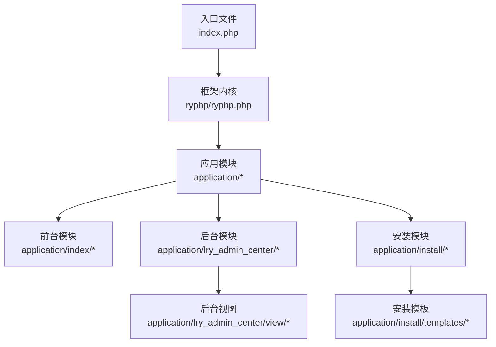
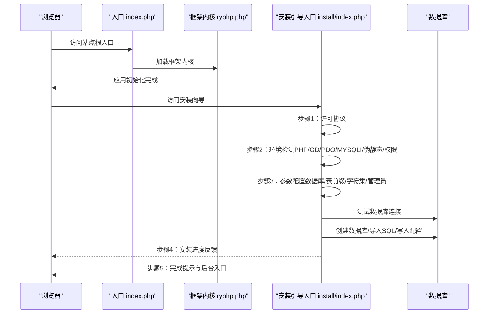
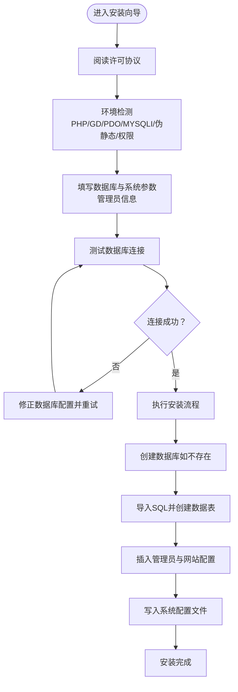
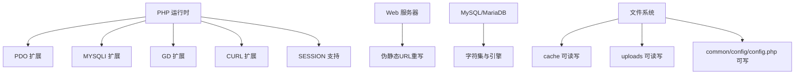

# 快速开始

<cite>
**本文引用的文件**
- [index.php](file://index.php)
- [ryphp.php](file://ryphp/ryphp.php)
- [config.php](file://common/config/config.php)
- [安装引导入口](file://application/install/index.php)
- [安装步骤一：许可协议](file://application/install/templates/s1.php)
- [安装步骤二：环境检测](file://application/install/templates/s2.php)
- [安装步骤三：参数配置与数据库连接测试](file://application/install/templates/s3.php)
- [安装步骤四：安装执行与进度展示](file://application/install/templates/s4.php)
- [安装步骤五：完成与后台入口](file://application/install/templates/s5.php)
- [后台登录页](file://application/lry_admin_center/view/login.html)
- [主题配置示例](file://application/index/view/rongyao/config.php)
- [PDO优化数据库适配器](file://ryphp/core/class/db_pdo_optimized.class.php)
- [MySQLi数据库适配器](file://ryphp/core/class/db_mysqli.class.php)
</cite>

## 目录
1. [简介](#简介)
2. [项目结构](#项目结构)
3. [核心组件](#核心组件)
4. [架构总览](#架构总览)
5. [详细组件解析](#详细组件解析)
6. [依赖关系分析](#依赖关系分析)
7. [性能与并发特性](#性能与并发特性)
8. [故障排查指南](#故障排查指南)
9. [首次访问与后台操作](#首次访问与后台操作)
10. [安全配置与生产部署建议](#安全配置与生产部署建议)
11. [结语](#结语)

## 简介
本指南面向首次部署 LRYBlog 博客系统的用户，目标是在约 30 分钟内完成从环境准备、安装部署、系统配置到首次访问与后台登录的全流程。文档覆盖以下要点：
- 环境准备要求（PHP 版本、MySQL、PDO 扩展、GD 库等）
- 完整安装步骤（数据库配置、文件权限、系统配置）
- 安装向导使用说明（数据库连接测试、管理员账户创建、初始配置）
- 常见安装问题排查与解决方案
- 首次访问系统操作（后台登录、基础功能测试）
- 安全配置建议与生产环境部署注意事项

## 项目结构
LRYBlog 采用“入口文件 + 框架内核 + 应用模块 + 安装向导 + 后台管理”的分层组织方式。核心入口负责加载框架内核，应用模块承载前台展示与后台管理，安装向导独立于应用模块之外，便于首次部署。

**图表来源**
- [index.php](file://index.php#L1-L18)
- [ryphp.php](file://ryphp/ryphp.php#L83-L204)

**章节来源**
- [index.php](file://index.php#L1-L18)
- [ryphp.php](file://ryphp/ryphp.php#L1-L204)

## 核心组件
- 入口与框架加载
  - 入口文件负责定义根路径、调试开关、URL 模式，并加载框架内核。
  - 框架内核负责常量定义、函数库加载、类加载机制与应用初始化。
- 数据库适配
  - 支持 PDO 与 MySQLi 两种数据库驱动，分别对应不同的适配器类。
- 安装向导
  - 提供五步式安装流程：许可协议 → 环境检测 → 参数配置 → 安装执行 → 完成提示。
- 后台登录
  - 提供验证码、AJAX 登录、错误提示与跳转逻辑。

**章节来源**
- [index.php](file://index.php#L10-L18)
- [ryphp.php](file://ryphp/ryphp.php#L83-L204)
- [PDO优化数据库适配器](file://ryphp/core/class/db_pdo_optimized.class.php#L87-L119)
- [MySQLi数据库适配器](file://ryphp/core/class/db_mysqli.class.php#L31-L60)
- [安装引导入口](file://application/install/index.php#L45-L275)
- [后台登录页](file://application/lry_admin_center/view/login.html#L14-L95)

## 架构总览
系统启动流程与安装向导的关键交互如下：

**图表来源**
- [index.php](file://index.php#L10-L18)
- [ryphp.php](file://ryphp/ryphp.php#L88-L90)
- [安装引导入口](file://application/install/index.php#L45-L275)
- [安装步骤二：环境检测](file://application/install/templates/s2.php#L20-L131)
- [安装步骤三：参数配置与数据库连接测试](file://application/install/templates/s3.php#L20-L213)
- [安装步骤四：安装执行与进度展示](file://application/install/templates/s4.php#L22-L73)
- [安装步骤五：完成与后台入口](file://application/install/templates/s5.php#L12-L20)

## 详细组件解析

### 环境准备与要求
- PHP 版本
  - 安装向导要求 PHP ≥ 5.4；推荐 PHP 7+，支持 PHP 8。
- 数据库与扩展
  - 至少安装 PDO_MYSQL 或 MYSQLI 扩展之一；推荐 PDO_MYSQL。
- 图像处理
  - 需启用 GD 扩展库。
- 伪静态与上传
  - 需开启伪静态；上传大小受 ini 设置影响。
- 目录权限
  - 需确保 cache、uploads、common 目录具备可读写权限；common/config/config.php 需可写。

**章节来源**
- [安装引导入口](file://application/install/index.php#L21-L28)
- [安装步骤二：环境检测](file://application/install/templates/s2.php#L35-L76)
- [安装步骤二：环境检测](file://application/install/templates/s2.php#L109-L127)

### 安装部署步骤
- 第一步：许可协议
  - 阅读并接受授权协议后进入下一步。
- 第二步：运行环境检测
  - 检测 PHP 版本、GD、PDO/MYSQLI、伪静态、SESSION、CURL、目录权限与配置文件权限。
- 第三步：安装参数设置
  - 填写数据库信息（驱动类型、主机、端口、用户名、密码、库名、表前缀、表引擎与字符集）、网站配置（名称、域名）与管理员信息（用户名、密码）。
  - 向导内置“测试数据库连接”按钮，使用 AJAX 调用安装脚本进行连接测试。
- 第四步：安装详细过程
  - 向导按顺序执行 SQL 导入、创建数据库（如不存在）、写入管理员与网站配置、生成系统密钥并更新配置文件。
- 第五步：安装完成
  - 显示后台入口链接与注意事项（如“批量更新URL”）。

**章节来源**
- [安装步骤一：许可协议](file://application/install/templates/s1.php#L14-L38)
- [安装步骤二：环境检测](file://application/install/templates/s2.php#L20-L131)
- [安装步骤三：参数配置与数据库连接测试](file://application/install/templates/s3.php#L20-L213)
- [安装步骤四：安装执行与进度展示](file://application/install/templates/s4.php#L22-L73)
- [安装步骤五：完成与后台入口](file://application/install/templates/s5.php#L12-L20)

### 数据库配置与系统配置
- 数据库配置
  - 在安装向导中选择数据库驱动（PDO_MYSQL 推荐），填写主机、端口、用户名、密码、库名、表前缀、表引擎与字符集。
  - 安装脚本会尝试连接数据库，若库不存在则自动创建。
- 系统配置
  - 安装完成后，系统会在 common/config/config.php 中写入数据库连接参数与系统密钥等配置。
  - 若配置文件不可写，安装脚本会提示手动赋予 0777 权限。

**章节来源**
- [安装步骤三：参数配置与数据库连接测试](file://application/install/templates/s3.php#L30-L83)
- [安装引导入口](file://application/install/index.php#L157-L189)
- [安装引导入口](file://application/install/index.php#L256-L259)
- [安装引导入口](file://application/install/index.php#L321-L335)
- [config.php](file://common/config/config.php#L13-L22)

### 安装向导使用说明
- 数据库连接测试
  - 在第三步页面点击“测试数据库连接”，向导通过 AJAX 调用安装脚本进行连接校验，返回结果后提示是否成功。
- 管理员账户创建
  - 在第三步页面填写管理员用户名与密码，安装脚本会生成加密后的管理员记录并写入数据库。
- 初始配置
  - 填写网站名称与域名，安装脚本会更新系统配置表中的站点信息。
- 安装执行与进度
  - 第四步页面显示安装进度，包含建库、建表、导入数据、写配置等步骤，直至完成。

**图表来源**
- [安装步骤二：环境检测](file://application/install/templates/s2.php#L20-L131)
- [安装步骤三：参数配置与数据库连接测试](file://application/install/templates/s3.php#L142-L211)
- [安装步骤四：安装执行与进度展示](file://application/install/templates/s4.php#L28-L69)
- [安装引导入口](file://application/install/index.php#L157-L259)

**章节来源**
- [安装步骤三：参数配置与数据库连接测试](file://application/install/templates/s3.php#L142-L211)
- [安装步骤四：安装执行与进度展示](file://application/install/templates/s4.php#L28-L69)
- [安装引导入口](file://application/install/index.php#L157-L259)

### 首次访问系统与后台登录
- 访问前台首页
  - 安装完成后，系统已可正常访问前台页面。
- 后台登录
  - 安装完成页提供后台入口链接；也可直接访问后台登录页。
  - 登录页包含用户名、密码与验证码输入框，提交后通过 AJAX 请求进行登录校验。
  - 成功后跳转至后台主页，首次登录后建议立即进行“批量更新URL”等基础配置。

**章节来源**
- [安装步骤五：完成与后台入口](file://application/install/templates/s5.php#L12-L20)
- [后台登录页](file://application/lry_admin_center/view/login.html#L14-L95)

## 依赖关系分析
系统运行依赖如下关键要素：
- PHP 运行时与扩展：PDO 或 MYSQLI、GD、CURL、SESSION。
- Web 服务器：需支持伪静态（URL 重写）。
- 数据库：MySQL/MariaDB，字符集与存储引擎可按需选择。
- 目录权限：cache、uploads、common/config/config.php 可写。

**图表来源**
- [安装步骤二：环境检测](file://application/install/templates/s2.php#L35-L76)
- [安装步骤二：环境检测](file://application/install/templates/s2.php#L109-L127)
- [安装引导入口](file://application/install/index.php#L76-L86)

**章节来源**
- [安装步骤二：环境检测](file://application/install/templates/s2.php#L35-L76)
- [安装步骤二：环境检测](file://application/install/templates/s2.php#L109-L127)
- [安装引导入口](file://application/install/index.php#L76-L86)

## 性能与并发特性
- 数据库驱动选择
  - PDO 与 MYSQLI 两种驱动均可使用，安装向导默认优先使用 PDO_MYSQL；两者在安装阶段均能胜任。
- URL 模式与伪静态
  - 入口文件定义了 URL 模式，配合 Web 服务器伪静态可提升 SEO 与访问效率。
- 缓存与静态资源
  - 系统提供多种缓存类型配置（文件、Redis、Memcache），可根据部署环境选择合适的缓存方案。

**章节来源**
- [index.php](file://index.php#L16-L18)
- [config.php](file://common/config/config.php#L39-L66)

## 故障排查指南
- PHP 版本过低
  - 现象：安装时提示 PHP 版本过低。
  - 处理：升级至 PHP 5.4+，推荐 7+ 或 8。
- 未安装数据库扩展
  - 现象：环境检测显示未安装 PDO 与 MYSQLI。
  - 处理：安装 PDO_MYSQL 或 MYSQLI 扩展，并重启 Web 服务。
- GD 扩展未启用
  - 现象：图像处理相关功能异常。
  - 处理：启用 GD 扩展并重启服务。
- 伪静态未开启
  - 现象：后台或前台部分链接无法访问。
  - 处理：根据提示开启伪静态并刷新页面。
- 目录权限不足
  - 现象：安装时提示目录不可写或配置文件不可写。
  - 处理：赋予 cache、uploads、common/config/config.php 0777 权限。
- 数据库连接失败
  - 现象：第三步“测试数据库连接”失败。
  - 处理：核对主机、端口、用户名、密码与库名；确保数据库服务可达；必要时使用 MYSQLI 替代 PDO。
- 安装中途报错
  - 现象：第四步安装过程中出现错误提示。
  - 处理：根据提示修复数据库权限、字符集或表引擎设置；检查 Web 服务器防火墙策略。

**章节来源**
- [安装引导入口](file://application/install/index.php#L21-L28)
- [安装步骤二：环境检测](file://application/install/templates/s2.php#L70-L94)
- [安装步骤三：参数配置与数据库连接测试](file://application/install/templates/s3.php#L142-L211)
- [安装步骤四：安装执行与进度展示](file://application/install/templates/s4.php#L55-L60)
- [安装引导入口](file://application/install/index.php#L321-L335)

## 首次访问与后台操作
- 访问前台
  - 安装完成后即可访问站点首页，浏览文章与页面。
- 后台登录
  - 使用安装时创建的管理员账户登录后台；登录页支持验证码切换与 AJAX 登录。
- 基础功能测试
  - 首次登录后建议执行“批量更新URL”等基础配置，确保链接与功能正常。
  - 可在后台查看主题配置与模板选择，例如主题 rongyao 的模板清单。

**章节来源**
- [安装步骤五：完成与后台入口](file://application/install/templates/s5.php#L12-L20)
- [后台登录页](file://application/lry_admin_center/view/login.html#L14-L95)
- [主题配置示例](file://application/index/view/rongyao/config.php#L1-L29)

## 安全配置与生产部署建议
- 文件权限
  - 安装完成后，建议回收 common/config/config.php 的写权限，仅在需要热更配置时临时开放。
- 伪静态与重定向
  - 生产环境务必开启伪静态，避免暴露原始查询字符串。
- 数据库安全
  - 使用专用数据库账号，最小权限原则；定期备份数据库。
- 缓存与会话
  - 根据部署规模选择 Redis/Memcache 缓存；合理设置 Cookie 域与路径，必要时启用 HttpOnly 与 Secure。
- 日志与监控
  - 非调试模式下启用错误日志保存，定期检查系统日志与数据库慢查询。

**章节来源**
- [config.php](file://common/config/config.php#L31-L37)
- [config.php](file://common/config/config.php#L39-L66)
- [config.php](file://common/config/config.php#L82-L86)

## 结语
按照本指南完成环境准备、安装部署与基础配置后，您即可在约 30 分钟内完成 LRYBlog 的上线运行。建议在生产环境中进一步完善安全与性能配置，并结合业务需求进行主题与插件的定制化开发。