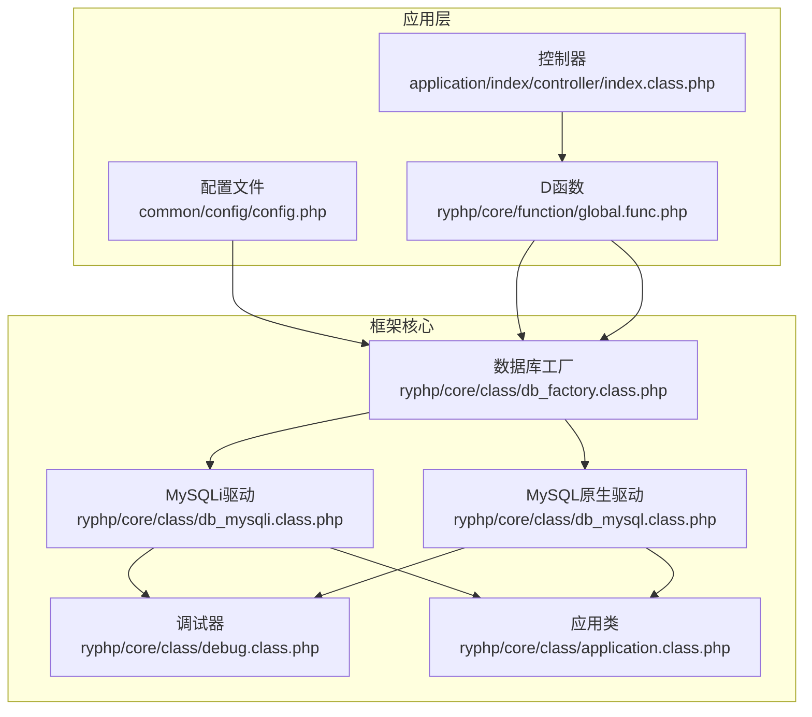
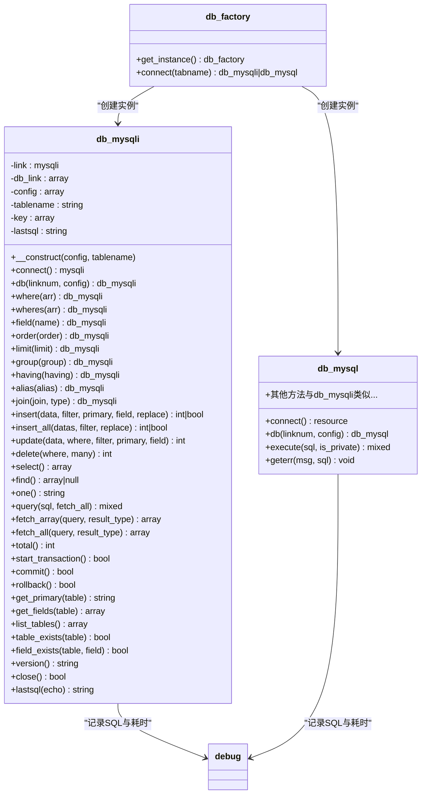
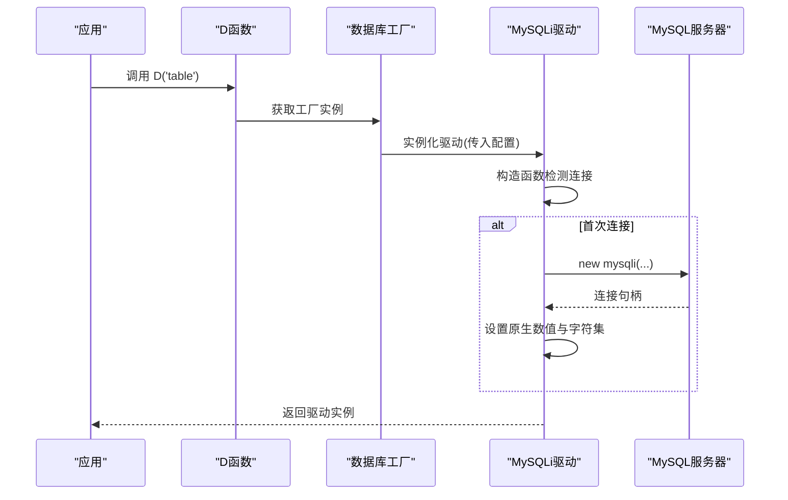
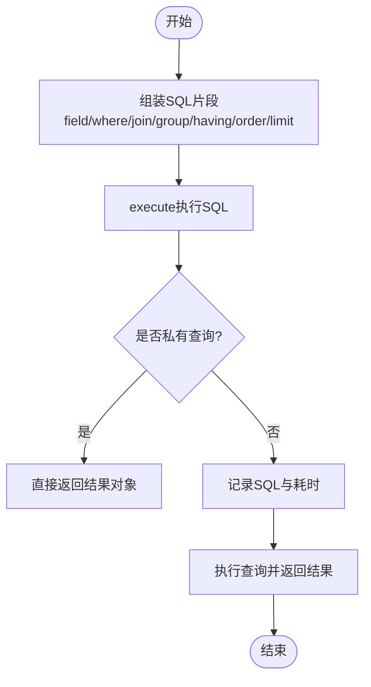
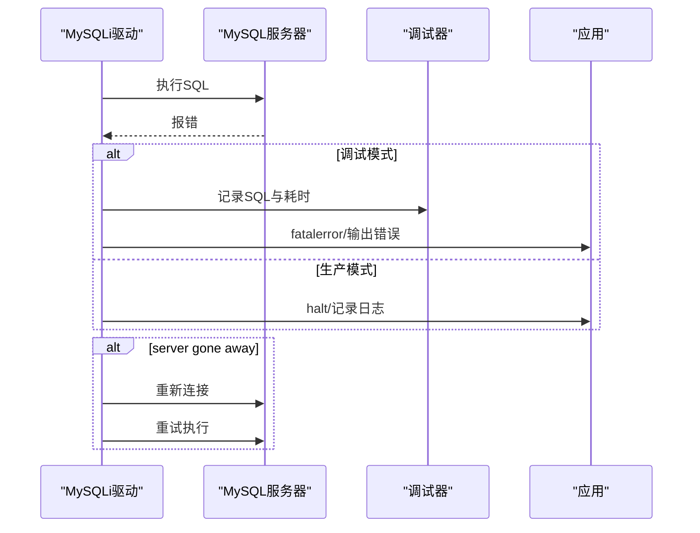
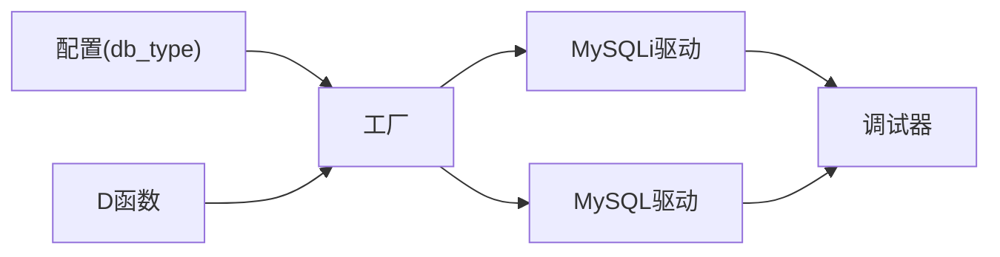

# MySQLi数据库驱动

<cite>
**本文档引用的文件**
- [db_mysqli.class.php](file://ryphp/core/class/db_mysqli.class.php)
- [db_mysql.class.php](file://ryphp/core/class/db_mysql.class.php)
- [db_factory.class.php](file://ryphp/core/class/db_factory.class.php)
- [global.func.php](file://ryphp/core/function/global.func.php)
- [config.php](file://common/config/config.php)
- [index.class.php](file://application/index/controller/index.class.php)
- [debug.class.php](file://ryphp/core/class/debug.class.php)
- [application.class.php](file://ryphp/core/class/application.class.php)
</cite>

## 目录
1. [简介](#简介)
2. [项目结构](#项目结构)
3. [核心组件](#核心组件)
4. [架构总览](#架构总览)
5. [详细组件分析](#详细组件分析)
6. [依赖关系分析](#依赖关系分析)
7. [性能考虑](#性能考虑)
8. [故障排查指南](#故障排查指南)
9. [结论](#结论)
10. [附录](#附录)

## 简介
本技术文档围绕LRYBlog框架中的MySQLi数据库驱动展开，系统性介绍其面向对象特性、连接管理、查询执行、事务控制、错误处理、性能优化以及与MySQL原生驱动的对比。文档同时提供基于仓库源码的架构图、流程图与最佳实践建议，帮助开发者快速理解并正确使用该驱动。

## 项目结构
LRYBlog采用分层架构，数据库驱动位于核心框架层，通过工厂模式按配置动态选择具体驱动实现；应用层通过统一入口函数D()获取模型实例，进而进行数据库操作。

图表来源
- [config.php](file://common/config/config.php#L13-L21)
- [db_factory.class.php](file://ryphp/core/class/db_factory.class.php#L14-L31)
- [global.func.php](file://ryphp/core/function/global.func.php#L100-L108)
- [index.class.php](file://application/index/controller/index.class.php#L14-L17)
- [db_mysqli.class.php](file://ryphp/core/class/db_mysqli.class.php#L10-L28)
- [db_mysql.class.php](file://ryphp/core/class/db_mysql.class.php#L10-L28)
- [debug.class.php](file://ryphp/core/class/debug.class.php#L116-L128)
- [application.class.php](file://ryphp/core/class/application.class.php#L108-L115)

章节来源
- [config.php](file://common/config/config.php#L13-L21)
- [db_factory.class.php](file://ryphp/core/class/db_factory.class.php#L11-L34)
- [global.func.php](file://ryphp/core/function/global.func.php#L100-L108)
- [index.class.php](file://application/index/controller/index.class.php#L14-L17)

## 核心组件
- 数据库工厂：根据配置选择具体驱动（mysqli/mysql/pdo），并负责连接实例化。
- MySQLi驱动：提供面向对象的连接、查询、事务、元数据等能力。
- MySQL原生驱动：兼容旧版扩展，提供类似功能但已标记废弃。
- D函数：应用层统一入口，返回对应表的数据库操作对象。
- 调试与错误处理：统一的错误捕获、日志记录与页面提示。

章节来源
- [db_factory.class.php](file://ryphp/core/class/db_factory.class.php#L11-L34)
- [db_mysqli.class.php](file://ryphp/core/class/db_mysqli.class.php#L10-L28)
- [db_mysql.class.php](file://ryphp/core/class/db_mysql.class.php#L10-L28)
- [global.func.php](file://ryphp/core/function/global.func.php#L100-L108)
- [debug.class.php](file://ryphp/core/class/debug.class.php#L116-L128)
- [application.class.php](file://ryphp/core/class/application.class.php#L108-L115)

## 架构总览
MySQLi驱动采用单例连接池设计，支持多连接切换与资源复用；通过链式API构建SQL，内部封装安全过滤与错误处理；提供事务控制、元数据查询与版本信息获取。

图表来源
- [db_factory.class.php](file://ryphp/core/class/db_factory.class.php#L11-L34)
- [db_mysqli.class.php](file://ryphp/core/class/db_mysqli.class.php#L10-L660)
- [db_mysql.class.php](file://ryphp/core/class/db_mysql.class.php#L10-L667)
- [debug.class.php](file://ryphp/core/class/debug.class.php#L116-L128)

## 详细组件分析

### 面向对象特性与连接管理
- 单例连接池：类内维护静态连接与配置池，首次使用时建立连接并设置原生整型/浮点返回、字符集。
- 多连接切换：支持通过db()方法切换不同数据库连接，避免重复连接。
- 安全初始化：构造函数延迟连接，确保只在真正使用时建立连接。

图表来源
- [global.func.php](file://ryphp/core/function/global.func.php#L100-L108)
- [db_factory.class.php](file://ryphp/core/class/db_factory.class.php#L38-L49)
- [db_mysqli.class.php](file://ryphp/core/class/db_mysqli.class.php#L23-L46)

章节来源
- [db_mysqli.class.php](file://ryphp/core/class/db_mysqli.class.php#L12-L28)
- [db_mysqli.class.php](file://ryphp/core/class/db_mysqli.class.php#L36-L46)
- [db_mysqli.class.php](file://ryphp/core/class/db_mysqli.class.php#L64-L75)

### 查询执行与链式API
- 链式API：where/wheres/field/order/limit/group/having/alias/join等方法返回自身，便于连续调用。
- 安全过滤：safe_data对字符串进行转义与HTML实体处理；filter_field过滤非表字段与主键。
- 执行流程：execute内部记录SQL与耗时，捕获异常并重连“server has gone away”。

图表来源
- [db_mysqli.class.php](file://ryphp/core/class/db_mysqli.class.php#L134-L150)
- [db_mysqli.class.php](file://ryphp/core/class/db_mysqli.class.php#L384-L400)
- [debug.class.php](file://ryphp/core/class/debug.class.php#L116-L128)

章节来源
- [db_mysqli.class.php](file://ryphp/core/class/db_mysqli.class.php#L159-L186)
- [db_mysqli.class.php](file://ryphp/core/class/db_mysqli.class.php#L196-L242)
- [db_mysqli.class.php](file://ryphp/core/class/db_mysqli.class.php#L251-L258)
- [db_mysqli.class.php](file://ryphp/core/class/db_mysqli.class.php#L96-L103)
- [db_mysqli.class.php](file://ryphp/core/class/db_mysqli.class.php#L113-L125)
- [db_mysqli.class.php](file://ryphp/core/class/db_mysqli.class.php#L134-L150)

### 高级特性
- 预处理语句：未在MySQLi驱动中直接暴露prepare/stmt接口，但可通过自定义SQL与参数化查询实现；建议在业务层自行封装prepare。
- 多语句执行：query方法支持自定义SQL，可执行多条语句；注意安全与事务控制。
- 服务器信息：version()返回服务器版本信息。
- 元数据：get_primary/get_fields/list_tables/table_exists/field_exists用于表结构与存在性检查。

章节来源
- [db_mysqli.class.php](file://ryphp/core/class/db_mysqli.class.php#L476-L482)
- [db_mysqli.class.php](file://ryphp/core/class/db_mysqli.class.php#L647-L649)
- [db_mysqli.class.php](file://ryphp/core/class/db_mysqli.class.php#L577-L585)
- [db_mysqli.class.php](file://ryphp/core/class/db_mysqli.class.php#L607-L616)
- [db_mysqli.class.php](file://ryphp/core/class/db_mysqli.class.php#L624-L640)

### 错误处理机制
- 错误模式：支持调试模式与生产模式；调试模式输出详细错误与SQL；生产模式记录日志并统一提示。
- 异常捕获：execute中捕获异常，若为“server has gone away”，自动重建连接并重试。
- CLI模式：CLI环境下抛出异常，便于脚本化工具处理。

图表来源
- [db_mysqli.class.php](file://ryphp/core/class/db_mysqli.class.php#L514-L526)
- [db_mysqli.class.php](file://ryphp/core/class/db_mysqli.class.php#L134-L150)
- [application.class.php](file://ryphp/core/class/application.class.php#L93-L115)
- [debug.class.php](file://ryphp/core/class/debug.class.php#L116-L128)

章节来源
- [db_mysqli.class.php](file://ryphp/core/class/db_mysqli.class.php#L514-L526)
- [db_mysqli.class.php](file://ryphp/core/class/db_mysqli.class.php#L134-L150)
- [application.class.php](file://ryphp/core/class/application.class.php#L93-L115)
- [debug.class.php](file://ryphp/core/class/debug.class.php#L116-L128)

### 事务控制
- 开启事务：关闭自动提交。
- 提交/回滚：分别执行commit/rollback后恢复自动提交。
- 适用场景：批量插入/更新、跨表一致性操作。

章节来源
- [db_mysqli.class.php](file://ryphp/core/class/db_mysqli.class.php#L547-L569)

### 与MySQL原生驱动对比
- 驱动差异：
  - MySQLi：面向对象，支持原生数值返回、字符集设置、连接池、异常处理更完善。
  - MySQL：过程式接口，已标记废弃，功能相对简单。
- 选择建议：
  - 新项目优先使用MySQLi；历史项目可逐步迁移至PDO或MySQLi。

章节来源
- [db_mysql.class.php](file://ryphp/core/class/db_mysql.class.php#L36-L49)
- [db_mysqli.class.php](file://ryphp/core/class/db_mysqli.class.php#L36-L46)

## 依赖关系分析
- 配置依赖：数据库类型由配置决定，工厂据此加载对应驱动。
- 工厂依赖：D函数通过工厂创建驱动实例，屏蔽具体实现细节。
- 驱动依赖：MySQLi驱动依赖mysqli扩展，MySQL驱动依赖mysql扩展。
- 调试依赖：驱动执行SQL时记录到调试器，便于性能分析与问题定位。

图表来源
- [config.php](file://common/config/config.php#L13-L21)
- [db_factory.class.php](file://ryphp/core/class/db_factory.class.php#L14-L31)
- [global.func.php](file://ryphp/core/function/global.func.php#L100-L108)
- [debug.class.php](file://ryphp/core/class/debug.class.php#L116-L128)

章节来源
- [config.php](file://common/config/config.php#L13-L21)
- [db_factory.class.php](file://ryphp/core/class/db_factory.class.php#L11-L34)
- [global.func.php](file://ryphp/core/function/global.func.php#L100-L108)
- [debug.class.php](file://ryphp/core/class/debug.class.php#L116-L128)

## 性能考虑
- 原生数值返回：启用MYSQLI_OPT_INT_AND_FLOAT_NATIVE，减少类型转换开销。
- 字符集设置：统一设置字符集，避免后续编码转换。
- 连接池与复用：利用静态连接池避免频繁连接/断开。
- SQL调试：在调试模式下记录SQL与耗时，便于定位慢查询。
- 事务批处理：批量插入/更新时使用事务，减少往返次数。

章节来源
- [db_mysqli.class.php](file://ryphp/core/class/db_mysqli.class.php#L43-L45)
- [db_mysqli.class.php](file://ryphp/core/class/db_mysqli.class.php#L134-L150)
- [debug.class.php](file://ryphp/core/class/debug.class.php#L116-L128)

## 故障排查指南
- 连接失败：检查配置与网络；查看调试模式下的详细错误信息。
- “server has gone away”：驱动会自动重建连接并重试；确认连接超时与服务器状态。
- 生产环境错误：查看错误日志与统一错误页面；避免泄露敏感信息。
- CLI模式：直接抛出异常，便于脚本化工具捕获与处理。

章节来源
- [db_mysqli.class.php](file://ryphp/core/class/db_mysqli.class.php#L38-L42)
- [db_mysqli.class.php](file://ryphp/core/class/db_mysqli.class.php#L144-L148)
- [application.class.php](file://ryphp/core/class/application.class.php#L108-L115)

## 结论
MySQLi驱动在LRYBlog框架中提供了完善的面向对象数据库操作能力，具备连接池、链式API、事务控制、元数据查询与错误处理等特性。配合工厂模式与统一入口函数，开发者可以以最小成本完成数据库操作。建议在新项目中优先使用MySQLi或PDO，并结合事务与批量操作提升性能与一致性。

## 附录
- 实际使用示例（基于仓库源码）：
  - 控制器中通过D函数获取模型实例并执行查询。
  - 工厂根据配置选择驱动类型（默认为pdo，可在配置中改为mysqli）。

章节来源
- [index.class.php](file://application/index/controller/index.class.php#L14-L17)
- [config.php](file://common/config/config.php#L13-L21)
- [db_factory.class.php](file://ryphp/core/class/db_factory.class.php#L14-L31)