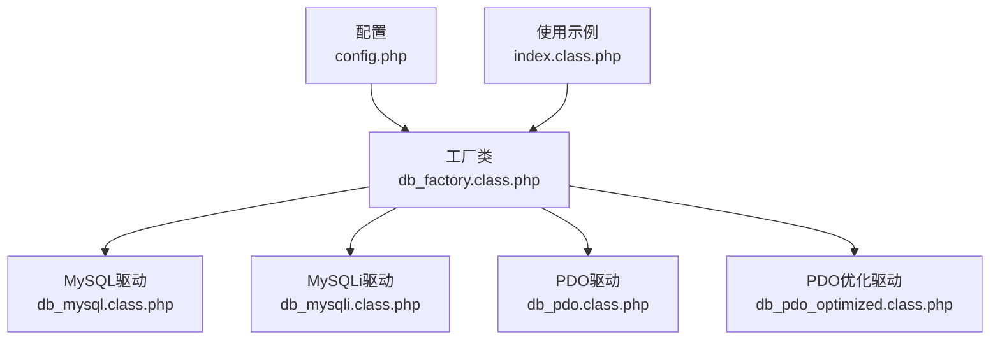
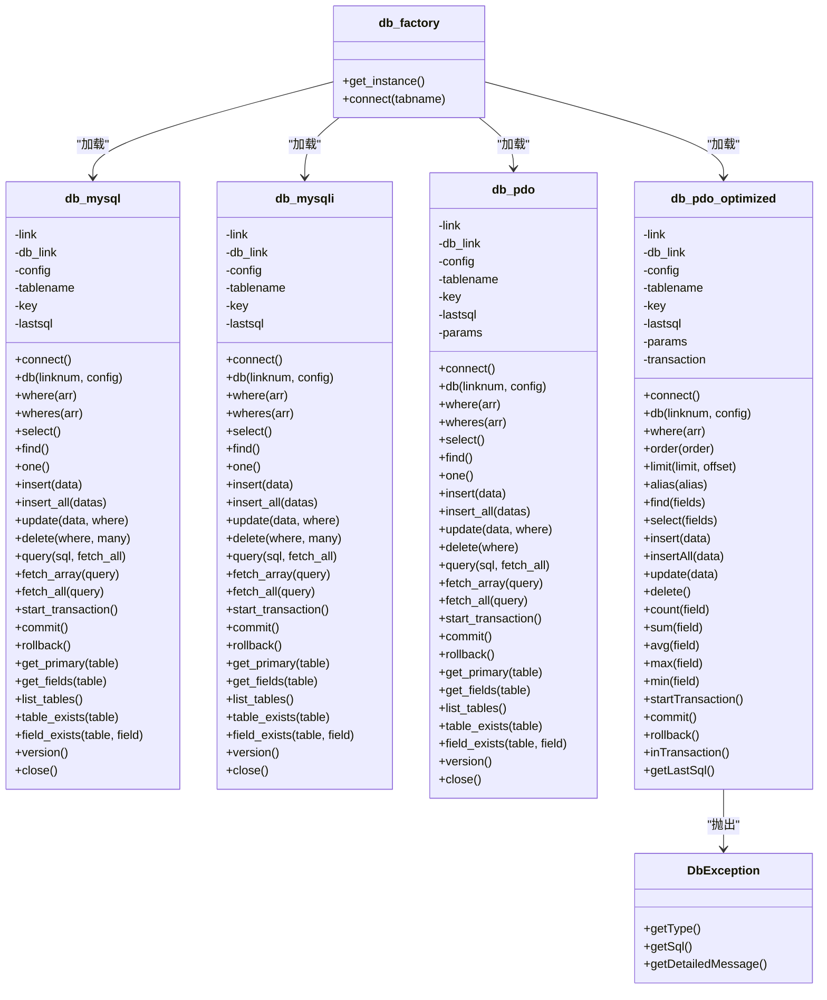
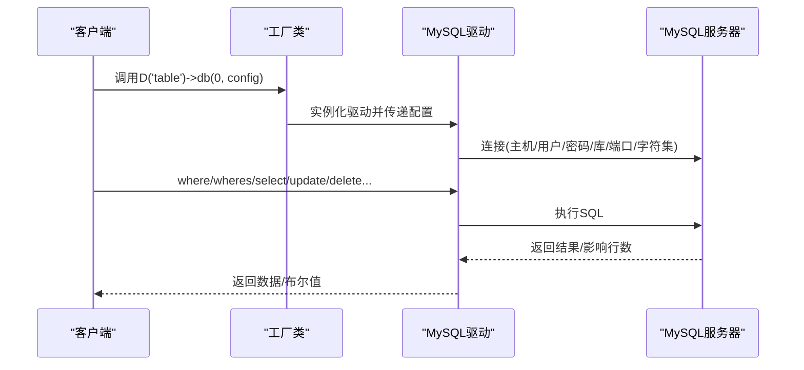
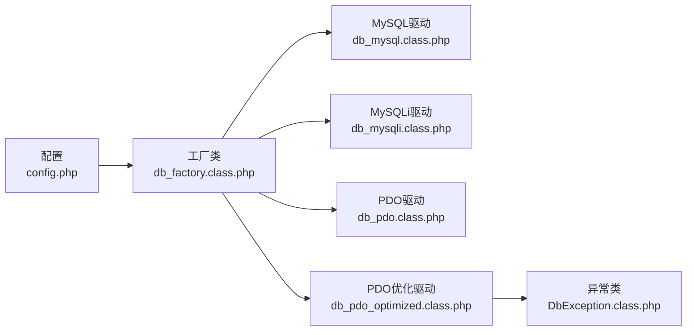

# MySQL数据库驱动

<cite>
**本文引用的文件列表**
- [db_mysql.class.php](file://ryphp/core/class/db_mysql.class.php)
- [db_mysqli.class.php](file://ryphp/core/class/db_mysqli.class.php)
- [db_pdo.class.php](file://ryphp/core/class/db_pdo.class.php)
- [db_pdo_optimized.class.php](file://ryphp/core/class/db_pdo_optimized.class.php)
- [db_factory.class.php](file://ryphp/core/class/db_factory.class.php)
- [DbException.class.php](file://ryphp/core/class/DbException.class.php)
- [config.php](file://common/config/config.php)
- [index.class.php](file://application/index/controller/index.class.php)
</cite>

## 目录
1. [简介](#简介)
2. [项目结构](#项目结构)
3. [核心组件](#核心组件)
4. [架构总览](#架构总览)
5. [详细组件分析](#详细组件分析)
6. [依赖关系分析](#依赖关系分析)
7. [性能考量](#性能考量)
8. [故障排查指南](#故障排查指南)
9. [结论](#结论)
10. [附录](#附录)

## 简介
本文件面向LRYBlog项目的MySQL数据库驱动实现，系统性梳理三种MySQL驱动（mysql、mysqli、PDO）的实现差异、连接管理机制、特性与限制、性能优化策略、错误处理与调试技巧，并提供与PDO驱动的对比分析及实际使用示例与常见问题解决方案，帮助开发者在不同场景下做出合适的选择。

## 项目结构
LRYBlog采用统一的工厂模式加载数据库驱动，根据配置选择具体驱动类并封装统一的查询接口。核心文件分布如下：
- 驱动实现：db_mysql.class.php、db_mysqli.class.php、db_pdo.class.php、db_pdo_optimized.class.php
- 工厂类：db_factory.class.php
- 异常类：DbException.class.php
- 配置：common/config/config.php
- 使用示例：application/index/controller/index.class.php

图表来源
- [db_factory.class.php](file://ryphp/core/class/db_factory.class.php#L14-L31)
- [config.php](file://common/config/config.php#L13-L22)
- [index.class.php](file://application/index/controller/index.class.php#L14-L17)

章节来源
- [db_factory.class.php](file://ryphp/core/class/db_factory.class.php#L1-L50)
- [config.php](file://common/config/config.php#L13-L22)

## 核心组件
- 工厂类：根据配置动态加载并实例化具体驱动类，提供统一的数据库连接入口。
- MySQL驱动：基于已废弃的mysql扩展，提供基础的连接、查询、事务等能力。
- MySQLi驱动：基于mysqli扩展，提供面向对象的连接、查询、事务等能力。
- PDO驱动：基于PDO扩展，提供预处理、绑定参数、丰富的属性控制等能力。
- PDO优化驱动：在PDO基础上增强异常处理、事务状态管理、聚合函数等能力。
- 异常类：DbException，提供类型化异常与SQL上下文信息。

章节来源
- [db_factory.class.php](file://ryphp/core/class/db_factory.class.php#L11-L50)
- [DbException.class.php](file://ryphp/core/class/DbException.class.php#L10-L73)

## 架构总览
三种驱动均通过工厂类按配置加载，内部维护连接池、表名拼接、条件组装、查询执行、结果获取、事务控制、元数据查询等功能。PDO优化版本进一步增强了异常体系与事务状态管理。

图表来源
- [db_factory.class.php](file://ryphp/core/class/db_factory.class.php#L14-L31)
- [db_mysql.class.php](file://ryphp/core/class/db_mysql.class.php#L10-L667)
- [db_mysqli.class.php](file://ryphp/core/class/db_mysqli.class.php#L10-L660)
- [db_pdo.class.php](file://ryphp/core/class/db_pdo.class.php#L10-L646)
- [db_pdo_optimized.class.php](file://ryphp/core/class/db_pdo_optimized.class.php#L13-L767)
- [DbException.class.php](file://ryphp/core/class/DbException.class.php#L10-L73)

## 详细组件分析

### 工厂类与连接管理
- 工厂类根据配置选择驱动类型，加载对应类并实例化。
- 统一提供db()方法切换连接，内部维护连接池，避免重复连接。
- 支持多连接编号，便于跨库或多实例场景。

章节来源
- [db_factory.class.php](file://ryphp/core/class/db_factory.class.php#L11-L50)
- [config.php](file://common/config/config.php#L13-L22)

### MySQL驱动（mysql扩展）
- 连接与字符集：使用mysql_connect建立连接并设置字符集；支持多连接池。
- 查询执行：封装execute方法，捕获异常并重连“server has gone away”。
- 条件组装：where与wheres支持多种表达式与函数回调；支持通配模糊匹配。
- 结果获取：提供select/find/one以及fetch_array/fetch_all。
- 事务：start_transaction/commit/rollback通过SQL与AUTOCOMMIT控制。
- 元数据：get_primary/get_fields/list_tables/table_exists/field_exists/version/close。

图表来源
- [db_mysql.class.php](file://ryphp/core/class/db_mysql.class.php#L36-L49)
- [db_mysql.class.php](file://ryphp/core/class/db_mysql.class.php#L136-L153)

章节来源
- [db_mysql.class.php](file://ryphp/core/class/db_mysql.class.php#L10-L667)

### MySQLi驱动（mysqli扩展）
- 连接与字符集：使用mysqli构造函数连接，设置原生整型/浮点与字符集。
- 查询执行：execute方法封装查询，支持“server has gone away”自动重连。
- 条件组装：与MySQL驱动一致的where/wheres接口。
- 结果获取：fetch_assoc/fetch_row等。
- 事务：autocommit(false)/commit/rollback。
- 元数据：同MySQL驱动。

章节来源
- [db_mysqli.class.php](file://ryphp/core/class/db_mysqli.class.php#L10-L660)

### PDO驱动（PDO扩展）
- 连接与参数：DNS包含主机、库、端口、字符集；设置PDO属性（错误模式、预处理、大小写等）。
- 预处理与绑定：where/wheres生成占位符并绑定参数，提升安全性与性能。
- 查询执行：prepare/execute，支持调试时拼接SQL便于定位。
- 结果获取：fetchAll/fetch。
- 事务：beginTransaction/commit/rollback。
- 元数据：同上。

章节来源
- [db_pdo.class.php](file://ryphp/core/class/db_pdo.class.php#L10-L646)

### PDO优化驱动（增强版PDO）
- 在PDO基础上新增：链式API（order/limit/alias）、聚合函数（count/sum/avg/max/min）、事务状态跟踪、更完善的异常类型与SQL上下文。
- 防误删保护：delete要求必须有where条件。
- 更强的where条件：支持数组形式的范围查询与绑定。

章节来源
- [db_pdo_optimized.class.php](file://ryphp/core/class/db_pdo_optimized.class.php#L13-L767)

### 条件组装与表达式支持
- where：支持数组条件与字符串条件；LIKE与等值判断；支持函数回调。
- wheres：增强版where，支持表达式字典（eq/neq/gt/egt/lt/elt/notlike/like/in/notin/between/notbetween）与回调函数白名单。

章节来源
- [db_mysql.class.php](file://ryphp/core/class/db_mysql.class.php#L158-L244)
- [db_mysqli.class.php](file://ryphp/core/class/db_mysqli.class.php#L155-L242)
- [db_pdo.class.php](file://ryphp/core/class/db_pdo.class.php#L129-L221)

### 事务与连接状态
- MySQL驱动：通过SQL与AUTOCOMMIT控制事务。
- MySQLi驱动：autocommit(false)/commit/rollback。
- PDO/PDO优化：beginTransaction/commit/rollback，PDO优化版本跟踪事务状态。

章节来源
- [db_mysql.class.php](file://ryphp/core/class/db_mysql.class.php#L549-L575)
- [db_mysqli.class.php](file://ryphp/core/class/db_mysqli.class.php#L547-L569)
- [db_pdo.class.php](file://ryphp/core/class/db_pdo.class.php#L527-L547)
- [db_pdo_optimized.class.php](file://ryphp/core/class/db_pdo_optimized.class.php#L708-L758)

### 元数据与工具方法
- 主键、字段、表清单、存在性检查、版本信息、关闭连接等。

章节来源
- [db_mysql.class.php](file://ryphp/core/class/db_mysql.class.php#L584-L665)
- [db_mysqli.class.php](file://ryphp/core/class/db_mysqli.class.php#L577-L658)
- [db_pdo.class.php](file://ryphp/core/class/db_pdo.class.php#L557-L644)
- [db_pdo_optimized.class.php](file://ryphp/core/class/db_pdo_optimized.class.php#L240-L321)

## 依赖关系分析
- 工厂类依赖配置读取与系统类加载器，按配置选择驱动。
- 三种驱动均依赖统一的条件组装、结果获取、元数据查询逻辑。
- PDO优化驱动依赖DbException进行类型化异常处理。

图表来源
- [config.php](file://common/config/config.php#L13-L22)
- [db_factory.class.php](file://ryphp/core/class/db_factory.class.php#L14-L31)
- [DbException.class.php](file://ryphp/core/class/DbException.class.php#L10-L73)

章节来源
- [db_factory.class.php](file://ryphp/core/class/db_factory.class.php#L1-L50)
- [DbException.class.php](file://ryphp/core/class/DbException.class.php#L10-L73)

## 性能考量
- 连接池与复用：工厂类维护连接池，避免重复连接开销。
- 预处理与绑定：PDO系列通过prepare/bind减少SQL解析与注入风险，适合高并发场景。
- 字符集与原生类型：MySQLi设置原生整型/浮点，减少类型转换成本。
- 查询缓存：框架未内置查询缓存，建议在业务层或应用层实现。
- 索引优化：驱动层不负责索引，应由数据库层与SQL设计保证。
- 批量操作：insert_all支持批量插入，减少往返次数。

章节来源
- [db_factory.class.php](file://ryphp/core/class/db_factory.class.php#L38-L49)
- [db_mysqli.class.php](file://ryphp/core/class/db_mysqli.class.php#L43-L44)
- [db_pdo.class.php](file://ryphp/core/class/db_pdo.class.php#L18-L24)

## 故障排查指南
- 连接失败：检查配置项（主机、端口、用户名、密码、字符集），工厂类会在连接失败时抛出或终止。
- “server has gone away”：三种驱动均具备自动重连机制，若仍失败，检查MySQL超时设置与网络稳定性。
- SQL错误：统一通过geterr方法处理，CLI模式抛出异常，Web模式根据调试开关输出或记录日志。
- PDO优化异常：DbException提供类型与SQL上下文，便于定位问题。

章节来源
- [db_mysql.class.php](file://ryphp/core/class/db_mysql.class.php#L38-L46)
- [db_mysqli.class.php](file://ryphp/core/class/db_mysqli.class.php#L38-L42)
- [db_pdo.class.php](file://ryphp/core/class/db_pdo.class.php#L37-L41)
- [db_mysql.class.php](file://ryphp/core/class/db_mysql.class.php#L146-L151)
- [db_mysqli.class.php](file://ryphp/core/class/db_mysqli.class.php#L144-L149)
- [db_pdo.class.php](file://ryphp/core/class/db_pdo.class.php#L118-L123)
- [DbException.class.php](file://ryphp/core/class/DbException.class.php#L32-L36)

## 结论
- 若追求兼容性与简单场景，可使用MySQL驱动（但注意其已废弃）。
- 若需要面向对象与更好的类型支持，优先选择MySQLi驱动。
- 若需要预处理、绑定参数、丰富属性控制与更强的异常体系，选择PDO或PDO优化驱动。
- 生产环境建议使用PDO系列，配合连接池、预处理与合理的索引设计，获得更佳的安全性与性能。

## 附录

### MySQL驱动特性与限制
- 特性：连接池、条件组装、事务、元数据查询、结果获取。
- 限制：mysql扩展已废弃，不支持新特性；字符集设置依赖SET NAMES。

章节来源
- [db_mysql.class.php](file://ryphp/core/class/db_mysql.class.php#L47-L48)

### MySQLi驱动特性与限制
- 特性：面向对象接口、原生整型/浮点、字符集设置、事务。
- 限制：无预处理绑定，易受注入影响。

章节来源
- [db_mysqli.class.php](file://ryphp/core/class/db_mysqli.class.php#L43-L44)

### PDO驱动特性与限制
- 特性：预处理、绑定参数、属性控制、异常模式、事务。
- 限制：需正确管理绑定参数与SQL结构。

章节来源
- [db_pdo.class.php](file://ryphp/core/class/db_pdo.class.php#L18-L24)

### PDO优化驱动增强点
- 增强API：链式API（order/limit/alias）、聚合函数、事务状态跟踪。
- 安全增强：delete强制where条件，防止误删。
- 异常增强：DbException类型化与SQL上下文。

章节来源
- [db_pdo_optimized.class.php](file://ryphp/core/class/db_pdo_optimized.class.php#L708-L758)
- [DbException.class.php](file://ryphp/core/class/DbException.class.php#L10-L73)

### 实际使用示例
- 控制器中通过D函数调用驱动进行查询。

章节来源
- [index.class.php](file://application/index/controller/index.class.php#L14-L17)

### 与PDO驱动的对比分析
- 安全性：PDO系列通过预处理与绑定显著降低注入风险。
- 性能：PDO系列在高并发下表现更稳定；MySQLi可减少类型转换。
- 易用性：PDO优化驱动提供更丰富的链式API与异常处理。
- 兼容性：MySQL驱动已废弃，不建议新项目使用。

章节来源
- [db_pdo.class.php](file://ryphp/core/class/db_pdo.class.php#L18-L24)
- [db_pdo_optimized.class.php](file://ryphp/core/class/db_pdo_optimized.class.php#L395-L435)