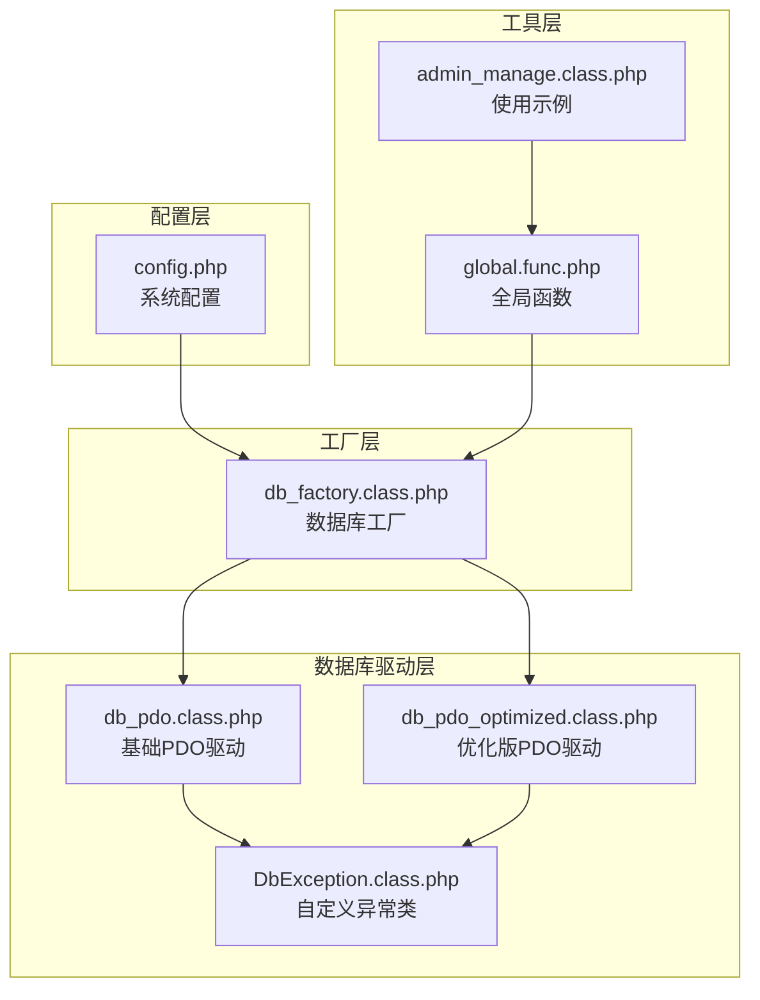
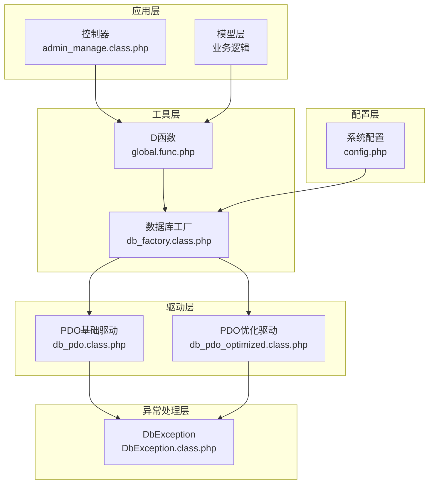
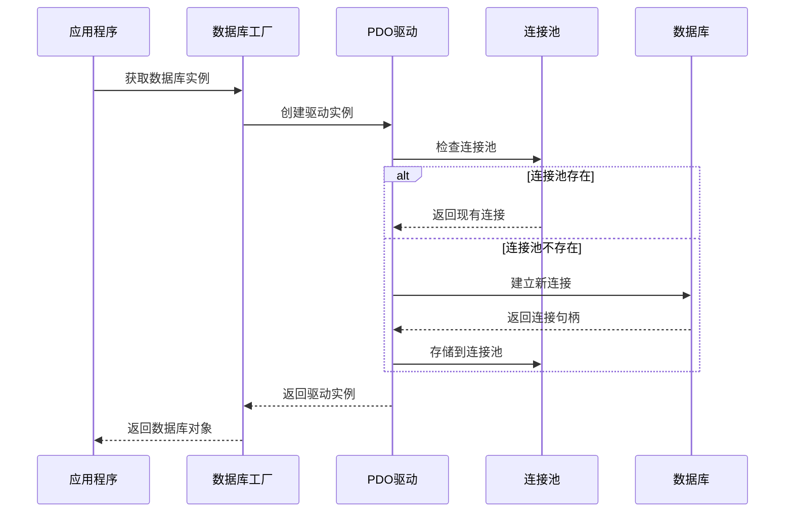
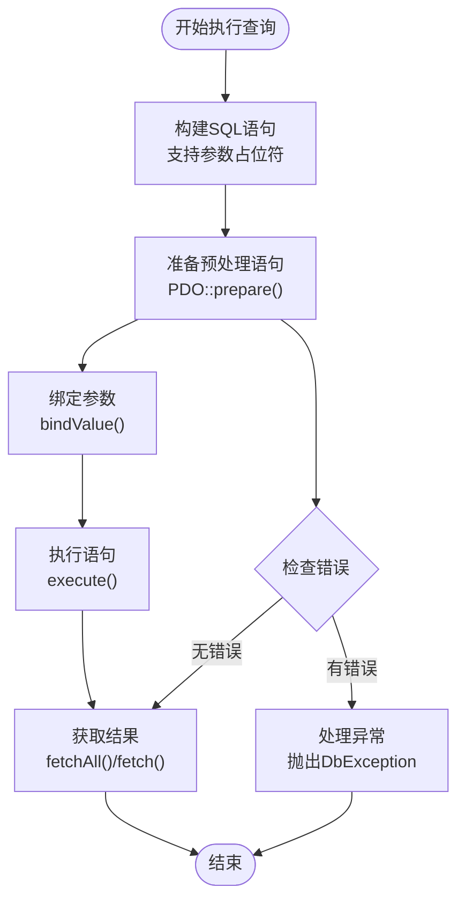
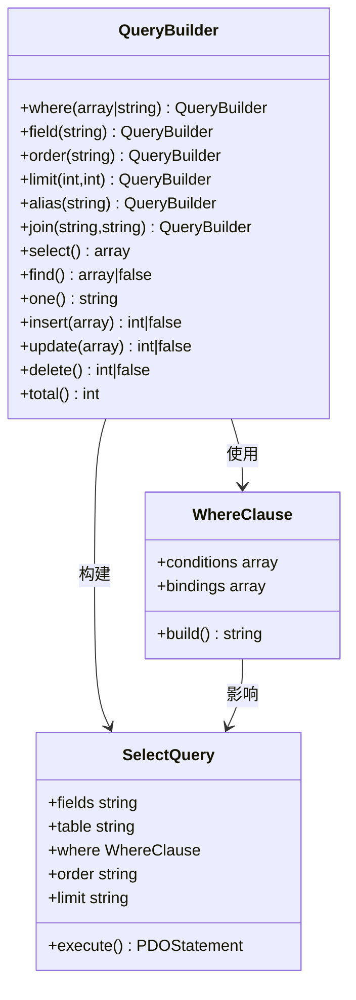
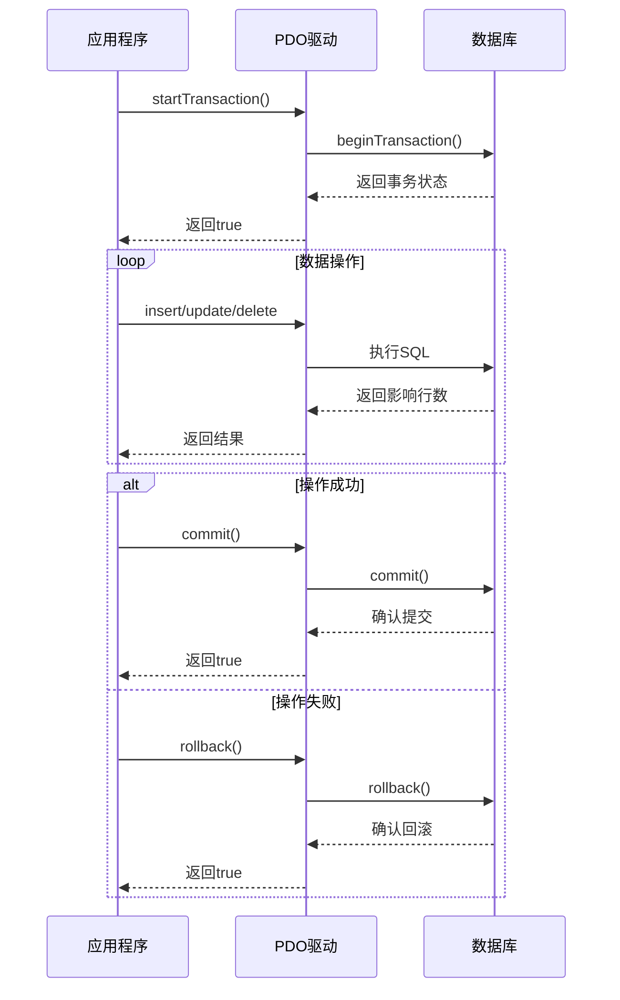
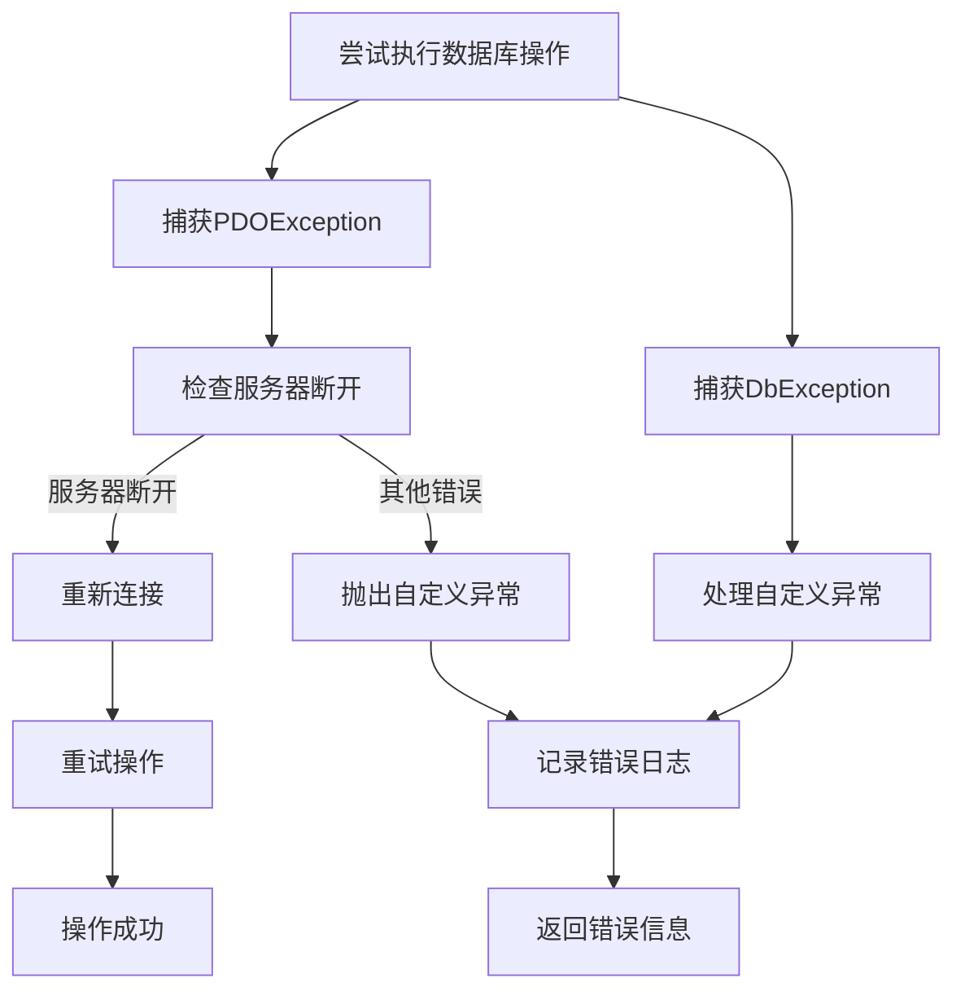
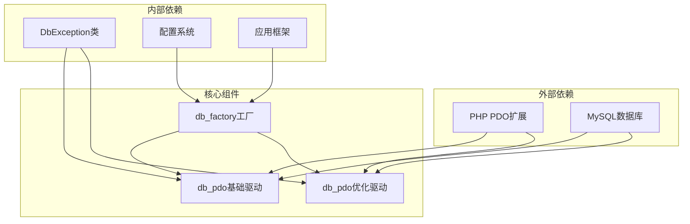
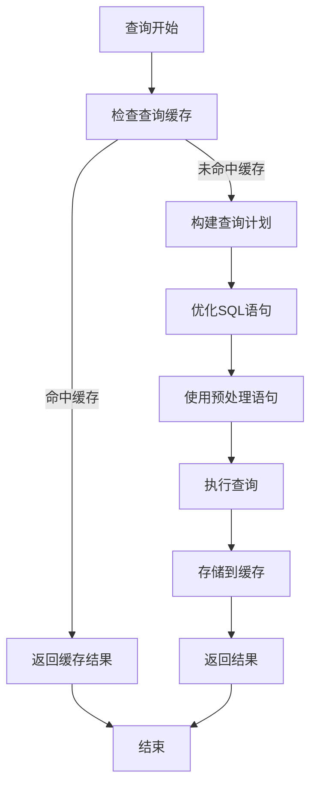

# PDO数据库驱动

<cite>
**本文档引用的文件**
- [db_pdo.class.php](file://ryphp/core/class/db_pdo.class.php)
- [db_pdo_optimized.class.php](file://ryphp/core/class/db_pdo_optimized.class.php)
- [db_factory.class.php](file://ryphp/core/class/db_factory.class.php)
- [DbException.class.php](file://ryphp/core/class/DbException.class.php)
- [config.php](file://common/config/config.php)
- [global.func.php](file://ryphp/core/function/global.func.php)
- [admin_manage.class.php](file://application/lry_admin_center/controller/admin_manage.class.php)
</cite>

## 目录
1. [简介](#简介)
2. [项目结构](#项目结构)
3. [核心组件](#核心组件)
4. [架构概览](#架构概览)
5. [详细组件分析](#详细组件分析)
6. [依赖关系分析](#依赖关系分析)
7. [性能考虑](#性能考虑)
8. [故障排除指南](#故障排除指南)
9. [结论](#结论)
10. [附录](#附录)

## 简介

LRYBlog项目中的PDO数据库驱动是一个基于PHP PDO扩展的数据库抽象层，提供了跨数据库兼容性和高级功能。该驱动实现了预处理语句、参数绑定、错误处理和事务管理等核心功能，同时提供了优化版本以提升性能和可靠性。

PDO驱动的主要优势包括：
- **预处理语句支持**：防止SQL注入攻击，提高查询安全性
- **参数绑定机制**：支持多种数据类型的参数绑定
- **跨数据库兼容性**：统一的API接口，支持多种数据库
- **错误处理机制**：完善的异常处理和错误报告
- **事务管理**：支持ACID事务特性
- **连接池管理**：高效的连接管理和复用机制

## 项目结构

LRYBlog项目的数据库相关文件组织如下：



**图表来源**
- [db_pdo.class.php](file://ryphp/core/class/db_pdo.class.php#L1-L646)
- [db_pdo_optimized.class.php](file://ryphp/core/class/db_pdo_optimized.class.php#L1-L767)
- [db_factory.class.php](file://ryphp/core/class/db_factory.class.php#L1-L50)

**章节来源**
- [db_pdo.class.php](file://ryphp/core/class/db_pdo.class.php#L1-L646)
- [db_pdo_optimized.class.php](file://ryphp/core/class/db_pdo_optimized.class.php#L1-L767)
- [db_factory.class.php](file://ryphp/core/class/db_factory.class.php#L1-L50)
- [config.php](file://common/config/config.php#L1-L88)

## 核心组件

### PDO基础驱动 (db_pdo.class.php)

基础PDO驱动提供了完整的数据库操作功能，包括：

- **连接管理**：支持单连接和连接池管理
- **查询构建器**：链式调用的查询构建器
- **数据操作**：CRUD操作的完整实现
- **事务处理**：完整的事务管理功能
- **错误处理**：详细的错误报告机制

### 优化版PDO驱动 (db_pdo_optimized.class.php)

优化版PDO驱动在基础版本上进行了重大改进：

- **自定义异常处理**：引入DbException类进行统一异常管理
- **增强的安全性**：改进的参数绑定和数据验证
- **性能优化**：优化的查询执行和内存管理
- **事务状态跟踪**：事务状态的精确跟踪
- **标准化API**：更加一致的接口设计

### 数据库工厂 (db_factory.class.php)

数据库工厂负责根据配置选择合适的数据库驱动：

- **动态驱动选择**：根据配置自动选择PDO、MySQLi或MySQL驱动
- **实例管理**：统一的数据库连接实例管理
- **配置传递**：将系统配置传递给数据库驱动

**章节来源**
- [db_pdo.class.php](file://ryphp/core/class/db_pdo.class.php#L10-L646)
- [db_pdo_optimized.class.php](file://ryphp/core/class/db_pdo_optimized.class.php#L13-L767)
- [db_factory.class.php](file://ryphp/core/class/db_factory.class.php#L11-L50)

## 架构概览

PDO数据库驱动采用分层架构设计，确保了良好的可维护性和扩展性：



**图表来源**
- [admin_manage.class.php](file://application/lry_admin_center/controller/admin_manage.class.php#L36-L41)
- [global.func.php](file://ryphp/core/function/global.func.php#L100-L108)
- [db_factory.class.php](file://ryphp/core/class/db_factory.class.php#L14-L31)
- [db_pdo.class.php](file://ryphp/core/class/db_pdo.class.php#L26-L31)
- [db_pdo_optimized.class.php](file://ryphp/core/class/db_pdo_optimized.class.php#L74-L80)

## 详细组件分析

### 连接管理机制

PDO驱动实现了高效的连接管理机制：



**图表来源**
- [db_pdo.class.php](file://ryphp/core/class/db_pdo.class.php#L45-L56)
- [db_pdo_optimized.class.php](file://ryphp/core/class/db_pdo_optimized.class.php#L106-L119)

连接管理的关键特性：
- **单例模式**：确保每个进程只有一个数据库连接
- **连接池**：支持多个连接的管理
- **自动重连**：网络断开时自动重新连接
- **配置管理**：集中管理数据库连接配置

### 预处理语句实现

PDO驱动提供了强大的预处理语句功能：



**图表来源**
- [db_pdo.class.php](file://ryphp/core/class/db_pdo.class.php#L100-L124)
- [db_pdo_optimized.class.php](file://ryphp/core/class/db_pdo_optimized.class.php#L180-L208)

预处理语句的关键特性：
- **参数绑定**：支持多种数据类型的参数绑定
- **类型安全**：防止SQL注入攻击
- **性能优化**：重复执行相同查询时的性能提升
- **调试支持**：支持SQL语句的调试和监控

### 查询构建器

PDO驱动提供了灵活的查询构建器：



**图表来源**
- [db_pdo.class.php](file://ryphp/core/class/db_pdo.class.php#L134-L221)
- [db_pdo_optimized.class.php](file://ryphp/core/class/db_pdo_optimized.class.php#L328-L357)

查询构建器的功能特性：
- **链式调用**：支持连续的方法调用
- **条件构建**：支持复杂的WHERE条件
- **字段选择**：灵活的字段选择和投影
- **排序和限制**：支持ORDER BY和LIMIT子句
- **连接查询**：支持多表连接

### 事务处理机制

PDO驱动提供了完整的事务管理功能：



**图表来源**
- [db_pdo.class.php](file://ryphp/core/class/db_pdo.class.php#L527-L547)
- [db_pdo_optimized.class.php](file://ryphp/core/class/db_pdo_optimized.class.php#L708-L750)

事务处理的关键特性：
- **自动提交控制**：支持手动和自动事务管理
- **回滚策略**：支持事务回滚和错误恢复
- **并发处理**：支持多线程环境下的事务隔离
- **状态跟踪**：精确的事务状态跟踪

### 错误处理和异常管理

PDO驱动提供了多层次的错误处理机制：



**图表来源**
- [db_pdo.class.php](file://ryphp/core/class/db_pdo.class.php#L117-L123)
- [db_pdo_optimized.class.php](file://ryphp/core/class/db_pdo_optimized.class.php#L201-L207)

错误处理的关键特性：
- **异常分类**：区分不同类型的数据库错误
- **自动重连**：网络断开时的自动恢复机制
- **详细日志**：完整的错误信息记录
- **用户友好**：生产环境下的用户友好错误消息

**章节来源**
- [db_pdo.class.php](file://ryphp/core/class/db_pdo.class.php#L100-L124)
- [db_pdo_optimized.class.php](file://ryphp/core/class/db_pdo_optimized.class.php#L180-L208)
- [DbException.class.php](file://ryphp/core/class/DbException.class.php#L10-L73)

## 依赖关系分析

PDO数据库驱动的依赖关系图：



**图表来源**
- [db_pdo.class.php](file://ryphp/core/class/db_pdo.class.php#L34-L35)
- [db_pdo_optimized.class.php](file://ryphp/core/class/db_pdo_optimized.class.php#L89-L90)
- [db_factory.class.php](file://ryphp/core/class/db_factory.class.php#L14-L27)

依赖关系特点：
- **低耦合**：驱动与具体数据库实现解耦
- **高内聚**：核心功能集中在单一类中
- **可扩展**：支持新的数据库驱动的轻松集成
- **向后兼容**：保持API的稳定性

**章节来源**
- [db_pdo.class.php](file://ryphp/core/class/db_pdo.class.php#L1-L646)
- [db_pdo_optimized.class.php](file://ryphp/core/class/db_pdo_optimized.class.php#L1-L767)
- [db_factory.class.php](file://ryphp/core/class/db_factory.class.php#L1-L50)

## 性能考虑

### 连接池优化

PDO驱动实现了高效的连接池管理：

- **连接复用**：避免频繁的数据库连接创建
- **资源回收**：及时释放不再使用的连接
- **连接监控**：监控连接状态和性能指标
- **自动清理**：定期清理无效的连接

### 查询优化策略



**图表来源**
- [db_pdo.class.php](file://ryphp/core/class/db_pdo.class.php#L100-L116)
- [db_pdo_optimized.class.php](file://ryphp/core/class/db_pdo_optimized.class.php#L430-L435)

查询优化的关键技术：
- **预处理语句**：减少SQL解析开销
- **参数绑定**：避免字符串拼接
- **结果集缓存**：缓存常用查询结果
- **批量操作**：支持批量插入和更新

### 内存管理优化

PDO驱动采用了多种内存管理策略：

- **延迟加载**：按需加载数据和资源
- **垃圾回收**：及时释放不再使用的对象
- **内存池**：重用临时对象和缓冲区
- **资源监控**：监控内存使用情况

## 故障排除指南

### 常见问题诊断

#### 连接问题

**症状**：无法连接到数据库
**可能原因**：
- 数据库服务未启动
- 连接凭据错误
- 网络连接问题
- 防火墙阻拦

**解决方案**：
1. 检查数据库服务状态
2. 验证配置文件中的连接信息
3. 测试网络连通性
4. 检查防火墙设置

#### 查询性能问题

**症状**：查询执行缓慢
**可能原因**：
- 缺少适当的索引
- SQL语句效率低下
- 连接池配置不当
- 数据库负载过高

**解决方案**：
1. 分析查询执行计划
2. 添加必要的索引
3. 优化SQL语句结构
4. 调整连接池大小

#### 事务处理问题

**症状**：事务无法正常提交或回滚
**可能原因**：
- 事务嵌套层次过深
- 锁冲突导致死锁
- 异常处理不当
- 数据库配置问题

**解决方案**：
1. 简化事务结构
2. 实现适当的锁管理
3. 完善异常处理逻辑
4. 检查数据库配置

### 调试技巧

#### 启用调试模式

在开发环境中启用调试模式可以获得详细的错误信息：

```php
// 在配置中设置调试模式
define('RYPHP_DEBUG', true);
```

#### 日志记录

PDO驱动会自动记录重要的数据库操作：

- SQL语句执行时间
- 错误发生的具体位置
- 参数绑定的详细信息
- 连接状态变化

#### 性能监控

使用内置的性能监控功能：

```php
// 获取最后执行的SQL语句
$lastSql = $db->lastsql(false);

// 获取查询执行时间
$executionTime = debug::getLastExecutionTime();
```

**章节来源**
- [db_pdo.class.php](file://ryphp/core/class/db_pdo.class.php#L492-L505)
- [db_pdo_optimized.class.php](file://ryphp/core/class/db_pdo_optimized.class.php#L216-L233)

## 结论

LRYBlog项目的PDO数据库驱动是一个功能完整、设计合理的数据库抽象层。它提供了以下主要优势：

### 技术优势

1. **安全性**：通过预处理语句和参数绑定有效防止SQL注入
2. **性能**：优化的连接管理和查询执行机制
3. **可靠性**：完善的错误处理和异常管理
4. **可维护性**：清晰的架构设计和模块化组织
5. **可扩展性**：支持多种数据库和自定义扩展

### 最佳实践建议

1. **使用预处理语句**：始终使用参数绑定而不是字符串拼接
2. **合理使用事务**：在需要ACID特性的场景中使用事务
3. **监控性能指标**：定期检查查询性能和连接使用情况
4. **错误处理**：实现完善的异常处理和错误恢复机制
5. **配置管理**：通过配置文件集中管理数据库连接信息

### 未来发展

PDO驱动的设计为未来的功能扩展奠定了良好基础，包括：
- 支持更多数据库类型
- 集成ORM功能
- 增强缓存机制
- 提供更多的性能优化选项

## 附录

### API参考

#### 基础查询方法

| 方法 | 参数 | 返回值 | 描述 |
|------|------|--------|------|
| `where()` | array|string | self | 设置查询条件 |
| `field()` | string | self | 设置查询字段 |
| `order()` | string | self | 设置排序规则 |
| `limit()` | int,int | self | 设置限制条件 |
| `select()` | - | array | 执行查询并返回结果集 |
| `find()` | - | array|false | 查询单条记录 |
| `one()` | - | string | 查询单个字段值 |

#### 数据操作方法

| 方法 | 参数 | 返回值 | 描述 |
|------|------|--------|------|
| `insert()` | array,filter,primary,field,replace | int|false | 插入数据 |
| `insert_all()` | array,filter,replace | int|false | 批量插入数据 |
| `update()` | array,array,filter,primary,field | int|false | 更新数据 |
| `delete()` | array,many | int|false | 删除数据 |
| `total()` | - | int | 获取记录总数 |

#### 事务管理方法

| 方法 | 参数 | 返回值 | 描述 |
|------|------|--------|------|
| `start_transaction()` | - | boolean | 开始事务 |
| `commit()` | - | boolean | 提交事务 |
| `rollback()` | - | boolean | 回滚事务 |

### 配置选项

#### 数据库配置

| 配置项 | 默认值 | 描述 |
|--------|--------|------|
| `db_type` | 'pdo' | 数据库类型 |
| `db_host` | '127.0.0.1' | 数据库主机地址 |
| `db_name` | 'rycms' | 数据库名称 |
| `db_user` | 'root' | 用户名 |
| `db_pwd` | '' | 密码 |
| `db_port` | 3306 | 端口号 |
| `db_charset` | 'utf8' | 字符集 |
| `db_prefix` | 'rycms_' | 表前缀 |

### 使用示例

#### 基本查询示例

```php
// 获取管理员列表
$admin = D('admin');
$total = $admin->where(['status' => 1])->total();
$data = $admin->where(['status' => 1])->order('id DESC')->limit(20)->select();
```

#### 数据插入示例

```php
// 插入新用户
$userData = [
    'username' => 'john_doe',
    'email' => 'john@example.com',
    'created_at' => time()
];
$userId = $admin->insert($userData);
```

#### 事务处理示例

```php
try {
    $db->start_transaction();
    
    // 执行多个相关操作
    $db->insert($userData);
    $db->update($settings, ['user_id' => $userId]);
    
    $db->commit();
} catch (Exception $e) {
    $db->rollback();
    throw $e;
}
```

**章节来源**
- [admin_manage.class.php](file://application/lry_admin_center/controller/admin_manage.class.php#L36-L41)
- [global.func.php](file://ryphp/core/function/global.func.php#L100-L108)
- [config.php](file://common/config/config.php#L13-L22)