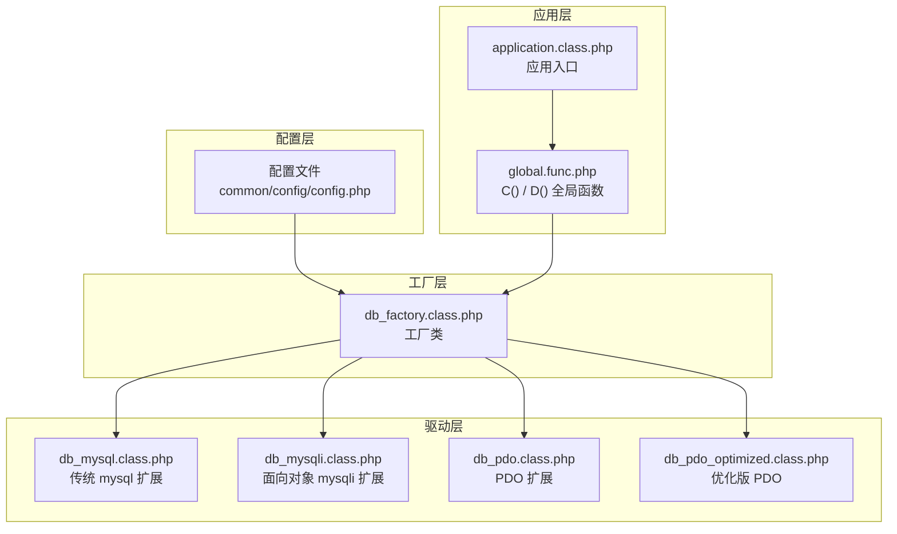
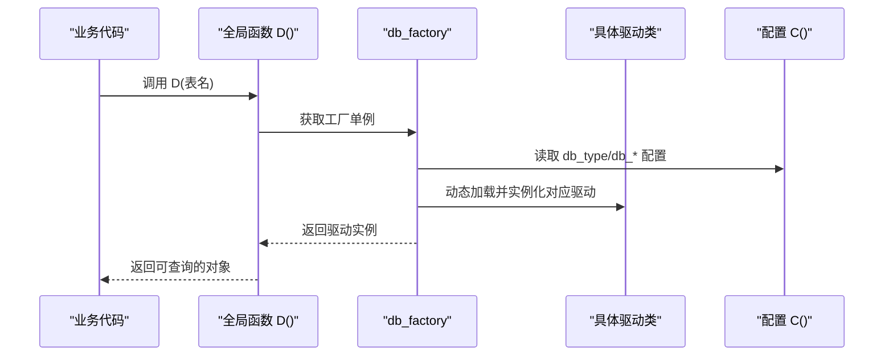
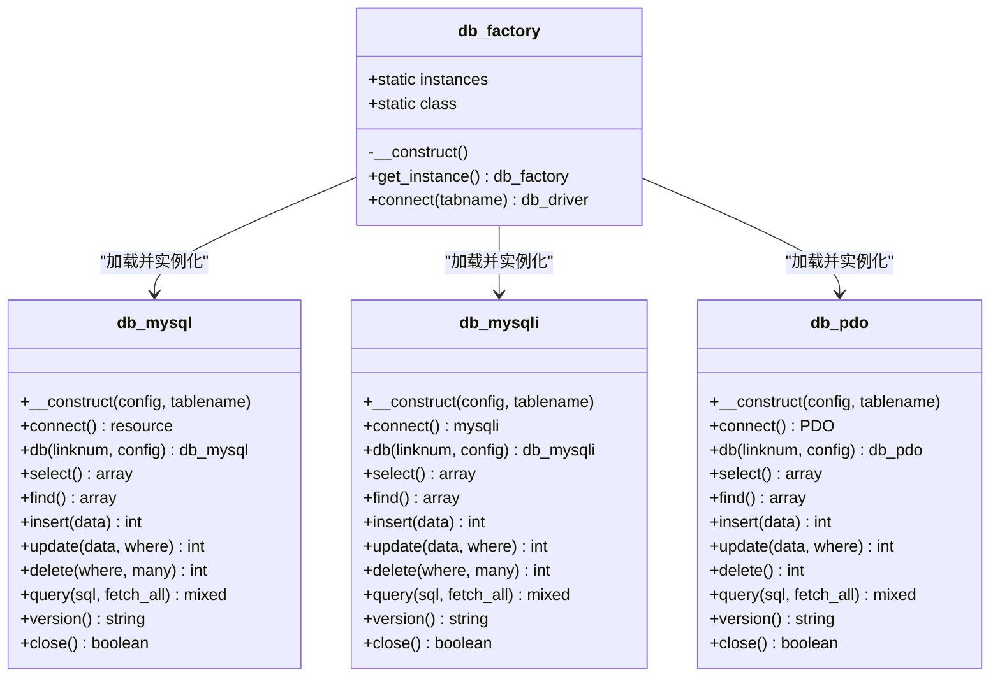
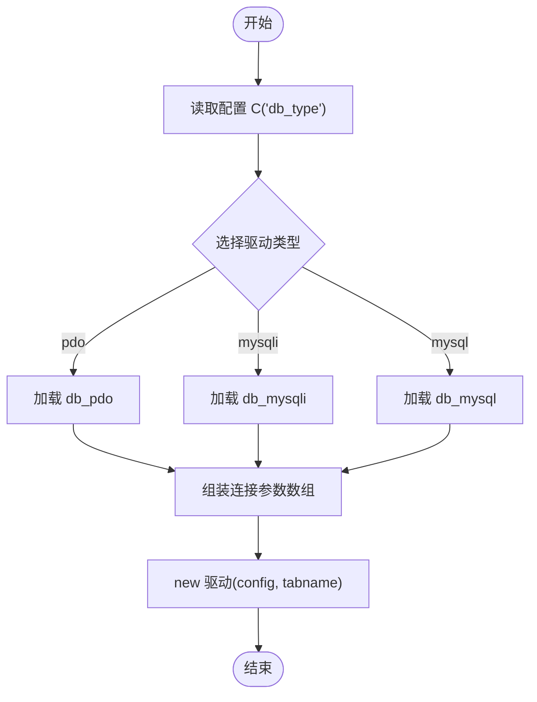
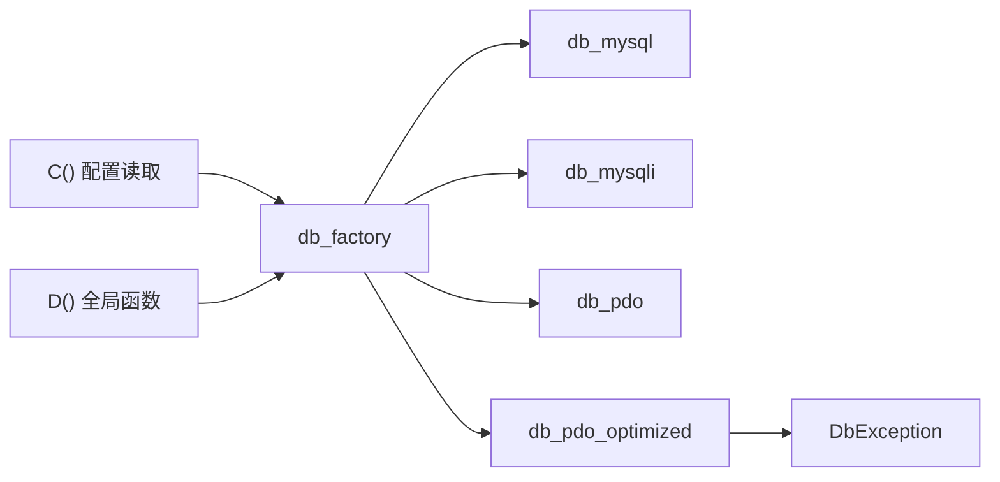

# 数据库工厂模式

<cite>
**本文引用的文件**
- [db_factory.class.php](file://ryphp/core/class/db_factory.class.php)
- [db_mysql.class.php](file://ryphp/core/class/db_mysql.class.php)
- [db_mysqli.class.php](file://ryphp/core/class/db_mysqli.class.php)
- [db_pdo.class.php](file://ryphp/core/class/db_pdo.class.php)
- [db_pdo_optimized.class.php](file://ryphp/core/class/db_pdo_optimized.class.php)
- [config.php](file://common/config/config.php)
- [global.func.php](file://ryphp/core/function/global.func.php)
- [DbException.class.php](file://ryphp/core/class/DbException.class.php)
- [application.class.php](file://ryphp/core/class/application.class.php)
</cite>

## 目录
1. [简介](#简介)
2. [项目结构](#项目结构)
3. [核心组件](#核心组件)
4. [架构总览](#架构总览)
5. [详细组件分析](#详细组件分析)
6. [依赖关系分析](#依赖关系分析)
7. [性能考量](#性能考量)
8. [故障排查指南](#故障排查指南)
9. [结论](#结论)

## 简介
本技术文档围绕 LRYBlog 的数据库工厂模式展开，系统性阐述工厂模式在数据库连接中的应用，包括：
- 工厂类的单例实现与静态实例管理
- 通过配置参数动态选择不同数据库驱动（mysql、mysqli、pdo）
- 工厂类的初始化流程与连接参数传递机制
- 主机、用户名、密码、数据库名、端口、字符集、表前缀等配置方式
- 实际应用场景与最佳实践
- 错误处理机制与异常策略
- 驱动选择决策与性能对比分析

## 项目结构
LRYBlog 的数据库层采用“工厂 + 多驱动实现”的架构设计，核心文件分布如下：
- 工厂类：负责根据配置选择具体驱动并管理单例实例
- 驱动实现：mysql、mysqli、pdo 三种驱动分别封装各自连接与查询逻辑
- 配置中心：统一从配置文件读取数据库连接参数
- 全局函数：提供 C() 函数用于读取配置，D() 函数用于获取模型实例

图表来源
- [db_factory.class.php](file://ryphp/core/class/db_factory.class.php#L1-L50)
- [db_mysql.class.php](file://ryphp/core/class/db_mysql.class.php#L1-L667)
- [db_mysqli.class.php](file://ryphp/core/class/db_mysqli.class.php#L1-L660)
- [db_pdo.class.php](file://ryphp/core/class/db_pdo.class.php#L1-L646)
- [db_pdo_optimized.class.php](file://ryphp/core/class/db_pdo_optimized.class.php#L1-L767)
- [config.php](file://common/config/config.php#L1-L88)
- [global.func.php](file://ryphp/core/function/global.func.php#L1-L200)
- [application.class.php](file://ryphp/core/class/application.class.php#L1-L118)

章节来源
- [db_factory.class.php](file://ryphp/core/class/db_factory.class.php#L1-L50)
- [config.php](file://common/config/config.php#L13-L22)
- [global.func.php](file://ryphp/core/function/global.func.php#L100-L108)

## 核心组件
- 工厂类（db_factory）：负责根据配置选择具体驱动，维护单例实例，向外部暴露统一的连接接口
- 驱动实现类：mysql、mysqli、pdo 三类驱动，均实现统一的查询构建与执行接口
- 配置读取函数（C）：集中读取配置，支持默认值与静态缓存
- 全局便捷函数（D）：通过工厂类获取模型实例，简化上层调用

章节来源
- [db_factory.class.php](file://ryphp/core/class/db_factory.class.php#L11-L50)
- [db_mysql.class.php](file://ryphp/core/class/db_mysql.class.php#L10-L667)
- [db_mysqli.class.php](file://ryphp/core/class/db_mysqli.class.php#L10-L660)
- [db_pdo.class.php](file://ryphp/core/class/db_pdo.class.php#L10-L646)
- [db_pdo_optimized.class.php](file://ryphp/core/class/db_pdo_optimized.class.php#L13-L767)
- [global.func.php](file://ryphp/core/function/global.func.php#L4-L26)

## 架构总览
工厂模式在数据库层的职责：
- 解耦上层业务与底层驱动差异
- 统一配置参数传递与连接生命周期管理
- 支持运行时切换数据库驱动类型

图表来源
- [global.func.php](file://ryphp/core/function/global.func.php#L100-L108)
- [db_factory.class.php](file://ryphp/core/class/db_factory.class.php#L11-L50)
- [config.php](file://common/config/config.php#L13-L22)

## 详细组件分析

### 工厂类（db_factory）
- 单例与静态实例管理
  - 类内维护静态实例与静态类名，首次调用时创建实例并根据配置选择驱动
  - 通过 switch 分支加载对应驱动类，确保只加载一次
- 初始化与连接参数传递
  - get_instance 返回工厂单例
  - connect 方法接收表名，构造包含 db_host、db_user、db_pwd、db_name、db_port、db_charset、db_prefix 的配置数组，传递给具体驱动类
- 驱动选择策略
  - 根据配置项 db_type 选择 mysql、mysqli 或 pdo
  - 默认回退到 mysql，保证兼容性

图表来源
- [db_factory.class.php](file://ryphp/core/class/db_factory.class.php#L1-L50)
- [db_mysql.class.php](file://ryphp/core/class/db_mysql.class.php#L10-L667)
- [db_mysqli.class.php](file://ryphp/core/class/db_mysqli.class.php#L10-L660)
- [db_pdo.class.php](file://ryphp/core/class/db_pdo.class.php#L10-L646)

章节来源
- [db_factory.class.php](file://ryphp/core/class/db_factory.class.php#L11-L50)

### 配置参数与传递机制
- 配置项来源
  - db_type：驱动类型（pdo、mysqli、mysql）
  - db_host、db_user、db_pwd、db_name、db_port、db_charset、db_prefix：数据库连接参数
- 参数传递链路
  - 工厂类在 connect 中将上述参数打包为数组传入具体驱动构造函数
  - 驱动内部保存配置并在连接时使用

图表来源
- [db_factory.class.php](file://ryphp/core/class/db_factory.class.php#L14-L49)
- [config.php](file://common/config/config.php#L13-L22)

章节来源
- [config.php](file://common/config/config.php#L13-L22)
- [db_factory.class.php](file://ryphp/core/class/db_factory.class.php#L38-L49)

### 驱动实现对比与特性
- mysql 驱动
  - 使用传统 mysql 扩展，已标记为过时
  - 支持连接池（静态数组）、错误处理、事务控制、字段/表检测
- mysqli 驱动
  - 面向对象风格，支持原生预处理、连接池、事务
  - 设置整型/浮点原生类型、字符集
- pdo 驱动
  - 统一接口、预处理绑定、异常模式、禁用模拟预处理
  - 支持连接池、事务、字段/表检测、版本查询
- 优化版 pdo
  - 引入自定义异常类 DbException，增强错误信息与类型区分
  - 丰富聚合函数（count、sum、avg、max、min）
  - 事务状态跟踪与更严格的 delete 条件校验

章节来源
- [db_mysql.class.php](file://ryphp/core/class/db_mysql.class.php#L10-L667)
- [db_mysqli.class.php](file://ryphp/core/class/db_mysqli.class.php#L10-L660)
- [db_pdo.class.php](file://ryphp/core/class/db_pdo.class.php#L10-L646)
- [db_pdo_optimized.class.php](file://ryphp/core/class/db_pdo_optimized.class.php#L13-L767)
- [DbException.class.php](file://ryphp/core/class/DbException.class.php#L10-L73)

### 实际应用场景与最佳实践
- 应用场景
  - 通用查询：select/find/one
  - 条件构建：where/wheres、join、group/having/order/limit
  - 写操作：insert/insert_all/update/delete
  - 事务：start_transaction/commit/rollback
  - 辅助：get_primary/get_fields/table_exists/field_exists/version/close
- 最佳实践
  - 使用 D('表名') 获取实例，避免直接 new 驱动类
  - 在 where/wheres 中使用数组键值对，利用预处理绑定提升安全性
  - 对于批量写入，优先使用 insert_all
  - 事务中避免大事务，及时提交或回滚
  - 使用 get_fields/table_exists/field_exists 做表结构校验

章节来源
- [global.func.php](file://ryphp/core/function/global.func.php#L100-L108)
- [db_mysql.class.php](file://ryphp/core/class/db_mysql.class.php#L161-L244)
- [db_mysqli.class.php](file://ryphp/core/class/db_mysqli.class.php#L159-L242)
- [db_pdo.class.php](file://ryphp/core/class/db_pdo.class.php#L134-L221)

## 依赖关系分析
- 工厂类依赖配置读取函数 C() 与系统类加载器
- 驱动类之间相互独立，均依赖统一的配置参数
- 全局函数 D() 作为上层入口，依赖工厂类
- 优化版 PDO 引入自定义异常类 DbException

图表来源
- [db_factory.class.php](file://ryphp/core/class/db_factory.class.php#L11-L50)
- [global.func.php](file://ryphp/core/function/global.func.php#L4-L26)
- [db_pdo_optimized.class.php](file://ryphp/core/class/db_pdo_optimized.class.php#L10-L11)
- [DbException.class.php](file://ryphp/core/class/DbException.class.php#L10-L73)

章节来源
- [db_factory.class.php](file://ryphp/core/class/db_factory.class.php#L11-L50)
- [global.func.php](file://ryphp/core/function/global.func.php#L4-L26)
- [db_pdo_optimized.class.php](file://ryphp/core/class/db_pdo_optimized.class.php#L10-L11)

## 性能考量
- 驱动选择建议
  - 生产环境优先选择 pdo 或 mysqli，避免使用已过时的 mysql 扩展
  - 若追求更强的类型安全与异常处理，可考虑优化版 pdo
- 连接与查询
  - 预处理绑定可减少 SQL 注入风险并提升执行效率
  - 合理使用索引与分页，避免全表扫描
  - 批量写入使用 insert_all，减少多次往返
- 事务与锁
  - 控制事务粒度，避免长时间持有锁
  - 使用合适的隔离级别，平衡一致性与并发

## 故障排查指南
- 常见错误与处理
  - 连接失败：检查 db_host/db_port/db_name/db_user/db_pwd/db_charset 配置
  - 服务器断开：驱动内部会尝试重连；若持续失败，检查网络与超时设置
  - SQL 执行错误：查看 geterr 抛出的详细信息；在调试模式下输出完整 SQL
  - 优化版 PDO：使用 DbException 获取类型化的错误信息（连接错误、执行错误、配置错误等）
- 日志与输出
  - 非调试模式下写入错误日志；AJAX 请求返回 JSON 错误
  - 调试模式下输出详细错误页面
- 安全与健壮性
  - 使用预处理绑定与字段白名单过滤
  - 对敏感操作（如 delete）进行条件校验，防止误删

章节来源
- [db_mysql.class.php](file://ryphp/core/class/db_mysql.class.php#L515-L528)
- [db_mysqli.class.php](file://ryphp/core/class/db_mysqli.class.php#L514-L526)
- [db_pdo.class.php](file://ryphp/core/class/db_pdo.class.php#L492-L505)
- [db_pdo_optimized.class.php](file://ryphp/core/class/db_pdo_optimized.class.php#L216-L233)
- [DbException.class.php](file://ryphp/core/class/DbException.class.php#L10-L73)

## 结论
LRYBlog 的数据库工厂模式通过统一的工厂类屏蔽了不同驱动的差异，实现了：
- 配置驱动的动态切换
- 单例与连接池管理
- 统一的查询构建与执行接口
- 完善的错误处理与异常策略

在实际开发中，建议优先使用 pdo 或 mysqli 驱动，配合预处理与字段过滤，确保安全性与性能。对于复杂业务，可考虑使用优化版 pdo 以获得更丰富的功能与更好的错误管理能力。