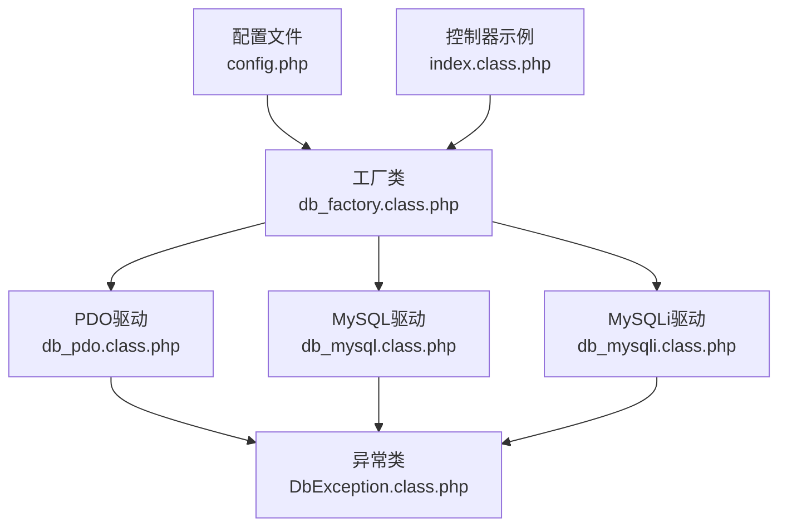
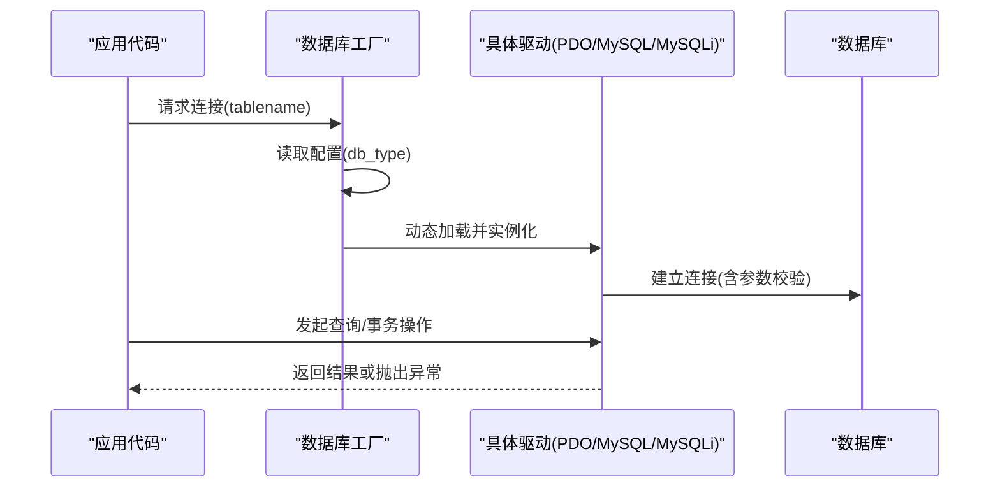
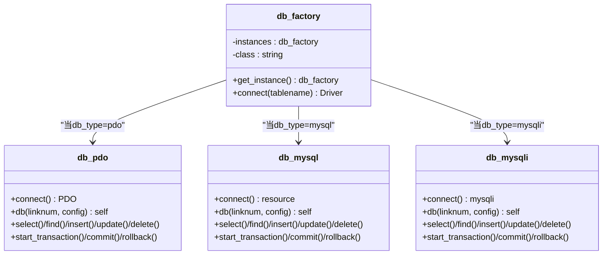
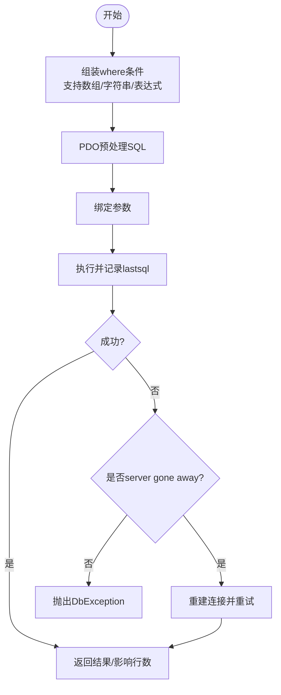
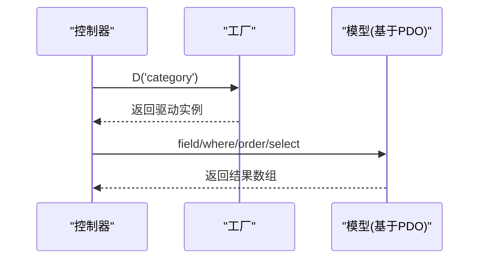
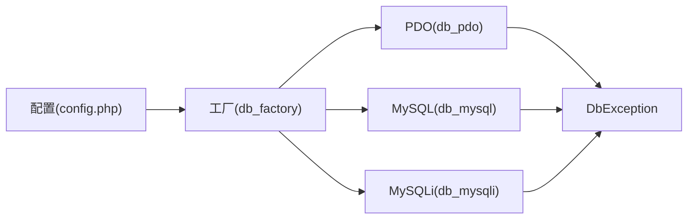

# 数据库系统

<cite>
**本文引用的文件列表**
- [db_factory.class.php](file://ryphp/core/class/db_factory.class.php)
- [db_pdo.class.php](file://ryphp/core/class/db_pdo.class.php)
- [db_mysql.class.php](file://ryphp/core/class/db_mysql.class.php)
- [db_mysqli.class.php](file://ryphp/core/class/db_mysqli.class.php)
- [db_pdo_optimized.class.php](file://ryphp/core/class/db_pdo_optimized.class.php)
- [DbException.class.php](file://ryphp/core/class/DbException.class.php)
- [config.php](file://common/config/config.php)
- [index.class.php](file://application/index/controller/index.class.php)
</cite>

## 目录
1. [简介](#简介)
2. [项目结构](#项目结构)
3. [核心组件](#核心组件)
4. [架构总览](#架构总览)
5. [组件详解](#组件详解)
6. [依赖关系分析](#依赖关系分析)
7. [性能与优化](#性能与优化)
8. [故障排查指南](#故障排查指南)
9. [结论](#结论)
10. [附录](#附录)

## 简介
本技术文档面向LRYBlog数据库系统，聚焦于数据库抽象层的设计与实现，系统性阐述如何通过统一接口支持多种数据库驱动（MySQL、PDO、MySQLi），并深入解析工厂模式、连接管理与连接池、事务处理、错误处理与异常体系、以及查询构建器的实现思路。同时提供配置最佳实践、索引与查询优化建议、典型操作示例与常见问题解决方案，帮助数据库管理员与开发者高效、稳定地进行数据库开发与运维。

## 项目结构
数据库相关的核心代码集中在框架内核的类目录中，采用“按职责分层”的组织方式：
- 抽象层：工厂类负责根据配置选择具体驱动类
- 驱动层：MySQL、MySQLi、PDO三种驱动实现统一接口
- 工具与异常：统一的异常类与调试工具
- 配置层：集中化的数据库配置项

图表来源
- [db_factory.class.php](file://ryphp/core/class/db_factory.class.php#L1-L50)
- [db_pdo.class.php](file://ryphp/core/class/db_pdo.class.php#L1-L646)
- [db_mysql.class.php](file://ryphp/core/class/db_mysql.class.php#L1-L667)
- [db_mysqli.class.php](file://ryphp/core/class/db_mysqli.class.php#L1-L660)
- [DbException.class.php](file://ryphp/core/class/DbException.class.php#L1-L73)
- [config.php](file://common/config/config.php#L13-L22)
- [index.class.php](file://application/index/controller/index.class.php#L14-L16)

章节来源
- [db_factory.class.php](file://ryphp/core/class/db_factory.class.php#L1-L50)
- [config.php](file://common/config/config.php#L13-L22)

## 核心组件
- 数据库工厂：根据配置动态加载并实例化具体驱动类，统一对外接口
- 驱动实现：MySQL、MySQLi、PDO三类驱动均实现统一的查询构建器与事务接口
- 异常体系：DbException统一捕获与抛出，便于上层统一处理
- 配置中心：集中管理数据库类型、主机、端口、字符集、表前缀等

章节来源
- [db_factory.class.php](file://ryphp/core/class/db_factory.class.php#L11-L50)
- [DbException.class.php](file://ryphp/core/class/DbException.class.php#L10-L73)
- [config.php](file://common/config/config.php#L13-L22)

## 架构总览
数据库抽象层采用“工厂 + 多驱动 + 统一接口”的架构，核心流程如下：
- 应用通过工厂类获取数据库实例
- 工厂依据配置选择具体驱动类（PDO/MySQL/MySQLi）
- 驱动内部维护连接池与配置，提供查询构建器与事务接口
- 统一异常类贯穿执行链路，确保错误可追踪、可诊断

图表来源
- [db_factory.class.php](file://ryphp/core/class/db_factory.class.php#L11-L50)
- [db_pdo.class.php](file://ryphp/core/class/db_pdo.class.php#L26-L56)
- [db_mysql.class.php](file://ryphp/core/class/db_mysql.class.php#L23-L78)
- [db_mysqli.class.php](file://ryphp/core/class/db_mysqli.class.php#L23-L75)

## 组件详解

### 工厂模式与连接创建
- 工厂类负责根据配置中的数据库类型选择对应驱动类，并将配置注入到驱动实例
- 支持多连接池：每个连接号独立持有连接与配置，避免跨连接污染
- 连接参数来自全局配置，包含主机、用户、密码、数据库名、端口、字符集、表前缀

图表来源
- [db_factory.class.php](file://ryphp/core/class/db_factory.class.php#L11-L50)
- [db_pdo.class.php](file://ryphp/core/class/db_pdo.class.php#L10-L646)
- [db_mysql.class.php](file://ryphp/core/class/db_mysql.class.php#L10-L667)
- [db_mysqli.class.php](file://ryphp/core/class/db_mysqli.class.php#L10-L660)

章节来源
- [db_factory.class.php](file://ryphp/core/class/db_factory.class.php#L11-L50)
- [config.php](file://common/config/config.php#L13-L22)

### PDO驱动（含优化版）
- 连接参数：严格启用异常模式、禁用模拟预处理、关闭字符串化以提升类型安全
- 连接池：静态数组维护多个连接，按连接号索引
- 查询构建器：支持where/wheres、field/order/limit/group/having/alias等链式调用
- 预处理与绑定：where条件中的绑定参数通过PDO预处理绑定，避免拼接风险
- 事务：原生PDO事务接口，支持自动重连与异常抛出
- 错误处理：统一异常类，支持CLI/调试/日志/JSON响应等多场景

图表来源
- [db_pdo.class.php](file://ryphp/core/class/db_pdo.class.php#L100-L124)
- [db_pdo_optimized.class.php](file://ryphp/core/class/db_pdo_optimized.class.php#L180-L208)

章节来源
- [db_pdo.class.php](file://ryphp/core/class/db_pdo.class.php#L10-L646)
- [db_pdo_optimized.class.php](file://ryphp/core/class/db_pdo_optimized.class.php#L13-L767)
- [DbException.class.php](file://ryphp/core/class/DbException.class.php#L10-L73)

### MySQL驱动（已过时）
- 采用已废弃的mysql_*函数族，仅保留兼容性用途
- 具备与PDO/MySQLi一致的查询构建器与事务接口
- 不推荐在新项目中使用

章节来源
- [db_mysql.class.php](file://ryphp/core/class/db_mysql.class.php#L10-L667)

### MySQLi驱动
- 使用面向对象的mysqli扩展，具备更好的类型安全与性能
- 连接参数设置：启用原生整型/浮点返回、设置字符集
- 查询构建器与事务接口与PDO保持一致
- 适合生产环境使用

章节来源
- [db_mysqli.class.php](file://ryphp/core/class/db_mysqli.class.php#L10-L660)

### 查询构建器与事务
- where/wheres：支持数组条件、表达式、函数回调、IN/BETWEEN等
- 链式调用：field/order/limit/group/having/alias等
- 事务：start_transaction/commit/rollback，支持自动重连
- 辅助：get_primary/get_fields/list_tables/table_exists/field_exists/version/close等

章节来源
- [db_pdo.class.php](file://ryphp/core/class/db_pdo.class.php#L134-L221)
- [db_mysqli.class.php](file://ryphp/core/class/db_mysqli.class.php#L159-L242)
- [db_mysql.class.php](file://ryphp/core/class/db_mysql.class.php#L161-L244)

### 实际使用示例
- 控制器中通过D函数获取模型并进行查询，展示链式调用与字段映射

图表来源
- [index.class.php](file://application/index/controller/index.class.php#L14-L16)
- [db_factory.class.php](file://ryphp/core/class/db_factory.class.php#L38-L49)

章节来源
- [index.class.php](file://application/index/controller/index.class.php#L14-L16)

## 依赖关系分析
- 工厂依赖配置中心，驱动依赖异常类
- 驱动之间无直接耦合，均实现统一接口
- 查询构建器在不同驱动间保持一致的链式语法

图表来源
- [config.php](file://common/config/config.php#L13-L22)
- [db_factory.class.php](file://ryphp/core/class/db_factory.class.php#L11-L50)
- [DbException.class.php](file://ryphp/core/class/DbException.class.php#L10-L73)

章节来源
- [config.php](file://common/config/config.php#L13-L22)
- [db_factory.class.php](file://ryphp/core/class/db_factory.class.php#L11-L50)

## 性能与优化
- 预处理与绑定
  - PDO驱动严格启用非模拟预处理，避免服务端解析开销；where/wheres支持参数绑定，降低注入风险与拼接成本
- 连接池
  - 静态数组维护多连接，按连接号复用，减少重复握手
- 类型安全
  - PDO原生整型/浮点返回，避免字符串化带来的隐式转换
- 事务批处理
  - 批量插入/更新时尽量合并为一次事务，减少往返与锁竞争
- 查询优化建议
  - 为高频查询字段建立合适索引，避免全表扫描
  - 使用EXPLAIN分析慢查询，关注覆盖索引与回表次数
  - 合理使用LIMIT与分页，避免一次性返回大量数据
  - 尽量使用参数化查询，避免字符串拼接
- 并发控制
  - 读写分离与只读副本用于报表类查询
  - 事务粒度最小化，缩短锁持有时间
  - 使用乐观锁或悲观锁策略，视业务场景而定

[本节为通用性能建议，无需特定文件引用]

## 故障排查指南
- 连接失败
  - 检查配置项：主机、端口、用户名、密码、字符集、数据库名
  - 查看异常类型：connection_error，定位DNS/凭据/权限问题
- SQL执行错误
  - 检查where/wheres表达式与绑定参数顺序
  - 使用lastsql或getLastSql辅助定位
  - 对于server gone away，确认连接超时与重连逻辑
- 事务问题
  - 确认事务边界与提交/回滚时机
  - 避免在事务中执行DDL/DCL
- 字段/表不存在
  - 使用table_exists/field_exists辅助判断
  - 注意表前缀配置

章节来源
- [DbException.class.php](file://ryphp/core/class/DbException.class.php#L10-L73)
- [db_pdo_optimized.class.php](file://ryphp/core/class/db_pdo_optimized.class.php#L180-L208)
- [db_pdo.class.php](file://ryphp/core/class/db_pdo.class.php#L492-L505)

## 结论
LRYBlog数据库抽象层通过工厂模式与统一接口，实现了对MySQL、PDO、MySQLi的无缝支持。PDO驱动在安全性、性能与可维护性方面表现最优，推荐生产环境优先使用；MySQLi作为替代方案同样可靠；MySQL驱动仅保留兼容性用途。配合完善的异常体系与查询构建器，开发者可以以一致的方式完成复杂的数据操作，同时获得良好的可扩展性与可观测性。

[本节为总结性内容，无需特定文件引用]

## 附录

### 数据库配置最佳实践
- 连接参数
  - db_type：优先选择pdo
  - db_host/db_port/db_name/db_user/db_pwd/db_charset/db_prefix
- 事务处理
  - 明确事务边界，尽量短事务
  - 使用批量操作合并多次写入
- 并发控制
  - 读写分离、只读副本
  - 合理设置连接池大小与超时
- 安全
  - 严格启用预处理与参数绑定
  - 限制数据库账号权限
  - 定期审计慢查询与错误日志

章节来源
- [config.php](file://common/config/config.php#L13-L22)
- [db_pdo_optimized.class.php](file://ryphp/core/class/db_pdo_optimized.class.php#L708-L750)

### 设计模式与索引策略
- 设计模式
  - 工厂模式：按配置选择驱动
  - 查询构建器：链式调用封装SQL构造
  - 异常门面：统一错误处理
- 索引策略
  - 主键与唯一键：保证数据完整性与快速定位
  - 聚簇索引：InnoDB主键查询优先
  - 覆盖索引：减少回表
  - 复合索引：遵循最左匹配原则
  - 垂直拆分与水平分表：针对大表优化

[本节为通用设计与索引建议，无需特定文件引用]

### 常见问题与解决方案
- 为什么使用PDO而非字符串拼接？
  - 预防SQL注入，提升可维护性与性能
- 如何避免全表扫描？
  - 为WHERE/HAVING/GROUP BY涉及字段建立索引
- 事务中为何不能执行DDL？
  - DDL可能隐式提交或阻塞，破坏事务一致性
- 如何监控慢查询？
  - 使用EXPLAIN分析执行计划，结合慢查询日志

[本节为通用问题解答，无需特定文件引用]