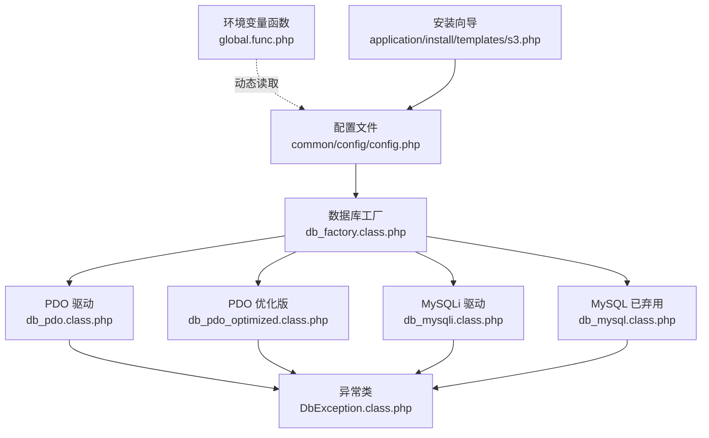
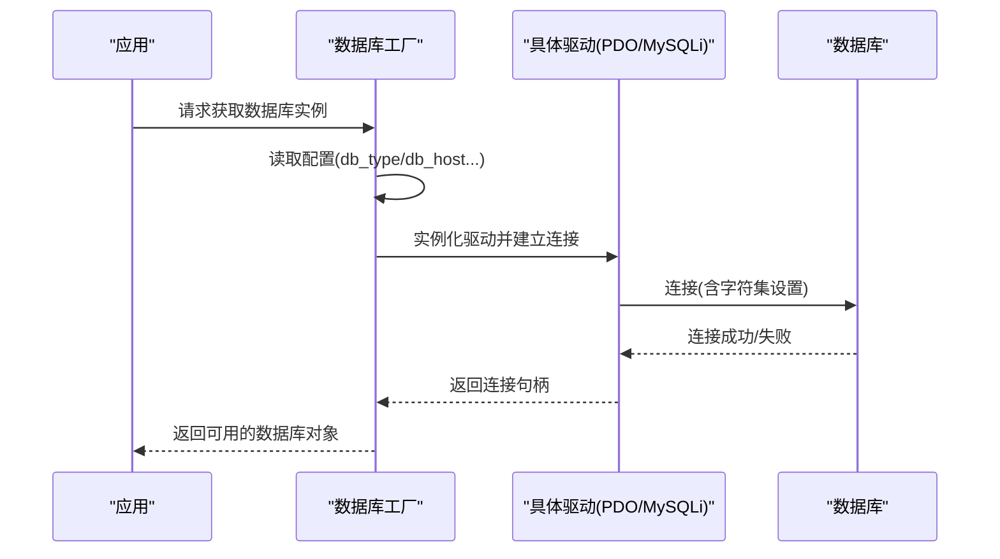
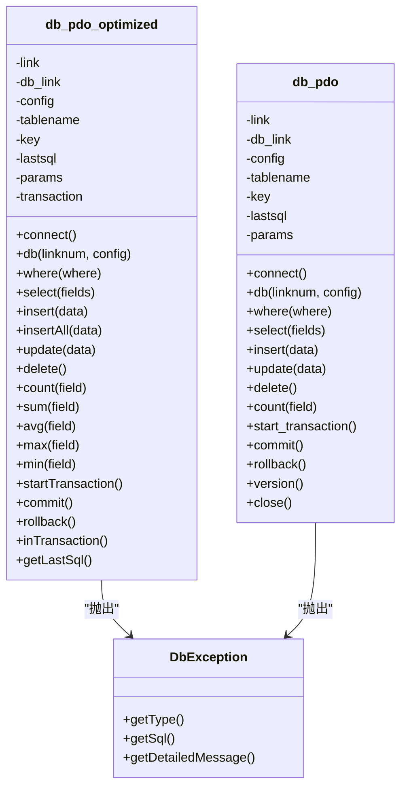
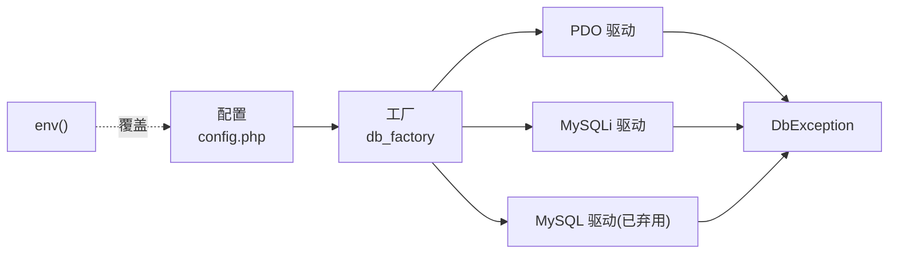

# 数据库配置管理

<cite>
**本文引用的文件列表**
- [common/config/config.php](file://common/config/config.php)
- [ryphp/core/class/db_factory.class.php](file://ryphp/core/class/db_factory.class.php)
- [ryphp/core/class/db_mysql.class.php](file://ryphp/core/class/db_mysql.class.php)
- [ryphp/core/class/db_mysqli.class.php](file://ryphp/core/class/db_mysqli.class.php)
- [ryphp/core/class/db_pdo.class.php](file://ryphp/core/class/db_pdo.class.php)
- [ryphp/core/class/db_pdo_optimized.class.php](file://ryphp/core/class/db_pdo_optimized.class.php)
- [ryphp/core/class/DbException.class.php](file://ryphp/core/class/DbException.class.php)
- [ryphp/core/function/global.func.php](file://ryphp/core/function/global.func.php)
- [application/install/templates/s3.php](file://application/install/templates/s3.php)
- [application/install/index.php](file://application/install/index.php)
- [backup_mysql_claude.sh](file://backup_mysql_claude.sh)
</cite>

## 目录
1. [简介](#简介)
2. [项目结构](#项目结构)
3. [核心组件](#核心组件)
4. [架构总览](#架构总览)
5. [详细组件分析](#详细组件分析)
6. [依赖关系分析](#依赖关系分析)
7. [性能考量](#性能考量)
8. [故障排除指南](#故障排除指南)
9. [结论](#结论)
10. [附录](#附录)

## 简介
本技术文档面向系统管理员与开发者，全面梳理 LRYBlog 的数据库配置管理方案。内容涵盖：
- 数据库配置文件结构与参数设置
- 数据库类型选择与驱动差异（MySQL、MySQLi、PDO）
- 连接池与连接复用机制
- 安全最佳实践（敏感信息保护、连接加密、访问控制）
- 环境变量支持与动态配置更新
- 故障排除与诊断
- 不同部署环境下的优化与调优建议

## 项目结构
LRYBlog 将数据库配置集中于系统配置文件中，并通过工厂类按需加载对应驱动实现。安装向导提供交互式配置入口，支持在安装阶段测试数据库连通性与字符集选择。

图表来源
- [common/config/config.php](file://common/config/config.php#L1-L88)
- [ryphp/core/class/db_factory.class.php](file://ryphp/core/class/db_factory.class.php#L1-L50)
- [ryphp/core/class/db_pdo.class.php](file://ryphp/core/class/db_pdo.class.php#L1-L646)
- [ryphp/core/class/db_pdo_optimized.class.php](file://ryphp/core/class/db_pdo_optimized.class.php#L1-L767)
- [ryphp/core/class/db_mysqli.class.php](file://ryphp/core/class/db_mysqli.class.php#L1-L660)
- [ryphp/core/class/db_mysql.class.php](file://ryphp/core/class/db_mysql.class.php#L1-L667)
- [ryphp/core/class/DbException.class.php](file://ryphp/core/class/DbException.class.php#L1-L73)
- [ryphp/core/function/global.func.php](file://ryphp/core/function/global.func.php#L1435-L1481)
- [application/install/templates/s3.php](file://application/install/templates/s3.php#L1-L200)

章节来源
- [common/config/config.php](file://common/config/config.php#L1-L88)
- [ryphp/core/class/db_factory.class.php](file://ryphp/core/class/db_factory.class.php#L1-L50)

## 核心组件
- 配置中心：集中定义数据库类型、主机、端口、账号、密码、字符集、表前缀等。
- 工厂类：根据配置选择具体驱动实现，统一对外接口。
- 驱动实现：PDO、MySQLi、MySQL（已弃用）三种实现，分别处理连接、查询、事务、错误处理。
- 异常体系：统一的数据库异常类型，便于定位与分类处理。
- 环境变量：提供 .env 文件解析能力，支持敏感信息外部化。
- 安装向导：提供数据库连通性测试与字符集选择界面。

章节来源
- [common/config/config.php](file://common/config/config.php#L13-L22)
- [ryphp/core/class/db_factory.class.php](file://ryphp/core/class/db_factory.class.php#L11-L50)
- [ryphp/core/class/db_pdo.class.php](file://ryphp/core/class/db_pdo.class.php#L10-L42)
- [ryphp/core/class/db_mysqli.class.php](file://ryphp/core/class/db_mysqli.class.php#L10-L46)
- [ryphp/core/class/db_mysql.class.php](file://ryphp/core/class/db_mysql.class.php#L10-L49)
- [ryphp/core/class/DbException.class.php](file://ryphp/core/class/DbException.class.php#L10-L36)
- [ryphp/core/function/global.func.php](file://ryphp/core/function/global.func.php#L1435-L1481)
- [application/install/templates/s3.php](file://application/install/templates/s3.php#L29-L83)

## 架构总览
数据库配置管理采用“配置 + 工厂 + 多驱动”的分层设计：
- 配置层：集中管理数据库连接参数与字符集设置。
- 工厂层：依据配置选择驱动，负责实例化与连接池维护。
- 驱动层：封装具体数据库 API，提供统一的查询、事务、错误处理接口。
- 异常层：标准化异常类型，便于统一捕获与处理。
- 安装层：提供交互式配置入口与连通性测试。

图表来源
- [ryphp/core/class/db_factory.class.php](file://ryphp/core/class/db_factory.class.php#L11-L50)
- [ryphp/core/class/db_pdo.class.php](file://ryphp/core/class/db_pdo.class.php#L32-L42)
- [ryphp/core/class/db_mysqli.class.php](file://ryphp/core/class/db_mysqli.class.php#L36-L46)
- [ryphp/core/class/db_mysql.class.php](file://ryphp/core/class/db_mysql.class.php#L36-L49)

## 详细组件分析

### 配置文件与参数
- 数据库类型：支持 pdo、mysqli、mysql（mysql 已弃用）。
- 连接参数：主机、端口、用户名、密码、数据库名、字符集、表前缀。
- 安装向导：提供驱动选择、字符集选择（utf8/utf8mb4）、表引擎选择（MyISAM/InnoDB）等。

章节来源
- [common/config/config.php](file://common/config/config.php#L13-L22)
- [application/install/templates/s3.php](file://application/install/templates/s3.php#L29-L83)

### 工厂类与驱动选择
- 工厂根据配置的 db_type 选择对应驱动类，统一对外暴露 connect 方法。
- 支持多连接池：db(0) 为默认连接，db(n) 可新增连接并复用。

章节来源
- [ryphp/core/class/db_factory.class.php](file://ryphp/core/class/db_factory.class.php#L11-L50)

### PDO 驱动（标准版与优化版）
- 标准版：内置 PDO 参数集合，连接时设置字符集；支持预处理绑定；提供丰富的聚合方法与事务接口。
- 优化版：引入自定义异常类 DbException，增强错误分类与可诊断性；改进 where 条件构造与批量插入；提供更严格的 delete 条件校验。

图表来源
- [ryphp/core/class/db_pdo.class.php](file://ryphp/core/class/db_pdo.class.php#L10-L646)
- [ryphp/core/class/db_pdo_optimized.class.php](file://ryphp/core/class/db_pdo_optimized.class.php#L13-L767)
- [ryphp/core/class/DbException.class.php](file://ryphp/core/class/DbException.class.php#L10-L73)

章节来源
- [ryphp/core/class/db_pdo.class.php](file://ryphp/core/class/db_pdo.class.php#L10-L646)
- [ryphp/core/class/db_pdo_optimized.class.php](file://ryphp/core/class/db_pdo_optimized.class.php#L13-L767)
- [ryphp/core/class/DbException.class.php](file://ryphp/core/class/DbException.class.php#L10-L73)

### MySQLi 驱动
- 连接时设置字符集与原生整型/浮点类型；支持丰富的查询与事务接口；提供便捷的表/字段元数据查询。

章节来源
- [ryphp/core/class/db_mysqli.class.php](file://ryphp/core/class/db_mysqli.class.php#L10-L660)

### MySQL 驱动（已弃用）
- 仍保留历史兼容，但官方已不再推荐使用。

章节来源
- [ryphp/core/class/db_mysql.class.php](file://ryphp/core/class/db_mysql.class.php#L10-L667)

### 安装向导与连通性测试
- 安装向导提供数据库驱动选择、主机/端口/账号/密码/库名/前缀/字符集/引擎等配置项。
- 在提交前可调用测试接口验证数据库连通性。

章节来源
- [application/install/templates/s3.php](file://application/install/templates/s3.php#L29-L83)
- [application/install/templates/s3.php](file://application/install/templates/s3.php#L142-L165)
- [application/install/index.php](file://application/install/index.php#L150-L160)

## 依赖关系分析
- 配置依赖：db_factory 依赖 C() 获取配置；各驱动依赖配置中的主机、端口、账号、密码、字符集、前缀。
- 工厂依赖：根据 db_type 分发到不同驱动类。
- 驱动依赖：PDO/MySQLi 驱动依赖 PHP 扩展；MySQL 驱动依赖已弃用扩展。
- 异常依赖：优化版驱动显式抛出 DbException，便于统一处理。
- 环境变量：global.func.php 提供 env() 函数从 .env 文件读取配置，可用于覆盖敏感配置。

图表来源
- [common/config/config.php](file://common/config/config.php#L13-L22)
- [ryphp/core/class/db_factory.class.php](file://ryphp/core/class/db_factory.class.php#L11-L50)
- [ryphp/core/class/db_pdo.class.php](file://ryphp/core/class/db_pdo.class.php#L32-L42)
- [ryphp/core/class/db_mysqli.class.php](file://ryphp/core/class/db_mysqli.class.php#L36-L46)
- [ryphp/core/class/db_mysql.class.php](file://ryphp/core/class/db_mysql.class.php#L36-L49)
- [ryphp/core/class/DbException.class.php](file://ryphp/core/class/DbException.class.php#L10-L73)
- [ryphp/core/function/global.func.php](file://ryphp/core/function/global.func.php#L1435-L1481)

章节来源
- [common/config/config.php](file://common/config/config.php#L13-L22)
- [ryphp/core/class/db_factory.class.php](file://ryphp/core/class/db_factory.class.php#L11-L50)
- [ryphp/core/function/global.func.php](file://ryphp/core/function/global.func.php#L1435-L1481)

## 性能考量
- 连接池与复用
  - 工厂与驱动均支持多连接池（db(0)/db(n)），可在高并发场景下复用连接，减少握手开销。
  - 优化版 PDO 驱动在执行失败时对“server has gone away”进行自动重连，提升稳定性。
- 预处理与绑定
  - PDO 驱动使用预处理语句与绑定参数，降低 SQL 注入风险并提升执行效率。
- 字符集与排序规则
  - 建议优先使用 utf8mb4，以支持四字节表情符号；确保数据库、表、列字符集一致。
- 事务与批处理
  - 优化版 PDO 驱动提供 insertAll、聚合方法与严格 delete 校验，适合批量写入与统计场景。
- 连接超时与持久化
  - 标准 PDO 驱动未显式设置超时参数；如需超时控制，可在生产环境通过 PHP 配置或驱动参数调整。
  - MySQLi 驱动支持 set_charset 与原生数值类型，有助于减少类型转换成本。

章节来源
- [ryphp/core/class/db_pdo_optimized.class.php](file://ryphp/core/class/db_pdo_optimized.class.php#L180-L208)
- [ryphp/core/class/db_pdo.class.php](file://ryphp/core/class/db_pdo.class.php#L100-L124)
- [ryphp/core/class/db_mysqli.class.php](file://ryphp/core/class/db_mysqli.class.php#L43-L44)
- [application/install/templates/s3.php](file://application/install/templates/s3.php#L77-L80)

## 故障排除指南
- 连接失败
  - 检查主机、端口、账号、密码是否正确；确认数据库服务运行状态。
  - 安装向导提供测试接口，可在提交前验证连通性。
  - 优化版驱动对“server has gone away”具备自动重连逻辑。
- 字符集错误
  - 确认配置中的字符集与数据库/表/列一致；建议使用 utf8mb4。
  - PDO/MySQLi 驱动在连接时会设置字符集，若仍出现乱码，检查客户端与服务端字符集一致性。
- 权限问题
  - 确保数据库用户具备目标库与表的读写权限；必要时创建专用账号并限制 IP 访问。
- 异常定位
  - 优化版驱动抛出 DbException，包含类型与 SQL，便于快速定位；标准版驱动通过统一错误处理流程输出错误信息。

章节来源
- [application/install/templates/s3.php](file://application/install/templates/s3.php#L142-L165)
- [ryphp/core/class/db_pdo_optimized.class.php](file://ryphp/core/class/db_pdo_optimized.class.php#L201-L208)
- [ryphp/core/class/db_pdo.class.php](file://ryphp/core/class/db_pdo.class.php#L37-L41)
- [ryphp/core/class/DbException.class.php](file://ryphp/core/class/DbException.class.php#L24-L36)

## 结论
LRYBlog 的数据库配置管理以“配置 + 工厂 + 多驱动 + 异常体系”为核心，既保证了灵活性（支持多种驱动），又提供了统一的使用体验。通过安装向导与环境变量支持，能够满足不同部署场景的需求。建议在生产环境中优先使用 PDO 驱动（优化版），并结合 utf8mb4、严格的权限控制与完善的备份策略，确保系统的稳定性与安全性。

## 附录

### 数据库配置参数清单
- db_type：数据库驱动类型（pdo、mysqli、mysql）
- db_host：数据库服务器地址
- db_port：数据库端口
- db_user：数据库用户名
- db_pwd：数据库密码
- db_name：数据库名
- db_charset：字符集（建议 utf8mb4）
- db_prefix：表前缀

章节来源
- [common/config/config.php](file://common/config/config.php#L13-L22)

### 环境变量支持与动态更新
- 通过 env() 函数从 .env 文件读取配置，可用于覆盖敏感配置项。
- 建议将 db_host、db_port、db_user、db_pwd、db_name 等敏感信息放入 .env 并设置合理权限。

章节来源
- [ryphp/core/function/global.func.php](file://ryphp/core/function/global.func.php#L1435-L1481)

### 安全最佳实践
- 敏感信息保护：使用 .env 文件存放数据库凭据，避免硬编码。
- 连接加密：在数据库服务器侧启用 SSL/TLS，确保传输安全。
- 访问控制：为应用创建专用数据库账号，限制最小权限与来源 IP。
- 备份策略：定期备份数据库，脚本提供备份与清理策略参考。

章节来源
- [backup_mysql_claude.sh](file://backup_mysql_claude.sh#L1-L218)

### 不同部署环境下的优化建议
- 开发环境：可使用默认配置，便于快速搭建；建议开启调试模式以便定位问题。
- 生产环境：优先使用 PDO 优化版驱动；启用 utf8mb4；配置连接池与自动重连；完善监控与日志记录。
- 高并发场景：合理设置连接池大小与超时参数；使用预处理语句与批量写入；对热点表进行索引优化。

章节来源
- [ryphp/core/class/db_pdo_optimized.class.php](file://ryphp/core/class/db_pdo_optimized.class.php#L180-L208)
- [ryphp/core/class/db_pdo.class.php](file://ryphp/core/class/db_pdo.class.php#L100-L124)
- [ryphp/core/class/db_mysqli.class.php](file://ryphp/core/class/db_mysqli.class.php#L43-L44)