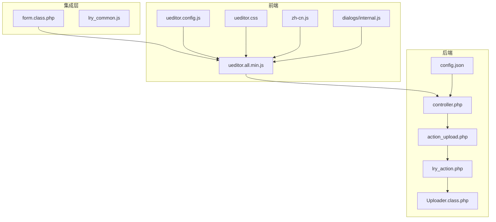
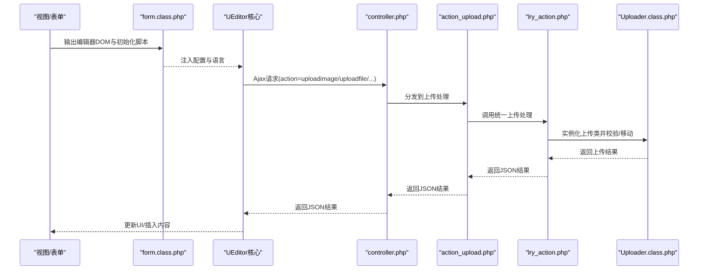
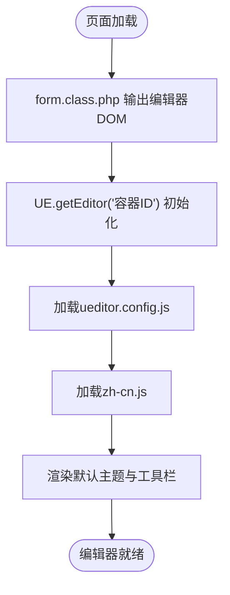
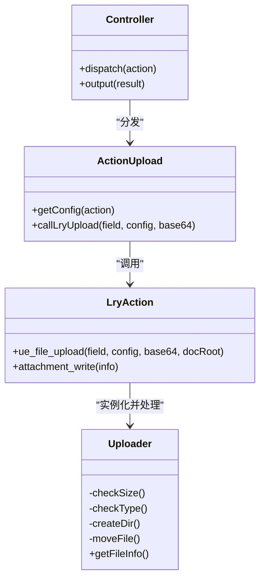
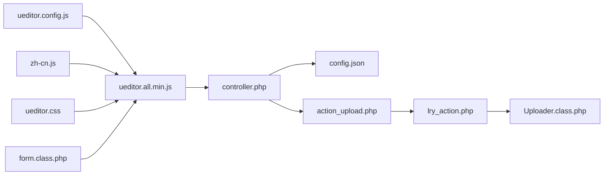

# UEditor富文本编辑器集成

<cite>
**本文档引用的文件**
- [ueditor.all.min.js](file://common/static/plugin/ueditor/ueditor.all.min.js)
- [ueditor.config.js](file://common/static/plugin/ueditor/ueditor.config.js)
- [config.json](file://common/static/plugin/ueditor/php/config.json)
- [controller.php](file://common/static/plugin/ueditor/php/controller.php)
- [action_upload.php](file://common/static/plugin/ueditor/php/action_upload.php)
- [lry_action.php](file://common/static/plugin/ueditor/php/lry_action.php)
- [Uploader.class.php](file://common/static/plugin/ueditor/php/Uploader.class.php)
- [ueditor.css](file://common/static/plugin/ueditor/themes/default/css/ueditor.css)
- [zh-cn.js](file://common/static/plugin/ueditor/lang/zh-cn/zh-cn.js)
- [internal.js](file://common/static/plugin/ueditor/dialogs/internal.js)
- [form.class.php](file://ryphp/core/class/form.class.php)
- [lry_common.js](file://common/static/js/lry_common.js)
</cite>

## 目录
1. [简介](#简介)
2. [项目结构](#项目结构)
3. [核心组件](#核心组件)
4. [架构总览](#架构总览)
5. [详细组件分析](#详细组件分析)
6. [依赖关系分析](#依赖关系分析)
7. [性能考虑](#性能考虑)
8. [故障排除指南](#故障排除指南)
9. [结论](#结论)

## 简介
本技术文档面向LRYBlog项目中UEditor富文本编辑器的集成与使用，涵盖编辑器初始化配置、工具栏定制、插件扩展、上传配置、后端交互机制、主题与语言包、响应式布局、事件监听与API使用、浏览器兼容性与性能优化，以及功能扩展与自定义开发指导。文档所有技术细节均来源于仓库现有文件，确保可追溯与可验证。

## 项目结构
UEditor在LRYBlog中的部署采用“前端静态资源 + PHP后端控制器”的架构：
- 前端：UEditor核心脚本、主题样式、语言包、对话框内部脚本
- 后端：PHP控制器统一入口，按action路由到具体上传/列表/抓取逻辑
- 集成层：RyPHP框架通过表单类方法输出编辑器DOM并初始化实例

**图表来源**
- [ueditor.all.min.js](file://common/static/plugin/ueditor/ueditor.all.min.js#L1-L10)
- [ueditor.config.js](file://common/static/plugin/ueditor/ueditor.config.js#L1-L200)
- [controller.php](file://common/static/plugin/ueditor/php/controller.php#L1-L68)
- [action_upload.php](file://common/static/plugin/ueditor/php/action_upload.php#L1-L65)
- [lry_action.php](file://common/static/plugin/ueditor/php/lry_action.php#L1-L258)
- [Uploader.class.php](file://common/static/plugin/ueditor/php/Uploader.class.php#L1-L200)
- [ueditor.css](file://common/static/plugin/ueditor/themes/default/css/ueditor.css#L1-L800)
- [zh-cn.js](file://common/static/plugin/ueditor/lang/zh-cn/zh-cn.js#L1-L670)
- [internal.js](file://common/static/plugin/ueditor/dialogs/internal.js#L1-L50)
- [form.class.php](file://ryphp/core/class/form.class.php#L269-L304)
- [lry_common.js](file://common/static/js/lry_common.js#L1-L365)

**章节来源**
- [ueditor.all.min.js](file://common/static/plugin/ueditor/ueditor.all.min.js#L1-L10)
- [controller.php](file://common/static/plugin/ueditor/php/controller.php#L1-L68)
- [form.class.php](file://ryphp/core/class/form.class.php#L269-L304)

## 核心组件
- 编辑器核心脚本：提供编辑器实例化、命令系统、事件机制、DOM与Range工具、Ajax封装等能力
- 配置文件：定义编辑器行为、工具栏、主题、语言、上传路径与格式等
- 后端控制器：统一入口，按action路由到上传、列表、抓取等处理逻辑
- 上传类：封装文件校验、目录创建、移动/写入、状态码映射
- 主题与语言：默认主题样式与中文语言包
- 对话框内部脚本：对话框加载、语言注入、样式加载
- 集成层：RyPHP表单类输出编辑器DOM并初始化实例

**章节来源**
- [ueditor.all.min.js](file://common/static/plugin/ueditor/ueditor.all.min.js#L1-L10)
- [ueditor.config.js](file://common/static/plugin/ueditor/ueditor.config.js#L1-L200)
- [controller.php](file://common/static/plugin/ueditor/php/controller.php#L1-L68)
- [Uploader.class.php](file://common/static/plugin/ueditor/php/Uploader.class.php#L1-L200)
- [ueditor.css](file://common/static/plugin/ueditor/themes/default/css/ueditor.css#L1-L800)
- [zh-cn.js](file://common/static/plugin/ueditor/lang/zh-cn/zh-cn.js#L1-L670)
- [internal.js](file://common/static/plugin/ueditor/dialogs/internal.js#L1-L50)
- [form.class.php](file://ryphp/core/class/form.class.php#L269-L304)

## 架构总览
UEditor在LRYBlog中的工作流如下：
- 前端通过RyPHP表单类输出编辑器容器与初始化脚本
- 编辑器加载配置，渲染UI并建立事件通道
- 用户操作触发命令，编辑器通过Ajax调用后端controller.php
- 后端根据action分发到对应处理文件（上传/列表/抓取）
- 上传流程：解析配置 → 校验类型/大小 → 创建目录 → 移动/写入文件 → 返回JSON状态
- 结果通过回调返回编辑器，更新UI或插入内容

**图表来源**
- [form.class.php](file://ryphp/core/class/form.class.php#L269-L304)
- [controller.php](file://common/static/plugin/ueditor/php/controller.php#L1-L68)
- [action_upload.php](file://common/static/plugin/ueditor/php/action_upload.php#L1-L65)
- [lry_action.php](file://common/static/plugin/ueditor/php/lry_action.php#L200-L258)
- [Uploader.class.php](file://common/static/plugin/ueditor/php/Uploader.class.php#L74-L127)

**章节来源**
- [form.class.php](file://ryphp/core/class/form.class.php#L269-L304)
- [controller.php](file://common/static/plugin/ueditor/php/controller.php#L1-L68)
- [action_upload.php](file://common/static/plugin/ueditor/php/action_upload.php#L1-L65)
- [lry_action.php](file://common/static/plugin/ueditor/php/lry_action.php#L200-L258)
- [Uploader.class.php](file://common/static/plugin/ueditor/php/Uploader.class.php#L74-L127)

## 详细组件分析

### 初始化与配置
- 编辑器初始化：RyPHP表单类提供editor/editor_mini方法，输出script标签与初始化代码，创建UE实例
- 配置加载：ueditor.config.js定义编辑器默认配置（工具栏、主题、语言、上传路径等）
- 语言包：zh-cn.js提供中文本地化文案
- 主题样式：ueditor.css定义默认UI样式与工具栏布局

**图表来源**
- [form.class.php](file://ryphp/core/class/form.class.php#L269-L304)
- [ueditor.config.js](file://common/static/plugin/ueditor/ueditor.config.js#L1-L200)
- [zh-cn.js](file://common/static/plugin/ueditor/lang/zh-cn/zh-cn.js#L1-L670)
- [ueditor.css](file://common/static/plugin/ueditor/themes/default/css/ueditor.css#L1-L800)

**章节来源**
- [form.class.php](file://ryphp/core/class/form.class.php#L269-L304)
- [ueditor.config.js](file://common/static/plugin/ueditor/ueditor.config.js#L1-L200)
- [zh-cn.js](file://common/static/plugin/ueditor/lang/zh-cn/zh-cn.js#L1-L670)
- [ueditor.css](file://common/static/plugin/ueditor/themes/default/css/ueditor.css#L1-L800)

### 工具栏定制与插件扩展
- 工具栏配置：通过ueditor.config.js中的工具栏数组控制按钮显示顺序与分组
- 插件注册：UEditor支持插件注册与命令扩展，可在配置阶段启用或禁用
- 对话框：dialogs/internal.js负责加载语言与样式，支持图片、附件、视频等对话框

**章节来源**
- [ueditor.config.js](file://common/static/plugin/ueditor/ueditor.config.js#L1-L200)
- [internal.js](file://common/static/plugin/ueditor/dialogs/internal.js#L1-L50)

### 上传配置与后端交互
- 配置文件：config.json定义各类上传动作（图片、涂鸦、视频、文件）的路径格式、大小限制、允许类型等
- 控制器：controller.php根据action分发到对应处理文件，统一输出JSON
- 上传处理：action_upload.php根据action选择对应配置，调用lry_action.php中的ue_file_upload
- 上传类：Uploader.class.php实现文件校验、目录创建、移动/写入与状态码映射

**图表来源**
- [controller.php](file://common/static/plugin/ueditor/php/controller.php#L1-L68)
- [action_upload.php](file://common/static/plugin/ueditor/php/action_upload.php#L1-L65)
- [lry_action.php](file://common/static/plugin/ueditor/php/lry_action.php#L200-L258)
- [Uploader.class.php](file://common/static/plugin/ueditor/php/Uploader.class.php#L74-L127)

**章节来源**
- [config.json](file://common/static/plugin/ueditor/php/config.json#L1-L94)
- [controller.php](file://common/static/plugin/ueditor/php/controller.php#L1-L68)
- [action_upload.php](file://common/static/plugin/ueditor/php/action_upload.php#L1-L65)
- [lry_action.php](file://common/static/plugin/ueditor/php/lry_action.php#L200-L258)
- [Uploader.class.php](file://common/static/plugin/ueditor/php/Uploader.class.php#L74-L127)

### 主题定制、语言包与响应式
- 主题：ueditor.css提供默认UI样式，可通过覆盖样式或引入自定义主题文件实现定制
- 语言包：zh-cn.js提供中文本地化，可按需扩展其他语言
- 响应式：编辑器容器与iframe布局在默认主题中具备基础自适应能力，结合页面CSS可进一步优化

**章节来源**
- [ueditor.css](file://common/static/plugin/ueditor/themes/default/css/ueditor.css#L1-L800)
- [zh-cn.js](file://common/static/plugin/ueditor/lang/zh-cn/zh-cn.js#L1-L670)

### JavaScript API与事件监听
- 实例化：通过UE.getEditor('容器ID')获取实例
- 内容获取/设置：getContent/getAllHtml/setContent等
- 命令执行：execCommand/queryCommandState/queryCommandValue
- 事件监听：通过fireEvent/addListener监听编辑器事件（如ready、contentchange、selectionchange）

**章节来源**
- [ueditor.all.min.js](file://common/static/plugin/ueditor/ueditor.all.min.js#L1-L10)

### 兼容性与性能优化
- 浏览器兼容：ueditor.all.min.js内置浏览器检测与兼容分支，适配IE/WebKit/Firefox/Opera
- 性能优化：合理设置初始尺寸、延迟加载、避免频繁同步、使用合适的图片压缩策略

**章节来源**
- [ueditor.all.min.js](file://common/static/plugin/ueditor/ueditor.all.min.js#L1-L10)

### 功能扩展与自定义开发
- 自定义命令：通过commands注册新命令，配合工具栏按钮扩展功能
- 输入/输出规则：通过addInputRule/addOutputRule过滤与转换内容
- 上传扩展：通过lry_action.php支持第三方云存储上传类，实现多存储后端

**章节来源**
- [lry_action.php](file://common/static/plugin/ueditor/php/lry_action.php#L200-L258)

## 依赖关系分析
- 前端依赖：ueditor.all.min.js依赖ueditor.config.js、zh-cn.js、ueditor.css
- 后端依赖：controller.php依赖config.json与各action处理文件；action_upload.php依赖lry_action.php；lry_action.php依赖Uploader.class.php
- 集成依赖：form.class.php依赖静态资源路径，确保编辑器脚本正确加载

**图表来源**
- [ueditor.config.js](file://common/static/plugin/ueditor/ueditor.config.js#L1-L200)
- [zh-cn.js](file://common/static/plugin/ueditor/lang/zh-cn/zh-cn.js#L1-L670)
- [ueditor.css](file://common/static/plugin/ueditor/themes/default/css/ueditor.css#L1-L800)
- [ueditor.all.min.js](file://common/static/plugin/ueditor/ueditor.all.min.js#L1-L10)
- [controller.php](file://common/static/plugin/ueditor/php/controller.php#L1-L68)
- [config.json](file://common/static/plugin/ueditor/php/config.json#L1-L94)
- [action_upload.php](file://common/static/plugin/ueditor/php/action_upload.php#L1-L65)
- [lry_action.php](file://common/static/plugin/ueditor/php/lry_action.php#L1-L258)
- [Uploader.class.php](file://common/static/plugin/ueditor/php/Uploader.class.php#L1-L200)
- [form.class.php](file://ryphp/core/class/form.class.php#L269-L304)

**章节来源**
- [ueditor.all.min.js](file://common/static/plugin/ueditor/ueditor.all.min.js#L1-L10)
- [controller.php](file://common/static/plugin/ueditor/php/controller.php#L1-L68)
- [action_upload.php](file://common/static/plugin/ueditor/php/action_upload.php#L1-L65)
- [lry_action.php](file://common/static/plugin/ueditor/php/lry_action.php#L1-L258)
- [Uploader.class.php](file://common/static/plugin/ueditor/php/Uploader.class.php#L1-L200)
- [form.class.php](file://ryphp/core/class/form.class.php#L269-L304)

## 性能考虑
- 上传性能：合理设置maxSize与allowFiles，避免过大文件与非法类型；必要时启用压缩
- UI渲染：减少不必要的工具栏按钮，降低DOM复杂度
- 资源加载：合并与压缩静态资源，按需加载语言包与主题
- 缓存策略：利用浏览器缓存与CDN加速静态资源

## 故障排除指南
- 上传失败：检查config.json中的路径格式与权限，确认controller.php返回的状态码
- 语言/主题异常：确认zh-cn.js与ueditor.css加载路径正确
- 会话/鉴权：lry_action.php中存在管理员会话校验，需确保登录状态
- 跨域问题：controller.php支持callback参数，注意同源策略与CORS配置

**章节来源**
- [config.json](file://common/static/plugin/ueditor/php/config.json#L1-L94)
- [controller.php](file://common/static/plugin/ueditor/php/controller.php#L1-L68)
- [lry_action.php](file://common/static/plugin/ueditor/php/lry_action.php#L120-L126)

## 结论
LRYBlog中UEditor的集成以清晰的前后端分离架构实现：前端通过RyPHP表单类快速集成，后端以controller.php统一调度，上传流程由lry_action.php与Uploader.class.php保障稳定性与安全性。通过配置文件与语言包可实现多语言与多主题定制，结合事件监听与API可满足复杂业务需求。建议在生产环境中关注上传安全、跨域与性能优化，确保编辑器稳定高效运行。