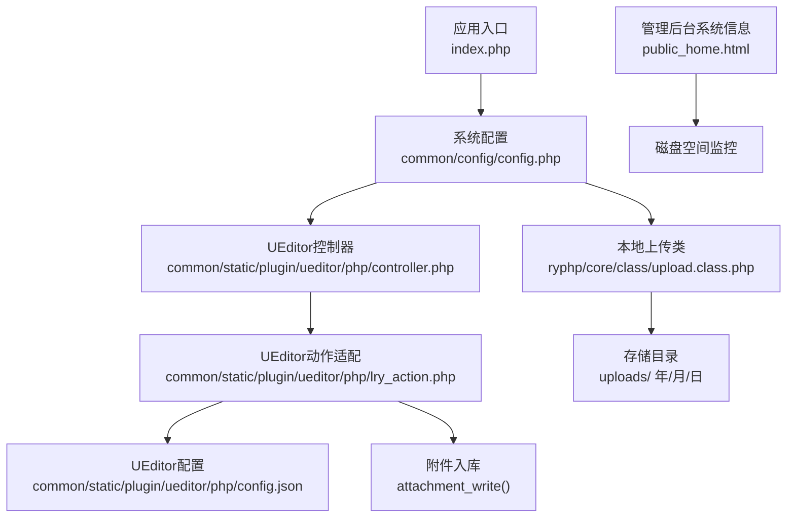
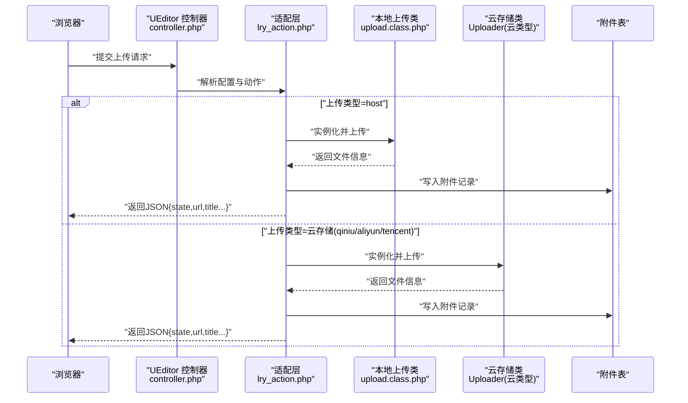
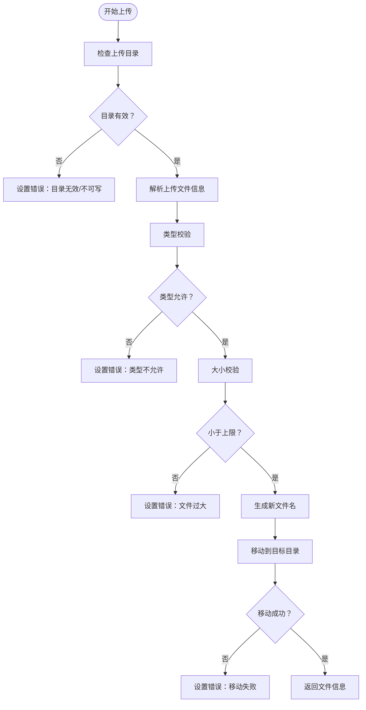
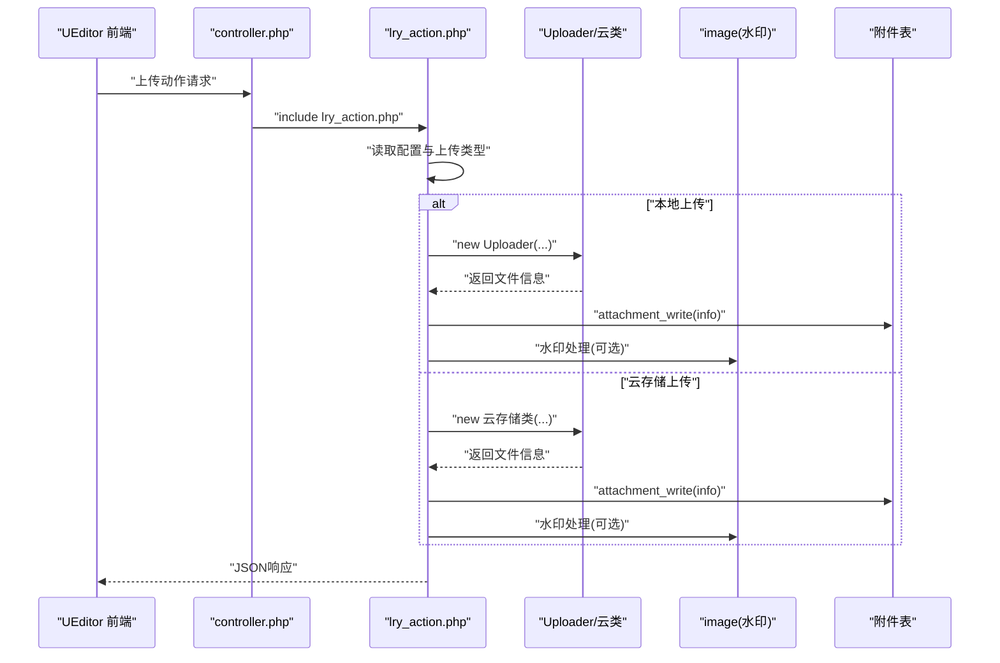
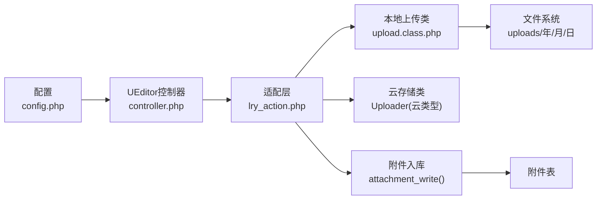

# 上传存储策略与管理

<cite>
**本文引用的文件**
- [index.php](file://index.php)
- [config.php](file://common/config/config.php)
- [upload.class.php](file://ryphp/core/class/upload.class.php)
- [controller.php](file://common/static/plugin/ueditor/php/controller.php)
- [lry_action.php](file://common/static/plugin/ueditor/php/lry_action.php)
- [config.json](file://common/static/plugin/ueditor/php/config.json)
- [public_home.html](file://application/lry_admin_center/view/public_home.html)
- [backup_mysql_claude.sh](file://backup_mysql_claude.sh)
- [restore_mysql_claude.sh](file://restore_mysql_claude.sh)
</cite>

## 目录
1. [简介](#简介)
2. [项目结构](#项目结构)
3. [核心组件](#核心组件)
4. [架构总览](#架构总览)
5. [详细组件分析](#详细组件分析)
6. [依赖关系分析](#依赖关系分析)
7. [性能考虑](#性能考虑)
8. [故障排查指南](#故障排查指南)
9. [结论](#结论)
10. [附录](#附录)

## 简介
本技术文档围绕 LRYBlog 的上传存储策略与管理展开，系统性梳理文件存储路径组织结构、本地与云存储集成方案、访问权限控制、版本与备份策略、清理机制、CDN 集成思路、大文件优化、监控与容量规划等主题，并提供面向开发者的优化与扩展建议。

## 项目结构
LRYBlog 采用 PHP + 自研框架的单入口模式，上传与存储相关的关键位置集中在以下模块：
- 应用入口与框架初始化：index.php
- 系统配置：common/config/config.php（含上传类型、上传目录、水印等）
- 本地上传类：ryphp/core/class/upload.class.php（按日期分组的本地存储）
- UEditor 后端适配：common/static/plugin/ueditor/php/（controller.php、lry_action.php、config.json）
- 管理后台系统信息页：application/lry_admin_center/view/public_home.html（展示服务器磁盘空间等运维指标）
- 数据库备份与恢复脚本：backup_mysql_claude.sh、restore_mysql_claude.sh（与附件存储相关的数据备份与恢复）

**图表来源**
- [index.php](file://index.php#L10-L18)
- [config.php](file://common/config/config.php#L75-L81)
- [upload.class.php](file://ryphp/core/class/upload.class.php#L47-L52)
- [controller.php](file://common/static/plugin/ueditor/php/controller.php#L8-L18)
- [lry_action.php](file://common/static/plugin/ueditor/php/lry_action.php#L206-L257)
- [config.json](file://common/static/plugin/ueditor/php/config.json#L1-L25)
- [public_home.html](file://application/lry_admin_center/view/public_home.html#L134-L135)

**章节来源**
- [index.php](file://index.php#L10-L18)
- [config.php](file://common/config/config.php#L75-L81)

## 核心组件
- 上传类型与目录配置：系统通过配置项选择本地或云存储，并指定上传根目录。
- 本地上传类：负责按日期分组创建目录、随机命名、大小与类型校验、移动文件、生成访问 URL。
- UEditor 后端适配：根据上传类型动态加载 Uploader 或云存储类，统一返回前端所需 JSON 结构，并在本地模式下进行水印处理与附件入库。
- 附件入库：记录附件元数据（来源、路径、大小、扩展名、上传者、IP、时间等），便于后续管理与审计。
- 管理后台监控：展示服务器剩余空间等运维指标，辅助容量规划。

**章节来源**
- [config.php](file://common/config/config.php#L75-L81)
- [upload.class.php](file://ryphp/core/class/upload.class.php#L47-L52)
- [lry_action.php](file://common/static/plugin/ueditor/php/lry_action.php#L206-L257)
- [public_home.html](file://application/lry_admin_center/view/public_home.html#L134-L135)

## 架构总览
下图展示了从浏览器到后端、再到存储与数据库的典型上传流程，涵盖本地与云存储两种路径。

**图表来源**
- [controller.php](file://common/static/plugin/ueditor/php/controller.php#L20-L55)
- [lry_action.php](file://common/static/plugin/ueditor/php/lry_action.php#L206-L257)
- [upload.class.php](file://ryphp/core/class/upload.class.php#L189-L240)

## 详细组件分析

### 本地上传类 upload.class.php
- 存储路径组织：按“年/月/日”自动创建子目录，避免单目录文件过多；路径由配置项决定。
- 文件命名：默认随机命名，包含时间戳与随机数，避免冲突。
- 校验规则：类型白名单、大小上限（来自配置）、目录可写性。
- 返回信息：包含文件大小、类型、路径、URL、原始名等，便于前端展示与入库。
- 错误处理：集中映射 PHP 上传错误码与业务错误码，便于定位问题。

**图表来源**
- [upload.class.php](file://ryphp/core/class/upload.class.php#L77-L240)

**章节来源**
- [upload.class.php](file://ryphp/core/class/upload.class.php#L47-L52)
- [upload.class.php](file://ryphp/core/class/upload.class.php#L189-L240)

### UEditor 后端适配 lry_action.php
- 动态加载上传类：当上传类型为 host 时使用本地 Uploader；否则按配置加载对应云存储类。
- 统一返回结构：state、url、title、original、type、size，满足 UEditor 前端期望。
- 附件入库：调用附件写入函数，记录来源模块、用户、IP、时间等元数据。
- 水印处理：在本地模式下对图片进行水印叠加（若启用）。

**图表来源**
- [controller.php](file://common/static/plugin/ueditor/php/controller.php#L20-L55)
- [lry_action.php](file://common/static/plugin/ueditor/php/lry_action.php#L206-L257)

**章节来源**
- [controller.php](file://common/static/plugin/ueditor/php/controller.php#L8-L18)
- [lry_action.php](file://common/static/plugin/ueditor/php/lry_action.php#L206-L257)

### 上传类型与目录配置 config.php
- upload_type：支持 host、qiniu、aliyun、tencent 四种类型。
- upload_file：指定上传根目录（不以斜杠结尾）。
- upload_maxsize：通过配置项控制上传大小上限（KB→B）。
- watermark_*：水印开关、水印文件名、水印位置。

**章节来源**
- [config.php](file://common/config/config.php#L75-L81)

### UEditor 配置 config.json
- 路径格式：imagePathFormat、videoPathFormat、filePathFormat 等支持 {yyyy}{mm}{dd}、{time}、{rand:6} 等占位符，便于按日期与时间生成路径。
- 允许类型与大小：imageAllowFiles、fileAllowFiles、imageMaxSize、fileMaxSize 等限制上传范围。
- 前缀与列表路径：imageUrlPrefix、imageManagerListPath 等影响访问 URL 与列表展示。

**章节来源**
- [config.json](file://common/static/plugin/ueditor/php/config.json#L1-L25)
- [config.json](file://common/static/plugin/ueditor/php/config.json#L59-L79)

### 附件入库与管理
- attachment_write：解析 URL 所属目录，提取基础信息，写入附件表，包含来源模块、文件名、路径、大小、扩展名、是否图片、下载计数、上传者、IP、时间等。
- attachment_content：将附件 ID 关联到当前会话或 Cookie，便于内容编辑时回显与管理。

**章节来源**
- [lry_action.php](file://common/static/plugin/ueditor/php/lry_action.php#L165-L200)

### 管理后台监控与容量规划
- public_home.html 展示服务器剩余空间，可用于评估本地存储容量与清理策略。
- 结合上传类的目录结构（年/月/日）与附件表的记录，可进行容量统计与趋势分析。

**章节来源**
- [public_home.html](file://application/lry_admin_center/view/public_home.html#L134-L135)

## 依赖关系分析
- 上传类型依赖：config.php 决定加载 Uploader 或云存储类。
- UEditor 依赖：controller.php 与 lry_action.php 共同完成动作分发与适配。
- 本地上传依赖：upload.class.php 依赖系统配置与站点 URL/路径常量。
- 附件依赖：lry_action.php 依赖数据库写入接口与 image 类（水印）。

**图表来源**
- [config.php](file://common/config/config.php#L75-L81)
- [controller.php](file://common/static/plugin/ueditor/php/controller.php#L20-L55)
- [lry_action.php](file://common/static/plugin/ueditor/php/lry_action.php#L206-L257)
- [upload.class.php](file://ryphp/core/class/upload.class.php#L47-L52)

**章节来源**
- [config.php](file://common/config/config.php#L75-L81)
- [controller.php](file://common/static/plugin/ueditor/php/controller.php#L20-L55)
- [lry_action.php](file://common/static/plugin/ueditor/php/lry_action.php#L206-L257)
- [upload.class.php](file://ryphp/core/class/upload.class.php#L47-L52)

## 性能考虑
- 目录层级与并发：按“年/月/日”分层可降低单目录文件数量，提升文件系统性能与并发稳定性。
- 上传大小与类型：通过配置项统一限制，减少异常文件带来的 IO 压力。
- 水印处理：仅在本地模式启用，避免云存储端重复处理。
- CDN 与缓存：建议将静态资源与热点附件接入 CDN，结合缓存头与全球节点加速，降低源站压力。

## 故障排查指南
- 上传失败错误码映射：upload.class.php 对 PHP 上传错误与业务错误进行统一解释，便于快速定位（如目录不可写、类型不允许、文件过大、移动失败等）。
- 云存储类不存在：当 upload_type 非 host 时，若对应类文件缺失，将返回明确错误信息，需检查类文件与命名空间。
- 附件入库异常：检查数据库写入接口与字段映射，确保附件表结构与字段一致。
- 磁盘空间不足：通过管理后台查看剩余空间，必要时清理历史附件或迁移至云存储。

**章节来源**
- [upload.class.php](file://ryphp/core/class/upload.class.php#L57-L75)
- [lry_action.php](file://common/static/plugin/ueditor/php/lry_action.php#L221-L229)

## 结论
LRYBlog 的上传存储体系以本地为主、云存储为辅，通过配置灵活切换；本地上传按日期分层组织，具备完善的校验与错误处理；UEditor 适配层统一了上传接口与返回格式，并在本地模式下完成水印与入库。建议在生产环境中结合 CDN、缓存策略与容量监控，持续优化性能与成本。

## 附录

### 本地存储路径组织结构
- 顶层目录：由配置项决定（不以斜杠结尾）。
- 子目录：按“年/月/日”自动创建，避免单目录文件过多。
- 文件命名：默认随机命名，包含时间戳与随机数，保证唯一性。

**章节来源**
- [upload.class.php](file://ryphp/core/class/upload.class.php#L47-L52)
- [config.json](file://common/static/plugin/ueditor/php/config.json#L12-L24)

### 本地存储与云存储集成方案
- 本地存储：直接写入 uploads 目录，按日期分组，适合中小规模与低并发场景。
- 云存储：通过配置项选择 qiniu/aliyun/tencent，系统将动态加载对应类完成上传与返回，适合高并发、高可用与全球加速场景。

**章节来源**
- [config.php](file://common/config/config.php#L75-L77)
- [lry_action.php](file://common/static/plugin/ueditor/php/lry_action.php#L221-L232)

### 文件访问权限控制
- 私有文件保护：可在云存储侧设置私有读取策略，结合 URL 签名与防盗链，限制访问来源与有效期。
- URL 签名与防盗链：建议在云存储侧开启签名访问与 Referer 白名单，防止资源被非法盗链。

（本节为通用实践建议，不直接对应具体源码文件）

### 文件版本管理、备份策略与清理机制
- 版本管理：建议在云存储侧启用版本控制或对象标签，配合生命周期策略进行归档与清理。
- 备份策略：数据库与附件分离备份，定期验证备份文件完整性。
- 清理机制：结合附件表与实际文件进行比对，清理无引用的历史附件；按保留周期清理旧备份。

**章节来源**
- [backup_mysql_claude.sh](file://backup_mysql_claude.sh#L339-L363)
- [restore_mysql_claude.sh](file://restore_mysql_claude.sh#L317-L336)

### CDN 集成方案
- 静态资源加速：将 uploads 与静态资源指向 CDN 域名，结合缓存头与压缩策略提升加载速度。
- 全球节点部署：云存储可作为边缘缓存源，结合 CDN 全球节点实现就近访问。
- 缓存策略：合理设置 Cache-Control、ETag/Last-Modified，平衡新鲜度与带宽消耗。

（本节为通用实践建议，不直接对应具体源码文件）

### 大文件存储优化
- 分片上传与断点续传：建议在前端引入分片上传库，在云存储侧使用分片接口实现断点续传与并发上传。
- 存储成本控制：对大文件启用压缩与去重，结合生命周期策略归档冷数据。

（本节为通用实践建议，不直接对应具体源码文件）

### 存储监控、性能分析与容量规划
- 监控指标：磁盘剩余空间、上传成功率、平均上传时延、云存储请求量与错误率。
- 性能分析：结合日志与埋点，定位慢上传与失败原因；按模块与时间段分析峰值。
- 容量规划：基于历史增长曲线与业务预期，预留扩容空间与迁移计划。

**章节来源**
- [public_home.html](file://application/lry_admin_center/view/public_home.html#L134-L135)