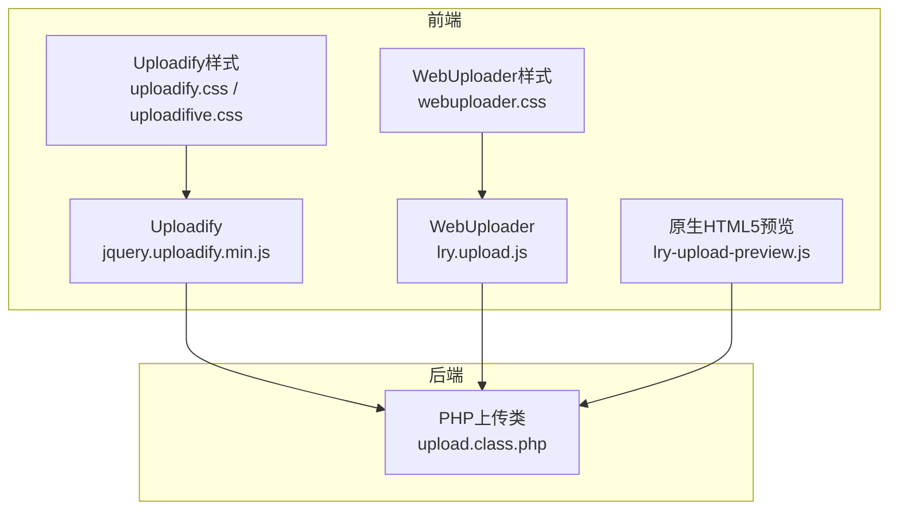
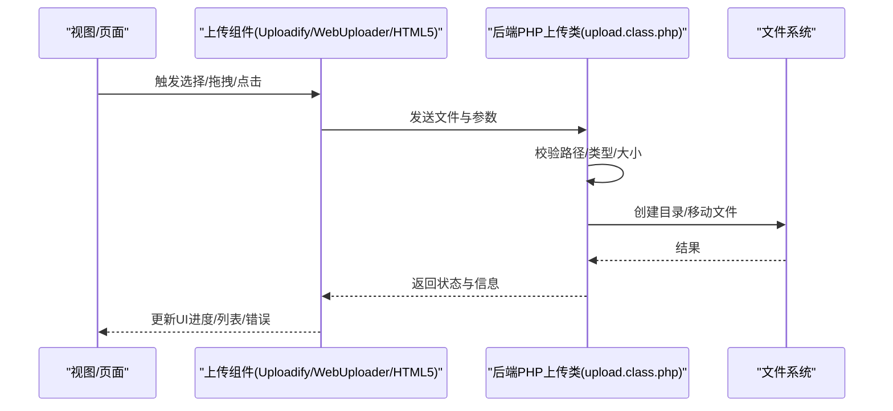
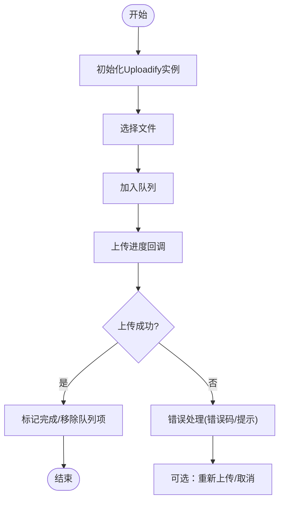
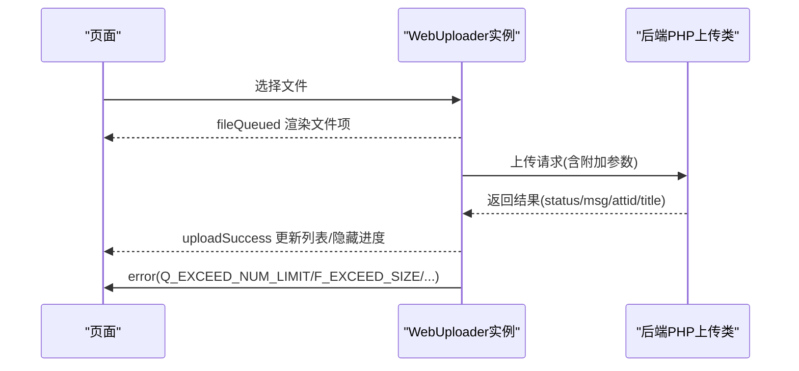
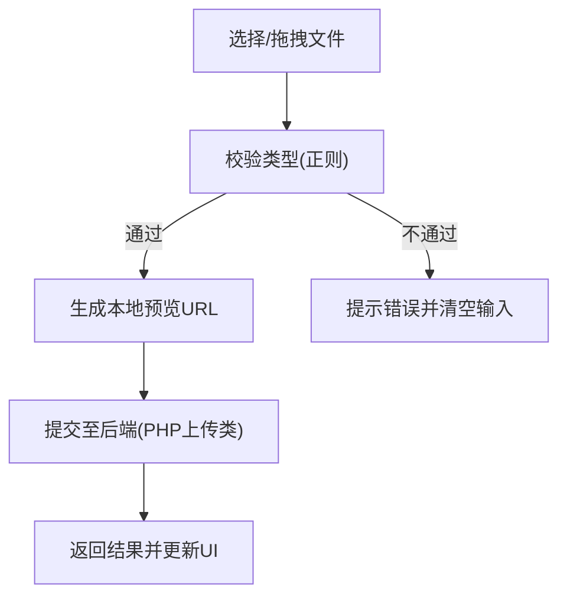
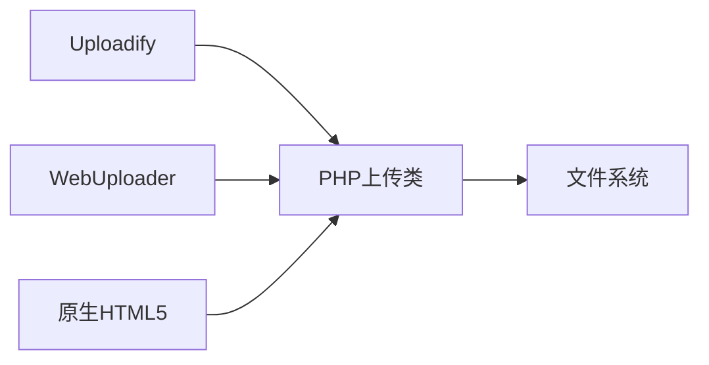
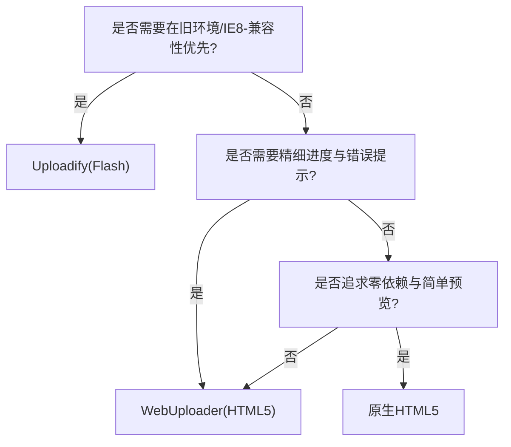

# 上传组件对比与选择

<cite>
**本文引用的文件**
- [common/static/plugin/uploadify/3.2.1/jquery.uploadify.min.js](file://common/static/plugin/uploadify/3.2.1/jquery.uploadify.min.js)
- [common/static/plugin/uploadify/3.2.1/uploadify.css](file://common/static/plugin/uploadify/3.2.1/uploadify.css)
- [common/static/plugin/uploadify/3.2.1/uploadifive.css](file://common/static/plugin/uploadify/3.2.1/uploadifive.css)
- [common/static/plugin/webuploader/lry.upload.js](file://common/static/plugin/webuploader/lry.upload.js)
- [common/static/plugin/webuploader/webuploader.css](file://common/static/plugin/webuploader/webuploader.css)
- [common/static/js/lry-upload-preview.js](file://common/static/js/lry-upload-preview.js)
- [ryphp/core/class/upload.class.php](file://ryphp/core/class/upload.class.php)
- [application/lry_admin_center/view/category_add.html](file://application/lry_admin_center/view/category_add.html)
</cite>

## 目录
1. [引言](#引言)
2. [项目结构](#项目结构)
3. [核心组件](#核心组件)
4. [架构总览](#架构总览)
5. [详细组件分析](#详细组件分析)
6. [依赖关系分析](#依赖关系分析)
7. [性能考量](#性能考量)
8. [故障排查指南](#故障排查指南)
9. [结论](#结论)
10. [附录](#附录)

## 引言
本文件面向 LRYBlog 的开发者与技术选型者，系统梳理并对比三类上传组件：Uploadify（基于 Flash 的传统上传）、WebUploader（现代化 HTML5 分片/断点上传）、以及原生 HTML5 上传（含拖拽与预览）。结合仓库中现有实现，给出配置要点、进度与批量能力、大文件处理、兼容性与资源消耗评估，并提供集成难度、维护成本与扩展性建议，最终形成组件选择决策树与迁移实践指引。

## 项目结构
LRYBlog 在前端静态资源中提供了三套上传方案：
- Uploadify：包含 JS 与样式，具备队列、进度、错误处理等行为
- WebUploader：包含自定义封装脚本与样式，展示文件项、进度、错误提示
- 原生 HTML5：提供上传预览插件，支持拖拽与本地预览
- 后端上传逻辑：统一由 PHP 类进行文件类型、大小、目标目录与移动等处理

图表来源
- [common/static/plugin/uploadify/3.2.1/jquery.uploadify.min.js](file://common/static/plugin/uploadify/3.2.1/jquery.uploadify.min.js#L1-L16)
- [common/static/plugin/webuploader/lry.upload.js](file://common/static/plugin/webuploader/lry.upload.js#L84-L161)
- [common/static/js/lry-upload-preview.js](file://common/static/js/lry-upload-preview.js#L7-L66)
- [ryphp/core/class/upload.class.php](file://ryphp/core/class/upload.class.php#L10-L241)

章节来源
- [common/static/plugin/uploadify/3.2.1/jquery.uploadify.min.js](file://common/static/plugin/uploadify/3.2.1/jquery.uploadify.min.js#L1-L16)
- [common/static/plugin/webuploader/lry.upload.js](file://common/static/plugin/webuploader/lry.upload.js#L84-L161)
- [common/static/js/lry-upload-preview.js](file://common/static/js/lry-upload-preview.js#L7-L66)
- [ryphp/core/class/upload.class.php](file://ryphp/core/class/upload.class.php#L10-L241)

## 核心组件
- Uploadify（Flash 方案）
  - 特点：成熟的队列管理、进度回调、错误码、批量选择与上传、按钮样式可定制
  - 适用：需要在旧环境或需统一外观时使用；对拖拽/预览要求不高
- WebUploader（HTML5 方案）
  - 特点：事件驱动、进度细粒度、错误分类、文件数量/大小限制、可扩展性强
  - 适用：现代浏览器、需要进度与错误提示、可扩展业务逻辑
- 原生 HTML5（预览与拖拽）
  - 特点：无需额外依赖、拖拽上传、本地预览、现代浏览器支持良好
  - 适用：简单场景、快速原型、移动端体验优先

章节来源
- [common/static/plugin/uploadify/3.2.1/jquery.uploadify.min.js](file://common/static/plugin/uploadify/3.2.1/jquery.uploadify.min.js#L1-L16)
- [common/static/plugin/webuploader/lry.upload.js](file://common/static/plugin/webuploader/lry.upload.js#L84-L161)
- [common/static/js/lry-upload-preview.js](file://common/static/js/lry-upload-preview.js#L7-L66)

## 架构总览
三类组件均通过 AJAX 与后端 PHP 类交互，后端负责：
- 校验上传路径、目录权限与创建
- 校验文件类型与大小
- 生成新文件名并移动到目标目录
- 返回上传结果与信息

图表来源
- [ryphp/core/class/upload.class.php](file://ryphp/core/class/upload.class.php#L189-L241)
- [common/static/plugin/webuploader/lry.upload.js](file://common/static/plugin/webuploader/lry.upload.js#L114-L127)
- [common/static/js/lry-upload-preview.js](file://common/static/js/lry-upload-preview.js#L29-L64)

## 详细组件分析

### Uploadify 组件分析
- 配置要点
  - 上传入口：通过初始化函数创建实例，绑定按钮占位符与上传地址
  - 事件回调：对话框开启/关闭、文件入队、上传进度、成功/失败、完成等
  - 参数：文件类型、大小限制、队列限制、POST 参数、进度显示模式等
- 进度显示
  - 提供上传进度回调，可在 UI 中渲染进度条
- 批量上传
  - 支持多文件选择与队列控制，自动轮询上传队列
- 错误处理
  - 区分队列错误与上传错误，提供错误码与文案提示
- 样式与外观
  - 提供按钮与队列项样式，可定制尺寸、文本、颜色等

图表来源
- [common/static/plugin/uploadify/3.2.1/jquery.uploadify.min.js](file://common/static/plugin/uploadify/3.2.1/jquery.uploadify.min.js#L1-L16)
- [common/static/plugin/uploadify/3.2.1/uploadify.css](file://common/static/plugin/uploadify/3.2.1/uploadify.css#L12-L22)
- [common/static/plugin/uploadify/3.2.1/uploadifive.css](file://common/static/plugin/uploadify/3.2.1/uploadifive.css#L17-L22)

章节来源
- [common/static/plugin/uploadify/3.2.1/jquery.uploadify.min.js](file://common/static/plugin/uploadify/3.2.1/jquery.uploadify.min.js#L1-L16)
- [common/static/plugin/uploadify/3.2.1/uploadify.css](file://common/static/plugin/uploadify/3.2.1/uploadify.css#L12-L22)
- [common/static/plugin/uploadify/3.2.1/uploadifive.css](file://common/static/plugin/uploadify/3.2.1/uploadifive.css#L17-L22)

### WebUploader 组件分析
- 初始化与事件
  - 通过配置对象创建实例，监听文件入队、进度、成功、失败、错误等事件
- 进度与 UI
  - 实时更新进度条与百分比，错误时显示错误码
- 校验与限制
  - 文件数量、单文件大小、重复文件、类型过滤等错误分类提示
- 附加参数
  - 可在发送前注入业务参数（如水印开关）

图表来源
- [common/static/plugin/webuploader/lry.upload.js](file://common/static/plugin/webuploader/lry.upload.js#L84-L161)
- [common/static/plugin/webuploader/webuploader.css](file://common/static/plugin/webuploader/webuploader.css#L26-L35)
- [ryphp/core/class/upload.class.php](file://ryphp/core/class/upload.class.php#L189-L241)

章节来源
- [common/static/plugin/webuploader/lry.upload.js](file://common/static/plugin/webuploader/lry.upload.js#L84-L161)
- [common/static/plugin/webuploader/webuploader.css](file://common/static/plugin/webuploader/webuploader.css#L7-L35)

### 原生 HTML5 上传分析
- 预览能力
  - 通过本地 URL 对象生成预览图，兼容主流浏览器
- 拖拽与选择
  - 支持拖拽选择与常规文件选择，配合预览增强用户体验
- 与后端对接
  - 通过标准表单提交或 AJAX 上传，后端统一由 PHP 类处理

图表来源
- [common/static/js/lry-upload-preview.js](file://common/static/js/lry-upload-preview.js#L7-L66)
- [ryphp/core/class/upload.class.php](file://ryphp/core/class/upload.class.php#L189-L241)

章节来源
- [common/static/js/lry-upload-preview.js](file://common/static/js/lry-upload-preview.js#L7-L66)
- [ryphp/core/class/upload.class.php](file://ryphp/core/class/upload.class.php#L189-L241)

## 依赖关系分析
- Uploadify
  - 依赖 Flash（通过 SWF 对象加载），在现代浏览器中可能受限
  - 依赖按钮占位符与样式文件
- WebUploader
  - 依赖 HTML5 与事件机制，样式独立，易于扩展
- 原生 HTML5
  - 依赖现代浏览器特性，兼容性较好
- 后端统一依赖
  - PHP 上传类负责路径、类型、大小、移动等

图表来源
- [common/static/plugin/uploadify/3.2.1/jquery.uploadify.min.js](file://common/static/plugin/uploadify/3.2.1/jquery.uploadify.min.js#L1-L16)
- [common/static/plugin/webuploader/lry.upload.js](file://common/static/plugin/webuploader/lry.upload.js#L84-L161)
- [common/static/js/lry-upload-preview.js](file://common/static/js/lry-upload-preview.js#L7-L66)
- [ryphp/core/class/upload.class.php](file://ryphp/core/class/upload.class.php#L189-L241)

章节来源
- [common/static/plugin/uploadify/3.2.1/jquery.uploadify.min.js](file://common/static/plugin/uploadify/3.2.1/jquery.uploadify.min.js#L1-L16)
- [common/static/plugin/webuploader/lry.upload.js](file://common/static/plugin/webuploader/lry.upload.js#L84-L161)
- [common/static/js/lry-upload-preview.js](file://common/static/js/lry-upload-preview.js#L7-L66)
- [ryphp/core/class/upload.class.php](file://ryphp/core/class/upload.class.php#L189-L241)

## 性能考量
- Uploadify（Flash）
  - 优点：界面统一、队列与进度成熟
  - 缺点：Flash 加载与兼容性问题；移动端支持弱；资源消耗相对较高
- WebUploader（HTML5）
  - 优点：事件丰富、进度可控、错误分类清晰、可扩展性强
  - 缺点：需引入额外 JS/CSS；对低端设备仍需注意内存与渲染压力
- 原生 HTML5
  - 优点：零依赖、现代浏览器支持好、预览即时
  - 缺点：功能相对简单，复杂场景需自行扩展

[本节为通用性能讨论，不直接分析具体文件]

## 故障排查指南
- Uploadify
  - 常见问题：Flash 插件缺失或版本过低、按钮占位符未找到、上传地址不可达
  - 排查：检查初始化参数、按钮占位符 ID、上传 URL 与跨域策略
- WebUploader
  - 常见问题：事件未绑定、错误码未处理、附加参数未注入
  - 排查：确认事件监听顺序、错误类型映射、sendAsBinary 等兼容性
- 原生 HTML5
  - 常见问题：IE 低版本预览异常、类型校验失败
  - 排查：回退方案、正则匹配与浏览器差异处理
- 后端
  - 常见问题：目录权限不足、类型不在白名单、大小超限
  - 排查：检查上传路径、allowtype、maxsize 配置与 PHP 上传限制

章节来源
- [common/static/plugin/uploadify/3.2.1/jquery.uploadify.min.js](file://common/static/plugin/uploadify/3.2.1/jquery.uploadify.min.js#L1-L16)
- [common/static/plugin/webuploader/lry.upload.js](file://common/static/plugin/webuploader/lry.upload.js#L142-L155)
- [common/static/js/lry-upload-preview.js](file://common/static/js/lry-upload-preview.js#L36-L64)
- [ryphp/core/class/upload.class.php](file://ryphp/core/class/upload.class.php#L57-L75)

## 结论
- 若需在旧环境或强调统一外观，可选用 Uploadify
- 若追求现代浏览器体验、需要进度与错误精细化控制，推荐 WebUploader
- 若场景简单、强调快速与零依赖，可采用原生 HTML5 预览与上传
- 无论选择哪一种，后端 PHP 上传类都应保持一致的校验与处理流程，确保系统稳定性

[本节为总结性内容，不直接分析具体文件]

## 附录

### 组件选择决策树

[本图为概念性决策树，不直接映射具体源文件]

### 实际项目中的应用案例
- 管理后台“栏目图片”上传
  - 页面通过弹窗触发附件上传，结合 WebUploader 展示文件列表与进度
  - 后端统一由 PHP 上传类处理，返回文件路径、缩略图与附加信息

章节来源
- [application/lry_admin_center/view/category_add.html](file://application/lry_admin_center/view/category_add.html#L48-L53)
- [common/static/plugin/webuploader/lry.upload.js](file://common/static/plugin/webuploader/lry.upload.js#L114-L127)

### 技术选型与迁移建议
- 选型维度
  - 功能需求（批量、进度、拖拽、预览、断点续传）
  - 兼容性（IE、移动端、Flash 支持）
  - 维护成本（依赖更新、事件维护、样式定制）
  - 扩展性（错误分类、附加参数、二次开发）
- 迁移步骤
  - 明确现有 Uploadify 的配置与回调，逐步替换为 WebUploader
  - 保留后端 PHP 上传类不变，确保接口一致性
  - 逐步引入原生 HTML5 预览，作为补充或替代方案

[本节为通用建议，不直接分析具体文件]