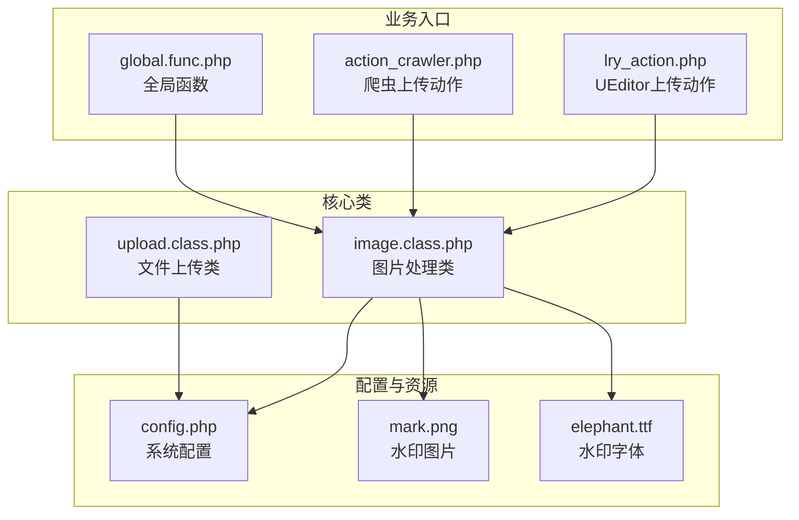
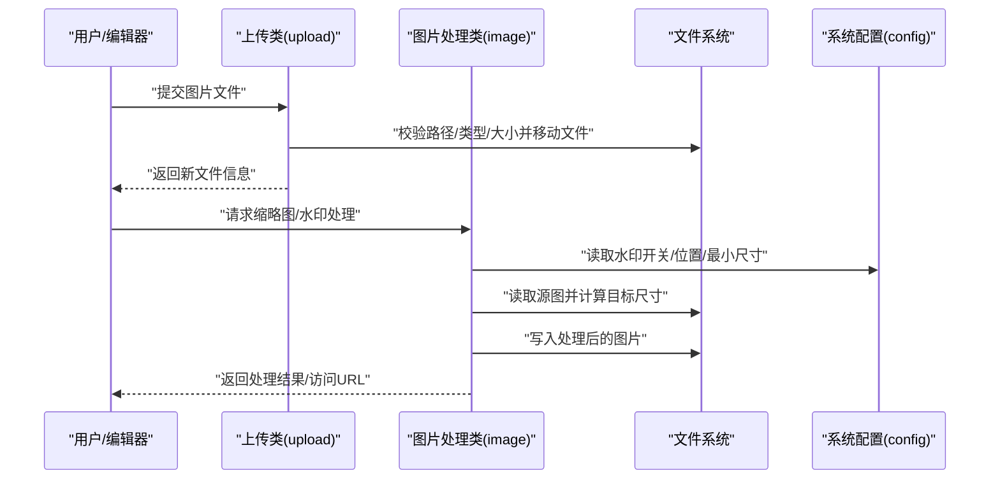
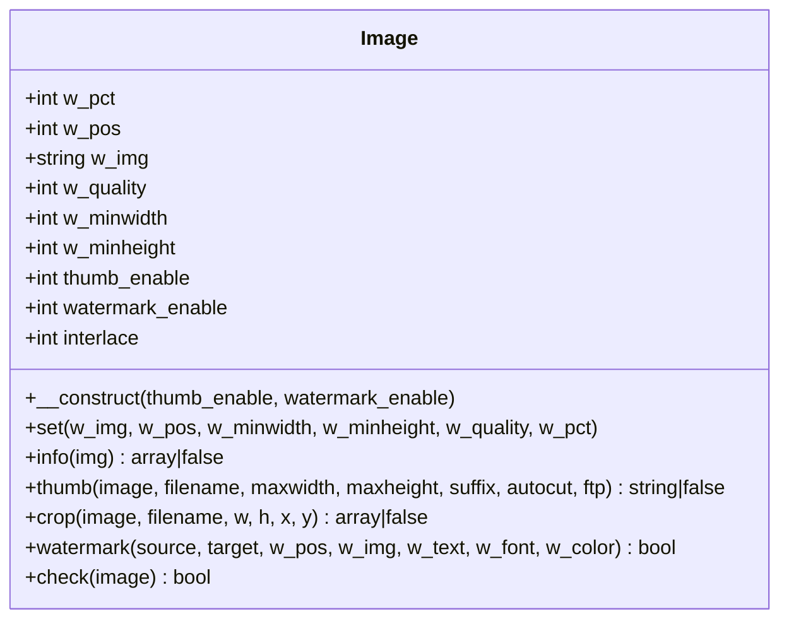
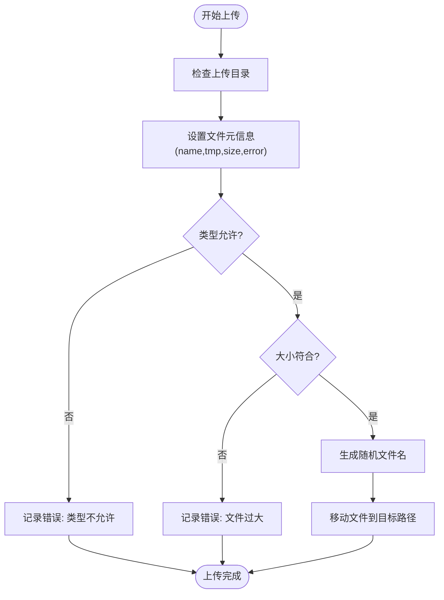
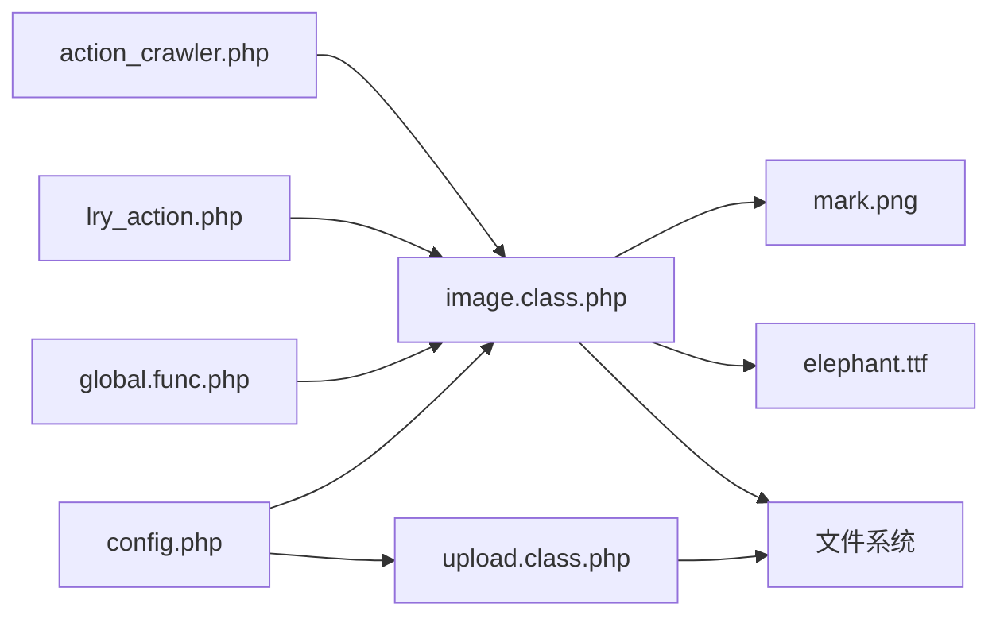
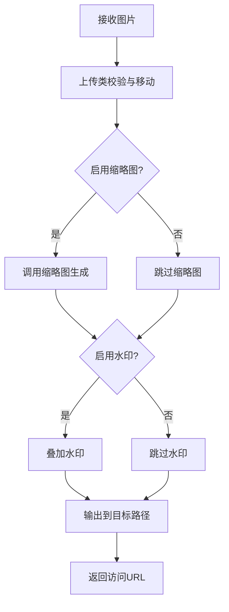

# 图片处理与水印功能

<cite>
**本文引用的文件**
- [image.class.php](file://ryphp/core/class/image.class.php)
- [upload.class.php](file://ryphp/core/class/upload.class.php)
- [config.php](file://common/config/config.php)
- [global.func.php](file://ryphp/core/function/global.func.php)
- [lry_action.php](file://common/static/plugin/ueditor/php/lry_action.php)
- [action_crawler.php](file://common/static/plugin/ueditor/php/action_crawler.php)
- [mark.png](file://common/data/water/mark.png)
- [elephant.ttf](file://common/data/font/elephant.ttf)
</cite>

## 目录
1. [简介](#简介)
2. [项目结构](#项目结构)
3. [核心组件](#核心组件)
4. [架构总览](#架构总览)
5. [详细组件分析](#详细组件分析)
6. [依赖关系分析](#依赖关系分析)
7. [性能考量](#性能考量)
8. [故障排查指南](#故障排查指南)
9. [结论](#结论)
10. [附录](#附录)

## 简介
本文件面向开发者与运维人员，系统性梳理 LRYBlog 的图片处理与水印能力，涵盖以下主题：
- 图片处理类的核心能力：缩放、裁剪、格式识别与输出、质量与隔行扫描等
- 水印功能机制：图片水印与文字水印、位置控制、透明度与最小尺寸阈值
- GD 库使用要点：图像资源管理、颜色与透明通道处理、绘制操作
- 上传后自动处理流程：尺寸调整、格式优化与存储策略
- 自定义配置：水印开关、位置、字体、颜色、布局与最小尺寸
- 缓存与 CDN 集成建议、性能优化方案
- 最佳实践、常见问题与调试技巧
- 扩展与定制开发指引

## 项目结构
围绕图片处理与水印的关键文件组织如下：
- 处理类与上传类：ryphp/core/class/image.class.php、ryphp/core/class/upload.class.php
- 系统配置：common/config/config.php（含水印与上传相关配置）
- 全局函数：ryphp/core/function/global.func.php（缩略图与水印调用入口）
- UEditor 插件动作：common/static/plugin/ueditor/php/lry_action.php、action_crawler.php（前端富文本编辑器上传与处理）
- 水印素材：common/data/water/mark.png、common/data/font/elephant.ttf

图表来源
- [image.class.php](file://ryphp/core/class/image.class.php#L1-L362)
- [upload.class.php](file://ryphp/core/class/upload.class.php#L1-L241)
- [config.php](file://common/config/config.php#L75-L81)
- [global.func.php](file://ryphp/core/function/global.func.php#L1300-L1340)
- [lry_action.php](file://common/static/plugin/ueditor/php/lry_action.php#L200-L260)
- [action_crawler.php](file://common/static/plugin/ueditor/php/action_crawler.php#L40-L50)

章节来源
- [image.class.php](file://ryphp/core/class/image.class.php#L1-L362)
- [upload.class.php](file://ryphp/core/class/upload.class.php#L1-L241)
- [config.php](file://common/config/config.php#L75-L81)

## 核心组件
- 图片处理类（image）：提供缩放、裁剪、水印、信息查询、GD 能力检测等能力；支持 GIF/PNG 透明通道与 JPEG 隔行扫描
- 文件上传类（upload）：负责上传路径、类型、大小、随机命名与移动文件等
- 系统配置（config）：集中管理水印开关、水印图片、水印位置、上传目录与最大尺寸等
- 全局函数（global.func）：封装缩略图与水印调用，作为业务层常用入口
- UEditor 动作（lry_action、action_crawler）：在富文本编辑器场景触发上传与自动处理

章节来源
- [image.class.php](file://ryphp/core/class/image.class.php#L10-L362)
- [upload.class.php](file://ryphp/core/class/upload.class.php#L10-L241)
- [config.php](file://common/config/config.php#L75-L81)
- [global.func.php](file://ryphp/core/function/global.func.php#L1300-L1340)
- [lry_action.php](file://common/static/plugin/ueditor/php/lry_action.php#L200-L260)
- [action_crawler.php](file://common/static/plugin/ueditor/php/action_crawler.php#L40-L50)

## 架构总览
图片处理与水印在系统中的典型流转：
- 用户上传图片（或通过富文本编辑器上传）
- 系统根据配置决定是否启用缩略图与水印
- 调用图片处理类完成缩放/裁剪/水印
- 输出到目标路径并返回访问 URL

图表来源
- [upload.class.php](file://ryphp/core/class/upload.class.php#L189-L203)
- [image.class.php](file://ryphp/core/class/image.class.php#L96-L163)
- [config.php](file://common/config/config.php#L75-L81)

## 详细组件分析

### 图片处理类（image）
职责与能力：
- 缩放（thumb）：按目标宽高与原图比例计算新尺寸，支持自动裁剪（等比放大至边界再裁剪）、GIF/PNG 透明背景与 Alpha 通道保存、JPEG 隔行扫描
- 裁剪（crop）：按指定区域裁剪并输出
- 水印（watermark）：支持图片水印与文字水印，位置枚举（0~9，含随机），透明度与最小尺寸阈值控制，文字水印使用 TTF 字体
- 信息查询（info）：获取宽高、类型、大小、MIME
- 能力检测（check）：检查 GD 扩展、文件类型与可读性

关键点与复杂度：
- 缩放算法基于宽高比比较，时间复杂度 O(1)，空间复杂度 O(w*h)
- 裁剪为固定矩形拷贝，时间复杂度 O(w*h)
- 水印涉及多分支逻辑与资源分配，时间复杂度取决于图像尺寸与水印类型
- 透明通道处理确保 PNG/GIF 输出质量

图表来源
- [image.class.php](file://ryphp/core/class/image.class.php#L10-L362)

章节来源
- [image.class.php](file://ryphp/core/class/image.class.php#L22-L362)

### 文件上传类（upload）
职责与能力：
- 初始化上传路径（按年/月/日分目录）
- 校验文件类型（限定 png/jpg/jpeg/gif）
- 校验文件大小（受配置限制）
- 随机命名（时间戳+随机数）
- 移动上传文件到目标目录

图表来源
- [upload.class.php](file://ryphp/core/class/upload.class.php#L189-L203)

章节来源
- [upload.class.php](file://ryphp/core/class/upload.class.php#L30-L241)

### 系统配置（config）
与图片处理相关的关键项：
- 附件上传配置：上传目录、上传类型（本地/云存储）、最大尺寸
- 水印配置：开关、水印图片名、水印位置、最小宽高阈值
- 缓存配置：file/redis/memcache 等，可用于缓存处理结果或元信息

章节来源
- [config.php](file://common/config/config.php#L75-L81)
- [config.php](file://common/config/config.php#L39-L66)

### 全局函数（global.func）
- 提供缩略图生成入口：调用 image 类完成缩放与可选裁剪
- 提供水印入口：调用 image 类完成水印叠加

章节来源
- [global.func.php](file://ryphp/core/function/global.func.php#L1300-L1340)

### UEditor 动作（lry_action、action_crawler）
- 在富文本编辑器上传场景中，初始化 image 类并执行缩略图与水印处理
- 作为前端交互与后端处理的桥接层

章节来源
- [lry_action.php](file://common/static/plugin/ueditor/php/lry_action.php#L200-L260)
- [action_crawler.php](file://common/static/plugin/ueditor/php/action_crawler.php#L40-L50)

## 依赖关系分析
- image 依赖 GD 扩展与系统配置；依赖 common/data 下的水印图片与字体
- upload 依赖系统配置中的上传目录与最大尺寸
- global.func 与 UEditor 动作均依赖 image 与 upload
- 配置文件贯穿于各组件，形成统一的策略来源

图表来源
- [config.php](file://common/config/config.php#L75-L81)
- [image.class.php](file://ryphp/core/class/image.class.php#L30-L34)
- [upload.class.php](file://ryphp/core/class/upload.class.php#L47-L52)
- [global.func.php](file://ryphp/core/function/global.func.php#L1300-L1340)
- [lry_action.php](file://common/static/plugin/ueditor/php/lry_action.php#L200-L260)
- [action_crawler.php](file://common/static/plugin/ueditor/php/action_crawler.php#L40-L50)

章节来源
- [config.php](file://common/config/config.php#L75-L81)
- [image.class.php](file://ryphp/core/class/image.class.php#L30-L34)
- [upload.class.php](file://ryphp/core/class/upload.class.php#L47-L52)
- [global.func.php](file://ryphp/core/function/global.func.php#L1300-L1340)
- [lry_action.php](file://common/static/plugin/ueditor/php/lry_action.php#L200-L260)
- [action_crawler.php](file://common/static/plugin/ueditor/php/action_crawler.php#L40-L50)

## 性能考量
- 缩放与裁剪
  - 优先使用高质量缩放（GD 的重采样函数）以降低锯齿
  - 对大图处理建议先降采样再水印，减少内存峰值
- 透明通道
  - PNG/GIF 输出务必开启 alpha 保存，避免背景色污染
- JPEG 输出
  - 合理设置质量参数与隔行扫描，平衡体积与加载体验
- 并发与缓存
  - 对热点图片生成缩略图与水印结果可做缓存（文件/Redis/Memcache），命中则直接返回
- CDN 集成
  - 处理后的图片路径指向 CDN 域名，结合缓存头与压缩策略提升加载速度
- I/O 优化
  - 上传目录按日期分层，避免单目录文件过多导致 I/O 延迟

## 故障排查指南
- GD 扩展缺失或不可用
  - 症状：缩放/水印失败
  - 排查：确认 GD 扩展已安装并启用；检查 image::check 返回值
- 水印未生效
  - 症状：图片无水印
  - 排查：检查水印开关、最小宽高阈值、水印图片路径与透明度；确认水印位置与源图尺寸关系
- 透明背景异常（PNG/GIF）
  - 症状：背景为白色而非透明
  - 排查：确保创建真彩画布、设置透明背景与保存 alpha 通道
- 上传失败
  - 症状：文件未移动或报错
  - 排查：检查上传目录权限、类型与大小限制、错误码；查看上传类错误消息
- 字体渲染问题
  - 症状：文字水印不显示或乱码
  - 排查：确认 TTF 字体存在且路径正确；检查颜色格式与字体大小

章节来源
- [image.class.php](file://ryphp/core/class/image.class.php#L358-L362)
- [upload.class.php](file://ryphp/core/class/upload.class.php#L57-L75)
- [upload.class.php](file://ryphp/core/class/upload.class.php#L81-L94)

## 结论
LRYBlog 的图片处理与水印体系以 image 为核心，配合 upload 与系统配置，实现了从上传到处理再到输出的闭环。通过合理的配置与 GD 资源管理，可在保证质量的同时兼顾性能。建议在生产环境中结合缓存与 CDN，并针对大图与高并发场景进行专项优化。

## 附录

### 图片处理流程（上传后自动处理）

图表来源
- [upload.class.php](file://ryphp/core/class/upload.class.php#L189-L203)
- [image.class.php](file://ryphp/core/class/image.class.php#L96-L163)
- [global.func.php](file://ryphp/core/function/global.func.php#L1300-L1340)

### 水印位置与布局
- 位置枚举：1~9 分别对应左上、顶部居中、右上、左侧居中、中心、右侧居中、左下、底部居中、右下；0 为随机
- 最小尺寸阈值：低于阈值的图片不加水印
- 透明度：图片水印支持透明度合并，文字水印使用颜色与字体大小

章节来源
- [image.class.php](file://ryphp/core/class/image.class.php#L221-L356)
- [config.php](file://common/config/config.php#L75-L81)

### GD 库使用要点
- 资源管理：创建源图与目标图后及时销毁，避免内存泄漏
- 颜色与透明：使用十六进制颜色字符串解析 RGB；PNG/GIF 需开启 alpha blending 与保存 alpha
- 绘制操作：图片水印使用复制或合并，文字水印使用 TTF 字体与颜色分配

章节来源
- [image.class.php](file://ryphp/core/class/image.class.php#L221-L356)

### 自定义配置清单
- 附件上传
  - 上传目录：用于存放上传文件
  - 上传类型：host/云存储类型
  - 最大尺寸：限制上传文件大小
- 水印
  - 开关：是否启用水印
  - 水印图片：common/data/water 下的图片文件
  - 水印位置：1~9 或 0（随机）
  - 最小宽高：低于该尺寸不加水印
  - 文字水印：TTF 字体路径与颜色

章节来源
- [config.php](file://common/config/config.php#L75-L81)
- [image.class.php](file://ryphp/core/class/image.class.php#L30-L34)
- [elephant.ttf](file://common/data/font/elephant.ttf)

### 扩展与定制开发指引
- 新增水印类型：在水印处理分支中增加新类型判断与资源加载
- 自定义布局：扩展位置枚举或新增布局策略（如多水印、旋转角度）
- 性能优化：引入异步任务队列处理大图；缓存热点缩略图；CDN 加速
- 安全加固：对上传文件进行二次校验与白名单过滤；限制文件类型与大小