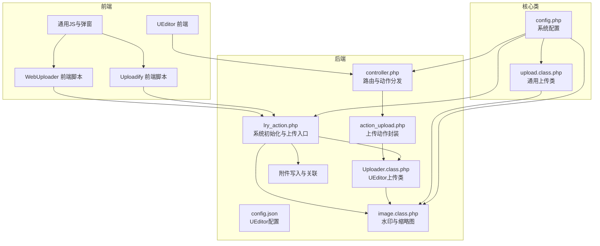
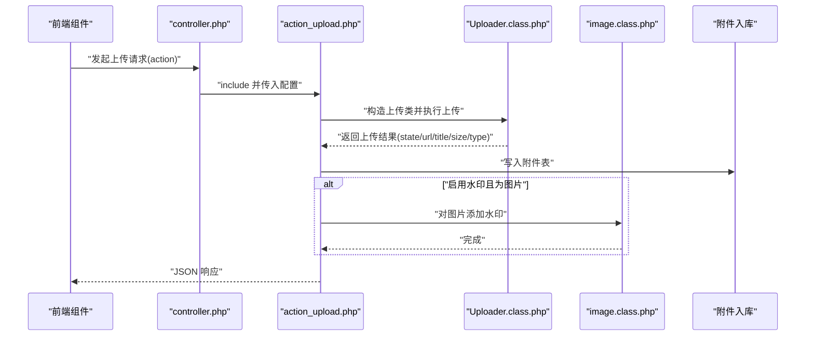
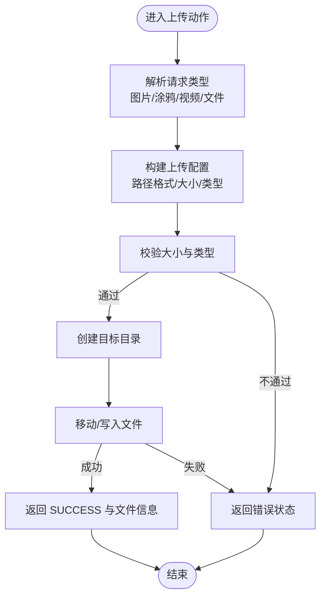
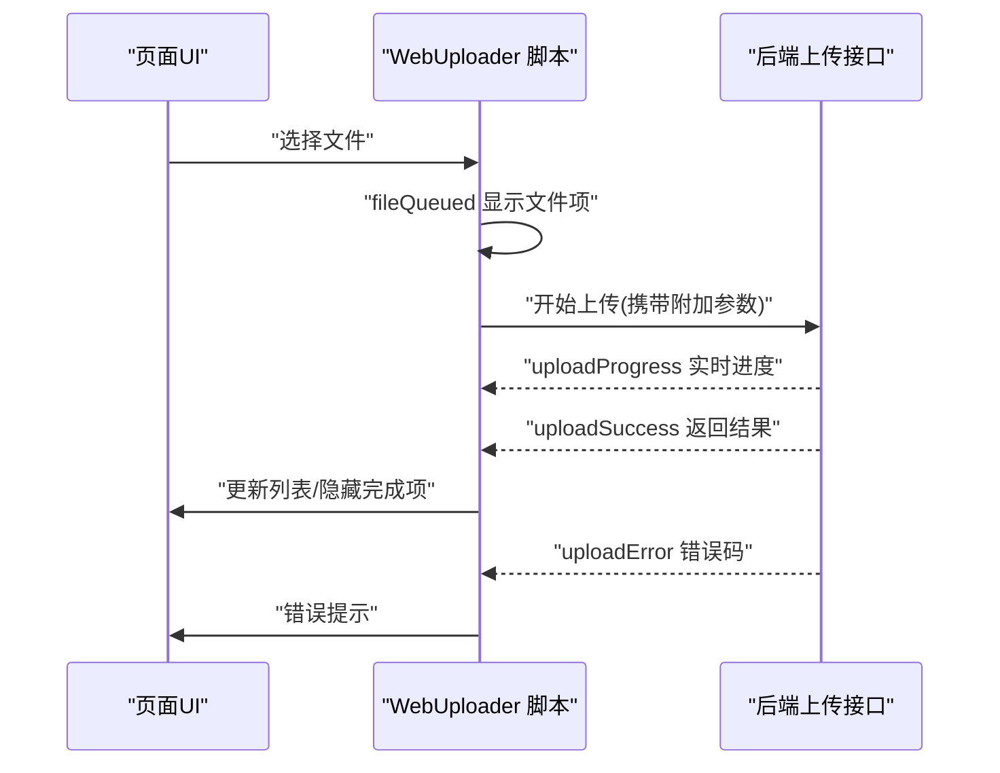
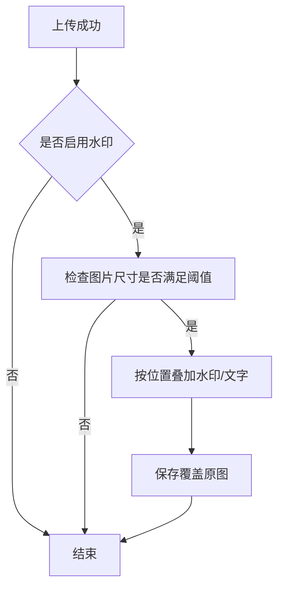
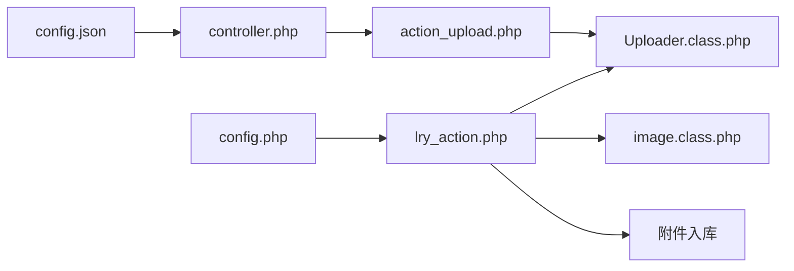

# 文件上传系统

<cite>
**本文引用的文件**
- [controller.php](file://common/static/plugin/ueditor/php/controller.php)
- [action_upload.php](file://common/static/plugin/ueditor/php/action_upload.php)
- [config.json](file://common/static/plugin/ueditor/php/config.json)
- [lry_action.php](file://common/static/plugin/ueditor/php/lry_action.php)
- [Uploader.class.php](file://common/static/plugin/ueditor/php/Uploader.class.php)
- [lry.upload.js](file://common/static/plugin/webuploader/lry.upload.js)
- [jquery.uploadify.min.js](file://common/static/plugin/uploadify/3.2.1/jquery.uploadify.min.js)
- [upload.class.php](file://ryphp/core/class/upload.class.php)
- [image.class.php](file://ryphp/core/class/image.class.php)
- [config.php](file://common/config/config.php)
- [header.html](file://application/lry_admin_center/view/header.html)
- [lry_common.js](file://common/static/js/lry_common.js)
</cite>

## 目录
1. [简介](#简介)
2. [项目结构](#项目结构)
3. [核心组件](#核心组件)
4. [架构总览](#架构总览)
5. [详细组件分析](#详细组件分析)
6. [依赖关系分析](#依赖关系分析)
7. [性能考量](#性能考量)
8. [故障排查指南](#故障排查指南)
9. [结论](#结论)
10. [附录](#附录)

## 简介
本文件上传系统围绕 LRYBlog 的后台与前台需求，提供了完整的富文本编辑器集成、多组件上传方案、文件类型与大小校验、安全检查、图片水印、进度反馈与批量上传能力，并给出存储策略、CDN 集成建议与访问控制思路。系统同时兼容传统 Uploadify 与现代 WebUploader，满足不同浏览器与场景需求。

## 项目结构
围绕上传功能的关键目录与文件如下：
- UEditor 后端适配层：common/static/plugin/ueditor/php
- WebUploader 前端脚本：common/static/plugin/webuploader/lry.upload.js
- Uploadify 前端脚本：common/static/plugin/uploadify/3.2.1/jquery.uploadify.min.js
- 上传核心类：ryphp/core/class/upload.class.php、image.class.php
- 系统配置：common/config/config.php
- 后台视图与通用 JS：application/lry_admin_center/view/header.html、common/static/js/lry_common.js

图表来源
- [controller.php](file://common/static/plugin/ueditor/php/controller.php#L1-L68)
- [lry_action.php](file://common/static/plugin/ueditor/php/lry_action.php#L1-L258)
- [Uploader.class.php](file://common/static/plugin/ueditor/php/Uploader.class.php#L1-L373)
- [action_upload.php](file://common/static/plugin/ueditor/php/action_upload.php#L1-L65)
- [config.json](file://common/static/plugin/ueditor/php/config.json#L1-L94)
- [lry.upload.js](file://common/static/plugin/webuploader/lry.upload.js#L1-L161)
- [jquery.uploadify.min.js](file://common/static/plugin/uploadify/3.2.1/jquery.uploadify.min.js#L1-L17)
- [upload.class.php](file://ryphp/core/class/upload.class.php#L1-L241)
- [image.class.php](file://ryphp/core/class/image.class.php#L1-L362)
- [config.php](file://common/config/config.php#L1-L88)

章节来源
- [controller.php](file://common/static/plugin/ueditor/php/controller.php#L1-L68)
- [lry_action.php](file://common/static/plugin/ueditor/php/lry_action.php#L1-L258)
- [Uploader.class.php](file://common/static/plugin/ueditor/php/Uploader.class.php#L1-L373)
- [action_upload.php](file://common/static/plugin/ueditor/php/action_upload.php#L1-L65)
- [config.json](file://common/static/plugin/ueditor/php/config.json#L1-L94)
- [lry.upload.js](file://common/static/plugin/webuploader/lry.upload.js#L1-L161)
- [jquery.uploadify.min.js](file://common/static/plugin/uploadify/3.2.1/jquery.uploadify.min.js#L1-L17)
- [upload.class.php](file://ryphp/core/class/upload.class.php#L1-L241)
- [image.class.php](file://ryphp/core/class/image.class.php#L1-L362)
- [config.php](file://common/config/config.php#L1-L88)

## 核心组件
- UEditor 后端适配与上传流程
  - 动作路由与配置注入：controller.php 根据 action 分发至具体处理逻辑，并合并系统配置（如上传大小、允许类型等）。
  - 上传动作封装：action_upload.php 根据请求类型选择图片/涂鸦/视频/文件的配置，调用上传类并返回标准 JSON 结果。
  - 上传类实现：Uploader.class.php 实现文件名校验、大小校验、目录创建、移动文件、远程抓取、Base64 上传等。
  - 系统集成：lry_action.php 完成系统初始化、权限校验、附件入库与水印触发。
- WebUploader 前端
  - 事件流：fileQueued、uploadProgress、uploadSuccess、uploadError、error、uploadBeforeSend 等。
  - 参数传递：在发送前将“是否开启水印”等参数附加到请求体。
  - UI 反馈：进度条、错误提示、文件列表更新。
- Uploadify 前端
  - 基于 Flash 的上传控件，提供队列、进度、错误处理与回调。
- 通用上传类与图像处理
  - upload.class.php：通用文件上传，含大小、类型、目录权限、移动文件等校验。
  - image.class.php：水印、缩略图、裁剪、透明度与尺寸控制。
- 系统配置
  - config.php：上传类型、上传目录、水印开关与参数、上传大小限制等。

章节来源
- [controller.php](file://common/static/plugin/ueditor/php/controller.php#L1-L68)
- [action_upload.php](file://common/static/plugin/ueditor/php/action_upload.php#L1-L65)
- [Uploader.class.php](file://common/static/plugin/ueditor/php/Uploader.class.php#L1-L373)
- [lry_action.php](file://common/static/plugin/ueditor/php/lry_action.php#L1-L258)
- [lry.upload.js](file://common/static/plugin/webuploader/lry.upload.js#L1-L161)
- [jquery.uploadify.min.js](file://common/static/plugin/uploadify/3.2.1/jquery.uploadify.min.js#L1-L17)
- [upload.class.php](file://ryphp/core/class/upload.class.php#L1-L241)
- [image.class.php](file://ryphp/core/class/image.class.php#L1-L362)
- [config.php](file://common/config/config.php#L1-L88)

## 架构总览
下图展示了从前端到后端再到存储与水印的整体流程：

图表来源
- [controller.php](file://common/static/plugin/ueditor/php/controller.php#L1-L68)
- [action_upload.php](file://common/static/plugin/ueditor/php/action_upload.php#L1-L65)
- [Uploader.class.php](file://common/static/plugin/ueditor/php/Uploader.class.php#L1-L373)
- [lry_action.php](file://common/static/plugin/ueditor/php/lry_action.php#L1-L258)
- [image.class.php](file://ryphp/core/class/image.class.php#L1-L362)

## 详细组件分析

### UEditor 集成与配置
- 初始化与工具栏定制
  - 通过 config.json 统一配置上传动作名、字段名、路径格式、大小限制、允许类型、列表路径等。
  - 在 lry_action.php 中动态拼接站点路径与上传目录，确保生成绝对可访问 URL。
- 插件扩展
  - 通过 action_upload.php 与 Uploader.class.php 的组合，可扩展图片、视频、文件与远程抓取等上传类型。
  - 支持 Base64 与远程拉取，满足截图工具与外链场景。
- 安全检查
  - 严格校验文件大小与类型，拒绝非法扩展名与超限文件；远程抓取时校验 URL 与 Content-Type。

图表来源
- [action_upload.php](file://common/static/plugin/ueditor/php/action_upload.php#L1-L65)
- [Uploader.class.php](file://common/static/plugin/ueditor/php/Uploader.class.php#L74-L127)

章节来源
- [config.json](file://common/static/plugin/ueditor/php/config.json#L1-L94)
- [lry_action.php](file://common/static/plugin/ueditor/php/lry_action.php#L1-L258)
- [controller.php](file://common/static/plugin/ueditor/php/controller.php#L1-L68)
- [action_upload.php](file://common/static/plugin/ueditor/php/action_upload.php#L1-L65)
- [Uploader.class.php](file://common/static/plugin/ueditor/php/Uploader.class.php#L1-L373)

### WebUploader 上传组件
- 事件与交互
  - fileQueued：新增文件项并显示名称与大小。
  - uploadProgress：实时更新进度百分比与进度条。
  - uploadSuccess：根据响应状态更新文件列表、隐藏已完成项、拼接附件 ID/路径/标题。
  - uploadError：显示错误码与提示。
  - error：针对数量、大小、重复、类型等错误进行统一提示。
  - uploadBeforeSend：向服务端附加“是否开启水印”等参数。
- 适用场景
  - 现代浏览器、需要进度与批量管理的场景；支持拖拽、多文件、断点续传（取决于服务端与浏览器支持）。

图表来源
- [lry.upload.js](file://common/static/plugin/webuploader/lry.upload.js#L84-L161)

章节来源
- [lry.upload.js](file://common/static/plugin/webuploader/lry.upload.js#L1-L161)

### Uploadify 上传组件
- 特性
  - 基于 Flash 的上传控件，提供对话框选择、队列管理、进度条、错误处理与回调。
  - 支持多文件、自动上传、限制数量与大小、重复文件处理等。
- 适用场景
  - 需要兼容旧浏览器或 Flash 环境的场景；现代浏览器建议优先使用 WebUploader。

章节来源
- [jquery.uploadify.min.js](file://common/static/plugin/uploadify/3.2.1/jquery.uploadify.min.js#L1-L17)

### 通用上传类与文件存储
- upload.class.php
  - 校验上传路径、类型、大小，随机命名，移动文件，错误码映射。
  - 存储路径按“年/月/日”组织，便于归档与清理。
- 存储策略与 CDN
  - 建议将 uploads 目录映射到 CDN 或对象存储（如 OSS/COS/七牛），通过配置项切换上传类型。
  - 生成的 URL 前缀可在 config.json 与系统配置中统一管理。

章节来源
- [upload.class.php](file://ryphp/core/class/upload.class.php#L1-L241)
- [config.php](file://common/config/config.php#L1-L88)

### 图片水印实现
- 触发时机
  - UEditor 上传成功后，若启用水印且为图片类型，调用 image.class.php 添加水印。
- 水印参数
  - 位置（0-9 随机）、透明度、最小宽高阈值、水印图片路径、质量等。
- 批量处理
  - 可在上传完成后遍历生成的图片集合进行批量水印处理（建议异步队列执行）。

图表来源
- [lry_action.php](file://common/static/plugin/ueditor/php/lry_action.php#L206-L257)
- [image.class.php](file://ryphp/core/class/image.class.php#L210-L356)

章节来源
- [lry_action.php](file://common/static/plugin/ueditor/php/lry_action.php#L1-L258)
- [image.class.php](file://ryphp/core/class/image.class.php#L1-L362)
- [config.php](file://common/config/config.php#L1-L88)

### 上传进度、断点续传与批量上传
- 进度显示
  - WebUploader 提供 uploadProgress 事件；Uploadify 提供进度条与速度显示。
- 断点续传
  - 前端层面可结合浏览器特性与服务端支持实现；当前仓库未见断点续传实现，建议引入分片上传方案（如 WebUploader 的分片策略）。
- 批量上传
  - WebUploader 与 Uploadify 均支持多文件队列与批量处理；注意服务端并发与资源占用。

章节来源
- [lry.upload.js](file://common/static/plugin/webuploader/lry.upload.js#L84-L161)
- [jquery.uploadify.min.js](file://common/static/plugin/uploadify/3.2.1/jquery.uploadify.min.js#L1-L17)

### 安全防护与访问控制
- 文件类型与大小限制
  - UEditor 侧通过 allowFiles 与 maxSize 控制；Uploader 侧二次校验。
- 远程抓取安全
  - 校验 URL、Content-Type、IP 白名单，避免内网探测与死链。
- 附件入库与关联
  - lry_action.php 中写入附件表并支持与内容关联，便于后续权限与审计。
- 访问控制
  - 登录态校验与权限判定在 lry_action.php 中完成；建议配合 CDN 回源鉴权与防盗链策略。

章节来源
- [Uploader.class.php](file://common/static/plugin/ueditor/php/Uploader.class.php#L174-L260)
- [lry_action.php](file://common/static/plugin/ueditor/php/lry_action.php#L122-L125)
- [config.json](file://common/static/plugin/ueditor/php/config.json#L1-L94)

## 依赖关系分析
- 前端依赖
  - WebUploader 依赖 jQuery 与自身 SDK；Uploadify 依赖 Flash。
- 后端依赖
  - controller.php 依赖 lry_action.php；lry_action.php 依赖 Uploader 类、image 类与系统函数库。
- 配置依赖
  - config.json 与 config.php 共同决定上传行为与路径格式。

图表来源
- [config.json](file://common/static/plugin/ueditor/php/config.json#L1-L94)
- [controller.php](file://common/static/plugin/ueditor/php/controller.php#L1-L68)
- [lry_action.php](file://common/static/plugin/ueditor/php/lry_action.php#L1-L258)
- [action_upload.php](file://common/static/plugin/ueditor/php/action_upload.php#L1-L65)
- [Uploader.class.php](file://common/static/plugin/ueditor/php/Uploader.class.php#L1-L373)
- [image.class.php](file://ryphp/core/class/image.class.php#L1-L362)

章节来源
- [config.json](file://common/static/plugin/ueditor/php/config.json#L1-L94)
- [controller.php](file://common/static/plugin/ueditor/php/controller.php#L1-L68)
- [lry_action.php](file://common/static/plugin/ueditor/php/lry_action.php#L1-L258)
- [action_upload.php](file://common/static/plugin/ueditor/php/action_upload.php#L1-L65)
- [Uploader.class.php](file://common/static/plugin/ueditor/php/Uploader.class.php#L1-L373)
- [image.class.php](file://ryphp/core/class/image.class.php#L1-L362)

## 性能考量
- 上传性能
  - 合理设置 maxSize 与 allowFiles，减少无效请求。
  - WebUploader 的分片与并发策略可根据网络环境调整。
- 存储性能
  - 使用 CDN 与对象存储可显著降低源站压力；按日期组织目录利于冷热分离。
- 图像处理
  - 水印与缩略图建议异步处理，避免阻塞上传响应；控制水印透明度与质量以平衡清晰度与体积。

## 故障排查指南
- 常见错误与定位
  - ERROR_SIZE_EXCEED：检查 config.json 与系统配置中的 maxSize。
  - ERROR_TYPE_NOT_ALLOWED：核对 allowFiles 与实际扩展名。
  - ERROR_CREATE_DIR / ERROR_DIR_NOT_WRITEABLE：检查上传目录权限与路径。
  - ERROR_FILE_MOVE：检查临时文件与磁盘空间。
  - 远程抓取失败：检查 URL、Content-Type、IP 白名单与网络连通性。
- 前端问题
  - WebUploader：关注 uploadError 与 error 事件，区分数量、大小、类型与重复文件。
  - Uploadify：确认 Flash 环境与版本兼容性。

章节来源
- [Uploader.class.php](file://common/static/plugin/ueditor/php/Uploader.class.php#L24-L46)
- [lry.upload.js](file://common/static/plugin/webuploader/lry.upload.js#L142-L155)

## 结论
该上传系统以 UEditor 为核心，结合 WebUploader 与 Uploadify，实现了多场景、多类型的文件上传能力。通过严格的类型与大小校验、远程抓取安全检查、附件入库与水印处理，满足后台富文本与媒体管理需求。建议在生产环境中进一步完善断点续传、异步水印处理与 CDN 回源鉴权，以提升稳定性与用户体验。

## 附录
- 上传组件选择建议
  - 现代浏览器与新功能需求：优先 WebUploader。
  - 旧浏览器或 Flash 环境：Uploadify。
  - 通用上传：upload.class.php 可作为独立上传组件使用。
- 配置要点
  - 在 config.php 中设置 upload_type、upload_file、watermark_* 等参数。
  - 在 config.json 中配置 UEditor 的上传路径格式与大小限制。

章节来源
- [config.php](file://common/config/config.php#L1-L88)
- [config.json](file://common/static/plugin/ueditor/php/config.json#L1-L94)
- [upload.class.php](file://ryphp/core/class/upload.class.php#L1-L241)
- [header.html](file://application/lry_admin_center/view/header.html#L1-L51)
- [lry_common.js](file://common/static/js/lry_common.js#L144-L152)