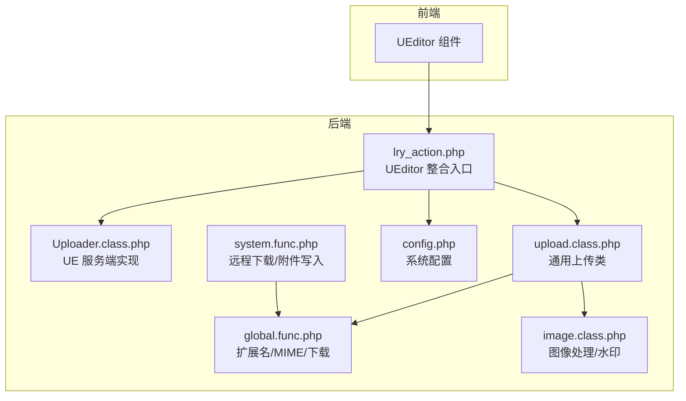
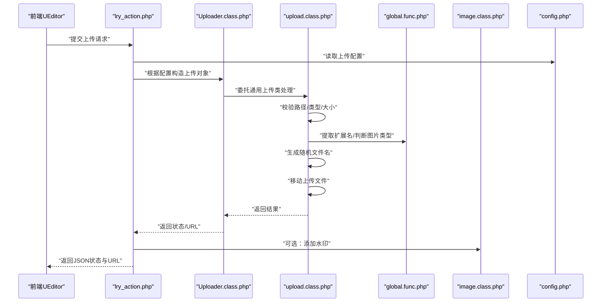
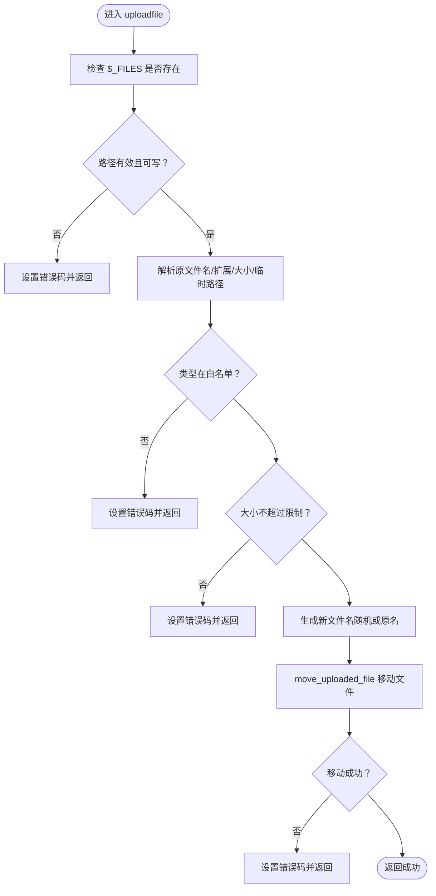
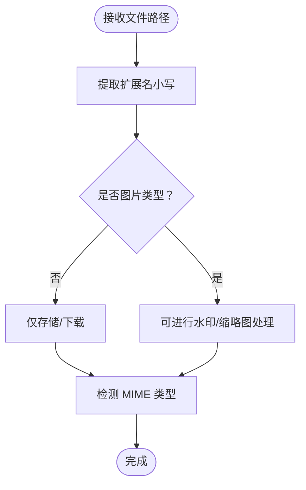
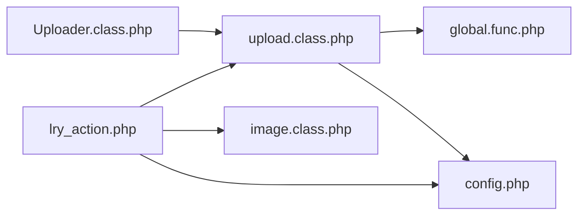

# 文件验证与安全机制

<cite>
**本文引用的文件**
- [upload.class.php](file://ryphp/core/class/upload.class.php)
- [global.func.php](file://ryphp/core/function/global.func.php)
- [image.class.php](file://ryphp/core/class/image.class.php)
- [config.php](file://common/config/config.php)
- [lry_action.php](file://common/static/plugin/ueditor/php/lry_action.php)
- [Uploader.class.php](file://common/static/plugin/ueditor/php/Uploader.class.php)
- [config.json](file://common/static/plugin/ueditor/php/config.json)
- [system.func.php](file://common/function/system.func.php)
</cite>

## 目录
1. [引言](#引言)
2. [项目结构](#项目结构)
3. [核心组件](#核心组件)
4. [架构总览](#架构总览)
5. [详细组件分析](#详细组件分析)
6. [依赖关系分析](#依赖关系分析)
7. [性能考量](#性能考量)
8. [故障排查指南](#故障排查指南)
9. [结论](#结论)
10. [附录](#附录)

## 引言
本文件聚焦于 LRYBlog 的文件验证与安全机制，围绕文件上传类的核心验证逻辑展开，涵盖文件类型检查、大小限制、安全过滤、扩展名与 MIME 类型检测、文件头验证、内容安全扫描、上传路径与权限控制、文件名随机化、目录遍历防护、白名单与黑名单配置、访问与存储安全策略，并提供最佳实践、常见攻击防护与安全审计建议，以及扩展安全规则的开发指导。

## 项目结构
与文件上传与安全相关的关键位置如下：
- 上传核心类：ryphp/core/class/upload.class.php
- 全局工具函数：ryphp/core/function/global.func.php（扩展名、MIME、下载等）
- 图像处理与水印：ryphp/core/class/image.class.php
- UEditor 整合入口与附件入库：common/static/plugin/ueditor/php/lry_action.php
- UEditor 服务端实现：common/static/plugin/ueditor/php/Uploader.class.php
- UEditor 配置：common/static/plugin/ueditor/php/config.json
- 系统配置（上传目录、水印、最大尺寸等）：common/config/config.php
- 远程图片下载与附件写入：common/function/system.func.php

图表来源
- [lry_action.php](file://common/static/plugin/ueditor/php/lry_action.php#L1-L200)
- [Uploader.class.php](file://common/static/plugin/ueditor/php/Uploader.class.php#L33-L137)
- [upload.class.php](file://ryphp/core/class/upload.class.php#L1-L241)
- [global.func.php](file://ryphp/core/function/global.func.php#L1010-L1209)
- [image.class.php](file://ryphp/core/class/image.class.php#L40-L239)
- [config.php](file://common/config/config.php#L75-L81)
- [system.func.php](file://common/function/system.func.php#L385-L452)

章节来源
- [upload.class.php](file://ryphp/core/class/upload.class.php#L1-L241)
- [global.func.php](file://ryphp/core/function/global.func.php#L1010-L1209)
- [image.class.php](file://ryphp/core/class/image.class.php#L40-L239)
- [config.php](file://common/config/config.php#L75-L81)
- [lry_action.php](file://common/static/plugin/ueditor/php/lry_action.php#L1-L200)
- [Uploader.class.php](file://common/static/plugin/ueditor/php/Uploader.class.php#L33-L137)
- [system.func.php](file://common/function/system.func.php#L385-L452)

## 核心组件
- 通用上传类 upload.class.php：负责路径校验、类型白名单、大小限制、随机文件名、移动上传文件、错误码与消息输出。
- 全局函数 global.func.php：提供扩展名提取、图片类型判定、文件下载（含 MIME 检测）、远程图片下载等。
- 图像处理 image.class.php：提供缩略图、裁剪、水印等能力，配合上传流程进行二次处理。
- UEditor 整合 lry_action.php：封装运行环境、加载系统类与函数、处理扩展名、写入附件表、触发水印。
- UEditor 服务端 Uploader.class.php：提供 UE 上传动作的通用实现（大小、类型、目录权限、移动文件）。
- 系统配置 config.php：定义上传目录、最大尺寸、水印开关与位置等。
- 远程下载 system.func.php：从内容中提取图片并下载到本地，写入附件表。

章节来源
- [upload.class.php](file://ryphp/core/class/upload.class.php#L10-L241)
- [global.func.php](file://ryphp/core/function/global.func.php#L1010-L1209)
- [image.class.php](file://ryphp/core/class/image.class.php#L40-L239)
- [lry_action.php](file://common/static/plugin/ueditor/php/lry_action.php#L1-L200)
- [Uploader.class.php](file://common/static/plugin/ueditor/php/Uploader.class.php#L33-L137)
- [config.php](file://common/config/config.php#L75-L81)
- [system.func.php](file://common/function/system.func.php#L385-L452)

## 架构总览
下图展示从 UEditor 到后端上传类与安全策略的整体流程：

图表来源
- [lry_action.php](file://common/static/plugin/ueditor/php/lry_action.php#L231-L257)
- [Uploader.class.php](file://common/static/plugin/ueditor/php/Uploader.class.php#L33-L137)
- [upload.class.php](file://ryphp/core/class/upload.class.php#L189-L203)
- [global.func.php](file://ryphp/core/function/global.func.php#L1015-L1027)
- [image.class.php](file://ryphp/core/class/image.class.php#L221-L239)
- [config.php](file://common/config/config.php#L75-L81)

## 详细组件分析

### 通用上传类 upload.class.php
- 路径安全
  - 自动创建上传目录，确保可写；失败返回错误码。
  - 上传路径格式按“年/月/日”分层，降低单目录文件过多风险。
- 类型与大小
  - 白名单类型由构造函数注入，结合配置读取最大尺寸。
  - 严格比对扩展名（小写）与允许类型集合。
- 随机文件名
  - 开启随机化时，生成基于时间戳与随机数的新文件名，避免暴露原始文件名。
- 错误处理
  - 映射 PHP 上传错误码与自定义错误码，提供可读错误信息。
- 移动文件
  - 使用安全的 move_uploaded_file，失败记录错误码。

图表来源
- [upload.class.php](file://ryphp/core/class/upload.class.php#L189-L203)
- [upload.class.php](file://ryphp/core/class/upload.class.php#L81-L94)
- [upload.class.php](file://ryphp/core/class/upload.class.php#L113-L120)
- [upload.class.php](file://ryphp/core/class/upload.class.php#L100-L107)
- [upload.class.php](file://ryphp/core/class/upload.class.php#L126-L141)
- [upload.class.php](file://ryphp/core/class/upload.class.php#L155-L166)

章节来源
- [upload.class.php](file://ryphp/core/class/upload.class.php#L10-L241)

### 扩展名与 MIME 检测
- 扩展名提取
  - 通过全局函数提取文件扩展名并转为小写，用于类型匹配与白名单校验。
- 图片类型判断
  - 提供 is_img 判定常用图片扩展名，用于水印与缩略图处理。
- MIME 类型检测
  - 文件下载时使用 finfo 或 mime_content_type 获取 MIME，便于安全响应与类型识别。
- UEditor 配置
  - config.json 中定义各上传动作的允许扩展名集合，作为前端与后端的约束依据。

图表来源
- [global.func.php](file://ryphp/core/function/global.func.php#L1015-L1027)
- [global.func.php](file://ryphp/core/function/global.func.php#L1069-L1103)
- [config.json](file://common/static/plugin/ueditor/php/config.json#L6-L71)

章节来源
- [global.func.php](file://ryphp/core/function/global.func.php#L1010-L1209)
- [config.json](file://common/static/plugin/ueditor/php/config.json#L1-L94)

### 文件头验证与内容安全扫描
- 现状说明
  - 通用上传类 upload.class.php 未实现基于文件头（魔数）的验证。
  - 图像处理 image.class.php 通过 getimagesize 获取类型与尺寸，但未做魔数校验。
  - UEditor 服务端 Uploader.class.php 未实现文件头校验。
- 建议增强
  - 在上传入口增加 finfo_open/mime_content_type 与 getimagesize 的联合校验，确保扩展名与实际类型一致。
  - 对可疑文件进行二次扫描（如使用 clamav 或第三方云扫描接口），并在入库前阻断。

章节来源
- [upload.class.php](file://ryphp/core/class/upload.class.php#L10-L241)
- [image.class.php](file://ryphp/core/class/image.class.php#L40-L58)
- [Uploader.class.php](file://common/static/plugin/ueditor/php/Uploader.class.php#L33-L137)

### 上传路径安全控制与目录遍历防护
- 路径分层
  - 上传路径按“年/月/日”分层，降低目录压力与潜在越权风险。
- 目录权限
  - 自动创建并校验可写性；失败返回错误码。
- 目录遍历
  - 未发现直接的路径拼接漏洞；建议在自定义扩展中对用户输入进行严格清洗与白名单校验。

章节来源
- [upload.class.php](file://ryphp/core/class/upload.class.php#L47-L52)
- [upload.class.php](file://ryphp/core/class/upload.class.php#L81-L94)

### 文件名随机化与存储策略
- 随机文件名
  - 采用时间戳+随机数组合，避免暴露原始文件名与路径信息。
- 存储策略
  - 结合系统配置的上传目录与分层路径，统一管理附件。

章节来源
- [upload.class.php](file://ryphp/core/class/upload.class.php#L126-L141)
- [config.php](file://common/config/config.php#L75-L81)

### 白名单与黑名单配置
- 白名单
  - 通用上传类 allowtype 与 UEditor config.json 的 allowFiles 构成双重白名单。
- 黑名单
  - 未见显式黑名单实现；可在自定义扩展中增加“禁止扩展名/禁止关键词”的规则。
- 建议
  - 将白名单集中管理，前后端保持一致；对上传动作区分图片/文档/媒体类型分别配置。

章节来源
- [upload.class.php](file://ryphp/core/class/upload.class.php#L12-L14)
- [config.json](file://common/static/plugin/ueditor/php/config.json#L6-L71)

### 权限控制与访问限制
- 登录态校验
  - lry_action.php 在处理上传前检查管理员或用户登录态，防止匿名上传。
- 附件入库
  - 成功上传后写入附件表，记录扩展名、是否图片、上传者、IP 等元数据，便于审计与追踪。

章节来源
- [lry_action.php](file://common/static/plugin/ueditor/php/lry_action.php#L122-L125)
- [lry_action.php](file://common/static/plugin/ueditor/php/lry_action.php#L165-L184)

### 远程图片下载与安全
- 功能概述
  - system.func.php 支持从内容中提取图片并下载到本地，自动过滤不可信域名，写入附件表。
- 安全要点
  - 下载前进行扩展名与图片类型校验；对 URL 进行基本合法性检查；失败不入库。

章节来源
- [system.func.php](file://common/function/system.func.php#L385-L452)

### UEditor 服务端实现与安全
- 核心流程
  - Uploader.class.php 实现大小限制、类型检查、目录创建与权限校验、文件移动。
- 错误映射
  - 将各类错误映射为统一的状态码，便于前端提示。

章节来源
- [Uploader.class.php](file://common/static/plugin/ueditor/php/Uploader.class.php#L33-L137)

## 依赖关系分析
- 上传类依赖
  - upload.class.php 依赖全局函数（扩展名、图片判断）与系统配置（上传目录、最大尺寸）。
- UEditor 集成
  - lry_action.php 负责加载系统类与函数、处理扩展名、写入附件表、可选水印。
- 图像处理
  - image.class.php 依赖 GD 扩展与 getimagesize，用于缩略图、裁剪与水印。

图表来源
- [upload.class.php](file://ryphp/core/class/upload.class.php#L10-L241)
- [global.func.php](file://ryphp/core/function/global.func.php#L1010-L1209)
- [config.php](file://common/config/config.php#L75-L81)
- [lry_action.php](file://common/static/plugin/ueditor/php/lry_action.php#L1-L200)
- [Uploader.class.php](file://common/static/plugin/ueditor/php/Uploader.class.php#L33-L137)
- [image.class.php](file://ryphp/core/class/image.class.php#L40-L239)

章节来源
- [upload.class.php](file://ryphp/core/class/upload.class.php#L10-L241)
- [lry_action.php](file://common/static/plugin/ueditor/php/lry_action.php#L1-L200)
- [Uploader.class.php](file://common/static/plugin/ueditor/php/Uploader.class.php#L33-L137)
- [global.func.php](file://ryphp/core/function/global.func.php#L1010-L1209)
- [image.class.php](file://ryphp/core/class/image.class.php#L40-L239)
- [config.php](file://common/config/config.php#L75-L81)

## 性能考量
- 目录分层：按“年/月/日”分层可降低单目录文件数量，提升文件系统性能。
- 随机文件名：避免同名冲突与热点写入。
- 图像处理：缩略图与水印在上传后异步处理更优，避免阻塞主流程。
- MIME 检测：在需要时才进行，避免不必要的系统调用。

## 故障排查指南
- 常见错误与定位
  - 路径无效或不可写：检查上传目录权限与路径拼接。
  - 文件过大：核对配置中的最大尺寸与 PHP 上传限制。
  - 类型不在白名单：确认扩展名与 allowFiles 配置一致。
  - 移动失败：检查临时文件是否存在与磁盘空间。
- 日志与审计
  - 附件表记录上传者、IP、扩展名、是否图片等，便于审计与回溯。
- 建议
  - 在生产环境启用更严格的白名单与内容扫描；对异常上传行为进行告警。

章节来源
- [upload.class.php](file://ryphp/core/class/upload.class.php#L57-L75)
- [lry_action.php](file://common/static/plugin/ueditor/php/lry_action.php#L165-L184)

## 结论
LRYBlog 的文件上传体系以通用上传类为核心，结合 UEditor 的前后端协作与系统配置，实现了路径分层、类型白名单、大小限制与随机文件名等基础安全措施。为进一步强化安全，建议补充文件头验证、MIME 一致性校验、内容安全扫描与黑名单策略，并完善目录遍历防护与访问控制，形成“多层防御”的上传安全体系。

## 附录

### 安全最佳实践清单
- 传输安全
  - 仅在 HTTPS 下启用上传，防止中间人篡改。
- 类型与内容
  - 严格白名单；拒绝可执行扩展；对图片进行魔数与 MIME 校验；对文档进行内容扫描。
- 路径与权限
  - 上传目录独立且最小权限；禁止执行权限；定期清理过期文件。
- 名称与命名
  - 强制随机文件名；禁止保留原始扩展名；避免路径穿越。
- 审计与监控
  - 记录上传者、IP、UA、扩展名、大小、时间；对异常行为告警。

### 自定义安全规则与扩展指导
- 扩展点
  - 在 lry_action.php 中扩展上传前校验（如关键词过滤、敏感文件检测）。
  - 在 upload.class.php 的 checkfiletype/checkfilesize 前插入自定义规则。
- 规则示例
  - 禁止扩展名：.php、.phtml、.sh、.exe 等。
  - 禁止关键词：eval、assert、exec、shell_exec 等。
  - 禁止头部：ZIP/RAR/DOCX 等被篡改的伪装文件。
- 集成建议
  - 与第三方病毒扫描服务对接，失败即拦截。
  - 对图片进行二次解码与二次校验，防止绕过。