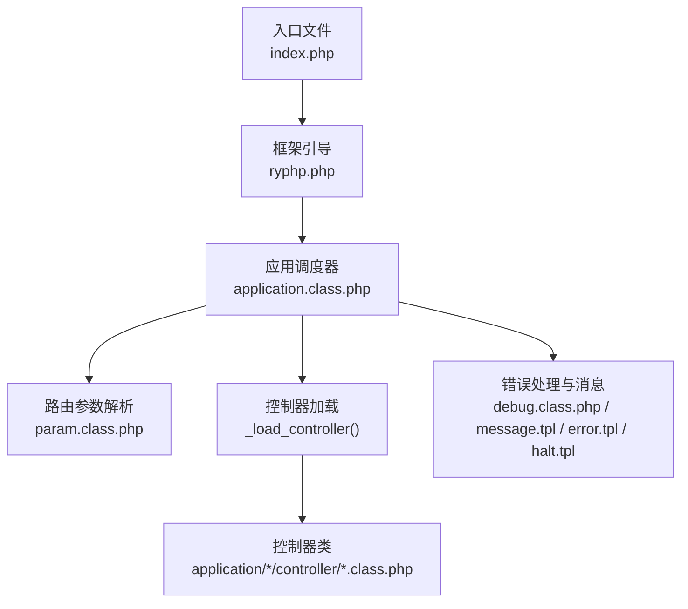
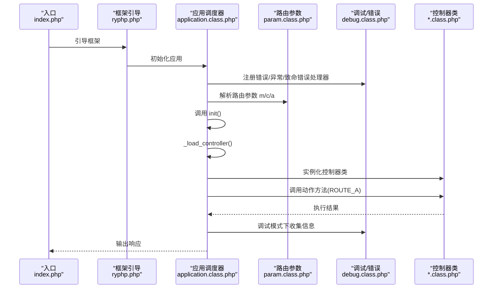
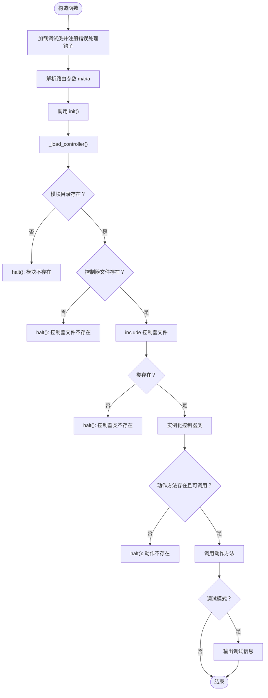
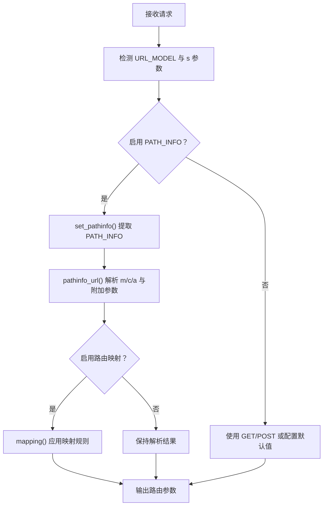
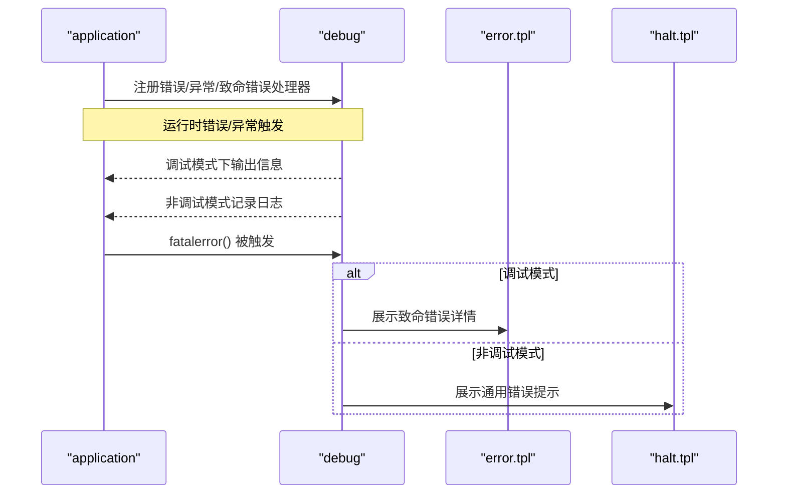
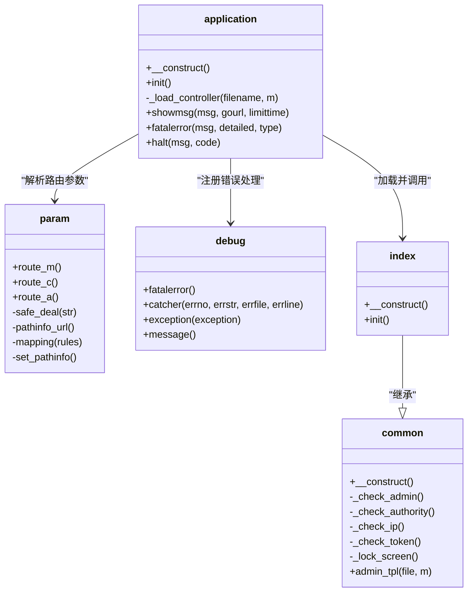
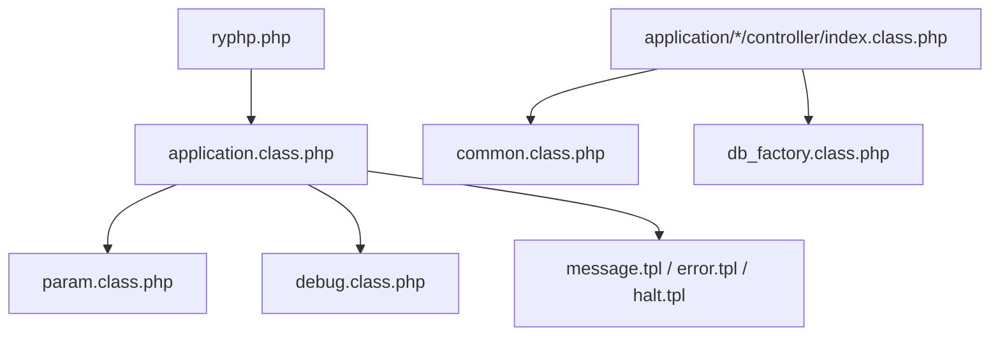

# 应用程序调度器

<cite>
**本文引用的文件**
- [application.class.php](file://ryphp/core/class/application.class.php)
- [debug.class.php](file://ryphp/core/class/debug.class.php)
- [param.class.php](file://ryphp/core/class/param.class.php)
- [ryphp.php](file://ryphp/ryphp.php)
- [global.func.php](file://ryphp/core/function/global.func.php)
- [config.php](file://common/config/config.php)
- [index.php](file://index.php)
- [index.class.php（前台首页控制器）](file://application/index/controller/index.class.php)
- [index.class.php（API首页控制器）](file://application/api/controller/index.class.php)
- [index.class.php（后台首页控制器）](file://application/lry_admin_center/controller/index.class.php)
- [common.class.php（后台公共控制器）](file://application/lry_admin_center/controller/common.class.php)
- [message.tpl](file://ryphp/core/message/message.tpl)
- [error.tpl](file://ryphp/core/message/error.tpl)
- [halt.tpl](file://ryphp/core/message/halt.tpl)
- [db_factory.class.php](file://ryphp/core/class/db_factory.class.php)
</cite>

## 目录
1. [简介](#简介)
2. [项目结构](#项目结构)
3. [核心组件](#核心组件)
4. [架构总览](#架构总览)
5. [详细组件分析](#详细组件分析)
6. [依赖关系分析](#依赖关系分析)
7. [性能考量](#性能考量)
8. [故障排查指南](#故障排查指南)
9. [结论](#结论)
10. [附录](#附录)

## 简介
本文档围绕应用程序调度器展开，聚焦于 application.class.php 的应用程序初始化流程与控制器加载机制，系统性解析以下关键点：
- 构造函数中的调试类加载、错误处理注册与路由参数解析
- init() 方法的控制器加载、路由参数获取、控制器实例化与方法调用
- _load_controller() 私有方法的文件路径解析、模块验证与类加载逻辑
- 错误处理机制：showmsg() 消息提示、fatalerror() 致命错误处理、halt() 终止方法
- 结合 MVC 架构，给出控制器层加载与执行流程的使用示例与最佳实践

## 项目结构
本项目采用经典的 MVC 分层与模块化组织方式：
- 入口文件负责环境常量定义与框架引导
- ryphp 框架内核提供类加载、路由、错误处理与模板消息展示
- application 目录按模块划分，每个模块包含 controller/model/view/common
- 前台、API、后台分别对应不同的模块与控制器

图表来源
- [index.php](file://index.php#L1-L18)
- [ryphp.php](file://ryphp/ryphp.php#L83-L202)
- [application.class.php](file://ryphp/core/class/application.class.php#L9-L65)
- [param.class.php](file://ryphp/core/class/param.class.php#L7-L15)
- [message.tpl](file://ryphp/core/message/message.tpl#L1-L277)
- [error.tpl](file://ryphp/core/message/error.tpl#L1-L179)
- [halt.tpl](file://ryphp/core/message/halt.tpl#L1-L223)

章节来源
- [index.php](file://index.php#L1-L18)
- [ryphp.php](file://ryphp/ryphp.php#L83-L202)

## 核心组件
- 应用调度器 application：负责应用初始化、路由参数解析、控制器加载与方法调用、错误处理与终止
- 路由参数 param：负责 m/c/a 参数解析、PATH_INFO 路由、安全处理与 URL 映射
- 调试与错误处理 debug：负责错误捕获、致命错误处理、异常处理与调试信息展示
- 框架引导 ryphp：提供类加载、系统常量、URL 模式与应用初始化入口
- 模板消息 message/error/halt：提供统一的消息提示、错误展示与终止页面

章节来源
- [application.class.php](file://ryphp/core/class/application.class.php#L4-L118)
- [param.class.php](file://ryphp/core/class/param.class.php#L3-L195)
- [debug.class.php](file://ryphp/core/class/debug.class.php#L3-L147)
- [ryphp.php](file://ryphp/ryphp.php#L83-L202)

## 架构总览
应用从入口文件开始，加载框架内核，初始化应用调度器，解析路由参数，定位并实例化控制器，调用指定动作方法，并在调试模式下输出调试信息；同时注册错误处理钩子，统一处理错误与异常。

图表来源
- [index.php](file://index.php#L10-L18)
- [ryphp.php](file://ryphp/ryphp.php#L88-L90)
- [application.class.php](file://ryphp/core/class/application.class.php#L9-L40)
- [param.class.php](file://ryphp/core/class/param.class.php#L22-L46)
- [debug.class.php](file://ryphp/core/class/debug.class.php#L46-L112)

## 详细组件分析

### 应用调度器 application：初始化与控制器加载
- 构造函数职责
  - 加载调试类并注册错误处理钩子：注册关闭函数、错误处理器、异常处理器
  - 解析路由参数：从 param 类获取 m/c/a 并定义常量
  - 触发 init() 初始化流程
- init() 方法
  - 通过 _load_controller() 加载控制器
  - 校验动作方法是否存在且不以“_”开头
  - 调用动作方法，调试模式下输出调试信息
- _load_controller() 私有方法
  - 依据 ROUTE_M/ROUTE_C 解析模块与控制器文件路径
  - 校验模块目录存在性
  - 校验控制器文件存在性并 include
  - 校验类是否存在并实例化
  - 任何环节失败均通过 halt() 终止
- 错误处理方法
  - showmsg()：统一消息提示页面，支持自动跳转与倒计时
  - fatalerror()：致命错误展示，区分调试与非调试模式
  - halt()：通用错误终止，支持状态码与自定义错误页

图表来源
- [application.class.php](file://ryphp/core/class/application.class.php#L9-L65)
- [debug.class.php](file://ryphp/core/class/debug.class.php#L46-L69)

章节来源
- [application.class.php](file://ryphp/core/class/application.class.php#L9-L118)

### 路由参数 param：参数解析与 URL 路由
- 路由参数获取
  - route_m()/route_c()/route_a()：优先从 GET/POST 获取，其次使用配置默认值
  - safe_deal()：安全处理，去除危险字符、长度限制、转义处理
- URL 路由（PATH_INFO 模式）
  - set_pathinfo()：提取 PATH_INFO，去除脚本名与查询串
  - pathinfo_url()：解析模块/控制器/动作与额外键值对
  - mapping()：根据规则进行路由映射
- URL 模式与配置
  - URL_MODEL 与配置项控制 URL 生成与解析行为

图表来源
- [param.class.php](file://ryphp/core/class/param.class.php#L95-L116)
- [param.class.php](file://ryphp/core/class/param.class.php#L138-L151)
- [param.class.php](file://ryphp/core/class/param.class.php#L173-L183)
- [config.php](file://common/config/config.php#L23-L30)

章节来源
- [param.class.php](file://ryphp/core/class/param.class.php#L7-L195)
- [config.php](file://common/config/config.php#L23-L30)

### 调试与错误处理：debug 与消息模板
- 错误处理钩子
  - register_shutdown_function(array('debug','fatalerror'))
  - set_error_handler(array('debug','catcher'))
  - set_exception_handler(array('debug','exception'))
- 致命错误 fatalerror()
  - 捕获最后错误，区分 E_ERROR/E_PARSE 等
  - 调试模式显示详细错误，非调试模式记录日志并统一提示
- 错误捕获 catcher() 与异常 exception()
  - 调试模式输出彩色错误信息，非调试模式记录日志
- 消息模板
  - message.tpl：消息提示与自动跳转
  - error.tpl：致命错误页面
  - halt.tpl：通用错误终止页面

图表来源
- [application.class.php](file://ryphp/core/class/application.class.php#L10-L13)
- [debug.class.php](file://ryphp/core/class/debug.class.php#L46-L112)
- [error.tpl](file://ryphp/core/message/error.tpl#L1-L179)
- [halt.tpl](file://ryphp/core/message/halt.tpl#L1-L223)

章节来源
- [debug.class.php](file://ryphp/core/class/debug.class.php#L46-L112)
- [application.class.php](file://ryphp/core/class/application.class.php#L77-L115)

### 控制器层加载与执行流程（MVC）
- 控制器类命名规范：类名与控制器文件名一致，位于 application/{module}/controller/{controller}.class.php
- 控制器基类与继承：后台控制器通常继承公共基类 common，实现权限校验、日志记录、模板路径等
- 数据访问：D() 工厂函数通过 db_factory 选择具体数据库实现（mysql/mysqli/pdo）

图表来源
- [application.class.php](file://ryphp/core/class/application.class.php#L4-L118)
- [param.class.php](file://ryphp/core/class/param.class.php#L3-L195)
- [debug.class.php](file://ryphp/core/class/debug.class.php#L3-L147)
- [common.class.php](file://application/lry_admin_center/controller/common.class.php#L5-L153)
- [index.class.php（后台首页控制器）](file://application/lry_admin_center/controller/index.class.php#L4-L162)

章节来源
- [application.class.php](file://ryphp/core/class/application.class.php#L24-L65)
- [common.class.php](file://application/lry_admin_center/controller/common.class.php#L8-L18)
- [index.class.php（前台首页控制器）](file://application/index/controller/index.class.php#L4-L18)
- [index.class.php（API首页控制器）](file://application/api/controller/index.class.php#L5-L22)

## 依赖关系分析
- application 依赖 param 提供路由参数，依赖 debug 提供错误处理与调试
- ryphp 提供类加载与系统常量，供 application 与控制器使用
- 控制器依赖 common 基类与 D() 数据访问工厂
- 模板消息文件为错误处理提供统一展示

图表来源
- [application.class.php](file://ryphp/core/class/application.class.php#L9-L18)
- [param.class.php](file://ryphp/core/class/param.class.php#L7-L15)
- [debug.class.php](file://ryphp/core/class/debug.class.php#L46-L69)
- [ryphp.php](file://ryphp/ryphp.php#L108-L140)
- [common.class.php](file://application/lry_admin_center/controller/common.class.php#L5-L18)
- [db_factory.class.php](file://ryphp/core/class/db_factory.class.php#L11-L49)

章节来源
- [ryphp.php](file://ryphp/ryphp.php#L108-L140)
- [db_factory.class.php](file://ryphp/core/class/db_factory.class.php#L11-L49)

## 性能考量
- 调试模式下会输出调试信息与 SQL 统计，建议仅在开发环境开启
- 控制器动作方法调用前后可结合 debug::spent() 统计耗时
- 路由解析与类加载采用静态缓存策略，减少重复 IO 与反射开销
- URL 模式与路由映射应谨慎配置，避免过度复杂导致解析成本上升

## 故障排查指南
- 控制器类不存在或文件缺失
  - 症状：提示控制器类不存在或控制器文件不存在
  - 排查：确认模块目录与控制器文件路径正确，类名与文件名一致
- 动作方法不可访问或不存在
  - 症状：提示动作不存在或以“_”开头的动作不可访问
  - 排查：确认动作方法存在且不以“_”开头
- 致命错误
  - 症状：页面显示致命错误或记录日志
  - 排查：查看错误日志，定位具体文件与行号，修复语法或资源问题
- 路由参数异常
  - 症状：m/c/a 参数被安全处理或默认值生效
  - 排查：检查 URL 模式、PATH_INFO 设置与路由映射规则

章节来源
- [application.class.php](file://ryphp/core/class/application.class.php#L52-L64)
- [application.class.php](file://ryphp/core/class/application.class.php#L37-L39)
- [debug.class.php](file://ryphp/core/class/debug.class.php#L46-L69)
- [param.class.php](file://ryphp/core/class/param.class.php#L54-L60)

## 结论
应用程序调度器通过清晰的初始化流程与严格的控制器加载机制，实现了 MVC 架构中控制器层的稳定加载与执行。配合路由参数解析、统一错误处理与调试信息输出，为开发者提供了可靠的开发与运维体验。遵循本文的最佳实践，可在保证安全性的同时提升系统性能与可维护性。

## 附录

### 使用示例与最佳实践
- 前台控制器示例
  - 类名与文件名一致，位于 application/index/controller/index.class.php
  - 构造函数中处理分页参数，init() 中调用模型查询并输出
- API 控制器示例
  - 位于 application/api/controller/index.class.php
  - 通过系统类加载验证码类并生成验证码
- 后台控制器示例
  - 位于 application/lry_admin_center/controller/index.class.php
  - 继承 common 基类，实现登录、退出、主页等功能
  - common 基类完成管理员身份校验、权限校验、IP 校验、Token 校验与锁屏处理
- 最佳实践
  - 控制器类名与文件名严格一致，避免大小写差异
  - 动作方法不以“_”开头，避免被 halt() 拒绝访问
  - 调试模式仅在开发环境开启，生产环境关闭调试与详细错误展示
  - URL 模式与路由映射配置简洁明确，避免复杂规则导致性能下降
  - 使用 D() 工厂函数访问数据库，统一通过 db_factory 选择底层实现

章节来源
- [index.class.php（前台首页控制器）](file://application/index/controller/index.class.php#L4-L18)
- [index.class.php（API首页控制器）](file://application/api/controller/index.class.php#L5-L22)
- [index.class.php（后台首页控制器）](file://application/lry_admin_center/controller/index.class.php#L4-L162)
- [common.class.php（后台公共控制器）](file://application/lry_admin_center/controller/common.class.php#L8-L18)
- [db_factory.class.php](file://ryphp/core/class/db_factory.class.php#L11-L49)