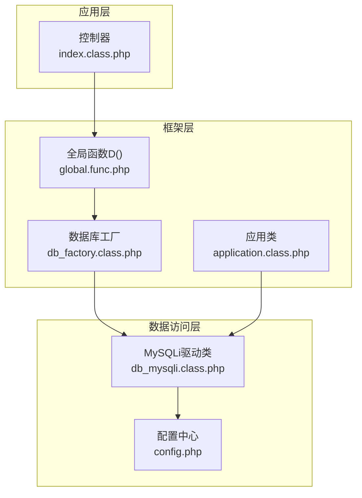
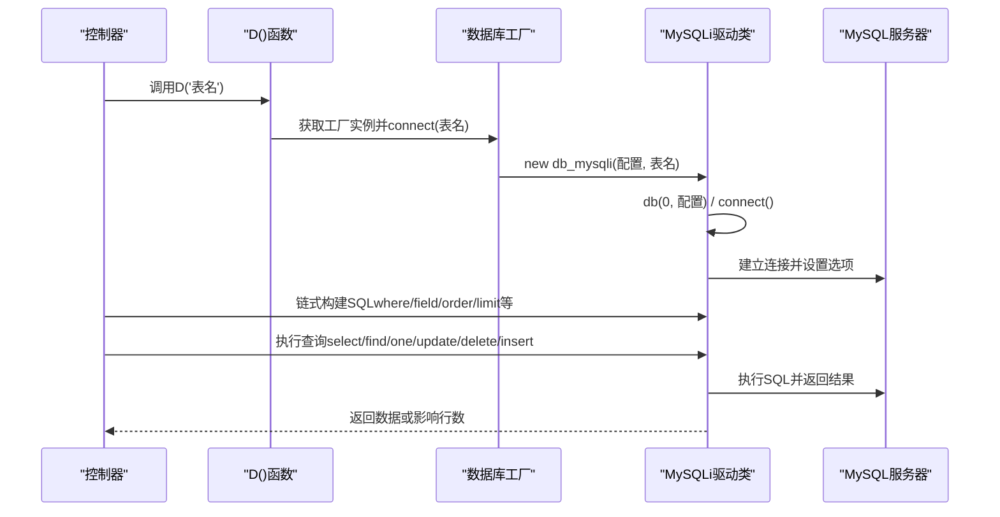
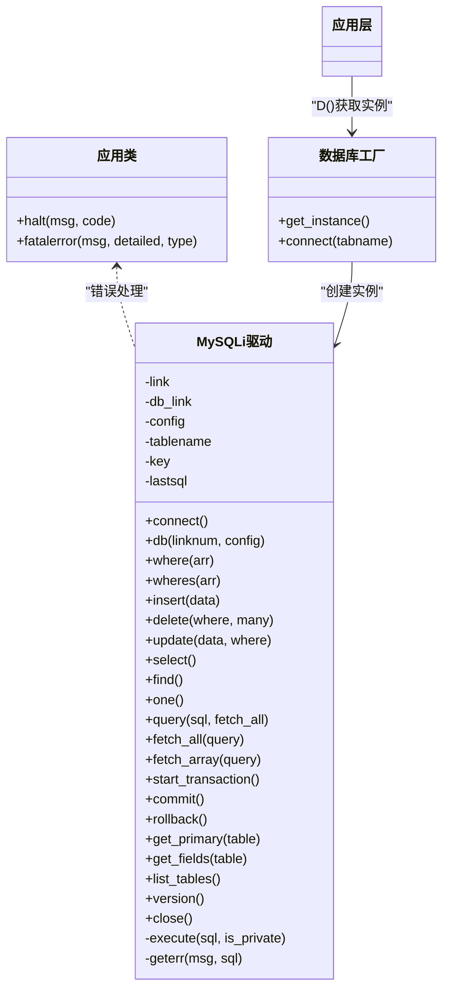

# MySQLi面向对象驱动

<cite>
**本文档引用的文件**
- [db_mysqli.class.php](file://ryphp/core/class/db_mysqli.class.php)
- [db_factory.class.php](file://ryphp/core/class/db_factory.class.php)
- [global.func.php](file://ryphp/core/function/global.func.php)
- [config.php](file://common/config/config.php)
- [application.class.php](file://ryphp/core/class/application.class.php)
- [DbException.class.php](file://ryphp/core/class/DbException.class.php)
- [index.class.php](file://application/index/controller/index.class.php)
</cite>

## 目录
1. [简介](#简介)
2. [项目结构](#项目结构)
3. [核心组件](#核心组件)
4. [架构总览](#架构总览)
5. [详细组件分析](#详细组件分析)
6. [依赖关系分析](#依赖关系分析)
7. [性能考虑](#性能考虑)
8. [故障排查指南](#故障排查指南)
9. [结论](#结论)
10. [附录](#附录)

## 简介
本文件针对基于MySQLi扩展的面向对象数据库驱动进行深入技术解析，重点围绕ryphp框架中的db_mysqli.class.php实现，系统阐述其面向对象的数据库连接与查询处理机制。同时对比传统MySQL扩展，总结MySQLi在面向对象接口、预处理语句支持、面向对象的错误处理以及增强安全特性方面的优势；并详细说明连接模式（过程式与面向对象）、预处理语句与参数绑定机制、二进制数据处理、事务支持与多语句执行能力。最后提供完整的使用示例与性能优化建议，帮助开发者充分挖掘MySQLi驱动的特性。

## 项目结构
本项目采用分层与模块化的组织方式，数据库驱动位于核心类库目录，配合工厂类与全局函数完成实例化与配置注入；控制器层通过便捷函数D()获取数据库实例并执行查询。

**图表来源**
- [index.class.php:14-17](file://application/index/controller/index.class.php#L14-L17)
- [global.func.php:100-108](file://ryphp/core/function/global.func.php#L100-L108)
- [db_factory.class.php:38-49](file://ryphp/core/class/db_factory.class.php#L38-L49)
- [db_mysqli.class.php:10-28](file://ryphp/core/class/db_mysqli.class.php#L10-L28)
- [config.php:13-22](file://common/config/config.php#L13-L22)

**章节来源**
- [global.func.php:100-108](file://ryphp/core/function/global.func.php#L100-L108)
- [db_factory.class.php:11-34](file://ryphp/core/class/db_factory.class.php#L11-L34)
- [db_mysqli.class.php:10-28](file://ryphp/core/class/db_mysqli.class.php#L10-L28)
- [config.php:13-22](file://common/config/config.php#L13-L22)

## 核心组件
- MySQLi驱动类（db_mysqli.class.php）
  - 面向对象的连接管理与资源池
  - 链式构建SQL（where/wheres、field、order、limit、group、having、join）
  - 增删改查（insert、insert_all、delete、update、select、find、one）
  - 事务控制（start_transaction、commit、rollback）
  - 辅助功能（get_primary、get_fields、list_tables、version、close）
  - 错误处理与调试（geterr、lastsql、query与fetch系列）

- 数据库工厂类（db_factory.class.php）
  - 根据配置选择数据库驱动类型（pdo、mysqli、mysql）
  - 注入配置并创建对应驱动实例

- 全局函数与便捷入口（global.func.php）
  - D()函数：统一获取数据库实例，支持表级缓存
  - C()函数：读取配置（db_type、db_host、db_user、db_pwd、db_name、db_port、db_charset、db_prefix）

- 应用类与异常处理（application.class.php、DbException.class.php）
  - 应用类提供错误展示与终止流程
  - DbException提供结构化异常信息（类型、SQL、消息）

**章节来源**
- [db_mysqli.class.php:10-660](file://ryphp/core/class/db_mysqli.class.php#L10-L660)
- [db_factory.class.php:11-50](file://ryphp/core/class/db_factory.class.php#L11-L50)
- [global.func.php:4-26](file://ryphp/core/function/global.func.php#L4-L26)
- [global.func.php:100-108](file://ryphp/core/function/global.func.php#L100-L108)
- [application.class.php:108-118](file://ryphp/core/class/application.class.php#L108-L118)
- [DbException.class.php:10-73](file://ryphp/core/class/DbException.class.php#L10-L73)

## 架构总览
MySQLi驱动在框架中的调用链路如下：

**图表来源**
- [global.func.php:100-108](file://ryphp/core/function/global.func.php#L100-L108)
- [db_factory.class.php:38-49](file://ryphp/core/class/db_factory.class.php#L38-L49)
- [db_mysqli.class.php:23-46](file://ryphp/core/class/db_mysqli.class.php#L23-L46)
- [db_mysqli.class.php:134-150](file://ryphp/core/class/db_mysqli.class.php#L134-L150)

## 详细组件分析

### MySQLi驱动类（db_mysqli.class.php）
- 面向对象接口与资源管理
  - 静态连接池：维护多数据库连接（db_link），支持db()切换连接编号
  - 连接建立：构造时按需连接，connect()创建mysqli对象并设置本地化选项与字符集
  - 安全初始化：启用原生整型/浮点类型支持，设置字符集

- 链式SQL构建器
  - where/wheres：支持数组条件与表达式（等于、不等、大于、小于、LIKE、IN、BETWEEN等），wheres支持回调函数对值进行预处理
  - 其他链式方法：field、order、limit、group、having、alias、join等
  - 表名与前缀：get_tablename()自动拼接数据库名、表前缀与可选别名

- 增删改查实现
  - 插入：insert/insert_all，自动过滤非表字段与主键，安全转义
  - 删除：delete，支持单条件或批量主键删除
  - 更新：update，支持数组与字符串两种方式
  - 查询：select（二维数组）、find（一维数组）、one（单值）
  - 自定义SQL：query，区分写/读操作并返回结果集或影响行数

- 事务与辅助功能
  - 事务：start_transaction、commit、rollback
  - 元数据：get_primary、get_fields、list_tables、table_exists、field_exists
  - 诊断：lastsql、version、close

- 错误处理与调试
  - geterr：根据运行环境输出错误（CLI/调试/普通模式），支持抛出异常或记录日志并终止
  - execute：封装查询执行，捕获异常并重连（如“server has gone away”）
  - fetch_all/fetch_array：封装mysqli结果集遍历

- 二进制数据处理与多语句执行
  - 二进制数据：驱动层未显式提供专门的二进制处理API，但mysqli原生支持二进制字段；建议使用参数绑定或安全转义
  - 多语句执行：驱动未提供直接的多语句执行方法；如需多语句，可在自定义SQL中拼接并使用query执行

**章节来源**
- [db_mysqli.class.php:10-28](file://ryphp/core/class/db_mysqli.class.php#L10-L28)
- [db_mysqli.class.php:36-46](file://ryphp/core/class/db_mysqli.class.php#L36-L46)
- [db_mysqli.class.php:64-75](file://ryphp/core/class/db_mysqli.class.php#L64-L75)
- [db_mysqli.class.php:83-86](file://ryphp/core/class/db_mysqli.class.php#L83-L86)
- [db_mysqli.class.php:159-186](file://ryphp/core/class/db_mysqli.class.php#L159-L186)
- [db_mysqli.class.php:196-242](file://ryphp/core/class/db_mysqli.class.php#L196-L242)
- [db_mysqli.class.php:270-315](file://ryphp/core/class/db_mysqli.class.php#L270-L315)
- [db_mysqli.class.php:326-345](file://ryphp/core/class/db_mysqli.class.php#L326-L345)
- [db_mysqli.class.php:360-377](file://ryphp/core/class/db_mysqli.class.php#L360-L377)
- [db_mysqli.class.php:384-440](file://ryphp/core/class/db_mysqli.class.php#L384-L440)
- [db_mysqli.class.php:476-508](file://ryphp/core/class/db_mysqli.class.php#L476-L508)
- [db_mysqli.class.php:547-569](file://ryphp/core/class/db_mysqli.class.php#L547-L569)
- [db_mysqli.class.php:577-649](file://ryphp/core/class/db_mysqli.class.php#L577-L649)
- [db_mysqli.class.php:514-526](file://ryphp/core/class/db_mysqli.class.php#L514-L526)
- [db_mysqli.class.php:134-150](file://ryphp/core/class/db_mysqli.class.php#L134-L150)

### 数据库工厂类（db_factory.class.php）
- 根据配置选择驱动类型（pdo、mysqli、mysql），默认加载对应类并创建实例
- 通过C()函数读取配置，注入到驱动构造函数

**章节来源**
- [db_factory.class.php:14-31](file://ryphp/core/class/db_factory.class.php#L14-L31)
- [db_factory.class.php:38-49](file://ryphp/core/class/db_factory.class.php#L38-L49)
- [config.php:13-22](file://common/config/config.php#L13-L22)

### 全局函数与便捷入口（global.func.php）
- D()：单例化表级数据库实例，避免重复创建
- C()：配置读取缓存，支持键名点语法

**章节来源**
- [global.func.php:100-108](file://ryphp/core/function/global.func.php#L100-L108)
- [global.func.php:4-26](file://ryphp/core/function/global.func.php#L4-L26)

### 应用类与异常处理（application.class.php、DbException.class.php）
- application::halt：根据调试状态输出错误页面或标准HTTP状态码
- DbException：提供类型、SQL与详细消息的结构化异常

**章节来源**
- [application.class.php:108-118](file://ryphp/core/class/application.class.php#L108-L118)
- [DbException.class.php:10-73](file://ryphp/core/class/DbException.class.php#L10-L73)

## 依赖关系分析
- 控制器依赖D()函数获取数据库实例
- D()函数依赖数据库工厂类创建具体驱动
- 工厂类依赖配置中心提供数据库参数
- 驱动类依赖mysqli扩展与应用类提供的错误处理机制

**图表来源**
- [application.class.php:108-118](file://ryphp/core/class/application.class.php#L108-L118)
- [db_factory.class.php:11-50](file://ryphp/core/class/db_factory.class.php#L11-L50)
- [db_mysqli.class.php:10-660](file://ryphp/core/class/db_mysqli.class.php#L10-L660)

**章节来源**
- [application.class.php:108-118](file://ryphp/core/class/application.class.php#L108-L118)
- [db_factory.class.php:11-50](file://ryphp/core/class/db_factory.class.php#L11-L50)
- [db_mysqli.class.php:10-660](file://ryphp/core/class/db_mysqli.class.php#L10-L660)

## 性能考虑
- 连接复用与资源池
  - 使用静态连接池减少重复连接成本，建议在高并发场景下合理设置连接编号与生命周期
- 查询优化
  - 使用wheres的表达式与回调函数，避免手写复杂SQL带来的性能与安全风险
  - 合理使用索引字段作为where条件，避免全表扫描
- 结果集处理
  - select返回二维数组，适合一次性消费；如数据量大，建议分页或流式处理
- 事务批处理
  - 使用start_transaction/commit/rollback进行批量写入，减少往返次数
- 字符集与本地化
  - 在connect阶段设置字符集，避免后续转换开销

[本节为通用性能建议，无需特定文件来源]

## 故障排查指南
- 连接失败
  - 检查配置项（主机、端口、用户名、密码、数据库名、字符集）
  - 查看application::halt输出的错误页面或日志
- 查询异常
  - 使用lastsql输出最近一次SQL，定位问题
  - geterr会根据调试状态输出详细错误信息或记录日志
- 服务器断开
  - execute内部捕获“server has gone away”，自动重连并重试
- 事务问题
  - 确认autocommit状态与提交/回滚顺序，避免半提交状态

**章节来源**
- [db_mysqli.class.php:514-526](file://ryphp/core/class/db_mysqli.class.php#L514-L526)
- [db_mysqli.class.php:144-149](file://ryphp/core/class/db_mysqli.class.php#L144-L149)
- [application.class.php:108-118](file://ryphp/core/class/application.class.php#L108-L118)

## 结论
MySQLi驱动在本框架中提供了完整的面向对象数据库访问能力：从连接管理、SQL构建、事务控制到错误处理与调试输出，形成了一条清晰、可维护的调用链。相比传统MySQL扩展，它具备更强的面向对象接口、更好的错误处理与安全特性。结合工厂类与全局函数，开发者可以以极简的方式完成数据库操作，并在高并发与复杂业务场景中获得稳定与高效的性能表现。

[本节为总结性内容，无需特定文件来源]

## 附录

### 使用示例（基于仓库现有代码）
- 基础查询
  - 控制器中通过D('category')获取实例，链式构建查询并执行
  - 示例路径：[index.class.php:14-17](file://application/index/controller/index.class.php#L14-L17)

- 链式条件与字段选择
  - 使用where/wheres、field、order、limit等方法组合SQL
  - 示例路径：[db_mysqli.class.php:159-186](file://ryphp/core/class/db_mysqli.class.php#L159-L186)、[db_mysqli.class.php:196-242](file://ryphp/core/class/db_mysqli.class.php#L196-L242)

- 插入与更新
  - insert/insert_all、update的参数与行为
  - 示例路径：[db_mysqli.class.php:270-315](file://ryphp/core/class/db_mysqli.class.php#L270-L315)、[db_mysqli.class.php:360-377](file://ryphp/core/class/db_mysqli.class.php#L360-L377)

- 事务操作
  - start_transaction、commit、rollback的使用
  - 示例路径：[db_mysqli.class.php:547-569](file://ryphp/core/class/db_mysqli.class.php#L547-L569)

- 自定义SQL与结果集
  - query与fetch_all/fetch_array的配合
  - 示例路径：[db_mysqli.class.php:476-508](file://ryphp/core/class/db_mysqli.class.php#L476-L508)

### MySQLi驱动优势对比（传统MySQL扩展）
- 面向对象接口
  - MySQLi提供mysqli对象，支持面向对象的连接、查询与结果集操作
- 预处理语句支持
  - MySQLi支持预处理语句与参数绑定，有效抵御SQL注入
- 面向对象的错误处理
  - 可通过对象属性获取错误号与错误信息，便于结构化处理
- 增强的安全特性
  - 更严格的字符集与本地化设置，减少乱码与注入风险

[本节为概念性对比，无需特定文件来源]