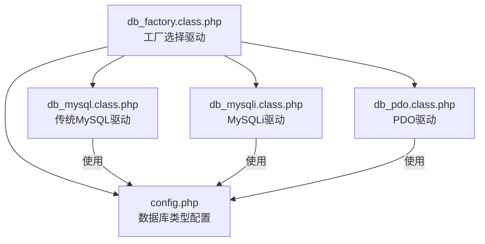
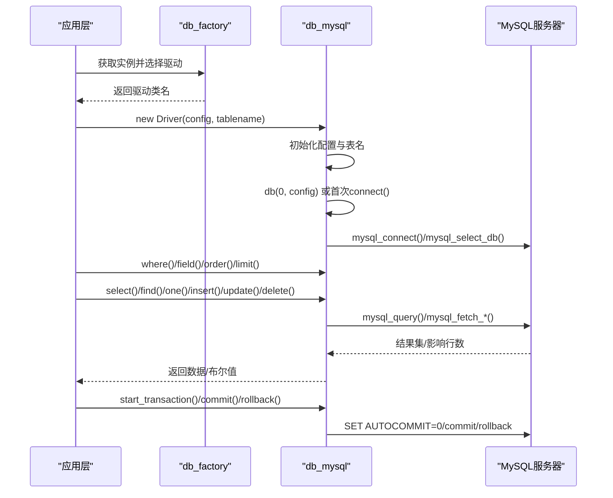
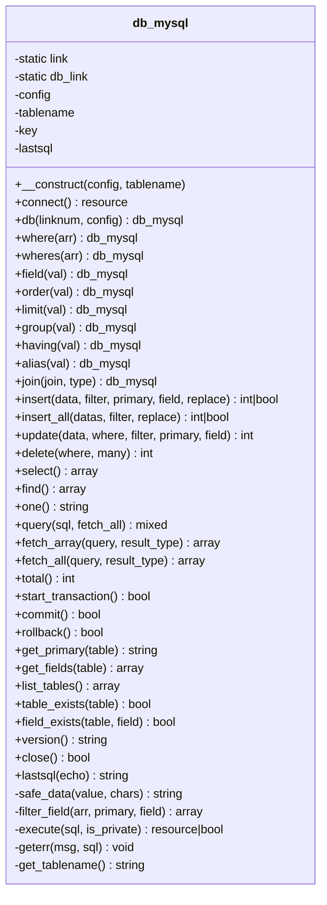
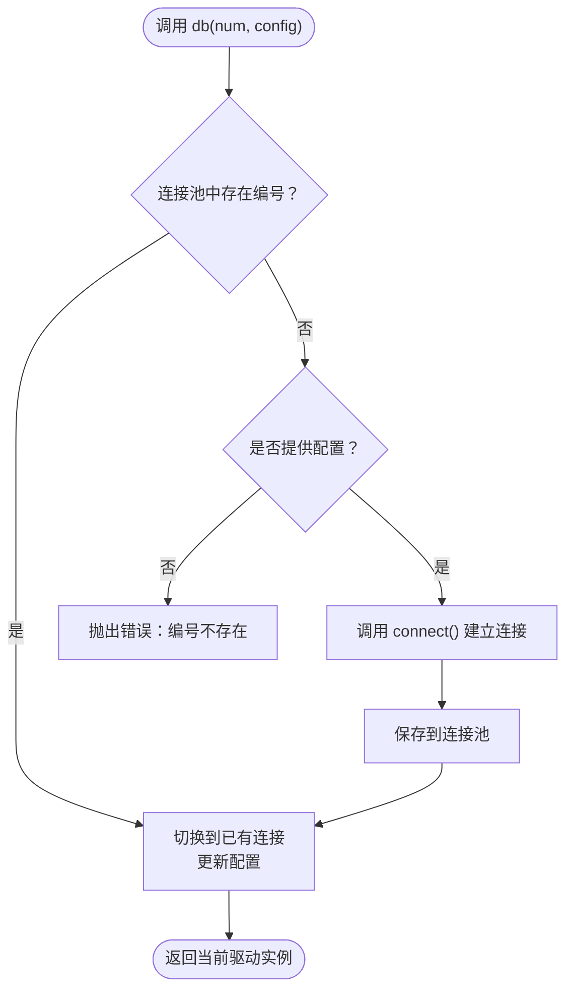
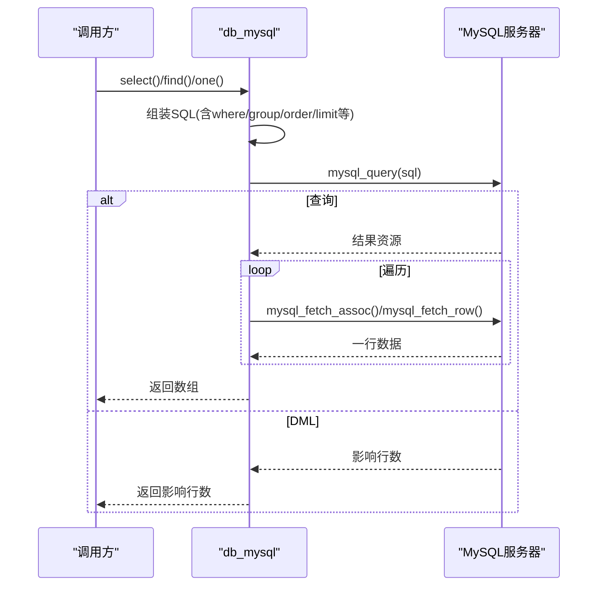
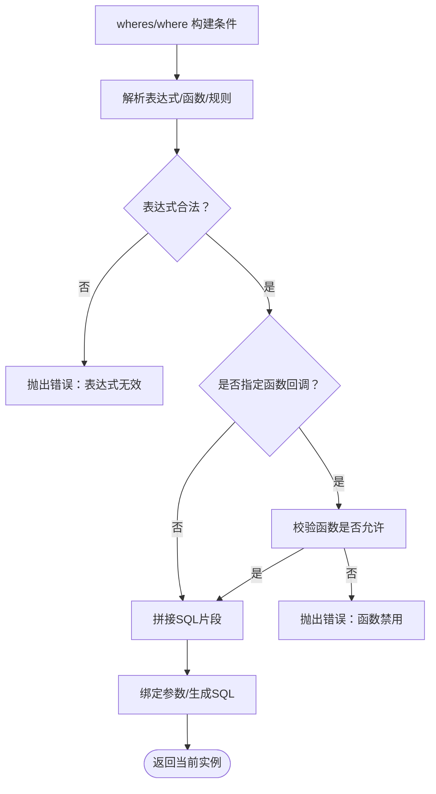
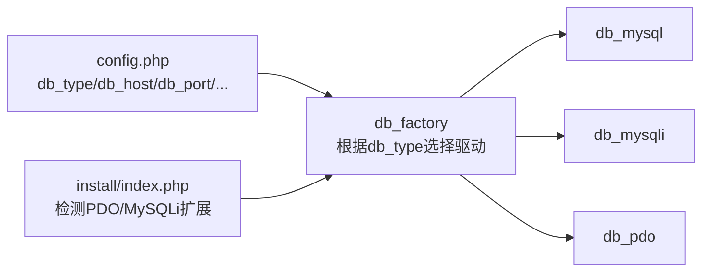

# MySQL传统驱动

<cite>
**本文引用的文件列表**
- [db_mysql.class.php](file://ryphp/core/class/db_mysql.class.php)
- [db_factory.class.php](file://ryphp/core/class/db_factory.class.php)
- [config.php](file://common/config/config.php)
- [db_pdo.class.php](file://ryphp/core/class/db_pdo.class.php)
- [db_mysqli.class.php](file://ryphp/core/class/db_mysqli.class.php)
- [DbException.class.php](file://ryphp/core/class/DbException.class.php)
- [admin_manage.class.php](file://application/lry_admin_center/controller/admin_manage.class.php)
- [index.php](file://application/install/index.php)
</cite>

## 目录
1. [简介](#简介)
2. [项目结构](#项目结构)
3. [核心组件](#核心组件)
4. [架构总览](#架构总览)
5. [详细组件分析](#详细组件分析)
6. [依赖关系分析](#依赖关系分析)
7. [性能考量](#性能考量)
8. [故障排查指南](#故障排查指南)
9. [结论](#结论)
10. [附录](#附录)

## 简介
本文件面向希望深入理解并正确使用MySQL传统驱动的开发者，重点解析 `db_mysql.class.php` 中对传统MySQL扩展的封装与实现。该驱动以“简单直接、性能较好、功能相对有限”为特点，适合对跨数据库兼容性要求不高、追求轻量与易用性的场景。文档同时对比PDO与MySQLi等现代驱动，帮助读者在新项目中做出更合适的选择。

## 项目结构
围绕数据库驱动的相关文件组织如下：
- 驱动实现：`ryphp/core/class/db_mysql.class.php`
- 工厂与配置：`ryphp/core/class/db_factory.class.php`、`common/config/config.php`
- 对比驱动：`ryphp/core/class/db_pdo.class.php`、`ryphp/core/class/db_mysqli.class.php`
- 异常处理：`ryphp/core/class/DbException.class.php`
- 使用示例：`application/lry_admin_center/controller/admin_manage.class.php`
- 安装检测：`application/install/index.php`

图表来源
- [db_factory.class.php:14-31](file://ryphp/core/class/db_factory.class.php#L14-L31)
- [config.php:14](file://common/config/config.php#L14)

章节来源
- [db_factory.class.php:1-50](file://ryphp/core/class/db_factory.class.php#L1-50)
- [config.php:1-88](file://common/config/config.php#L1-L88)

## 核心组件
- 传统MySQL驱动类：封装了连接、查询、事务、元数据等能力，基于已废弃的 `mysql_*` 函数族实现。
- 工厂类：根据配置动态加载对应驱动类，支持 mysql、mysqli、pdo 三种类型。
- 配置文件：集中管理数据库类型、主机、端口、账号、字符集、表前缀等。
- 异常类：统一的数据库异常类型，便于捕获与定位问题。
- 使用示例：控制器中展示典型的增删改查流程。

章节来源
- [db_mysql.class.php:10-667](file://ryphp/core/class/db_mysql.class.php#L10-L667)
- [db_factory.class.php:11-49](file://ryphp/core/class/db_factory.class.php#L11-L49)
- [config.php:13-21](file://common/config/config.php#L13-L21)
- [DbException.class.php:10-73](file://ryphp/core/class/DbException.class.php#L10-L73)

## 架构总览
传统MySQL驱动采用单例连接与连接池思想，内部维护静态连接与配置映射，支持多连接切换。其核心流程包括：初始化配置与表名、建立连接、拼装SQL、执行查询、结果收集、错误处理与事务控制。

图表来源
- [db_mysql.class.php:23-49](file://ryphp/core/class/db_mysql.class.php#L23-L49)
- [db_mysql.class.php:67-78](file://ryphp/core/class/db_mysql.class.php#L67-L78)
- [db_mysql.class.php:136-153](file://ryphp/core/class/db_mysql.class.php#L136-L153)
- [db_mysql.class.php:386-421](file://ryphp/core/class/db_mysql.class.php#L386-L421)
- [db_mysql.class.php:549-575](file://ryphp/core/class/db_mysql.class.php#L549-L575)

## 详细组件分析

### 类结构与职责
- 连接管理：静态连接与连接池、连接切换、字符集设置、断线重连。
- 查询构建：where/wheres、field、order、limit、group、having、join、alias 等链式方法。
- CRUD操作：insert、insert_all、update、delete、select、find、one、query。
- 结果处理：fetch_array/fetch_all、总数统计、主键与字段发现、表存在性检查。
- 事务控制：start_transaction、commit、rollback。
- 元数据：version、list_tables、get_fields、table_exists、field_exists。
- 错误处理：geterr、geterr抛出异常、CLI/Ajax/普通模式差异化处理。

图表来源
- [db_mysql.class.php:10-667](file://ryphp/core/class/db_mysql.class.php#L10-L667)

章节来源
- [db_mysql.class.php:10-667](file://ryphp/core/class/db_mysql.class.php#L10-L667)

### 连接管理与多连接切换
- 静态连接池：通过 `$db_link` 存储不同编号的连接与配置，避免重复连接。
- 连接切换：`db()` 方法按编号切换当前连接；若未配置则报错。
- 断线重连：执行阶段捕获“server has gone away”，自动重建连接并重试。
- 字符集设置：连接成功后设置 `names charset, sql_mode=''`。

图表来源
- [db_mysql.class.php:67-78](file://ryphp/core/class/db_mysql.class.php#L67-L78)
- [db_mysql.class.php:36-49](file://ryphp/core/class/db_mysql.class.php#L36-L49)
- [db_mysql.class.php:146-152](file://ryphp/core/class/db_mysql.class.php#L146-L152)

章节来源
- [db_mysql.class.php:36-49](file://ryphp/core/class/db_mysql.class.php#L36-L49)
- [db_mysql.class.php:67-78](file://ryphp/core/class/db_mysql.class.php#L67-L78)
- [db_mysql.class.php:146-152](file://ryphp/core/class/db_mysql.class.php#L146-L152)

### 查询执行与结果处理
- 执行器：`execute()` 统一封装查询执行，记录SQL与耗时，捕获异常并尝试断线重连。
- 结果集：`select()` 使用 `mysql_fetch_assoc()` 循环收集二维数组；`find()` 获取单行；`one()` 获取首行首列。
- 自定义查询：`query()` 支持执行DDL/DML与查询，配合 `fetch_array/fetch_all` 获取结果。
- 影响行数：`insert()` 返回自增ID；`update()`/`delete()` 返回受影响行数。

图表来源
- [db_mysql.class.php:386-421](file://ryphp/core/class/db_mysql.class.php#L386-L421)
- [db_mysql.class.php:477-509](file://ryphp/core/class/db_mysql.class.php#L477-L509)
- [db_mysql.class.php:272-288](file://ryphp/core/class/db_mysql.class.php#L272-L288)
- [db_mysql.class.php:362-379](file://ryphp/core/class/db_mysql.class.php#L362-L379)
- [db_mysql.class.php:328-347](file://ryphp/core/class/db_mysql.class.php#L328-L347)

章节来源
- [db_mysql.class.php:136-153](file://ryphp/core/class/db_mysql.class.php#L136-L153)
- [db_mysql.class.php:386-421](file://ryphp/core/class/db_mysql.class.php#L386-L421)
- [db_mysql.class.php:477-509](file://ryphp/core/class/db_mysql.class.php#L477-L509)

### 条件构造与安全过滤
- where/wheres：支持数组与字符串两种形式，wheres提供表达式、函数回调、IN/BETWEEN等高级语法。
- 安全过滤：`safe_data()` 在GPC关闭时进行转义，必要时进行HTML实体转义。
- 字段过滤：`filter_field()` 自动剔除非表字段与主键，避免误更新。

图表来源
- [db_mysql.class.php:198-244](file://ryphp/core/class/db_mysql.class.php#L198-L244)
- [db_mysql.class.php:98-105](file://ryphp/core/class/db_mysql.class.php#L98-L105)
- [db_mysql.class.php:115-127](file://ryphp/core/class/db_mysql.class.php#L115-L127)

章节来源
- [db_mysql.class.php:198-244](file://ryphp/core/class/db_mysql.class.php#L198-L244)
- [db_mysql.class.php:98-105](file://ryphp/core/class/db_mysql.class.php#L98-L105)
- [db_mysql.class.php:115-127](file://ryphp/core/class/db_mysql.class.php#L115-L127)

### 事务与元数据
- 事务：通过 `start_transaction()` 设置手动提交，`commit()`/`rollback()` 控制事务。
- 元数据：支持获取主键、字段列表、表清单、版本信息、存在性检查等。

章节来源
- [db_mysql.class.php:549-575](file://ryphp/core/class/db_mysql.class.php#L549-L575)
- [db_mysql.class.php:584-623](file://ryphp/core/class/db_mysql.class.php#L584-L623)
- [db_mysql.class.php:654-656](file://ryphp/core/class/db_mysql.class.php#L654-L656)

### 错误处理与调试
- geterr：根据运行环境输出不同格式的错误信息，支持CLI/Ajax/普通模式。
- 异常类型：DbException 提供类型与SQL上下文，便于定位问题。
- 调试：lastsql 输出上一次执行的SQL，便于开发调试。

章节来源
- [db_mysql.class.php:515-528](file://ryphp/core/class/db_mysql.class.php#L515-L528)
- [DbException.class.php:10-73](file://ryphp/core/class/DbException.class.php#L10-L73)
- [db_mysql.class.php:463-468](file://ryphp/core/class/db_mysql.class.php#L463-L468)

### 使用示例与最佳实践
- 示例控制器：展示了 where + order + limit + select 的典型组合，以及 update/find 的使用。
- 建议：优先使用 wheres 提供的安全表达式；对用户输入启用过滤；批量插入使用 insert_all；事务包裹复杂写操作。

章节来源
- [admin_manage.class.php:37-41](file://application/lry_admin_center/controller/admin_manage.class.php#L37-L41)
- [admin_manage.class.php:49-64](file://application/lry_admin_center/controller/admin_manage.class.php#L49-L64)
- [admin_manage.class.php:74-99](file://application/lry_admin_center/controller/admin_manage.class.php#L74-L99)

## 依赖关系分析
- 工厂选择：db_factory 根据配置选择具体驱动类，支持 mysql/mysqli/pdo。
- 配置依赖：所有驱动共享配置数组，包含主机、端口、账号、密码、字符集、表前缀等。
- 安装检测：安装脚本检测PDO或MySQLi扩展是否存在，作为可用驱动的前置条件。

图表来源
- [db_factory.class.php:14-31](file://ryphp/core/class/db_factory.class.php#L14-L31)
- [config.php:14](file://common/config/config.php#L14)
- [index.php:76-86](file://application/install/index.php#L76-L86)

章节来源
- [db_factory.class.php:14-31](file://ryphp/core/class/db_factory.class.php#L14-L31)
- [config.php:14](file://common/config/config.php#L14)
- [index.php:76-86](file://application/install/index.php#L76-L86)

## 性能考量
- 优点：接口简洁、调用链短、无预处理开销，适合轻量级业务与历史遗留系统。
- 局限：未使用预处理语句，存在注入风险；已废弃的扩展在较新PHP版本中不可用；缺少跨数据库抽象。
- 建议：对高并发、安全性要求高的场景优先考虑PDO或MySQLi；对仅运行于旧PHP环境且无需跨数据库的系统，可权衡使用。

## 故障排查指南
- 连接失败：检查主机、端口、账号、密码与字符集配置；确认服务器可达。
- 断线重连：驱动内置“server has gone away”重连逻辑，若仍失败，检查服务器超时设置。
- SQL错误：使用 lastsql 输出查看最终SQL；结合 geterr 的详细信息定位问题。
- 安装检测：若安装时报未安装PDO/MySQLi，需先安装对应扩展。

章节来源
- [db_mysql.class.php:38-46](file://ryphp/core/class/db_mysql.class.php#L38-L46)
- [db_mysql.class.php:146-152](file://ryphp/core/class/db_mysql.class.php#L146-L152)
- [db_mysql.class.php:463-468](file://ryphp/core/class/db_mysql.class.php#L463-L468)
- [index.php:76-86](file://application/install/index.php#L76-L86)

## 结论
MySQL传统驱动以“简单直接、性能较好、功能相对有限”为核心特征，适合对跨数据库兼容性无需求、追求轻量与易用的历史系统。然而，由于其基于已废弃的扩展与未使用预处理语句，存在安全与可移植性风险。对于新项目，建议优先选用PDO或MySQLi，以获得更好的安全性、可维护性与生态支持。

## 附录

### 与PDO驱动的对比要点
- 预处理语句：PDO支持真正的预处理与绑定，MySQL传统驱动不支持。
- 跨数据库兼容：PDO提供统一接口，MySQL传统驱动仅限MySQL。
- 安全性：PDO默认禁用模拟预处理，减少注入风险；传统驱动依赖手工转义。
- 现代性：PDO/MySQLi在新版本PHP中持续维护，传统驱动已废弃。

章节来源
- [db_pdo.class.php:18-24](file://ryphp/core/class/db_pdo.class.php#L18-L24)
- [db_pdo.class.php:100-124](file://ryphp/core/class/db_pdo.class.php#L100-L124)
- [db_mysql.class.php:146-152](file://ryphp/core/class/db_mysql.class.php#L146-L152)

### 与MySQLi驱动的对比要点
- 接口风格：MySQLi支持面向对象与过程式两种风格；传统驱动为过程式。
- 性能：两者均优于传统驱动的“简单直接”风格，但MySQLi在连接选项与字符集设置上更灵活。
- 兼容性：传统驱动已废弃，MySQLi在新环境中更受支持。

章节来源
- [db_mysqli.class.php:36-46](file://ryphp/core/class/db_mysqli.class.php#L36-L46)

### 使用示例路径参考
- 列表查询与分页：[admin_manage.class.php:37-41](file://application/lry_admin_center/controller/admin_manage.class.php#L37-L41)
- 更新与查找：[admin_manage.class.php:49-64](file://application/lry_admin_center/controller/admin_manage.class.php#L49-L64)
- 修改密码与日志记录：[admin_manage.class.php:74-99](file://application/lry_admin_center/controller/admin_manage.class.php#L74-L99)