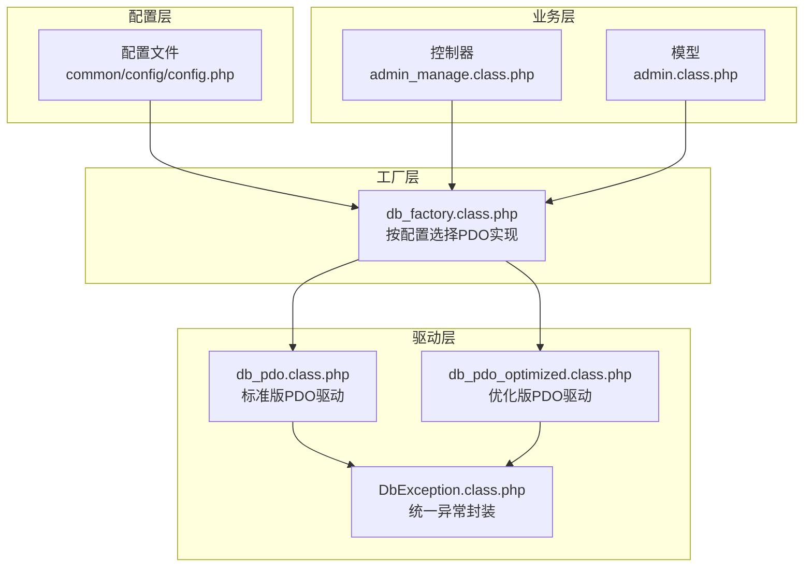
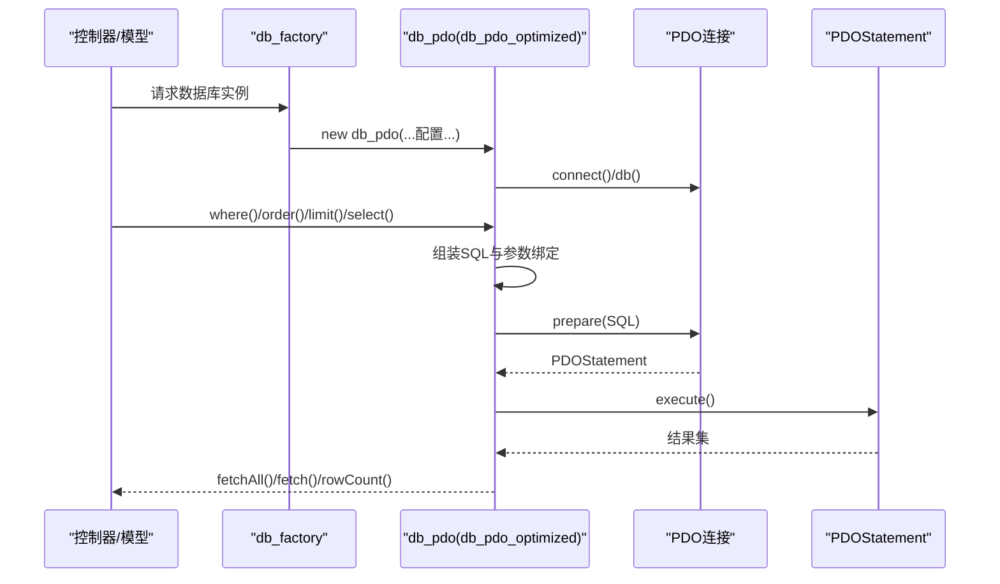
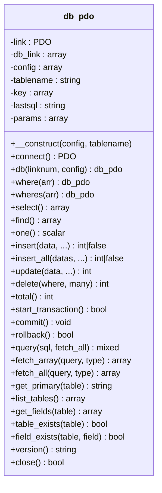
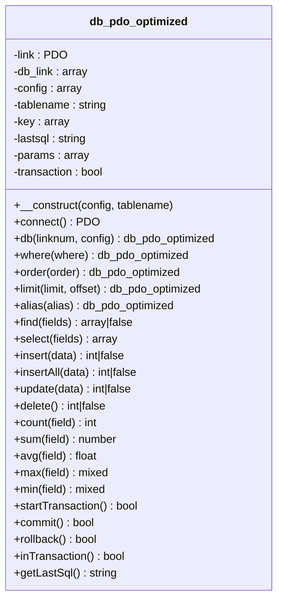
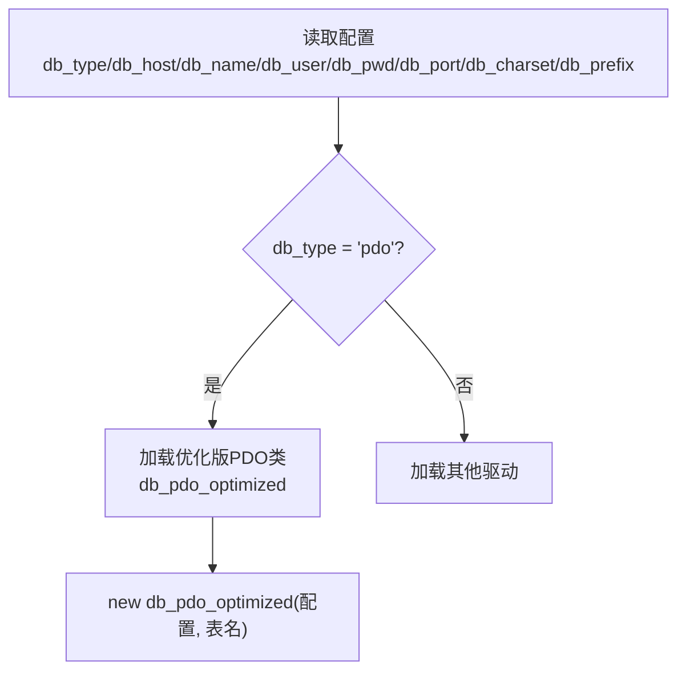
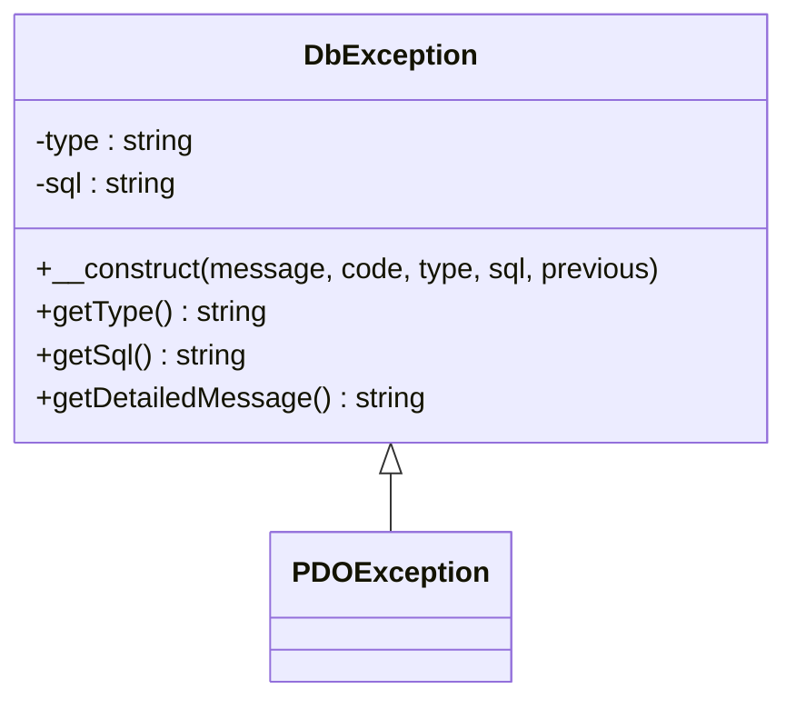
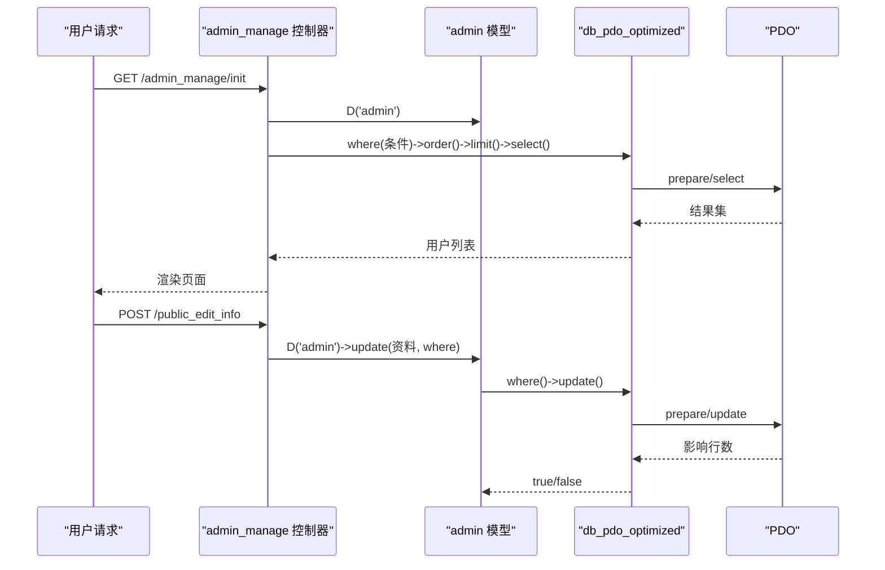
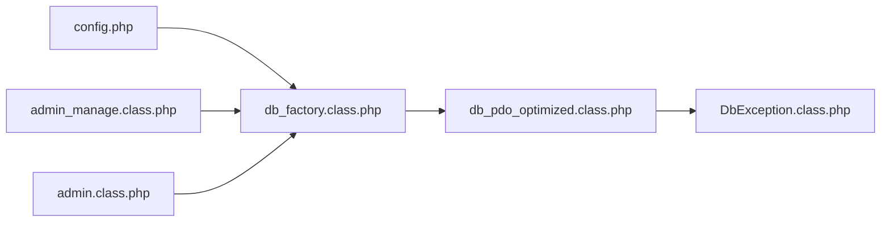

# PDO数据库驱动

<cite>
**本文档引用的文件**
- [db_pdo.class.php](file://ryphp/core/class/db_pdo.class.php)
- [db_pdo_optimized.class.php](file://ryphp/core/class/db_pdo_optimized.class.php)
- [db_factory.class.php](file://ryphp/core/class/db_factory.class.php)
- [DbException.class.php](file://ryphp/core/class/DbException.class.php)
- [config.php](file://common/config/config.php)
- [admin_manage.class.php](file://application/lry_admin_center/controller/admin_manage.class.php)
- [admin.class.php](file://application/lry_admin_center/model/admin.class.php)
</cite>

## 目录
1. [简介](#简介)
2. [项目结构](#项目结构)
3. [核心组件](#核心组件)
4. [架构总览](#架构总览)
5. [详细组件分析](#详细组件分析)
6. [依赖关系分析](#依赖关系分析)
7. [性能考量](#性能考量)
8. [故障排查指南](#故障排查指南)
9. [结论](#结论)
10. [附录](#附录)

## 简介
本文件面向使用 RYCMS 框架的开发者，系统化梳理并解析 PDO 数据库驱动的实现与最佳实践。重点覆盖：
- 标准版与优化版 PDO 驱动的差异与性能提升
- PDO 连接建立、预处理语句执行与结果集处理机制
- 跨数据库兼容性、预处理语句防注入、事务支持与错误处理
- 配置选项、连接参数与字符集处理
- 完整 CRUD 示例与批量操作、异常处理最佳实践

## 项目结构
PDO 驱动位于框架核心层，通过工厂类按配置动态加载，并在控制器与模型中被广泛使用。

**图表来源**
- [config.php](file://common/config/config.php#L13-L21)
- [db_factory.class.php](file://ryphp/core/class/db_factory.class.php#L14-L27)
- [db_pdo.class.php](file://ryphp/core/class/db_pdo.class.php#L1-L42)
- [db_pdo_optimized.class.php](file://ryphp/core/class/db_pdo_optimized.class.php#L1-L77)
- [DbException.class.php](file://ryphp/core/class/DbException.class.php#L10-L36)
- [admin_manage.class.php](file://application/lry_admin_center/controller/admin_manage.class.php#L37-L41)
- [admin.class.php](file://application/lry_admin_center/model/admin.class.php#L4-L27)

**章节来源**
- [config.php](file://common/config/config.php#L13-L21)
- [db_factory.class.php](file://ryphp/core/class/db_factory.class.php#L14-L27)

## 核心组件
- 工厂类负责根据配置选择 PDO 实现，并注入数据库连接参数。
- 标准版与优化版 PDO 驱动均继承统一的接口能力，但异常处理与事务状态管理存在差异。
- 统一异常类提供类型化错误信息与 SQL 上下文，便于定位问题。

**章节来源**
- [db_factory.class.php](file://ryphp/core/class/db_factory.class.php#L38-L49)
- [db_pdo.class.php](file://ryphp/core/class/db_pdo.class.php#L18-L24)
- [db_pdo_optimized.class.php](file://ryphp/core/class/db_pdo_optimized.class.php#L55-L61)
- [DbException.class.php](file://ryphp/core/class/DbException.class.php#L10-L36)

## 架构总览
PDO 驱动采用“连接池 + 预处理 + 统一异常”的设计，支持链式构建 SQL 并通过 PDOStatement 执行，最终以关联数组形式返回结果集。

**图表来源**
- [db_factory.class.php](file://ryphp/core/class/db_factory.class.php#L38-L49)
- [db_pdo_optimized.class.php](file://ryphp/core/class/db_pdo_optimized.class.php#L180-L208)
- [db_pdo_optimized.class.php](file://ryphp/core/class/db_pdo_optimized.class.php#L406-L435)

## 详细组件分析

### 标准版 PDO 驱动（db_pdo.class.php）
- 连接建立：构造函数初始化配置并延迟连接；connect() 使用 PDO 构造函数建立连接，设置错误模式与属性。
- 预处理执行：execute() 将 where 绑定参数通过 bindValue 绑定到占位符；支持“server has gone away”自动重连。
- 结果集处理：select()/find()/one() 分别返回二维数组、一维数组与标量值；query() 支持自定义 SQL 与 fetch_all/fetch_array。
- CRUD 能力：insert()/insert_all()/update()/delete()/total() 等。
- 事务支持：start_transaction()/commit()/rollback()。
- 元数据：get_primary()/list_tables()/get_fields()/table_exists()/field_exists()/version()/close()。

**图表来源**
- [db_pdo.class.php](file://ryphp/core/class/db_pdo.class.php#L10-L646)

**章节来源**
- [db_pdo.class.php](file://ryphp/core/class/db_pdo.class.php#L26-L42)
- [db_pdo.class.php](file://ryphp/core/class/db_pdo.class.php#L100-L124)
- [db_pdo.class.php](file://ryphp/core/class/db_pdo.class.php#L365-L396)
- [db_pdo.class.php](file://ryphp/core/class/db_pdo.class.php#L249-L296)
- [db_pdo.class.php](file://ryphp/core/class/db_pdo.class.php#L307-L326)
- [db_pdo.class.php](file://ryphp/core/class/db_pdo.class.php#L527-L547)

### 优化版 PDO 驱动（db_pdo_optimized.class.php）
- 统一异常：connect()/db()/execute()/各操作方法均抛出 DbException，便于集中处理。
- 事务状态：新增 transaction 属性与 inTransaction()，startTransaction()/commit()/rollback() 明确事务生命周期。
- 条件构建：where() 支持数组键值对与范围查询；select()/update()/delete() 自动拼接 WHERE、ORDER、LIMIT。
- 新增聚合方法：count()/sum()/avg()/max()/min()。
- 最后 SQL：getLastSql() 返回最近一次执行的 SQL，便于调试。

**图表来源**
- [db_pdo_optimized.class.php](file://ryphp/core/class/db_pdo_optimized.class.php#L13-L767)

**章节来源**
- [db_pdo_optimized.class.php](file://ryphp/core/class/db_pdo_optimized.class.php#L87-L97)
- [db_pdo_optimized.class.php](file://ryphp/core/class/db_pdo_optimized.class.php#L180-L208)
- [db_pdo_optimized.class.php](file://ryphp/core/class/db_pdo_optimized.class.php#L328-L357)
- [db_pdo_optimized.class.php](file://ryphp/core/class/db_pdo_optimized.class.php#L406-L435)
- [db_pdo_optimized.class.php](file://ryphp/core/class/db_pdo_optimized.class.php#L442-L497)
- [db_pdo_optimized.class.php](file://ryphp/core/class/db_pdo_optimized.class.php#L504-L538)
- [db_pdo_optimized.class.php](file://ryphp/core/class/db_pdo_optimized.class.php#L544-L567)
- [db_pdo_optimized.class.php](file://ryphp/core/class/db_pdo_optimized.class.php#L708-L750)

### 工厂类与配置
- 工厂类根据配置项 db_type 选择 PDO 实现（此处加载优化版）。
- 连接参数从配置读取：db_host、db_user、db_pwd、db_name、db_port、db_charset、db_prefix。

**图表来源**
- [db_factory.class.php](file://ryphp/core/class/db_factory.class.php#L14-L27)
- [db_factory.class.php](file://ryphp/core/class/db_factory.class.php#L38-L49)
- [config.php](file://common/config/config.php#L13-L21)

**章节来源**
- [db_factory.class.php](file://ryphp/core/class/db_factory.class.php#L14-L27)
- [db_factory.class.php](file://ryphp/core/class/db_factory.class.php#L38-L49)
- [config.php](file://common/config/config.php#L13-L21)

### 统一异常类（DbException）
- 提供类型化错误与 SQL 上下文，支持 CLI/HTTP 不同环境下的差异化处理。
- 在优化版驱动中广泛用于连接、执行、事务等关键流程。

**图表来源**
- [DbException.class.php](file://ryphp/core/class/DbException.class.php#L10-L73)

**章节来源**
- [DbException.class.php](file://ryphp/core/class/DbException.class.php#L10-L73)
- [db_pdo_optimized.class.php](file://ryphp/core/class/db_pdo_optimized.class.php#L92-L96)
- [db_pdo_optimized.class.php](file://ryphp/core/class/db_pdo_optimized.class.php#L216-L233)
- [db_pdo_optimized.class.php](file://ryphp/core/class/db_pdo_optimized.class.php#L715-L717)

### 实际使用示例（登录与分页）
- 控制器通过 D('admin') 获取模型实例，调用 where()/order()/limit()/select() 实现分页查询。
- 模型中使用 where()/find()/update() 完成登录校验与状态更新。

**图表来源**
- [admin_manage.class.php](file://application/lry_admin_center/controller/admin_manage.class.php#L11-L44)
- [admin_manage.class.php](file://application/lry_admin_center/controller/admin_manage.class.php#L49-L64)
- [admin.class.php](file://application/lry_admin_center/model/admin.class.php#L4-L27)
- [admin.class.php](file://application/lry_admin_center/model/admin.class.php#L67-L95)

**章节来源**
- [admin_manage.class.php](file://application/lry_admin_center/controller/admin_manage.class.php#L11-L44)
- [admin_manage.class.php](file://application/lry_admin_center/controller/admin_manage.class.php#L49-L64)
- [admin.class.php](file://application/lry_admin_center/model/admin.class.php#L4-L27)
- [admin.class.php](file://application/lry_admin_center/model/admin.class.php#L67-L95)

## 依赖关系分析
- 工厂类依赖配置项决定加载哪个 PDO 实现。
- 优化版驱动引入统一异常类，增强错误处理一致性。
- 业务层通过 D() 获取模型实例，间接依赖工厂类与 PDO 驱动。

**图表来源**
- [config.php](file://common/config/config.php#L13-L21)
- [db_factory.class.php](file://ryphp/core/class/db_factory.class.php#L14-L27)
- [db_pdo_optimized.class.php](file://ryphp/core/class/db_pdo_optimized.class.php#L10-L11)
- [DbException.class.php](file://ryphp/core/class/DbException.class.php#L10-L36)
- [admin_manage.class.php](file://application/lry_admin_center/controller/admin_manage.class.php#L37-L41)
- [admin.class.php](file://application/lry_admin_center/model/admin.class.php#L4-L27)

**章节来源**
- [db_factory.class.php](file://ryphp/core/class/db_factory.class.php#L14-L27)
- [db_pdo_optimized.class.php](file://ryphp/core/class/db_pdo_optimized.class.php#L10-L11)

## 性能考量
- 预处理语句：两条驱动均使用 prepare()/execute() 与 bindValue，避免重复编译与注入风险，显著提升安全性与性能。
- 连接池：通过静态连接与连接池数组复用连接，减少握手开销。
- 事务批处理：优化版驱动提供明确事务状态与聚合方法，适合批量写入场景。
- 调试辅助：标准版通过“组装预处理SQL”便于调试；优化版提供 getLastSql() 输出最近 SQL。
- 注意事项：避免在循环中频繁创建新实例；合理使用 limit 与索引；批量插入优先使用 insertAll。

[本节为通用性能指导，无需特定文件引用]

## 故障排查指南
- 连接失败：检查配置项 db_host/db_port/db_name/db_user/db_pwd/db_charset；确认服务可达与字符集一致。
- 执行异常：捕获 DbException 或标准版中的 geterr，查看详细错误与 SQL 上下文。
- 事务问题：确认 startTransaction()/commit()/rollback() 成对调用；使用 inTransaction() 检查状态。
- 自动重连：标准版对“server has gone away”进行重连，优化版建议上层捕获异常并重试。
- 调试输出：使用 getLastSql()/lastsql() 查看最终 SQL；结合 RYPHP_DEBUG 观察执行耗时。

**章节来源**
- [db_pdo_optimized.class.php](file://ryphp/core/class/db_pdo_optimized.class.php#L201-L208)
- [db_pdo_optimized.class.php](file://ryphp/core/class/db_pdo_optimized.class.php#L708-L750)
- [db_pdo_optimized.class.php](file://ryphp/core/class/db_pdo_optimized.class.php#L764-L766)
- [db_pdo.class.php](file://ryphp/core/class/db_pdo.class.php#L118-L123)
- [db_pdo.class.php](file://ryphp/core/class/db_pdo.class.php#L439-L444)

## 结论
- 优化版 PDO 驱动在标准版基础上增强了异常处理、事务状态管理与 API 完整性，更适合生产环境。
- 两条驱动均基于 PDO 预处理语句，具备跨数据库兼容性与强防注入能力。
- 建议在生产中使用优化版，并配合统一异常处理、事务控制与合理的批量操作策略。

[本节为总结性内容，无需特定文件引用]

## 附录

### 配置选项与连接参数
- db_type：选择数据库驱动类型（pdo/...）
- db_host/db_port/db_name/db_user/db_pwd/db_charset/db_prefix：连接与字符集参数

**章节来源**
- [config.php](file://common/config/config.php#L13-L21)
- [db_factory.class.php](file://ryphp/core/class/db_factory.class.php#L38-L49)

### CRUD 与批量操作最佳实践
- 参数绑定：优先使用 where()/wheres() 的数组参数，避免字符串拼接。
- 批量插入：使用 insertAll() 一次性提交多条记录。
- 条件构建：wheres() 支持表达式与回调函数，灵活处理复杂条件。
- 事务：对多步写入使用 startTransaction()/commit()/rollback() 包裹。
- 异常处理：捕获 DbException，区分类型与 SQL，记录日志并反馈用户。

**章节来源**
- [db_pdo_optimized.class.php](file://ryphp/core/class/db_pdo_optimized.class.php#L328-L357)
- [db_pdo_optimized.class.php](file://ryphp/core/class/db_pdo_optimized.class.php#L470-L497)
- [db_pdo_optimized.class.php](file://ryphp/core/class/db_pdo_optimized.class.php#L504-L538)
- [db_pdo_optimized.class.php](file://ryphp/core/class/db_pdo_optimized.class.php#L708-L750)
- [DbException.class.php](file://ryphp/core/class/DbException.class.php#L58-L64)