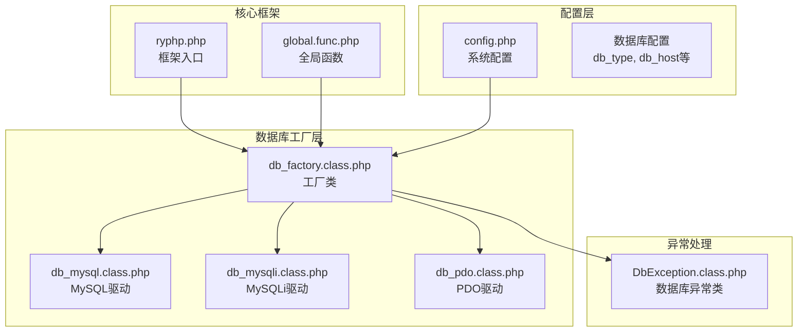
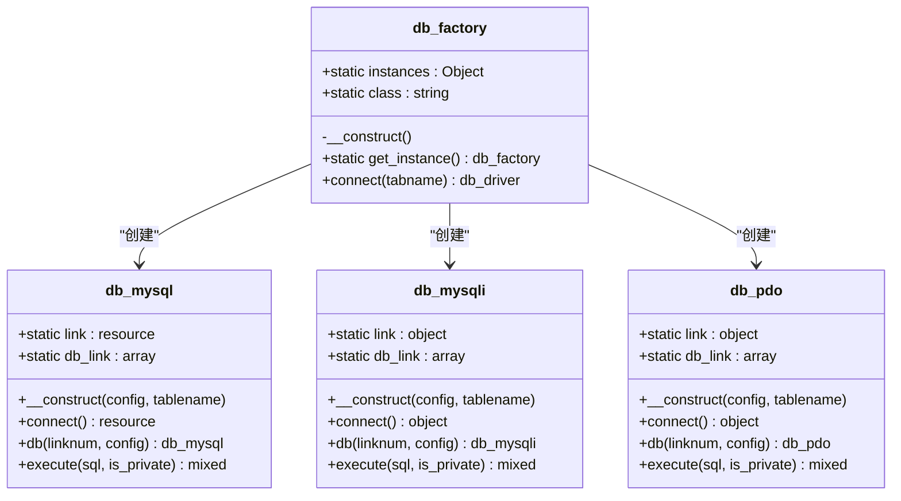
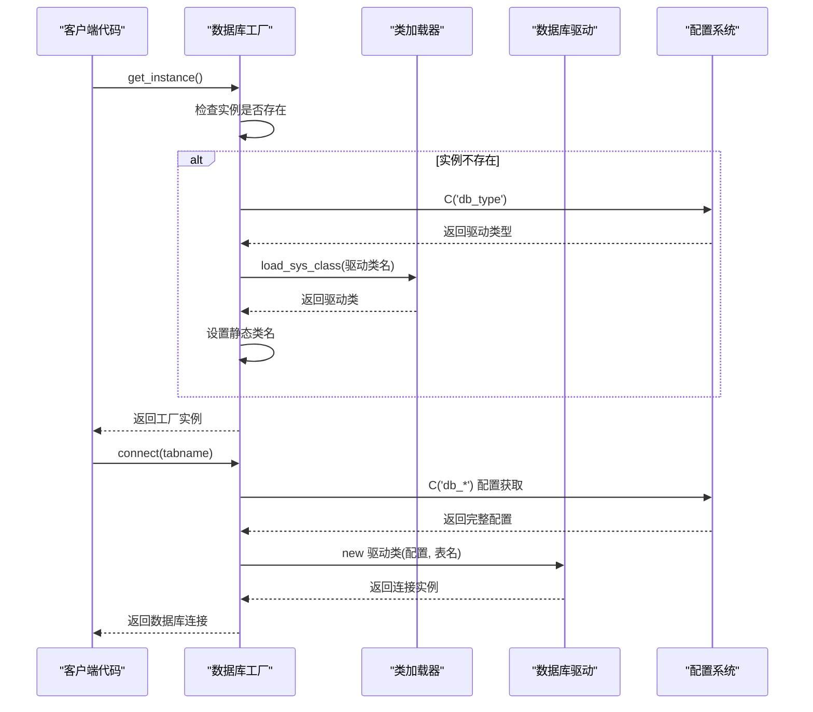
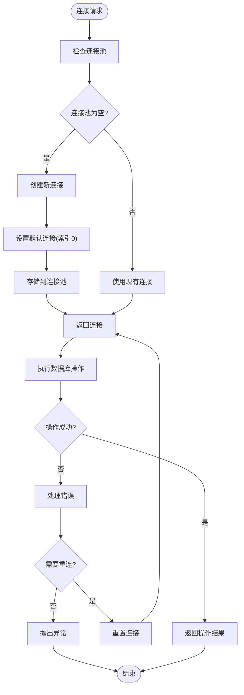
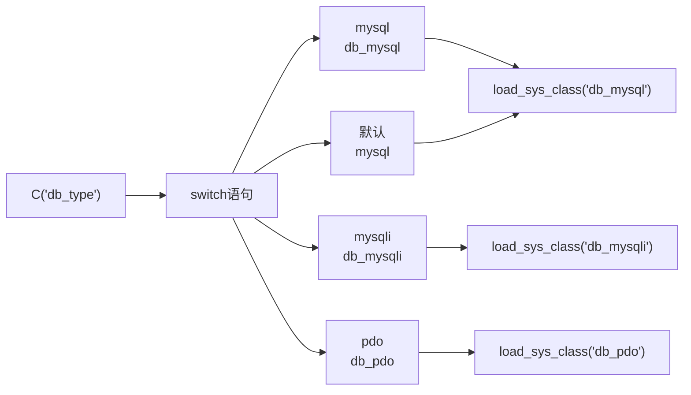
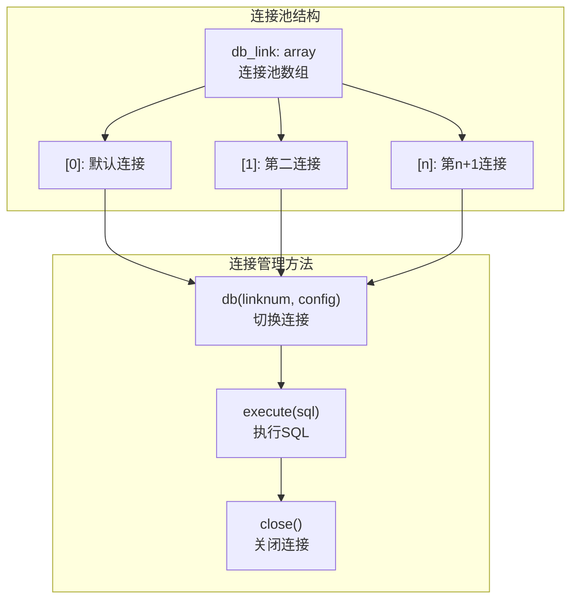
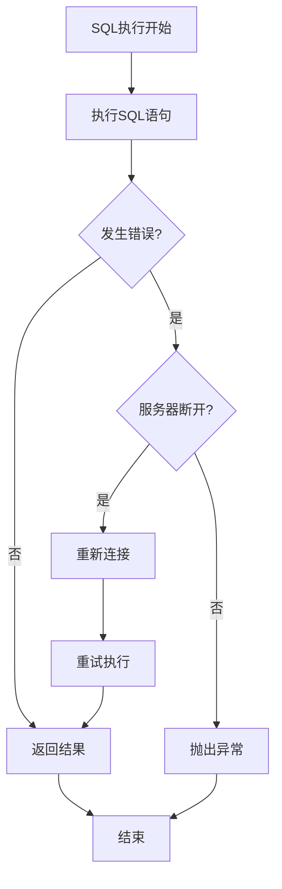
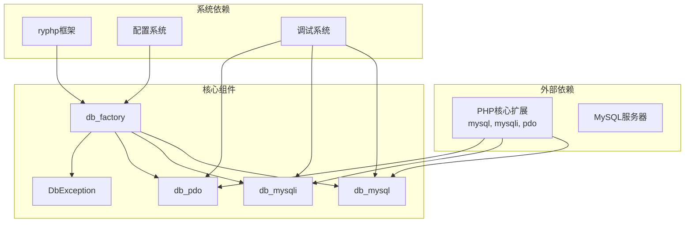

# 数据库工厂类

<cite>
**本文档引用的文件**
- [db_factory.class.php](file://ryphp/core/class/db_factory.class.php)
- [db_mysql.class.php](file://ryphp/core/class/db_mysql.class.php)
- [db_mysqli.class.php](file://ryphp/core/class/db_mysqli.class.php)
- [db_pdo.class.php](file://ryphp/core/class/db_pdo.class.php)
- [config.php](file://common/config/config.php)
- [DbException.class.php](file://ryphp/core/class/DbException.class.php)
- [ryphp.php](file://ryphp/ryphp.php)
- [global.func.php](file://ryphp/core/function/global.func.php)
</cite>

## 目录
1. [简介](#简介)
2. [项目结构](#项目结构)
3. [核心组件](#核心组件)
4. [架构概览](#架构概览)
5. [详细组件分析](#详细组件分析)
6. [依赖关系分析](#依赖关系分析)
7. [性能考虑](#性能考虑)
8. [故障排除指南](#故障排除指南)
9. [结论](#结论)

## 简介

数据库工厂类是本系统的核心组件之一，采用单例工厂模式设计，负责统一管理不同类型的数据库连接。该工厂类支持三种数据库驱动类型：mysql、mysqli和PDO，能够根据配置自动选择合适的驱动类型，并提供连接池管理功能。

工厂类的设计遵循单一职责原则，通过集中化的配置管理和驱动选择机制，简化了数据库连接的使用复杂度，提高了系统的可维护性和扩展性。

## 项目结构

系统采用分层架构设计，数据库相关组件位于以下目录结构：



**图表来源**
- [db_factory.class.php](file://ryphp/core/class/db_factory.class.php#L1-L50)
- [config.php](file://common/config/config.php#L13-L22)

**章节来源**
- [db_factory.class.php](file://ryphp/core/class/db_factory.class.php#L1-L50)
- [config.php](file://common/config/config.php#L1-L88)

## 核心组件

### 工厂类设计模式

工厂类采用单例模式实现，确保在整个应用生命周期内只有一个工厂实例存在。这种设计避免了重复创建数据库连接的开销，同时保证了连接管理的一致性。



**图表来源**
- [db_factory.class.php](file://ryphp/core/class/db_factory.class.php#L2-L49)
- [db_mysql.class.php](file://ryphp/core/class/db_mysql.class.php#L10-L31)
- [db_mysqli.class.php](file://ryphp/core/class/db_mysqli.class.php#L10-L31)
- [db_pdo.class.php](file://ryphp/core/class/db_pdo.class.php#L10-L31)

### 配置管理机制

系统通过集中化的配置管理实现数据库驱动的动态选择。配置文件中定义了`db_type`参数，工厂类根据此参数决定使用哪种数据库驱动。

**章节来源**
- [db_factory.class.php](file://ryphp/core/class/db_factory.class.php#L11-L34)
- [config.php](file://common/config/config.php#L14-L14)

## 架构概览

### 整体架构流程



**图表来源**
- [db_factory.class.php](file://ryphp/core/class/db_factory.class.php#L11-L49)
- [ryphp.php](file://ryphp/ryphp.php#L108-L140)

### 连接池管理架构



**图表来源**
- [db_mysql.class.php](file://ryphp/core/class/db_mysql.class.php#L67-L77)
- [db_mysqli.class.php](file://ryphp/core/class/db_mysqli.class.php#L64-L75)
- [db_pdo.class.php](file://ryphp/core/class/db_pdo.class.php#L45-L56)

**章节来源**
- [db_factory.class.php](file://ryphp/core/class/db_factory.class.php#L38-L49)

## 详细组件分析

### 工厂类实现详解

#### 单例模式实现

工厂类通过静态属性实现单例模式，确保在整个应用生命周期内只有一个工厂实例：

```mermaid
classDiagram
class db_factory {
<<singleton>>
-static instances : db_factory
-static class : string
-__construct()
+static get_instance() db_factory
+static connect(tabname) db_driver
}
note for db_factory : "静态属性保持实例状态\n构造函数私有化防止外部实例化"
```

**图表来源**
- [db_factory.class.php](file://ryphp/core/class/db_factory.class.php#L2-L11)

#### 驱动选择机制

工厂类根据配置自动选择合适的数据库驱动：



**图表来源**
- [db_factory.class.php](file://ryphp/core/class/db_factory.class.php#L14-L31)

**章节来源**
- [db_factory.class.php](file://ryphp/core/class/db_factory.class.php#L11-L34)

### 数据库驱动实现对比

#### MySQL驱动实现

MySQL驱动基于传统的mysql扩展实现，提供了完整的数据库操作功能：

| 功能特性 | 实现方式 | 性能特点 |
|---------|----------|----------|
| 连接管理 | 静态连接资源 | 简单直接，但不支持持久连接 |
| 连接池 | 数组存储多个连接 | 支持多连接管理 |
| 错误处理 | 自定义异常类 | 详细的错误信息和日志记录 |
| 安全性 | 字符串转义和过滤 | 基础的SQL注入防护 |

#### MySQLi驱动实现

MySQLi驱动基于改进的mysql扩展，提供了更好的面向对象接口：

| 功能特性 | 实现方式 | 性能特点 |
|---------|----------|----------|
| 连接管理 | 面向对象接口 | 更好的类型安全和性能 |
| 预处理语句 | 支持预处理和绑定 | 防止SQL注入攻击 |
| 错误处理 | 对象方法调用 | 更直观的错误处理机制 |
| 兼容性 | 支持多种数据类型 | 更好的数据类型处理 |

#### PDO驱动实现

PDO驱动提供了统一的数据库抽象层：

| 功能特性 | 实现方式 | 性能特点 |
|---------|----------|----------|
| 抽象层 | 统一接口 | 支持多种数据库后端 |
| 预处理语句 | 标准化预处理 | 最强的安全性保障 |
| 错误处理 | 异常机制 | 标准化的错误处理方式 |
| 配置选项 | 参数化配置 | 灵活的连接参数设置 |

**章节来源**
- [db_mysql.class.php](file://ryphp/core/class/db_mysql.class.php#L10-L666)
- [db_mysqli.class.php](file://ryphp/core/class/db_mysqli.class.php#L10-L659)
- [db_pdo.class.php](file://ryphp/core/class/db_pdo.class.php#L10-L645)

### 连接池管理策略

#### 多连接支持机制

每个数据库驱动都实现了连接池管理，支持同时管理多个数据库连接：



**图表来源**
- [db_mysql.class.php](file://ryphp/core/class/db_mysql.class.php#L12-L17)
- [db_mysql.class.php](file://ryphp/core/class/db_mysql.class.php#L67-L77)

#### 连接状态监控

驱动类实现了连接状态的自动检测和恢复机制：



**图表来源**
- [db_mysql.class.php](file://ryphp/core/class/db_mysql.class.php#L143-L152)
- [db_mysqli.class.php](file://ryphp/core/class/db_mysqli.class.php#L134-L150)
- [db_pdo.class.php](file://ryphp/core/class/db_pdo.class.php#L100-L124)

**章节来源**
- [db_mysql.class.php](file://ryphp/core/class/db_mysql.class.php#L134-L152)
- [db_mysqli.class.php](file://ryphp/core/class/db_mysqli.class.php#L134-L150)
- [db_pdo.class.php](file://ryphp/core/class/db_pdo.class.php#L100-L124)

## 依赖关系分析

### 组件间依赖关系



**图表来源**
- [db_factory.class.php](file://ryphp/core/class/db_factory.class.php#L16-L26)
- [ryphp.php](file://ryphp/ryphp.php#L108-L140)

### 配置依赖分析

系统配置对工厂类的影响主要体现在以下几个方面：

| 配置项 | 作用 | 影响范围 |
|--------|------|----------|
| db_type | 数据库驱动类型 | 全局驱动选择 |
| db_host | 数据库服务器地址 | 连接建立 |
| db_name | 数据库名称 | 数据库选择 |
| db_user | 用户名 | 认证信息 |
| db_pwd | 密码 | 认证信息 |
| db_port | 端口号 | 连接端口 |
| db_charset | 字符集 | 连接字符集 |
| db_prefix | 表前缀 | 表名处理 |

**章节来源**
- [config.php](file://common/config/config.php#L13-L22)
- [db_factory.class.php](file://ryphp/core/class/db_factory.class.php#L39-L48)

## 性能考虑

### 连接性能优化

1. **懒加载机制**：工厂类采用懒加载策略，只有在实际需要时才创建数据库连接，减少了启动时的资源消耗。

2. **连接池管理**：通过静态数组管理多个连接，避免了频繁的连接创建和销毁开销。

3. **配置缓存**：配置信息通过C()函数获取，利用框架的缓存机制提高配置读取效率。

### 内存使用优化

1. **静态属性设计**：连接资源使用静态属性存储，避免了重复分配内存。

2. **对象复用**：同一个工厂实例可以创建多个数据库连接对象，实现对象的复用。

3. **及时清理**：提供明确的连接关闭方法，确保资源得到及时释放。

## 故障排除指南

### 常见问题及解决方案

#### 连接失败问题

**问题描述**：数据库连接无法建立，出现连接超时或认证失败。

**可能原因**：
1. 数据库服务器不可达
2. 用户名或密码错误
3. 数据库服务未启动
4. 网络防火墙阻拦

**解决步骤**：
1. 验证数据库服务器地址和端口配置
2. 检查用户权限和密码设置
3. 测试网络连通性
4. 查看数据库服务状态

#### 驱动兼容性问题

**问题描述**：选择的数据库驱动与PHP环境不兼容。

**可能原因**：
1. PHP版本过低
2. 扩展未安装或未启用
3. 驱动版本不匹配

**解决步骤**：
1. 检查PHP版本和扩展支持情况
2. 安装或启用相应的数据库扩展
3. 调整db_type配置为可用的驱动类型

#### 连接池问题

**问题描述**：连接池管理异常，出现连接泄漏或资源耗尽。

**可能原因**：
1. 忘记关闭数据库连接
2. 异常情况下连接未正确释放
3. 连接池配置不当

**解决步骤**：
1. 确保在适当的地方调用close()方法
2. 在异常处理中添加连接清理逻辑
3. 调整连接池大小和超时设置

**章节来源**
- [DbException.class.php](file://ryphp/core/class/DbException.class.php#L10-L73)
- [db_mysql.class.php](file://ryphp/core/class/db_mysql.class.php#L515-L528)
- [db_mysqli.class.php](file://ryphp/core/class/db_mysqli.class.php#L514-L526)
- [db_pdo.class.php](file://ryphp/core/class/db_pdo.class.php#L492-L505)

## 结论

数据库工厂类通过精心设计的单例工厂模式，成功实现了数据库连接的统一管理和动态驱动选择。该设计具有以下优势：

1. **统一接口**：提供一致的数据库操作接口，简化了上层代码的开发复杂度。

2. **灵活配置**：支持多种数据库驱动类型，可根据需求灵活选择最适合的驱动。

3. **高效管理**：通过连接池和懒加载机制，优化了资源使用和性能表现。

4. **易于扩展**：清晰的架构设计使得添加新的数据库驱动类型变得简单直接。

5. **健壮性**：完善的错误处理和连接状态管理机制，提高了系统的稳定性和可靠性。

该工厂类的设计充分体现了软件工程的最佳实践，为构建高性能、可维护的数据库应用提供了坚实的基础。通过合理的配置管理和错误处理机制，系统能够在各种环境下稳定运行，满足不同规模应用的需求。