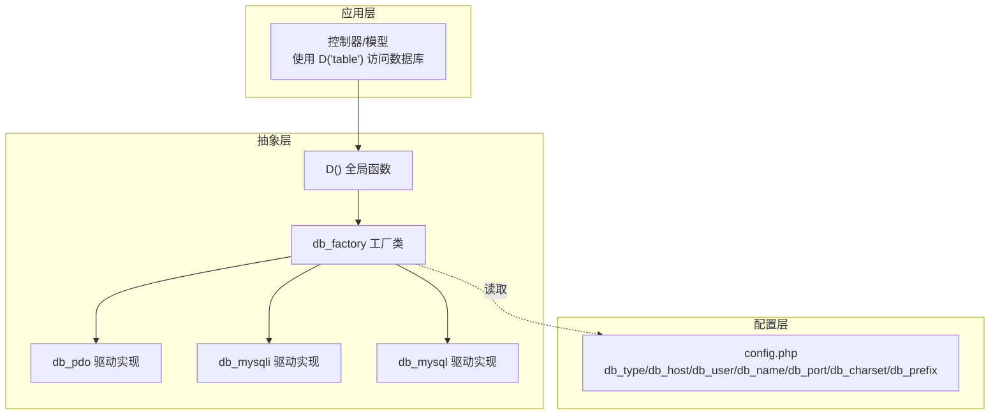
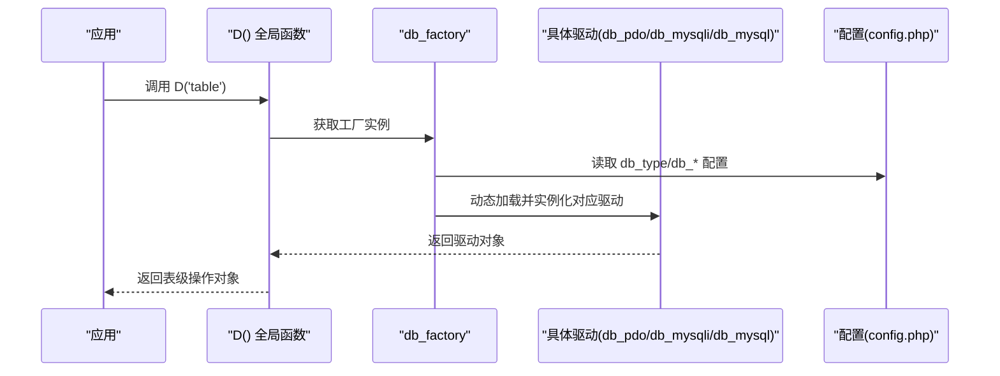
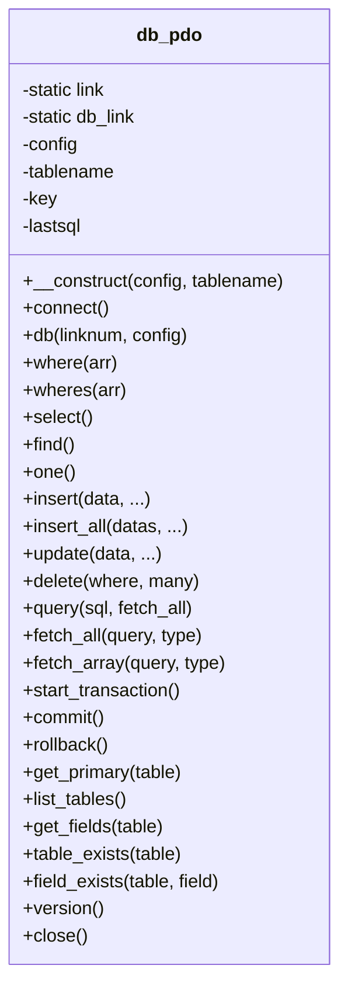
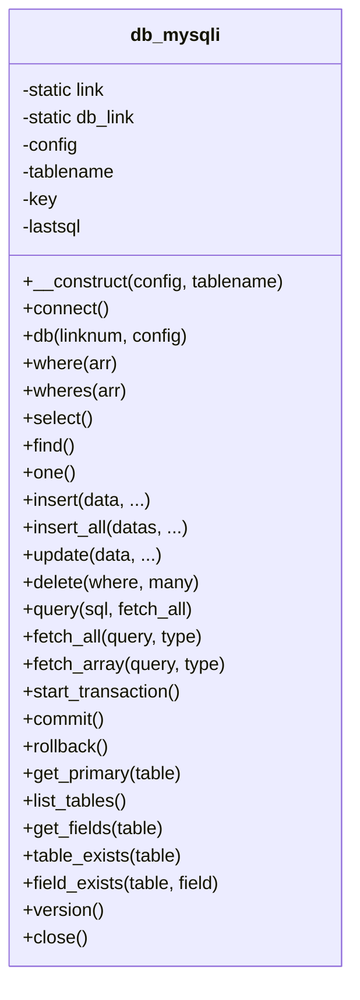
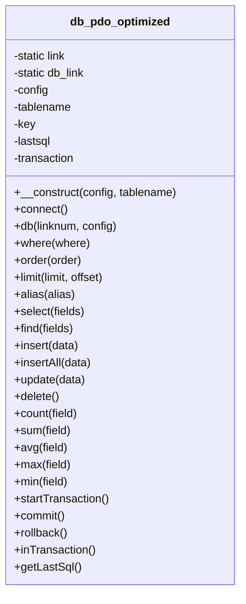
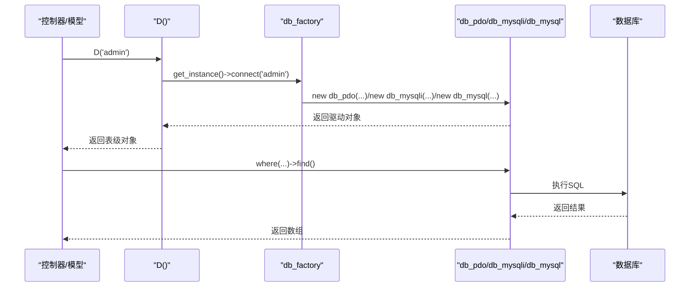
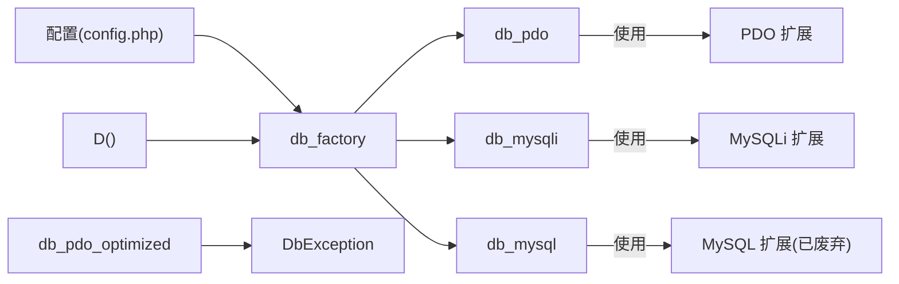

# 数据库抽象层

<cite>
**本文引用的文件列表**
- [db_factory.class.php](file://ryphp/core/class/db_factory.class.php)
- [db_pdo.class.php](file://ryphp/core/class/db_pdo.class.php)
- [db_mysql.class.php](file://ryphp/core/class/db_mysql.class.php)
- [db_mysqli.class.php](file://ryphp/core/class/db_mysqli.class.php)
- [db_pdo_optimized.class.php](file://ryphp/core/class/db_pdo_optimized.class.php)
- [DbException.class.php](file://ryphp/core/class/DbException.class.php)
- [global.func.php](file://ryphp/core/function/global.func.php)
- [config.php](file://common/config/config.php)
- [admin.class.php](file://application/lry_admin_center/model/admin.class.php)
</cite>

## 目录
1. [简介](#简介)
2. [项目结构](#项目结构)
3. [核心组件](#核心组件)
4. [架构总览](#架构总览)
5. [详细组件分析](#详细组件分析)
6. [依赖关系分析](#依赖关系分析)
7. [性能考量](#性能考量)
8. [故障排查指南](#故障排查指南)
9. [结论](#结论)
10. [附录](#附录)

## 简介
本文件面向开发者，系统性解析数据库抽象层的设计与实现，重点覆盖以下方面：
- 工厂模式如何根据配置动态选择数据库驱动（PDO、MySQL、MySQLi）。
- 数据库连接池管理、查询优化与事务处理机制。
- 不同驱动的特性、适用场景与性能差异。
- 提供连接配置示例与常用增删改查操作的使用路径，帮助快速上手与正确选型。

## 项目结构
数据库抽象层位于框架核心目录，采用“工厂 + 多驱动实现”的分层设计：
- 工厂类负责按配置选择具体驱动类并创建实例。
- 三种驱动类分别封装 PDO、MySQL（已废弃）、MySQLi 的连接与查询逻辑。
- 全局函数 D() 作为统一入口，返回表级操作对象。
- 配置文件集中定义数据库类型与连接参数。

图表来源
- [db_factory.class.php](file://ryphp/core/class/db_factory.class.php#L1-L50)
- [global.func.php](file://ryphp/core/function/global.func.php#L100-L108)
- [config.php](file://common/config/config.php#L13-L21)

章节来源
- [db_factory.class.php](file://ryphp/core/class/db_factory.class.php#L1-L50)
- [global.func.php](file://ryphp/core/function/global.func.php#L100-L108)
- [config.php](file://common/config/config.php#L13-L21)

## 核心组件
- 工厂类 db_factory：依据配置选择驱动，创建并复用实例；提供 connect(tablename) 构造具体驱动对象。
- 驱动类 db_pdo/db_mysqli/db_mysql：封装连接、查询、事务、元数据等能力。
- 全局函数 D()：表级操作入口，内部委托工厂创建驱动对象。
- 异常类 DbException：统一抛出带类型与上下文的数据库异常。

章节来源
- [db_factory.class.php](file://ryphp/core/class/db_factory.class.php#L1-L50)
- [db_pdo.class.php](file://ryphp/core/class/db_pdo.class.php#L1-L646)
- [db_mysqli.class.php](file://ryphp/core/class/db_mysqli.class.php#L1-L660)
- [db_mysql.class.php](file://ryphp/core/class/db_mysql.class.php#L1-L667)
- [DbException.class.php](file://ryphp/core/class/DbException.class.php#L1-L73)
- [global.func.php](file://ryphp/core/function/global.func.php#L100-L108)

## 架构总览
工厂模式与驱动选择流程如下：

图表来源
- [global.func.php](file://ryphp/core/function/global.func.php#L100-L108)
- [db_factory.class.php](file://ryphp/core/class/db_factory.class.php#L11-L50)
- [config.php](file://common/config/config.php#L13-L21)

## 详细组件分析

### 工厂模式与驱动选择
- 工厂类维护静态实例与类名缓存，避免重复创建。
- 根据配置 C('db_type') 选择驱动：pdo、mysqli 或 mysql（已废弃）。
- connect(tablename) 将配置注入驱动构造函数，返回表级操作对象。

章节来源
- [db_factory.class.php](file://ryphp/core/class/db_factory.class.php#L11-L50)
- [config.php](file://common/config/config.php#L13-L21)

### PDO 驱动（推荐）
- 连接池：静态数组 self::$db_link 维护多个连接，按连接号索引。
- 安全与预处理：默认禁用模拟预处理，绑定参数防止注入；调试模式下可拼装最终 SQL 便于定位。
- 查询构建：where/wheres 支持多种表达式与函数回调；链式调用支持 field/order/limit/group/having 等。
- 增删改查：insert/insert_all/delete/update/select/find/one/query/fetch_all/fetch_array/total 等。
- 事务：start_transaction/commit/rollback，支持断线重连自动恢复。
- 元数据：get_primary/list_tables/get_fields/table_exists/field_exists/version/close 等。

图表来源
- [db_pdo.class.php](file://ryphp/core/class/db_pdo.class.php#L10-L646)

章节来源
- [db_pdo.class.php](file://ryphp/core/class/db_pdo.class.php#L10-L646)

### MySQLi 驱动
- 连接池：与 PDO 类似，支持多连接号复用。
- 查询构建：where/wheres 与 PDO 驱动一致；链式调用支持 field/order/limit/group/having。
- 增删改查：insert/insert_all/delete/update/select/find/one/query/fetch_all/fetch_array/total。
- 事务：autocommit(false)/commit/rollback 并恢复 autocommit=true。
- 元数据：get_primary/list_tables/get_fields/table_exists/field_exists/version/close。

图表来源
- [db_mysqli.class.php](file://ryphp/core/class/db_mysqli.class.php#L10-L660)

章节来源
- [db_mysqli.class.php](file://ryphp/core/class/db_mysqli.class.php#L10-L660)

### MySQL 驱动（已废弃）
- 仍保留连接池与查询能力，但底层使用已废弃的 mysql_* 函数族。
- 建议迁移至 PDO 或 MySQLi。

章节来源
- [db_mysql.class.php](file://ryphp/core/class/db_mysql.class.php#L10-L667)

### 优化版 PDO 驱动（db_pdo_optimized）
- 引入自定义异常 DbException，统一错误类型与上下文。
- 新增聚合函数：count/sum/avg/max/min。
- 新增事务状态跟踪：inTransaction/startTransaction/commit/rollback。
- 更严格的 where 条件与 delete 防误删校验。
- 保持与原版一致的查询构建与连接池机制。

图表来源
- [db_pdo_optimized.class.php](file://ryphp/core/class/db_pdo_optimized.class.php#L13-L767)

章节来源
- [db_pdo_optimized.class.php](file://ryphp/core/class/db_pdo_optimized.class.php#L13-L767)

### 全局入口与使用示例
- D('table') 是统一入口，内部委托工厂创建驱动对象并缓存。
- 示例：登录验证中通过 D('admin') 查询用户并更新登录信息。

图表来源
- [global.func.php](file://ryphp/core/function/global.func.php#L100-L108)
- [db_factory.class.php](file://ryphp/core/class/db_factory.class.php#L38-L50)
- [admin.class.php](file://application/lry_admin_center/model/admin.class.php#L4-L27)

章节来源
- [global.func.php](file://ryphp/core/function/global.func.php#L100-L108)
- [admin.class.php](file://application/lry_admin_center/model/admin.class.php#L4-L27)

## 依赖关系分析
- 工厂类依赖配置中心（C()），按 db_type 分派驱动。
- 驱动类依赖 PDO/MySQLi/MySQL 扩展，内部维护连接池与静态句柄。
- 全局函数 D() 依赖工厂类，提供表级对象缓存。
- 优化版 PDO 驱动引入 DbException，提升错误处理一致性。

图表来源
- [db_factory.class.php](file://ryphp/core/class/db_factory.class.php#L11-L50)
- [db_pdo.class.php](file://ryphp/core/class/db_pdo.class.php#L10-L646)
- [db_mysqli.class.php](file://ryphp/core/class/db_mysqli.class.php#L10-L660)
- [db_mysql.class.php](file://ryphp/core/class/db_mysql.class.php#L10-L667)
- [db_pdo_optimized.class.php](file://ryphp/core/class/db_pdo_optimized.class.php#L13-L767)
- [DbException.class.php](file://ryphp/core/class/DbException.class.php#L10-L73)
- [config.php](file://common/config/config.php#L13-L21)

章节来源
- [db_factory.class.php](file://ryphp/core/class/db_factory.class.php#L11-L50)
- [config.php](file://common/config/config.php#L13-L21)

## 性能考量
- 连接池：三种驱动均支持多连接号复用，减少频繁连接开销。
- 预处理与绑定：PDO 驱动默认禁用模拟预处理，避免字符串拼接与二次编译，提升安全性与性能。
- 断线重连：驱动在执行阶段检测“server has gone away”，自动重建连接并重试一次，增强稳定性。
- 事务：合理使用事务减少往返次数，注意控制事务范围，避免长时间持有锁。
- 查询构建：where/wheres 支持数组条件与函数回调，建议优先使用绑定参数，避免字符串拼接。
- 聚合函数：优化版 PDO 驱动提供 count/sum/avg/max/min，减少多次 round-trip。

章节来源
- [db_pdo.class.php](file://ryphp/core/class/db_pdo.class.php#L100-L124)
- [db_mysqli.class.php](file://ryphp/core/class/db_mysqli.class.php#L134-L150)
- [db_mysql.class.php](file://ryphp/core/class/db_mysql.class.php#L136-L153)
- [db_pdo_optimized.class.php](file://ryphp/core/class/db_pdo_optimized.class.php#L180-L208)

## 故障排查指南
- 连接失败
  - 检查配置项 db_host/db_port/db_user/db_pwd/db_name/db_charset/db_prefix。
  - 查看异常类型：connection_error（工厂连接失败）。
- 执行错误
  - 检查 SQL 语法与绑定参数顺序；调试模式下可查看 lastsql。
  - 异常类型：execute_error（执行失败）。
- CLI 环境
  - CLI 下直接抛出 DbException，便于脚本化调试。
- 事务问题
  - 确认事务状态：inTransaction()；提交/回滚后会清除事务标记。
- 防误删
  - 优化版 PDO 驱动要求 delete 必须带有 where 条件，否则抛错。

章节来源
- [DbException.class.php](file://ryphp/core/class/DbException.class.php#L10-L73)
- [db_pdo_optimized.class.php](file://ryphp/core/class/db_pdo_optimized.class.php#L544-L567)

## 结论
- 工厂模式实现了对多驱动的统一接入，配合配置中心灵活切换。
- PDO 驱动在安全性、性能与生态上具备优势，建议优先使用。
- 优化版 PDO 驱动进一步完善了异常体系与常用聚合函数，适合生产环境。
- MySQLi 驱动适合作为替代方案，具备良好的兼容性。
- MySQL 驱动已废弃，建议尽快迁移。

## 附录

### 驱动特性与适用场景对比
- PDO
  - 特点：跨数据库、预处理绑定、异常统一、连接池、断线重连。
  - 适用：新项目、需要跨数据库或更高安全性的场景。
- MySQLi
  - 特点：面向 MySQL 的原生扩展、支持面向对象与过程式、连接池。
  - 适用：仅使用 MySQL 且追求更贴近原生 API 的场景。
- MySQL（已废弃）
  - 特点：底层 API 已废弃，不建议使用。
  - 适用：仅限遗留系统迁移过渡期。

章节来源
- [db_pdo.class.php](file://ryphp/core/class/db_pdo.class.php#L10-L646)
- [db_mysqli.class.php](file://ryphp/core/class/db_mysqli.class.php#L10-L660)
- [db_mysql.class.php](file://ryphp/core/class/db_mysql.class.php#L10-L667)

### 连接配置示例（来自配置文件）
- 数据库类型：pdo/mysqli/mysql
- 主机地址：127.0.0.1
- 数据库名：rycms
- 用户名：root
- 密码：lrysql01.
- 端口：3306
- 字符集：utf8
- 表前缀：rycms_

章节来源
- [config.php](file://common/config/config.php#L13-L21)

### 常用操作使用路径（无代码示例）
- 查询单条记录
  - 路径：D('table')->where([...])->find()
  - 参考：[db_pdo.class.php](file://ryphp/core/class/db_pdo.class.php#L384-L396)、[db_mysqli.class.php](file://ryphp/core/class/db_mysqli.class.php#L407-L419)、[db_mysql.class.php](file://ryphp/core/class/db_mysql.class.php#L409-L421)
- 查询多条记录
  - 路径：D('table')->where([...])->select()
  - 参考：[db_pdo.class.php](file://ryphp/core/class/db_pdo.class.php#L365-L377)、[db_mysqli.class.php](file://ryphp/core/class/db_mysqli.class.php#L384-L400)、[db_mysql.class.php](file://ryphp/core/class/db_mysql.class.php#L386-L402)
- 插入数据
  - 路径：D('table')->insert([...])
  - 参考：[db_pdo.class.php](file://ryphp/core/class/db_pdo.class.php#L249-L266)、[db_mysqli.class.php](file://ryphp/core/class/db_mysqli.class.php#L270-L286)、[db_mysql.class.php](file://ryphp/core/class/db_mysql.class.php#L272-L288)
- 批量插入
  - 路径：D('table')->insert_all([...])
  - 参考：[db_pdo.class.php](file://ryphp/core/class/db_pdo.class.php#L276-L296)、[db_mysqli.class.php](file://ryphp/core/class/db_mysqli.class.php#L296-L315)、[db_mysql.class.php](file://ryphp/core/class/db_mysql.class.php#L298-L317)
- 更新数据
  - 路径：D('table')->where([...])->update([...])
  - 参考：[db_pdo.class.php](file://ryphp/core/class/db_pdo.class.php#L341-L358)、[db_mysqli.class.php](file://ryphp/core/class/db_mysqli.class.php#L360-L377)、[db_mysql.class.php](file://ryphp/core/class/db_mysql.class.php#L362-L379)
- 删除数据
  - 路径：D('table')->where([...])->delete()
  - 参考：[db_pdo.class.php](file://ryphp/core/class/db_pdo.class.php#L307-L326)、[db_mysqli.class.php](file://ryphp/core/class/db_mysqli.class.php#L326-L345)、[db_mysql.class.php](file://ryphp/core/class/db_mysql.class.php#L328-L347)
- 事务处理
  - 路径：D('table')->start_transaction()/commit()/rollback()
  - 参考：[db_pdo.class.php](file://ryphp/core/class/db_pdo.class.php#L527-L547)、[db_mysqli.class.php](file://ryphp/core/class/db_mysqli.class.php#L547-L569)、[db_mysql.class.php](file://ryphp/core/class/db_mysql.class.php#L549-L575)
- 聚合查询（优化版 PDO）
  - 路径：D('table')->where([...])->count()/sum()/avg()/max()/min()
  - 参考：[db_pdo_optimized.class.php](file://ryphp/core/class/db_pdo_optimized.class.php#L574-L702)