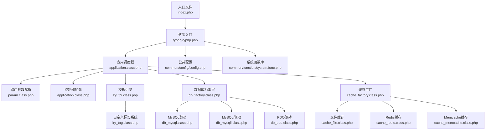
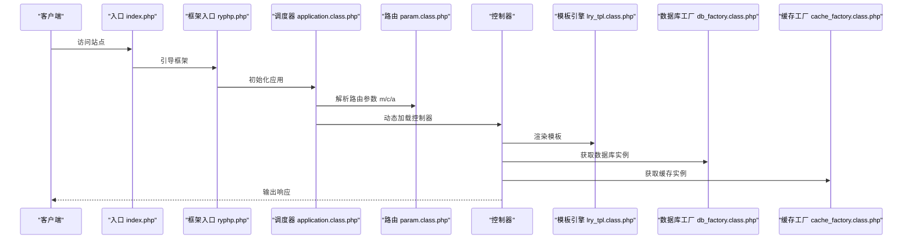
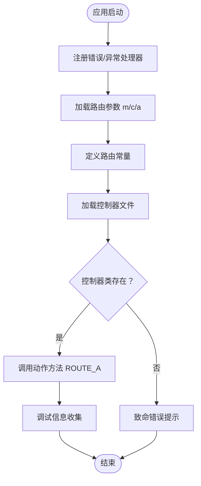
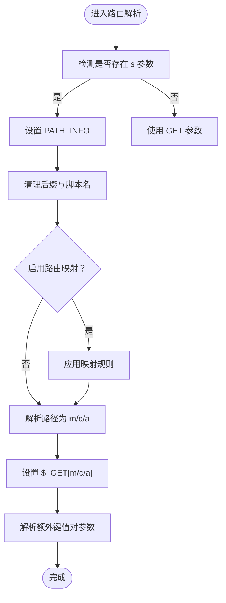
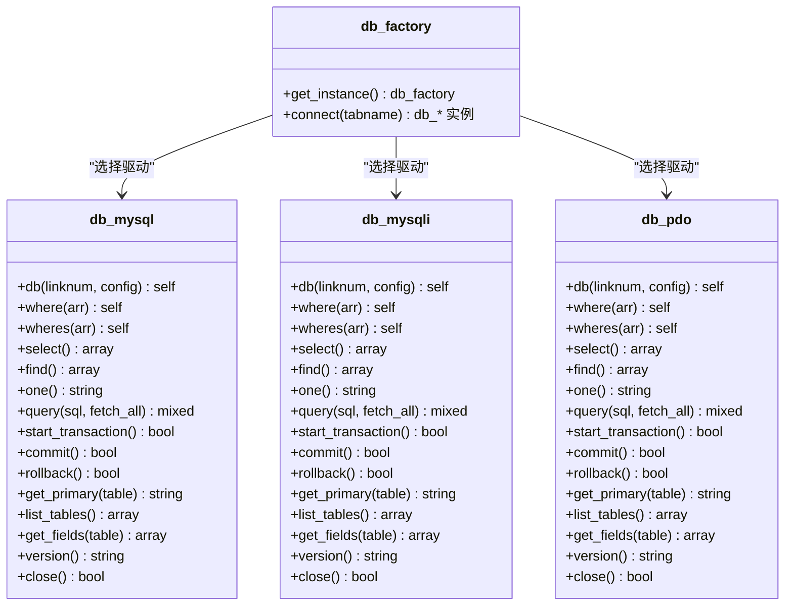
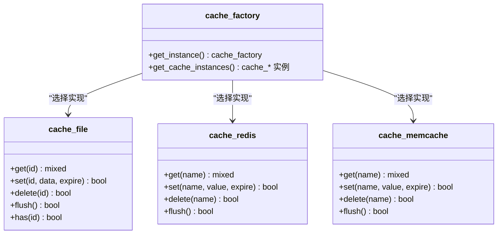
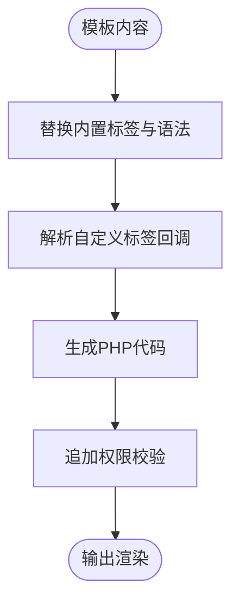
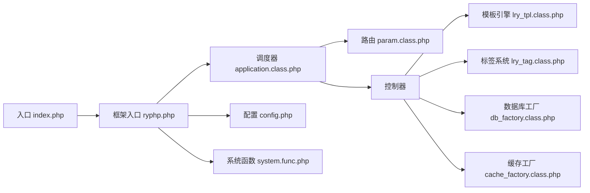

# 核心框架组件

<cite>
**本文档引用的文件**
- [index.php](file://index.php)
- [ryphp.php](file://ryphp/ryphp.php)
- [application.class.php](file://ryphp/core/class/application.class.php)
- [param.class.php](file://ryphp/core/class/param.class.php)
- [db_factory.class.php](file://ryphp/core/class/db_factory.class.php)
- [db_mysql.class.php](file://ryphp/core/class/db_mysql.class.php)
- [db_mysqli.class.php](file://ryphp/core/class/db_mysqli.class.php)
- [db_pdo.class.php](file://ryphp/core/class/db_pdo.class.php)
- [db_pdo_optimized.class.php](file://ryphp/core/class/db_pdo_optimized.class.php)
- [cache_factory.class.php](file://ryphp/core/class/cache_factory.class.php)
- [cache_file.class.php](file://ryphp/core/class/cache_file.class.php)
- [cache_redis.class.php](file://ryphp/core/class/cache_redis.class.php)
- [cache_memcache.class.php](file://ryphp/core/class/cache_memcache.class.php)
- [lry_tpl.class.php](file://ryphp/core/class/lry_tpl.class.php)
- [lry_tag.class.php](file://ryphp/core/class/lry_tag.class.php)
- [config.php](file://common/config/config.php)
- [index.class.php](file://application/index/controller/index.class.php)
- [index.class.php](file://application/lry_admin_center/controller/index.class.php)
- [system.func.php](file://common/function/system.func.php)
</cite>

## 目录
1. [引言](#引言)
2. [项目结构](#项目结构)
3. [核心组件](#核心组件)
4. [架构总览](#架构总览)
5. [详细组件分析](#详细组件分析)
6. [依赖关系分析](#依赖关系分析)
7. [性能考虑](#性能考虑)
8. [故障排除指南](#故障排除指南)
9. [结论](#结论)
10. [附录](#附录)

## 引言
本文件面向LRYBlog项目的开发者与维护者，系统性梳理RYPHP自研框架的核心设计与实现机制，重点覆盖以下方面：
- 应用程序调度器：控制器加载、方法调用与生命周期管理
- 路由系统：URL解析、参数提取与路由规则匹配
- 数据库抽象层：MySQL、PDO、MySQLi多驱动选择与切换
- 缓存系统：工厂模式实现，统一管理文件、Redis、Memcache
- 模板引擎：模板解析、变量替换与自定义标签系统
- 实际使用场景与扩展建议

## 项目结构
LRYBlog采用典型的MVC分层结构，核心框架位于`ryphp/`目录，应用代码位于`application/`目录，公共配置与函数位于`common/`目录。

图表来源
- [index.php](file://index.php#L1-L18)
- [ryphp.php](file://ryphp/ryphp.php#L83-L204)
- [application.class.php](file://ryphp/core/class/application.class.php#L4-L118)
- [param.class.php](file://ryphp/core/class/param.class.php#L3-L195)
- [db_factory.class.php](file://ryphp/core/class/db_factory.class.php#L1-L50)
- [cache_factory.class.php](file://ryphp/core/class/cache_factory.class.php#L1-L84)
- [lry_tpl.class.php](file://ryphp/core/class/lry_tpl.class.php#L10-L134)
- [lry_tag.class.php](file://ryphp/core/class/lry_tag.class.php#L10-L492)
- [config.php](file://common/config/config.php#L1-L88)

章节来源
- [index.php](file://index.php#L1-L18)
- [ryphp.php](file://ryphp/ryphp.php#L83-L204)

## 核心组件
本节概览各核心组件职责与交互关系：
- 框架入口与类加载：负责常量定义、类自动加载与全局函数加载
- 应用调度器：初始化路由参数、加载控制器、反射调用动作方法
- 路由系统：解析URL、处理PATH_INFO、映射路由规则
- 数据库抽象层：工厂模式按配置选择具体驱动，统一接口
- 缓存系统：工厂模式按配置选择具体缓存实现
- 模板引擎：模板语法解析、变量替换、自定义标签回调
- 系统函数库：提供站点、URL、缓存等常用工具函数

章节来源
- [ryphp.php](file://ryphp/ryphp.php#L83-L204)
- [application.class.php](file://ryphp/core/class/application.class.php#L4-L118)
- [param.class.php](file://ryphp/core/class/param.class.php#L3-L195)
- [db_factory.class.php](file://ryphp/core/class/db_factory.class.php#L1-L50)
- [cache_factory.class.php](file://ryphp/core/class/cache_factory.class.php#L1-L84)
- [lry_tpl.class.php](file://ryphp/core/class/lry_tpl.class.php#L10-L134)
- [lry_tag.class.php](file://ryphp/core/class/lry_tag.class.php#L10-L492)
- [system.func.php](file://common/function/system.func.php#L1-L969)

## 架构总览
RYPHP框架遵循“入口文件 → 框架入口 → 调度器 → 路由 → 控制器 → 视图/模板 → 缓存/数据库”的标准流程；同时通过工厂模式解耦数据库与缓存的具体实现，提升可扩展性与可维护性。

图表来源
- [index.php](file://index.php#L1-L18)
- [ryphp.php](file://ryphp/ryphp.php#L83-L204)
- [application.class.php](file://ryphp/core/class/application.class.php#L24-L40)
- [param.class.php](file://ryphp/core/class/param.class.php#L19-L46)
- [lry_tpl.class.php](file://ryphp/core/class/lry_tpl.class.php#L31-L59)
- [db_factory.class.php](file://ryphp/core/class/db_factory.class.php#L11-L34)
- [cache_factory.class.php](file://ryphp/core/class/cache_factory.class.php#L36-L62)

## 详细组件分析

### 应用程序调度器
- 初始化阶段：注册错误/异常处理器，加载路由参数，定义路由常量
- 控制器加载：校验模块与控制器文件存在性，动态包含并实例化
- 方法调用：检查动作方法可见性与存在性，反射调用并输出调试信息
- 错误处理：统一错误页面与状态码控制

图表来源
- [application.class.php](file://ryphp/core/class/application.class.php#L9-L40)

章节来源
- [application.class.php](file://ryphp/core/class/application.class.php#L4-L118)

### 路由系统
- 路由参数来源：支持GET/POST参数与PATH_INFO两种模式
- 安全处理：长度限制、注入字符清理、魔术引号处理
- PATH_INFO解析：移除HTML后缀与脚本名，支持路由映射与键值对参数
- 路由映射：基于规则数组进行URL重写

图表来源
- [param.class.php](file://ryphp/core/class/param.class.php#L95-L115)
- [param.class.php](file://ryphp/core/class/param.class.php#L138-L151)
- [param.class.php](file://ryphp/core/class/param.class.php#L173-L183)

章节来源
- [param.class.php](file://ryphp/core/class/param.class.php#L3-L195)

### 数据库抽象层
- 工厂模式：根据配置选择MySQL、MySQLi或PDO驱动
- 统一接口：where/wheres、field/order/limit/group/having、join、select/find/one、query、事务、元数据查询
- 连接池：支持多连接切换与复用
- 错误处理：统一抛错与日志记录

图表来源
- [db_factory.class.php](file://ryphp/core/class/db_factory.class.php#L1-L50)
- [db_mysql.class.php](file://ryphp/core/class/db_mysql.class.php#L10-L667)
- [db_mysqli.class.php](file://ryphp/core/class/db_mysqli.class.php#L31-L125)
- [db_pdo.class.php](file://ryphp/core/class/db_pdo.class.php#L10-L646)

章节来源
- [db_factory.class.php](file://ryphp/core/class/db_factory.class.php#L1-L50)
- [db_mysql.class.php](file://ryphp/core/class/db_mysql.class.php#L10-L667)
- [db_mysqli.class.php](file://ryphp/core/class/db_mysqli.class.php#L31-L125)
- [db_pdo.class.php](file://ryphp/core/class/db_pdo.class.php#L10-L646)

### 缓存系统
- 工厂模式：根据配置选择file/redis/memcache
- 单例缓存实例：延迟初始化，避免重复实例化
- 统一接口：get/set/delete/flush/has
- 配置项：文件缓存目录、后缀、序列化模式；Redis/Memcache主机、端口、超时、前缀等

图表来源
- [cache_factory.class.php](file://ryphp/core/class/cache_factory.class.php#L1-L84)
- [cache_file.class.php](file://ryphp/core/class/cache_file.class.php#L2-L130)
- [cache_redis.class.php](file://ryphp/core/class/cache_redis.class.php#L10-L108)
- [cache_memcache.class.php](file://ryphp/core/class/cache_memcache.class.php#L10-L91)

章节来源
- [cache_factory.class.php](file://ryphp/core/class/cache_factory.class.php#L1-L84)
- [cache_file.class.php](file://ryphp/core/class/cache_file.class.php#L2-L130)
- [cache_redis.class.php](file://ryphp/core/class/cache_redis.class.php#L10-L108)
- [cache_memcache.class.php](file://ryphp/core/class/cache_memcache.class.php#L10-L91)

### 模板引擎与自定义标签
- 模板解析：支持include/php/if/else/elseif/for/loop/++/--/自定义函数/变量/对象属性等语法
- 标签系统：自定义标签回调，支持缓存与分页参数
- 安全机制：模板文件头加入权限校验

图表来源
- [lry_tpl.class.php](file://ryphp/core/class/lry_tpl.class.php#L31-L59)
- [lry_tpl.class.php](file://ryphp/core/class/lry_tpl.class.php#L70-L92)

章节来源
- [lry_tpl.class.php](file://ryphp/core/class/lry_tpl.class.php#L10-L134)
- [lry_tag.class.php](file://ryphp/core/class/lry_tag.class.php#L10-L492)

### 控制器与视图示例
- 前台首页控制器：接收分页参数，查询栏目数据
- 后台首页控制器：继承通用控制器，处理登录、锁屏、统计等

章节来源
- [index.class.php](file://application/index/controller/index.class.php#L1-L18)
- [index.class.php](file://application/lry_admin_center/controller/index.class.php#L1-L162)

## 依赖关系分析
- 入口依赖框架入口；框架入口依赖系统函数与类加载；调度器依赖路由与控制器；控制器依赖模板、数据库与缓存；工厂类解耦具体实现。
- 配置文件集中管理数据库、缓存、路由等关键参数，系统函数库提供URL、站点、缓存等工具。

图表来源
- [index.php](file://index.php#L1-L18)
- [ryphp.php](file://ryphp/ryphp.php#L83-L204)
- [application.class.php](file://ryphp/core/class/application.class.php#L4-L118)
- [param.class.php](file://ryphp/core/class/param.class.php#L3-L195)
- [lry_tpl.class.php](file://ryphp/core/class/lry_tpl.class.php#L10-L134)
- [lry_tag.class.php](file://ryphp/core/class/lry_tag.class.php#L10-L492)
- [db_factory.class.php](file://ryphp/core/class/db_factory.class.php#L1-L50)
- [cache_factory.class.php](file://ryphp/core/class/cache_factory.class.php#L1-L84)
- [config.php](file://common/config/config.php#L1-L88)
- [system.func.php](file://common/function/system.func.php#L1-L969)

章节来源
- [ryphp.php](file://ryphp/ryphp.php#L83-L204)
- [config.php](file://common/config/config.php#L1-L88)

## 性能考虑
- 路由解析：PATH_INFO模式下建议配合Nginx/URL重写，减少不必要的参数传递
- 数据库：PDO驱动具备预处理与严格模式，建议优先使用；合理使用索引与分页
- 缓存：根据场景选择文件/Redis/Memcache；Redis适合高并发读写，Memcache轻量部署
- 模板：避免复杂嵌套循环与频繁IO；必要时启用标签缓存与分页缓存
- 调试：生产环境关闭调试模式，避免性能损耗

## 故障排除指南
- 调试模式：开启后输出详细错误与SQL；关闭后记录错误日志并返回友好提示
- 数据库连接失败：检查配置项与服务器连通性；PDO/MySQLi错误信息差异较大
- 缓存不可用：确认扩展是否加载、连接参数是否正确
- 模板报错：检查标签语法与变量命名；确认模板权限校验

章节来源
- [application.class.php](file://ryphp/core/class/application.class.php#L108-L115)
- [db_mysql.class.php](file://ryphp/core/class/db_mysql.class.php#L36-L49)
- [db_pdo.class.php](file://ryphp/core/class/db_pdo.class.php#L32-L42)
- [cache_redis.class.php](file://ryphp/core/class/cache_redis.class.php#L30-L51)
- [cache_memcache.class.php](file://ryphp/core/class/cache_memcache.class.php#L27-L36)
- [lry_tpl.class.php](file://ryphp/core/class/lry_tpl.class.php#L57-L58)

## 结论
RYPHP框架通过清晰的入口与调度器、灵活的路由系统、可插拔的数据库与缓存工厂、以及可扩展的模板与标签体系，构建了稳定易扩展的内容管理基础。建议在生产环境中：
- 明确选择数据库与缓存驱动并固化配置
- 合理使用标签缓存与分页缓存
- 严格控制模板复杂度与IO操作
- 建立完善的日志与监控体系

## 附录
- 配置项参考：数据库类型与连接、缓存类型与参数、路由规则、Cookie与语言等
- 常用函数：站点信息、URL生成、缓存读写、栏目与模型查询等

章节来源
- [config.php](file://common/config/config.php#L1-L88)
- [system.func.php](file://common/function/system.func.php#L1-L969)