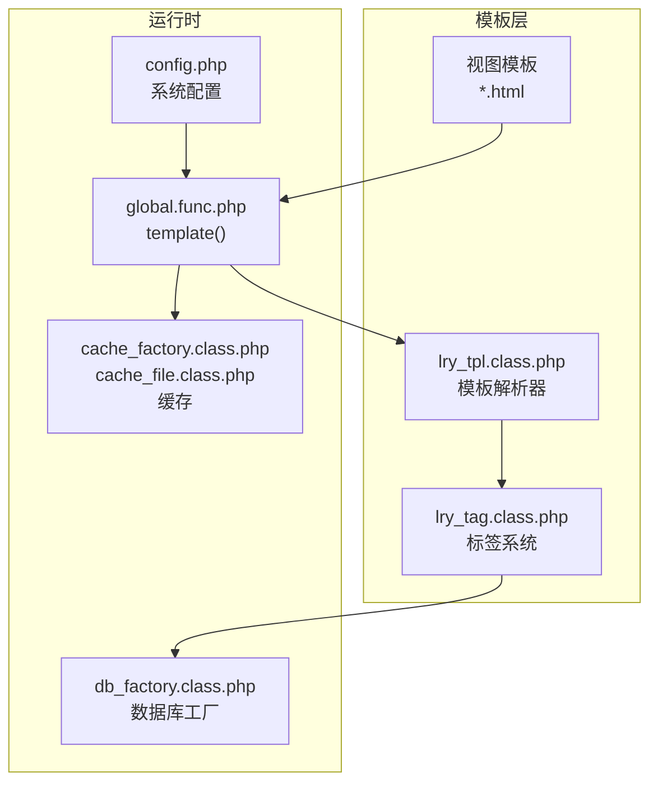
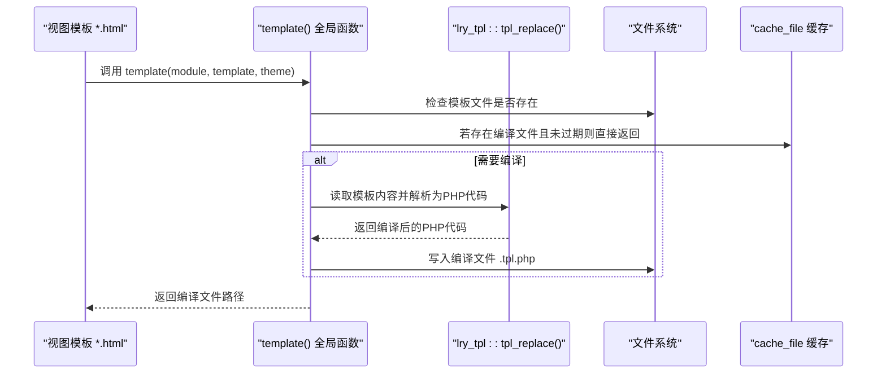
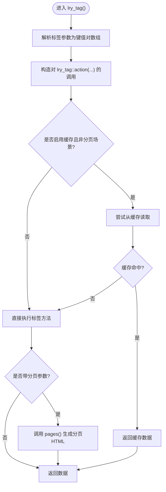
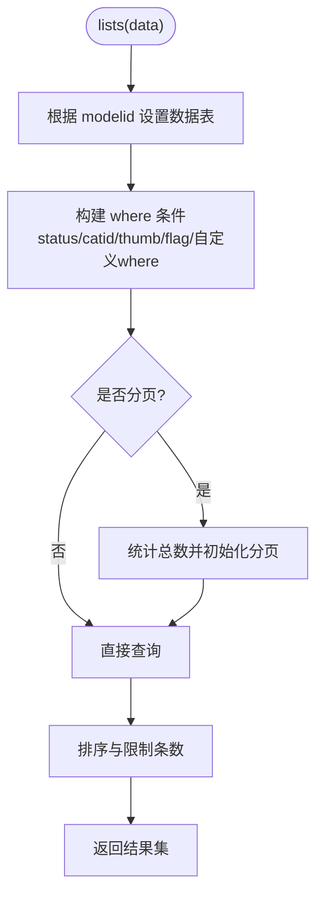
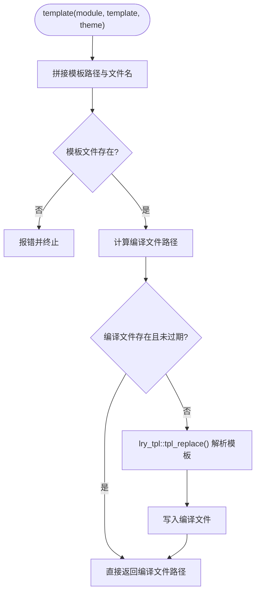
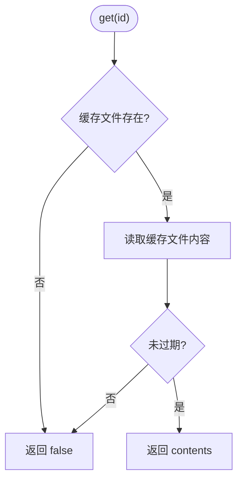
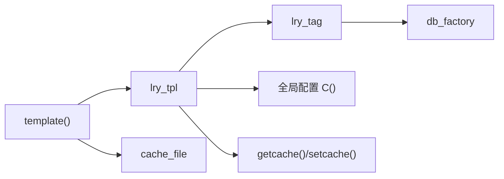

# 模板引擎

<cite>
**本文引用的文件**
- [lry_tpl.class.php](file://ryphp/core/class/lry_tpl.class.php)
- [lry_tag.class.php](file://ryphp/core/class/lry_tag.class.php)
- [global.func.php](file://ryphp/core/function/global.func.php)
- [cache_file.class.php](file://ryphp/core/class/cache_file.class.php)
- [cache_factory.class.php](file://ryphp/core/class/cache_factory.class.php)
- [db_factory.class.php](file://ryphp/core/class/db_factory.class.php)
- [config.php](file://common/config/config.php)
- [category_article.html](file://application/index/view/rongyao/category_article.html)
- [list_article.html](file://application/index/view/rongyao/list_article.html)
- [show_article.html](file://application/index/view/rongyao/show_article.html)
- [category_page.html](file://application/index/view/rongyao/category_page.html)
- [list_article_img.html](file://application/index/view/rongyao/list_article_img.html)
</cite>

## 目录
1. [简介](#简介)
2. [项目结构](#项目结构)
3. [核心组件](#核心组件)
4. [架构总览](#架构总览)
5. [详细组件分析](#详细组件分析)
6. [依赖关系分析](#依赖关系分析)
7. [性能考量](#性能考量)
8. [故障排查指南](#故障排查指南)
9. [结论](#结论)
10. [附录](#附录)

## 简介
本文件面向模板引擎的技术文档，围绕 lry_tpl.class.php 的模板解析机制、lry_tag.class.php 的自定义标签系统、模板继承/包含/嵌套的实现原理、模板编译缓存机制与性能优化策略进行深入解析，并提供模板语法参考与实际使用示例，帮助开发者快速理解与高效使用该模板系统。

## 项目结构
模板引擎位于框架核心层，主要由以下模块构成：
- 模板解析器：lry_tpl.class.php，负责将模板语法转换为 PHP 代码
- 标签系统：lry_tag.class.php，提供内置标签（如列表、分页、评论、搜索等）
- 模板调用与编译：global.func.php 中的 template() 函数，负责模板文件定位、编译缓存与生成编译文件
- 缓存系统：cache_factory.class.php + cache_file.class.php，提供文件型缓存能力
- 数据库工厂：db_factory.class.php，为标签系统提供数据访问抽象
- 配置中心：common/config/config.php，提供站点主题、缓存类型等全局配置

图表来源
- [lry_tpl.class.php](file://ryphp/core/class/lry_tpl.class.php#L10-L134)
- [lry_tag.class.php](file://ryphp/core/class/lry_tag.class.php#L10-L492)
- [global.func.php](file://ryphp/core/function/global.func.php#L1527-L1556)
- [cache_factory.class.php](file://ryphp/core/class/cache_factory.class.php#L36-L82)
- [cache_file.class.php](file://ryphp/core/class/cache_file.class.php#L17-L128)
- [db_factory.class.php](file://ryphp/core/class/db_factory.class.php#L11-L49)
- [config.php](file://common/config/config.php#L1-L88)

章节来源
- [lry_tpl.class.php](file://ryphp/core/class/lry_tpl.class.php#L10-L134)
- [lry_tag.class.php](file://ryphp/core/class/lry_tag.class.php#L10-L492)
- [global.func.php](file://ryphp/core/function/global.func.php#L1527-L1556)
- [cache_factory.class.php](file://ryphp/core/class/cache_factory.class.php#L36-L82)
- [cache_file.class.php](file://ryphp/core/class/cache_file.class.php#L17-L128)
- [db_factory.class.php](file://ryphp/core/class/db_factory.class.php#L11-L49)
- [config.php](file://common/config/config.php#L1-L88)

## 核心组件
- 模板解析器（lry_tpl）
  - 负责将模板中的标签语法转换为 PHP 代码，支持包含、PHP 原生片段、条件、循环、自增自减、变量输出、对象属性输出、自定义标签回调等
  - 提供标签回调入口，将自定义标签转换为对 lry_tag 类方法的调用，并支持缓存与分页参数
- 标签系统（lry_tag）
  - 提供丰富的内置标签方法，如内容列表、分页、点击排行、导航、链接、标签、相关内容、评论、搜索、自定义 SQL 等
  - 支持分页标签 pages() 输出分页 HTML
- 模板调用与编译（template）
  - 定位模板文件，若未命中或模板较新则重新编译，生成编译文件（.tpl.php），并返回编译文件路径
- 缓存系统（cache_factory + cache_file）
  - 根据配置选择缓存类型（file/redis/memcache），提供 get/set/delete/flush 等接口
  - 模板引擎内部通过 getcache()/setcache() 使用缓存
- 数据库工厂（db_factory）
  - 根据配置动态加载数据库驱动（pdo/mysql/mysqli），统一对外提供数据访问接口
- 配置中心（config）
  - 提供站点主题、缓存类型、数据库连接等全局配置

章节来源
- [lry_tpl.class.php](file://ryphp/core/class/lry_tpl.class.php#L31-L92)
- [lry_tag.class.php](file://ryphp/core/class/lry_tag.class.php#L18-L492)
- [global.func.php](file://ryphp/core/function/global.func.php#L1527-L1556)
- [cache_factory.class.php](file://ryphp/core/class/cache_factory.class.php#L36-L82)
- [cache_file.class.php](file://ryphp/core/class/cache_file.class.php#L17-L128)
- [db_factory.class.php](file://ryphp/core/class/db_factory.class.php#L11-L49)
- [config.php](file://common/config/config.php#L1-L88)

## 架构总览
模板从“视图模板”到“编译产物”的完整流程如下：

图表来源
- [global.func.php](file://ryphp/core/function/global.func.php#L1527-L1556)
- [lry_tpl.class.php](file://ryphp/core/class/lry_tpl.class.php#L31-L59)
- [cache_file.class.php](file://ryphp/core/class/cache_file.class.php#L17-L46)

章节来源
- [global.func.php](file://ryphp/core/function/global.func.php#L1527-L1556)
- [lry_tpl.class.php](file://ryphp/core/class/lry_tpl.class.php#L31-L59)
- [cache_file.class.php](file://ryphp/core/class/cache_file.class.php#L17-L46)

## 详细组件分析

### 组件A：模板解析器（lry_tpl）
- 功能职责
  - 将模板中的各类标签语法转换为 PHP 代码，包括：
    - 包含：{m:include ...}
    - PHP 片段：{php ...}
    - 条件：{if}/{else}/{elseif}/{/if}
    - 循环：{for}/{/for}、{loop ...}（支持 foreach 与带键名的 foreach）
    - 自增自减：{++$x}、{--$x}、{$x++}、{$x--}
    - 变量输出：{$var}、{$obj->attr}、大写常量
    - 函数/方法调用输出：{func(...)}、{$obj->method(...)}
    - 自定义标签：{m:action ...}
  - 自定义标签解析回调：lry_tag_callback() 与 lry_tag()，将标签参数解析为数组，构造对 lry_tag::action(...) 的调用，并支持缓存与分页
  - 变量引用转义：addquote() 将方括号索引转换为 PHP 数组语法
  - 参数数组转 PHP 代码：arr_to_html()，处理 where/sql 等特殊字段与变量前缀

- 关键流程（自定义标签解析）

图表来源
- [lry_tpl.class.php](file://ryphp/core/class/lry_tpl.class.php#L62-L92)
- [lry_tpl.class.php](file://ryphp/core/class/lry_tpl.class.php#L111-L132)

- 关键实现要点
  - 标签边界符：通过 $template_tag_left/$template_tag_right 控制左右分隔符，默认为 { 和 }
  - 自定义标签回调：使用 preg_replace_callback 触发 lry_tag_callback()，再调用 lry_tag() 生成 PHP 代码
  - 变量转义：addquote() 将形如 $a[b] 的索引访问转换为 $a['b'] 形式，避免 PHP 语法错误
  - 参数序列化：arr_to_html() 将数组参数转换为 PHP 代码，对 where/sql/带 $ 前缀的值做特殊处理

章节来源
- [lry_tpl.class.php](file://ryphp/core/class/lry_tpl.class.php#L31-L92)
- [lry_tpl.class.php](file://ryphp/core/class/lry_tpl.class.php#L101-L132)

### 组件B：标签系统（lry_tag）
- 功能职责
  - 提供多种常用业务标签，覆盖内容列表、分页、点击排行、导航、链接、标签、相关内容、评论、搜索、自定义 SQL 等
  - 支持分页：通过 pages() 返回分页 HTML；部分标签内部维护 total/page 属性
  - 数据模型切换：_set_model() 根据 modelid 动态切换数据表

- 典型标签方法
  - lists：按栏目/模型/条件查询内容列表，支持分页
  - pages：输出分页控件
  - hits：按天数/缩略图条件查询点击排行
  - nav/link/tag/relation/guestbook/banner/comment_list/comment_ranking/comment_newest/content_archives/search/get：覆盖站点导航、链接、标签、相关内容、留言、轮播、评论、归档、搜索、自定义 SQL 等场景
  - _set_model：根据站点模型配置切换具体数据表

- 关键流程（内容列表）

图表来源
- [lry_tag.class.php](file://ryphp/core/class/lry_tag.class.php#L18-L65)
- [lry_tag.class.php](file://ryphp/core/class/lry_tag.class.php#L484-L490)

章节来源
- [lry_tag.class.php](file://ryphp/core/class/lry_tag.class.php#L18-L492)

### 组件C：模板调用与编译（template）
- 功能职责
  - 定位模板文件，校验存在性
  - 若编译文件不存在或模板较新，则调用 lry_tpl::tpl_replace() 进行解析并写入编译文件
  - 返回编译文件路径，供后续渲染使用

- 关键流程

图表来源
- [global.func.php](file://ryphp/core/function/global.func.php#L1527-L1556)
- [lry_tpl.class.php](file://ryphp/core/class/lry_tpl.class.php#L31-L59)

章节来源
- [global.func.php](file://ryphp/core/function/global.func.php#L1527-L1556)

### 组件D：缓存系统（cache_factory + cache_file）
- 功能职责
  - cache_factory：根据配置选择缓存实现（file/redis/memcache），并提供单例实例
  - cache_file：文件型缓存的具体实现，支持 get/set/delete/flush，缓存内容带过期时间与写入时间

- 关键流程（读取缓存）

图表来源
- [cache_factory.class.php](file://ryphp/core/class/cache_factory.class.php#L36-L82)
- [cache_file.class.php](file://ryphp/core/class/cache_file.class.php#L17-L46)

章节来源
- [cache_factory.class.php](file://ryphp/core/class/cache_factory.class.php#L36-L82)
- [cache_file.class.php](file://ryphp/core/class/cache_file.class.php#L17-L128)

### 组件E：数据库工厂（db_factory）
- 功能职责
  - 根据配置动态加载数据库驱动（pdo/mysql/mysqli），统一对外提供数据访问接口
  - 通过 connect(tablename) 返回对应数据表操作对象

章节来源
- [db_factory.class.php](file://ryphp/core/class/db_factory.class.php#L11-L49)

## 依赖关系分析
- 模板解析器依赖
  - lry_tag：用于解析自定义标签并生成 PHP 调用
  - 全局函数：getcache()/setcache() 用于标签缓存
  - 配置：C('cache_type')、C('file_config') 等
- 标签系统依赖
  - db_factory：获取数据表操作对象
  - page：分页类（部分标签内部初始化）
  - D()：数据访问封装
- 模板调用依赖
  - lry_tpl：模板解析
  - cache_file：编译缓存

图表来源
- [lry_tpl.class.php](file://ryphp/core/class/lry_tpl.class.php#L62-L92)
- [lry_tag.class.php](file://ryphp/core/class/lry_tag.class.php#L484-L490)
- [global.func.php](file://ryphp/core/function/global.func.php#L1527-L1556)
- [cache_file.class.php](file://ryphp/core/class/cache_file.class.php#L17-L46)
- [config.php](file://common/config/config.php#L1-L88)

章节来源
- [lry_tpl.class.php](file://ryphp/core/class/lry_tpl.class.php#L62-L92)
- [lry_tag.class.php](file://ryphp/core/class/lry_tag.class.php#L484-L490)
- [global.func.php](file://ryphp/core/function/global.func.php#L1527-L1556)
- [cache_file.class.php](file://ryphp/core/class/cache_file.class.php#L17-L46)
- [config.php](file://common/config/config.php#L1-L88)

## 性能考量
- 模板编译缓存
  - template() 在检测到模板更新时才重新编译，避免每次请求都解析模板
  - 编译产物为 .tpl.php 文件，直接由 PHP 执行，减少解析开销
- 标签级缓存
  - lry_tpl::lry_tag() 支持通过 cache 参数对标签结果进行缓存，缓存键基于参数 md5
  - 缓存读取与写入通过 getcache()/setcache() 实现，底层由 cache_factory 选择具体缓存类型
- 数据库访问
  - db_factory 根据配置选择高性能驱动（如 pdo），并统一管理连接参数
- I/O 与磁盘
  - 文件型缓存写入采用原子写入（LOCK_EX），并支持过期时间控制
- 建议
  - 生产环境建议使用文件型缓存（cache_type=file），并确保 cache_dir 可写
  - 对热点标签使用 cache 参数提升性能
  - 合理设置分页 limit，避免一次性拉取过多数据

章节来源
- [global.func.php](file://ryphp/core/function/global.func.php#L1527-L1556)
- [lry_tpl.class.php](file://ryphp/core/class/lry_tpl.class.php#L76-L91)
- [cache_file.class.php](file://ryphp/core/class/cache_file.class.php#L34-L46)
- [config.php](file://common/config/config.php#L39-L66)

## 故障排查指南
- 模板不存在
  - 现象：调用 template() 报错提示模板不存在
  - 排查：确认模板路径与文件名正确，检查 theme 配置与视图目录结构
  - 参考
    - [global.func.php](file://ryphp/core/function/global.func.php#L1541-L1544)
- 编译文件未生成或未更新
  - 现象：页面未反映模板改动
  - 排查：确认 cache 目录可写；删除旧的编译文件或触发重新编译
  - 参考
    - [global.func.php](file://ryphp/core/function/global.func.php#L1545-L1554)
- 标签缓存异常
  - 现象：标签结果未更新
  - 排查：检查 cache 参数与缓存键；必要时清空缓存
  - 参考
    - [lry_tpl.class.php](file://ryphp/core/class/lry_tpl.class.php#L76-L91)
    - [cache_file.class.php](file://ryphp/core/class/cache_file.class.php#L17-L29)
- 数据库连接问题
  - 现象：标签查询失败
  - 排查：检查数据库配置（host/user/pwd/name/port/charset/prefix）
  - 参考
    - [config.php](file://common/config/config.php#L13-L21)
    - [db_factory.class.php](file://ryphp/core/class/db_factory.class.php#L38-L49)

章节来源
- [global.func.php](file://ryphp/core/function/global.func.php#L1541-L1554)
- [lry_tpl.class.php](file://ryphp/core/class/lry_tpl.class.php#L76-L91)
- [cache_file.class.php](file://ryphp/core/class/cache_file.class.php#L17-L29)
- [config.php](file://common/config/config.php#L13-L21)
- [db_factory.class.php](file://ryphp/core/class/db_factory.class.php#L38-L49)

## 结论
该模板引擎以轻量、易用为核心设计目标：通过 lry_tpl 将模板语法映射为 PHP 代码，借助 lry_tag 提供丰富业务标签，配合 template() 的编译缓存与 cache_factory 的多类型缓存，形成高效的渲染链路。开发者可基于内置标签快速搭建内容展示页面，同时通过缓存与分页策略保障性能与可维护性。

## 附录

### 模板语法参考与示例
- 变量输出
  - 语法：{$var}、{$obj->attr}、{CONSTANT}
  - 示例：见 [list_article.html](file://application/index/view/rongyao/list_article.html#L5-L70)
- 条件判断
  - 语法：{if ...} / {else} / {elseif ...} / {/if}
  - 示例：见 [category_article.html](file://application/index/view/rongyao/category_article.html#L34-L45)
- 循环遍历
  - 语法：{for ...} / {/for}、{loop $data $item} / {/loop}、{loop $data $key=>$item} / {/loop}
  - 示例：见 [list_article.html](file://application/index/view/rongyao/list_article.html#L54-L70)
- 自增自减
  - 语法：{++$x}、{--$x}、{$x++}、{$x--}
  - 示例：见 [lry_tpl.class.php](file://ryphp/core/class/lry_tpl.class.php#L42-L45)
- PHP 片段
  - 语法：{php ...}
  - 示例：见 [category_article.html](file://application/index/view/rongyao/category_article.html#L24)
- 自定义标签
  - 语法：{m:action field="..." catid="$id" ... cache="3600" page="page"}
  - 示例：
    - 列表：{m:lists field="title,url,thumb" catid="$catid" limit="15" page="page"}
    - 点击排行：{m:hits field="title,url,thumb" modelid="$modelid" limit="4"}
    - 标签云：{m:tag field="id,tag,total" limit="20"}
    - 相关内容：{m:relation field="title,url,thumb" modelid="$modelid" id="$id" limit="10"}
    - 评论列表：{m:comment_list modelid="$modelid" catid="$catid" id="$id" limit="20"}
  - 参考：
    - [list_article.html](file://application/index/view/rongyao/list_article.html#L54-L149)
    - [show_article.html](file://application/index/view/rongyao/show_article.html#L78-L279)
    - [category_article.html](file://application/index/view/rongyao/category_article.html#L36-L46)
    - [category_page.html](file://application/index/view/rongyao/category_page.html#L52-L57)
    - [list_article_img.html](file://application/index/view/rongyao/list_article_img.html#L41-L49)

### 模板继承、包含与嵌套
- 包含（include）
  - 语法：{m:include "模块","模板名"}
  - 作用：将公共头部/底部等模板片段包含进来，便于复用
  - 示例：见 [list_article.html](file://application/index/view/rongyao/list_article.html#L48-L149)、[category_article.html](file://application/index/view/rongyao/category_article.html#L21-L52)
- 嵌套
  - 通过在模板中多次使用 {m:include ...} 与自定义标签组合，实现复杂页面的模块化组织
- 继承
  - 当前实现未提供显式的“模板继承”语法；可通过公共模板片段（header/footer）与自定义标签组合达到类似效果

章节来源
- [category_article.html](file://application/index/view/rongyao/category_article.html#L21-L52)
- [list_article.html](file://application/index/view/rongyao/list_article.html#L48-L149)
- [category_page.html](file://application/index/view/rongyao/category_page.html#L48-L58)
- [list_article_img.html](file://application/index/view/rongyao/list_article_img.html#L33-L54)