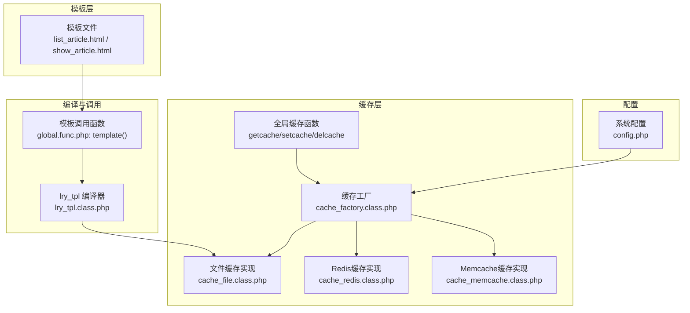
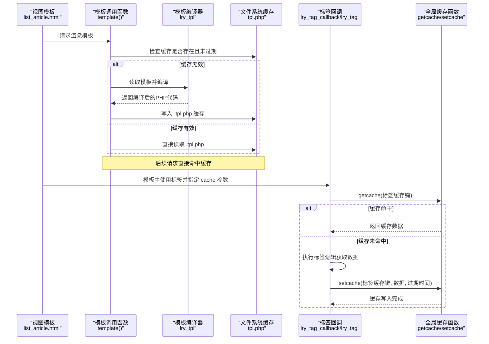
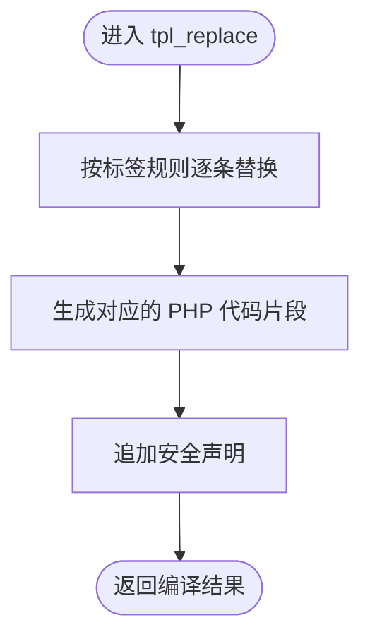
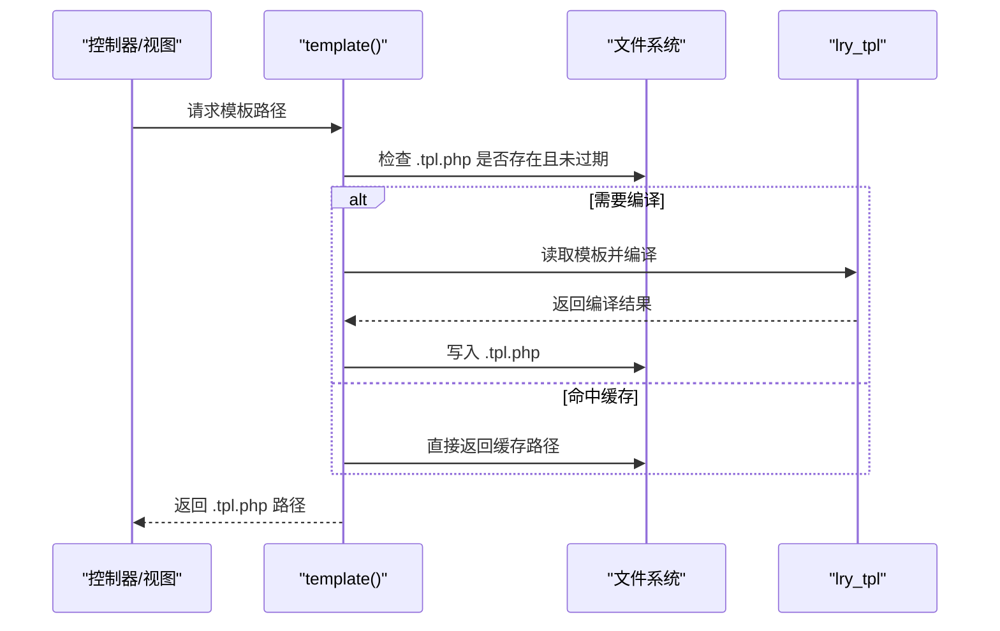
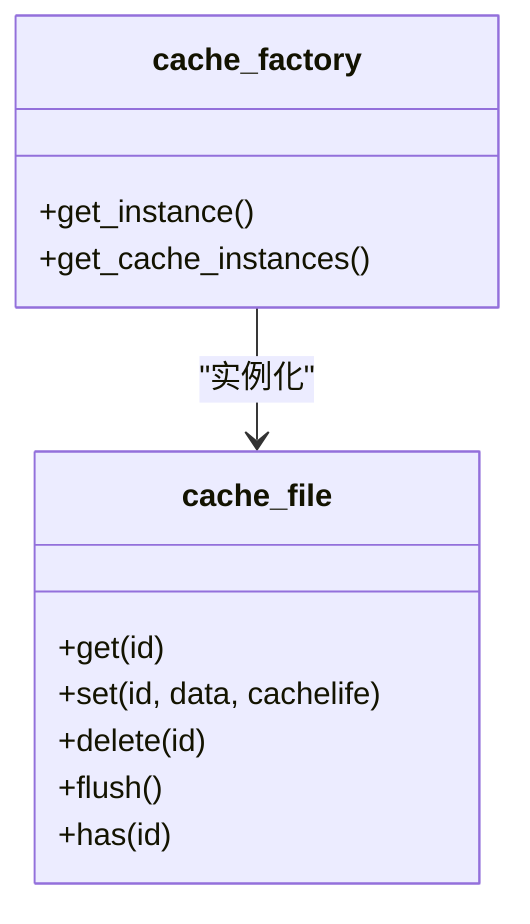
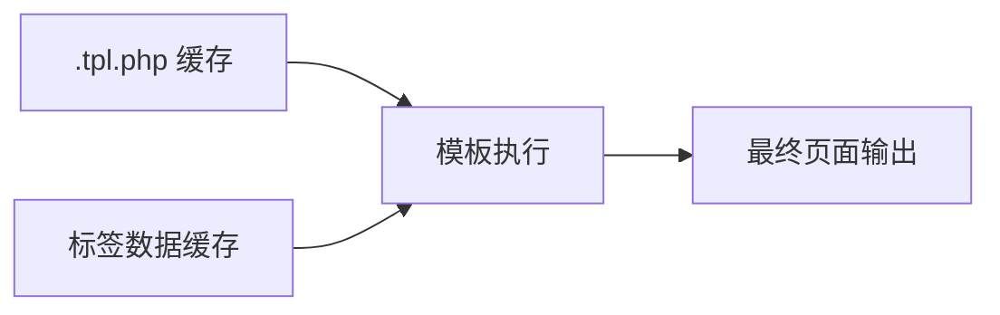
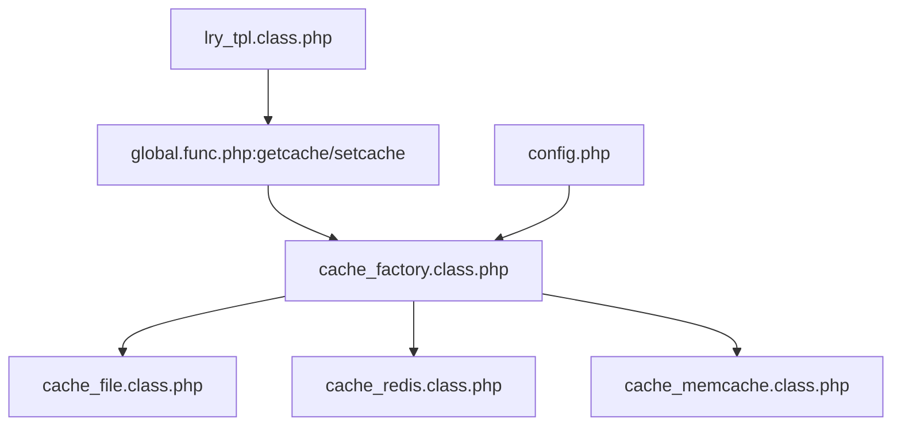

# 模板缓存策略

<cite>
**本文引用的文件**
- [lry_tpl.class.php](file://ryphp/core/class/lry_tpl.class.php)
- [cache_file.class.php](file://ryphp/core/class/cache_file.class.php)
- [cache_factory.class.php](file://ryphp/core/class/cache_factory.class.php)
- [global.func.php](file://ryphp/core/function/global.func.php)
- [config.php](file://common/config/config.php)
- [clear_cache.class.php](file://application/lry_admin_center/controller/clear_cache.class.php)
- [list_article.html](file://application/index/view/rongyao/list_article.html)
- [show_article.html](file://application/index/view/rongyao/show_article.html)
- [cache_redis.class.php](file://ryphp/core/class/cache_redis.class.php)
- [cache_memcache.class.php](file://ryphp/core/class/cache_memcache.class.php)
</cite>

## 目录
1. [简介](#简介)
2. [项目结构](#项目结构)
3. [核心组件](#核心组件)
4. [架构总览](#架构总览)
5. [详细组件分析](#详细组件分析)
6. [依赖关系分析](#依赖关系分析)
7. [性能考量](#性能考量)
8. [故障排查指南](#故障排查指南)
9. [结论](#结论)
10. [附录](#附录)

## 简介
本技术文档围绕模板缓存策略展开，重点解析 lry_tpl.class.php 中模板编译缓存的实现机制，涵盖模板文件的编译过程、缓存文件的生成与读取策略、缓存失效与更新机制、内存管理、模板缓存与标签缓存的区别与联系，以及通过缓存参数控制缓存行为的方法。同时提供缓存性能优化建议、命中率监控与清理策略，并给出实际配置示例与性能测试数据的记录方式。

## 项目结构
本项目的模板系统由以下关键部分组成：
- 模板编译器：负责将模板语法转换为可执行的 PHP 代码，并生成缓存文件
- 模板调用入口：负责定位模板文件、检测缓存有效性并触发编译
- 缓存工厂与多种缓存实现：提供统一的缓存接口，支持文件、Redis、Memcache
- 全局缓存函数：封装 getcache/setcache/delcache，供业务层调用
- 模板与标签使用示例：展示模板中如何使用标签缓存与模板缓存

图表来源
- [lry_tpl.class.php:1-134](file://ryphp/core/class/lry_tpl.class.php#L1-L134)
- [global.func.php:1527-1556](file://ryphp/core/function/global.func.php#L1527-L1556)
- [cache_factory.class.php:1-84](file://ryphp/core/class/cache_factory.class.php#L1-L84)
- [cache_file.class.php:1-130](file://ryphp/core/class/cache_file.class.php#L1-L130)
- [config.php:39-66](file://common/config/config.php#L39-L66)

章节来源
- [lry_tpl.class.php:1-134](file://ryphp/core/class/lry_tpl.class.php#L1-L134)
- [global.func.php:1527-1556](file://ryphp/core/function/global.func.php#L1527-L1556)
- [cache_factory.class.php:1-84](file://ryphp/core/class/cache_factory.class.php#L1-L84)
- [cache_file.class.php:1-130](file://ryphp/core/class/cache_file.class.php#L1-L130)
- [config.php:39-66](file://common/config/config.php#L39-L66)

## 核心组件
- lry_tpl 模板编译器：负责将模板中的自定义标签语法转换为 PHP 代码，支持 include、php、条件、循环、变量输出、标签回调等
- 模板调用函数 template：负责模板文件定位、缓存有效性校验、触发编译与缓存写入
- 缓存工厂 cache_factory：根据配置选择具体缓存实现（文件/Redis/Memcache），并提供懒加载实例
- 文件缓存 cache_file：提供基于文件系统的缓存读写、过期判断、批量清理能力
- 全局缓存函数：getcache/setcache/delcache，封装对缓存工厂的调用
- 配置 config：定义缓存类型与各实现的参数

章节来源
- [lry_tpl.class.php:1-134](file://ryphp/core/class/lry_tpl.class.php#L1-L134)
- [global.func.php:1527-1556](file://ryphp/core/function/global.func.php#L1527-L1556)
- [cache_factory.class.php:1-84](file://ryphp/core/class/cache_factory.class.php#L1-L84)
- [cache_file.class.php:1-130](file://ryphp/core/class/cache_file.class.php#L1-L130)
- [config.php:39-66](file://common/config/config.php#L39-L66)

## 架构总览
模板缓存策略的核心流程如下：
- 模板调用阶段：template 函数根据模板路径与主题计算缓存文件名，若缓存不存在或模板较新则触发编译
- 编译阶段：lry_tpl 将模板语法转换为 PHP 代码，写入 .tpl.php 缓存文件
- 标签缓存阶段：模板中的标签可带 cache 参数，lry_tpl 会在运行时通过 getcache/setcache 控制标签数据缓存
- 缓存读取阶段：模板执行时直接读取已编译的 .tpl.php 或标签缓存

图表来源
- [global.func.php:1527-1556](file://ryphp/core/function/global.func.php#L1527-L1556)
- [lry_tpl.class.php:31-59](file://ryphp/core/class/lry_tpl.class.php#L31-L59)
- [lry_tpl.class.php:62-92](file://ryphp/core/class/lry_tpl.class.php#L62-L92)
- [cache_file.class.php:17-46](file://ryphp/core/class/cache_file.class.php#L17-L46)

章节来源
- [global.func.php:1527-1556](file://ryphp/core/function/global.func.php#L1527-L1556)
- [lry_tpl.class.php:31-92](file://ryphp/core/class/lry_tpl.class.php#L31-L92)
- [cache_file.class.php:17-46](file://ryphp/core/class/cache_file.class.php#L17-L46)

## 详细组件分析

### 组件一：模板编译器 lry_tpl
- 模板语法解析：支持 include、php、if/else/elseif、for、loop、变量输出、属性访问、标签回调等
- 标签回调：解析 m:action 参数，提取参数并生成标签调用代码，支持 cache 参数控制标签缓存
- 输出规范：在编译结果前注入安全声明，确保缓存文件可被安全执行

图表来源
- [lry_tpl.class.php:31-59](file://ryphp/core/class/lry_tpl.class.php#L31-L59)
- [lry_tpl.class.php:57-58](file://ryphp/core/class/lry_tpl.class.php#L57-L58)

章节来源
- [lry_tpl.class.php:1-134](file://ryphp/core/class/lry_tpl.class.php#L1-L134)

### 组件二：模板调用与缓存生成 template
- 路径与主题：根据模块、模板名与主题计算缓存文件名
- 缓存有效性：若缓存文件不存在或模板文件更新时间更晚，则重新编译
- 编译与写入：读取模板内容，交由 lry_tpl 编译，写入 .tpl.php 缓存

图表来源
- [global.func.php:1527-1556](file://ryphp/core/function/global.func.php#L1527-L1556)

章节来源
- [global.func.php:1527-1556](file://ryphp/core/function/global.func.php#L1527-L1556)

### 组件三：缓存工厂与文件缓存
- 工厂选择：根据配置选择 file/redis/memcache 实现
- 文件缓存特性：基于文件系统，支持过期时间、序列化存储、可执行文件两种模式
- 过期策略：读取时比较 expire 与当前时间；0 表示永不过期
- 清理策略：支持按键删除与批量 flush

图表来源
- [cache_factory.class.php:36-82](file://ryphp/core/class/cache_factory.class.php#L36-L82)
- [cache_file.class.php:17-73](file://ryphp/core/class/cache_file.class.php#L17-L73)

章节来源
- [cache_factory.class.php:1-84](file://ryphp/core/class/cache_factory.class.php#L1-L84)
- [cache_file.class.php:1-130](file://ryphp/core/class/cache_file.class.php#L1-L130)

### 组件四：标签缓存与模板缓存的关系
- 模板缓存：针对整个模板编译产物（.tpl.php）的缓存，提升模板解析性能
- 标签缓存：针对模板中标签的动态数据缓存，通过 cache 参数控制
- 关系：两者互补，模板缓存减少编译开销，标签缓存减少数据库/复杂逻辑开销

图表来源
- [lry_tpl.class.php:76-91](file://ryphp/core/class/lry_tpl.class.php#L76-L91)
- [cache_file.class.php:17-29](file://ryphp/core/class/cache_file.class.php#L17-L29)

章节来源
- [lry_tpl.class.php:62-92](file://ryphp/core/class/lry_tpl.class.php#L62-L92)
- [cache_file.class.php:17-29](file://ryphp/core/class/cache_file.class.php#L17-L29)

### 组件五：缓存参数与控制
- 标签缓存参数：cache=秒数，用于控制标签数据缓存时长；当存在 page 参数时，标签缓存逻辑不同（分页场景）
- 模板缓存参数：由模板调用函数决定，通过模板文件与缓存文件的时间戳对比控制是否重建

章节来源
- [lry_tpl.class.php:76-91](file://ryphp/core/class/lry_tpl.class.php#L76-L91)
- [global.func.php:1527-1556](file://ryphp/core/function/global.func.php#L1527-L1556)

## 依赖关系分析
- 模板调用依赖 lry_tpl 编译器
- lry_tpl 通过全局函数 getcache/setcache 访问缓存
- 缓存工厂统一对外暴露缓存接口，屏蔽具体实现差异
- 配置文件决定缓存类型与参数

图表来源
- [lry_tpl.class.php:70-92](file://ryphp/core/class/lry_tpl.class.php#L70-L92)
- [global.func.php:147-151](file://ryphp/core/function/global.func.php#L147-L151)
- [cache_factory.class.php:36-82](file://ryphp/core/class/cache_factory.class.php#L36-L82)
- [config.php:39-66](file://common/config/config.php#L39-L66)

章节来源
- [lry_tpl.class.php:62-92](file://ryphp/core/class/lry_tpl.class.php#L62-L92)
- [global.func.php:147-151](file://ryphp/core/function/global.func.php#L147-L151)
- [cache_factory.class.php:36-82](file://ryphp/core/class/cache_factory.class.php#L36-L82)
- [config.php:39-66](file://common/config/config.php#L39-L66)

## 性能考量
- 模板编译缓存命中率
  - 命中：直接读取 .tpl.php，避免重复编译
  - 未命中：编译后写入缓存，后续请求命中
- 标签缓存命中率
  - 命中：getcache 直接返回缓存数据
  - 未命中：执行标签逻辑并 setcache，下次命中
- 过期策略
  - 永不过期：cache=0
  - 定时过期：cache=N 秒
- 缓存清理
  - 按键删除：delcache(name)
  - 全量清理：delcache('', true)

章节来源
- [cache_file.class.php:17-29](file://ryphp/core/class/cache_file.class.php#L17-L29)
- [global.func.php:1519-1523](file://ryphp/core/function/global.func.php#L1519-L1523)

## 故障排查指南
- 模板无法渲染或报错
  - 检查模板文件是否存在与可读
  - 检查缓存目录权限与可写性
  - 查看模板调用函数的错误提示
- 缓存未生效
  - 确认模板文件是否更新导致缓存失效
  - 检查标签 cache 参数是否正确
  - 使用 delcache 清理后重试
- 管理端清理缓存
  - 使用后台“清空缓存”功能，清理模板与标签缓存

章节来源
- [global.func.php:1527-1556](file://ryphp/core/function/global.func.php#L1527-L1556)
- [clear_cache.class.php:9-24](file://application/lry_admin_center/controller/clear_cache.class.php#L9-L24)

## 结论
模板缓存策略通过“模板编译缓存 + 标签数据缓存”的双层机制，在降低模板解析成本的同时，也降低了动态数据的重复计算成本。结合合理的过期策略与清理手段，可在保证数据新鲜度的前提下获得稳定的性能收益。建议在生产环境中启用文件缓存，并根据业务特点调整标签缓存时长与清理频率。

## 附录

### 配置示例
- 缓存类型与参数
  - cache_type: file/redis/memcache
  - file_config: cache_dir/suffix/mode
  - redis_config: host/port/password/select/timeout/expire/persistent/prefix
  - memcache_config: host/port/timeout/expire/persistent/prefix

章节来源
- [config.php:39-66](file://common/config/config.php#L39-L66)

### 模板使用示例
- 列表页模板中使用标签与分页
  - 展示了标签语法与分页参数的使用方式
- 内容页模板中使用标签与评论列表
  - 展示了标签语法与分页参数的使用方式

章节来源
- [list_article.html:54-73](file://application/index/view/rongyao/list_article.html#L54-L73)
- [show_article.html:202-209](file://application/index/view/rongyao/show_article.html#L202-L209)

### 性能测试数据记录方式
- 建议指标
  - 模板编译耗时（毫秒）
  - 标签缓存命中率（百分比）
  - 缓存清理频次与触发原因
  - 平均响应时间（含/不含缓存）
- 记录位置
  - 可在系统日志或独立的性能监控文件中记录上述指标，便于对比优化前后效果

[本节为通用指导，无需特定文件引用]