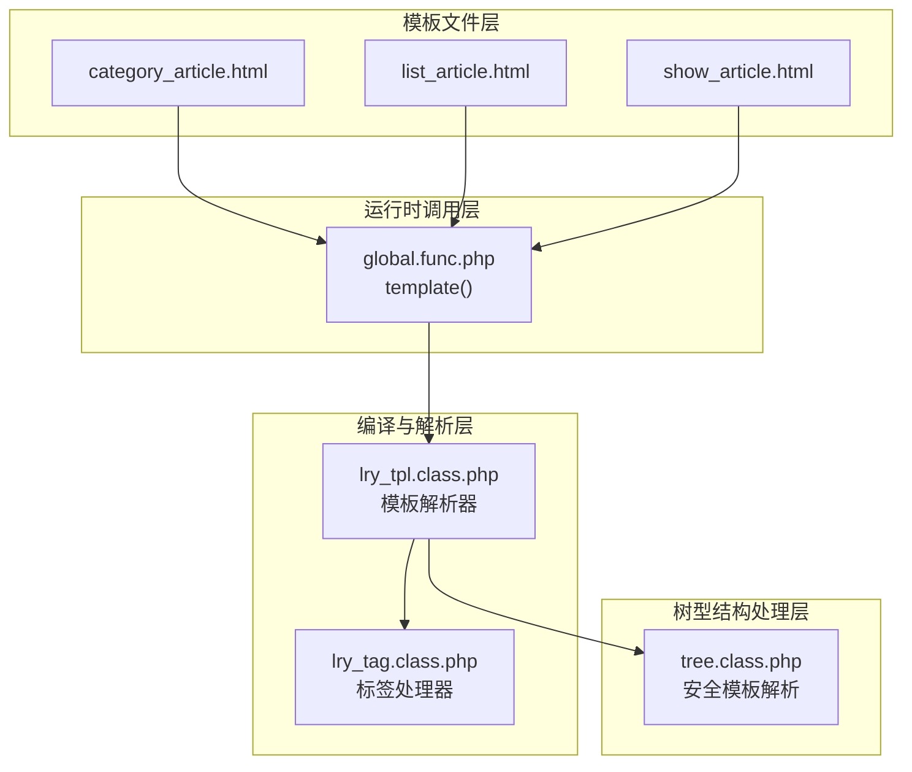
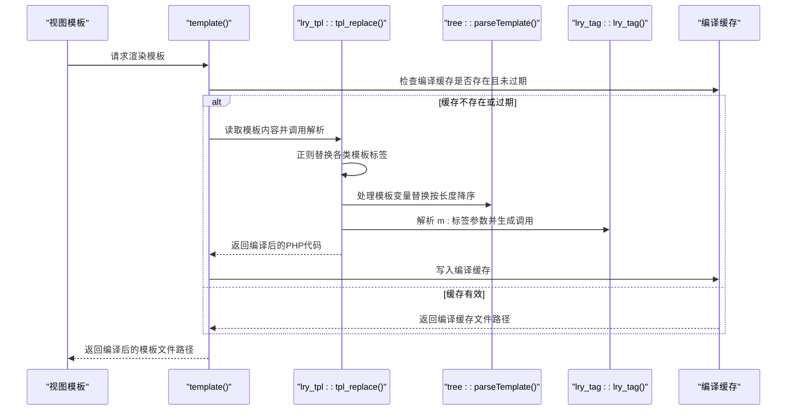
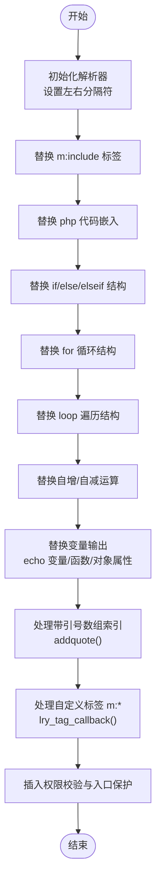
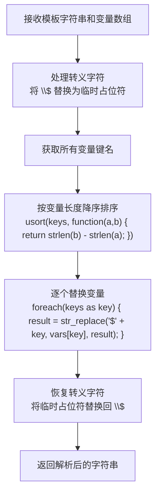
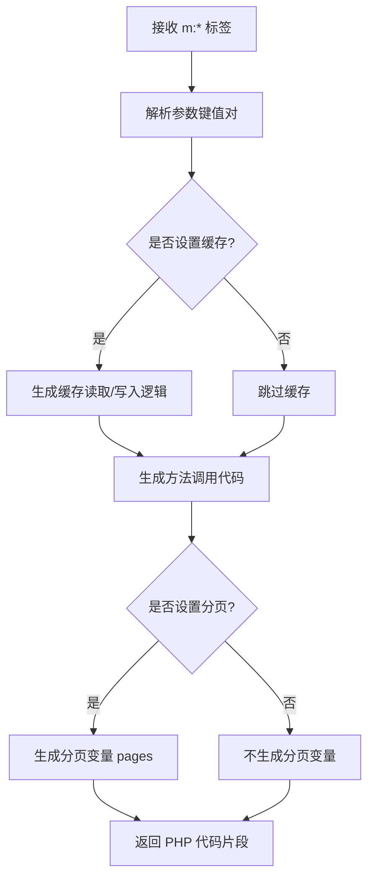
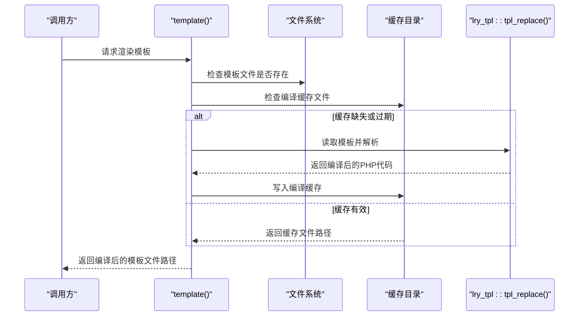
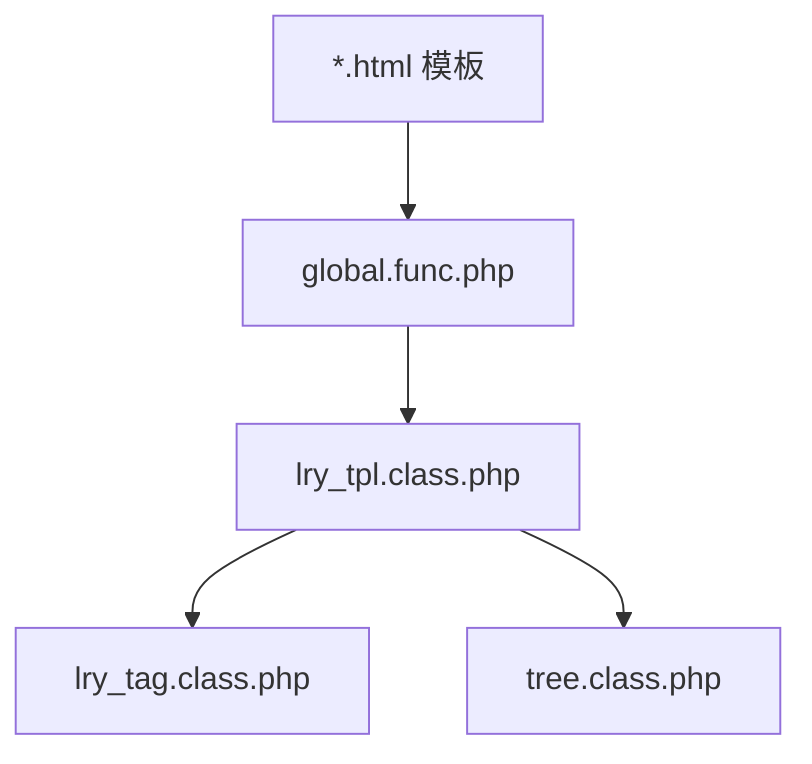

# 模板解析机制

<cite>
**本文档引用的文件**
- [lry_tpl.class.php](file://ryphp/core/class/lry_tpl.class.php)
- [global.func.php](file://ryphp/core/function/global.func.php)
- [lry_tag.class.php](file://ryphp/core/class/lry_tag.class.php)
- [tree.class.php](file://ryphp/core/class/tree.class.php)
- [category_article.html](file://application/index/view/rongyao/category_article.html)
- [list_article.html](file://application/index/view/rongyao/list_article.html)
- [show_article.html](file://application/index/view/rongyao/show_article.html)
- [config.php](file://application/index/view/rongyao/config.php)
- [config.php](file://common/config/config.php)
</cite>

## 更新摘要
**变更内容**
- 新增tree.class.php中parseTemplate方法的变量替换机制优化说明
- 更新模板变量处理性能相关内容
- 增强模板解析器与树型类的集成分析

## 目录
1. [简介](#简介)
2. [项目结构](#项目结构)
3. [核心组件](#核心组件)
4. [架构总览](#架构总览)
5. [详细组件分析](#详细组件分析)
6. [依赖关系分析](#依赖关系分析)
7. [性能考量](#性能考量)
8. [故障排查指南](#故障排查指南)
9. [结论](#结论)
10. [附录](#附录)

## 简介
本文件系统性阐述 lry_tpl 模板解析机制，聚焦 lry_tpl.class.php 中的模板解析核心逻辑，包括模板标签识别与转换流程、各类模板语法的正则匹配与替换策略、左右分隔符配置、编译前安全检查与预处理步骤，并提供语法参考与最佳实践示例，帮助开发者在复杂嵌套条件下正确使用模板。特别关注tree.class.php中变量替换机制的性能优化，通过按变量长度降序处理确保长变量名优先处理，提高解析准确性和性能。

## 项目结构
模板系统由四层组成：
- 模板文件层：位于 application/*/view/*/*.html，存放视图模板
- 编译与解析层：lry_tpl.class.php 提供模板标签解析与PHP代码生成
- 树型结构处理层：tree.class.php 提供安全的模板变量替换机制
- 运行时调用层：global.func.php 的 template() 函数负责模板定位、缓存与编译

**图表来源**
- [lry_tpl.class.php:10-59](file://ryphp/core/class/lry_tpl.class.php#L10-L59)
- [global.func.php:1534-1556](file://ryphp/core/function/global.func.php#L1534-L1556)
- [lry_tag.class.php:10-12](file://ryphp/core/class/lry_tag.class.php#L10-L12)
- [tree.class.php:25-478](file://ryphp/core/class/tree.class.php#L25-L478)

**章节来源**
- [global.func.php:1534-1556](file://ryphp/core/function/global.func.php#L1534-L1556)
- [lry_tpl.class.php:10-59](file://ryphp/core/class/lry_tpl.class.php#L10-L59)
- [tree.class.php:25-478](file://ryphp/core/class/tree.class.php#L25-L478)

## 核心组件
- lry_tpl 模板解析器：负责将模板中的自定义标签转换为 PHP 代码，支持 include、php 代码嵌入、条件判断、循环、loop 遍历、变量输出、自定义标签 m:... 等
- lry_tag 标签处理器：处理 m: 开头的自定义标签，解析参数并生成对应的数据查询与分页逻辑
- tree 树型类：提供安全的模板变量替换机制，通过按变量长度降序处理优化变量解析性能
- global.func.php 的 template()：模板入口，负责定位模板文件、缓存编译产物、返回编译后的 PHP 文件路径

**章节来源**
- [lry_tpl.class.php:10-59](file://ryphp/core/class/lry_tpl.class.php#L10-L59)
- [lry_tag.class.php:10-12](file://ryphp/core/class/lry_tag.class.php#L10-L12)
- [tree.class.php:25-478](file://ryphp/core/class/tree.class.php#L25-L478)
- [global.func.php:1534-1556](file://ryphp/core/function/global.func.php#L1534-L1556)

## 架构总览
模板从读取到渲染的完整流程如下：

**图表来源**
- [global.func.php:1534-1556](file://ryphp/core/function/global.func.php#L1534-L1556)
- [lry_tpl.class.php:31-59](file://ryphp/core/class/lry_tpl.class.php#L31-L59)
- [lry_tag.class.php:70-92](file://ryphp/core/class/lry_tag.class.php#L70-L92)
- [tree.class.php:428-454](file://ryphp/core/class/tree.class.php#L428-L454)

## 详细组件分析

### 模板解析器 lry_tpl
lry_tpl::tpl_replace() 是模板解析的核心，按顺序执行一系列正则替换，将模板标签转换为 PHP 代码。其关键点包括：
- 左右分隔符配置：通过 $template_tag_left 与 $template_tag_right 控制标签边界，默认为大括号 { }
- 安全前置：在解析结果前插入权限校验与入口保护代码
- 标签替换顺序：先处理结构化标签（include/php/if/for/loop），再处理变量输出与自定义标签回调
- 变量引用预处理：通过 addquote() 将带方括号索引的变量引用转换为安全的数组访问形式

**图表来源**
- [lry_tpl.class.php:12-13](file://ryphp/core/class/lry_tpl.class.php#L12-L13)
- [lry_tpl.class.php:31-59](file://ryphp/core/class/lry_tpl.class.php#L31-L59)
- [lry_tpl.class.php:101-104](file://ryphp/core/class/lry_tpl.class.php#L101-L104)

**章节来源**
- [lry_tpl.class.php:12-13](file://ryphp/core/class/lry_tpl.class.php#L12-L13)
- [lry_tpl.class.php:31-59](file://ryphp/core/class/lry_tpl.class.php#L31-L59)
- [lry_tpl.class.php:101-104](file://ryphp/core/class/lry_tpl.class.php#L101-L104)

### 树型类安全模板解析 tree
tree::parseTemplate() 提供了安全的模板变量替换机制，这是对传统 @extract() 和 eval() 的安全替代方案。其核心优化在于按变量长度降序处理，确保长变量名优先处理，提高解析准确性和性能。

**更新** 新增变量替换机制的性能优化：从复杂的数组过滤和排序改为按变量长度降序处理

**图表来源**
- [tree.class.php:428-454](file://ryphp/core/class/tree.class.php#L428-L454)

**章节来源**
- [tree.class.php:428-454](file://ryphp/core/class/tree.class.php#L428-L454)

### 自定义标签解析 lry_tag
lry_tag::lry_tag() 负责解析 m: 标签的参数，生成对应的 PHP 调用与可选的缓存逻辑。其处理流程：
- 参数解析：使用正则提取键值对，构建参数数组
- 缓存控制：支持 cache 参数控制缓存时间；当存在 page 参数时，额外生成分页逻辑
- 方法调用：动态调用 lry_tag 类中对应的方法，生成数据变量与分页变量

**图表来源**
- [lry_tpl.class.php:62-92](file://ryphp/core/class/lry_tpl.class.php#L62-L92)
- [lry_tag.class.php:18-65](file://ryphp/core/class/lry_tag.class.php#L18-L65)

**章节来源**
- [lry_tpl.class.php:62-92](file://ryphp/core/class/lry_tpl.class.php#L62-L92)
- [lry_tag.class.php:18-65](file://ryphp/core/class/lry_tag.class.php#L18-L65)

### 模板编译与缓存 global.func.php::template()
template() 函数负责模板的定位、缓存与编译：
- 模板定位：根据模块、模板名与主题目录拼装模板路径
- 缓存策略：若编译缓存不存在或模板文件更新时间更晚，则重新编译
- 编译触发：加载 lry_tpl 并调用 tpl_replace() 生成编译文件

**图表来源**
- [global.func.php:1534-1556](file://ryphp/core/function/global.func.php#L1534-L1556)

**章节来源**
- [global.func.php:1534-1556](file://ryphp/core/function/global.func.php#L1534-L1556)

### 模板语法与正则规则
以下为 lry_tpl 中使用的典型正则与替换规则（以注释形式呈现）：
- m:include 包含标签：将 {m:include "模块","模板"} 替换为 PHP include 调用
- php 代码嵌入：将 {php ...} 替换为 PHP 执行块
- if/else/elseif：将 {if ...}、{else}、{elseif ...}、{if ...} 结束标签替换为 PHP 条件结构
- for 循环：将 {for ...} 与 {/for} 替换为 PHP for 循环结构
- loop 遍历：将 {loop $array $v} 或 {loop $array $k=>$v} 替换为 PHP foreach 结构
- 变量输出：将 {$var}、{func()}、{$obj->prop} 等替换为 PHP echo 输出
- 自增/自减：将 {++$a}、{--$a}、{$a++}、{$a--} 替换为 PHP 运算语句
- 自定义标签 m:*：通过回调解析参数并生成 PHP 调用

**章节来源**
- [lry_tpl.class.php:32-55](file://ryphp/core/class/lry_tpl.class.php#L32-L55)

### 左右分隔符配置
- 默认分隔符：模板标签使用大括号 { } 作为左右分隔符
- 配置位置：在 lry_tpl 类中通过 $template_tag_left 与 $template_tag_right 属性定义
- 使用建议：如需自定义分隔符，可在实例化后调整该属性，但需确保模板中标签与之匹配

**章节来源**
- [lry_tpl.class.php:12-13](file://ryphp/core/class/lry_tpl.class.php#L12-L13)

### 编译前安全检查与预处理
- 权限校验：在解析结果前插入入口保护代码，确保模板仅能被授权访问
- 变量引用预处理：通过 addquote() 将带方括号索引的变量引用转换为安全的数组访问形式
- 自定义标签参数预处理：lry_tag::arr_to_html() 将参数数组转换为 PHP 可执行的数组字面量，对敏感字段进行转义处理
- 安全模板解析：tree::parseTemplate() 完全替代不安全的 @extract() 和 eval()，提供动态变量处理能力

**章节来源**
- [lry_tpl.class.php:57-58](file://ryphp/core/class/lry_tpl.class.php#L57-L58)
- [lry_tpl.class.php:101-104](file://ryphp/core/class/lry_tpl.class.php#L101-L104)
- [lry_tpl.class.php:111-132](file://ryphp/core/class/lry_tpl.class.php#L111-L132)
- [tree.class.php:428-454](file://ryphp/core/class/tree.class.php#L428-L454)

### 实际使用示例与最佳实践
- 嵌套条件与循环：模板中常见 {if ...} 与 {loop ...} 的组合，注意配对与缩进，避免遗漏 {/if} 或 {/loop}
- 变量引用：支持 {$var}、{func()}、{$obj->prop} 等多种形式，复杂对象属性建议显式括号包裹
- 自定义标签：使用 {m:lists ...}、{m:tag ...} 等标签时，合理设置 cache 与 page 参数以提升性能
- 路径与常量：模板中可直接使用 {SITE_URL}、{C('site_theme')} 等常量与函数调用
- 变量替换优化：利用 tree::parseTemplate() 的按长度降序处理机制，确保长变量名优先处理，提高解析准确性

**章节来源**
- [category_article.html:21-46](file://application/index/view/rongyao/category_article.html#L21-L46)
- [list_article.html:34-45](file://application/index/view/rongyao/list_article.html#L34-L45)
- [show_article.html:79-88](file://application/index/view/rongyao/show_article.html#L79-L88)
- [tree.class.php:428-454](file://ryphp/core/class/tree.class.php#L428-L454)

## 依赖关系分析
- lry_tpl 依赖于全局函数与常量（如 SITE_URL、C() 等），这些在模板中以函数或常量形式出现
- lry_tpl 通过回调调用 lry_tag::lry_tag() 生成自定义标签的 PHP 代码
- tree 类提供独立的模板解析能力，可被其他组件安全使用
- template() 作为入口，串联文件系统、缓存与解析器

**图表来源**
- [global.func.php:1534-1556](file://ryphp/core/function/global.func.php#L1534-L1556)
- [lry_tpl.class.php:54-55](file://ryphp/core/class/lry_tpl.class.php#L54-L55)
- [lry_tag.class.php:82-86](file://ryphp/core/class/lry_tag.class.php#L82-L86)
- [tree.class.php:428-454](file://ryphp/core/class/tree.class.php#L428-L454)

**章节来源**
- [global.func.php:1534-1556](file://ryphp/core/function/global.func.php#L1534-L1556)
- [lry_tpl.class.php:54-55](file://ryphp/core/class/lry_tpl.class.php#L54-L55)
- [lry_tag.class.php:82-86](file://ryphp/core/class/lry_tag.class.php#L82-L86)
- [tree.class.php:428-454](file://ryphp/core/class/tree.class.php#L428-L454)

## 性能考量
- 编译缓存：template() 通过比较模板与缓存文件的时间戳决定是否重新编译，减少重复解析开销
- 自定义标签缓存：lry_tag::lry_tag() 支持 cache 参数，将查询结果缓存指定时间，降低数据库压力
- 变量替换优化：tree::parseTemplate() 采用按变量长度降序处理，确保长变量名优先处理，提高解析准确性和性能
- 循环与条件：合理使用 {loop} 与 {if}，避免深层嵌套导致的可读性与维护性下降
- 变量输出：尽量使用简洁的变量引用，避免在模板中进行复杂计算

**更新** 新增tree类变量替换机制的性能优化说明

**章节来源**
- [tree.class.php:428-454](file://ryphp/core/class/tree.class.php#L428-L454)

## 故障排查指南
- 模板不存在：template() 在找不到模板文件时会抛出错误消息，检查模板路径与主题配置
- 编译缓存异常：删除 cache 目录下的编译文件，强制重新编译
- 自定义标签参数错误：检查 m:* 标签的参数键值对是否正确，必要时在 lry_tag::lry_tag() 中增加参数校验
- 变量引用报错：确认变量已在控制器或上下文中赋值，或检查 addquote() 转义是否正确
- 变量替换冲突：tree::parseTemplate() 通过按长度降序处理避免短变量名覆盖长变量名的问题

**章节来源**
- [global.func.php:1541-1544](file://ryphp/core/function/global.func.php#L1541-L1544)
- [lry_tpl.class.php:101-104](file://ryphp/core/class/lry_tpl.class.php#L101-L104)
- [tree.class.php:428-454](file://ryphp/core/class/tree.class.php#L428-L454)

## 结论
lry_tpl 模板解析机制通过明确的正则替换与回调处理，将模板标签转换为可执行的 PHP 代码，并结合编译缓存与自定义标签缓存策略，在保证灵活性的同时兼顾性能与安全性。tree::parseTemplate() 提供的安全模板解析机制进一步增强了系统的安全性，通过按变量长度降序处理优化变量替换性能。遵循本文提供的语法参考与最佳实践，可在复杂嵌套场景中稳定地构建高质量的视图模板。

## 附录

### 模板语法参考
- 包含标签：{m:include "模块","模板"}
- PHP 代码嵌入：{php ...}
- 条件判断：{if ...}、{else}、{elseif ...}、{if ...} 结束标签
- for 循环：{for ...}、{for ...} 结束标签
- loop 遍历：{loop $array $v} 或 {loop $array $k=>$v}、{loop ...} 结束标签
- 变量输出：{$var}、{func()}、{$obj->prop}
- 自增/自减：{++$a}、{--$a}、{$a++}、{$a--}
- 自定义标签：{m:action 参数...}

**章节来源**
- [lry_tpl.class.php:32-55](file://ryphp/core/class/lry_tpl.class.php#L32-L55)

### 主题与配置
- 主题配置：应用主题通过配置文件指定，模板路径基于主题目录拼装
- 系统配置：站点主题、URL 后缀、缓存类型等通过系统配置文件统一管理

**章节来源**
- [config.php:1-29](file://application/index/view/rongyao/config.php#L1-L29)
- [config.php:9-11](file://common/config/config.php#L9-L11)

### 变量替换机制优化详情
**更新** 新增tree类变量替换机制的技术细节

tree::parseTemplate() 方法实现了以下优化：
- **转义处理**：先处理转义字符，防止变量名中的美元符号被错误替换
- **长度排序**：使用 usort 对变量键名按长度降序排序，确保长变量名优先处理
- **逐个替换**：遍历排序后的变量键名，逐个进行字符串替换
- **安全恢复**：最后恢复转义字符，确保输出的正确性

这种设计避免了短变量名可能覆盖长变量名的问题，提高了模板解析的准确性和可靠性。

**章节来源**
- [tree.class.php:428-454](file://ryphp/core/class/tree.class.php#L428-L454)