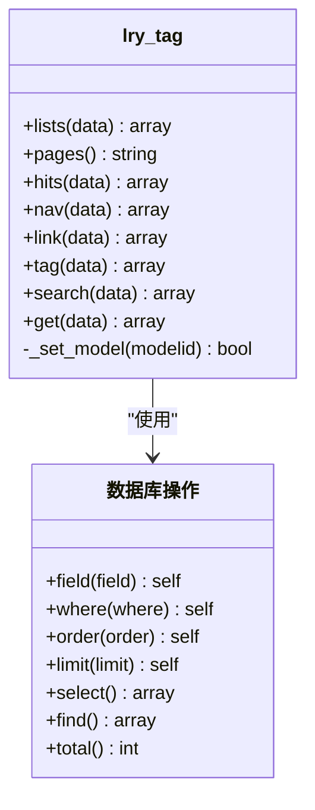
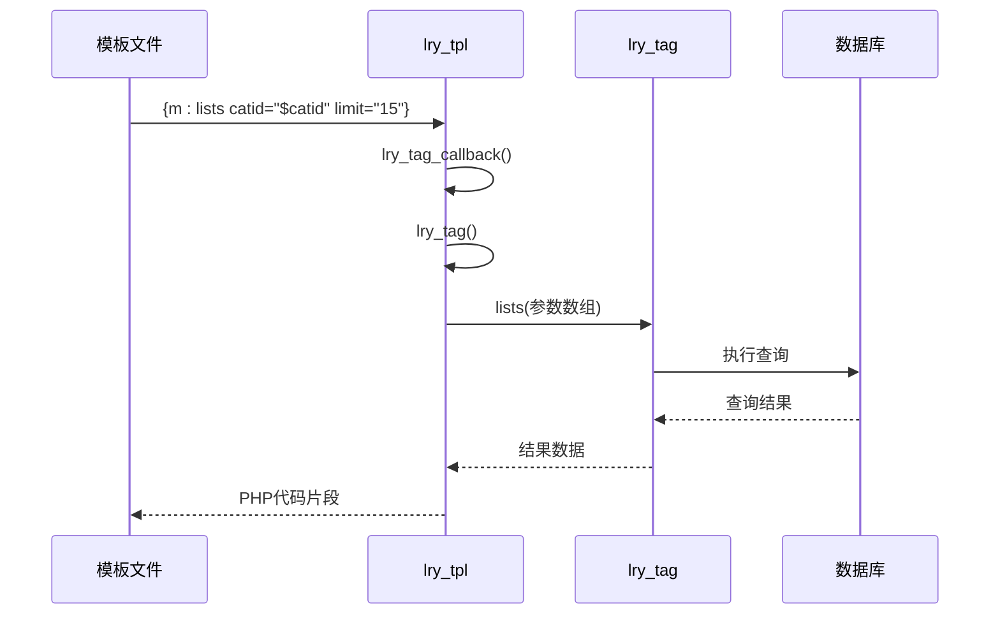
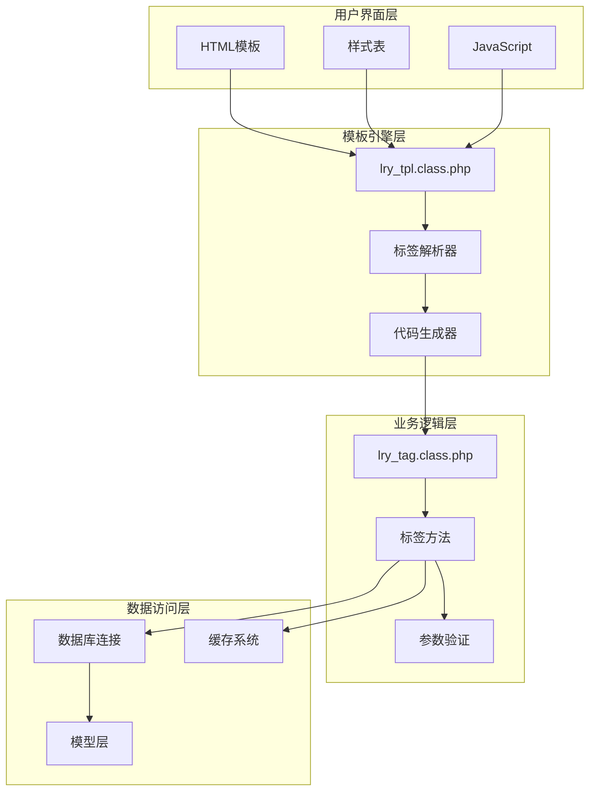
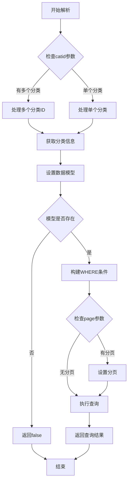
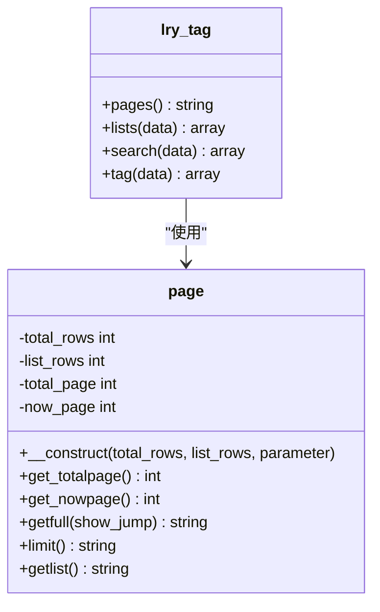
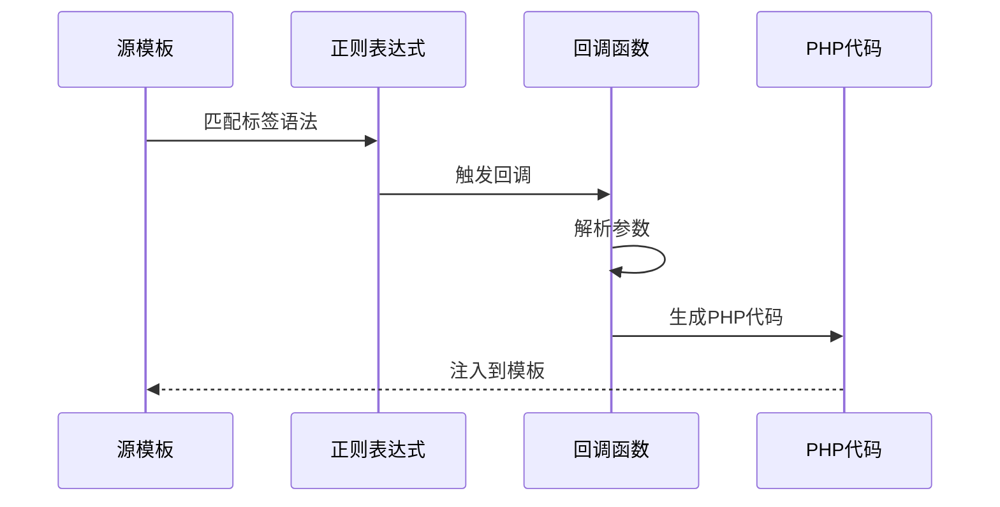
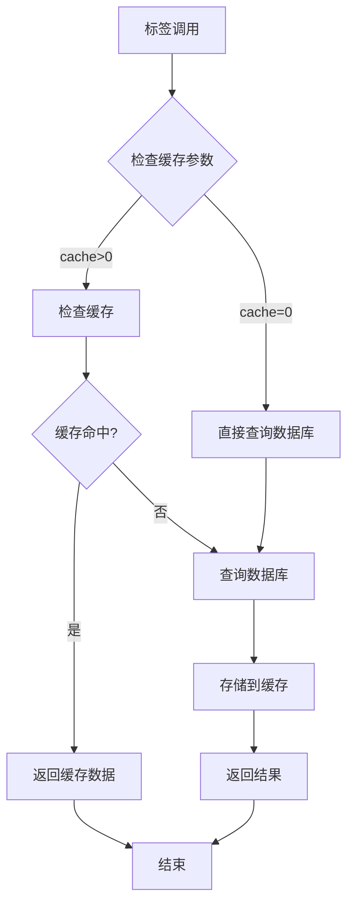
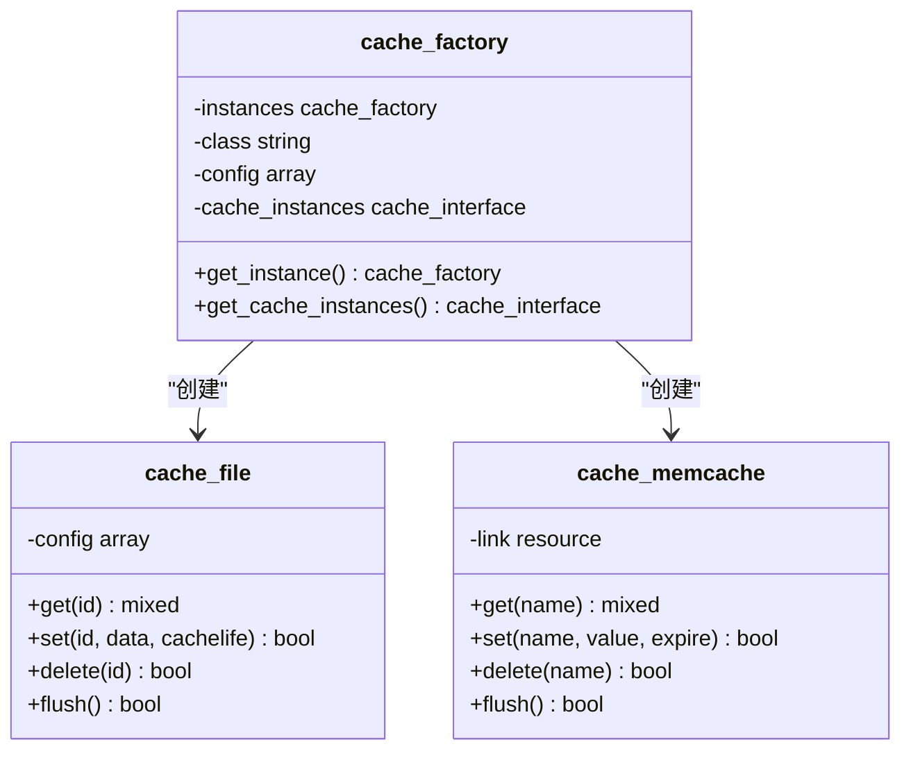
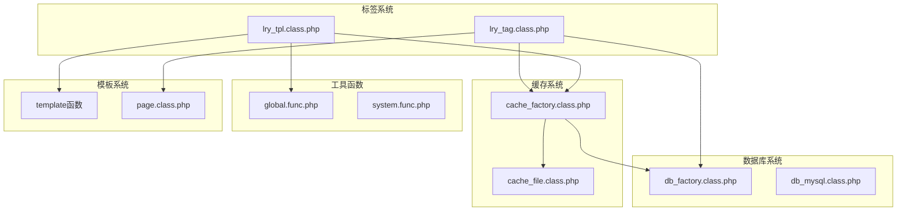

# 自定义标签系统

<cite>
**本文档引用的文件**
- [lry_tag.class.php](file://ryphp/core/class/lry_tag.class.php)
- [lry_tpl.class.php](file://ryphp/core/class/lry_tpl.class.php)
- [cache_file.class.php](file://ryphp/core/class/cache_file.class.php)
- [cache_factory.class.php](file://ryphp/core/class/cache_factory.class.php)
- [page.class.php](file://ryphp/core/class/page.class.php)
- [global.func.php](file://ryphp/core/function/global.func.php)
- [system.func.php](file://common/function/system.func.php)
- [list_article.html](file://application/index/view/rongyao/list_article.html)
- [category_article.html](file://application/index/view/rongyao/category_article.html)
</cite>

## 目录
1. [简介](#简介)
2. [项目结构](#项目结构)
3. [核心组件](#核心组件)
4. [架构概览](#架构概览)
5. [详细组件分析](#详细组件分析)
6. [依赖关系分析](#依赖关系分析)
7. [性能考虑](#性能考虑)
8. [故障排除指南](#故障排除指南)
9. [结论](#结论)
10. [附录](#附录)

## 简介

自定义标签系统是LRYCMS框架的核心功能之一，它提供了一套强大的模板标签机制，允许开发者在模板中动态插入各种数据内容。该系统通过标签解析器将模板中的自定义标签转换为可执行的PHP代码，实现了模板与数据的灵活分离。

系统主要包含两个核心组件：
- **标签处理器** (`lry_tag.class.php`): 负责处理各种类型的标签请求，包括内容列表、分页、搜索等功能
- **模板解析器** (`lry_tpl.class.php`): 负责将模板中的标签语法转换为PHP代码，并支持缓存机制

## 项目结构

自定义标签系统位于框架的核心目录中，采用清晰的分层架构：

```mermaid
graph TB
subgraph "模板层"
TPL[模板文件<br/>*.html]
TAGS[标签语法<br/>{m:tag 参数}]
end
subgraph "解析层"
LRY_TPL[lry_tpl.class.php<br/>模板解析器]
TAG_CALLBACK[标签回调<br/>lry_tag_callback]
TAG_PARSER[标签解析<br/>lry_tag]
end
subgraph "处理层"
LRY_TAG[lry_tag.class.php<br/>标签处理器]
TAG_METHODS[标签方法<br/>lists/hits/tag等]
end
subgraph "数据层"
DB[(数据库)]
CACHE[缓存系统]
end
TPL --> LRY_TPL
TAGS --> TAG_CALLBACK
TAG_CALLBACK --> TAG_PARSER
TAG_PARSER --> LRY_TAG
LRY_TAG --> TAG_METHODS
TAG_METHODS --> DB
TAG_METHODS --> CACHE
```

**图表来源**
- [lry_tpl.class.php:31-59](file://ryphp/core/class/lry_tpl.class.php#L31-L59)
- [lry_tag.class.php:10-492](file://ryphp/core/class/lry_tag.class.php#L10-L492)

**章节来源**
- [lry_tpl.class.php:10-134](file://ryphp/core/class/lry_tpl.class.php#L10-L134)
- [lry_tag.class.php:10-492](file://ryphp/core/class/lry_tag.class.php#L10-L492)

## 核心组件

### 标签处理器 (lry_tag.class.php)

标签处理器是系统的核心，提供了丰富的标签功能：

#### 主要功能模块

1. **内容列表标签** (`lists`): 支持多种筛选条件和排序方式
2. **分页标签** (`pages`): 生成分页导航
3. **热门内容标签** (`hits`): 基于点击量的排行
4. **导航标签** (`nav`): 栏目导航生成
5. **搜索标签** (`search`): 多模式搜索支持
6. **自定义SQL标签** (`get`): 直接执行SQL查询

#### 标签方法概览



**图表来源**
- [lry_tag.class.php:18-492](file://ryphp/core/class/lry_tag.class.php#L18-L492)

**章节来源**
- [lry_tag.class.php:18-492](file://ryphp/core/class/lry_tag.class.php#L18-L492)

### 模板解析器 (lry_tpl.class.php)

模板解析器负责将模板中的标签语法转换为可执行的PHP代码：

#### 核心解析流程

1. **标签识别**: 使用正则表达式匹配 `{m:tag 参数}` 语法
2. **参数解析**: 解析标签参数并转换为PHP数组
3. **缓存处理**: 实现标签结果的缓存机制
4. **分页支持**: 自动处理分页标签的生成

#### 解析方法



**图表来源**
- [lry_tpl.class.php:62-92](file://ryphp/core/class/lry_tpl.class.php#L62-L92)

**章节来源**
- [lry_tpl.class.php:31-92](file://ryphp/core/class/lry_tpl.class.php#L31-L92)

## 架构概览

自定义标签系统采用分层架构设计，确保了良好的可扩展性和维护性：



**图表来源**
- [lry_tpl.class.php:10-134](file://ryphp/core/class/lry_tpl.class.php#L10-L134)
- [lry_tag.class.php:10-492](file://ryphp/core/class/lry_tag.class.php#L10-L492)

## 详细组件分析

### 标签处理器深度分析

#### 内容列表标签 (lists)

内容列表标签是最常用的标签，支持复杂的筛选和排序功能：



**图表来源**
- [lry_tag.class.php:18-65](file://ryphp/core/class/lry_tag.class.php#L18-L65)

##### 参数处理机制

标签处理器支持多种参数类型：

| 参数类型 | 用途 | 示例 |
|---------|------|------|
| `catid` | 分类ID筛选 | `catid="$catid"` |
| `modelid` | 模型ID筛选 | `modelid="1"` |
| `field` | 字段选择 | `field="title,url"` |
| `limit` | 结果数量 | `limit="15"` |
| `order` | 排序规则 | `order="RAND()"` |
| `page` | 分页支持 | `page="page"` |
| `thumb` | 缩略图筛选 | `thumb="1"` |

**章节来源**
- [lry_tag.class.php:18-65](file://ryphp/core/class/lry_tag.class.php#L18-L65)

#### 分页功能实现

分页功能通过专门的分页类实现，支持多种分页样式：



**图表来源**
- [page.class.php:14-202](file://ryphp/core/class/page.class.php#L14-L202)
- [lry_tag.class.php:73-77](file://ryphp/core/class/lry_tag.class.php#L73-L77)

**章节来源**
- [page.class.php:14-202](file://ryphp/core/class/page.class.php#L14-L202)
- [lry_tag.class.php:73-77](file://ryphp/core/class/lry_tag.class.php#L73-L77)

### 模板解析器深度分析

#### 标签解析流程

模板解析器采用正则表达式驱动的方式处理各种标签语法：



**图表来源**
- [lry_tpl.class.php:31-59](file://ryphp/core/class/lry_tpl.class.php#L31-L59)

##### 标签语法支持

| 标签语法 | 功能描述 | 示例 |
|---------|----------|------|
| `{m:lists}` | 内容列表标签 | `{m:lists catid="$catid" limit="15"}` |
| `{m:tag}` | 标签列表标签 | `{m:tag field="id,tag,total" limit="20"}` |
| `{m:hits}` | 热门内容标签 | `{m:hits modelid="$modelid" limit="4"}` |
| `{m:nav}` | 导航标签 | `{m:nav siteid="1" limit="20"}` |
| `{m:search}` | 搜索标签 | `{m:search keyword="$keyword" limit="10"}` |

**章节来源**
- [lry_tpl.class.php:31-59](file://ryphp/core/class/lry_tpl.class.php#L31-L59)

#### 缓存机制实现

缓存机制是标签系统性能优化的关键：



**图表来源**
- [lry_tpl.class.php:76-91](file://ryphp/core/class/lry_tpl.class.php#L76-L91)

**章节来源**
- [lry_tpl.class.php:62-92](file://ryphp/core/class/lry_tpl.class.php#L62-L92)

### 缓存系统分析

#### 缓存工厂模式

缓存系统采用工厂模式，支持多种缓存后端：



**图表来源**
- [cache_factory.class.php:36-82](file://ryphp/core/class/cache_factory.class.php#L36-L82)
- [cache_file.class.php:2-130](file://ryphp/core/class/cache_file.class.php#L2-L130)

**章节来源**
- [cache_factory.class.php:36-82](file://ryphp/core/class/cache_factory.class.php#L36-L82)
- [cache_file.class.php:17-46](file://ryphp/core/class/cache_file.class.php#L17-L46)

#### 缓存配置

缓存系统支持多种配置选项：

| 配置项 | 类型 | 默认值 | 描述 |
|-------|------|--------|------|
| `cache_type` | string | 'file' | 缓存类型 (file/redis/memcache) |
| `cache_dir` | string | cache/cache_file/ | 缓存文件目录 |
| `suffix` | string | '.cache.php' | 缓存文件后缀 |
| `mode` | int | 1 | 缓存文件模式 |
| `host` | string | '127.0.0.1' | Redis/Memcache主机 |
| `port` | int | 11211 | Redis/Memcache端口 |
| `expire` | int | 0 | 默认过期时间 |

**章节来源**
- [cache_file.class.php:6-14](file://ryphp/core/class/cache_file.class.php#L6-L14)
- [cache_factory.class.php:39-59](file://ryphp/core/class/cache_factory.class.php#L39-L59)

## 依赖关系分析

自定义标签系统与其他组件的依赖关系：



**图表来源**
- [lry_tag.class.php:484-490](file://ryphp/core/class/lry_tag.class.php#L484-L490)
- [lry_tpl.class.php:62-92](file://ryphp/core/class/lry_tpl.class.php#L62-L92)

**章节来源**
- [lry_tag.class.php:484-490](file://ryphp/core/class/lry_tag.class.php#L484-L490)
- [lry_tpl.class.php:62-92](file://ryphp/core/class/lry_tpl.class.php#L62-L92)

## 性能考虑

### 缓存策略

1. **标签级别缓存**: 通过 `cache` 参数控制缓存时间
2. **数据库查询缓存**: 自动缓存查询结果
3. **模板编译缓存**: 编译后的模板文件缓存

### 性能优化建议

1. **合理设置缓存时间**: 根据数据更新频率设置合适的缓存时间
2. **使用索引**: 在常用查询字段上建立数据库索引
3. **限制查询范围**: 使用适当的筛选条件减少查询数据量
4. **分页优化**: 对大数据集使用分页避免一次性加载

### 内存管理

- 缓存数据采用序列化存储，支持大对象缓存
- 提供缓存清理接口，防止内存泄漏
- 支持缓存过期自动清理

## 故障排除指南

### 常见问题及解决方案

#### 标签无法解析

**问题**: 模板中的标签没有正确解析

**原因分析**:
1. 标签语法错误
2. 参数格式不正确
3. 缓存文件权限问题

**解决方法**:
1. 检查标签语法是否符合 `{m:tag 参数}` 格式
2. 验证参数值是否正确
3. 检查缓存目录权限

#### 数据查询异常

**问题**: 标签返回空数据或错误数据

**排查步骤**:
1. 检查数据库连接状态
2. 验证查询条件是否正确
3. 确认数据模型配置

#### 缓存失效

**问题**: 缓存数据过期但未更新

**解决方法**:
1. 检查缓存配置
2. 手动清理缓存
3. 调整缓存过期时间

**章节来源**
- [cache_file.class.php:17-29](file://ryphp/core/class/cache_file.class.php#L17-L29)
- [global.func.php:147-151](file://ryphp/core/function/global.func.php#L147-L151)

## 结论

自定义标签系统通过精心设计的架构和完善的缓存机制，为LRYCMS框架提供了强大而灵活的模板标签功能。系统的主要优势包括：

1. **模块化设计**: 清晰的职责分离，便于维护和扩展
2. **高性能缓存**: 多层次缓存策略，显著提升系统性能
3. **灵活的标签语法**: 支持复杂的参数配置和条件筛选
4. **完善的错误处理**: 提供详细的错误信息和调试支持

该系统为开发者提供了丰富的标签功能，同时保持了良好的性能表现，是构建高效内容管理系统的重要基础设施。

## 附录

### 标签使用示例

#### 基本列表标签
```html
{m:lists catid="$catid" limit="15" page="page"}
{loop $data $v}
    <h3><a href="{$v[url]}">{$v[title]}</a></h3>
{/loop}
{$pages}
```

#### 热门内容标签
```html
{m:hits modelid="$modelid" limit="4"}
{loop $data $v}
    <li><a href="{$v[url]}">{$v[title]}</a></li>
{/loop}
```

#### 标签云标签
```html
{m:tag field="id,tag,total" limit="20"}
{loop $data $v}
    <a href="{U('search/index/tag',array('id'=>$v['id']))}">
        {$v[tag]}
    </a>
{/loop}
```

### 开发最佳实践

1. **参数验证**: 始终验证标签参数的有效性
2. **缓存策略**: 合理设置缓存时间，平衡性能和实时性
3. **错误处理**: 实现完善的错误处理和日志记录
4. **性能监控**: 定期监控标签执行时间和数据库查询性能