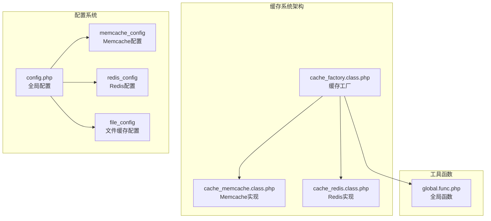
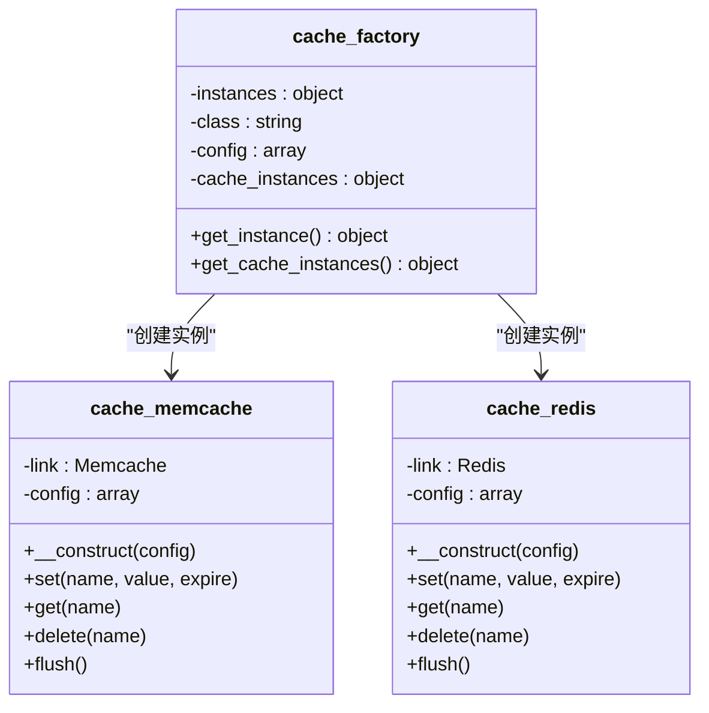
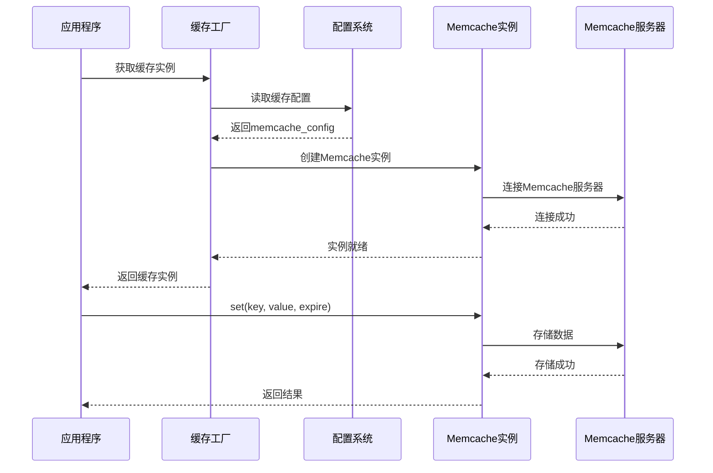
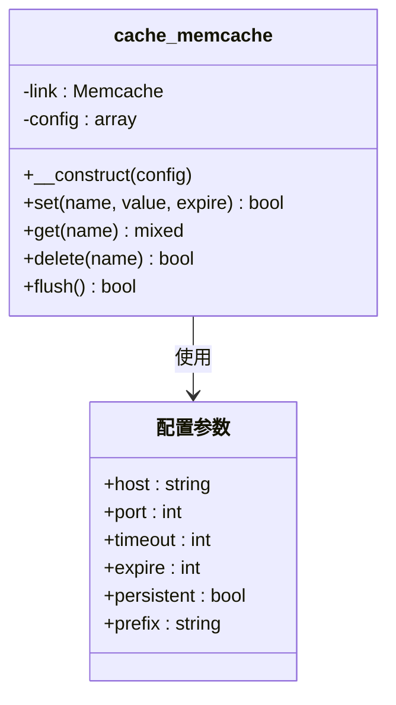
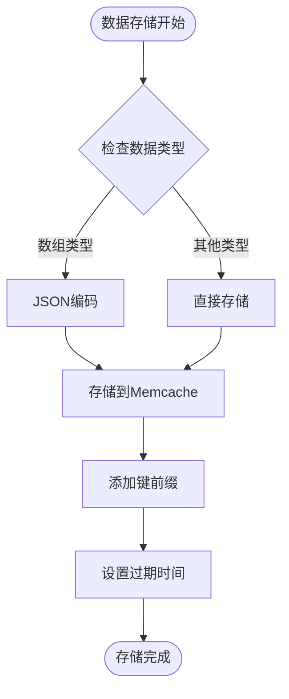
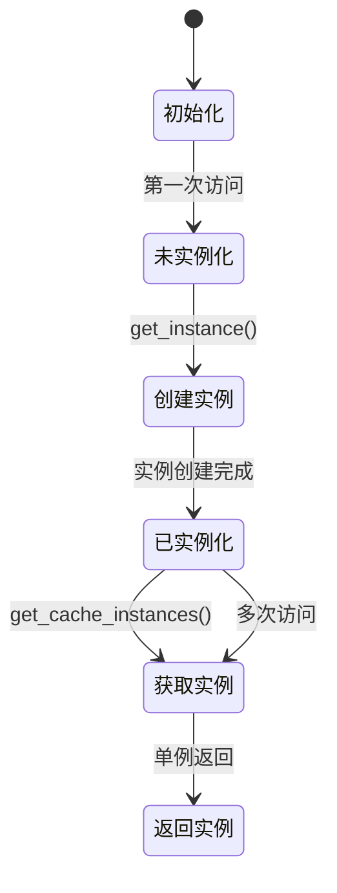
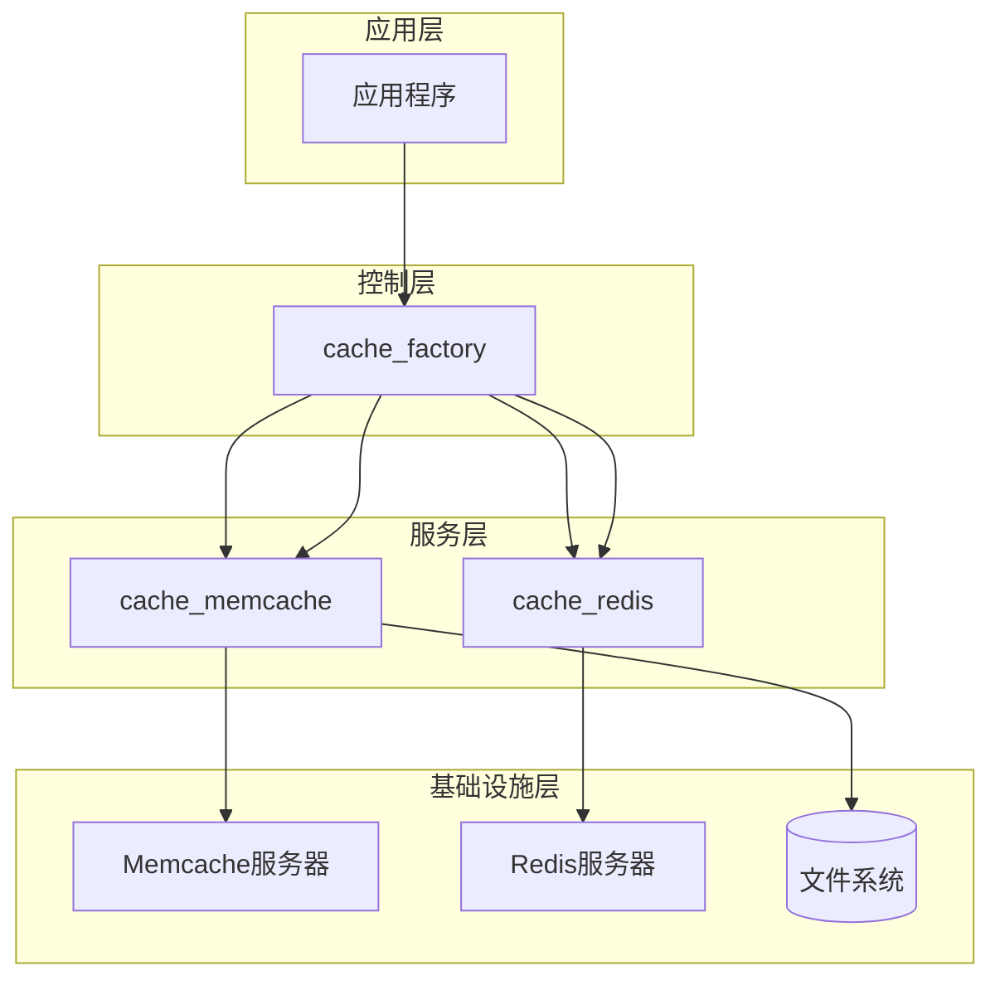
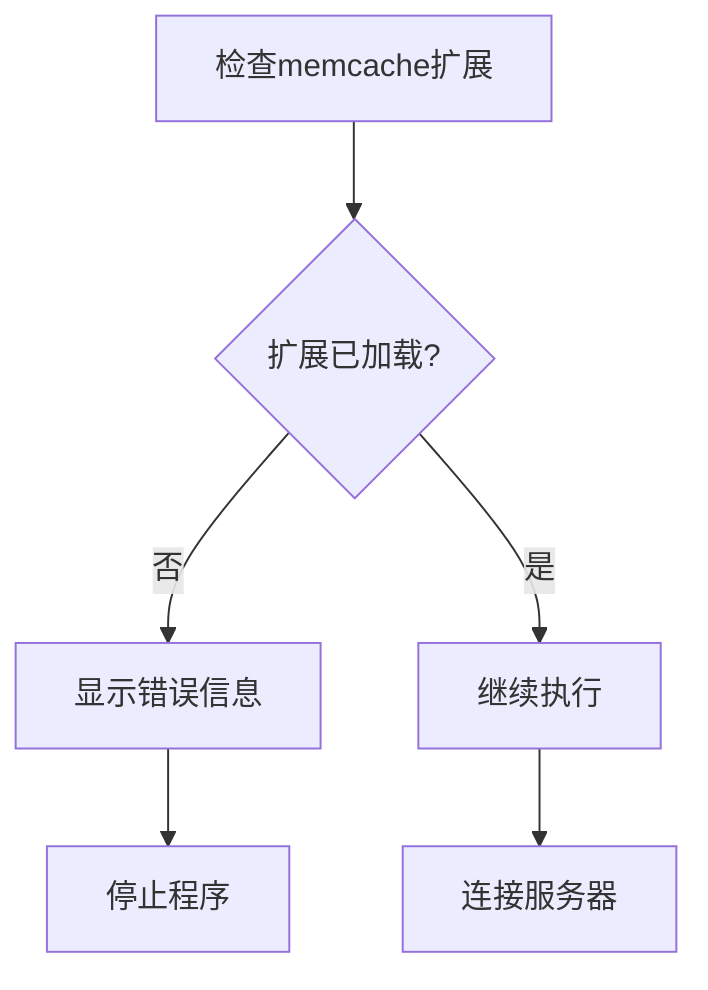

# Memcache缓存支持

<cite>
**本文档引用的文件**
- [cache_memcache.class.php](file://ryphp/core/class/cache_memcache.class.php)
- [cache_factory.class.php](file://ryphp/core/class/cache_factory.class.php)
- [config.php](file://common/config/config.php)
- [cache_redis.class.php](file://ryphp/core/class/cache_redis.class.php)
- [cache_file.class.php](file://ryphp/core/class/cache_file.class.php)
- [global.func.php](file://ryphp/core/function/global.func.php)
</cite>

## 目录
1. [简介](#简介)
2. [项目结构](#项目结构)
3. [核心组件](#核心组件)
4. [架构概览](#架构概览)
5. [详细组件分析](#详细组件分析)
6. [依赖关系分析](#依赖关系分析)
7. [性能考虑](#性能考虑)
8. [故障排除指南](#故障排除指南)
9. [结论](#结论)
10. [附录](#附录)

## 简介
本文档详细介绍了基于RyPHP框架的Memcache缓存实现，包括缓存连接、数据存储格式、一致性保证机制以及配置选项。Memcache作为高性能的分布式内存缓存系统，在本项目中提供了快速的数据访问能力。本文还将对比Memcache与Redis的优劣势，并提供部署建议和性能调优方案。

## 项目结构
Memcache缓存功能位于RyPHP框架的核心模块中，采用工厂模式设计，支持多种缓存后端的统一接口。

**图表来源**
- [cache_factory.class.php:1-84](file://ryphp/core/class/cache_factory.class.php#L1-L84)
- [config.php:39-66](file://common/config/config.php#L39-L66)

**章节来源**
- [cache_factory.class.php:1-84](file://ryphp/core/class/cache_factory.class.php#L1-L84)
- [config.php:39-66](file://common/config/config.php#L39-L66)

## 核心组件
Memcache缓存系统由三个主要组件构成：缓存工厂、Memcache实现类和配置管理系统。

### 缓存工厂模式
缓存工厂实现了单例模式和延迟加载模式，根据配置动态选择合适的缓存实现。

**图表来源**
- [cache_factory.class.php:10-82](file://ryphp/core/class/cache_factory.class.php#L10-L82)
- [cache_memcache.class.php:10-90](file://ryphp/core/class/cache_memcache.class.php#L10-L90)
- [cache_redis.class.php:10-108](file://ryphp/core/class/cache_redis.class.php#L10-L108)

### 配置管理系统
系统支持三种缓存类型：文件缓存、Redis缓存和Memcache缓存，每种都有独立的配置选项。

**章节来源**
- [cache_factory.class.php:36-62](file://ryphp/core/class/cache_factory.class.php#L36-L62)
- [config.php:39-66](file://common/config/config.php#L39-L66)

## 架构概览
Memcache缓存系统采用分层架构设计，确保了良好的可扩展性和维护性。

**图表来源**
- [cache_factory.class.php:36-82](file://ryphp/core/class/cache_factory.class.php#L36-L82)
- [cache_memcache.class.php:27-36](file://ryphp/core/class/cache_memcache.class.php#L27-L36)

## 详细组件分析

### Memcache实现类分析

#### 类结构设计
Memcache实现类采用了简洁的设计模式，提供了完整的CRUD操作接口。

**图表来源**
- [cache_memcache.class.php:10-90](file://ryphp/core/class/cache_memcache.class.php#L10-L90)

#### 连接建立机制
Memcache类在构造函数中完成服务器连接初始化，支持持久化连接选项。

**章节来源**
- [cache_memcache.class.php:27-36](file://ryphp/core/class/cache_memcache.class.php#L27-L36)

#### 数据存储格式
Memcache实现采用了JSON编码机制来处理复杂数据类型，确保数据的完整性和一致性。

**图表来源**
- [cache_memcache.class.php:47-54](file://ryphp/core/class/cache_memcache.class.php#L47-L54)

**章节来源**
- [cache_memcache.class.php:47-70](file://ryphp/core/class/cache_memcache.class.php#L47-L70)

#### 数据检索机制
获取数据时，系统会自动检测JSON编码的数据并进行相应的解码处理。

**章节来源**
- [cache_memcache.class.php:62-70](file://ryphp/core/class/cache_memcache.class.php#L62-L70)

### 缓存工厂模式详解

#### 工厂设计模式
缓存工厂实现了单例模式和延迟加载模式，确保系统资源的有效利用。

**图表来源**
- [cache_factory.class.php:36-82](file://ryphp/core/class/cache_factory.class.php#L36-L82)

#### 配置驱动机制
工厂类根据配置文件中的`cache_type`参数动态选择缓存实现，支持文件缓存、Redis缓存和Memcache缓存三种模式。

**章节来源**
- [cache_factory.class.php:36-62](file://ryphp/core/class/cache_factory.class.php#L36-L62)

### 配置选项详解

#### Memcache配置参数
系统提供了完整的Memcache配置选项，包括服务器地址、端口、超时时间和持久化连接等。

| 参数名称 | 默认值 | 描述 | 数据类型 |
|---------|--------|------|----------|
| host | 127.0.0.1 | Memcache服务器地址 | string |
| port | 11211 | Memcache服务器端口 | int |
| timeout | 0 | 连接超时时间（秒） | int |
| expire | 3600 | 默认过期时间（秒） | int |
| persistent | false | 是否使用持久化连接 | bool |
| prefix | '' | 键名前缀 | string |

**章节来源**
- [config.php:58-66](file://common/config/config.php#L58-L66)

#### 配置优先级机制
用户可以通过传入配置数组覆盖默认配置，实现灵活的缓存参数调整。

**章节来源**
- [cache_memcache.class.php:31-33](file://ryphp/core/class/cache_memcache.class.php#L31-L33)

## 依赖关系分析

### 组件间依赖关系
Memcache缓存系统各组件之间存在清晰的依赖关系，形成了稳定的架构层次。

**图表来源**
- [cache_factory.class.php:1-84](file://ryphp/core/class/cache_factory.class.php#L1-L84)
- [cache_memcache.class.php:1-91](file://ryphp/core/class/cache_memcache.class.php#L1-L91)

### 外部依赖分析
系统对外部依赖的管理体现了良好的架构设计原则。

**章节来源**
- [cache_memcache.class.php:28-30](file://ryphp/core/class/cache_memcache.class.php#L28-L30)
- [cache_redis.class.php:31-33](file://ryphp/core/class/cache_redis.class.php#L31-L33)

## 性能考虑

### 内存管理策略
Memcache缓存系统在内存管理方面采用了高效的策略：

1. **JSON编码优化**：对数组类型的自动JSON编码，减少内存碎片
2. **持久化连接**：支持长连接复用，降低连接开销
3. **键前缀管理**：统一的键命名空间，避免冲突

### 性能调优建议

#### 连接优化
- 合理设置`timeout`参数，平衡响应速度和稳定性
- 在高并发场景下启用`persistent`选项
- 调整`expire`参数，平衡内存占用和数据新鲜度

#### 数据存储优化
- 对大对象考虑压缩存储
- 合理设置键的生命周期
- 使用前缀避免键冲突

**章节来源**
- [cache_memcache.class.php:13-20](file://ryphp/core/class/cache_memcache.class.php#L13-L20)
- [config.php:58-66](file://common/config/config.php#L58-L66)

## 故障排除指南

### 常见问题诊断

#### 扩展缺失错误
当系统检测到缺少必要的PHP扩展时，会触发错误处理机制。

**图表来源**
- [cache_memcache.class.php:28-30](file://ryphp/core/class/cache_memcache.class.php#L28-L30)

#### 连接失败处理
系统通过全局错误处理函数提供友好的错误界面。

**章节来源**
- [cache_memcache.class.php:28-30](file://ryphp/core/class/cache_memcache.class.php#L28-L30)
- [global.func.php:602-609](file://ryphp/core/function/global.func.php#L602-L609)

### 解决方案

#### 扩展安装
确保系统已正确安装并启用memcache扩展：

1. 安装memcache PHP扩展
2. 在php.ini中启用扩展
3. 重启Web服务器

#### 配置验证
检查配置文件中的Memcache参数设置：

1. 验证服务器地址和端口
2. 检查防火墙设置
3. 确认服务器正常运行

**章节来源**
- [global.func.php:593-609](file://ryphp/core/function/global.func.php#L593-L609)

## 结论
Memcache缓存系统在RyPHP框架中提供了高效、可靠的内存缓存解决方案。其简洁的API设计、灵活的配置选项和完善的错误处理机制，使其成为构建高性能Web应用的理想选择。通过合理的配置和调优，可以充分发挥Memcache在数据缓存方面的优势。

## 附录

### Memcache vs Redis 对比

#### 优势对比
| 特性 | Memcache | Redis |
|------|----------|-------|
| 内存管理 | 简单直接 | 复杂的数据结构 |
| 数据类型 | 基础类型 | 丰富数据结构 |
| 持久化 | 不支持 | RDB/AOF |
| 集群特性 | 基础支持 | 完整集群 |
| 内存效率 | 高 | 中等 |
| 开发复杂度 | 低 | 中等 |

#### 劣势对比
- **Memcache**：缺乏持久化、数据结构简单、集群支持有限
- **Redis**：内存占用较高、配置复杂度更高

### 部署最佳实践

#### 服务器配置
1. **硬件要求**：根据业务需求合理分配内存
2. **网络优化**：确保应用服务器与缓存服务器在同一局域网
3. **安全设置**：配置适当的访问控制和防火墙规则

#### 监控指标
- 连接数统计
- 命中率监控
- 内存使用率
- 延迟时间