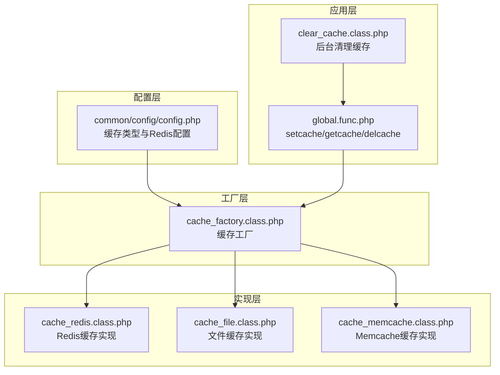
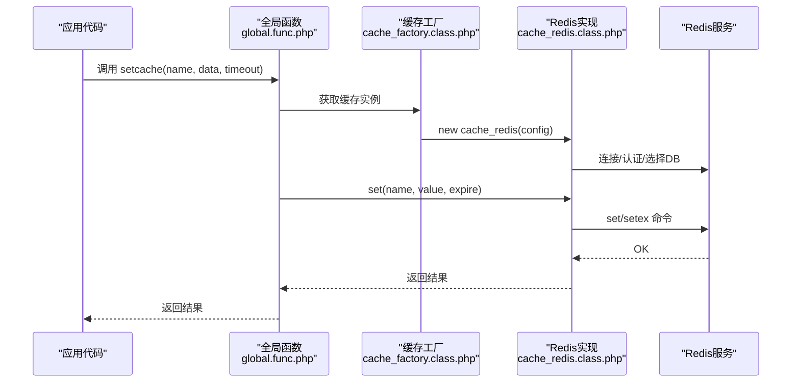
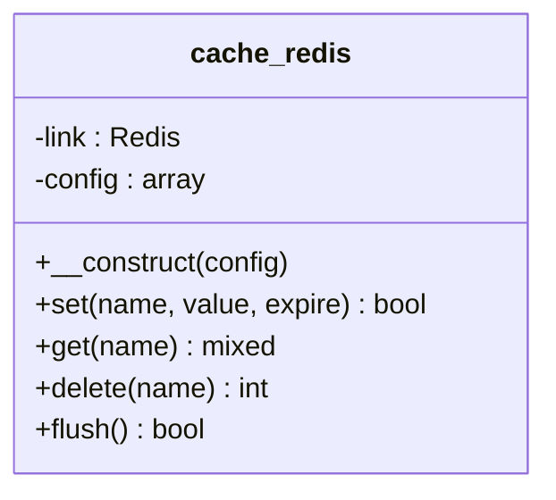
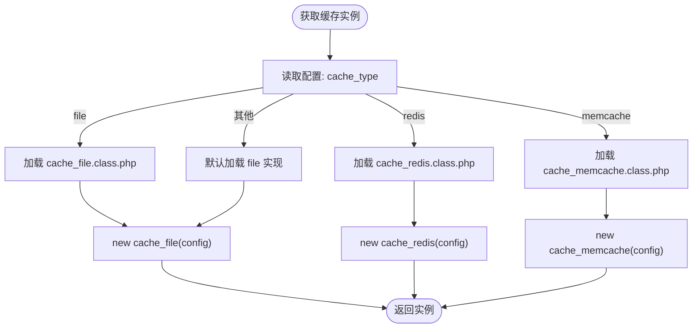
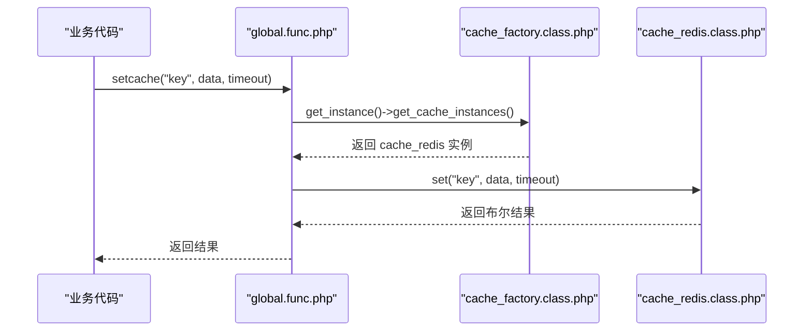
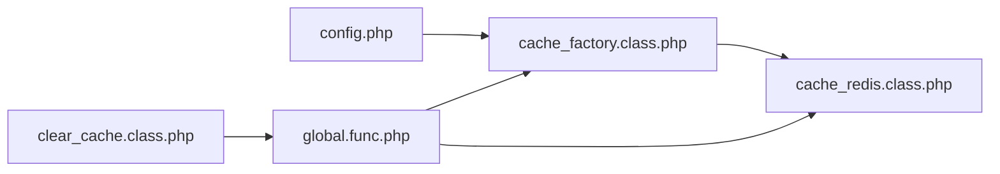

# Redis缓存集成

<cite>
**本文档引用的文件**
- [cache_redis.class.php](file://ryphp/core/class/cache_redis.class.php)
- [config.php](file://common/config/config.php)
- [cache_factory.class.php](file://ryphp/core/class/cache_factory.class.php)
- [global.func.php](file://ryphp/core/function/global.func.php)
- [cache_file.class.php](file://ryphp/core/class/cache_file.class.php)
- [cache_memcache.class.php](file://ryphp/core/class/cache_memcache.class.php)
- [clear_cache.class.php](file://application/lry_admin_center/controller/clear_cache.class.php)
</cite>

## 目录
1. [简介](#简介)
2. [项目结构](#项目结构)
3. [核心组件](#核心组件)
4. [架构总览](#架构总览)
5. [详细组件分析](#详细组件分析)
6. [依赖关系分析](#依赖关系分析)
7. [性能考虑](#性能考虑)
8. [故障处理与备份恢复](#故障处理与备份恢复)
9. [结论](#结论)

## 简介
本文件面向Redis缓存集成的技术文档，围绕cache_redis.class.php中的Redis缓存实现展开，涵盖连接管理、命令封装、数据序列化机制、配置参数、高级特性（过期时间、批量操作、事务支持）、分布式优势（内存存储、持久化、集群支持）、性能优化（连接池、管道、内存监控）以及故障处理与备份恢复策略。文档同时结合框架中的工厂模式与全局函数，帮助读者理解Redis缓存在系统中的工作流程与最佳实践。

## 项目结构
Redis缓存集成位于RYPHP框架内，采用“工厂模式 + 统一接口”的设计，支持多种缓存后端（file、redis、memcache）。Redis实现位于核心类目录，配置集中于系统配置文件，全局函数提供便捷的缓存调用入口。

图表来源
- [config.php:39-66](file://common/config/config.php#L39-L66)
- [cache_factory.class.php:36-84](file://ryphp/core/class/cache_factory.class.php#L36-L84)
- [cache_redis.class.php:10-51](file://ryphp/core/class/cache_redis.class.php#L10-L51)
- [global.func.php:585-634](file://ryphp/core/function/global.func.php#L585-L634)
- [clear_cache.class.php:9-24](file://application/lry_admin_center/controller/clear_cache.class.php#L9-L24)

章节来源
- [config.php:39-66](file://common/config/config.php#L39-L66)
- [cache_factory.class.php:36-84](file://ryphp/core/class/cache_factory.class.php#L36-L84)

## 核心组件
- Redis缓存类：负责Redis连接、命令封装、数据序列化与过期控制。
- 工厂类：根据配置动态加载并返回具体缓存实现（file/redis/memcache）。
- 全局函数：提供setcache/getcache/delcache等便捷接口，简化业务层调用。
- 配置文件：集中定义缓存类型与Redis参数（主机、端口、密码、数据库、超时、过期、长连接、前缀）。

章节来源
- [cache_redis.class.php:10-108](file://ryphp/core/class/cache_redis.class.php#L10-L108)
- [cache_factory.class.php:36-84](file://ryphp/core/class/cache_factory.class.php#L36-L84)
- [global.func.php:585-634](file://ryphp/core/function/global.func.php#L585-L634)
- [config.php:39-66](file://common/config/config.php#L39-L66)

## 架构总览
Redis缓存在框架中的调用链路如下：

图表来源
- [global.func.php:585-589](file://ryphp/core/function/global.func.php#L585-L589)
- [cache_factory.class.php:77-82](file://ryphp/core/class/cache_factory.class.php#L77-L82)
- [cache_redis.class.php:30-51](file://ryphp/core/class/cache_redis.class.php#L30-L51)
- [cache_redis.class.php:60-72](file://ryphp/core/class/cache_redis.class.php#L60-L72)

## 详细组件分析

### Redis缓存类（cache_redis.class.php）
- 连接管理
  - 检测Redis扩展；支持短连接与长连接；支持密码认证；支持数据库选择。
  - 超时参数传递给底层连接方法。
- 命令封装
  - set：当expire为0时使用set，否则使用setex（带过期）。
  - get：读取后尝试对字符串进行JSON反序列化，若为数组则返回数组，否则返回原始字符串。
  - delete：删除单个键。
  - flush：清空当前数据库。
- 数据序列化机制
  - set时对数组进行JSON编码；get时对字符串尝试JSON解码，兼容数组与字符串。
- 前缀与过期
  - 统一在键名前添加prefix；expire优先使用传入参数，否则使用类默认配置。

图表来源
- [cache_redis.class.php:10-108](file://ryphp/core/class/cache_redis.class.php#L10-L108)

章节来源
- [cache_redis.class.php:30-51](file://ryphp/core/class/cache_redis.class.php#L30-L51)
- [cache_redis.class.php:60-72](file://ryphp/core/class/cache_redis.class.php#L60-L72)
- [cache_redis.class.php:79-87](file://ryphp/core/class/cache_redis.class.php#L79-L87)
- [cache_redis.class.php:94-105](file://ryphp/core/class/cache_redis.class.php#L94-L105)

### 缓存工厂（cache_factory.class.php）
- 根据配置中的cache_type选择具体实现类。
- 使用懒加载模式，首次访问时创建缓存实例。
- 支持file、redis、memcache三种类型，默认回退到file。

图表来源
- [cache_factory.class.php:36-84](file://ryphp/core/class/cache_factory.class.php#L36-L84)

章节来源
- [cache_factory.class.php:36-84](file://ryphp/core/class/cache_factory.class.php#L36-L84)

### 全局函数（global.func.php）
- setcache：统一写入缓存入口，内部通过工厂获取实例并调用set。
- getcache：统一读取缓存入口，内部通过工厂获取实例并调用get。
- delcache：统一删除/清空缓存入口，支持按名称删除或清空全部。
- C：读取系统配置，支持单字段与整表读取。

图表来源
- [global.func.php:585-589](file://ryphp/core/function/global.func.php#L585-L589)
- [cache_factory.class.php:77-82](file://ryphp/core/class/cache_factory.class.php#L77-L82)
- [cache_redis.class.php:60-72](file://ryphp/core/class/cache_redis.class.php#L60-L72)

章节来源
- [global.func.php:585-634](file://ryphp/core/function/global.func.php#L585-L634)
- [global.func.php:147-151](file://ryphp/core/function/global.func.php#L147-L151)
- [global.func.php:1519-1523](file://ryphp/core/function/global.func.php#L1519-L1523)

### 配置参数详解（config.php）
- cache_type：缓存类型（file/redis/memcache）。
- redis_config：Redis相关配置
  - host/port/password/select/timeout/expire/persistent/prefix
- 其他缓存类型配置：file_config、memcache_config

章节来源
- [config.php:39-66](file://common/config/config.php#L39-L66)

### 文件缓存与Memcache对比（辅助理解）
- 文件缓存：基于文件系统，支持过期控制与序列化/可执行文件两种模式。
- Memcache缓存：基于Memcached扩展，实现与Redis类似的方法族。

章节来源
- [cache_file.class.php:1-130](file://ryphp/core/class/cache_file.class.php#L1-L130)
- [cache_memcache.class.php:1-91](file://ryphp/core/class/cache_memcache.class.php#L1-L91)

## 依赖关系分析
- cache_redis依赖Redis扩展；构造函数中完成连接、认证、数据库选择。
- 工厂类依赖全局配置；根据cache_type动态加载对应实现。
- 全局函数依赖工厂类；提供统一的业务调用入口。
- 后台清理控制器调用delcache('', true)实现全量清空。

图表来源
- [config.php:39-66](file://common/config/config.php#L39-L66)
- [cache_factory.class.php:36-84](file://ryphp/core/class/cache_factory.class.php#L36-L84)
- [global.func.php:585-634](file://ryphp/core/function/global.func.php#L585-L634)
- [clear_cache.class.php:22-23](file://application/lry_admin_center/controller/clear_cache.class.php#L22-L23)

章节来源
- [cache_redis.class.php:30-51](file://ryphp/core/class/cache_redis.class.php#L30-L51)
- [cache_factory.class.php:36-84](file://ryphp/core/class/cache_factory.class.php#L36-L84)
- [global.func.php:585-634](file://ryphp/core/function/global.func.php#L585-L634)
- [clear_cache.class.php:22-23](file://application/lry_admin_center/controller/clear_cache.class.php#L22-L23)

## 性能考虑
- 连接管理
  - 长连接：通过persistent参数启用持久化连接，减少TCP握手开销，适合高并发场景。
  - 超时控制：timeout参数控制连接与IO超时，避免阻塞。
- 序列化与网络
  - 数组统一JSON编码，减少序列化差异带来的兼容问题；get时尝试JSON解码，提升读取一致性。
- 批量与管道
  - Redis支持pipeline与multi/exec事务，可在高频写入场景中合并命令，降低RTT与网络往返。
- 内存使用监控
  - 结合Redis INFO命令监控used_memory、fragmentation_ratio等指标，及时发现内存膨胀。
- 缓存键设计
  - 使用prefix统一命名空间，避免键冲突；合理设置expire，避免无限增长。
- 过期策略
  - 使用EX/PX/EXAT等过期命令，配合TTL/PTTL查询剩余时间，便于运维与容量规划。

[本节为通用性能建议，不直接分析具体文件]

## 故障处理与备份恢复
- 连接异常
  - 扩展检测：构造函数中检测Redis扩展是否存在，不存在时直接报错。
  - 认证失败：密码错误会导致连接失败，应检查redis_config.password。
  - 数据库选择：select参数错误会切换到错误DB，需核对select索引。
- 数据读取异常
  - get返回原始字符串或数组，若JSON解码失败，返回原始字符串，避免业务崩溃。
- 清理与恢复
  - 后台清理：clear_cache控制器调用delcache('', true)清空所有缓存，适用于系统维护或迁移。
  - 备份策略：生产环境建议使用Redis快照（RDB）与AOF持久化组合，定期校验备份文件完整性。
  - 集群/哨兵：在分布式环境中，结合Sentinel或Cluster实现高可用与自动故障转移。

章节来源
- [cache_redis.class.php:30-51](file://ryphp/core/class/cache_redis.class.php#L30-L51)
- [cache_redis.class.php:79-87](file://ryphp/core/class/cache_redis.class.php#L79-L87)
- [clear_cache.class.php:22-23](file://application/lry_admin_center/controller/clear_cache.class.php#L22-L23)

## 结论
Redis缓存集成在本框架中通过工厂模式实现了统一抽象与灵活替换，Redis实现提供了简洁高效的键值存取能力，并内置了过期控制与数据序列化机制。结合配置参数、全局函数与后台清理工具，开发者可以在不同部署环境下快速启用Redis缓存，并通过长连接、批量命令与持久化策略获得稳定性能与可靠性。建议在生产环境中配合监控与备份方案，确保缓存层的稳定性与可恢复性。