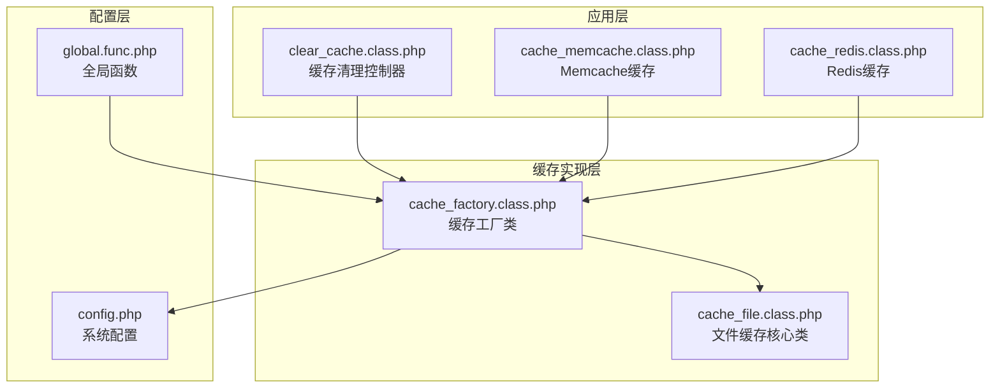
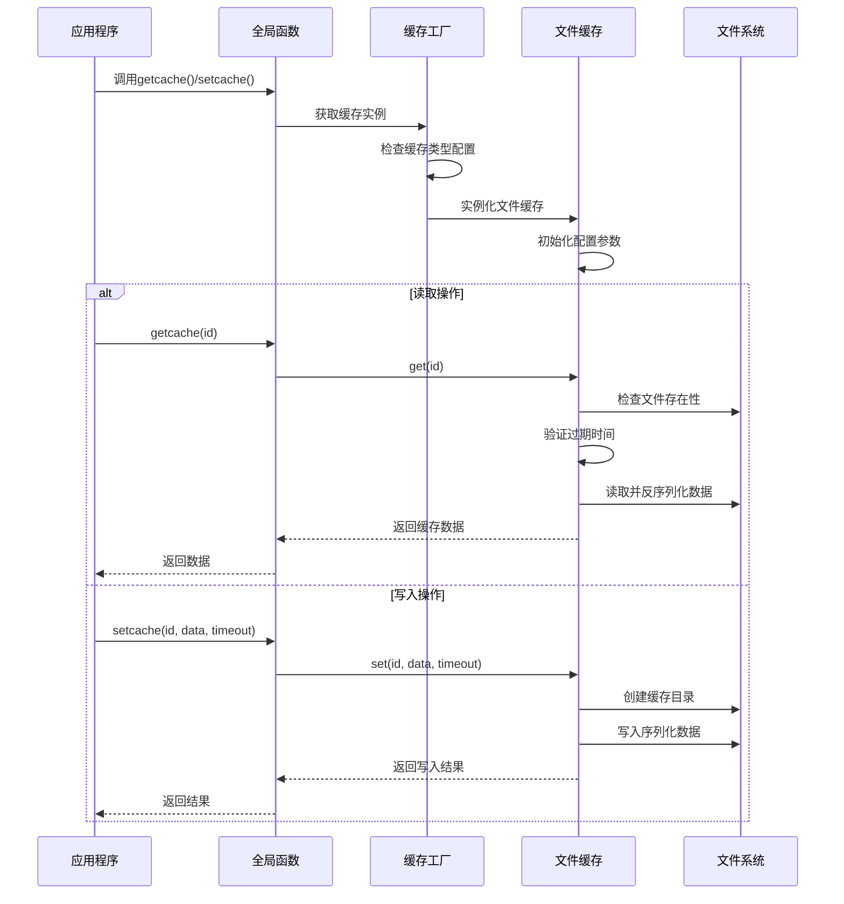
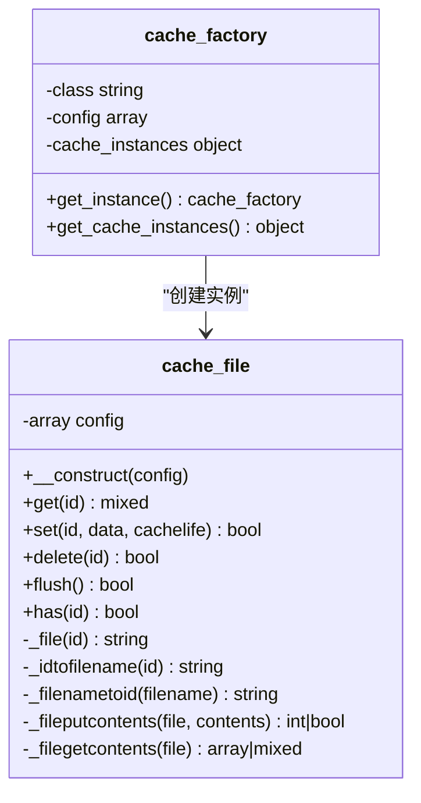
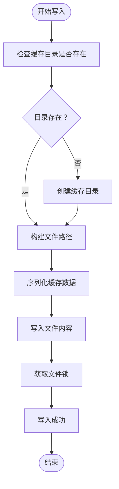
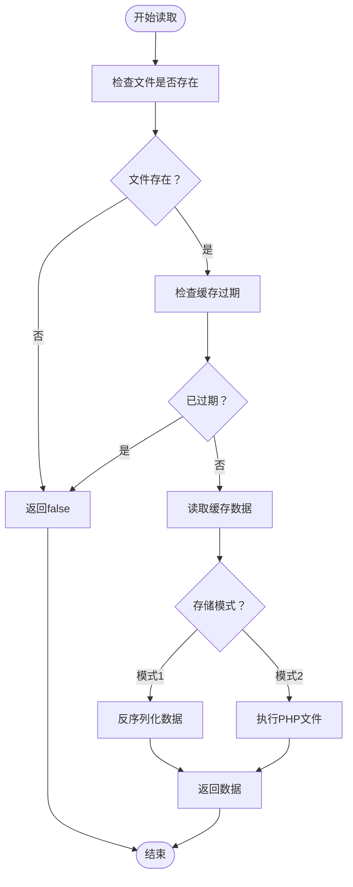
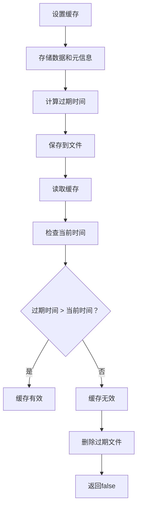
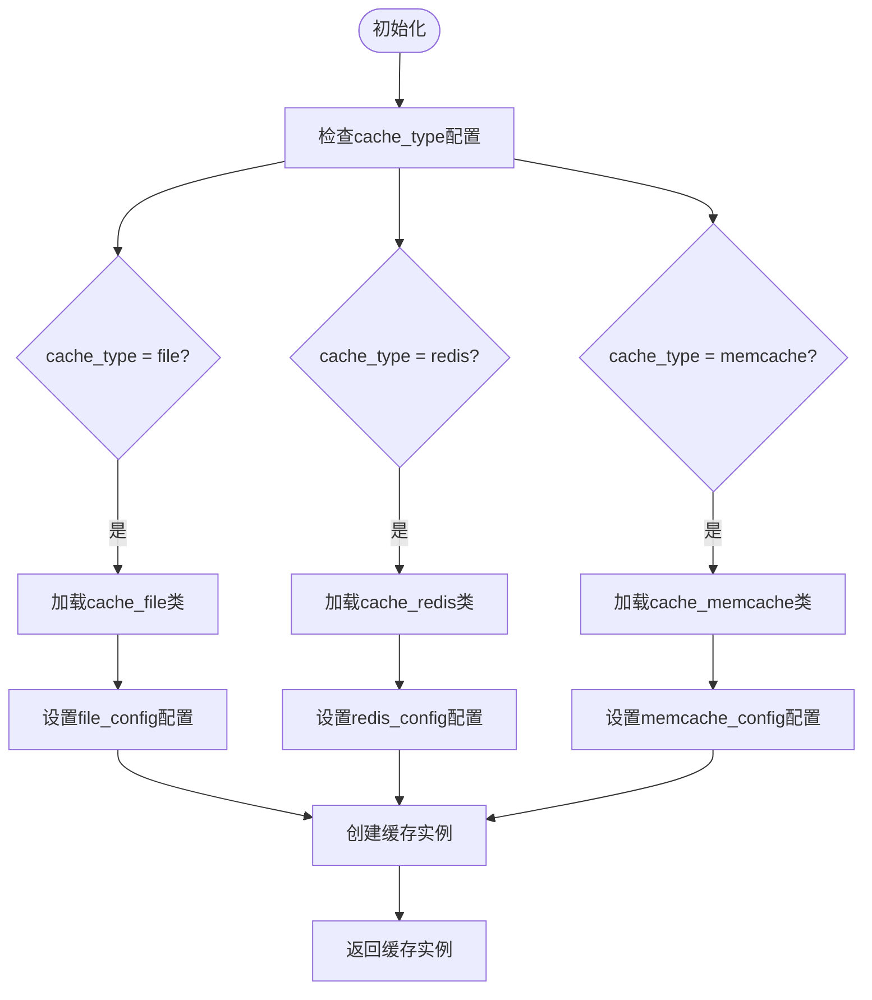
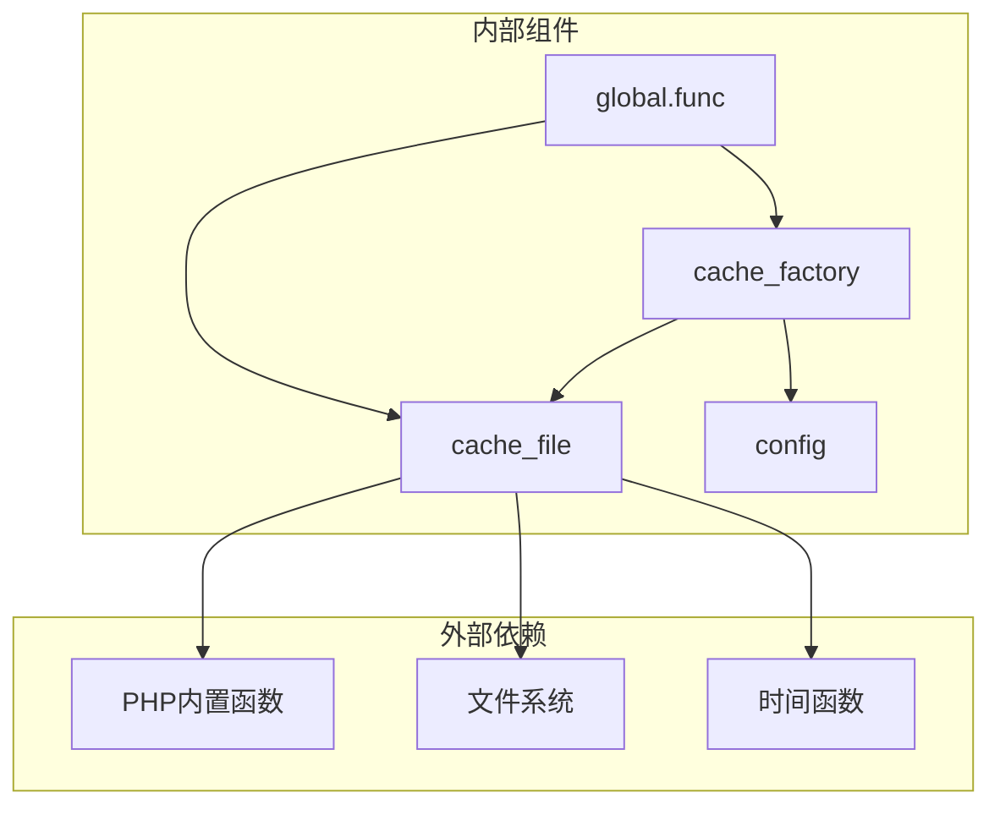

# 文件缓存实现

<cite>
**本文档引用的文件**
- [cache_file.class.php](file://ryphp/core/class/cache_file.class.php)
- [cache_factory.class.php](file://ryphp/core/class/cache_factory.class.php)
- [global.func.php](file://ryphp/core/function/global.func.php)
- [config.php](file://common/config/config.php)
- [clear_cache.class.php](file://application/lry_admin_center/controller/clear_cache.class.php)
- [cache_memcache.class.php](file://ryphp/core/class/cache_memcache.class.php)
- [cache_redis.class.php](file://ryphp/core/class/cache_redis.class.php)
</cite>

## 目录
1. [简介](#简介)
2. [项目结构](#项目结构)
3. [核心组件](#核心组件)
4. [架构概览](#架构概览)
5. [详细组件分析](#详细组件分析)
6. [依赖关系分析](#依赖关系分析)
7. [性能考虑](#性能考虑)
8. [故障排除指南](#故障排除指南)
9. [结论](#结论)

## 简介

文件缓存实现是基于PHP的文件系统缓存机制，通过将数据序列化存储到文件中来实现缓存功能。该实现提供了完整的文件缓存生命周期管理，包括数据的读取、写入、删除和清理操作，并支持缓存过期机制和多种存储模式。

文件缓存适用于中小型应用，具有实现简单、部署方便、无需额外服务等特点。它特别适合于静态数据缓存、配置信息缓存和临时数据存储等场景。

## 项目结构

文件缓存相关的代码主要分布在以下目录结构中：



**图表来源**
- [cache_file.class.php:1-130](file://ryphp/core/class/cache_file.class.php#L1-L130)
- [cache_factory.class.php:1-84](file://ryphp/core/class/cache_factory.class.php#L1-L84)
- [config.php:39-66](file://common/config/config.php#L39-L66)

**章节来源**
- [cache_file.class.php:1-130](file://ryphp/core/class/cache_file.class.php#L1-L130)
- [cache_factory.class.php:1-84](file://ryphp/core/class/cache_factory.class.php#L1-L84)
- [config.php:1-88](file://common/config/config.php#L1-L88)

## 核心组件

文件缓存实现的核心组件包括：

### 缓存工厂类 (cache_factory)
负责缓存类型的统一管理和实例化，支持文件、Redis、Memcache三种缓存类型。

### 文件缓存类 (cache_file)
实现具体的文件缓存功能，包括数据的序列化存储、读取、过期检查等。

### 全局缓存接口
提供简化的缓存操作接口，包括getcache()和setcache()函数。

**章节来源**
- [cache_factory.class.php:36-82](file://ryphp/core/class/cache_factory.class.php#L36-L82)
- [cache_file.class.php:2-14](file://ryphp/core/class/cache_file.class.php#L2-L14)
- [global.func.php:146-151](file://ryphp/core/function/global.func.php#L146-L151)

## 架构概览

文件缓存的架构采用工厂模式设计，实现了缓存类型的动态切换和统一管理：



**图表来源**
- [cache_factory.class.php:36-82](file://ryphp/core/class/cache_factory.class.php#L36-L82)
- [cache_file.class.php:17-46](file://ryphp/core/class/cache_file.class.php#L17-L46)
- [global.func.php:146-151](file://ryphp/core/function/global.func.php#L146-L151)

## 详细组件分析

### 文件缓存类 (cache_file)

文件缓存类是整个缓存系统的核心实现，提供了完整的缓存操作功能。

#### 类结构图



**图表来源**
- [cache_file.class.php:2-130](file://ryphp/core/class/cache_file.class.php#L2-L130)
- [cache_factory.class.php:2-82](file://ryphp/core/class/cache_factory.class.php#L2-L82)

#### 配置参数详解

文件缓存支持以下配置参数：

| 参数名 | 默认值 | 描述 | 作用域 |
|--------|--------|------|--------|
| cache_dir | RYPHP_ROOT.'cache/cache_file/' | 缓存文件存储目录 | 全局 |
| suffix | '.cache.php' | 缓存文件后缀 | 全局 |
| mode | '1' | 存储模式：1为序列化模式，2为可执行文件模式 | 全局 |

#### 文件存储结构

文件缓存采用扁平化的目录结构，所有缓存文件都存储在同一个目录中：

```
cache/
└── cache_file/
    ├── article_001.cache.php
    ├── user_profile.cache.php
    ├── config_data.cache.php
    └── category_list.cache.php
```

每个缓存文件的命名规则为：`缓存ID + 文件后缀`

#### 读写操作流程

##### 写入操作流程



**图表来源**
- [cache_file.class.php:34-46](file://ryphp/core/class/cache_file.class.php#L34-L46)
- [cache_file.class.php:103-112](file://ryphp/core/class/cache_file.class.php#L103-L112)

##### 读取操作流程



**图表来源**
- [cache_file.class.php:17-29](file://ryphp/core/class/cache_file.class.php#L17-L29)
- [cache_file.class.php:116-128](file://ryphp/core/class/cache_file.class.php#L116-L128)

#### 缓存文件格式

文件缓存支持两种存储格式：

**模式1 (序列化模式)**：
- 文件头部：`<?php  exit('NO.'); ?>`
- 数据内容：`序列化后的数组`

**模式2 (可执行文件模式)**：
- 文件头部：`<?php`
- 数据内容：`return var_export后的数组; ?>`

#### 生命周期管理

文件缓存的生命周期管理包括：

1. **创建阶段**：检查目录存在性，不存在则自动创建
2. **写入阶段**：序列化数据，写入文件，设置文件权限
3. **读取阶段**：检查文件存在性和过期时间
4. **清理阶段**：手动删除或自动过期清理

#### 过期机制实现

文件缓存的过期机制通过在缓存数据中存储过期时间戳来实现：



**图表来源**
- [cache_file.class.php:34-39](file://ryphp/core/class/cache_file.class.php#L34-L39)
- [cache_file.class.php:25-28](file://ryphp/core/class/cache_file.class.php#L25-L28)

**章节来源**
- [cache_file.class.php:17-128](file://ryphp/core/class/cache_file.class.php#L17-L128)

### 缓存工厂类 (cache_factory)

缓存工厂类实现了单例模式和工厂模式的结合，负责根据配置选择合适的缓存实现：

#### 工厂模式流程



**图表来源**
- [cache_factory.class.php:36-62](file://ryphp/core/class/cache_factory.class.php#L36-L62)

#### 配置选项

缓存工厂支持以下配置选项：

| 配置项 | 类型 | 默认值 | 描述 |
|--------|------|--------|------|
| cache_type | string | 'file' | 缓存类型选择 |
| file_config | array | 包含缓存目录、后缀、模式 | 文件缓存配置 |
| redis_config | array | Redis连接参数 | Redis缓存配置 |
| memcache_config | array | Memcache连接参数 | Memcache缓存配置 |

**章节来源**
- [cache_factory.class.php:36-82](file://ryphp/core/class/cache_factory.class.php#L36-L82)
- [config.php:39-66](file://common/config/config.php#L39-L66)

### 全局缓存接口

全局缓存接口提供了简化的缓存操作API：

#### 缓存操作接口

| 函数名 | 参数 | 返回值 | 描述 |
|--------|------|--------|------|
| getcache(name) | string | mixed | 获取缓存数据 |
| setcache(name, data, timeout) | string, mixed, int | bool | 设置缓存数据 |
| delcache(name, flush) | string, bool | bool | 删除缓存或清空缓存 |

#### 使用示例

```php
// 设置缓存
setcache('user_info', $userData, 3600);

// 获取缓存
$userInfo = getcache('user_info');

// 删除缓存
delcache('user_info');

// 清空所有缓存
delcache('', true);
```

**章节来源**
- [global.func.php:146-151](file://ryphp/core/function/global.func.php#L146-L151)
- [global.func.php:585-589](file://ryphp/core/function/global.func.php#L585-L589)
- [global.func.php:1519-1523](file://ryphp/core/function/global.func.php#L1519-L1523)

## 依赖关系分析

文件缓存实现的依赖关系如下：



**图表来源**
- [cache_file.class.php:103-128](file://ryphp/core/class/cache_file.class.php#L103-L128)
- [cache_factory.class.php:36-82](file://ryphp/core/class/cache_factory.class.php#L36-L82)

### 组件耦合度分析

- **cache_file** 与 **cache_factory**：弱耦合，通过工厂模式实现
- **cache_file** 与 **global.func**：弱耦合，通过全局函数接口
- **cache_factory** 与 **config**：强耦合，直接依赖配置参数
- **cache_file** 与 **文件系统**：强耦合，直接操作文件

### 外部依赖分析

文件缓存实现依赖以下PHP扩展和函数：
- 文件操作函数：file_exists, mkdir, unlink, file_put_contents
- 序列化函数：serialize, unserialize
- 时间函数：time, microtime
- 目录遍历函数：glob

**章节来源**
- [cache_file.class.php:103-128](file://ryphp/core/class/cache_file.class.php#L103-L128)
- [cache_factory.class.php:36-82](file://ryphp/core/class/cache_factory.class.php#L36-L82)

## 性能考虑

### 性能特点

文件缓存具有以下性能特征：

#### 优点
- **实现简单**：无需额外的缓存服务器
- **部署方便**：只需要文件系统权限
- **内存占用低**：数据存储在文件系统中
- **持久性强**：服务器重启后数据仍然存在

#### 局限性
- **并发性能有限**：文件锁机制限制了并发访问
- **磁盘I/O开销**：频繁的文件读写操作
- **内存占用**：PHP进程需要加载整个缓存文件
- **扩展性差**：难以实现分布式缓存

### 并发访问处理

文件缓存通过以下机制处理并发访问：

1. **文件锁机制**：使用LOCK_EX标志确保文件写入的原子性
2. **读写分离**：读操作不加锁，写操作使用独占锁
3. **竞争条件**：在高并发情况下可能出现竞态条件

### 性能优化建议

1. **合理设置缓存过期时间**：避免过短的过期时间导致频繁读取
2. **使用合适的存储模式**：模式2比模式1有更快的读取速度
3. **定期清理过期缓存**：避免缓存文件过多影响性能
4. **监控磁盘空间**：及时清理不需要的缓存文件

## 故障排除指南

### 常见问题及解决方案

#### 1. 缓存目录权限问题

**问题描述**：缓存文件无法创建或写入

**解决方案**：
- 检查cache目录的写入权限
- 确保Web服务器用户对目录有写权限
- 使用chmod 0777设置目录权限

#### 2. 缓存文件损坏

**问题描述**：读取缓存时报错或返回false

**解决方案**：
- 检查缓存文件的完整性
- 删除损坏的缓存文件
- 重新生成缓存数据

#### 3. 缓存过期问题

**问题描述**：缓存数据过期但未正确清理

**解决方案**：
- 检查SYS_TIME常量的定义
- 验证缓存过期时间计算
- 手动清理过期缓存文件

#### 4. 内存溢出问题

**问题描述**：大缓存文件导致内存不足

**解决方案**：
- 分割大缓存文件
- 使用更小的缓存粒度
- 定期清理不必要的缓存

### 调试技巧

1. **启用调试模式**：查看详细的错误信息
2. **检查文件权限**：确保缓存目录可写
3. **验证时间同步**：确保服务器时间准确
4. **监控磁盘空间**：避免磁盘空间不足

**章节来源**
- [clear_cache.class.php:10-24](file://application/lry_admin_center/controller/clear_cache.class.php#L10-L24)
- [cache_file.class.php:103-128](file://ryphp/core/class/cache_file.class.php#L103-L128)

## 结论

文件缓存实现是一个简洁而实用的缓存解决方案，特别适合中小型应用和开发环境使用。其主要优势在于实现简单、部署方便、无需额外的服务依赖。

### 适用场景

- **开发和测试环境**：快速原型开发和功能测试
- **小型应用**：用户量较小的网站或应用
- **静态数据缓存**：配置信息、静态页面等
- **临时数据存储**：会话数据、临时文件等

### 不适用场景

- **高并发应用**：需要处理大量并发请求的应用
- **分布式系统**：需要跨服务器共享缓存的应用
- **大数据量应用**：缓存数据量非常大的应用
- **实时性要求高的应用**：对响应时间要求极高的应用

### 最佳实践

1. **合理设置缓存策略**：根据数据特性和访问模式选择合适的缓存方案
2. **监控缓存性能**：定期检查缓存命中率和性能指标
3. **备份重要缓存**：对关键数据建立备份机制
4. **定期维护**：清理过期和无效的缓存文件
5. **安全考虑**：确保缓存文件的安全性和隐私保护

文件缓存作为缓存体系的基础实现，为理解更复杂的缓存技术提供了良好的基础。通过合理的设计和使用，可以在适当的场景中发挥重要作用。