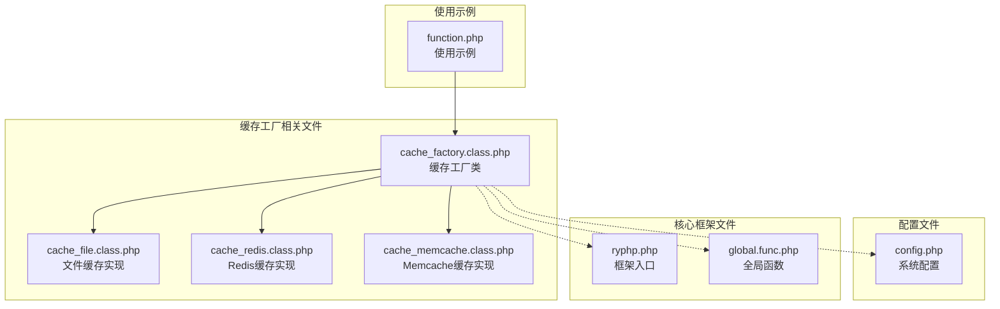
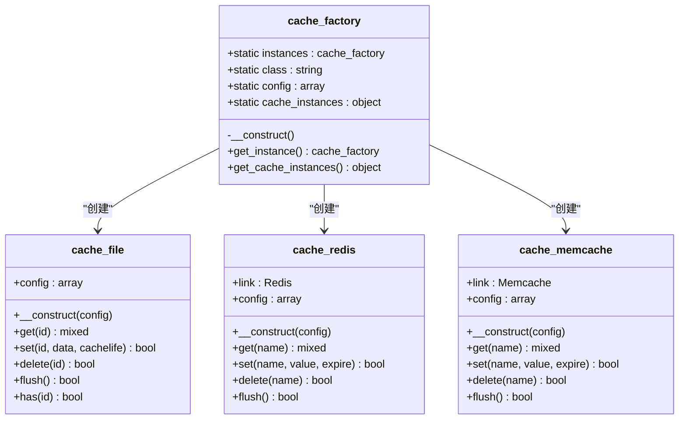
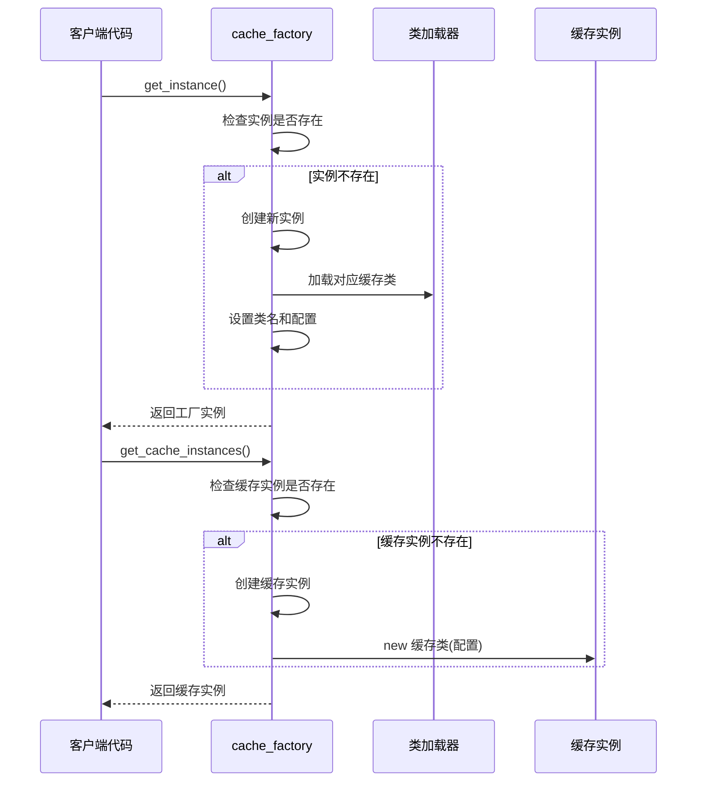
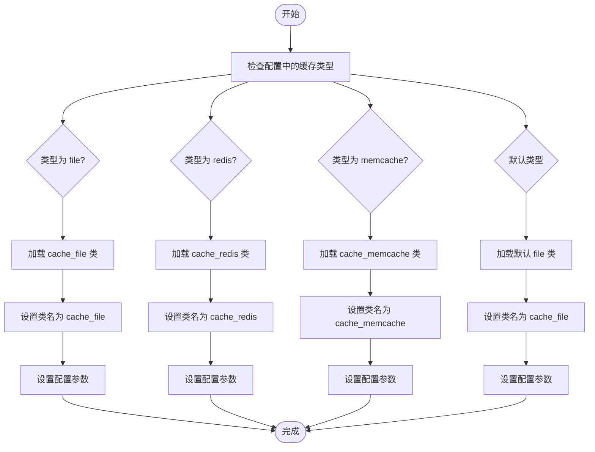
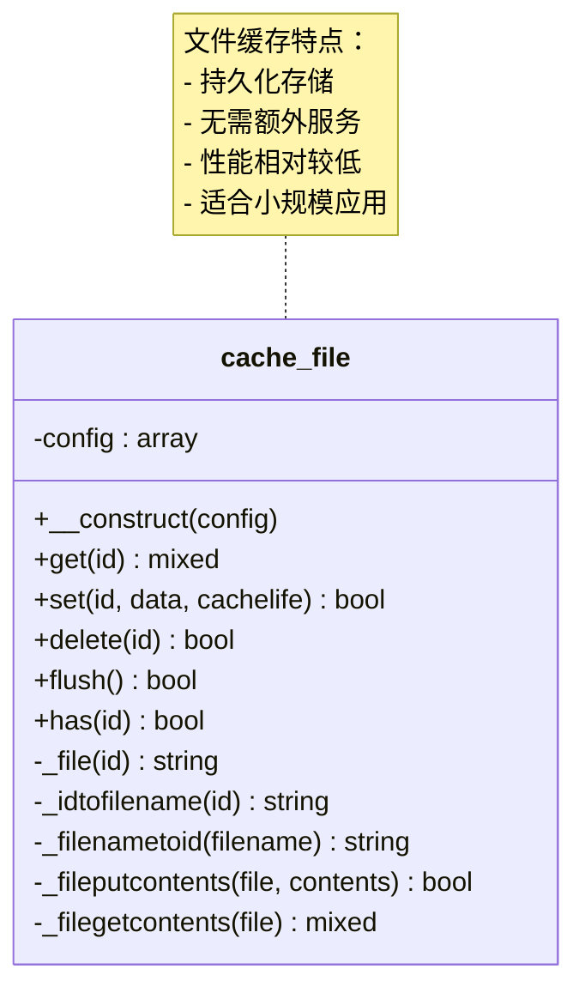
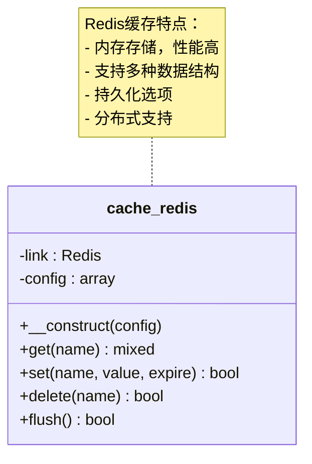
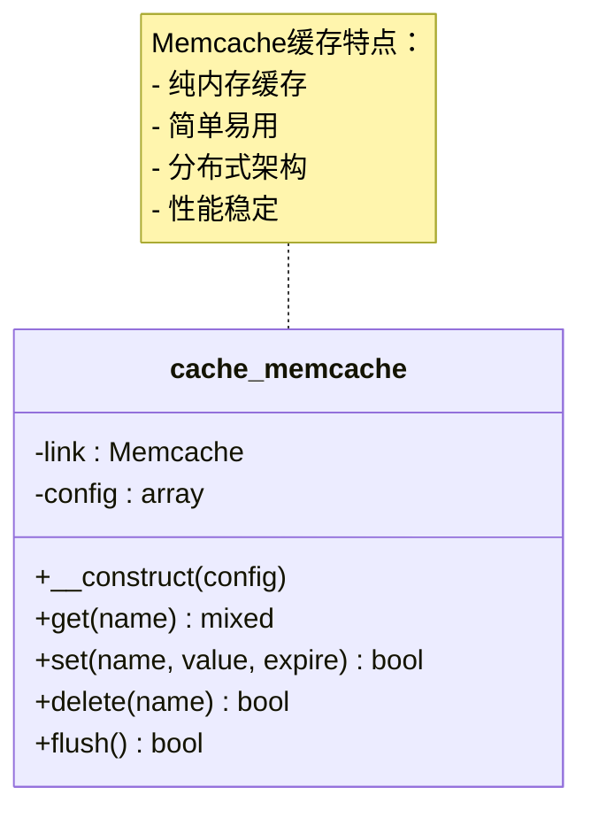
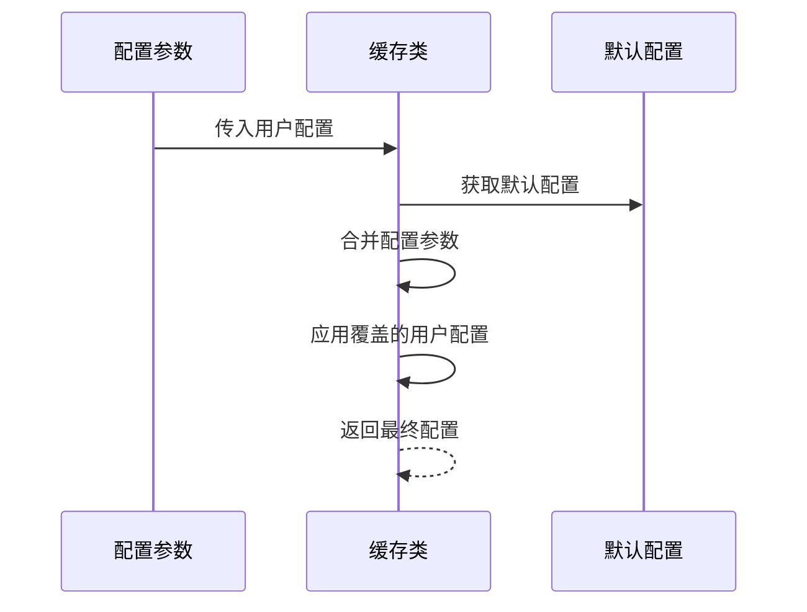
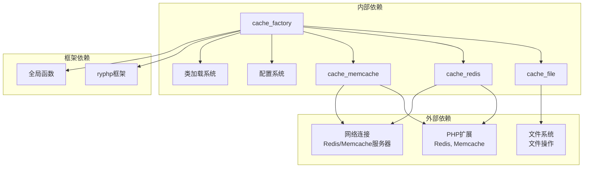

# 缓存工厂模式

<cite>
**本文档引用的文件**
- [cache_factory.class.php](file://ryphp/core/class/cache_factory.class.php)
- [cache_file.class.php](file://ryphp/core/class/cache_file.class.php)
- [cache_redis.class.php](file://ryphp/core/class/cache_redis.class.php)
- [cache_memcache.class.php](file://ryphp/core/class/cache_memcache.class.php)
- [config.php](file://common/config/config.php)
- [ryphp.php](file://ryphp/ryphp.php)
- [global.func.php](file://ryphp/core/function/global.func.php)
- [function.php](file://application/lry_admin_center/common/function/function.php)
</cite>

## 目录
1. [简介](#简介)
2. [项目结构](#项目结构)
3. [核心组件](#核心组件)
4. [架构概览](#架构概览)
5. [详细组件分析](#详细组件分析)
6. [依赖关系分析](#依赖关系分析)
7. [性能考量](#性能考量)
8. [故障排除指南](#故障排除指南)
9. [结论](#结论)

## 简介

缓存工厂模式是RYPHP框架中实现的一个重要设计模式，它结合了工厂模式、单例模式和懒加载机制，为应用程序提供了灵活的缓存解决方案。该模式的核心目标是在不改变客户端代码的情况下，能够动态地选择和切换不同的缓存后端实现（文件缓存、Redis缓存、Memcache缓存）。

通过工厂模式，系统实现了代码解耦，使得缓存的具体实现细节对上层应用透明。同时，结合单例模式确保了缓存实例的唯一性，配合懒加载机制优化了内存使用和启动性能。

## 项目结构

缓存工厂模式涉及的主要文件结构如下：



**图表来源**
- [cache_factory.class.php](file://ryphp/core/class/cache_factory.class.php#L1-L84)
- [config.php](file://common/config/config.php#L39-L66)
- [ryphp.php](file://ryphp/ryphp.php#L83-L202)

**章节来源**
- [cache_factory.class.php](file://ryphp/core/class/cache_factory.class.php#L1-L84)
- [config.php](file://common/config/config.php#L39-L66)

## 核心组件

缓存工厂模式由以下几个核心组件构成：

### 工厂类（cache_factory）

工厂类是整个模式的核心，负责：
- 实现单例模式确保实例唯一性
- 根据配置动态选择缓存后端
- 管理缓存实例的生命周期
- 提供懒加载机制

### 缓存实现类

系统支持三种缓存实现：
- **文件缓存**：基于文件系统的持久化存储
- **Redis缓存**：高性能内存数据库缓存
- **Memcache缓存**：分布式内存对象缓存系统

### 配置管理系统

通过统一的配置文件管理所有缓存相关的参数，包括：
- 缓存类型选择
- 各种缓存后端的具体配置参数
- 默认值和覆盖机制

**章节来源**
- [cache_factory.class.php](file://ryphp/core/class/cache_factory.class.php#L2-L6)
- [cache_file.class.php](file://ryphp/core/class/cache_file.class.php#L2-L14)
- [cache_redis.class.php](file://ryphp/core/class/cache_redis.class.php#L10-L22)
- [cache_memcache.class.php](file://ryphp/core/class/cache_memcache.class.php#L10-L20)

## 架构概览

缓存工厂模式的整体架构采用分层设计，实现了清晰的关注点分离：

```mermaid
graph TB
subgraph "应用层"
APP[业务逻辑代码]
API[API接口调用]
end
subgraph "工厂层"
FACTORY[cache_factory<br/>工厂类]
INSTANCE[实例管理器]
end
subgraph "实现层"
FILE_CACHE[cache_file<br/>文件缓存]
REDIS_CACHE[cache_redis<br/>Redis缓存]
MEMCACHE_CACHE[cache_memcache<br/>Memcache缓存]
end
subgraph "配置层"
CONFIG[config.php<br/>配置管理]
GLOBAL_CONFIG[C()函数<br/>配置获取]
end
subgraph "基础设施"
FRAMEWORK[ryphp框架<br/>类加载系统]
LOAD_CLASS[load_sys_class<br/>类加载器]
end
APP --> FACTORY
API --> FACTORY
FACTORY --> INSTANCE
INSTANCE --> FILE_CACHE
INSTANCE --> REDIS_CACHE
INSTANCE --> MEMCACHE_CACHE
FACTORY -.-> CONFIG
FACTORY -.-> GLOBAL_CONFIG
FACTORY -.-> FRAMEWORK
FRAMEWORK --> LOAD_CLASS
```

**图表来源**
- [cache_factory.class.php](file://ryphp/core/class/cache_factory.class.php#L36-L82)
- [config.php](file://common/config/config.php#L39-L66)
- [ryphp.php](file://ryphp/ryphp.php#L108-L140)

## 详细组件分析

### 工厂类设计原理

#### 单例模式实现

工厂类通过静态属性实现单例模式，确保在整个应用程序生命周期内只有一个工厂实例存在：



**图表来源**
- [cache_factory.class.php](file://ryphp/core/class/cache_factory.class.php#L2-L82)
- [cache_file.class.php](file://ryphp/core/class/cache_file.class.php#L2-L130)
- [cache_redis.class.php](file://ryphp/core/class/cache_redis.class.php#L10-L108)
- [cache_memcache.class.php](file://ryphp/core/class/cache_memcache.class.php#L10-L91)

#### 懒加载机制

懒加载机制确保只有在真正需要时才创建缓存实例，从而优化内存使用和启动性能：



**图表来源**
- [cache_factory.class.php](file://ryphp/core/class/cache_factory.class.php#L36-L82)

#### 动态缓存类型切换

工厂类支持运行时动态切换缓存后端，通过配置文件实现：



**图表来源**
- [cache_factory.class.php](file://ryphp/core/class/cache_factory.class.php#L39-L59)

**章节来源**
- [cache_factory.class.php](file://ryphp/core/class/cache_factory.class.php#L36-L82)

### 缓存实现类分析

#### 文件缓存实现

文件缓存是最基础的缓存实现，适用于小规模应用和开发环境：



**图表来源**
- [cache_file.class.php](file://ryphp/core/class/cache_file.class.php#L2-L130)

#### Redis缓存实现

Redis缓存提供高性能的内存数据结构存储：



**图表来源**
- [cache_redis.class.php](file://ryphp/core/class/cache_redis.class.php#L10-L108)

#### Memcache缓存实现

Memcache缓存是经典的分布式缓存解决方案：



**图表来源**
- [cache_memcache.class.php](file://ryphp/core/class/cache_memcache.class.php#L10-L91)

**章节来源**
- [cache_file.class.php](file://ryphp/core/class/cache_file.class.php#L1-L130)
- [cache_redis.class.php](file://ryphp/core/class/cache_redis.class.php#L1-L108)
- [cache_memcache.class.php](file://ryphp/core/class/cache_memcache.class.php#L1-L91)

### 配置参数管理机制

#### 配置参数传递

配置参数通过C()函数从配置文件中获取，并传递给相应的缓存实现类：

```mermaid
flowchart TD
ConfigFile[config.php] --> CFunction[C()函数]
CFunction --> Factory[cache_factory]
Factory --> CacheClass[具体缓存类]
subgraph "配置参数类型"
FileConfig[file_config]
RedisConfig[redis_config]
MemcacheConfig[memcache_config]
end
FileConfig --> Factory
RedisConfig --> Factory
MemcacheConfig --> Factory
```

**图表来源**
- [config.php](file://common/config/config.php#L39-L66)
- [global.func.php](file://ryphp/core/function/global.func.php#L4-L26)

#### 配置参数覆盖机制

缓存实现类支持配置参数的合并和覆盖：



**图表来源**
- [cache_file.class.php](file://ryphp/core/class/cache_file.class.php#L5-L14)
- [cache_redis.class.php](file://ryphp/core/class/cache_redis.class.php#L30-L36)
- [cache_memcache.class.php](file://ryphp/core/class/cache_memcache.class.php#L27-L33)

**章节来源**
- [config.php](file://common/config/config.php#L39-L66)
- [global.func.php](file://ryphp/core/function/global.func.php#L4-L26)

## 依赖关系分析

缓存工厂模式的依赖关系体现了良好的软件工程原则：



**图表来源**
- [cache_factory.class.php](file://ryphp/core/class/cache_factory.class.php#L39-L59)
- [cache_redis.class.php](file://ryphp/core/class/cache_redis.class.php#L30-L33)
- [cache_memcache.class.php](file://ryphp/core/class/cache_memcache.class.php#L27-L30)

**章节来源**
- [cache_factory.class.php](file://ryphp/core/class/cache_factory.class.php#L1-L84)

## 性能考量

缓存工厂模式在性能方面具有以下特点：

### 内存使用优化

- **懒加载机制**：只有在首次使用时才创建缓存实例，减少初始内存占用
- **单例模式**：确保每个缓存类型只创建一个实例，避免重复内存分配
- **静态属性管理**：使用静态属性存储实例和配置，提高访问效率

### 启动性能提升

- **按需加载**：通过`load_sys_class('', '', 0)`实现按需类加载，避免不必要的类文件包含
- **配置缓存**：C()函数使用静态变量缓存配置，避免重复读取配置文件
- **类加载缓存**：ryphp框架的类加载器使用静态数组缓存已加载的类

### 运行时性能

- **统一接口**：所有缓存实现都提供相同的接口，便于优化和替换
- **配置优先级**：用户配置优先于默认配置，确保灵活性
- **错误处理**：适当的错误处理机制，避免因缓存失败影响主业务流程

## 故障排除指南

### 常见问题及解决方案

#### 缓存类型配置错误

**问题描述**：配置文件中的`cache_type`设置无效或不存在

**解决方案**：
1. 检查配置文件中的`cache_type`值是否为`file`、`redis`或`memcache`
2. 确认对应的配置参数是否正确设置
3. 查看默认回退机制是否正常工作

#### 缓存后端不可用

**问题描述**：Redis或Memcache服务不可用导致缓存功能异常

**解决方案**：
1. 检查Redis/Memcache服务状态
2. 验证网络连接和端口配置
3. 确认PHP扩展已正确安装和启用
4. 考虑降级到文件缓存

#### 权限问题

**问题描述**：文件缓存无法写入或删除缓存文件

**解决方案**：
1. 检查缓存目录的读写权限
2. 确认目录存在且可写
3. 检查磁盘空间是否充足

**章节来源**
- [cache_factory.class.php](file://ryphp/core/class/cache_factory.class.php#L55-L59)
- [cache_redis.class.php](file://ryphp/core/class/cache_redis.class.php#L30-L33)
- [cache_memcache.class.php](file://ryphp/core/class/cache_memcache.class.php#L27-L30)

## 结论

缓存工厂模式在RYPHP框架中展现了优秀的软件设计原则：

### 设计优势

1. **代码解耦**：通过抽象出统一的缓存接口，实现了业务逻辑与具体缓存实现的解耦
2. **可扩展性**：易于添加新的缓存后端实现，只需遵循统一的接口规范
3. **可维护性**：集中式的配置管理和工厂控制，简化了缓存系统的维护
4. **灵活性**：支持运行时动态切换缓存后端，适应不同场景需求

### 应用场景

缓存工厂模式特别适用于：
- 多环境部署（开发、测试、生产环境使用不同缓存后端）
- 微服务架构中的缓存统一管理
- 需要灵活调整缓存策略的应用系统
- 对性能有较高要求但又希望保持代码简洁的项目

### 最佳实践建议

1. **合理选择缓存后端**：根据应用规模和性能需求选择合适的缓存实现
2. **配置参数优化**：根据实际环境调整缓存配置参数
3. **监控和告警**：建立缓存系统的监控机制，及时发现和解决问题
4. **备份和恢复**：对于重要的缓存数据，建立相应的备份和恢复策略

通过深入理解和应用缓存工厂模式，开发者可以构建更加健壮、灵活和高性能的缓存系统，为应用程序提供优质的性能体验。