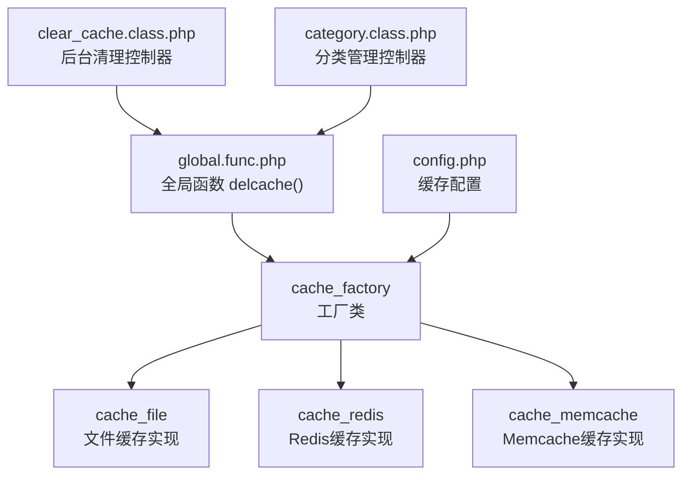
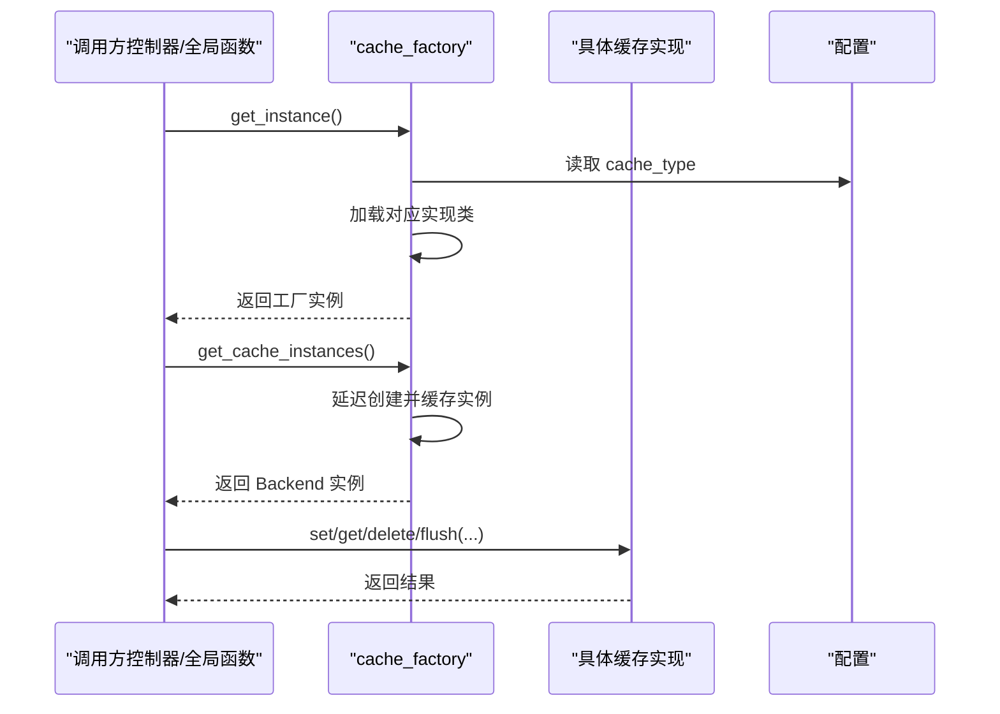
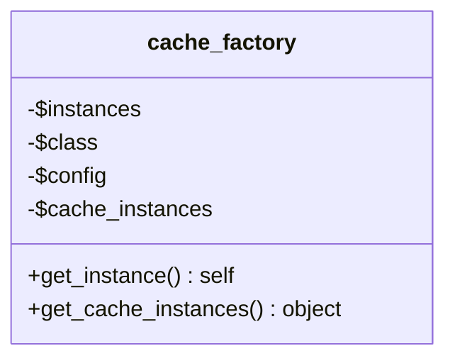
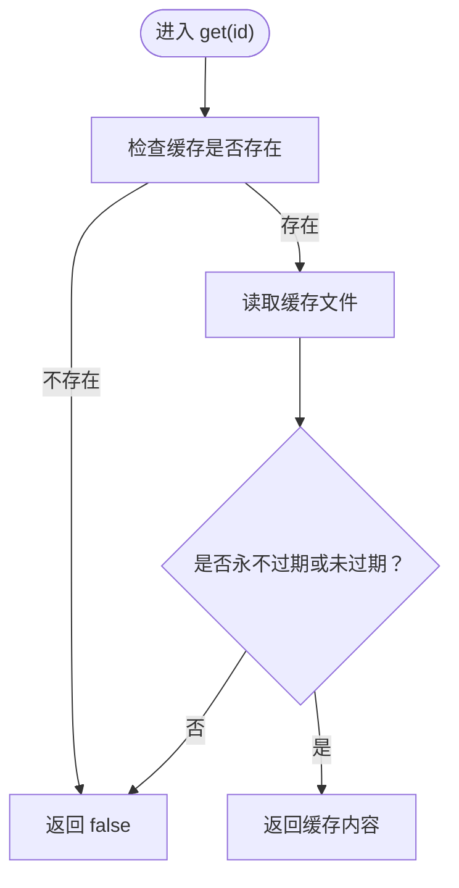
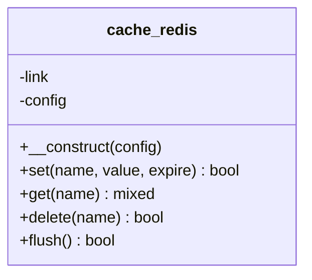
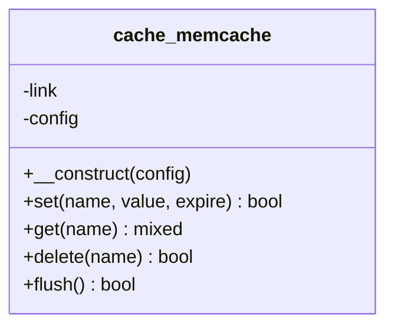
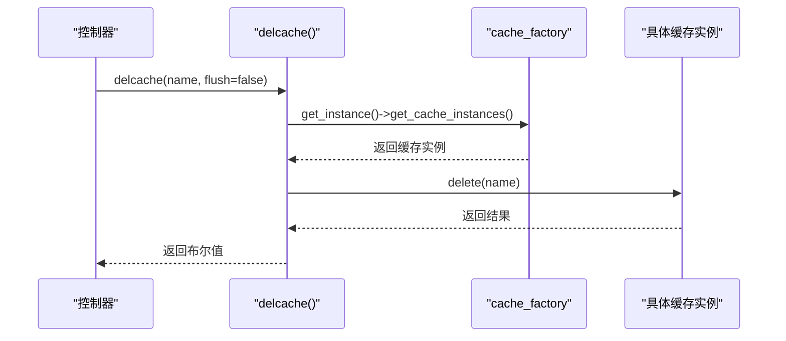
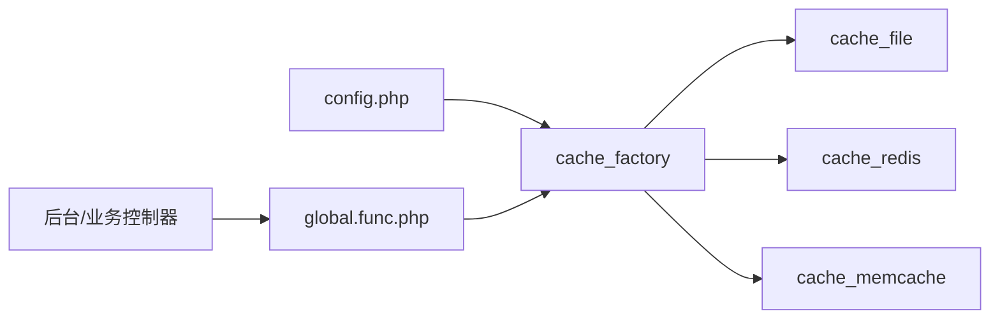

# 缓存系统

<cite>
**本文引用的文件列表**
- [cache_factory.class.php](file://ryphp/core/class/cache_factory.class.php)
- [cache_file.class.php](file://ryphp/core/class/cache_file.class.php)
- [cache_redis.class.php](file://ryphp/core/class/cache_redis.class.php)
- [cache_memcache.class.php](file://ryphp/core/class/cache_memcache.class.php)
- [config.php](file://common/config/config.php)
- [global.func.php](file://ryphp/core/function/global.func.php)
- [clear_cache.class.php](file://application/lry_admin_center/controller/clear_cache.class.php)
- [category.class.php](file://application/lry_admin_center/controller/category.class.php)
</cite>

## 目录
1. [简介](#简介)
2. [项目结构](#项目结构)
3. [核心组件](#核心组件)
4. [架构总览](#架构总览)
5. [详细组件分析](#详细组件分析)
6. [依赖关系分析](#依赖关系分析)
7. [性能与优化](#性能与优化)
8. [故障排查指南](#故障排查指南)
9. [结论](#结论)
10. [附录](#附录)

## 简介
本文件面向缓存系统的综合技术文档，重点围绕缓存工厂模式的设计与实现，覆盖以下方面：
- 工厂模式如何按配置动态选择缓存后端（文件、Redis、Memcache），并提供统一接口。
- 各缓存后端的特性、适用场景与差异。
- 存储策略、过期机制与失效处理。
- 性能优化技巧（缓存穿透、缓存雪崩的预防）。
- 配置最佳实践与监控方法（命中率统计与性能调优建议）。

## 项目结构
缓存系统位于框架核心层，采用“工厂 + 多后端实现”的分层设计：
- 工厂类负责根据配置选择具体缓存实现，并提供单例缓存实例。
- 各后端类实现统一的 get/set/delete/flush 接口。
- 全局函数封装常用缓存操作，便于业务层调用。
- 配置文件集中管理缓存类型与各后端参数。

图表来源
- [cache_factory.class.php](file://ryphp/core/class/cache_factory.class.php#L1-L84)
- [cache_file.class.php](file://ryphp/core/class/cache_file.class.php#L1-L130)
- [cache_redis.class.php](file://ryphp/core/class/cache_redis.class.php#L1-L108)
- [cache_memcache.class.php](file://ryphp/core/class/cache_memcache.class.php#L1-L91)
- [global.func.php](file://ryphp/core/function/global.func.php#L1515-L1525)
- [config.php](file://common/config/config.php#L39-L66)
- [clear_cache.class.php](file://application/lry_admin_center/controller/clear_cache.class.php#L1-L30)
- [category.class.php](file://application/lry_admin_center/controller/category.class.php#L460-L470)

章节来源
- [cache_factory.class.php](file://ryphp/core/class/cache_factory.class.php#L1-L84)
- [config.php](file://common/config/config.php#L39-L66)

## 核心组件
- 缓存工厂类：根据配置选择后端，延迟加载并缓存实例，提供统一入口。
- 文件缓存实现：基于文件系统持久化，支持序列化或可执行数组两种存储模式。
- Redis缓存实现：基于Redis扩展，支持长连接、密码认证、库选择与过期控制。
- Memcache缓存实现：基于Memcache扩展，支持长连接与过期控制。
- 全局函数：封装删除单条或清空缓存的便捷方法，供控制器与业务逻辑调用。

章节来源
- [cache_factory.class.php](file://ryphp/core/class/cache_factory.class.php#L36-L82)
- [cache_file.class.php](file://ryphp/core/class/cache_file.class.php#L17-L82)
- [cache_redis.class.php](file://ryphp/core/class/cache_redis.class.php#L30-L105)
- [cache_memcache.class.php](file://ryphp/core/class/cache_memcache.class.php#L27-L89)
- [global.func.php](file://ryphp/core/function/global.func.php#L1519-L1523)

## 架构总览
工厂模式在运行时依据配置决定使用哪种缓存后端，随后通过统一接口对外提供缓存能力。全局函数与控制器通过工厂获取实例，实现解耦与可替换性。

图表来源
- [cache_factory.class.php](file://ryphp/core/class/cache_factory.class.php#L36-L82)
- [config.php](file://common/config/config.php#L39-L46)

## 详细组件分析

### 工厂类：cache_factory
- 设计要点
  - 单例工厂：保证全局只存在一个工厂实例。
  - 延迟加载：首次请求时才根据配置加载具体实现类并初始化。
  - 统一入口：提供 get_cache_instances() 获取缓存实例，内部使用静态缓存避免重复构造。
- 关键流程
  - 读取配置项 cache_type，匹配 file/redis/memcache，默认回退到 file。
  - 使用框架加载器加载对应实现类，并记录类名与配置。
  - 通过 get_cache_instances() 按配置构造具体缓存实例并缓存。

图表来源
- [cache_factory.class.php](file://ryphp/core/class/cache_factory.class.php#L2-L82)

章节来源
- [cache_factory.class.php](file://ryphp/core/class/cache_factory.class.php#L36-L82)

### 文件缓存：cache_file
- 特点
  - 基于文件系统持久化，适合小规模、低频写入场景。
  - 支持两种存储模式：序列化模式与可执行数组模式，后者可直接 require 提升读取性能。
  - 自带过期判断与清理逻辑。
- 接口行为
  - get：检查文件是否存在与未过期，返回内容或 false。
  - set：写入缓存数据，包含过期时间与写入时间；必要时创建目录。
  - delete：删除指定键对应的缓存文件。
  - flush：遍历缓存目录，批量删除所有缓存文件。
  - has：判断缓存是否存在。
- 过期机制
  - expire=0 表示永不过期；否则以当前时间戳加上生命周期计算过期时间。
  - 读取时比较当前时间与过期时间决定是否返回缓存。

图表来源
- [cache_file.class.php](file://ryphp/core/class/cache_file.class.php#L17-L29)

章节来源
- [cache_file.class.php](file://ryphp/core/class/cache_file.class.php#L17-L128)

### Redis缓存：cache_redis
- 特点
  - 高性能内存型缓存，支持多种数据结构与原子操作。
  - 可配置长连接、密码认证、库选择与超时。
  - set 支持无过期（永久）与带过期（EX）两种写入方式。
- 接口行为
  - set：对数组进行 JSON 编码后写入，支持自定义过期时间。
  - get：先取值再尝试 JSON 解码，若解码成功则返回数组，否则返回原始字符串。
  - delete/flush：删除指定键或清空整个数据库。
- 过期机制
  - expire=0 表示永久；否则使用 EX 模式设置过期秒数。

图表来源
- [cache_redis.class.php](file://ryphp/core/class/cache_redis.class.php#L10-L108)

章节来源
- [cache_redis.class.php](file://ryphp/core/class/cache_redis.class.php#L30-L105)

### Memcache缓存：cache_memcache
- 特点
  - 轻量级内存缓存，支持长连接与超时设置。
  - set 支持自定义过期时间，get 时尝试 JSON 解码。
- 接口行为
  - set：数组编码为 JSON 后写入，支持自定义过期。
  - get：读取后尝试 JSON 解码，返回数组或原始值。
  - delete/flush：删除指定键或清空缓存服务器。

图表来源
- [cache_memcache.class.php](file://ryphp/core/class/cache_memcache.class.php#L10-L91)

章节来源
- [cache_memcache.class.php](file://ryphp/core/class/cache_memcache.class.php#L27-L89)

### 统一接口与全局函数
- 全局函数 delcache
  - 通过工厂获取缓存实例，支持删除单条缓存或清空全部缓存。
  - 在后台清理控制器与分类管理控制器中被广泛使用，便于维护一致性。

图表来源
- [global.func.php](file://ryphp/core/function/global.func.php#L1519-L1523)
- [cache_factory.class.php](file://ryphp/core/class/cache_factory.class.php#L77-L82)

章节来源
- [global.func.php](file://ryphp/core/function/global.func.php#L1519-L1523)
- [clear_cache.class.php](file://application/lry_admin_center/controller/clear_cache.class.php#L1-L30)
- [category.class.php](file://application/lry_admin_center/controller/category.class.php#L460-L470)

## 依赖关系分析
- 工厂类依赖配置模块（读取 cache_type 与各后端配置）。
- 各后端实现依赖 PHP 扩展（redis、memcache）。
- 全局函数依赖工厂类以提供统一入口。
- 控制器通过全局函数间接使用缓存。

图表来源
- [config.php](file://common/config/config.php#L39-L66)
- [cache_factory.class.php](file://ryphp/core/class/cache_factory.class.php#L36-L82)
- [global.func.php](file://ryphp/core/function/global.func.php#L1519-L1523)

章节来源
- [config.php](file://common/config/config.php#L39-L66)
- [cache_factory.class.php](file://ryphp/core/class/cache_factory.class.php#L36-L82)
- [global.func.php](file://ryphp/core/function/global.func.php#L1519-L1523)

## 性能与优化
- 缓存穿透
  - 现象：查询不存在的数据导致频繁穿透到后端。
  - 预防：对空结果也设置短 TTL 的缓存，或引入布隆过滤器提前拦截。
- 缓存雪崩
  - 现象：大量缓存同时过期，瞬时压力冲击数据库。
  - 预防：为过期时间增加随机抖动；热点数据设置永不过期或手动续期。
- 写入策略
  - 文件缓存：批量写入时注意锁与并发，避免竞争条件。
  - Redis/Memcache：合理设置过期时间与内存淘汰策略，避免 OOM。
- 读取优化
  - 文件缓存：可执行数组模式减少反序列化开销。
  - Redis：使用 pipeline 或批量命令降低网络往返。
- 命中率统计与监控
  - 建议在应用层埋点统计命中/未命中次数，结合日志与指标系统（如 Prometheus/Grafana）进行可视化。
  - 定期评估缓存命中率，调整过期策略与容量配置。

[本节为通用性能指导，无需特定文件引用]

## 故障排查指南
- 扩展缺失
  - Redis/Memcache 扩展未启用会导致初始化失败。请确认扩展已安装并启用。
- 配置错误
  - cache_type 非法或后端配置项缺失可能导致默认回退到文件缓存。请核对配置文件。
- 权限问题
  - 文件缓存需要写入权限；确保 cache 目录可写。
- 过期异常
  - 检查过期时间单位与系统时间一致性；避免负数或溢出。
- 清理与维护
  - 使用全局函数 delcache 或后台清理控制器进行缓存清理，确保一致性。

章节来源
- [cache_redis.class.php](file://ryphp/core/class/cache_redis.class.php#L31-L33)
- [cache_memcache.class.php](file://ryphp/core/class/cache_memcache.class.php#L28-L30)
- [config.php](file://common/config/config.php#L39-L66)
- [global.func.php](file://ryphp/core/function/global.func.php#L1519-L1523)
- [clear_cache.class.php](file://application/lry_admin_center/controller/clear_cache.class.php#L1-L30)

## 结论
该缓存系统通过工厂模式实现了“统一入口、多后端可插拔”的架构，既满足开发阶段的快速落地，也为生产环境提供了灵活的扩展空间。配合合理的过期策略、监控与运维手段，可在不同业务场景下取得稳定且高效的缓存效果。

[本节为总结性内容，无需特定文件引用]

## 附录

### 配置项一览（来自配置文件）
- cache_type：缓存类型，支持 file、redis、memcache。
- file_config：文件缓存目录、文件后缀、存储模式等。
- redis_config：主机、端口、密码、库选择、超时、默认过期、长连接、键前缀等。
- memcache_config：主机、端口、超时、默认过期、长连接、键前缀等。

章节来源
- [config.php](file://common/config/config.php#L39-L66)

### 典型使用场景
- 文件缓存：适合小体量、低并发、对持久化有要求的场景。
- Redis缓存：适合高并发、需要复杂数据结构与原子操作的场景。
- Memcache缓存：适合轻量级、简单 KV 场景，部署与运维成本较低。

[本节为概念性说明，无需特定文件引用]