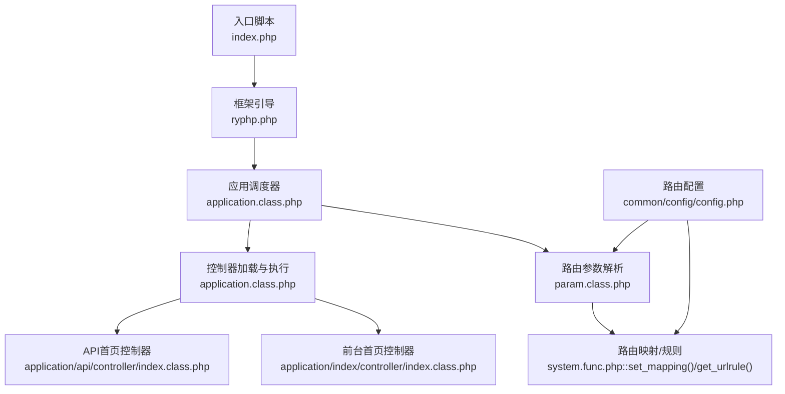
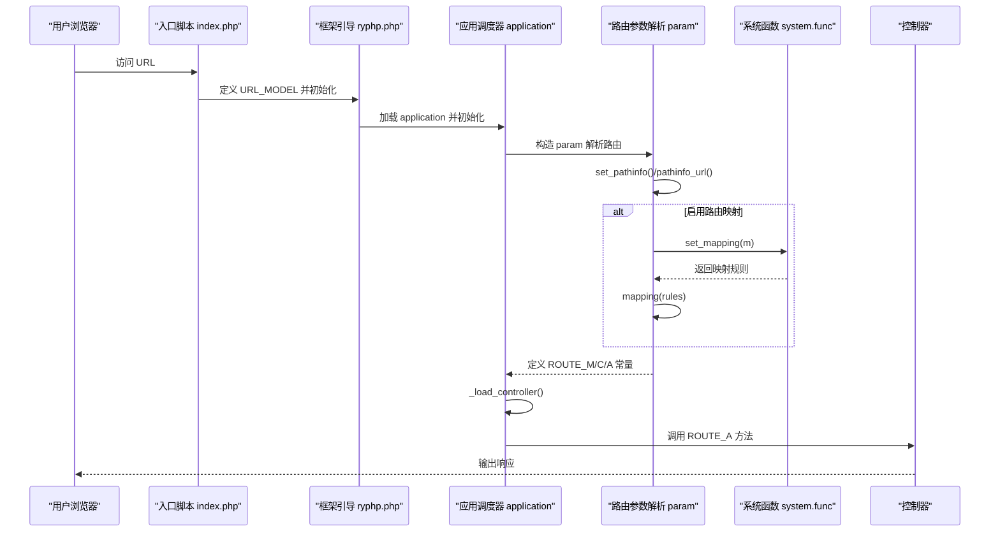
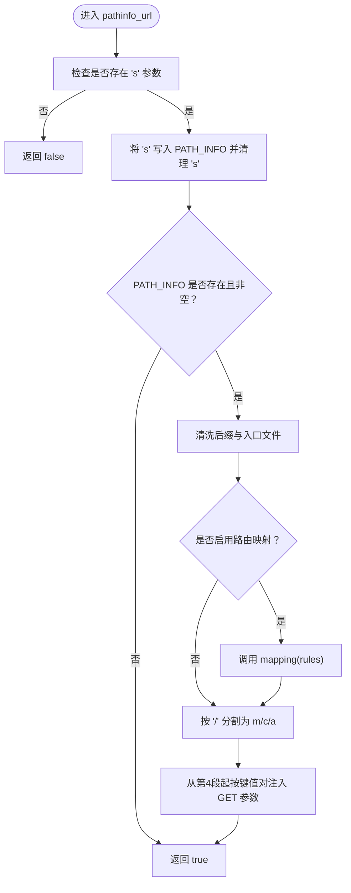
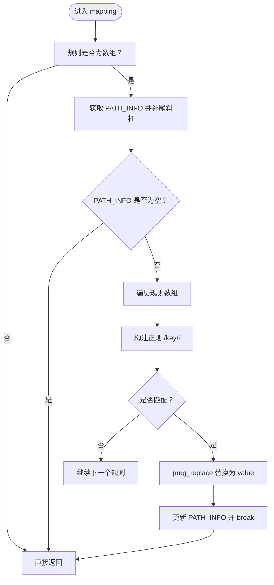
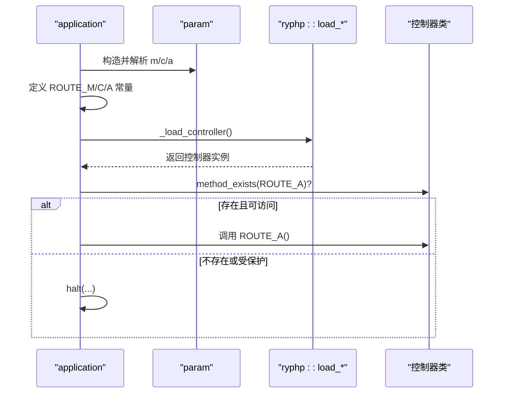
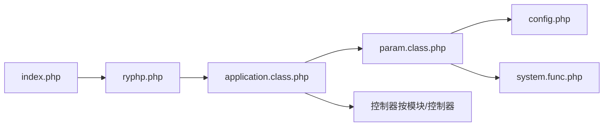

# 路由系统

<cite>
**本文引用的文件**
- [index.php](file://index.php)
- [ryphp.php](file://ryphp/ryphp.php)
- [param.class.php](file://ryphp/core/class/param.class.php)
- [application.class.php](file://ryphp/core/class/application.class.php)
- [config.php](file://common/config/config.php)
- [system.func.php](file://common/function/system.func.php)
- [index.class.php（前台首页控制器）](file://application/index/controller/index.class.php)
- [index.class.php（API首页控制器）](file://application/api/controller/index.class.php)
</cite>

## 目录
1. [引言](#引言)
2. [项目结构](#项目结构)
3. [核心组件](#核心组件)
4. [架构总览](#架构总览)
5. [详细组件分析](#详细组件分析)
6. [依赖关系分析](#依赖关系分析)
7. [性能考量](#性能考量)
8. [故障排查指南](#故障排查指南)
9. [结论](#结论)
10. [附录](#附录)

## 引言
本文件围绕路由系统进行深入技术说明，重点覆盖 param.class.php 中的 URL 参数解析机制，包括路由参数的提取、模块名、控制器名与方法名的解析过程；路由规则的匹配算法（URL 路径分析、参数映射与默认值处理）；以及路由系统与应用程序调度器之间的协作关系。同时提供路由配置的最佳实践与常见问题解决方案，涵盖 URL 重写规则、参数传递与路由缓存策略。

## 项目结构
路由系统位于 RYPHP 框架内，入口文件负责初始化系统与 URL 模式常量，param 类负责解析路由参数，application 类负责调度控制器与方法执行，配置文件提供默认路由与开关，系统函数提供路由映射与规则缓存能力。

图表来源
- [index.php](file://index.php#L10-L18)
- [ryphp.php](file://ryphp/ryphp.php#L88-L90)
- [application.class.php](file://ryphp/core/class/application.class.php#L9-L19)
- [param.class.php](file://ryphp/core/class/param.class.php#L7-L15)
- [system.func.php](file://common/function/system.func.php#L486-L505)
- [config.php](file://common/config/config.php#L23-L30)

章节来源
- [index.php](file://index.php#L10-L18)
- [ryphp.php](file://ryphp/ryphp.php#L88-L90)
- [application.class.php](file://ryphp/core/class/application.class.php#L9-L19)
- [param.class.php](file://ryphp/core/class/param.class.php#L7-L15)
- [system.func.php](file://common/function/system.func.php#L486-L505)
- [config.php](file://common/config/config.php#L23-L30)

## 核心组件
- 路由参数解析器 param：负责从 GET/POST 与 PATH_INFO 中提取 m/c/a，并进行安全处理与默认值回退；支持路由映射与额外键值参数解析。
- 应用调度器 application：在构造阶段加载 param 并定义 ROUTE_M/C/A 常量，随后加载控制器并调用对应方法。
- 路由配置 config：提供默认路由、URL 后缀、是否启用 PATH_INFO、是否启用路由映射等开关。
- 路由映射与规则 system.func：动态生成站点级映射规则与通用 URL 规则，结合缓存提升性能。
- 控制器层：按模块/控制器/方法组织，接收来自路由的参数并执行业务逻辑。

章节来源
- [param.class.php](file://ryphp/core/class/param.class.php#L19-L46)
- [application.class.php](file://ryphp/core/class/application.class.php#L14-L17)
- [config.php](file://common/config/config.php#L23-L30)
- [system.func.php](file://common/function/system.func.php#L486-L505)
- [index.class.php（前台首页控制器）](file://application/index/controller/index.class.php#L14-L17)
- [index.class.php（API首页控制器）](file://application/api/controller/index.class.php#L6-L17)

## 架构总览
路由系统工作流如下：入口设置 URL 模式常量，param 在 URL 模式开启时解析 PATH_INFO，应用路由映射规则，提取 m/c/a 与额外参数；application 依据这些常量加载控制器并调用方法。

图表来源
- [index.php](file://index.php#L10-L18)
- [ryphp.php](file://ryphp/ryphp.php#L88-L90)
- [application.class.php](file://ryphp/core/class/application.class.php#L9-L19)
- [param.class.php](file://ryphp/core/class/param.class.php#L95-L116)
- [system.func.php](file://common/function/system.func.php#L486-L505)

## 详细组件分析

### 路由参数解析机制（param.class.php）
- 默认值与优先级
  - m/c/a 优先从 GET/POST 获取，若为空则回退至配置中的默认值。
  - 安全处理：去除首尾空白、自动转义、长度限制、剔除非法字符，防止注入与越界。
- PATH_INFO 解析
  - 当 URL_MODEL 开启时，若配置允许 PATH_INFO，先通过 set_pathinfo 从 REQUEST_URI 中抽取路径；随后 pathinfo_url 清洗后缀与入口文件，应用路由映射，再按层级切分 m/c/a。
  - 额外参数：从第 4 个位置开始，每两个片段视为 key/value 对注入到 $_GET。
- 路由映射
  - mapping 使用正则匹配 PATH_INFO，命中即替换为映射后的路径，仅替换首个匹配项，避免重复替换。
  - 映射规则来源：set_mapping 动态生成站点级映射，合并通用 URL 规则与自定义规则，并带缓存。

图表来源
- [param.class.php](file://ryphp/core/class/param.class.php#L95-L116)
- [param.class.php](file://ryphp/core/class/param.class.php#L138-L151)
- [system.func.php](file://common/function/system.func.php#L486-L505)

章节来源
- [param.class.php](file://ryphp/core/class/param.class.php#L19-L46)
- [param.class.php](file://ryphp/core/class/param.class.php#L54-L60)
- [param.class.php](file://ryphp/core/class/param.class.php#L95-L116)
- [param.class.php](file://ryphp/core/class/param.class.php#L138-L151)
- [system.func.php](file://common/function/system.func.php#L486-L505)

### 路由规则匹配算法
- 规则来源与合并
  - set_mapping 生成站点级映射，包含栏目目录到控制器/动作的映射及分页、详情等规则；随后与通用 URL 规则合并，最终写入缓存。
  - get_urlrule 从数据库读取规则并缓存，形成正则表达式键与目标路由值的映射。
- 正则匹配与替换
  - mapping 遍历规则数组，将键作为正则表达式匹配 PATH_INFO，命中后使用 preg_replace 替换为映射值，更新 PATH_INFO 并中断后续匹配。
- 默认值处理
  - 若 PATH_INFO 无法解析出 m/c/a，param 回退到配置中的默认值。

图表来源
- [param.class.php](file://ryphp/core/class/param.class.php#L138-L151)
- [system.func.php](file://common/function/system.func.php#L473-L484)
- [system.func.php](file://common/function/system.func.php#L486-L505)

章节来源
- [system.func.php](file://common/function/system.func.php#L473-L484)
- [system.func.php](file://common/function/system.func.php#L486-L505)
- [param.class.php](file://ryphp/core/class/param.class.php#L138-L151)

### 路由系统与应用程序调度器协作
- 初始化阶段
  - application 构造函数加载 debug、注册错误/异常处理器，随后实例化 param 并定义 ROUTE_M/C/A 常量。
- 控制器加载与方法调用
  - init 中加载控制器，校验方法是否存在且未被保护（以下划线开头），随后反射调用该方法。
  - 调试模式下记录耗时与消息；非调试模式下根据配置输出错误页面或状态码。

图表来源
- [application.class.php](file://ryphp/core/class/application.class.php#L9-L19)
- [application.class.php](file://ryphp/core/class/application.class.php#L24-L40)
- [ryphp.php](file://ryphp/ryphp.php#L171-L175)

章节来源
- [application.class.php](file://ryphp/core/class/application.class.php#L9-L19)
- [application.class.php](file://ryphp/core/class/application.class.php#L24-L40)
- [ryphp.php](file://ryphp/ryphp.php#L171-L175)

### 控制器与方法调用示例
- 前台首页控制器：提供 init 方法，用于输出分类数据等。
- API 首页控制器：提供 code 方法，用于生成验证码并写入会话。

章节来源
- [index.class.php（前台首页控制器）](file://application/index/controller/index.class.php#L14-L17)
- [index.class.php（API首页控制器）](file://application/api/controller/index.class.php#L6-L17)

## 依赖关系分析
- 入口与框架引导
  - index.php 定义 URL_MODEL 并引入框架入口，触发应用初始化。
- 调度器与参数解析
  - application 在构造阶段依赖 param；param 依赖配置与系统函数提供的映射规则。
- 控制器加载
  - application 通过 ryphp::load_controller 按模块路径加载控制器类。

图表来源
- [index.php](file://index.php#L10-L18)
- [ryphp.php](file://ryphp/ryphp.php#L88-L90)
- [application.class.php](file://ryphp/core/class/application.class.php#L9-L19)
- [param.class.php](file://ryphp/core/class/param.class.php#L7-L15)
- [config.php](file://common/config/config.php#L23-L30)
- [system.func.php](file://common/function/system.func.php#L486-L505)

章节来源
- [index.php](file://index.php#L10-L18)
- [ryphp.php](file://ryphp/ryphp.php#L88-L90)
- [application.class.php](file://ryphp/core/class/application.class.php#L9-L19)
- [param.class.php](file://ryphp/core/class/param.class.php#L7-L15)
- [config.php](file://common/config/config.php#L23-L30)
- [system.func.php](file://common/function/system.func.php#L486-L505)

## 性能考量
- 路由映射缓存
  - set_mapping 与 get_urlrule 均采用缓存策略，避免每次请求都查询数据库，建议在后台变更路由规则后清理对应缓存键。
- PATH_INFO 处理
  - 仅在 URL_MODEL 开启且配置允许时才进行 PATH_INFO 抽取与解析，减少不必要的处理。
- 参数解析复杂度
  - PATH_INFO 解析为 O(n)（n 为片段数），额外键值对遍历也为线性，整体开销可控。
- 安全与健壮性
  - 安全处理包含长度限制与字符过滤，降低注入风险；映射仅替换首个匹配项，避免过度替换导致路径异常。

## 故障排查指南
- 访问 404 或控制器不存在
  - 检查 ROUTE_M/C/A 是否正确解析，确认模块目录与控制器文件是否存在。
  - 确认 URL 模式与 PATH_INFO 配置是否正确。
- 路由映射不生效
  - 确认 route_mapping 开关已启用；检查 set_mapping 返回的规则是否包含目标路径；必要时清理缓存后重试。
- 参数丢失或解析异常
  - 检查 PATH_INFO 是否被正确清洗（后缀与入口文件）；确认额外键值对的键名与值是否符合预期。
- 调试模式下报错
  - application 在非调试模式下可能隐藏错误页面，建议临时开启调试定位问题。

章节来源
- [application.class.php](file://ryphp/core/class/application.class.php#L52-L64)
- [application.class.php](file://ryphp/core/class/application.class.php#L108-L115)
- [param.class.php](file://ryphp/core/class/param.class.php#L95-L116)
- [config.php](file://common/config/config.php#L27-L29)

## 结论
该路由系统通过 param 的参数解析与映射机制，结合 application 的调度流程，实现了清晰的模块/控制器/方法解析与调用链路。配合缓存与安全处理，既保证了灵活性，也兼顾了性能与安全性。建议在生产环境合理配置 URL 模式与路由映射，并建立完善的缓存清理与监控机制。

## 附录

### 路由配置最佳实践
- URL 模式与 PATH_INFO
  - Nginx/Apache 环境下根据实际支持情况设置 URL_MODEL 与 set_pathinfo；若服务器不支持 PATH_INFO，应关闭 PATH_INFO 模式或调整服务器配置。
- 默认路由与后缀
  - 合理设置默认模块/控制器/方法，统一 URL 后缀以利于 SEO 与缓存。
- 路由映射与规则
  - 使用 set_mapping 生成站点级映射，结合 get_urlrule 实现灵活的伪静态规则；变更规则后及时清理缓存。
- 参数传递
  - 使用额外键值对传递参数时，注意键名与值的合法性，避免与保留字冲突。

章节来源
- [config.php](file://common/config/config.php#L10-L11)
- [config.php](file://common/config/config.php#L23-L30)
- [system.func.php](file://common/function/system.func.php#L473-L484)
- [system.func.php](file://common/function/system.func.php#L486-L505)