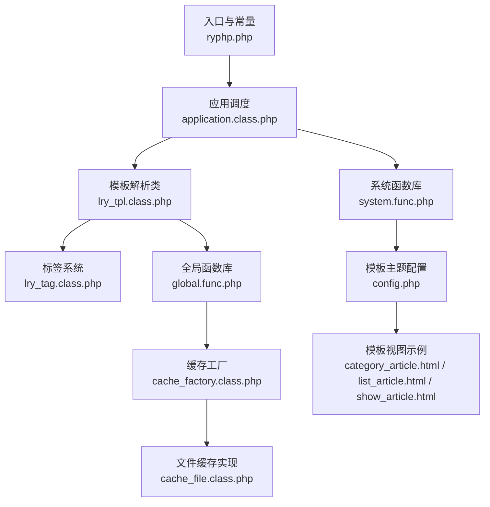
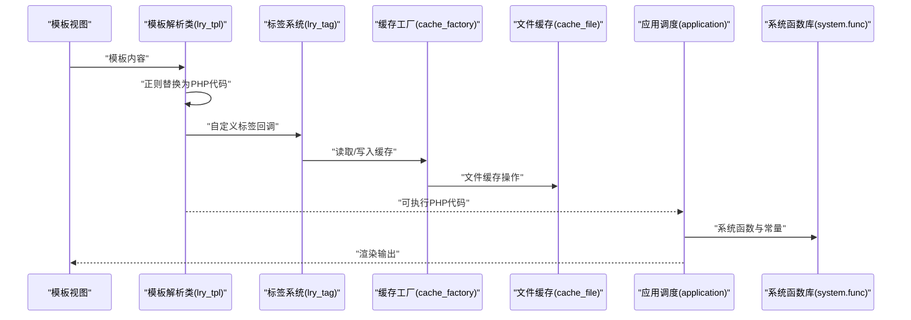
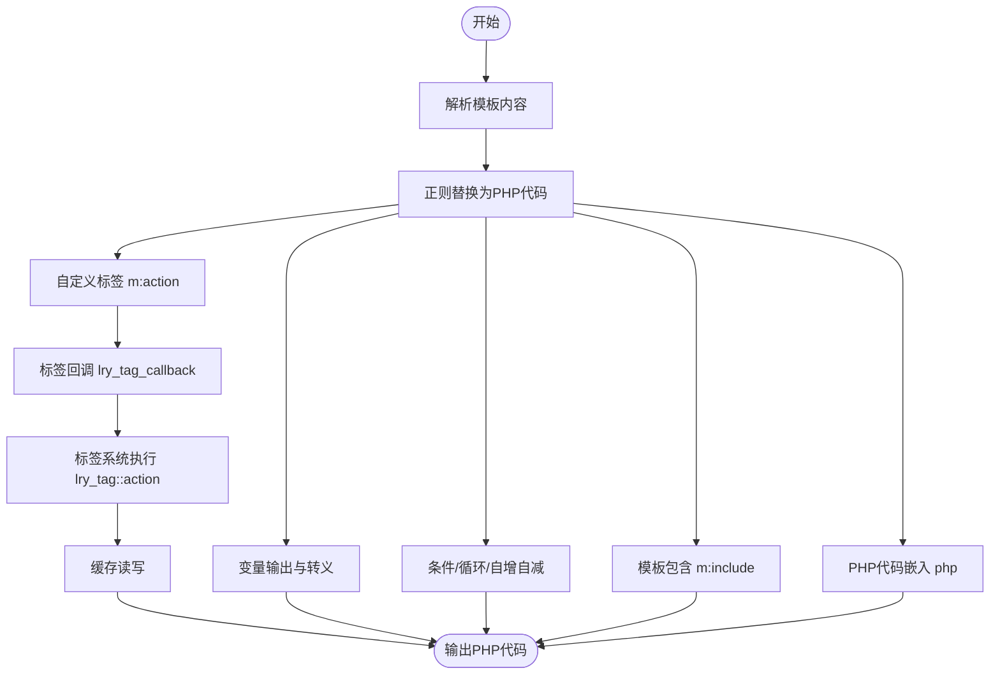
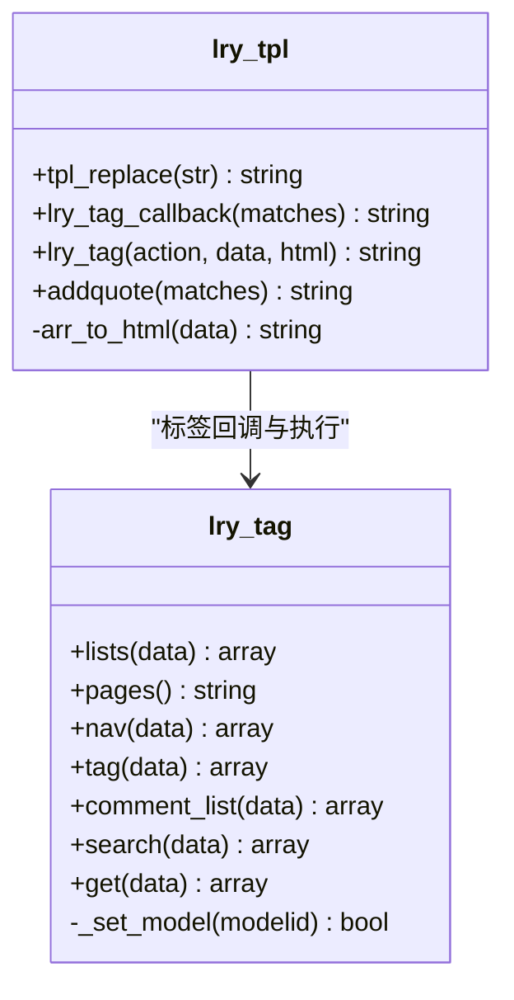
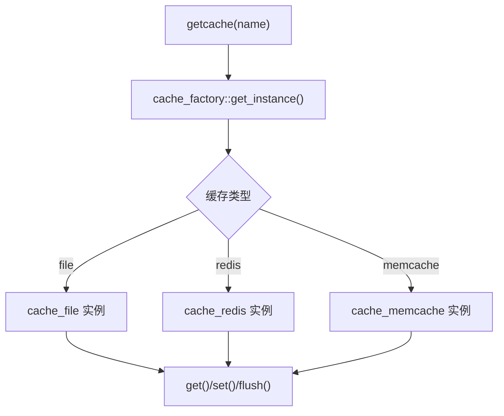
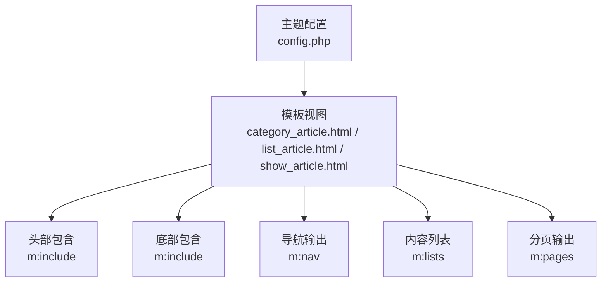
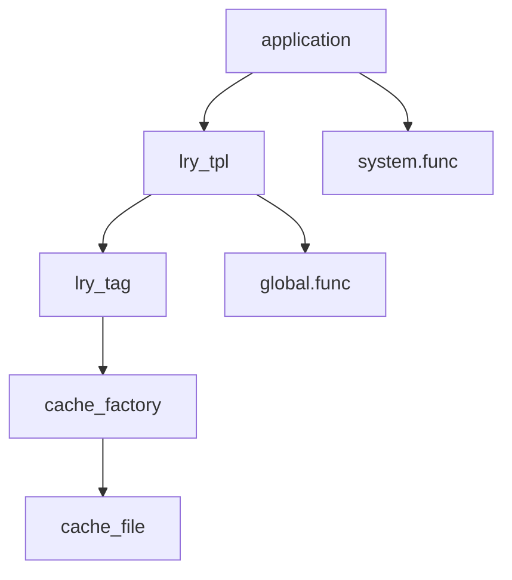

# 模板引擎

<cite>
**本文引用的文件**
- [lry_tpl.class.php](file://ryphp/core/class/lry_tpl.class.php)
- [lry_tag.class.php](file://ryphp/core/class/lry_tag.class.php)
- [cache_file.class.php](file://ryphp/core/class/cache_file.class.php)
- [cache_factory.class.php](file://ryphp/core/class/cache_factory.class.php)
- [global.func.php](file://ryphp/core/function/global.func.php)
- [system.func.php](file://common/function/system.func.php)
- [ryphp.php](file://ryphp/ryphp.php)
- [application.class.php](file://ryphp/core/class/application.class.php)
- [debug.tpl](file://ryphp/core/message/debug.tpl)
- [config.php](file://application/index/view/rongyao/config.php)
- [category_article.html](file://application/index/view/rongyao/category_article.html)
- [list_article.html](file://application/index/view/rongyao/list_article.html)
- [show_article.html](file://application/index/view/rongyao/show_article.html)
</cite>

## 目录
1. [引言](#引言)
2. [项目结构](#项目结构)
3. [核心组件](#核心组件)
4. [架构总览](#架构总览)
5. [详细组件分析](#详细组件分析)
6. [依赖关系分析](#依赖关系分析)
7. [性能考量](#性能考量)
8. [故障排查指南](#故障排查指南)
9. [结论](#结论)
10. [附录](#附录)

## 引言
本文件面向前端开发者与模板设计师，系统化梳理 LRYBlog 模板引擎的设计理念与实现机制，覆盖模板解析、编译与执行流程；模板语法系统（变量输出、条件判断、循环控制、模板包含与自定义标签）；自定义标签扩展能力；模板缓存机制（编译、缓存存储与失效策略）；模板继承与布局思路；以及调试工具、性能优化与最佳实践。

## 项目结构
LRYBlog 模板引擎位于 RYPHP 框架内，核心由模板解析类、标签系统、缓存工厂与文件缓存实现、全局函数库与系统函数库组成，并通过入口文件与应用调度类协同工作。

**图表来源**
- [ryphp.php](file://ryphp/ryphp.php#L1-L204)
- [application.class.php](file://ryphp/core/class/application.class.php#L1-L118)
- [lry_tpl.class.php](file://ryphp/core/class/lry_tpl.class.php#L1-L134)
- [lry_tag.class.php](file://ryphp/core/class/lry_tag.class.php#L1-L492)
- [global.func.php](file://ryphp/core/function/global.func.php#L1-L800)
- [cache_factory.class.php](file://ryphp/core/class/cache_factory.class.php#L1-L84)
- [cache_file.class.php](file://ryphp/core/class/cache_file.class.php#L1-L130)
- [system.func.php](file://common/function/system.func.php#L1-L800)
- [config.php](file://application/index/view/rongyao/config.php#L1-L29)
- [category_article.html](file://application/index/view/rongyao/category_article.html#L1-L53)
- [list_article.html](file://application/index/view/rongyao/list_article.html#L1-L150)
- [show_article.html](file://application/index/view/rongyao/show_article.html#L1-L518)

**章节来源**
- [ryphp.php](file://ryphp/ryphp.php#L1-L204)
- [application.class.php](file://ryphp/core/class/application.class.php#L1-L118)
- [lry_tpl.class.php](file://ryphp/core/class/lry_tpl.class.php#L1-L134)
- [lry_tag.class.php](file://ryphp/core/class/lry_tag.class.php#L1-L492)
- [global.func.php](file://ryphp/core/function/global.func.php#L1-L800)
- [cache_factory.class.php](file://ryphp/core/class/cache_factory.class.php#L1-L84)
- [cache_file.class.php](file://ryphp/core/class/cache_file.class.php#L1-L130)
- [system.func.php](file://common/function/system.func.php#L1-L800)
- [config.php](file://application/index/view/rongyao/config.php#L1-L29)

## 核心组件
- 模板解析类：负责将模板中的自定义标签语法转换为 PHP 代码，支持变量输出、条件、循环、自增自减、模板包含与自定义标签回调。
- 标签系统：内置多种业务标签（内容列表、分页、导航、标签云、评论、搜索等），支持缓存与分页。
- 缓存体系：通过缓存工厂选择具体缓存实现（文件/Redis/Memcache），文件缓存默认持久化至 cache/cache_file 目录。
- 全局函数库：提供配置读取、缓存读写、URL 生成、调试输出等通用能力。
- 应用调度：路由解析、控制器加载与动作执行，配合调试消息输出。

**章节来源**
- [lry_tpl.class.php](file://ryphp/core/class/lry_tpl.class.php#L1-L134)
- [lry_tag.class.php](file://ryphp/core/class/lry_tag.class.php#L1-L492)
- [cache_factory.class.php](file://ryphp/core/class/cache_factory.class.php#L1-L84)
- [cache_file.class.php](file://ryphp/core/class/cache_file.class.php#L1-L130)
- [global.func.php](file://ryphp/core/function/global.func.php#L1-L800)
- [application.class.php](file://ryphp/core/class/application.class.php#L1-L118)

## 架构总览
模板引擎工作流从模板文件开始，经由模板解析类转换为 PHP 代码，再由标签系统执行业务逻辑，必要时通过缓存工厂与文件缓存实现读写缓存，最终由应用调度与系统函数库支撑运行环境与调试输出。

**图表来源**
- [lry_tpl.class.php](file://ryphp/core/class/lry_tpl.class.php#L31-L59)
- [lry_tag.class.php](file://ryphp/core/class/lry_tag.class.php#L70-L92)
- [cache_factory.class.php](file://ryphp/core/class/cache_factory.class.php#L36-L82)
- [cache_file.class.php](file://ryphp/core/class/cache_file.class.php#L17-L46)
- [application.class.php](file://ryphp/core/class/application.class.php#L24-L40)
- [system.func.php](file://common/function/system.func.php#L1-L800)

## 详细组件分析

### 模板解析与语法系统
- 标签界定符：默认使用大括号作为左右界定符，可在类中调整。
- 变量输出：支持普通变量、常量、对象属性、数组索引与带方括号的动态索引；自动转义与引号处理。
- 控制结构：支持 if/else/elseif、for、/if、/for；循环支持 loop 标签，支持 foreach 两种语法。
- 自增自减：支持前置/后置的 ++/-- 操作。
- 模板包含：m:include 语法用于包含其他模板片段。
- 自定义标签：m:action 参数形式，支持 cache、page、return 等参数，结合标签系统执行业务逻辑。
- PHP 代码嵌入：php 标签可直接嵌入 PHP 代码。

**图表来源**
- [lry_tpl.class.php](file://ryphp/core/class/lry_tpl.class.php#L31-L59)
- [lry_tpl.class.php](file://ryphp/core/class/lry_tpl.class.php#L62-L92)
- [lry_tpl.class.php](file://ryphp/core/class/lry_tpl.class.php#L101-L104)

**章节来源**
- [lry_tpl.class.php](file://ryphp/core/class/lry_tpl.class.php#L10-L134)

### 自定义标签系统
- 标签注册与调用：模板中以 m:action 形式调用，解析类将参数解析为数组，传递给标签系统。
- 标签执行：标签系统根据 action 名调用对应方法，支持 where/sql/order/limit/field/catid 等常用参数。
- 分页与缓存：支持 page 参数触发分页，支持 cache 参数开启缓存并设置过期时间；返回数据可自定义变量名。
- 标签示例：内容列表、导航、标签云、评论、搜索、自定义 SQL 等。

**图表来源**
- [lry_tpl.class.php](file://ryphp/core/class/lry_tpl.class.php#L62-L92)
- [lry_tag.class.php](file://ryphp/core/class/lry_tag.class.php#L18-L65)
- [lry_tag.class.php](file://ryphp/core/class/lry_tag.class.php#L137-L146)
- [lry_tag.class.php](file://ryphp/core/class/lry_tag.class.php#L177-L193)
- [lry_tag.class.php](file://ryphp/core/class/lry_tag.class.php#L292-L310)
- [lry_tag.class.php](file://ryphp/core/class/lry_tag.class.php#L360-L450)
- [lry_tag.class.php](file://ryphp/core/class/lry_tag.class.php#L458-L477)

**章节来源**
- [lry_tpl.class.php](file://ryphp/core/class/lry_tpl.class.php#L62-L92)
- [lry_tag.class.php](file://ryphp/core/class/lry_tag.class.php#L1-L492)

### 模板缓存机制
- 缓存工厂：根据配置选择缓存实现（文件/Redis/Memcache），懒加载单例实例。
- 文件缓存：默认实现，持久化到 cache/cache_file 目录，支持过期时间、序列化存储与文件锁写入。
- 缓存读写：全局函数 getcache/setcache 统一封装，标签系统在自定义标签中使用缓存读写与分页。

**图表来源**
- [global.func.php](file://ryphp/core/function/global.func.php#L147-L151)
- [global.func.php](file://ryphp/core/function/global.func.php#L585-L589)
- [cache_factory.class.php](file://ryphp/core/class/cache_factory.class.php#L36-L82)
- [cache_file.class.php](file://ryphp/core/class/cache_file.class.php#L17-L46)

**章节来源**
- [cache_factory.class.php](file://ryphp/core/class/cache_factory.class.php#L1-L84)
- [cache_file.class.php](file://ryphp/core/class/cache_file.class.php#L1-L130)
- [global.func.php](file://ryphp/core/function/global.func.php#L147-L151)
- [global.func.php](file://ryphp/core/function/global.func.php#L585-L589)

### 模板继承与布局
- 主题配置：模板主题通过配置文件声明分类、列表、内容页模板映射，便于切换与管理。
- 视图示例：列表页与内容页模板展示了包含头部/底部、导航、侧边栏、分页与标签云等布局元素的组合方式。
- 布局建议：通过 m:include 与变量输出实现头部/底部复用；通过标签系统输出导航、分页与推荐内容，形成可复用的页面结构。

**图表来源**
- [config.php](file://application/index/view/rongyao/config.php#L1-L29)
- [category_article.html](file://application/index/view/rongyao/category_article.html#L21-L52)
- [list_article.html](file://application/index/view/rongyao/list_article.html#L48-L149)
- [show_article.html](file://application/index/view/rongyao/show_article.html#L50-L517)

**章节来源**
- [config.php](file://application/index/view/rongyao/config.php#L1-L29)
- [category_article.html](file://application/index/view/rongyao/category_article.html#L1-L53)
- [list_article.html](file://application/index/view/rongyao/list_article.html#L1-L150)
- [show_article.html](file://application/index/view/rongyao/show_article.html#L1-L518)

### 调试工具与开发体验
- 调试面板：提供可展开/收起的调试信息面板，展示系统信息、SQL 语句、请求参数与路由信息。
- 应用层调试：应用调度类注册错误/异常处理器，支持致命错误捕获与友好提示页。
- 开发建议：在开发阶段启用调试模式，利用调试面板定位模板与标签问题。

**章节来源**
- [debug.tpl](file://ryphp/core/message/debug.tpl#L1-L75)
- [application.class.php](file://ryphp/core/class/application.class.php#L9-L19)
- [application.class.php](file://ryphp/core/class/application.class.php#L108-L115)

## 依赖关系分析
- 模板解析依赖标签系统与全局函数库；标签系统依赖缓存工厂与数据库访问；应用调度依赖路由参数与系统函数库。
- 缓存工厂根据配置选择具体缓存实现，文件缓存默认持久化到 cache/cache_file 目录。

**图表来源**
- [lry_tpl.class.php](file://ryphp/core/class/lry_tpl.class.php#L62-L92)
- [lry_tag.class.php](file://ryphp/core/class/lry_tag.class.php#L70-L92)
- [cache_factory.class.php](file://ryphp/core/class/cache_factory.class.php#L36-L82)
- [cache_file.class.php](file://ryphp/core/class/cache_file.class.php#L17-L46)
- [global.func.php](file://ryphp/core/function/global.func.php#L147-L151)
- [system.func.php](file://common/function/system.func.php#L1-L800)
- [application.class.php](file://ryphp/core/class/application.class.php#L24-L40)

**章节来源**
- [lry_tpl.class.php](file://ryphp/core/class/lry_tpl.class.php#L1-L134)
- [lry_tag.class.php](file://ryphp/core/class/lry_tag.class.php#L1-L492)
- [cache_factory.class.php](file://ryphp/core/class/cache_factory.class.php#L1-L84)
- [cache_file.class.php](file://ryphp/core/class/cache_file.class.php#L1-L130)
- [global.func.php](file://ryphp/core/function/global.func.php#L1-L800)
- [system.func.php](file://common/function/system.func.php#L1-L800)
- [application.class.php](file://ryphp/core/class/application.class.php#L1-L118)

## 性能考量
- 标签缓存：通过 cache 参数为标签结果设置过期时间，减少重复查询与计算。
- 分页优化：标签系统在 page 参数下计算总数并生成分页，避免一次性加载大量数据。
- 文件缓存：文件缓存支持过期时间与序列化存储，写入时使用文件锁保证并发安全。
- 模板编译：模板解析为 PHP 代码后由 PHP 引擎执行，建议在生产环境启用 OPcache 以提升执行效率。
- 资源加载：模板中可通过预加载与延迟加载策略优化关键与非关键资源的加载顺序。

[本节为通用指导，不直接分析具体文件]

## 故障排查指南
- 模板包含路径错误：确认 m:include 的模块与模板名正确，确保模板文件存在。
- 标签参数缺失：检查标签参数（如 catid、modelid、limit、page、cache 等）是否齐全与合法。
- 缓存异常：检查缓存目录权限与磁盘空间，确认缓存过期时间设置合理。
- 调试信息：启用调试模式查看 SQL 与请求详情，定位问题来源。
- 路由与控制器：若动作不可访问或控制器不存在，检查路由参数与控制器文件路径。

**章节来源**
- [application.class.php](file://ryphp/core/class/application.class.php#L52-L64)
- [application.class.php](file://ryphp/core/class/application.class.php#L108-L115)
- [debug.tpl](file://ryphp/core/message/debug.tpl#L1-L75)

## 结论
LRYBlog 模板引擎以简洁的自定义标签语法为核心，结合标签系统与缓存机制，实现了高扩展与高性能的模板渲染方案。通过主题配置与视图示例，开发者可以快速搭建可复用的页面结构。建议在生产环境合理使用标签缓存与分页，配合调试工具与性能优化手段，持续提升用户体验与开发效率。

[本节为总结性内容，不直接分析具体文件]

## 附录

### 模板语法速查
- 变量输出：使用界定符包裹变量或函数调用。
- 条件判断：if/else/elseif 与 /if。
- 循环控制：for 与 /for；loop 与 /loop。
- 自增自减：++/-- 前置/后置。
- 模板包含：m:include 模块, 模板。
- 自定义标签：m:action 参数=值 ... cache/page/return 等。

**章节来源**
- [lry_tpl.class.php](file://ryphp/core/class/lry_tpl.class.php#L31-L59)

### 标签系统常用标签
- 内容列表：lists（catid/modelid/limit/field/order/where/page/cache 等）。
- 分页：pages（配合 lists 的 page 参数）。
- 导航：nav（siteid/field/order/limit/where）。
- 标签云：tag（siteid/catid/field/order/limit/page）。
- 评论：comment_list（modelid/catid/id/limit/page）。
- 搜索：search（siteid/catid/modelid/keyword/search/order/limit/page）。
- 自定义 SQL：get（sql/where/order/limit/page）。

**章节来源**
- [lry_tag.class.php](file://ryphp/core/class/lry_tag.class.php#L18-L65)
- [lry_tag.class.php](file://ryphp/core/class/lry_tag.class.php#L69-L77)
- [lry_tag.class.php](file://ryphp/core/class/lry_tag.class.php#L137-L146)
- [lry_tag.class.php](file://ryphp/core/class/lry_tag.class.php#L177-L193)
- [lry_tag.class.php](file://ryphp/core/class/lry_tag.class.php#L292-L310)
- [lry_tag.class.php](file://ryphp/core/class/lry_tag.class.php#L360-L450)
- [lry_tag.class.php](file://ryphp/core/class/lry_tag.class.php#L458-L477)

### 模板使用示例要点
- 列表页：包含头部与底部、导航、侧边栏、分页与标签云。
- 内容页：包含头部与底部、面包屑导航、正文、标签与原文链接、相关推荐、评论区。
- 分类页：包含头部与底部、子分类与内容列表。

**章节来源**
- [category_article.html](file://application/index/view/rongyao/category_article.html#L1-L53)
- [list_article.html](file://application/index/view/rongyao/list_article.html#L1-L150)
- [show_article.html](file://application/index/view/rongyao/show_article.html#L1-L518)