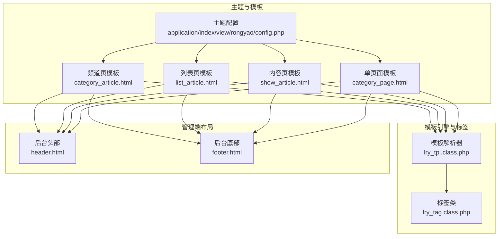
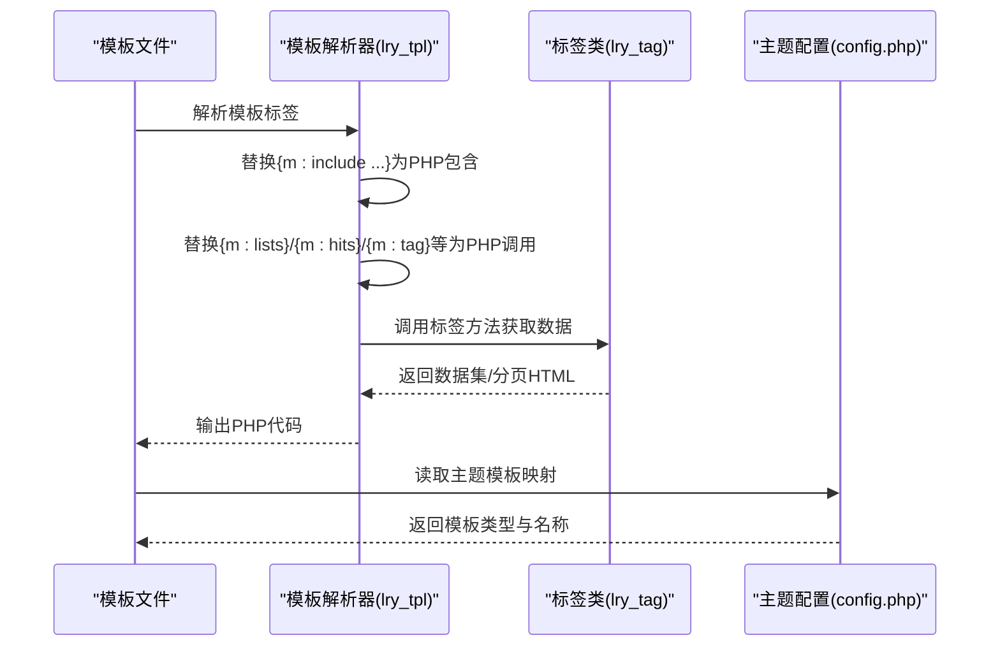
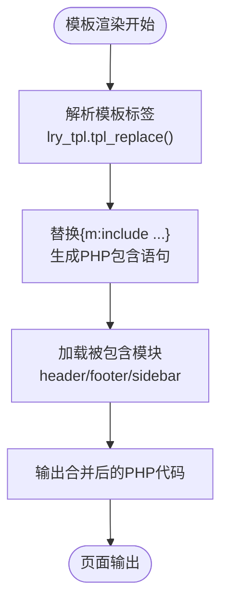
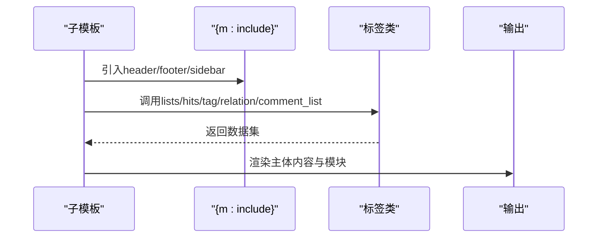
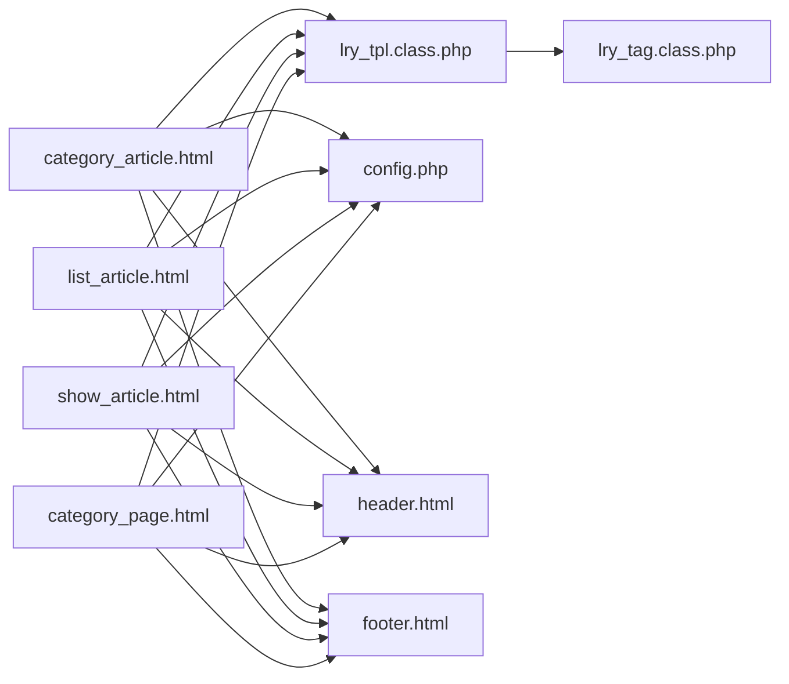

# 模板继承与布局

<cite>
**本文引用的文件**
- [lry_tpl.class.php](file://ryphp/core/class/lry_tpl.class.php)
- [lry_tag.class.php](file://ryphp/core/class/lry_tag.class.php)
- [config.php](file://application/index/view/rongyao/config.php)
- [category_article.html](file://application/index/view/rongyao/category_article.html)
- [category_page.html](file://application/index/view/rongyao/category_page.html)
- [list_article.html](file://application/index/view/rongyao/list_article.html)
- [show_article.html](file://application/index/view/rongyao/show_article.html)
- [header.html](file://application/lry_admin_center/view/header.html)
- [footer.html](file://application/lry_admin_center/view/footer.html)
- [category.class.php](file://application/lry_admin_center/controller/category.class.php)
- [lry-style.css](file://common/static/css/lry-style.css)
- [lry_common.js](file://common/static/js/lry_common.js)
</cite>

## 目录
1. [简介](#简介)
2. [项目结构](#项目结构)
3. [核心组件](#核心组件)
4. [架构总览](#架构总览)
5. [详细组件分析](#详细组件分析)
6. [依赖关系分析](#依赖关系分析)
7. [性能考量](#性能考量)
8. [故障排查指南](#故障排查指南)
9. [结论](#结论)
10. [附录](#附录)

## 简介
本文件面向LRYBlog的模板继承与布局系统，聚焦以下目标：
- 详解模板包含与继承机制：基于自定义标签{m:include ...}的模块化拼装与主题目录下的模板组织。
- 深入说明布局模板设计原则与复用策略，指导如何构建可扩展的页面骨架。
- 解释子模板如何覆盖与扩展父模板的内容区域，涵盖区块定义、内容替换与条件继承思路。
- 总结模板布局最佳实践（头部、尾部、侧边栏），并提供调试技巧与性能优化建议。

## 项目结构
LRYBlog采用“主题目录 + 模板标签 + 标签类”的组合式模板体系：
- 主题配置：通过主题目录下的配置文件声明可用模板类型与映射。
- 模板文件：按页面类型（频道页、列表页、内容页、单页面等）组织在主题目录内。
- 模板引擎：将模板中的自定义标签转换为PHP代码，实现包含、循环、判断、函数调用等能力。
- 标签类：提供内容列表、分页、评论、标签、相关文章等业务标签，供模板直接调用。

图表来源
- [config.php](file://application/index/view/rongyao/config.php#L1-L29)
- [category_article.html](file://application/index/view/rongyao/category_article.html#L1-L53)
- [list_article.html](file://application/index/view/rongyao/list_article.html#L1-L150)
- [show_article.html](file://application/index/view/rongyao/show_article.html#L1-L518)
- [category_page.html](file://application/index/view/rongyao/category_page.html#L1-L59)
- [lry_tpl.class.php](file://ryphp/core/class/lry_tpl.class.php#L31-L58)
- [lry_tag.class.php](file://ryphp/core/class/lry_tag.class.php#L18-L65)
- [header.html](file://application/lry_admin_center/view/header.html#L1-L51)
- [footer.html](file://application/lry_admin_center/view/footer.html#L1-L6)

章节来源
- [config.php](file://application/index/view/rongyao/config.php#L1-L29)
- [category_article.html](file://application/index/view/rongyao/category_article.html#L1-L53)
- [list_article.html](file://application/index/view/rongyao/list_article.html#L1-L150)
- [show_article.html](file://application/index/view/rongyao/show_article.html#L1-L518)
- [category_page.html](file://application/index/view/rongyao/category_page.html#L1-L59)
- [lry_tpl.class.php](file://ryphp/core/class/lry_tpl.class.php#L31-L58)
- [lry_tag.class.php](file://ryphp/core/class/lry_tag.class.php#L18-L65)
- [header.html](file://application/lry_admin_center/view/header.html#L1-L51)
- [footer.html](file://application/lry_admin_center/view/footer.html#L1-L6)

## 核心组件
- 模板解析器（lry_tpl）
  - 将模板中的自定义标签转换为PHP代码，支持包含、条件、循环、函数输出等。
  - 关键点：{m:include ...}被转换为PHP包含语句；{php ...}原样嵌入PHP；{if}/{else}/{elseif}/{/if}、{for}/{/for}、{loop}/{/loop}等控制结构；变量输出与函数调用。
- 标签类（lry_tag）
  - 提供内容列表、分页、点击排行、导航、标签、评论、相关文章、搜索等标签，供模板直接调用。
  - 关键点：统一的数据查询入口，支持分页、排序、过滤、关联查询等。
- 主题配置（config.php）
  - 声明主题名称、作者、版本以及各类模板映射，用于模板选择与回显。
- 模板文件（category_article、list_article、show_article、category_page）
  - 以{m:include ...}拼装头部、尾部、侧边栏等模块；使用标签类输出动态内容；遵循统一的页面骨架。

章节来源
- [lry_tpl.class.php](file://ryphp/core/class/lry_tpl.class.php#L31-L58)
- [lry_tag.class.php](file://ryphp/core/class/lry_tag.class.php#L18-L65)
- [config.php](file://application/index/view/rongyao/config.php#L1-L29)
- [category_article.html](file://application/index/view/rongyao/category_article.html#L21-L52)
- [list_article.html](file://application/index/view/rongyao/list_article.html#L48-L149)
- [show_article.html](file://application/index/view/rongyao/show_article.html#L50-L517)
- [category_page.html](file://application/index/view/rongyao/category_page.html#L48-L58)

## 架构总览
模板从“主题配置”出发，由“模板解析器”将模板标签编译为PHP，再由“标签类”提供数据支撑，最终渲染为页面。管理端页面同样采用模块化布局（header/footer）。

图表来源
- [lry_tpl.class.php](file://ryphp/core/class/lry_tpl.class.php#L31-L58)
- [lry_tag.class.php](file://ryphp/core/class/lry_tag.class.php#L18-L65)
- [config.php](file://application/index/view/rongyao/config.php#L1-L29)

章节来源
- [lry_tpl.class.php](file://ryphp/core/class/lry_tpl.class.php#L31-L58)
- [lry_tag.class.php](file://ryphp/core/class/lry_tag.class.php#L18-L65)
- [config.php](file://application/index/view/rongyao/config.php#L1-L29)

## 详细组件分析

### 组件A：模板包含与继承（基于{m:include}）
- 设计要点
  - {m:include "index","header"} 等语法被解析器转换为PHP包含语句，实现头部、尾部、侧边栏等模块化复用。
  - 子模板通过包含不同模块，形成统一的页面骨架，便于维护与扩展。
- 实践建议
  - 将公共头部、尾部、侧边栏分别独立为模块文件，避免重复代码。
  - 在主题配置中明确模板类型映射，便于后台选择与回显。
- 调试技巧
  - 检查包含路径是否正确（相对主题目录）。
  - 确认模板标签已被解析器替换为PHP包含语句。
  - 若出现空白或报错，优先检查被包含模块是否存在且语法正确。

图表来源
- [lry_tpl.class.php](file://ryphp/core/class/lry_tpl.class.php#L31-L32)
- [category_article.html](file://application/index/view/rongyao/category_article.html#L21-L52)
- [list_article.html](file://application/index/view/rongyao/list_article.html#L48-L149)
- [show_article.html](file://application/index/view/rongyao/show_article.html#L50-L517)
- [category_page.html](file://application/index/view/rongyao/category_page.html#L48-L58)

章节来源
- [lry_tpl.class.php](file://ryphp/core/class/lry_tpl.class.php#L31-L32)
- [category_article.html](file://application/index/view/rongyao/category_article.html#L21-L52)
- [list_article.html](file://application/index/view/rongyao/list_article.html#L48-L149)
- [show_article.html](file://application/index/view/rongyao/show_article.html#L50-L517)
- [category_page.html](file://application/index/view/rongyao/category_page.html#L48-L58)

### 组件B：布局模板设计与复用
- 设计原则
  - 以“容器 + 区块”划分页面结构：头部、主体内容区、侧边栏、尾部。
  - 通过{m:include}拼装模块，减少重复代码，提升一致性。
  - 列表页与内容页共享通用样式与脚本，按需延迟加载非关键资源。
- 复用策略
  - 将导航、面包屑、侧栏推荐、标签云等作为独立模块，供多个模板包含。
  - 使用主题配置集中管理模板类型与名称，便于后台选择。
- 标准布局模式
  - 频道页：顶部横幅 + 主体内容 + 侧边栏。
  - 列表页：面包屑导航 + 文章列表 + 侧边栏。
  - 内容页：面包屑导航 + 文章详情 + 评论区 + 侧边栏。
  - 单页面：标题 + 内容 + 右侧模块。

章节来源
- [category_article.html](file://application/index/view/rongyao/category_article.html#L1-L53)
- [list_article.html](file://application/index/view/rongyao/list_article.html#L1-L150)
- [show_article.html](file://application/index/view/rongyao/show_article.html#L1-L518)
- [category_page.html](file://application/index/view/rongyao/category_page.html#L1-L59)
- [config.php](file://application/index/view/rongyao/config.php#L1-L29)

### 组件C：子模板覆盖与扩展父模板
- 覆盖方式
  - 子模板通过{m:include}引入统一头部与尾部，同时在主体区域内插入自身特有内容（如列表、详情、评论）。
  - 通过标签类提供的数据接口（如列表、分页、相关文章、评论）实现内容替换与扩展。
- 条件继承
  - 在模板中使用{if}/{else}/{elseif}等控制结构，根据上下文（如是否有缩略图、是否登录用户等）决定展示内容。
- 示例参考
  - 列表页：{m:lists ...}输出文章列表，{m:hits}输出点击排行，{m:tag}输出标签云。
  - 内容页：{m:relation}输出相关文章，{m:comment_list}输出评论列表。

图表来源
- [lry_tpl.class.php](file://ryphp/core/class/lry_tpl.class.php#L34-L37)
- [lry_tag.class.php](file://ryphp/core/class/lry_tag.class.php#L18-L65)
- [list_article.html](file://application/index/view/rongyao/list_article.html#L54-L73)
- [show_article.html](file://application/index/view/rongyao/show_article.html#L183-L310)

章节来源
- [lry_tpl.class.php](file://ryphp/core/class/lry_tpl.class.php#L34-L37)
- [lry_tag.class.php](file://ryphp/core/class/lry_tag.class.php#L18-L65)
- [list_article.html](file://application/index/view/rongyao/list_article.html#L54-L73)
- [show_article.html](file://application/index/view/rongyao/show_article.html#L183-L310)

### 组件D：模板布局最佳实践
- 头部与尾部
  - 使用{m:include "index","header"}与{m:include "index","footer"}统一管理。
  - 后台管理端采用独立的header/footer模块，确保一致的导航与工具条。
- 侧边栏
  - 推荐模块：专题推荐、随机推荐、点击排行、标签云、关注我们等。
  - 通过标签类实现动态数据注入，保持内容新鲜度。
- 样式与脚本
  - 关键CSS与JS预加载，非关键资源延迟加载，提升首屏性能。
  - 统一的CSS命名规范，便于维护与扩展。

章节来源
- [category_article.html](file://application/index/view/rongyao/category_article.html#L21-L52)
- [list_article.html](file://application/index/view/rongyao/list_article.html#L48-L149)
- [show_article.html](file://application/index/view/rongyao/show_article.html#L50-L517)
- [category_page.html](file://application/index/view/rongyao/category_page.html#L48-L58)
- [header.html](file://application/lry_admin_center/view/header.html#L1-L51)
- [footer.html](file://application/lry_admin_center/view/footer.html#L1-L6)
- [lry-style.css](file://common/static/css/lry-style.css#L1-L200)

### 组件E：模板选择与回显（管理端）
- 机制说明
  - 控制器根据站点主题与模型类型，扫描主题目录下匹配前缀的模板文件。
  - 结合主题配置中的模板映射，将模板选项回显至管理界面。
- 实战建议
  - 为每种模型（如文章）准备一组模板文件，前缀统一，便于自动识别。
  - 在主题配置中清晰标注模板用途，提升编辑体验。

章节来源
- [category.class.php](file://application/lry_admin_center/controller/category.class.php#L511-L533)
- [config.php](file://application/index/view/rongyao/config.php#L1-L29)

## 依赖关系分析
- 模板文件依赖模板解析器进行标签转换。
- 模板解析器依赖标签类执行数据查询与分页。
- 模板文件依赖主题配置进行模板类型管理。
- 管理端页面依赖独立的header/footer模块。

图表来源
- [category_article.html](file://application/index/view/rongyao/category_article.html#L1-L53)
- [list_article.html](file://application/index/view/rongyao/list_article.html#L1-L150)
- [show_article.html](file://application/index/view/rongyao/show_article.html#L1-L518)
- [category_page.html](file://application/index/view/rongyao/category_page.html#L1-L59)
- [lry_tpl.class.php](file://ryphp/core/class/lry_tpl.class.php#L31-L58)
- [lry_tag.class.php](file://ryphp/core/class/lry_tag.class.php#L18-L65)
- [config.php](file://application/index/view/rongyao/config.php#L1-L29)
- [header.html](file://application/lry_admin_center/view/header.html#L1-L51)
- [footer.html](file://application/lry_admin_center/view/footer.html#L1-L6)

章节来源
- [category_article.html](file://application/index/view/rongyao/category_article.html#L1-L53)
- [list_article.html](file://application/index/view/rongyao/list_article.html#L1-L150)
- [show_article.html](file://application/index/view/rongyao/show_article.html#L1-L518)
- [category_page.html](file://application/index/view/rongyao/category_page.html#L1-L59)
- [lry_tpl.class.php](file://ryphp/core/class/lry_tpl.class.php#L31-L58)
- [lry_tag.class.php](file://ryphp/core/class/lry_tag.class.php#L18-L65)
- [config.php](file://application/index/view/rongyao/config.php#L1-L29)
- [header.html](file://application/lry_admin_center/view/header.html#L1-L51)
- [footer.html](file://application/lry_admin_center/view/footer.html#L1-L6)

## 性能考量
- 资源加载策略
  - 关键CSS与JS预加载，非关键资源延迟加载，减少阻塞。
  - 使用{m:lists}等标签时配合分页，避免一次性加载过多数据。
- 缓存与标签
  - 标签类支持缓存参数，可在高并发场景下减轻数据库压力。
- 前端交互
  - 使用统一的JS工具函数处理弹窗、确认、上传等交互，减少重复代码。

章节来源
- [list_article.html](file://application/index/view/rongyao/list_article.html#L18-L29)
- [show_article.html](file://application/index/view/rongyao/show_article.html#L23-L43)
- [lry_tag.class.php](file://ryphp/core/class/lry_tag.class.php#L76-L91)
- [lry_common.js](file://common/static/js/lry_common.js#L1-L200)

## 故障排查指南
- 模板包含失败
  - 检查{m:include}路径是否正确，模块文件是否存在。
  - 确认模板解析器已将标签转换为PHP包含语句。
- 数据为空或异常
  - 检查标签类参数（如catid、modelid、limit、page）是否正确。
  - 确认标签类返回的数据结构与模板中的遍历语法一致。
- 管理端模板选择无效
  - 检查主题配置中的模板映射是否完整。
  - 确认控制器扫描规则与模板文件命名前缀一致。
- 样式与脚本冲突
  - 对比lry-style.css与页面实际样式差异，确认是否被覆盖。
  - 检查延迟加载脚本的执行时机，避免DOM未就绪导致的问题。

章节来源
- [lry_tpl.class.php](file://ryphp/core/class/lry_tpl.class.php#L31-L58)
- [lry_tag.class.php](file://ryphp/core/class/lry_tag.class.php#L18-L65)
- [config.php](file://application/index/view/rongyao/config.php#L1-L29)
- [category.class.php](file://application/lry_admin_center/controller/category.class.php#L511-L533)
- [lry-style.css](file://common/static/css/lry-style.css#L1-L200)

## 结论
LRYBlog的模板系统通过“主题配置 + 模板解析器 + 标签类”的组合，实现了模块化、可扩展的页面骨架与内容渲染。借助{m:include}与标签类，开发者可以快速搭建统一风格的页面，并在保证性能的前提下实现良好的用户体验。建议在实际开发中严格遵循模块化与命名规范，结合缓存与资源加载策略，持续优化模板性能与可维护性。

## 附录
- 常见布局问题与解决方案
  - 问题：侧边栏不显示
    - 解决：确认模板中包含侧边栏模块，且标签类数据返回非空。
  - 问题：分页不生效
    - 解决：检查标签类的page参数与分页HTML输出。
  - 问题：管理端模板下拉为空
    - 解决：核对主题配置与扫描规则，确保模板文件命名与前缀一致。

章节来源
- [list_article.html](file://application/index/view/rongyao/list_article.html#L73-L73)
- [lry_tag.class.php](file://ryphp/core/class/lry_tag.class.php#L73-L77)
- [config.php](file://application/index/view/rongyao/config.php#L1-L29)
- [category.class.php](file://application/lry_admin_center/controller/category.class.php#L511-L533)