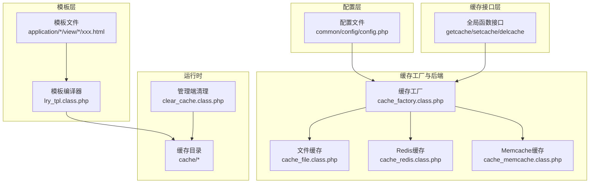
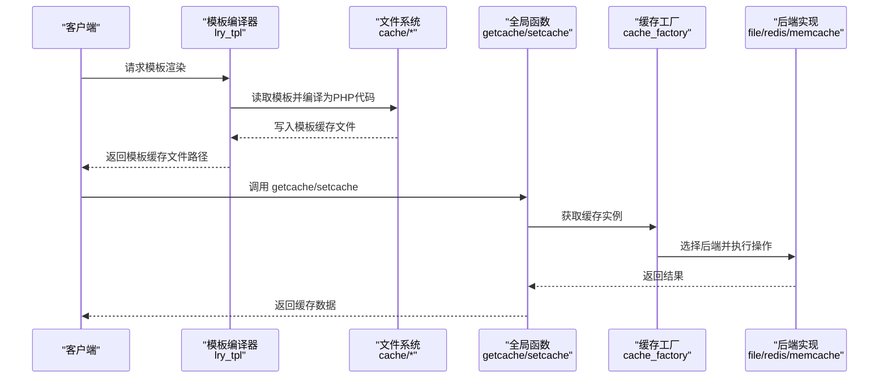
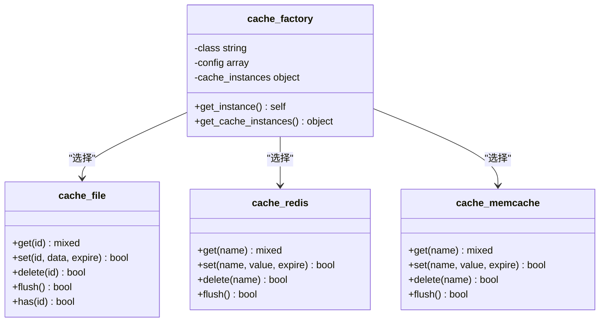
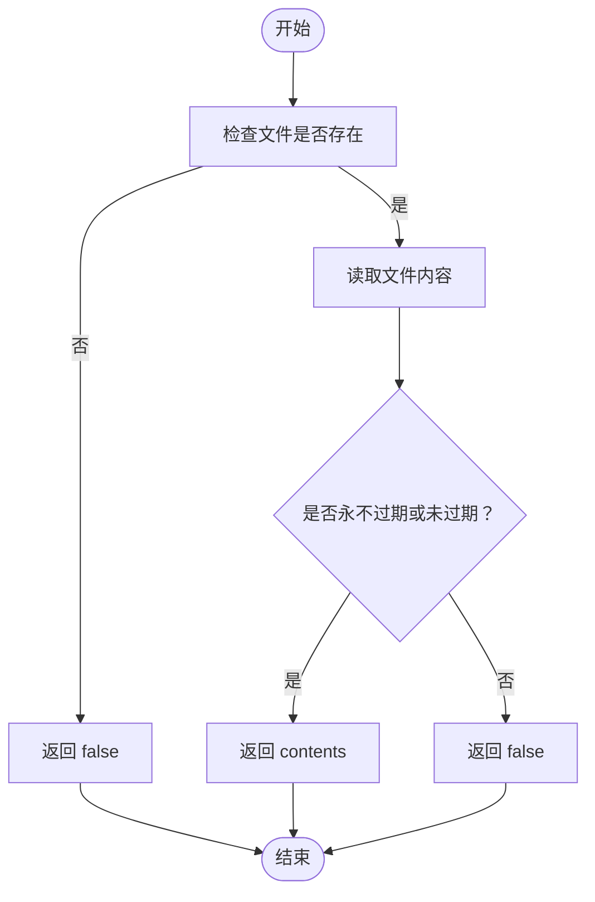
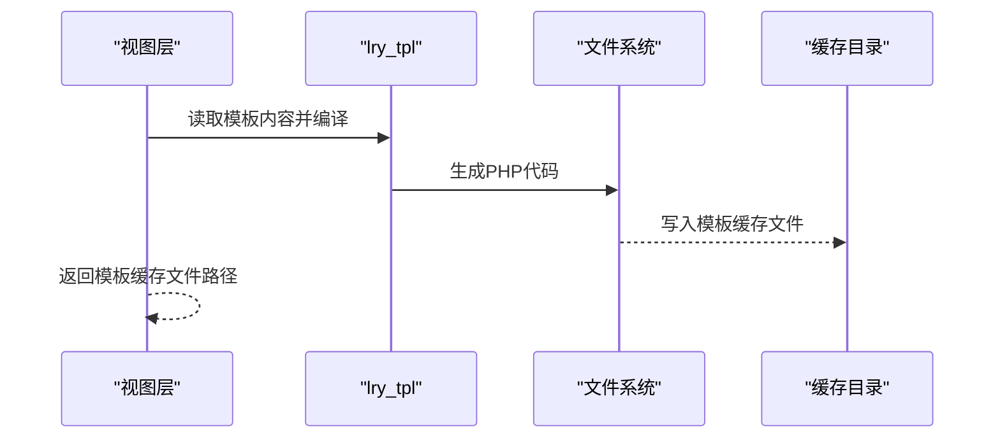
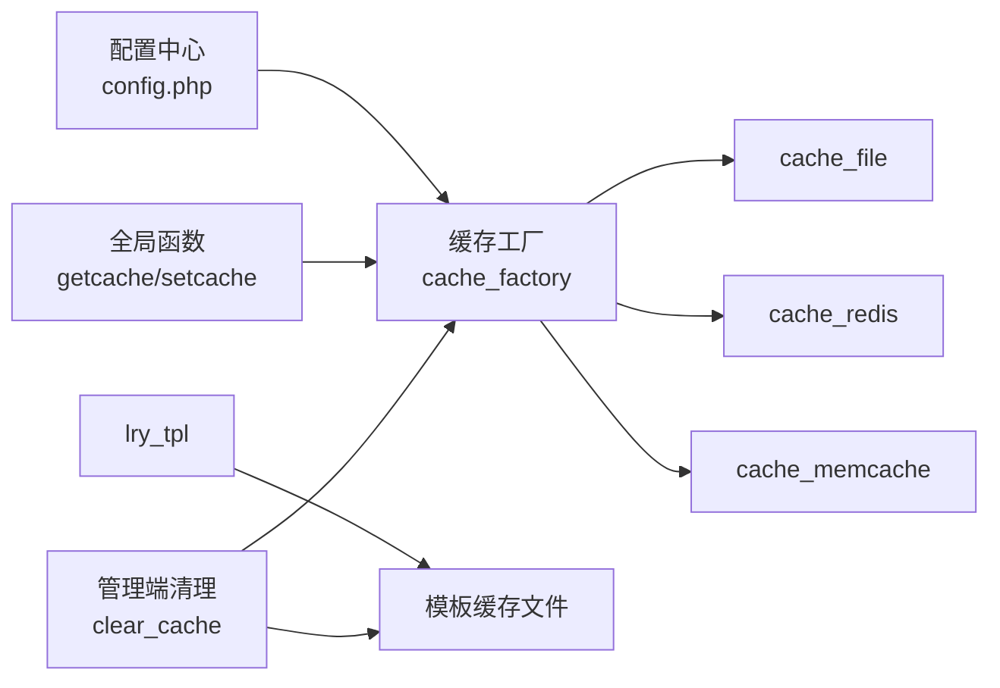

# 模板缓存机制

<cite>
**本文引用的文件列表**
- [cache_factory.class.php](file://ryphp/core/class/cache_factory.class.php)
- [cache_file.class.php](file://ryphp/core/class/cache_file.class.php)
- [cache_redis.class.php](file://ryphp/core/class/cache_redis.class.php)
- [cache_memcache.class.php](file://ryphp/core/class/cache_memcache.class.php)
- [lry_tpl.class.php](file://ryphp/core/class/lry_tpl.class.php)
- [global.func.php](file://ryphp/core/function/global.func.php)
- [config.php](file://common/config/config.php)
- [clear_cache.class.php](file://application/lry_admin_center/controller/clear_cache.class.php)
- [.gitignore](file://.gitignore)
</cite>

## 目录
1. [简介](#简介)
2. [项目结构](#项目结构)
3. [核心组件](#核心组件)
4. [架构总览](#架构总览)
5. [组件详解](#组件详解)
6. [依赖关系分析](#依赖关系分析)
7. [性能考量](#性能考量)
8. [故障排除指南](#故障排除指南)
9. [结论](#结论)
10. [附录](#附录)

## 简介
本文件围绕 LRYBlog 的模板缓存机制展开，系统性阐述模板编译与缓存存储的实现原理，覆盖缓存键名生成规则、缓存数据存储格式、生命周期管理（创建、更新、失效、清理）、多后端支持（文件、Redis、Memcache）以及性能优化与监控建议。文档同时提供最佳实践与故障排除指引，帮助开发者在不同部署环境下高效、稳定地使用模板缓存。

## 项目结构
LRYBlog 的模板缓存涉及以下关键模块：
- 缓存工厂与多后端实现：cache_factory、cache_file、cache_redis、cache_memcache
- 模板编译器：lry_tpl
- 全局缓存接口：getcache/setcache/delcache
- 配置中心：common/config/config.php
- 管理端缓存清理：application/lry_admin_center/controller/clear_cache.class.php
- 缓存目录忽略：.gitignore

图表来源
- [config.php](file://common/config/config.php#L39-L66)
- [cache_factory.class.php](file://ryphp/core/class/cache_factory.class.php#L36-L82)
- [cache_file.class.php](file://ryphp/core/class/cache_file.class.php#L1-L130)
- [cache_redis.class.php](file://ryphp/core/class/cache_redis.class.php#L1-L108)
- [cache_memcache.class.php](file://ryphp/core/class/cache_memcache.class.php#L1-L91)
- [lry_tpl.class.php](file://ryphp/core/class/lry_tpl.class.php#L1-L134)
- [global.func.php](file://ryphp/core/function/global.func.php#L147-L152)
- [global.func.php](file://ryphp/core/function/global.func.php#L584-L589)
- [global.func.php](file://ryphp/core/function/global.func.php#L1518-L1523)
- [clear_cache.class.php](file://application/lry_admin_center/controller/clear_cache.class.php#L9-L24)

章节来源
- [config.php](file://common/config/config.php#L39-L66)
- [cache_factory.class.php](file://ryphp/core/class/cache_factory.class.php#L36-L82)
- [cache_file.class.php](file://ryphp/core/class/cache_file.class.php#L1-L130)
- [cache_redis.class.php](file://ryphp/core/class/cache_redis.class.php#L1-L108)
- [cache_memcache.class.php](file://ryphp/core/class/cache_memcache.class.php#L1-L91)
- [lry_tpl.class.php](file://ryphp/core/class/lry_tpl.class.php#L1-L134)
- [global.func.php](file://ryphp/core/function/global.func.php#L147-L152)
- [global.func.php](file://ryphp/core/function/global.func.php#L584-L589)
- [global.func.php](file://ryphp/core/function/global.func.php#L1518-L1523)
- [clear_cache.class.php](file://application/lry_admin_center/controller/clear_cache.class.php#L9-L24)

## 核心组件
- 缓存工厂：根据配置动态选择文件/Redis/Memcache后端，提供统一实例获取与懒加载。
- 文件缓存：基于文件系统的缓存，支持两种存储模式（序列化或可执行数组文件）。
- Redis 缓存：基于 Redis 扩展，支持过期时间、持久连接、命名空间前缀。
- Memcache 缓存：基于 Memcache 扩展，支持过期时间、持久连接、命名空间前缀。
- 模板编译器：将模板语法转换为 PHP 代码，生成可执行的缓存模板文件。
- 全局缓存接口：getcache/setcache/delcache，封装工厂调用，供业务直接使用。
- 配置中心：集中管理缓存类型与各后端配置项。
- 管理端清理：提供一键清理模板与业务缓存的能力。

章节来源
- [cache_factory.class.php](file://ryphp/core/class/cache_factory.class.php#L36-L82)
- [cache_file.class.php](file://ryphp/core/class/cache_file.class.php#L1-L130)
- [cache_redis.class.php](file://ryphp/core/class/cache_redis.class.php#L1-L108)
- [cache_memcache.class.php](file://ryphp/core/class/cache_memcache.class.php#L1-L91)
- [lry_tpl.class.php](file://ryphp/core/class/lry_tpl.class.php#L1-L134)
- [global.func.php](file://ryphp/core/function/global.func.php#L147-L152)
- [global.func.php](file://ryphp/core/function/global.func.php#L584-L589)
- [global.func.php](file://ryphp/core/function/global.func.php#L1518-L1523)
- [config.php](file://common/config/config.php#L39-L66)
- [clear_cache.class.php](file://application/lry_admin_center/controller/clear_cache.class.php#L9-L24)

## 架构总览
模板缓存的整体流程如下：
- 模板首次被请求时，编译器将模板语法转换为 PHP 代码并写入缓存目录，形成“模板缓存文件”。
- 业务侧通过全局函数 getcache/setcache/delcache 访问缓存工厂，由工厂按配置选择具体后端实现。
- 不同后端对缓存键名与数据格式有各自约定；文件后端采用文件名作为键，Redis/Memcache 采用键值存储。

图表来源
- [lry_tpl.class.php](file://ryphp/core/class/lry_tpl.class.php#L1534-L1556)
- [global.func.php](file://ryphp/core/function/global.func.php#L147-L152)
- [global.func.php](file://ryphp/core/function/global.func.php#L584-L589)
- [cache_factory.class.php](file://ryphp/core/class/cache_factory.class.php#L36-L82)
- [cache_file.class.php](file://ryphp/core/class/cache_file.class.php#L17-L46)
- [cache_redis.class.php](file://ryphp/core/class/cache_redis.class.php#L60-L87)
- [cache_memcache.class.php](file://ryphp/core/class/cache_memcache.class.php#L47-L69)

## 组件详解

### 缓存工厂与后端选择
- 工厂负责单例与懒加载，依据配置的 cache_type 选择具体后端类，并注入对应配置。
- 默认回退至文件缓存，确保在未正确配置时仍可用。

图表来源
- [cache_factory.class.php](file://ryphp/core/class/cache_factory.class.php#L36-L82)
- [cache_file.class.php](file://ryphp/core/class/cache_file.class.php#L1-L130)
- [cache_redis.class.php](file://ryphp/core/class/cache_redis.class.php#L1-L108)
- [cache_memcache.class.php](file://ryphp/core/class/cache_memcache.class.php#L1-L91)

章节来源
- [cache_factory.class.php](file://ryphp/core/class/cache_factory.class.php#L36-L82)
- [config.php](file://common/config/config.php#L39-L66)

### 文件缓存实现
- 存储模型：以“缓存键名 + 后缀”的文件名存储，文件内容为序列化或可执行数组。
- 键名规则：直接使用传入的 id 作为文件名（不含路径）。
- 数据格式：包含 contents、expire、mtime 三个字段；expire=0 表示永不过期。
- 读取策略：先判断文件存在与未过期，再反序列化或 require 执行。
- 写入策略：确保目录存在，按配置模式写入头部与序列化内容。
- 清理策略：支持按键删除与全量 flush。

图表来源
- [cache_file.class.php](file://ryphp/core/class/cache_file.class.php#L17-L29)
- [cache_file.class.php](file://ryphp/core/class/cache_file.class.php#L116-L128)

章节来源
- [cache_file.class.php](file://ryphp/core/class/cache_file.class.php#L1-L130)

### Redis 缓存实现
- 连接：支持短连接/长连接、认证、库选择、超时。
- 键名：可配置前缀，最终键为 prefix + name。
- 数据格式：数组类型自动 JSON 编码；读取时尝试 JSON 解码还原数组。
- 过期：expire=0 表示不设置过期；否则使用带过期的 SETEX 命令。

章节来源
- [cache_redis.class.php](file://ryphp/core/class/cache_redis.class.php#L1-L108)
- [config.php](file://common/config/config.php#L48-L57)

### Memcache 缓存实现
- 连接：支持短连接/长连接、主机端口配置。
- 键名：可配置前缀，最终键为 prefix + name。
- 数据格式：数组类型自动 JSON 编码；读取时尝试 JSON 解码还原数组。
- 过期：expire=0 表示不设置过期；否则使用带过期的 set 接口。

章节来源
- [cache_memcache.class.php](file://ryphp/core/class/cache_memcache.class.php#L1-L91)
- [config.php](file://common/config/config.php#L59-L66)

### 模板编译与缓存文件生成
- 模板编译：lry_tpl 将模板中的自定义标签转换为 PHP 代码，生成可执行的模板缓存文件。
- 缓存文件命名：基于模块、模板名与模板路径的 MD5 组合，确保唯一性。
- 缓存目录：按模块建立子目录，避免文件过多导致的性能问题。
- 更新策略：若模板文件被修改，模板缓存文件会被重新编译覆盖。

图表来源
- [lry_tpl.class.php](file://ryphp/core/class/lry_tpl.class.php#L1534-L1556)

章节来源
- [lry_tpl.class.php](file://ryphp/core/class/lry_tpl.class.php#L1-L134)
- [global.func.php](file://ryphp/core/function/global.func.php#L1534-L1556)

### 全局缓存接口与生命周期
- getcache：获取缓存，后端实现负责过期判断与数据还原。
- setcache：设置缓存，支持指定过期时间；后端实现负责序列化/编码与写入。
- delcache：支持按键删除或全量清理；flush 由后端实现提供。
- 生命周期：创建（set）、命中/未命中（get）、过期（get 内部判断）、清理（delete/flush）。

章节来源
- [global.func.php](file://ryphp/core/function/global.func.php#L147-L152)
- [global.func.php](file://ryphp/core/function/global.func.php#L584-L589)
- [global.func.php](file://ryphp/core/function/global.func.php#L1518-L1523)

### 管理端缓存清理
- 模板缓存清理：扫描 cache/*/ 目录下的模板缓存文件并删除。
- 业务缓存清理：调用 delcache('', true) 触发后端 flush。

章节来源
- [clear_cache.class.php](file://application/lry_admin_center/controller/clear_cache.class.php#L9-L24)
- [global.func.php](file://ryphp/core/function/global.func.php#L1518-L1523)

## 依赖关系分析
- 配置依赖：缓存类型与后端配置来自配置中心，工厂据此加载相应类。
- 运行时依赖：模板编译依赖 lry_tpl；业务侧通过全局函数访问缓存工厂。
- 后端依赖：Redis/Memcache 需要对应扩展；文件缓存依赖文件系统权限。

图表来源
- [config.php](file://common/config/config.php#L39-L66)
- [cache_factory.class.php](file://ryphp/core/class/cache_factory.class.php#L36-L82)
- [cache_file.class.php](file://ryphp/core/class/cache_file.class.php#L1-L130)
- [cache_redis.class.php](file://ryphp/core/class/cache_redis.class.php#L1-L108)
- [cache_memcache.class.php](file://ryphp/core/class/cache_memcache.class.php#L1-L91)
- [lry_tpl.class.php](file://ryphp/core/class/lry_tpl.class.php#L1534-L1556)
- [global.func.php](file://ryphp/core/function/global.func.php#L147-L152)
- [global.func.php](file://ryphp/core/function/global.func.php#L584-L589)
- [global.func.php](file://ryphp/core/function/global.func.php#L1518-L1523)
- [clear_cache.class.php](file://application/lry_admin_center/controller/clear_cache.class.php#L9-L24)

## 性能考量
- 模板编译缓存
  - 优势：避免每次请求都解析模板语法，显著降低 CPU 开销。
  - 注意：模板变更后需触发重新编译，确保缓存一致性。
- 文件缓存
  - 优点：零外部依赖，部署简单。
  - 优化：合理设置目录层级（按模块分目录），减少单目录文件数量；选择“可执行数组文件”模式可提升读取性能。
- Redis/Memcache
  - 优点：内存型存储，读写延迟低；支持过期与持久连接。
  - 优化：合理设置过期时间，避免热点键过期风暴；使用前缀隔离不同环境；启用长连接减少握手开销。
- 命中率统计与监控
  - 建议：在业务层包装 getcache/setcache，记录命中/未命中计数；结合后端自带指标（如 Redis/Memcache 的 info）进行综合评估。
- 缓存预热
  - 场景：高并发场景下，可在系统启动或低峰期预热热点模板与数据，降低首峰压力。
- 目录权限
  - 文件缓存需确保 cache 目录可写；管理端清理前会校验权限。

章节来源
- [cache_file.class.php](file://ryphp/core/class/cache_file.class.php#L1-L130)
- [cache_redis.class.php](file://ryphp/core/class/cache_redis.class.php#L1-L108)
- [cache_memcache.class.php](file://ryphp/core/class/cache_memcache.class.php#L1-L91)
- [clear_cache.class.php](file://application/lry_admin_center/controller/clear_cache.class.php#L9-L24)
- [.gitignore](file://.gitignore#L1-L6)

## 故障排除指南
- 无法加载缓存后端
  - 现象：Redis/Memcache 报错或不可用。
  - 排查：确认扩展已安装并启用；核对 host/port/password/select/timeout/persistent 等配置。
- 缓存目录不可写
  - 现象：管理端清理失败或 setcache 失败。
  - 排查：检查 cache 目录权限；确保 Web 用户具有写权限。
- 模板缓存未更新
  - 现象：模板修改后页面未变化。
  - 排查：确认模板缓存文件是否被重新编译；检查模板路径与模块主题配置。
- 缓存键冲突
  - 现象：不同模块/环境出现键名冲突。
  - 排查：为 Redis/Memcache 配置独立 prefix；避免跨模块共享相同键名。
- 过期时间异常
  - 现象：缓存提前或延后过期。
  - 排查：核对 setcache 传入的 timeout；检查后端时间同步与配置 expire。

章节来源
- [cache_redis.class.php](file://ryphp/core/class/cache_redis.class.php#L30-L51)
- [cache_memcache.class.php](file://ryphp/core/class/cache_memcache.class.php#L27-L36)
- [clear_cache.class.php](file://application/lry_admin_center/controller/clear_cache.class.php#L9-L24)
- [global.func.php](file://ryphp/core/function/global.func.php#L1534-L1556)

## 结论
LRYBlog 的模板缓存机制通过“模板编译缓存 + 多后端通用缓存接口”的组合，实现了从模板层面到业务数据层面的高效缓存体系。工厂模式与全局接口简化了使用，文件/Redis/Memcache 三种后端满足不同部署需求。配合合理的键名规则、过期策略与清理机制，可在保证一致性的同时获得良好的性能表现。

## 附录

### 缓存键名生成规则
- 文件缓存：直接使用传入 id 作为文件名。
- Redis/Memcache：使用 prefix + name 组合作为键名。

章节来源
- [cache_file.class.php](file://ryphp/core/class/cache_file.class.php#L91-L100)
- [cache_redis.class.php](file://ryphp/core/class/cache_redis.class.php#L60-L87)
- [cache_memcache.class.php](file://ryphp/core/class/cache_memcache.class.php#L47-L69)

### 缓存数据存储格式
- 文件缓存：包含 contents、expire、mtime 的数组；读取时按配置模式反序列化或 require。
- Redis/Memcache：数组类型自动 JSON 编码；读取时尝试 JSON 解码还原。

章节来源
- [cache_file.class.php](file://ryphp/core/class/cache_file.class.php#L34-L46)
- [cache_file.class.php](file://ryphp/core/class/cache_file.class.php#L103-L128)
- [cache_redis.class.php](file://ryphp/core/class/cache_redis.class.php#L60-L87)
- [cache_memcache.class.php](file://ryphp/core/class/cache_memcache.class.php#L47-L69)

### 缓存生命周期管理
- 创建：setcache 调用后端 set，写入数据与过期时间。
- 命中：getcache 调用后端 get 并进行过期判断。
- 失效：get 内部判断过期返回 false；或主动调用 delcache 删除。
- 清理：delcache('', true) 或管理端清理触发 flush。

章节来源
- [global.func.php](file://ryphp/core/function/global.func.php#L147-L152)
- [global.func.php](file://ryphp/core/function/global.func.php#L584-L589)
- [global.func.php](file://ryphp/core/function/global.func.php#L1518-L1523)
- [clear_cache.class.php](file://application/lry_admin_center/controller/clear_cache.class.php#L9-L24)

### 多后端配置与使用
- 配置项：cache_type、file_config、redis_config、memcache_config。
- 使用方式：通过全局函数 getcache/setcache/delcache 访问缓存工厂，自动选择后端。

章节来源
- [config.php](file://common/config/config.php#L39-L66)
- [global.func.php](file://ryphp/core/function/global.func.php#L147-L152)
- [global.func.php](file://ryphp/core/function/global.func.php#L584-L589)
- [global.func.php](file://ryphp/core/function/global.func.php#L1518-L1523)