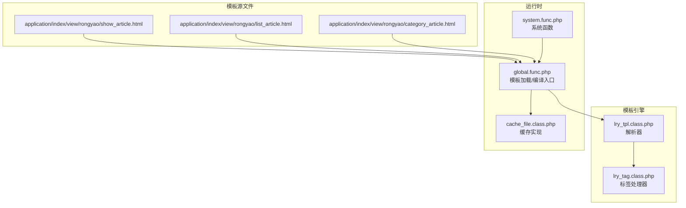
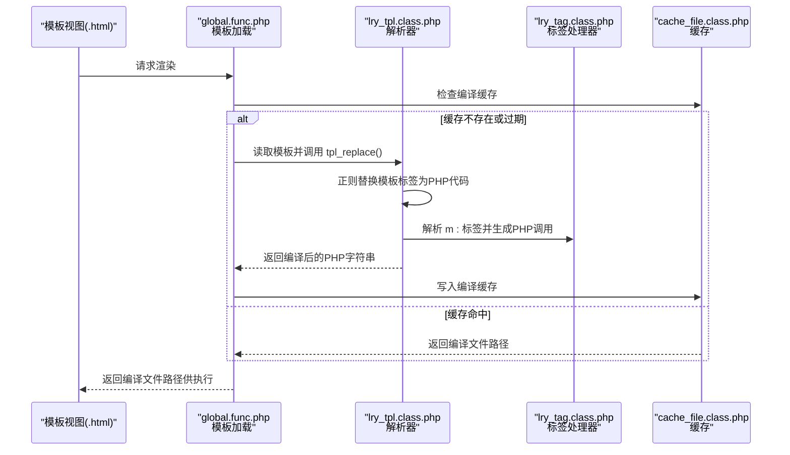
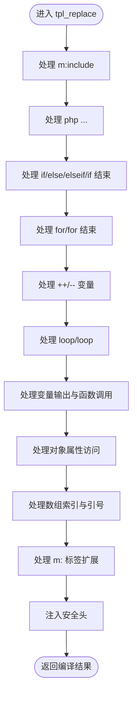
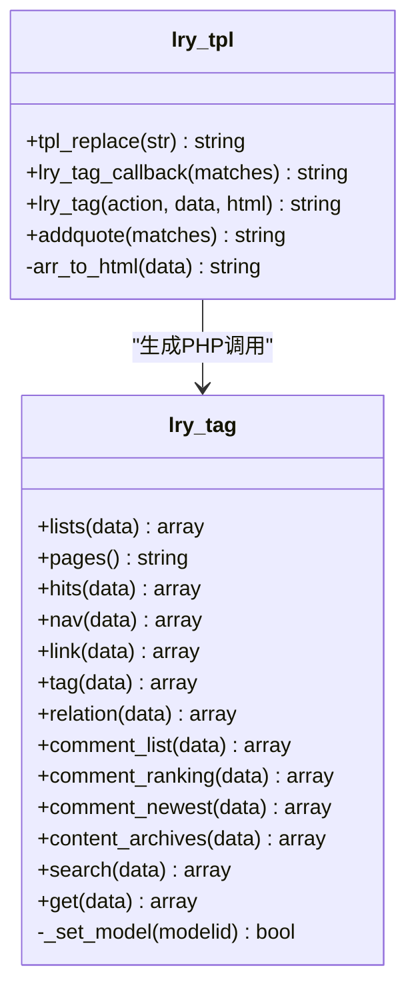
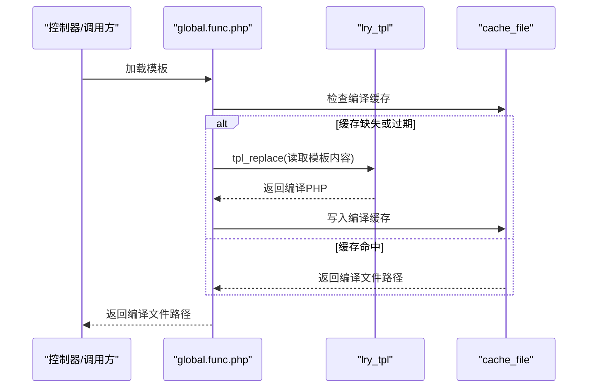
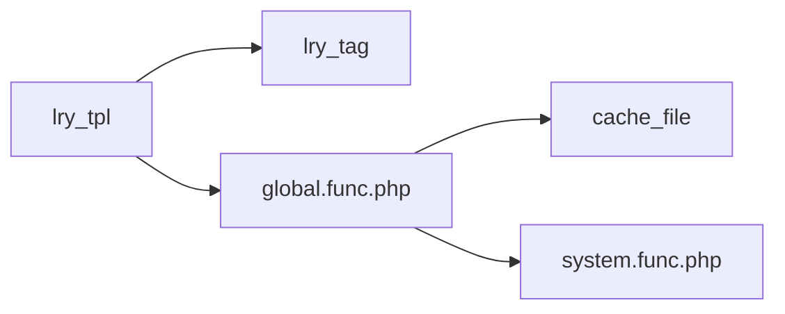

# 模板解析机制

<cite>
**本文引用的文件**
- [lry_tpl.class.php](file://ryphp/core/class/lry_tpl.class.php)
- [global.func.php](file://ryphp/core/function/global.func.php)
- [lry_tag.class.php](file://ryphp/core/class/lry_tag.class.php)
- [show_article.html](file://application/index/view/rongyao/show_article.html)
- [category_article.html](file://application/index/view/rongyao/category_article.html)
- [list_article.html](file://application/index/view/rongyao/list_article.html)
- [cache_file.class.php](file://ryphp/core/class/cache_file.class.php)
- [system.func.php](file://common/function/system.func.php)
</cite>

## 目录
1. [引言](#引言)
2. [项目结构](#项目结构)
3. [核心组件](#核心组件)
4. [架构总览](#架构总览)
5. [详细组件分析](#详细组件分析)
6. [依赖关系分析](#依赖关系分析)
7. [性能考量](#性能考量)
8. [故障排查指南](#故障排查指南)
9. [结论](#结论)
10. [附录](#附录)

## 引言
本文件围绕 LRYBlog 的模板解析机制展开，重点剖析 lry_tpl 类的解析算法与正则表达式规则，详解从原始 HTML 模板到 PHP 编译文件的转换流程，并覆盖模板标签的解析、变量输出、条件判断、循环控制、PHP 代码嵌入、标签扩展等能力。同时说明左右分隔符配置、缓存与编译策略、错误处理与性能优化建议，辅以实际模板示例路径，帮助开发者快速掌握模板引擎工作原理。

## 项目结构
LRYBlog 的模板解析位于核心框架层，模板文件位于应用视图目录中，编译产物由模板引擎生成并缓存于 cache 目录。整体结构如下：

**图表来源**
- [lry_tpl.class.php](file://ryphp/core/class/lry_tpl.class.php#L10-L134)
- [global.func.php](file://ryphp/core/function/global.func.php#L1540-L1556)
- [lry_tag.class.php](file://ryphp/core/class/lry_tag.class.php#L10-L492)
- [cache_file.class.php](file://ryphp/core/class/cache_file.class.php#L1-L130)
- [system.func.php](file://common/function/system.func.php#L1-L200)

**章节来源**
- [lry_tpl.class.php](file://ryphp/core/class/lry_tpl.class.php#L10-L134)
- [global.func.php](file://ryphp/core/function/global.func.php#L1540-L1556)
- [cache_file.class.php](file://ryphp/core/class/cache_file.class.php#L1-L130)
- [system.func.php](file://common/function/system.func.php#L1-L200)

## 核心组件
- lry_tpl：模板解析器，负责将模板中的标签语法转换为 PHP 代码，并处理标签扩展与变量输出。
- lry_tag：内置标签处理器，提供 lists、tag、comment_list 等常用标签的业务逻辑。
- global.func.php 中的模板加载与编译入口：负责模板文件定位、编译缓存检查与写入。
- cache_file：文件型缓存实现，支撑模板编译结果与标签缓存。
- system.func.php：提供站点、模型、URL 等系统级辅助函数，供模板与标签使用。

**章节来源**
- [lry_tpl.class.php](file://ryphp/core/class/lry_tpl.class.php#L10-L134)
- [lry_tag.class.php](file://ryphp/core/class/lry_tag.class.php#L10-L492)
- [global.func.php](file://ryphp/core/function/global.func.php#L1540-L1556)
- [cache_file.class.php](file://ryphp/core/class/cache_file.class.php#L1-L130)
- [system.func.php](file://common/function/system.func.php#L1-L200)

## 架构总览
模板解析的端到端流程如下：

**图表来源**
- [global.func.php](file://ryphp/core/function/global.func.php#L1540-L1556)
- [lry_tpl.class.php](file://ryphp/core/class/lry_tpl.class.php#L31-L59)
- [lry_tag.class.php](file://ryphp/core/class/lry_tag.class.php#L70-L92)
- [cache_file.class.php](file://ryphp/core/class/cache_file.class.php#L17-L46)

## 详细组件分析

### lry_tpl 解析器
lry_tpl 提供统一的模板标签解析能力，核心流程是通过一系列正则表达式将模板标签转换为 PHP 代码片段，并在开头注入安全保护头。

- 左右分隔符
  - 默认左分隔符：{，右分隔符：}
  - 可通过构造函数或成员变量调整（当前类中为私有属性，未提供 setter）

- 主要解析规则
  - 包含与嵌入：m:include 将模板片段包含为 PHP include 调用
  - PHP 代码嵌入：php 标签直接输出 PHP 代码
  - 控制结构：if/else/elseif/if 结束；for/for 结束；loop/loop 循环
  - 自增自减：++ 变量、变量++、-- 变量、变量--
  - 变量输出：函数调用输出、带 $ 前缀变量、纯大写常量、对象属性访问
  - 数组/索引访问：将方括号索引转换为 PHP 数组语法
  - 标签扩展：m:action 参数解析，生成标签调用与可选分页、缓存逻辑

- 安全头
  - 在编译结果前注入安全校验，防止直接访问编译文件

- 关键方法
  - tpl_replace：串行执行多条正则替换，最终返回 PHP 字符串
  - lry_tag：静态方法，解析 m: 标签参数，生成 PHP 调用与缓存逻辑
  - lry_tag_callback：回调包装，便于 preg_replace_callback 使用
  - addquote：将带方括号索引的变量表达式转换为合法 PHP
  - arr_to_html：将数组参数序列化为 PHP 代码，处理特殊字段与转义

**图表来源**
- [lry_tpl.class.php](file://ryphp/core/class/lry_tpl.class.php#L31-L59)
- [lry_tpl.class.php](file://ryphp/core/class/lry_tpl.class.php#L62-L92)
- [lry_tpl.class.php](file://ryphp/core/class/lry_tpl.class.php#L101-L104)
- [lry_tpl.class.php](file://ryphp/core/class/lry_tpl.class.php#L111-L132)

**章节来源**
- [lry_tpl.class.php](file://ryphp/core/class/lry_tpl.class.php#L10-L134)

### 模板标签与语法
- 变量输出
  - 支持函数调用输出与变量输出，如 {func()}、{$var}、{CONSTANT}
  - 对象属性访问：{obj->prop}
- 控制结构
  - 条件：{if ...}、{else}、{elseif ...}、{if end}
  - 循环：{for ...}、{for end}；{loop array item}、{loop array key val}、{loop end}
- 自增自减：{++var}、{var++}、{--var}、{var--}
- PHP 代码嵌入：{php ...}
- 模板包含：{m:include module, file}
- 标签扩展：{m:action arg=value ...}
  - 支持 cache 缓存时间、return 返回变量名、page 分页等参数
  - 生成对 lry_tag::action 的调用，并按需生成分页与缓存逻辑

**章节来源**
- [lry_tpl.class.php](file://ryphp/core/class/lry_tpl.class.php#L31-L59)
- [lry_tpl.class.php](file://ryphp/core/class/lry_tpl.class.php#L62-L92)

### 标签处理器 lry_tag
lry_tag 提供多种常用标签的业务逻辑，如内容列表、分页、点击排行、导航、链接、标签、评论、轮播、搜索、自定义 SQL 等。其核心特征：
- 动态方法调用：lry_tpl 将 m:action 转换为 $tag->action(...) 调用
- 分页支持：当标签包含 page 参数时，生成分页对象并返回分页 HTML
- 缓存支持：当标签包含 cache 参数时，生成缓存读取/写入逻辑

**图表来源**
- [lry_tpl.class.php](file://ryphp/core/class/lry_tpl.class.php#L62-L92)
- [lry_tag.class.php](file://ryphp/core/class/lry_tag.class.php#L10-L492)

**章节来源**
- [lry_tag.class.php](file://ryphp/core/class/lry_tag.class.php#L10-L492)

### 模板加载与编译入口
global.func.php 中的模板加载流程负责：
- 定位模板文件
- 检查编译缓存是否存在且未过期
- 若需要编译，则调用 lry_tpl::tpl_replace 生成 PHP 编译文件并写入缓存
- 返回编译文件路径供后续执行

**图表来源**
- [global.func.php](file://ryphp/core/function/global.func.php#L1540-L1556)
- [lry_tpl.class.php](file://ryphp/core/class/lry_tpl.class.php#L31-L59)
- [cache_file.class.php](file://ryphp/core/class/cache_file.class.php#L17-L46)

**章节来源**
- [global.func.php](file://ryphp/core/function/global.func.php#L1540-L1556)

### 实际模板示例
以下为仓库中实际存在的模板示例，展示模板语法的典型用法：
- 文章详情页：展示变量输出、条件判断、循环、标签扩展、包含等
  - [show_article.html](file://application/index/view/rongyao/show_article.html#L1-L518)
- 列表页：展示分页、标签扩展、条件与循环
  - [list_article.html](file://application/index/view/rongyao/list_article.html#L1-L150)
- 子栏目文章页：展示 PHP 代码嵌入、循环与标签
  - [category_article.html](file://application/index/view/rongyao/category_article.html#L1-L53)

**章节来源**
- [show_article.html](file://application/index/view/rongyao/show_article.html#L1-L518)
- [list_article.html](file://application/index/view/rongyao/list_article.html#L1-L150)
- [category_article.html](file://application/index/view/rongyao/category_article.html#L1-L53)

## 依赖关系分析
- lry_tpl 依赖全局函数与系统函数进行上下文构建与安全校验
- lry_tpl 通过 lry_tag 生成标签调用，标签内部依赖数据库与分页组件
- 编译产物由 cache_file 提供持久化存储，避免重复解析

**图表来源**
- [lry_tpl.class.php](file://ryphp/core/class/lry_tpl.class.php#L62-L92)
- [global.func.php](file://ryphp/core/function/global.func.php#L1540-L1556)
- [cache_file.class.php](file://ryphp/core/class/cache_file.class.php#L1-L130)
- [system.func.php](file://common/function/system.func.php#L1-L200)

**章节来源**
- [lry_tpl.class.php](file://ryphp/core/class/lry_tpl.class.php#L10-L134)
- [global.func.php](file://ryphp/core/function/global.func.php#L1540-L1556)
- [lry_tag.class.php](file://ryphp/core/class/lry_tag.class.php#L10-L492)
- [cache_file.class.php](file://ryphp/core/class/cache_file.class.php#L1-L130)
- [system.func.php](file://common/function/system.func.php#L1-L200)

## 性能考量
- 编译缓存
  - 模板首次渲染时编译为 PHP 文件并缓存，后续直接读取缓存，避免重复正则解析
  - 缓存失效策略：基于模板文件修改时间与缓存文件时间比较
- 标签缓存
  - m:action 支持 cache 参数，将标签结果写入缓存，减少数据库与计算开销
- 正则解析顺序
  - 采用串行正则替换，顺序固定，避免回溯复杂度叠加
- I/O 优化
  - 编译文件集中存放于 cache 目录，减少磁盘扫描与路径拼接成本

**章节来源**
- [global.func.php](file://ryphp/core/function/global.func.php#L1540-L1556)
- [lry_tpl.class.php](file://ryphp/core/class/lry_tpl.class.php#L76-L91)
- [cache_file.class.php](file://ryphp/core/class/cache_file.class.php#L17-L46)

## 故障排查指南
- 模板文件不存在
  - 现象：抛出“模板不存在”消息
  - 排查：确认模板路径与模块名正确，检查文件权限
  - 参考：[global.func.php](file://ryphp/core/function/global.func.php#L1541-L1544)
- 编译缓存异常
  - 现象：页面空白或报错
  - 排查：删除对应编译文件，触发重新编译；检查缓存目录权限
  - 参考：[global.func.php](file://ryphp/core/function/global.func.php#L1545-L1556)
- 标签参数错误
  - 现象：标签不生效或报错
  - 排查：核对 m:action 参数格式与命名空间；确认 lry_tag::action 方法存在
  - 参考：[lry_tpl.class.php](file://ryphp/core/class/lry_tpl.class.php#L70-L92)
- 变量输出异常
  - 现象：变量未显示或语法错误
  - 排查：检查变量名、数组索引与对象属性访问语法；确认 addquote 转义逻辑
  - 参考：[lry_tpl.class.php](file://ryphp/core/class/lry_tpl.class.php#L101-L104)
- 条件/循环语法错误
  - 现象：if/for/loop 不匹配或死循环
  - 排查：确保每条开始标签都有对应的结束标签；检查循环变量作用域
  - 参考：[lry_tpl.class.php](file://ryphp/core/class/lry_tpl.class.php#L34-L48)

**章节来源**
- [global.func.php](file://ryphp/core/function/global.func.php#L1540-L1556)
- [lry_tpl.class.php](file://ryphp/core/class/lry_tpl.class.php#L31-L59)
- [lry_tpl.class.php](file://ryphp/core/class/lry_tpl.class.php#L101-L104)

## 结论
LRYBlog 的模板解析机制以 lry_tpl 为核心，通过正则表达式将模板标签转换为 PHP 代码，并结合 lry_tag 提供强大的标签扩展能力。配合文件型缓存与编译产物，系统在易用性与性能之间取得平衡。开发者可通过理解解析顺序、标签语法规则与缓存策略，高效构建可维护的模板体系。

## 附录
- 模板语法速查
  - 变量输出：{var}、{func()}、{obj->prop}
  - 控制结构：{if}/{else}/{elseif}/{if end}、{for}/{for end}、{loop}/{loop end}
  - 自增自减：{++x}、{x++}、{--x}、{x--}
  - PHP 代码嵌入：{php ...}
  - 模板包含：{m:include module, file}
  - 标签扩展：{m:action arg=value ...}，支持 cache、return、page 等参数
- 示例模板路径
  - [show_article.html](file://application/index/view/rongyao/show_article.html#L1-L518)
  - [list_article.html](file://application/index/view/rongyao/list_article.html#L1-L150)
  - [category_article.html](file://application/index/view/rongyao/category_article.html#L1-L53)