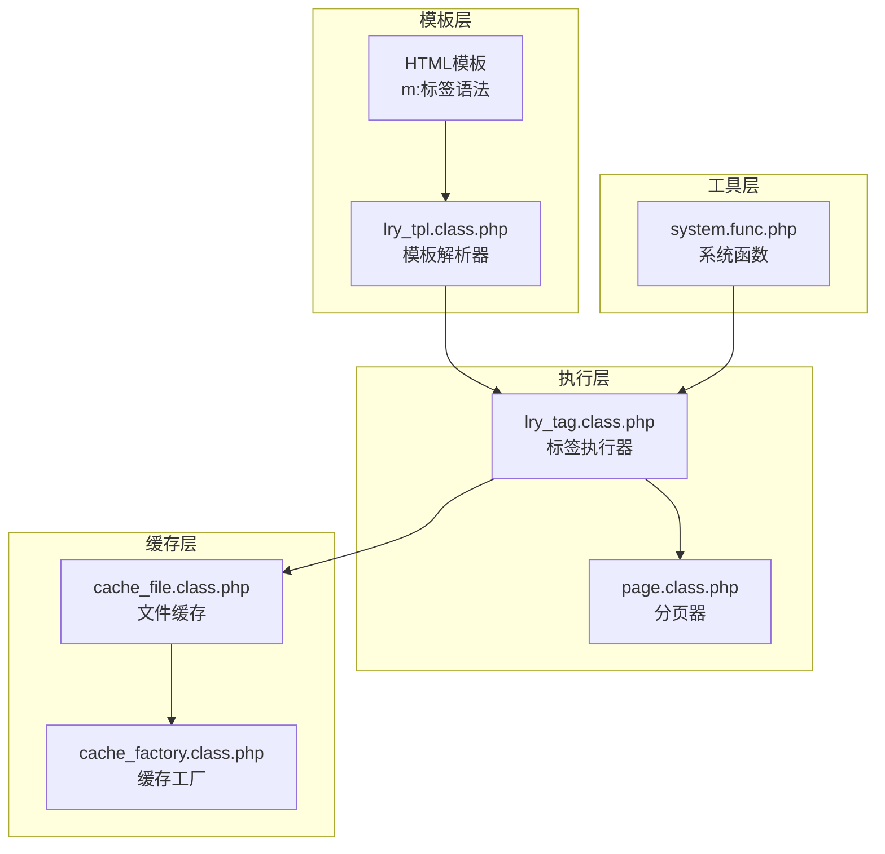
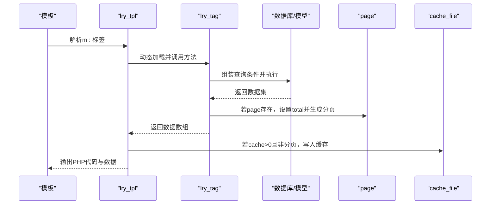
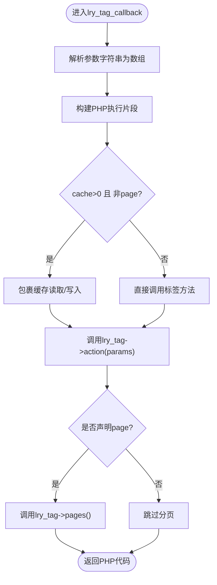
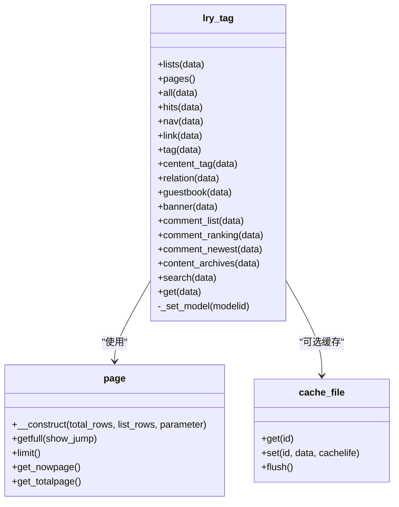
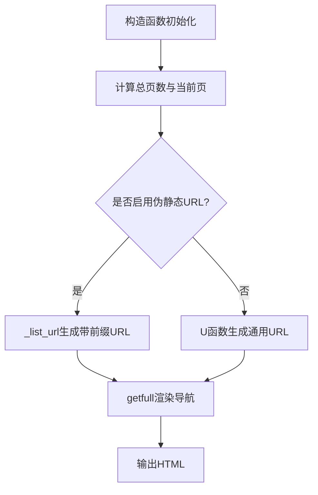
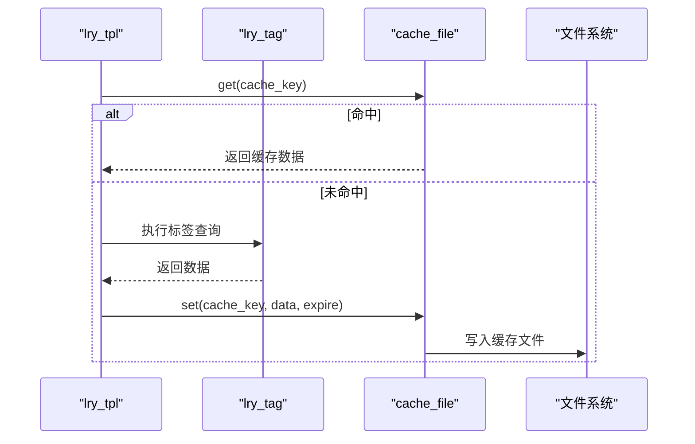
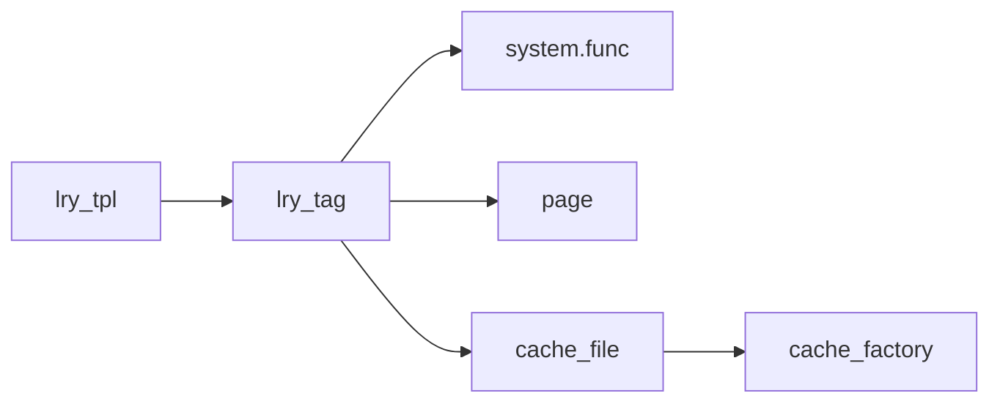

# 自定义标签系统

<cite>
**本文引用的文件**
- [lry_tag.class.php](file://ryphp/core/class/lry_tag.class.php)
- [lry_tpl.class.php](file://ryphp/core/class/lry_tpl.class.php)
- [page.class.php](file://ryphp/core/class/page.class.php)
- [cache_file.class.php](file://ryphp/core/class/cache_file.class.php)
- [cache_factory.class.php](file://ryphp/core/class/cache_factory.class.php)
- [system.func.php](file://common/function/system.func.php)
- [list_article.html](file://application/index/view/rongyao/list_article.html)
- [show_article.html](file://application/index/view/rongyao/show_article.html)
- [category_article.html](file://application/index/view/rongyao/category_article.html)
- [version.php](file://common/data/version.php)
</cite>

## 目录
1. [简介](#简介)
2. [项目结构](#项目结构)
3. [核心组件](#核心组件)
4. [架构总览](#架构总览)
5. [详细组件分析](#详细组件分析)
6. [依赖关系分析](#依赖关系分析)
7. [性能考量](#性能考量)
8. [故障排查指南](#故障排查指南)
9. [结论](#结论)
10. [附录](#附录)

## 简介
本文件面向LRYBlog的自定义标签系统，围绕lry_tag类的设计理念与实现机制展开，系统性讲解如何通过m:前缀语法在模板中创建可复用的模板标签；深入剖析标签参数解析、缓存机制与分页功能的实现原理；阐述标签的注册、调用与执行流程（参数传递、返回值处理、错误处理）；介绍内置标签的功能与使用方法（文章列表、分类查询、标签云等）；并提供自定义标签开发指南与最佳实践。

## 项目结构
自定义标签系统由以下层次构成：
- 模板解析层：负责将模板中的m:标签语法解析为PHP代码，并注入参数、缓存与分页逻辑。
- 标签执行层：lry_tag类封装了各类标签的查询与聚合逻辑，统一输出标准数据结构。
- 分页与缓存层：page类提供分页导航与URL生成；cache_file与cache_factory提供文件缓存能力。
- 工具与辅助：system.func.php提供站点、模型、栏目等辅助函数，支撑标签运行时上下文。

图表来源
- [lry_tpl.class.php](file://ryphp/core/class/lry_tpl.class.php#L31-L92)
- [lry_tag.class.php](file://ryphp/core/class/lry_tag.class.php#L10-L492)
- [page.class.php](file://ryphp/core/class/page.class.php#L14-L202)
- [cache_file.class.php](file://ryphp/core/class/cache_file.class.php#L1-L130)
- [cache_factory.class.php](file://ryphp/core/class/cache_factory.class.php#L1-L84)
- [system.func.php](file://common/function/system.func.php#L119-L128)

章节来源
- [lry_tpl.class.php](file://ryphp/core/class/lry_tpl.class.php#L31-L92)
- [lry_tag.class.php](file://ryphp/core/class/lry_tag.class.php#L10-L492)
- [page.class.php](file://ryphp/core/class/page.class.php#L14-L202)
- [cache_file.class.php](file://ryphp/core/class/cache_file.class.php#L1-L130)
- [cache_factory.class.php](file://ryphp/core/class/cache_factory.class.php#L1-L84)
- [system.func.php](file://common/function/system.func.php#L119-L128)

## 核心组件
- lry_tpl：模板解析器，将m:标签语法解析为PHP执行代码，负责参数提取、缓存包装与分页注入。
- lry_tag：标签执行器，内置多种标签（列表、排行、导航、链接、标签、评论、搜索、自定义SQL等），统一返回数组数据。
- page：分页器，计算总页数、当前页、URL规则，生成分页导航HTML。
- cache_file/cache_factory：文件缓存与缓存工厂，提供get/set/flush等接口，支持标签缓存。
- system.func：系统函数库，提供站点、模型、栏目等查询与辅助能力。

章节来源
- [lry_tpl.class.php](file://ryphp/core/class/lry_tpl.class.php#L10-L134)
- [lry_tag.class.php](file://ryphp/core/class/lry_tag.class.php#L10-L492)
- [page.class.php](file://ryphp/core/class/page.class.php#L14-L202)
- [cache_file.class.php](file://ryphp/core/class/cache_file.class.php#L1-L130)
- [cache_factory.class.php](file://ryphp/core/class/cache_factory.class.php#L1-L84)
- [system.func.php](file://common/function/system.func.php#L119-L128)

## 架构总览
m:标签的执行流程如下：
1. 模板解析阶段：lry_tpl识别m:标签，解析参数，生成PHP代码片段。
2. 执行阶段：加载lry_tag类，调用对应方法，返回数据数组。
3. 分页阶段：若标签声明page参数，则调用lry_tag->pages()生成分页HTML。
4. 缓存阶段：若声明cache参数且非分页场景，对结果进行缓存。

图表来源
- [lry_tpl.class.php](file://ryphp/core/class/lry_tpl.class.php#L62-L92)
- [lry_tag.class.php](file://ryphp/core/class/lry_tag.class.php#L18-L65)
- [page.class.php](file://ryphp/core/class/page.class.php#L26-L152)
- [cache_file.class.php](file://ryphp/core/class/cache_file.class.php#L17-L46)

章节来源
- [lry_tpl.class.php](file://ryphp/core/class/lry_tpl.class.php#L62-L92)
- [lry_tag.class.php](file://ryphp/core/class/lry_tag.class.php#L18-L65)
- [page.class.php](file://ryphp/core/class/page.class.php#L26-L152)
- [cache_file.class.php](file://ryphp/core/class/cache_file.class.php#L17-L46)

## 详细组件分析

### lry_tpl：模板解析与标签回调
- 语法识别：通过正则匹配m:标签，提取action与参数字符串。
- 参数解析：将参数字符串解析为键值数组，支持where/sql等特殊字段原样保留。
- 缓存包装：当cache参数大于0且未声明page时，生成缓存读取/写入逻辑。
- 分页注入：当page参数存在时，生成分页对象并注入$pages变量。
- 返回值控制：通过return参数控制输出变量名，默认为data。

图表来源
- [lry_tpl.class.php](file://ryphp/core/class/lry_tpl.class.php#L62-L92)

章节来源
- [lry_tpl.class.php](file://ryphp/core/class/lry_tpl.class.php#L62-L92)

### lry_tag：标签执行器
- 列表标签lists：支持modelid、catid、id、all、field、order、limit、where、thumb、flag、page等参数，自动处理分类树与状态过滤，支持分页。
- 点击排行hits：按点击量倒序，支持catid、modelid、day、thumb、where等参数。
- 导航nav：站点内栏目导航，支持siteid、field、order、limit、where。
- 友情链接link：支持siteid、typeid、thumb、where等。
- 标签tag：全站或按分类的标签列表，支持page分页。
- 内容页标签centent_tag：按内容ID查询关联标签。
- 相关内容relation：基于标签ID集合推导相关内容，支持跨模型关联。
- 留言板guestbook：支持分页与回复嵌套。
- 轮播图banner：按状态与类型筛选。
- 评论列表comment_list：按modelid_catid_id组合定位评论，支持分页。
- 评论排行comment_ranking：按评论总数排行。
- 最新评论comment_newest：最新评论聚合。
- 内容归档content_archives：按月/年统计。
- 搜索search：支持初始化、tag、archives三类路由，分别走不同查询路径。
- 自定义SQLget：支持传入完整SQL，自动注入where/order/limit与分页计数。

图表来源
- [lry_tag.class.php](file://ryphp/core/class/lry_tag.class.php#L10-L492)
- [page.class.php](file://ryphp/core/class/page.class.php#L14-L202)
- [cache_file.class.php](file://ryphp/core/class/cache_file.class.php#L1-L130)

章节来源
- [lry_tag.class.php](file://ryphp/core/class/lry_tag.class.php#L10-L492)

### page：分页器
- 初始化：根据总记录数与每页条数计算总页数，解析当前页码，构造URL规则。
- URL生成：支持伪静态与普通URL两种模式，支持自定义前缀。
- 导航生成：提供首页、上一页、页码列表、下一页、尾页与跳转输入框。
- 页面大小：支持cookie记忆每页条数，允许用户切换。

图表来源
- [page.class.php](file://ryphp/core/class/page.class.php#L26-L152)

章节来源
- [page.class.php](file://ryphp/core/class/page.class.php#L26-L152)

### 缓存机制：文件缓存与工厂
- cache_file：提供get/set/delete/flush等接口，支持过期时间与序列化存储。
- cache_factory：根据配置选择缓存实现（file/redis/memcache），懒加载实例。
- 标签缓存：lry_tpl在解析时根据cache参数生成缓存读取/写入逻辑，避免重复查询。

图表来源
- [lry_tpl.class.php](file://ryphp/core/class/lry_tpl.class.php#L79-L90)
- [cache_file.class.php](file://ryphp/core/class/cache_file.class.php#L17-L46)
- [cache_factory.class.php](file://ryphp/core/class/cache_factory.class.php#L36-L82)

章节来源
- [lry_tpl.class.php](file://ryphp/core/class/lry_tpl.class.php#L79-L90)
- [cache_file.class.php](file://ryphp/core/class/cache_file.class.php#L17-L46)
- [cache_factory.class.php](file://ryphp/core/class/cache_factory.class.php#L36-L82)

### 标签使用示例与最佳实践
- 文章列表：在列表页模板中使用m:lists，结合page参数实现分页；通过catid、modelid、thumb、flag等参数精确筛选。
- 标签云：使用m:tag列出热门标签，结合U函数生成标签页链接。
- 点击排行：使用m:hits按点击量排行，支持按天筛选与缩略图过滤。
- 相关内容：使用m:relation基于标签推导相关内容，支持跨模型关联。
- 评论列表：使用m:comment_list按modelid_catid_id组合定位评论，支持分页。
- 搜索：使用m:search支持标题搜索、标签页与归档页三种模式。

章节来源
- [list_article.html](file://application/index/view/rongyao/list_article.html#L54-L134)
- [show_article.html](file://application/index/view/rongyao/show_article.html#L78-L183)
- [category_article.html](file://application/index/view/rongyao/category_article.html#L36-L42)

## 依赖关系分析
- lry_tpl依赖lry_tag类的方法名动态调用，参数通过解析数组传入。
- lry_tag内部依赖系统函数（如get_category、get_model、get_site_modelinfo）与数据库模型（D函数）。
- 分页功能依赖page类，部分标签在查询前先统计总数，再生成分页对象。
- 缓存功能依赖cache_file与cache_factory，按配置选择具体实现。

图表来源
- [lry_tpl.class.php](file://ryphp/core/class/lry_tpl.class.php#L82-L86)
- [lry_tag.class.php](file://ryphp/core/class/lry_tag.class.php#L484-L490)
- [system.func.php](file://common/function/system.func.php#L119-L128)
- [page.class.php](file://ryphp/core/class/page.class.php#L26-L36)
- [cache_file.class.php](file://ryphp/core/class/cache_file.class.php#L1-L130)
- [cache_factory.class.php](file://ryphp/core/class/cache_factory.class.php#L36-L82)

章节来源
- [lry_tpl.class.php](file://ryphp/core/class/lry_tpl.class.php#L82-L86)
- [lry_tag.class.php](file://ryphp/core/class/lry_tag.class.php#L484-L490)
- [system.func.php](file://common/function/system.func.php#L119-L128)
- [page.class.php](file://ryphp/core/class/page.class.php#L26-L36)
- [cache_file.class.php](file://ryphp/core/class/cache_file.class.php#L1-L130)
- [cache_factory.class.php](file://ryphp/core/class/cache_factory.class.php#L36-L82)

## 性能考量
- 缓存策略：对非分页标签启用cache参数可显著降低数据库压力；建议对高频查询（如标签云、点击排行）设置合理过期时间。
- 分页优化：分页场景下避免对大结果集做count查询，可在业务层预估或使用近似统计。
- 查询优化：lists与hits等标签支持where、thumb、flag等条件，应尽量在where中拼接精确条件，减少不必要的字段与排序。
- 模型切换：_set_model按modelid动态切换数据库表，避免重复切换，减少不必要的D调用。
- 模板解析：lry_tpl将m:标签一次性解析为PHP，避免运行时正则匹配带来的开销。

[本节为通用指导，无需特定文件引用]

## 故障排查指南
- 标签无输出：检查参数是否正确传入，确认catid/modelid是否存在；关注_status=1与thumb/flag等过滤条件。
- 分页异常：确认page参数存在且标签内部已设置total；检查URL规则与伪静态配置。
- 缓存不生效：确认cache参数大于0且未声明page；检查cache目录权限与过期时间；必要时执行flush清理。
- 模板解析失败：检查m:标签语法是否正确，参数是否使用双引号包裹；确认lry_tpl正则匹配范围。
- 数据库错误：检查D函数调用与表名映射；确认_get_model与_get_site_modelinfo返回值。

章节来源
- [lry_tpl.class.php](file://ryphp/core/class/lry_tpl.class.php#L62-L92)
- [lry_tag.class.php](file://ryphp/core/class/lry_tag.class.php#L18-L65)
- [page.class.php](file://ryphp/core/class/page.class.php#L26-L152)
- [cache_file.class.php](file://ryphp/core/class/cache_file.class.php#L17-L46)

## 结论
LRYBlog的自定义标签系统通过lry_tpl与lry_tag的协作，实现了模板与数据层的解耦：模板侧以m:语法声明标签，解析器负责参数解析与缓存包装，执行器提供丰富的内置标签与灵活的查询能力。配合page类与cache_file，系统在易用性与性能之间取得平衡。开发者可据此快速扩展自定义标签，提升模板复用与维护效率。

[本节为总结，无需特定文件引用]

## 附录

### 内置标签一览与典型用法
- lists：文章列表，支持catid/modelid/id/all/field/order/limit/where/thumb/flag/page。
- hits：点击排行，支持catid/modelid/day/thumb/where/field/limit。
- nav：栏目导航，支持siteid/field/order/limit/where。
- link：友情链接，支持siteid/typeid/thumb/where/field/order/limit。
- tag：标签列表，支持siteid/catid/field/order/limit/page。
- centent_tag：内容页标签，支持modelid/id/limit。
- relation：相关内容，支持modelid/relation/id/field/limit。
- guestbook：留言板，支持siteid/where/field/order/limit/page。
- banner：轮播图，支持typeid/status/field/order/limit。
- comment_list：评论列表，支持modelid/catid/id/field/order/limit/page。
- comment_ranking：评论排行，支持modelid/field/order/limit。
- comment_newest：最新评论，支持field/limit。
- content_archives：内容归档，支持modelid/type/limit。
- search：搜索，支持siteid/catid/modelid/keyword/search/field/order/limit/page。
- get：自定义SQL，支持sql/where/order/limit/page。

章节来源
- [lry_tag.class.php](file://ryphp/core/class/lry_tag.class.php#L18-L477)

### 自定义标签开发指南
- 类与方法：在lry_tag类中新增方法，遵循现有参数命名与返回格式；必要时调用_set_model切换模型。
- 参数解析：参考lists/hits等方法，统一处理catid/modelid/id/all/field/order/limit/where等通用参数。
- 分页支持：如需分页，先统计总数，再new page(total, limit)，最后返回$tag->pages()。
- 缓存支持：如非分页场景，可按lry_tpl的缓存逻辑生成缓存键与过期时间。
- 错误处理：对catid/modelid等关键参数进行存在性校验，返回false或空数组。
- 性能优化：尽量在SQL层面完成过滤与排序，避免二次处理；对热点数据开启缓存。

章节来源
- [lry_tag.class.php](file://ryphp/core/class/lry_tag.class.php#L18-L492)
- [lry_tpl.class.php](file://ryphp/core/class/lry_tpl.class.php#L62-L92)
- [page.class.php](file://ryphp/core/class/page.class.php#L26-L152)
- [cache_file.class.php](file://ryphp/core/class/cache_file.class.php#L17-L46)

### 版本信息
- 系统版本：V1.0
- 更新日期：20250808

章节来源
- [version.php](file://common/data/version.php#L1-L4)