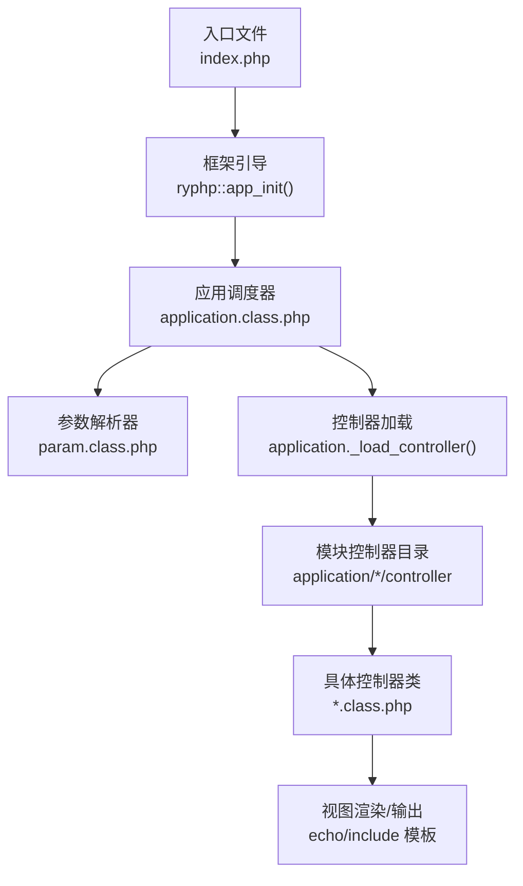
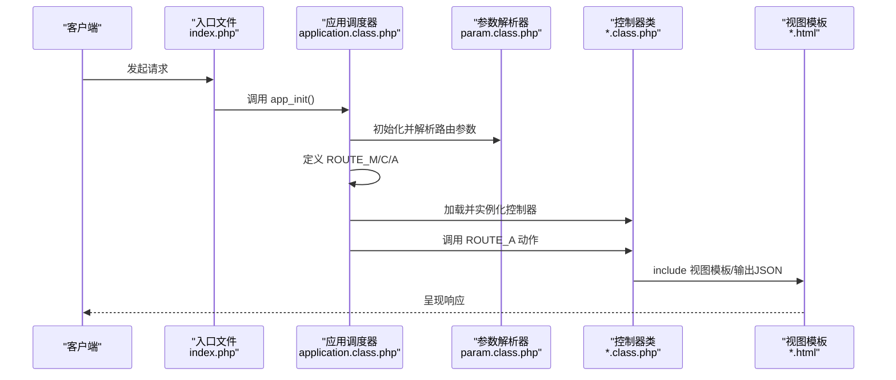
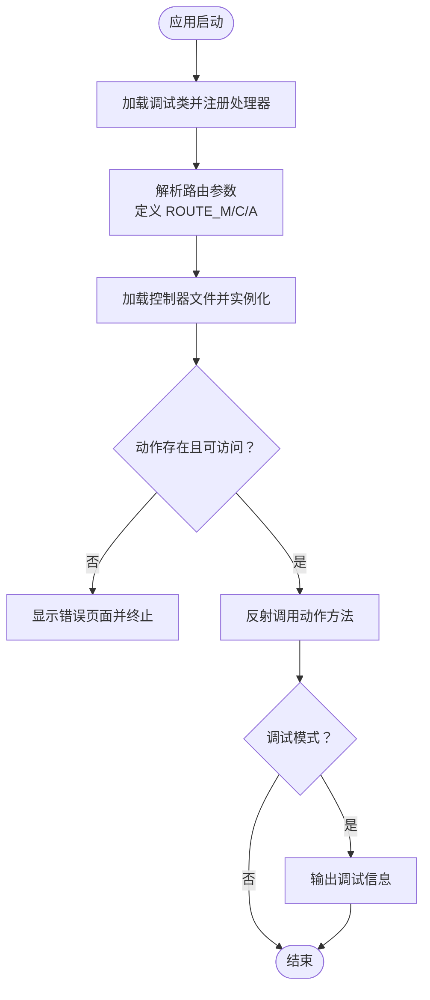
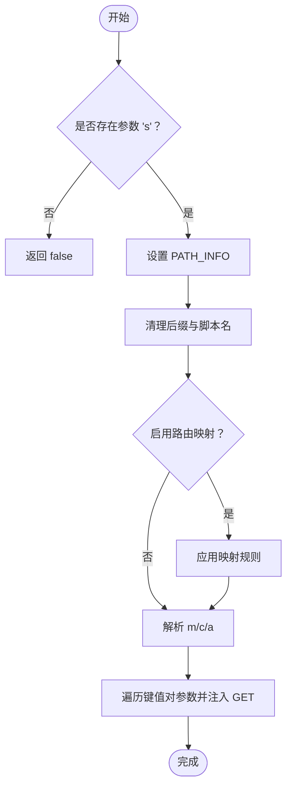
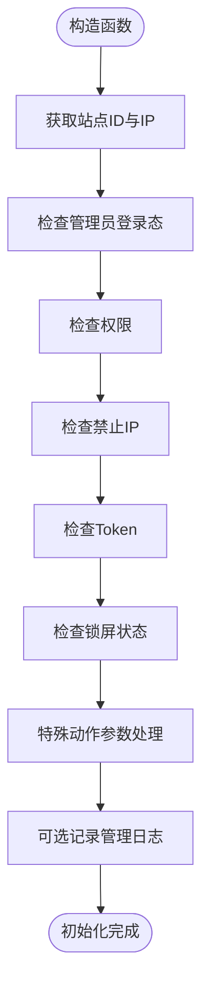
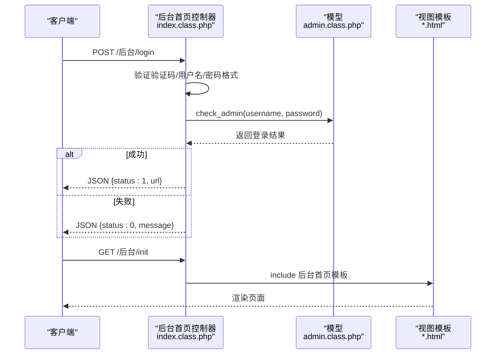
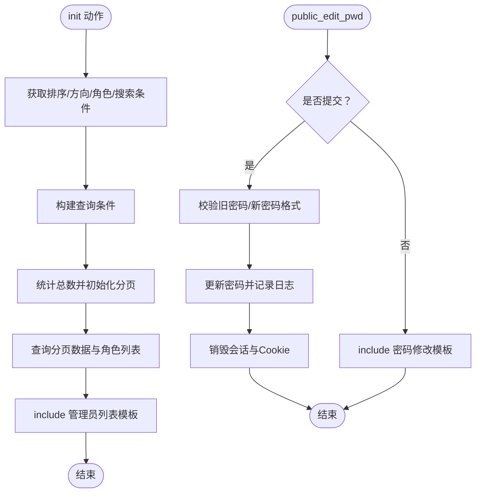
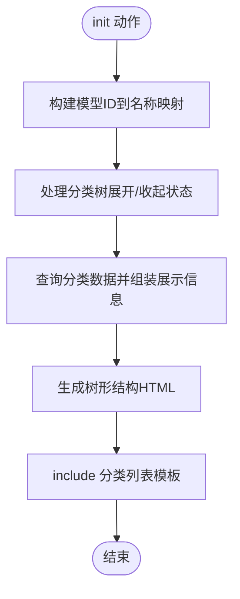
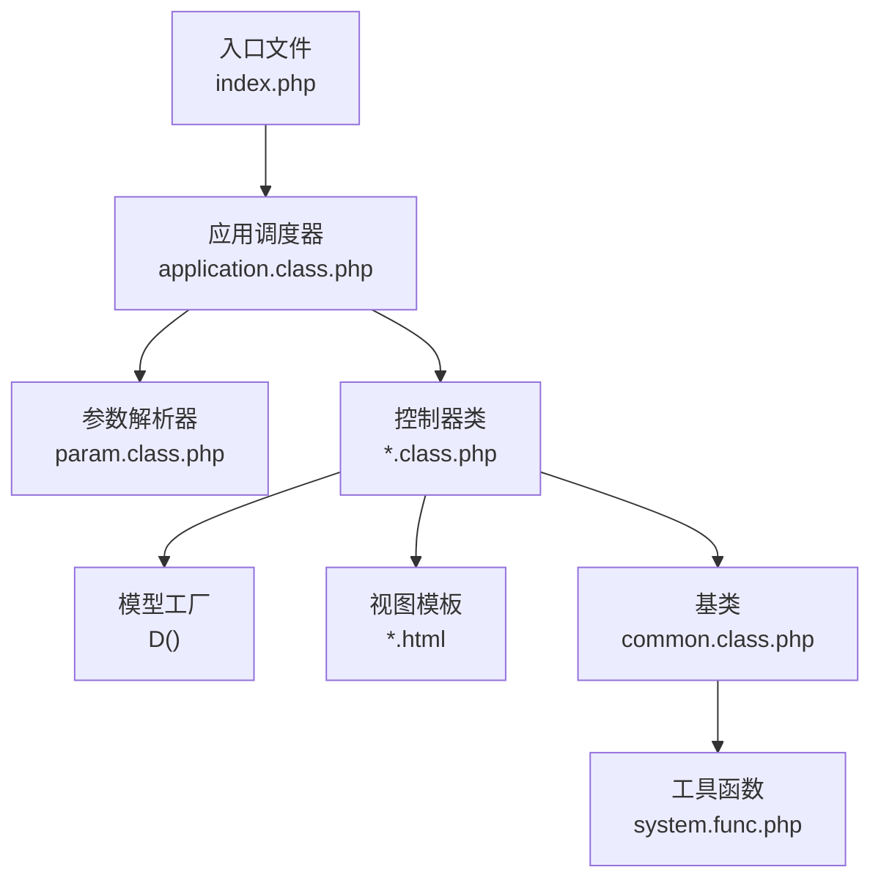

# 控制器层实现

<cite>
**本文档引用的文件**
- [index.php](file://index.php)
- [application.class.php](file://ryphp/core/class/application.class.php)
- [param.class.php](file://ryphp/core/class/param.class.php)
- [debug.class.php](file://ryphp/core/class/debug.class.php)
- [common.class.php](file://application/lry_admin_center/controller/common.class.php)
- [index.class.php](file://application/lry_admin_center/controller/index.class.php)
- [admin_manage.class.php](file://application/lry_admin_center/controller/admin_manage.class.php)
- [category.class.php](file://application/lry_admin_center/controller/category.class.php)
- [index.class.php](file://application/index/controller/index.class.php)
- [index.class.php](file://application/api/controller/index.class.php)
- [system.func.php](file://common/function/system.func.php)
</cite>

## 目录
1. [引言](#引言)
2. [项目结构](#项目结构)
3. [核心组件](#核心组件)
4. [架构总览](#架构总览)
5. [详细组件分析](#详细组件分析)
6. [依赖关系分析](#依赖关系分析)
7. [性能考虑](#性能考虑)
8. [故障排查指南](#故障排查指南)
9. [结论](#结论)
10. [附录](#附录)

## 引言
本文件聚焦于 LRYBlog 系统的 Controller 层实现，围绕 MVC 架构中控制器的职责与作用展开，涵盖请求处理、业务协调与响应生成；控制器生命周期管理（加载、初始化、方法调用）；路由系统工作原理（URL 解析、参数提取、路由匹配）；控制器方法访问控制（私有方法保护、权限验证、异常处理）；控制器编写示例；Controller 与 Model/View 的交互；以及错误处理与调试支持。

## 项目结构
LRYBlog 的控制器位于 application/*/controller 目录下，按模块划分：
- 应用前台模块：application/index/controller
- API 模块：application/api/controller  
- 后台管理中心模块：application/lry_admin_center/controller

入口文件通过单一入口加载框架并启动应用，路由参数由参数解析类解析，随后由应用调度器加载对应模块的控制器并调用指定方法。

**图表来源**
- [index.php:1-18](file://index.php#L1-L18)
- [application.class.php:48-65](file://ryphp/core/class/application.class.php#L48-L65)
- [param.class.php:7,19-46:7-46](file://ryphp/core/class/param.class.php#L7-L46)

**章节来源**
- [index.php:10-18](file://index.php#L10-L18)
- [application.class.php:9-19](file://ryphp/core/class/application.class.php#L9-L19)
- [param.class.php:7,19-46:7-46](file://ryphp/core/class/param.class.php#L7-L46)

## 核心组件
- 应用调度器（application）：负责初始化、路由参数定义、控制器加载与方法调用，并统一处理错误与调试。
- 参数解析器（param）：解析 URL 路径信息，提取模块（m）、控制器（c）、动作（a）及附加参数。
- 控制器基类（common）：后台控制器的通用基类，提供权限校验、IP 校验、Token 校验、锁屏检查、模板路径解析等。
- 具体控制器：如后台首页、管理员管理、分类管理等，负责具体业务逻辑与视图渲染。

**章节来源**
- [application.class.php:4-40](file://ryphp/core/class/application.class.php#L4-L40)
- [param.class.php:3,19-46:3-46](file://ryphp/core/class/param.class.php#L3-L46)
- [common.class.php:5-19](file://application/lry_admin_center/controller/common.class.php#L5-L19)

## 架构总览
控制器层在 MVC 中承担“请求协调者”的角色：
- 请求进入：入口文件加载框架，参数解析器解析路由参数。
- 控制器加载：应用调度器按模块与控制器定位文件并实例化类。
- 方法调用：检查动作可访问性（排除以下划线开头的方法），然后反射调用。
- 响应生成：控制器内部通过 include 模板或 JSON 输出等方式生成响应。
- 错误处理：全局注册错误/异常处理器，提供调试信息与错误页面。

**图表来源**
- [index.php:14-18](file://index.php#L14-L18)
- [application.class.php:14-39](file://ryphp/core/class/application.class.php#L14-L39)
- [param.class.php:19-46](file://ryphp/core/class/param.class.php#L19-L46)

## 详细组件分析

### 应用调度器（application）
- 生命周期
  - 构造阶段：加载调试类，注册致命错误、普通错误、异常处理器。
  - 初始化阶段：解析路由参数，定义 ROUTE_* 常量，加载控制器并调用动作。
- 控制器加载机制
  - 根据模块与控制器名拼接路径，检查目录与文件存在性，包含文件并实例化类。
- 方法调用流程
  - 检查动作是否存在且不以下划线开头，否则阻止访问。
  - 反射调用动作方法，开启调试时输出调试信息。
- 错误处理
  - 统一 halt 页面，支持自定义错误页与状态码。

**图表来源**
- [application.class.php:9-19](file://ryphp/core/class/application.class.php#L9-L19)
- [application.class.php:24-40](file://ryphp/core/class/application.class.php#L24-L40)

**章节来源**
- [application.class.php:9-19](file://ryphp/core/class/application.class.php#L9-L19)
- [application.class.php:24-40](file://ryphp/core/class/application.class.php#L24-L40)
- [application.class.php:48-65](file://ryphp/core/class/application.class.php#L48-L65)

### 参数解析器（param）
- URL 解析
  - 支持 PATH_INFO 模式，从 URL 中提取 m/c/a。
  - 支持路由映射（可选），将路径重写为新格式。
  - 支持键值对参数解析，将奇数位作为键、偶数位作为值注入 GET。
- 安全处理
  - 对 m/c/a 进行安全清洗，限制长度并去除危险字符。
- 默认值
  - 若未提供参数，回退到配置中的默认值。

**图表来源**
- [param.class.php:95-116](file://ryphp/core/class/param.class.php#L95-L116)
- [param.class.php:138-151](file://ryphp/core/class/param.class.php#L138-L151)

**章节来源**
- [param.class.php:7,19-46:7-46](file://ryphp/core/class/param.class.php#L7-L46)
- [param.class.php:95-116](file://ryphp/core/class/param.class.php#L95-L116)
- [param.class.php:138-151](file://ryphp/core/class/param.class.php#L138-L151)

### 控制器基类（common）
- 初始化流程
  - 获取站点 ID 与 IP，执行管理员登录态检查、权限检查、IP 白/黑名单检查、Token 校验、锁屏检查。
  - 特殊动作（如 init）对 GET 参数进行特殊处理。
  - 可选记录管理日志。
- 访问控制
  - 登录态校验：后台模块中除特定动作外，若会话缺失或不匹配则重定向登录。
  - 权限校验：超级管理员放行，公开动作放行，其余需查询角色权限表。
  - IP 校验：若命中禁止 IP 列表则拒绝访问。
  - Token 校验：POST 请求需携带有效 Token，公开动作与登录动作除外。
  - 锁屏检查：若处于锁屏状态，仅允许公开动作与登录动作。
- 模板路径解析
  - 提供 admin_tpl 方法，按模块与文件名拼装模板路径。

**图表来源**
- [common.class.php:8-19](file://application/lry_admin_center/controller/common.class.php#L8-L19)
- [common.class.php:32-50](file://application/lry_admin_center/controller/common.class.php#L32-L50)
- [common.class.php:56-62](file://application/lry_admin_center/controller/common.class.php#L56-L62)
- [common.class.php:86-93](file://application/lry_admin_center/controller/common.class.php#L86-L93)
- [common.class.php:126-131](file://application/lry_admin_center/controller/common.class.php#L126-L131)
- [common.class.php:100-106](file://application/lry_admin_center/controller/common.class.php#L100-L106)

**章节来源**
- [common.class.php:8-19](file://application/lry_admin_center/controller/common.class.php#L8-L19)
- [common.class.php:32-50](file://application/lry_admin_center/controller/common.class.php#L32-L50)
- [common.class.php:56-62](file://application/lry_admin_center/controller/common.class.php#L56-L62)
- [common.class.php:86-93](file://application/lry_admin_center/controller/common.class.php#L86-L93)
- [common.class.php:126-131](file://application/lry_admin_center/controller/common.class.php#L126-L131)
- [common.class.php:100-106](file://application/lry_admin_center/controller/common.class.php#L100-L106)

### 具体控制器示例

#### 后台首页控制器（index）
- init：统计未读留言数量，渲染后台首页模板。
- login：处理登录表单，验证码校验，用户名/密码格式校验，调用模型验证，返回 JSON 结果。
- public_logout/public_lock_screen/public_unlock_screen/public_clear_log/public_home：各类公开或受控操作，部分包含模板渲染与安全校验。

**图表来源**
- [index.class.php:6-17](file://application/lry_admin_center/controller/index.class.php#L6-L17)
- [index.class.php:19-38](file://application/lry_admin_center/controller/index.class.php#L19-L38)
- [index.class.php:120-148](file://application/lry_admin_center/controller/index.class.php#L120-L148)

**章节来源**
- [index.class.php:6-17](file://application/lry_admin_center/controller/index.class.php#L6-L17)
- [index.class.php:19-38](file://application/lry_admin_center/controller/index.class.php#L19-L38)
- [index.class.php:120-148](file://application/lry_admin_center/controller/index.class.php#L120-L148)

#### 管理员管理控制器（admin_manage）
- init：支持排序字段与方向、角色筛选、时间段搜索、关键词搜索，分页查询管理员列表，渲染模板。
- public_edit_info/public_edit_pwd：个人信息与密码修改，含格式校验、旧密码验证、日志记录与会话销毁。

**图表来源**
- [admin_manage.class.php:11-44](file://application/lry_admin_center/controller/admin_manage.class.php#L11-L44)
- [admin_manage.class.php:70-104](file://application/lry_admin_center/controller/admin_manage.class.php#L70-L104)

**章节来源**
- [admin_manage.class.php:11-44](file://application/lry_admin_center/controller/admin_manage.class.php#L11-L44)
- [admin_manage.class.php:70-104](file://application/lry_admin_center/controller/admin_manage.class.php#L70-L104)

#### 分类管理控制器（category）
- init：构建模型映射、处理分类树展开/收起状态、查询分类数据、生成树形 HTML 并渲染列表模板。
- add/adds/edit/delete：分类增删改查，涉及目录唯一性校验、父子路径修复、模板选择、缓存清理等。
- public_category_template：返回模板选择数据。
- order：批量排序并清理缓存。

**图表来源**
- [category.class.php:27-134](file://application/lry_admin_center/controller/category.class.php#L27-L134)

**章节来源**
- [category.class.php:27-134](file://application/lry_admin_center/controller/category.class.php#L27-L134)
- [category.class.php:144-278](file://application/lry_admin_center/controller/category.class.php#L144-L278)
- [category.class.php:344-428](file://application/lry_admin_center/controller/category.class.php#L344-L428)
- [category.class.php:435-453](file://application/lry_admin_center/controller/category.class.php#L435-L453)
- [category.class.php:499-509](file://application/lry_admin_center/controller/category.class.php#L499-L509)
- [category.class.php:563-572](file://application/lry_admin_center/controller/category.class.php#L563-L572)

#### 前台首页控制器（index）
- 构造函数：从 GET 中提取页码参数。
- init：查询分类数据并输出（用于演示）。

**章节来源**
- [index.class.php:9-17](file://application/index/controller/index.class.php#L9-L17)

#### API 控制器（index）
- code：动态生成验证码图片，设置宽高、长度、字体大小等参数，保存验证码至会话。

**章节来源**
- [index.class.php:6-17](file://application/api/controller/index.class.php#L6-L17)

### 控制器与 Model/View 的交互
- 与 Model 的交互
  - 控制器通过 D() 工厂函数获取模型实例，执行查询、统计、更新、删除等操作。
  - 示例：后台首页统计未读留言、管理员登录验证、分类增删改查、分页查询等。
- 与 View 的交互
  - 控制器通过 include 模板文件渲染页面，或直接输出 JSON。
  - 后台控制器提供 admin_tpl 辅助方法，按模块与文件名拼装模板路径。
  - 工具函数提供 URL 生成、SEO、站点信息等辅助能力。

**章节来源**
- [index.class.php:14-16](file://application/lry_admin_center/controller/index.class.php#L14-L16)
- [admin_manage.class.php:37-43](file://application/lry_admin_center/controller/admin_manage.class.php#L37-L43)
- [category.class.php:68-71](file://application/lry_admin_center/controller/category.class.php#L68-L71)
- [common.class.php:139-144](file://application/lry_admin_center/controller/common.class.php#L139-L144)
- [system.func.php:65-74](file://common/function/system.func.php#L65-L74)

## 依赖关系分析
- 入口文件依赖框架引导，定义调试开关与 URL 模型。
- 应用调度器依赖参数解析器与控制器文件。
- 控制器基类依赖模型与工具函数，提供权限与安全控制。
- 控制器与视图模板之间通过 include 关联，形成渲染链路。

**图表来源**
- [index.php:14-18](file://index.php#L14-L18)
- [application.class.php:14-39](file://ryphp/core/class/application.class.php#L14-L39)
- [common.class.php:139-144](file://application/lry_admin_center/controller/common.class.php#L139-L144)
- [system.func.php:1-20](file://common/function/system.func.php#L1-L20)

**章节来源**
- [index.php:14-18](file://index.php#L14-L18)
- [application.class.php:14-39](file://ryphp/core/class/application.class.php#L14-L39)
- [common.class.php:139-144](file://application/lry_admin_center/controller/common.class.php#L139-L144)

## 性能考虑
- 控制器方法调用采用反射，建议避免在高频路径中频繁实例化复杂对象。
- 分页查询与条件过滤应配合索引，减少数据库压力。
- 模板渲染与静态资源分离，减少 PHP 执行时间。
- 调试模式仅在开发环境启用，避免生产环境输出调试信息带来的性能损耗。

## 故障排查指南
- 路由错误
  - 检查 URL 模型与路由映射配置，确认 PATH_INFO 是否正确传递。
  - 确认 m/c/a 参数未被安全处理过滤掉。
- 控制器加载失败
  - 确认模块目录与控制器文件存在，类名与文件名一致。
  - 检查命名空间或类重复定义问题。
- 动作不可访问
  - 下划线开头的动作会被拦截，确保动作名合法。
- 权限与登录态
  - 登录态缺失或 Cookie 不匹配会触发登录重定向。
  - 权限不足会返回无权限消息，检查角色权限表配置。
- 异常与错误
  - 开启调试模式查看详细错误信息与 SQL 日志。
  - 生产环境可通过错误日志定位问题。

**章节来源**
- [application.class.php:26-39](file://ryphp/core/class/application.class.php#L26-L39)
- [application.class.php:108-115](file://ryphp/core/class/application.class.php#L108-L115)
- [common.class.php:32-50](file://application/lry_admin_center/controller/common.class.php#L32-L50)
- [common.class.php:56-62](file://application/lry_admin_center/controller/common.class.php#L56-L62)
- [debug.class.php:97-112](file://ryphp/core/class/debug.class.php#L97-L112)

## 结论
LRYBlog 的 Controller 层遵循清晰的 MVC 分层：入口文件负责引导，参数解析器负责路由，应用调度器负责加载与调用，控制器基类提供统一的安全与权限保障，具体控制器专注业务逻辑与视图渲染。通过路由映射、参数清洗与统一错误处理，系统在保证安全性的同时提供了良好的可维护性与扩展性。

## 附录
- 控制器编写最佳实践
  - 明确动作职责，避免在一个动作中处理过多业务。
  - 使用基类提供的权限与安全检查，减少重复代码。
  - 对外输出统一使用 JSON 或模板渲染，保持一致性。
  - 合理使用分页与缓存，提升性能。
- 常用工具函数参考
  - URL 生成、SEO、站点信息等辅助函数可直接在控制器中使用。

**章节来源**
- [system.func.php:65-74](file://common/function/system.func.php#L65-L74)
- [system.func.php:119-128](file://common/function/system.func.php#L119-L128)
- [system.func.php:35-40](file://common/function/system.func.php#L35-L40)