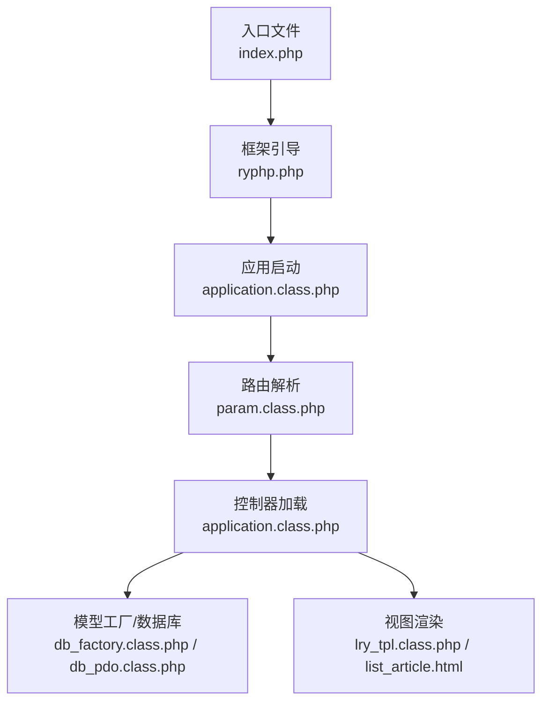
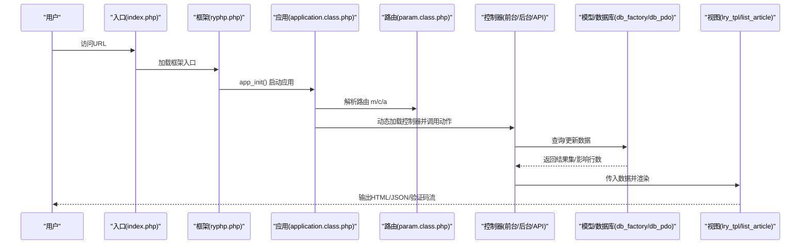
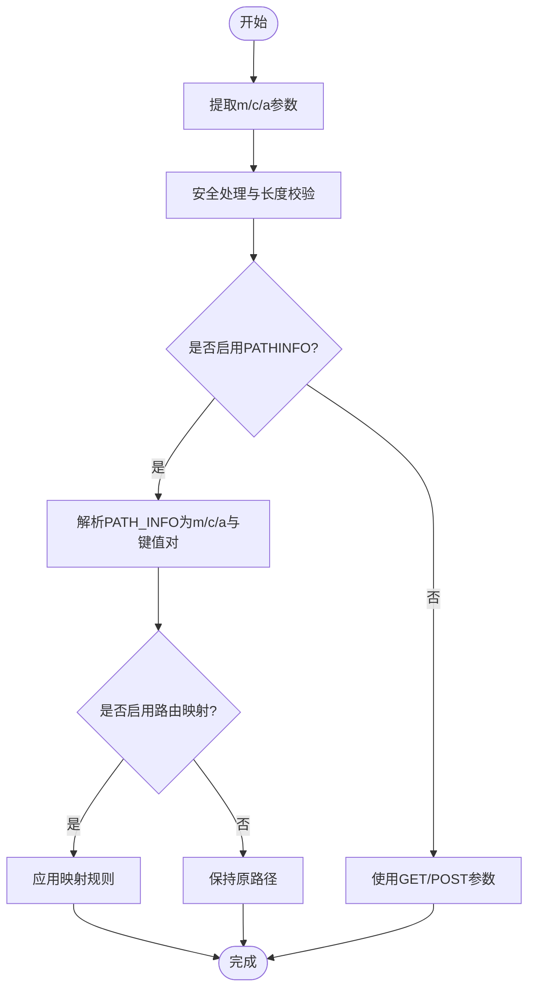
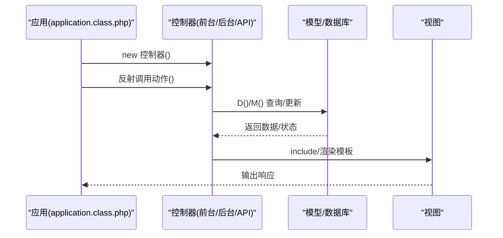
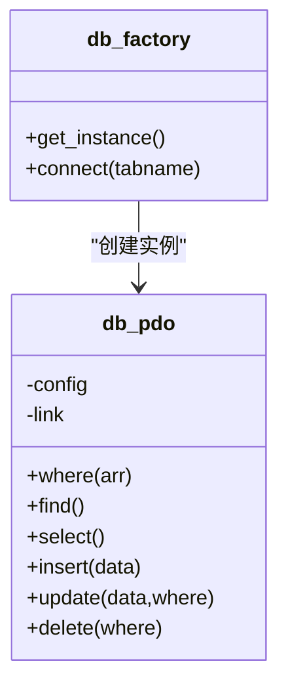
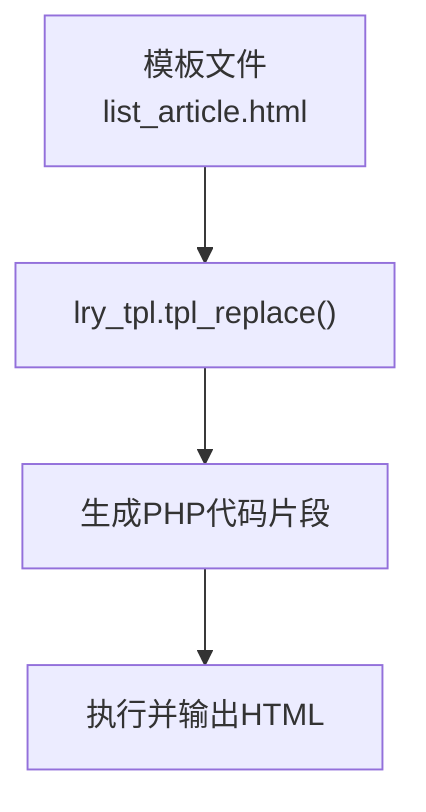
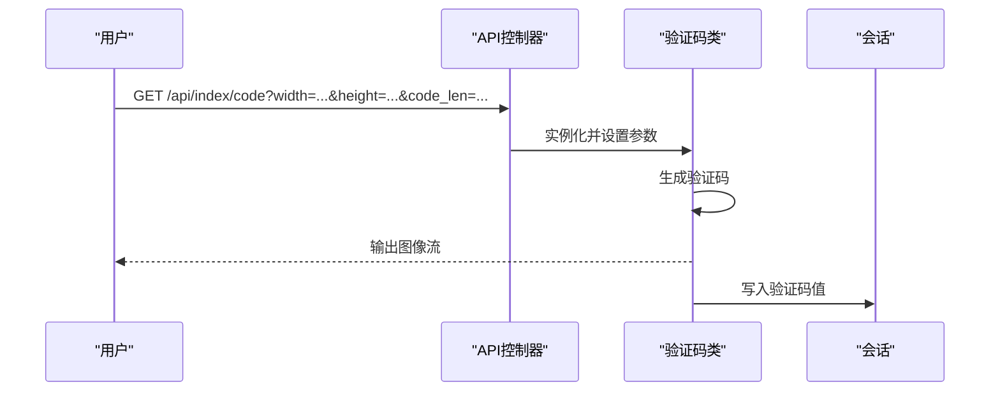
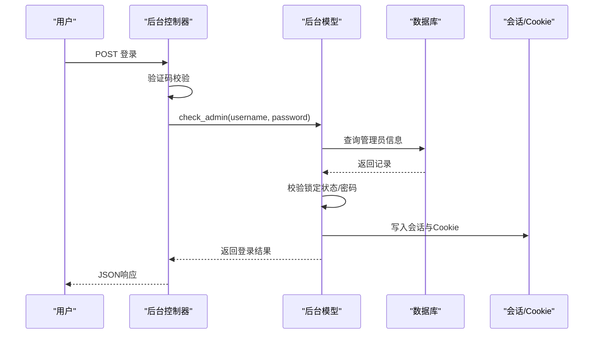
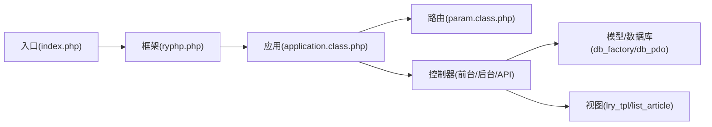

# MVC交互机制

<cite>
**本文引用的文件**
- [index.php](file://index.php)
- [ryphp.php](file://ryphp/ryphp.php)
- [application.class.php](file://ryphp/core/class/application.class.php)
- [param.class.php](file://ryphp/core/class/param.class.php)
- [config.php](file://common/config/config.php)
- [index.class.php（前台控制器）](file://application/index/controller/index.class.php)
- [index.class.php（API控制器）](file://application/api/controller/index.class.php)
- [index.class.php（后台控制器）](file://application/lry_admin_center/controller/index.class.php)
- [admin.class.php（后台模型）](file://application/lry_admin_center/model/admin.class.php)
- [db_factory.class.php](file://ryphp/core/class/db_factory.class.php)
- [db_pdo.class.php](file://ryphp/core/class/db_pdo.class.php)
- [lry_tpl.class.php](file://ryphp/core/class/lry_tpl.class.php)
- [list_article.html](file://application/index/view/rongyao/list_article.html)
- [debug.class.php](file://ryphp/core/class/debug.class.php)
</cite>

## 目录
1. [引言](#引言)
2. [项目结构](#项目结构)
3. [核心组件](#核心组件)
4. [架构总览](#架构总览)
5. [详细组件分析](#详细组件分析)
6. [依赖关系分析](#依赖关系分析)
7. [性能考量](#性能考量)
8. [故障排查指南](#故障排查指南)
9. [结论](#结论)
10. [附录](#附录)

## 引言
本文件围绕LRYBlog系统的MVC交互机制展开，系统采用“单一入口 + 路由解析 + 控制器调度 + 模型与视图”的经典分层架构。本文将从请求到响应的完整流程入手，逐层剖析MVC各层之间的数据流转与控制传递，解释路由参数、依赖注入、事件通信、数据传递与状态管理，并结合具体示例说明典型用户请求在MVC中的处理过程，最后总结MVC模式在博客系统中的优势与局限。

## 项目结构
LRYBlog遵循“模块化 + 分层”的组织方式：
- 入口文件负责初始化框架与应用
- 框架内核提供路由、类加载、数据库工厂、模板引擎等基础设施
- 应用层按模块划分（前台、API、后台管理中心），每个模块包含controller、model、view
- 视图采用自定义模板语法，配合模板解析类进行渲染

图表来源
- [index.php:1-18](file://index.php#L1-L18)
- [ryphp.php:83-90](file://ryphp/ryphp.php#L83-L90)
- [application.class.php:24-40](file://ryphp/core/class/application.class.php#L24-L40)
- [param.class.php:19-46](file://ryphp/core/class/param.class.php#L19-L46)

章节来源
- [index.php:1-18](file://index.php#L1-L18)
- [ryphp.php:108-140](file://ryphp/ryphp.php#L108-L140)
- [application.class.php:48-65](file://ryphp/core/class/application.class.php#L48-L65)

## 核心组件
- 入口与引导
  - 入口文件定义常量并加载框架入口，随后触发应用初始化
  - 框架入口提供类加载、系统常量、URL常量、配置读取等能力
- 应用与路由
  - 应用类负责注册错误/异常处理器、解析路由参数（模块m、控制器c、动作a）、加载并执行控制器动作
  - 路由类负责从URL中提取m/c/a及附加参数，支持PATHINFO与路由映射
- 模型与数据访问
  - 数据库工厂根据配置选择具体驱动（PDO/MySQLi/MySQL），统一对外暴露连接实例
  - PDO实现提供链式查询构建、预处理绑定、SQL执行与调试记录
- 视图与模板
  - 模板解析类将自定义标签转换为PHP代码，实现循环、条件、函数调用等
  - 视图文件通过变量与标签组合输出最终HTML

章节来源
- [ryphp.php:83-90](file://ryphp/ryphp.php#L83-L90)
- [application.class.php:9-19](file://ryphp/core/class/application.class.php#L9-L19)
- [param.class.php:7-15](file://ryphp/core/class/param.class.php#L7-L15)
- [db_factory.class.php:11-34](file://ryphp/core/class/db_factory.class.php#L11-L34)
- [db_pdo.class.php:100-124](file://ryphp/core/class/db_pdo.class.php#L100-L124)
- [lry_tpl.class.php:31-59](file://ryphp/core/class/lry_tpl.class.php#L31-L59)

## 架构总览
MVC在LRYBlog中的交互流程如下：
- 请求进入入口文件，框架初始化
- 应用启动后，路由解析器从URL中提取模块、控制器与动作
- 应用加载对应控制器，检查动作可见性后反射调用
- 控制器通过模型层进行数据查询或业务处理
- 控制器将数据传递给视图，模板解析类渲染输出

图表来源
- [index.php:14-18](file://index.php#L14-L18)
- [ryphp.php:88-90](file://ryphp/ryphp.php#L88-L90)
- [application.class.php:24-40](file://ryphp/core/class/application.class.php#L24-L40)
- [param.class.php:95-116](file://ryphp/core/class/param.class.php#L95-L116)

## 详细组件分析

### 入口与应用启动
- 入口文件定义调试开关、根路径、URL模式，然后调用框架入口完成初始化
- 框架入口定义系统常量、加载全局函数与公共配置，提供类加载与模块化控制器/模型加载
- 应用类在构造阶段注册错误/异常处理器，解析路由参数并初始化应用；在init中加载控制器并反射调用动作

章节来源
- [index.php:10-18](file://index.php#L10-L18)
- [ryphp.php:17-31](file://ryphp/ryphp.php#L17-L31)
- [ryphp.php:108-140](file://ryphp/ryphp.php#L108-L140)
- [application.class.php:9-19](file://ryphp/core/class/application.class.php#L9-L19)
- [application.class.php:24-40](file://ryphp/core/class/application.class.php#L24-L40)

### 路由解析与参数传递
- 路由类从GET/POST中提取m/c/a，同时支持PATHINFO模式与路由映射
- 安全处理会清理非法字符并限制长度，防止注入与越界
- PATHINFO模式下，URL路径会被解析为m/c/a以及额外键值对，作为后续控制器动作的参数来源

图表来源
- [param.class.php:19-46](file://ryphp/core/class/param.class.php#L19-L46)
- [param.class.php:54-60](file://ryphp/core/class/param.class.php#L54-L60)
- [param.class.php:95-116](file://ryphp/core/class/param.class.php#L95-L116)
- [param.class.php:138-151](file://ryphp/core/class/param.class.php#L138-L151)

章节来源
- [param.class.php:7-15](file://ryphp/core/class/param.class.php#L7-L15)
- [param.class.php:19-46](file://ryphp/core/class/param.class.php#L19-L46)
- [param.class.php:54-60](file://ryphp/core/class/param.class.php#L54-L60)
- [param.class.php:95-116](file://ryphp/core/class/param.class.php#L95-L116)
- [param.class.php:138-151](file://ryphp/core/class/param.class.php#L138-L151)

### 控制器层：调度与动作执行
- 控制器类位于各自模块的controller目录，应用类动态加载对应控制器并调用动作
- 动作可见性检查：以下划线开头的动作不可直接访问
- 控制器内部可调用模型层进行数据处理，也可直接渲染视图或输出JSON

图表来源
- [application.class.php:24-40](file://ryphp/core/class/application.class.php#L24-L40)
- [application.class.php:48-65](file://ryphp/core/class/application.class.php#L48-L65)

章节来源
- [application.class.php:24-40](file://ryphp/core/class/application.class.php#L24-L40)
- [application.class.php:48-65](file://ryphp/core/class/application.class.php#L48-L65)
- [index.class.php（前台控制器）:14-17](file://application/index/controller/index.class.php#L14-L17)
- [index.class.php（API控制器）:6-17](file://application/api/controller/index.class.php#L6-L17)
- [index.class.php（后台控制器）:6-13](file://application/lry_admin_center/controller/index.class.php#L6-L13)

### 模型层：数据抽象与持久化
- 数据库工厂根据配置选择驱动，统一提供连接实例
- PDO实现支持链式构建查询、预处理绑定、自动转义与调试记录
- 控制器通过D()/M()访问模型，模型内部可调用数据库类执行SQL

图表来源
- [db_factory.class.php:11-34](file://ryphp/core/class/db_factory.class.php#L11-L34)
- [db_pdo.class.php:100-124](file://ryphp/core/class/db_pdo.class.php#L100-L124)

章节来源
- [db_factory.class.php:11-34](file://ryphp/core/class/db_factory.class.php#L11-L34)
- [db_pdo.class.php:100-124](file://ryphp/core/class/db_pdo.class.php#L100-L124)

### 视图层：模板解析与渲染
- 模板解析类将自定义标签转换为PHP代码，支持include、if/else、loop、函数调用等
- 视图文件通过变量与标签组合输出HTML，支持主题切换与静态资源引用
- 控制器可直接include视图或通过辅助方法渲染

图表来源
- [lry_tpl.class.php:31-59](file://ryphp/core/class/lry_tpl.class.php#L31-L59)
- [list_article.html:1-150](file://application/index/view/rongyao/list_article.html#L1-L150)

章节来源
- [lry_tpl.class.php:31-59](file://ryphp/core/class/lry_tpl.class.php#L31-L59)
- [list_article.html:1-150](file://application/index/view/rongyao/list_article.html#L1-L150)

### 典型交互示例：验证码生成
- 请求路径携带宽高、长度、字体大小等参数
- 控制器实例化验证码类，按参数调整尺寸与长度，生成验证码图像并写入会话
- 输出图像流供前端显示

图表来源
- [index.class.php（API控制器）:6-17](file://application/api/controller/index.class.php#L6-L17)

章节来源
- [index.class.php（API控制器）:6-17](file://application/api/controller/index.class.php#L6-L17)

### 典型交互示例：后台登录
- 控制器接收POST参数，进行验证码校验与用户名/密码格式校验
- 调用模型进行管理员身份验证，处理账户锁定逻辑
- 成功后写入会话与Cookie，返回JSON结果；失败记录日志并返回错误信息

图表来源
- [index.class.php（后台控制器）:19-38](file://application/lry_admin_center/controller/index.class.php#L19-L38)
- [admin.class.php:4-27](file://application/lry_admin_center/model/admin.class.php#L4-L27)

章节来源
- [index.class.php（后台控制器）:19-38](file://application/lry_admin_center/controller/index.class.php#L19-L38)
- [admin.class.php:4-27](file://application/lry_admin_center/model/admin.class.php#L4-L27)

## 依赖关系分析
- 入口与框架
  - 入口文件依赖框架入口；框架入口依赖系统常量、URL常量、全局函数与配置
- 应用与路由
  - 应用类依赖路由类解析参数；路由类依赖配置与URL模式
- 控制器与模型
  - 控制器通过D()/M()访问模型；模型通过数据库工厂/PDO执行SQL
- 视图与模板
  - 视图依赖模板解析类；模板解析类依赖标签回调与缓存机制

图表来源
- [index.php:14-18](file://index.php#L14-L18)
- [ryphp.php:88-90](file://ryphp/ryphp.php#L88-L90)
- [application.class.php:24-40](file://ryphp/core/class/application.class.php#L24-L40)
- [param.class.php:19-46](file://ryphp/core/class/param.class.php#L19-L46)

章节来源
- [ryphp.php:17-31](file://ryphp/ryphp.php#L17-L31)
- [application.class.php:24-40](file://ryphp/core/class/application.class.php#L24-L40)
- [param.class.php:19-46](file://ryphp/core/class/param.class.php#L19-L46)

## 性能考量
- 路由解析与类加载
  - 路由解析支持PATHINFO与映射，减少不必要的参数传递；类加载采用静态缓存避免重复include
- 数据库访问
  - PDO使用预处理绑定，降低SQL注入风险并提升执行效率；调试模式下记录SQL耗时
- 模板渲染
  - 模板标签转换为PHP代码，减少运行时解析成本；支持缓存标签与分页
- 资源加载
  - 视图中采用关键资源预加载与非关键资源延迟加载策略，优化首屏体验

章节来源
- [param.class.php:95-116](file://ryphp/core/class/param.class.php#L95-L116)
- [db_pdo.class.php:100-124](file://ryphp/core/class/db_pdo.class.php#L100-L124)
- [lry_tpl.class.php:31-59](file://ryphp/core/class/lry_tpl.class.php#L31-L59)
- [list_article.html:18-30](file://application/index/view/rongyao/list_article.html#L18-L30)

## 故障排查指南
- 错误与异常处理
  - 应用类注册致命错误、普通错误与异常处理器；调试模式下输出详细信息，非调试模式按配置显示错误页或日志
- 数据库连接问题
  - PDO捕获连接异常并根据调试模式提示；支持断线重连与SQL错误记录
- 路由参数异常
  - 路由类对参数长度与非法字符进行限制，超限或包含非法字符将被拒绝

章节来源
- [application.class.php:10-19](file://ryphp/core/class/application.class.php#L10-L19)
- [debug.class.php:46-69](file://ryphp/core/class/debug.class.php#L46-L69)
- [debug.class.php:75-94](file://ryphp/core/class/debug.class.php#L75-L94)
- [db_pdo.class.php:37-42](file://ryphp/core/class/db_pdo.class.php#L37-L42)
- [param.class.php:54-60](file://ryphp/core/class/param.class.php#L54-L60)

## 结论
LRYBlog的MVC交互机制通过清晰的分层与模块化设计实现了良好的职责分离与可维护性。入口与框架提供统一的初始化与基础设施，路由解析保证了灵活的URL风格，控制器作为协调者连接模型与视图，模型层封装数据访问，视图层负责表现。在博客场景中，该架构能够快速迭代功能、复用通用组件，并通过模板与缓存机制提升性能。但需要注意的是，随着业务复杂度上升，应持续关注路由健壮性、模型抽象边界与视图渲染性能，以保持整体架构的稳定与高效。

## 附录
- 配置要点
  - 路由默认值与映射开关、URL伪静态后缀、数据库驱动与连接参数、缓存类型与参数等均在配置文件中集中管理
- 最佳实践
  - 控制器只做编排，不做重逻辑；模型层统一数据访问与校验；视图尽量保持轻量；合理使用缓存与分页；严格参数校验与错误处理

章节来源
- [config.php:24-30](file://common/config/config.php#L24-L30)
- [config.php:14-21](file://common/config/config.php#L14-L21)
- [config.php:40-66](file://common/config/config.php#L40-L66)