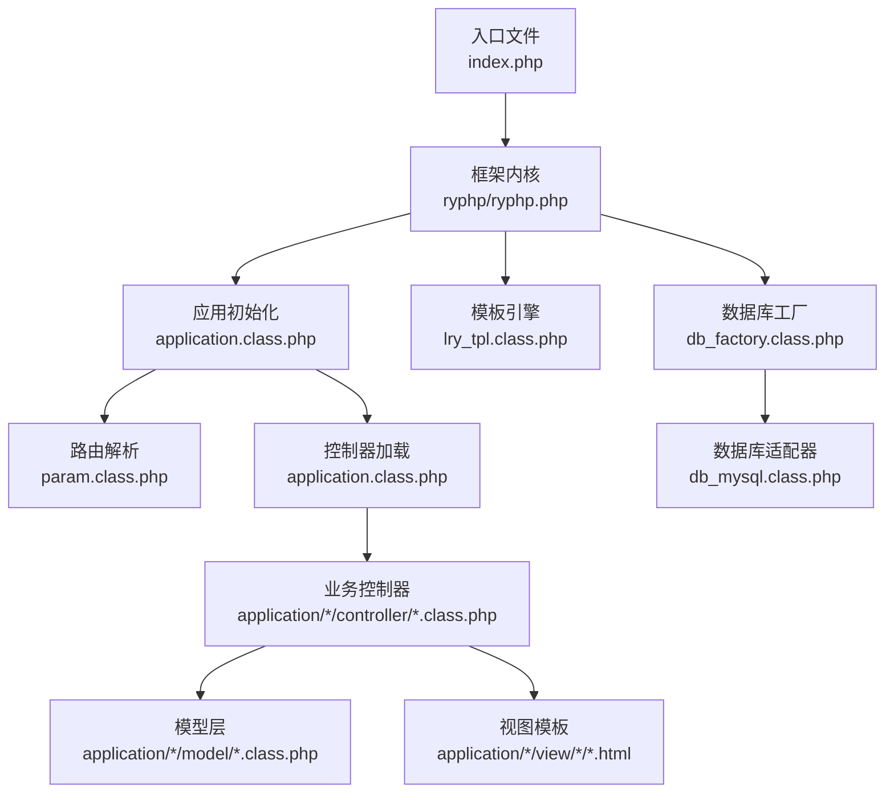
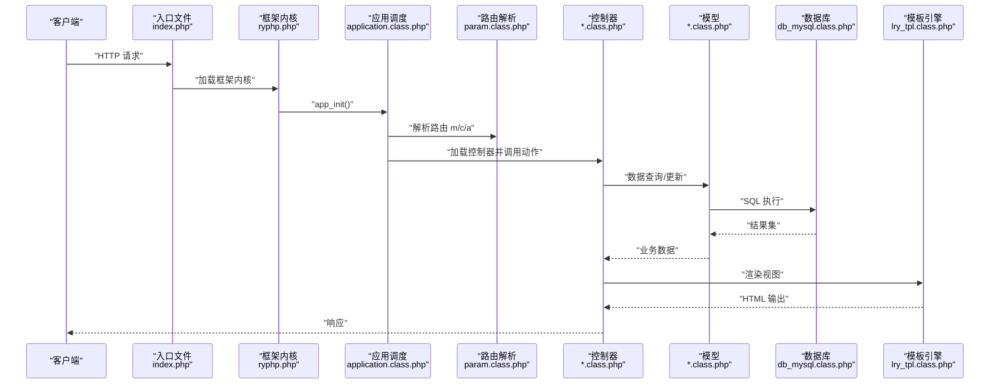
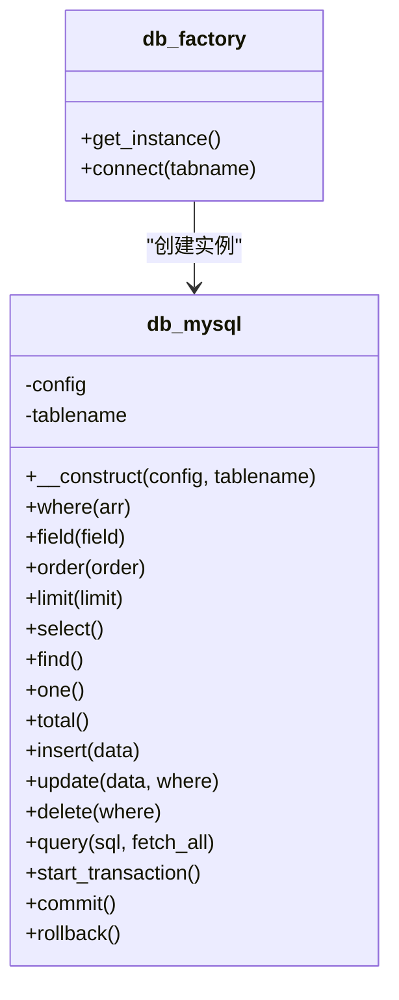
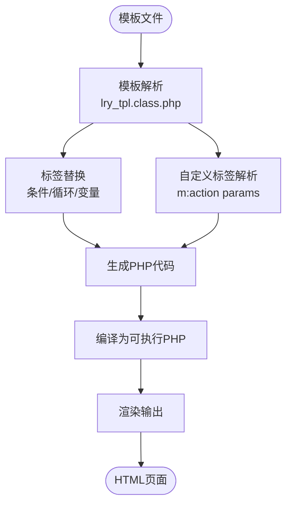
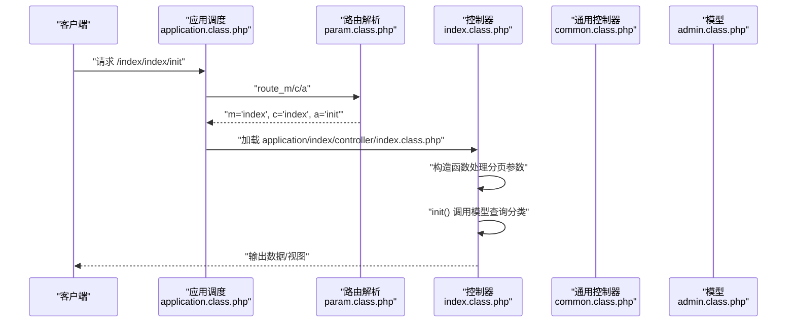
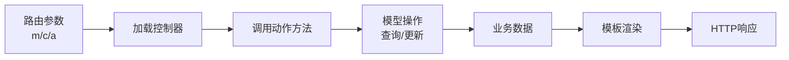
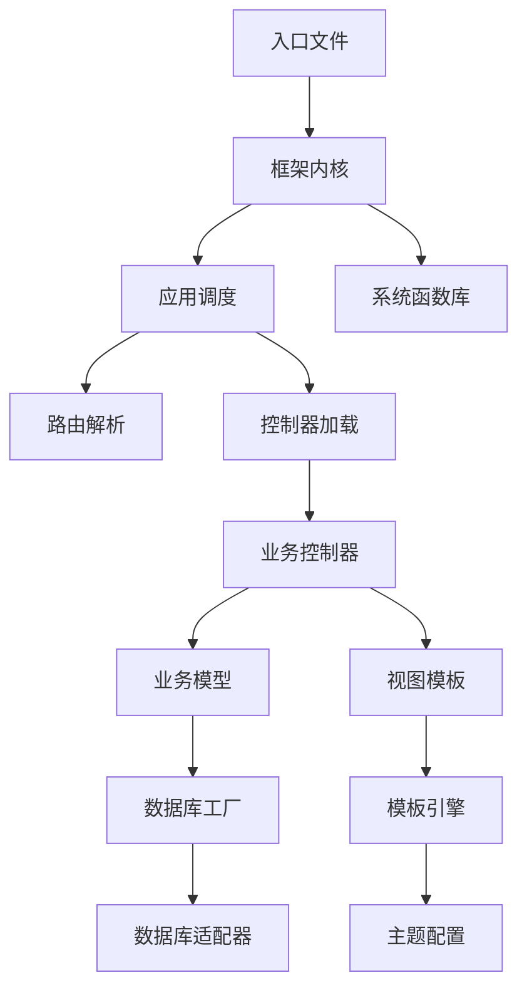

# MVC模式实现

<cite>
**本文档引用的文件**
- [index.php](file://index.php)
- [ryphp.php](file://ryphp/ryphp.php)
- [application.class.php](file://ryphp/core/class/application.class.php)
- [param.class.php](file://ryphp/core/class/param.class.php)
- [db_factory.class.php](file://ryphp/core/class/db_factory.class.php)
- [db_mysql.class.php](file://ryphp/core/class/db_mysql.class.php)
- [lry_tpl.class.php](file://ryphp/core/class/lry_tpl.class.php)
- [index.class.php](file://application/index/controller/index.class.php)
- [index.class.php](file://application/lry_admin_center/controller/index.class.php)
- [common.class.php](file://application/lry_admin_center/controller/common.class.php)
- [admin.class.php](file://application/lry_admin_center/model/admin.class.php)
- [config.php](file://application/index/view/rongyao/config.php)
- [show_article.html](file://application/index/view/rongyao/show_article.html)
- [system.func.php](file://common/function/system.func.php)
- [version.php](file://common/data/version.php)
</cite>

## 目录
1. [引言](#引言)
2. [项目结构](#项目结构)
3. [核心组件](#核心组件)
4. [架构总览](#架构总览)
5. [详细组件分析](#详细组件分析)
6. [依赖关系分析](#依赖关系分析)
7. [性能考虑](#性能考虑)
8. [故障排除指南](#故障排除指南)
9. [结论](#结论)

## 引言
本文件面向LRYBlog系统，系统性阐述其基于MVC（Model-View-Controller）架构的实现方式。文档从三层架构的职责边界出发，详细解析Model层的数据访问与验证、View层的模板引擎与渲染、Controller层的路由解析与请求调度，并总结MVC在博客系统中的优势与适用性。

## 项目结构
LRYBlog采用模块化组织，核心入口位于根目录的单一入口文件，框架内核位于`ryphp/`目录，业务应用位于`application/`目录，公共资源位于`common/`目录。系统通过入口文件引导至框架内核，再由内核完成路由解析、控制器加载与视图渲染。

**图表来源**
- [index.php](file://index.php#L1-L18)
- [ryphp.php](file://ryphp/ryphp.php#L83-L204)
- [application.class.php](file://ryphp/core/class/application.class.php#L4-L118)
- [param.class.php](file://ryphp/core/class/param.class.php#L3-L195)
- [lry_tpl.class.php](file://ryphp/core/class/lry_tpl.class.php#L10-L134)
- [db_factory.class.php](file://ryphp/core/class/db_factory.class.php#L2-L50)
- [db_mysql.class.php](file://ryphp/core/class/db_mysql.class.php#L10-L667)

**章节来源**
- [index.php](file://index.php#L1-L18)
- [ryphp.php](file://ryphp/ryphp.php#L1-L204)

## 核心组件
- 框架入口与引导：入口文件定义常量并加载框架内核，随后触发应用初始化。
- 应用初始化与调度：应用类负责路由参数解析、控制器加载与动作调用。
- 路由解析：参数类负责从URL中提取模块(m)、控制器(c)、动作(a)，并支持PATH_INFO模式。
- 数据访问层：数据库工厂根据配置选择具体适配器，提供统一的查询接口。
- 视图与模板：模板引擎将模板语法转换为PHP代码，配合主题配置与函数库进行渲染。
- 控制器与模型：控制器负责业务编排与响应生成；模型负责数据逻辑与验证。

**章节来源**
- [ryphp.php](file://ryphp/ryphp.php#L83-L204)
- [application.class.php](file://ryphp/core/class/application.class.php#L4-L118)
- [param.class.php](file://ryphp/core/class/param.class.php#L3-L195)
- [db_factory.class.php](file://ryphp/core/class/db_factory.class.php#L2-L50)
- [lry_tpl.class.php](file://ryphp/core/class/lry_tpl.class.php#L10-L134)

## 架构总览
MVC在LRYBlog中的工作流如下：客户端请求到达入口文件，框架解析路由参数，定位模块与控制器的动作方法，控制器调用模型获取数据，最终通过模板引擎渲染视图输出。

**图表来源**
- [index.php](file://index.php#L1-L18)
- [ryphp.php](file://ryphp/ryphp.php#L83-L204)
- [application.class.php](file://ryphp/core/class/application.class.php#L24-L40)
- [param.class.php](file://ryphp/core/class/param.class.php#L22-L46)
- [db_mysql.class.php](file://ryphp/core/class/db_mysql.class.php#L136-L153)
- [lry_tpl.class.php](file://ryphp/core/class/lry_tpl.class.php#L31-L59)

## 详细组件分析

### Model层：数据访问与验证
Model层通过数据库工厂与适配器实现统一的数据访问，提供链式查询构建器与常用CRUD操作，同时具备错误处理与调试能力。

- 数据库工厂与适配器
  - 工厂根据配置选择具体数据库类型（mysql/mysqli/pdo），并返回对应适配器实例。
  - 适配器提供连接管理、SQL执行、事务控制、字段与表检查等能力。
- 链式查询构建器
  - 支持where、field、order、limit、group、having、join等方法组合。
  - 提供insert、update、delete、select、find、one、total、query等操作。
- 错误处理与调试
  - 执行异常时根据调试模式输出详细错误或记录日志并返回友好提示。
  - 开启调试时记录SQL执行时间与语句，便于性能分析。

**图表来源**
- [db_factory.class.php](file://ryphp/core/class/db_factory.class.php#L11-L49)
- [db_mysql.class.php](file://ryphp/core/class/db_mysql.class.php#L23-L288)

**章节来源**
- [db_factory.class.php](file://ryphp/core/class/db_factory.class.php#L2-L50)
- [db_mysql.class.php](file://ryphp/core/class/db_mysql.class.php#L10-L667)

### View层：模板系统与渲染
View层采用自定义模板引擎，将模板语法转换为PHP代码，支持包含、条件、循环、变量输出与自定义标签解析，配合主题配置实现灵活的页面渲染。

- 模板语法与解析
  - 支持包含标签、PHP代码嵌入、条件与循环、变量输出、对象属性访问、自定义标签等。
  - 解析过程将模板标签转换为PHP代码片段，最终输出HTML。
- 主题配置与资源
  - 主题配置文件定义分类、列表、内容页模板映射，便于切换与扩展。
  - 视图模板中通过函数库生成URL、SEO信息、导航位置等动态内容。
- 实际应用示例
  - 内容页模板展示了标签、评论、侧边栏等模块化渲染，体现模板的可组合性。

**图表来源**
- [lry_tpl.class.php](file://ryphp/core/class/lry_tpl.class.php#L31-L92)
- [config.php](file://application/index/view/rongyao/config.php#L1-L29)
- [show_article.html](file://application/index/view/rongyao/show_article.html#L1-L518)

**章节来源**
- [lry_tpl.class.php](file://ryphp/core/class/lry_tpl.class.php#L10-L134)
- [config.php](file://application/index/view/rongyao/config.php#L1-L29)
- [show_article.html](file://application/index/view/rongyao/show_article.html#L1-L518)
- [system.func.php](file://common/function/system.func.php#L631-L719)

### Controller层：请求处理与调度
Controller层负责路由解析、控制器加载、动作调用与响应生成。系统支持基础的后台控制器通用逻辑与权限校验。

- 路由解析与调度
  - 参数类从URL参数或PATH_INFO中提取模块、控制器、动作，并进行安全处理。
  - 应用类根据路由参数加载对应模块的控制器，反射调用动作方法。
- 控制器示例
  - 前台索引控制器演示了从模型查询分类数据的基本流程。
  - 后台索引控制器演示了登录、退出、锁屏等管理功能。
  - 后台通用控制器提供登录态校验、权限检查、Token校验、模板路径解析等通用能力。
- 模型示例
  - 管理员模型实现了登录校验、失败次数限制、登录日志记录与会话维护等逻辑。

**图表来源**
- [application.class.php](file://ryphp/core/class/application.class.php#L24-L40)
- [param.class.php](file://ryphp/core/class/param.class.php#L22-L46)
- [index.class.php](file://application/index/controller/index.class.php#L14-L17)
- [index.class.php](file://application/lry_admin_center/controller/index.class.php#L6-L13)
- [common.class.php](file://application/lry_admin_center/controller/common.class.php#L32-L50)
- [admin.class.php](file://application/lry_admin_center/model/admin.class.php#L4-L27)

**章节来源**
- [application.class.php](file://ryphp/core/class/application.class.php#L4-L118)
- [param.class.php](file://ryphp/core/class/param.class.php#L3-L195)
- [index.class.php](file://application/index/controller/index.class.php#L1-L18)
- [index.class.php](file://application/lry_admin_center/controller/index.class.php#L1-L162)
- [common.class.php](file://application/lry_admin_center/controller/common.class.php#L1-L153)
- [admin.class.php](file://application/lry_admin_center/model/admin.class.php#L1-L96)

### 数据传递与控制流转
- 控制器向模型传递查询条件与业务参数，模型返回数据集合或影响行数。
- 控制器将模型返回的数据注入模板上下文，模板引擎渲染为HTML。
- 路由参数贯穿于入口、应用调度、控制器加载与动作调用全过程，保证请求的可追踪性。

**图表来源**
- [param.class.php](file://ryphp/core/class/param.class.php#L22-L46)
- [application.class.php](file://ryphp/core/class/application.class.php#L24-L40)
- [lry_tpl.class.php](file://ryphp/core/class/lry_tpl.class.php#L31-L59)

**章节来源**
- [param.class.php](file://ryphp/core/class/param.class.php#L3-L195)
- [application.class.php](file://ryphp/core/class/application.class.php#L4-L118)

## 依赖关系分析
- 入口文件依赖框架内核；框架内核依赖应用调度类与系统函数库。
- 应用调度类依赖参数类进行路由解析，依赖控制器加载器加载业务控制器。
- 控制器依赖模型类进行数据操作，模型依赖数据库工厂与适配器。
- 视图依赖模板引擎与函数库，模板引擎依赖主题配置。

**图表来源**
- [index.php](file://index.php#L1-L18)
- [ryphp.php](file://ryphp/ryphp.php#L83-L204)
- [application.class.php](file://ryphp/core/class/application.class.php#L4-L118)
- [param.class.php](file://ryphp/core/class/param.class.php#L3-L195)
- [db_factory.class.php](file://ryphp/core/class/db_factory.class.php#L2-L50)
- [db_mysql.class.php](file://ryphp/core/class/db_mysql.class.php#L10-L667)
- [lry_tpl.class.php](file://ryphp/core/class/lry_tpl.class.php#L10-L134)
- [config.php](file://application/index/view/rongyao/config.php#L1-L29)

**章节来源**
- [ryphp.php](file://ryphp/ryphp.php#L1-L204)
- [application.class.php](file://ryphp/core/class/application.class.php#L4-L118)
- [db_factory.class.php](file://ryphp/core/class/db_factory.class.php#L2-L50)

## 性能考虑
- 路由解析：PATH_INFO模式与URL映射可降低参数传递复杂度，提升解析效率。
- 数据访问：链式查询构建器避免手写SQL错误，配合调试模式记录SQL有助于性能优化。
- 模板渲染：模板语法转换为PHP代码，减少运行时解析成本；主题配置与静态资源路径便于缓存与CDN加速。
- 事务与错误处理：适配器提供事务与错误处理，保障数据一致性与系统稳定性。

## 故障排除指南
- 路由错误：检查URL参数与PATH_INFO配置，确认m/c/a是否符合安全处理规则。
- 控制器缺失：确认控制器文件路径与类名一致，避免大小写与命名空间问题。
- 数据库连接：检查数据库配置与连接池状态，查看错误日志与调试输出。
- 模板解析：检查模板语法与自定义标签参数，确保标签闭合与变量存在。
- 登录与权限：后台登录失败可能涉及验证码、IP限制、Token校验等问题，需逐项排查。

**章节来源**
- [application.class.php](file://ryphp/core/class/application.class.php#L77-L115)
- [db_mysql.class.php](file://ryphp/core/class/db_mysql.class.php#L515-L528)
- [common.class.php](file://application/lry_admin_center/controller/common.class.php#L32-L50)

## 结论
LRYBlog通过清晰的MVC分层实现了关注点分离：Model专注数据访问与验证，View专注模板渲染与主题管理，Controller专注请求调度与业务编排。该架构在博客系统中具备良好的可维护性与扩展性，适合中小型内容管理场景。通过模板引擎与函数库的配合，系统能够快速生成多样化页面；通过数据库适配器与工厂模式，系统具备良好的数据层抽象与可移植性。