# Model层实现

<cite>
**本文档引用的文件**
- [index.php](file://index.php)
- [config.php](file://common/config/config.php)
- [db_factory.class.php](file://ryphp/core/class/db_factory.class.php)
- [db_pdo_optimized.class.php](file://ryphp/core/class/db_pdo_optimized.class.php)
- [db_mysql.class.php](file://ryphp/core/class/db_mysql.class.php)
- [db_mysqli.class.php](file://ryphp/core/class/db_mysqli.class.php)
- [admin.class.php](file://application/lry_admin_center/model/admin.class.php)
- [application.class.php](file://ryphp/core/class/application.class.php)
- [global.func.php](file://ryphp/core/function/global.func.php)
</cite>

## 目录
1. [简介](#简介)
2. [项目结构](#项目结构)
3. [核心组件](#核心组件)
4. [架构概览](#架构概览)
5. [详细组件分析](#详细组件分析)
6. [依赖分析](#依赖分析)
7. [性能考虑](#性能考虑)
8. [故障排除指南](#故障排除指南)
9. [结论](#结论)

## 简介

LRYBlog系统的Model层实现了完整的MVC架构中数据访问层的功能。该系统采用RYCMS框架，提供了灵活的数据库抽象层，支持多种数据库驱动，并实现了完整的数据验证和安全防护机制。

Model层的主要职责包括：
- 数据访问接口的统一抽象
- 业务逻辑的数据封装
- 输入数据的验证和清理
- 数据库连接管理和事务处理
- 多种数据库驱动的支持

## 项目结构

LRYBlog系统的Model层主要分布在以下目录结构中：

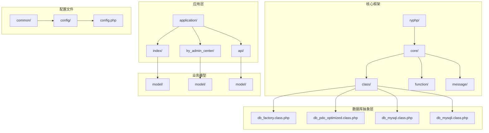

**图表来源**
- [index.php](file://index.php#L1-L18)
- [config.php](file://common/config/config.php#L1-L88)

**章节来源**
- [index.php](file://index.php#L1-L18)
- [config.php](file://common/config/config.php#L1-L88)

## 核心组件

### 数据库工厂类 (db_factory)

数据库工厂类实现了工厂设计模式，负责根据配置选择合适的数据库驱动：

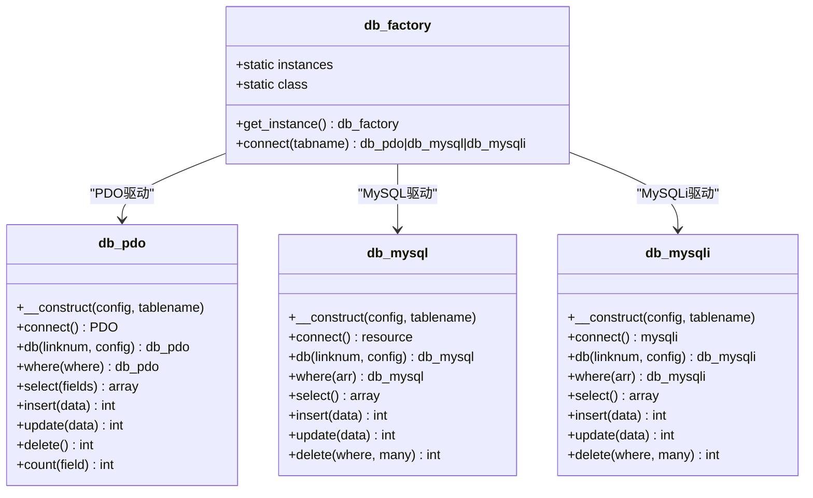

**图表来源**
- [db_factory.class.php](file://ryphp/core/class/db_factory.class.php#L1-L50)
- [db_pdo_optimized.class.php](file://ryphp/core/class/db_pdo_optimized.class.php#L13-L80)
- [db_mysql.class.php](file://ryphp/core/class/db_mysql.class.php#L10-L28)
- [db_mysqli.class.php](file://ryphp/core/class/db_mysqli.class.php#L10-L28)

### 数据库连接池管理

系统实现了数据库连接池机制，支持多连接并发访问：

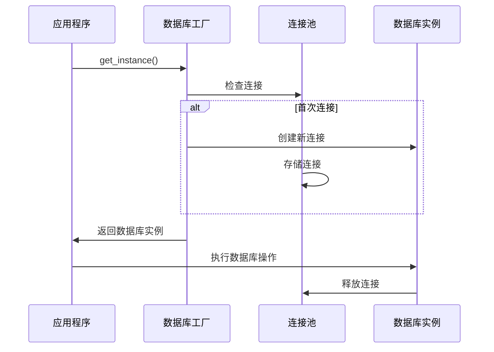

**图表来源**
- [db_pdo_optimized.class.php](file://ryphp/core/class/db_pdo_optimized.class.php#L106-L119)
- [db_mysql.class.php](file://ryphp/core/class/db_mysql.class.php#L67-L78)
- [db_mysqli.class.php](file://ryphp/core/class/db_mysqli.class.php#L64-L75)

**章节来源**
- [db_factory.class.php](file://ryphp/core/class/db_factory.class.php#L1-L50)
- [db_pdo_optimized.class.php](file://ryphp/core/class/db_pdo_optimized.class.php#L13-L119)
- [db_mysql.class.php](file://ryphp/core/class/db_mysql.class.php#L10-L78)
- [db_mysqli.class.php](file://ryphp/core/class/db_mysqli.class.php#L10-L75)

## 架构概览

LRYBlog系统的Model层采用了分层架构设计，实现了清晰的职责分离：

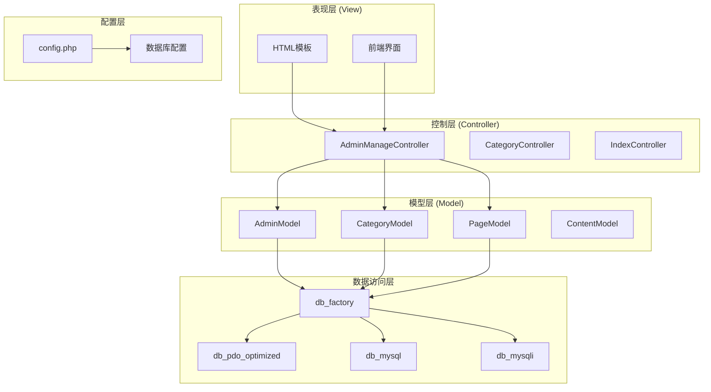

**图表来源**
- [application.class.php](file://ryphp/core/class/application.class.php#L48-L65)
- [config.php](file://common/config/config.php#L13-L22)

## 详细组件分析

### 数据验证和过滤机制

系统实现了多层次的数据验证和安全防护机制：

#### 输入验证流程

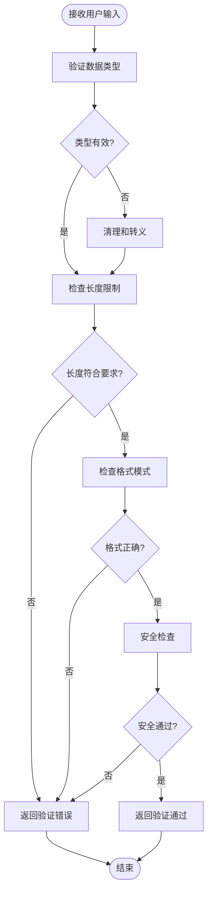

**图表来源**
- [global.func.php](file://ryphp/core/function/global.func.php#L500-L516)

#### 安全防护措施

系统实现了以下安全防护机制：

1. **SQL注入防护**：使用预处理语句和参数绑定
2. **XSS防护**：HTML转义和特殊字符过滤
3. **CSRF防护**：令牌验证机制
4. **数据清理**：输入数据的标准化处理

**章节来源**
- [global.func.php](file://ryphp/core/function/global.func.php#L487-L516)

### 数据模型设计模式

#### 表结构映射

系统支持多种数据类型的处理和映射：

| 数据类型 | PHP类型 | 数据库类型 | 映射规则 |
|---------|---------|-----------|----------|
| 整数 | int | TINYINT, SMALLINT, INT, BIGINT | 直接映射 |
| 浮点数 | float | FLOAT, DOUBLE | 直接映射 |
| 字符串 | string | VARCHAR, TEXT, CHAR | 字符串处理 |
| 日期时间 | datetime | DATE, TIME, DATETIME | 格式转换 |
| 布尔值 | bool | TINYINT(1) | 0/1映射 |

#### 关系建模

系统支持以下数据库关系建模：

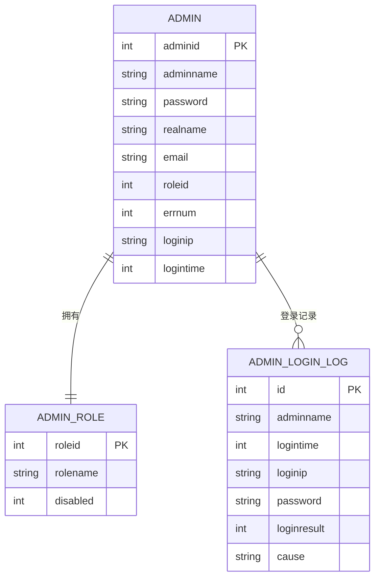

**图表来源**
- [admin.class.php](file://application/lry_admin_center/model/admin.class.php#L4-L27)

**章节来源**
- [admin.class.php](file://application/lry_admin_center/model/admin.class.php#L1-L96)

### 数据库抽象层实现

#### 工厂模式应用

数据库抽象层通过工厂模式实现了多驱动支持：

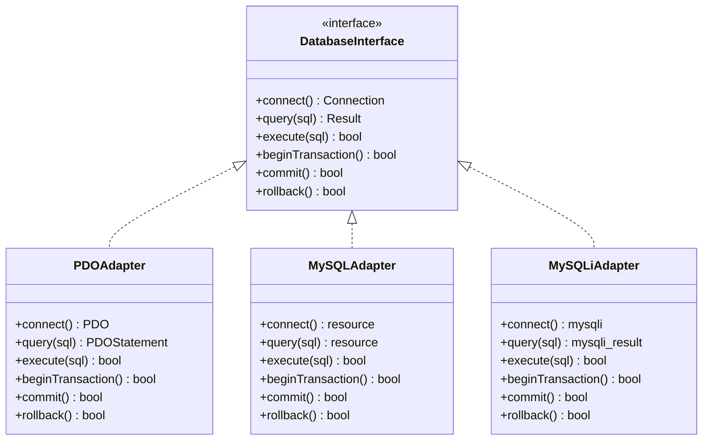

**图表来源**
- [db_factory.class.php](file://ryphp/core/class/db_factory.class.php#L14-L31)
- [db_pdo_optimized.class.php](file://ryphp/core/class/db_pdo_optimized.class.php#L87-L96)

#### 连接池管理

系统实现了高效的连接池管理机制：

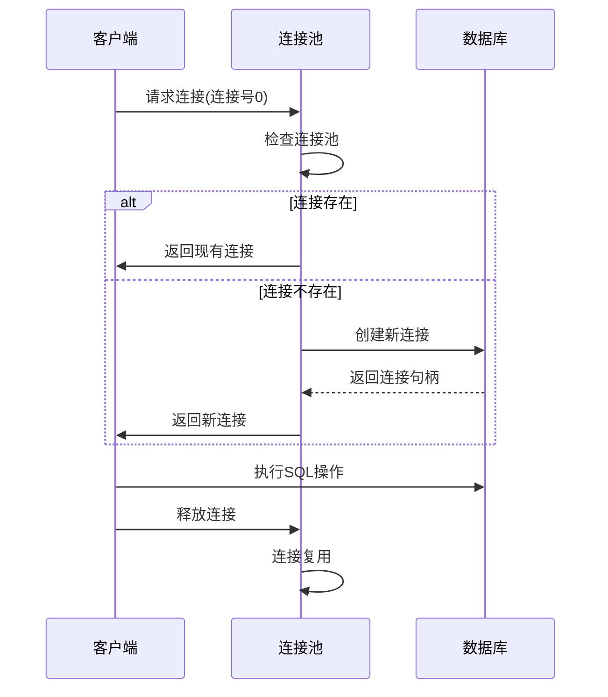

**图表来源**
- [db_pdo_optimized.class.php](file://ryphp/core/class/db_pdo_optimized.class.php#L106-L119)

**章节来源**
- [db_factory.class.php](file://ryphp/core/class/db_factory.class.php#L11-L50)
- [db_pdo_optimized.class.php](file://ryphp/core/class/db_pdo_optimized.class.php#L75-L119)

### 具体Model类编写示例

#### 管理员登录模型

以下展示了管理员登录功能的完整实现：

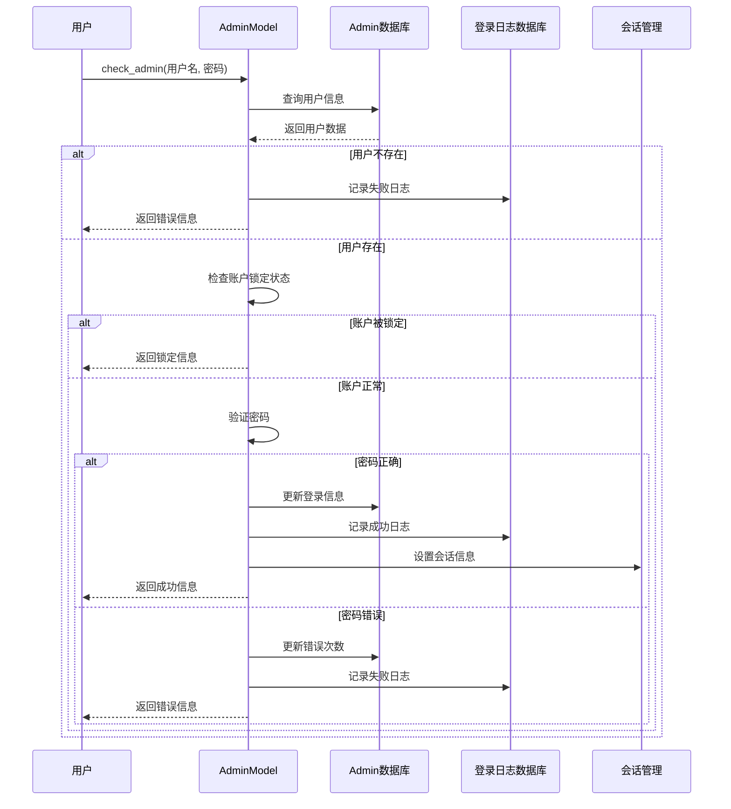

**图表来源**
- [admin.class.php](file://application/lry_admin_center/model/admin.class.php#L4-L95)

**章节来源**
- [admin.class.php](file://application/lry_admin_center/model/admin.class.php#L1-L96)

## 依赖分析

### 组件耦合关系

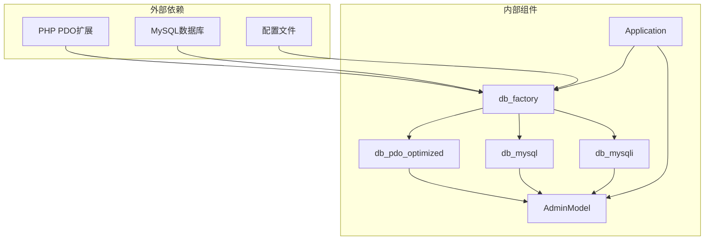

**图表来源**
- [db_factory.class.php](file://ryphp/core/class/db_factory.class.php#L14-L31)
- [config.php](file://common/config/config.php#L13-L22)

### 数据流分析

系统中的数据流向遵循以下模式：

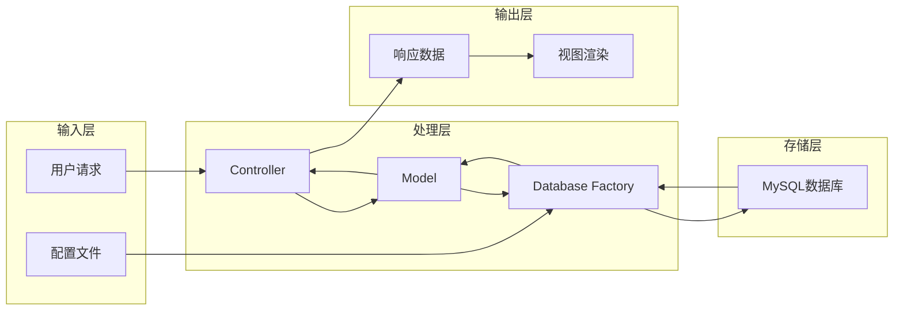

**图表来源**
- [application.class.php](file://ryphp/core/class/application.class.php#L24-L40)

**章节来源**
- [db_factory.class.php](file://ryphp/core/class/db_factory.class.php#L1-L50)
- [application.class.php](file://ryphp/core/class/application.class.php#L1-L118)

## 性能考虑

### 连接池优化

系统通过连接池机制避免了频繁的数据库连接创建，提高了系统性能：

1. **连接复用**：相同连接号的请求共享数据库连接
2. **连接超时**：自动检测和重连断开的连接
3. **资源管理**：及时释放不再使用的数据库连接

### 查询优化

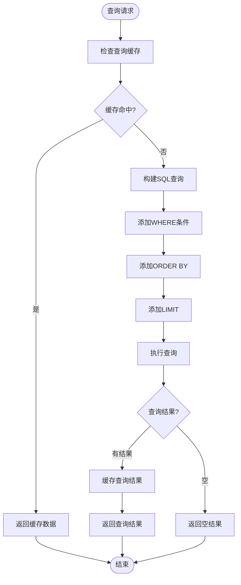

**图表来源**
- [db_pdo_optimized.class.php](file://ryphp/core/class/db_pdo_optimized.class.php#L406-L435)

## 故障排除指南

### 常见问题及解决方案

#### 数据库连接问题

| 问题症状 | 可能原因 | 解决方案 |
|---------|---------|---------|
| 连接超时 | 网络延迟或数据库负载过高 | 检查网络连接，优化数据库性能 |
| 认证失败 | 用户名或密码错误 | 验证配置文件中的数据库凭据 |
| 连接池耗尽 | 并发请求过多 | 调整连接池大小或优化应用逻辑 |
| 服务器断开 | MySQL服务器重启 | 实现自动重连机制 |

#### 数据验证错误

| 错误类型 | 触发条件 | 防护措施 |
|---------|---------|---------|
| SQL注入 | 特殊字符输入 | 使用预处理语句和参数绑定 |
| XSS攻击 | HTML代码注入 | 实施严格的输入过滤和输出转义 |
| CSRF攻击 | 跨站请求伪造 | 实现CSRF令牌验证 |
| 数据溢出 | 超长输入 | 实施长度限制和截断处理 |

**章节来源**
- [db_pdo_optimized.class.php](file://ryphp/core/class/db_pdo_optimized.class.php#L216-L233)
- [global.func.php](file://ryphp/core/function/global.func.php#L500-L516)

## 结论

LRYBlog系统的Model层实现了完整的数据访问抽象，具有以下特点：

1. **模块化设计**：清晰的职责分离和模块化组织
2. **多驱动支持**：灵活的数据库驱动选择机制
3. **安全防护**：多层次的安全验证和防护措施
4. **性能优化**：高效的连接池管理和查询优化
5. **易于扩展**：良好的架构设计便于功能扩展

该系统为LRYBlog提供了稳定可靠的数据访问层，能够满足博客系统对数据管理的各种需求。