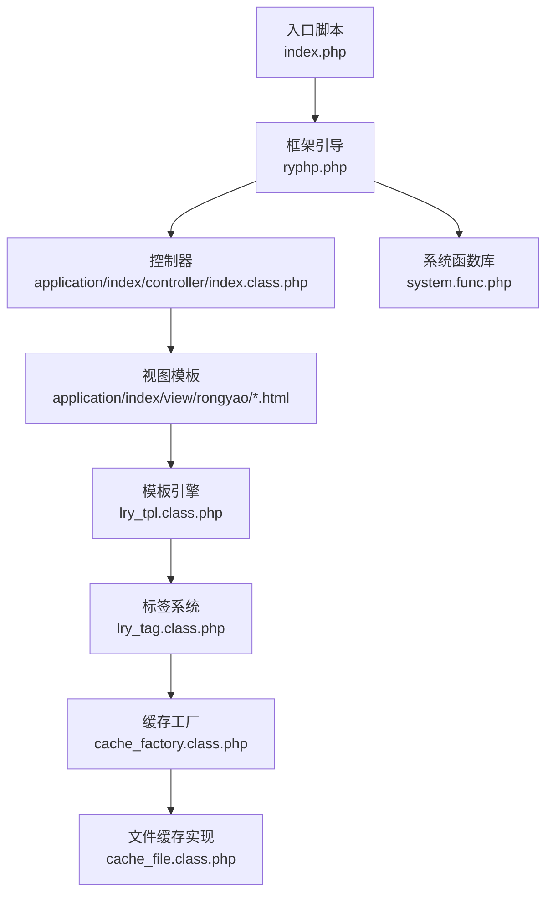
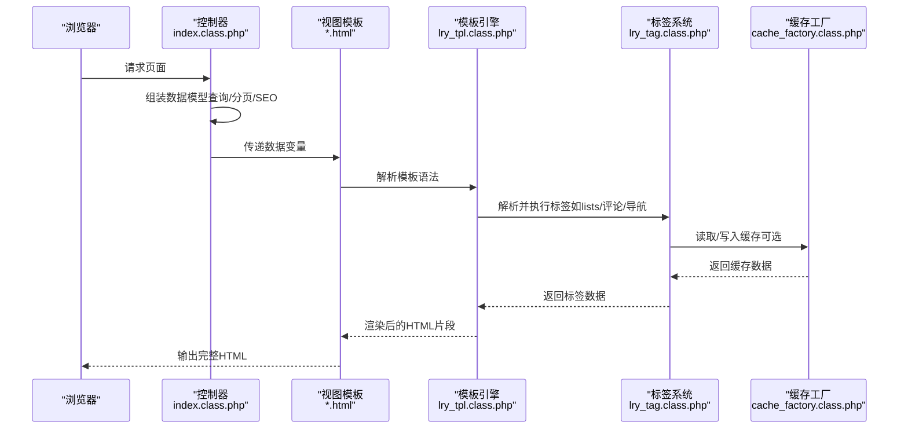
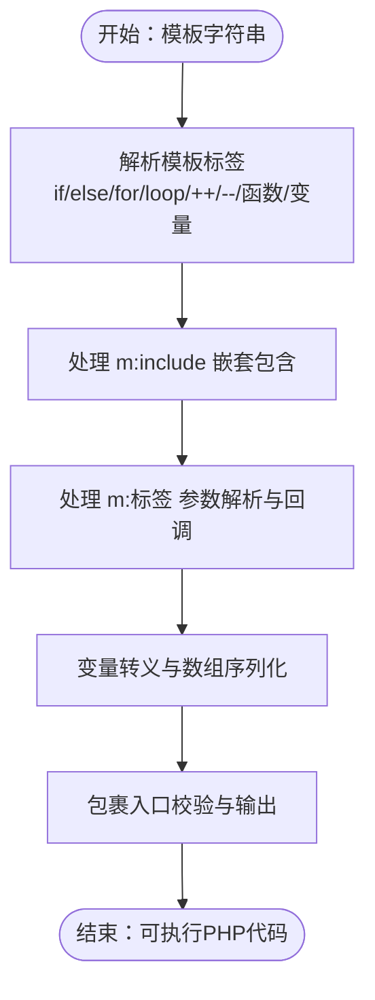
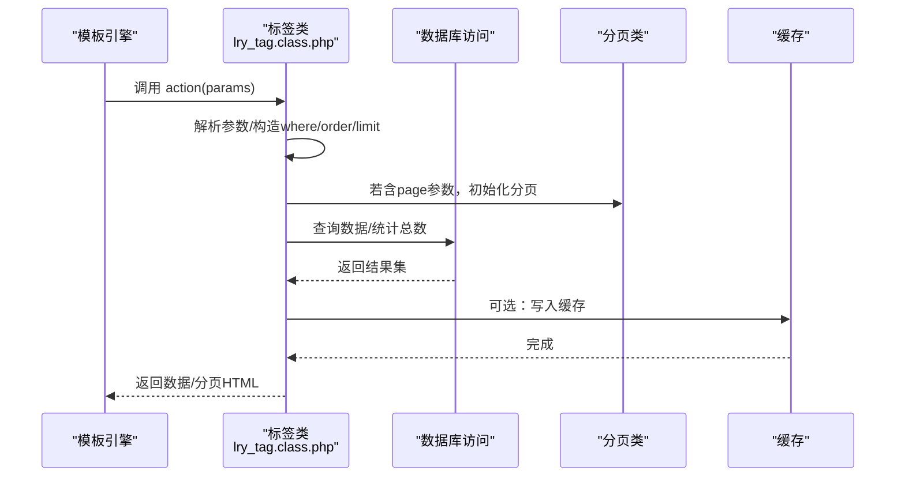
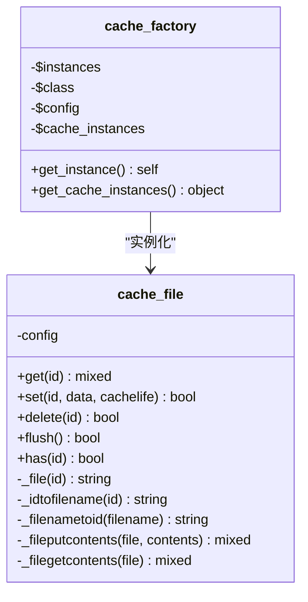
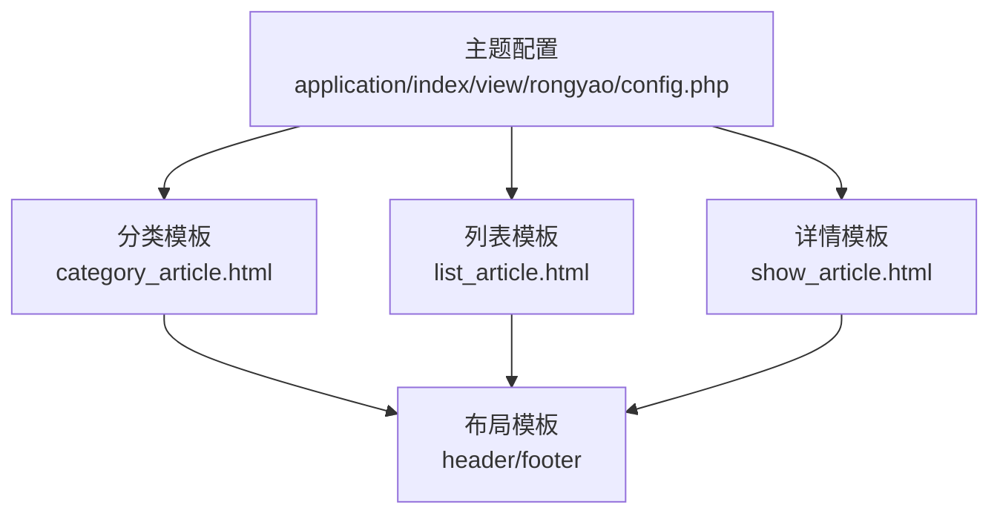
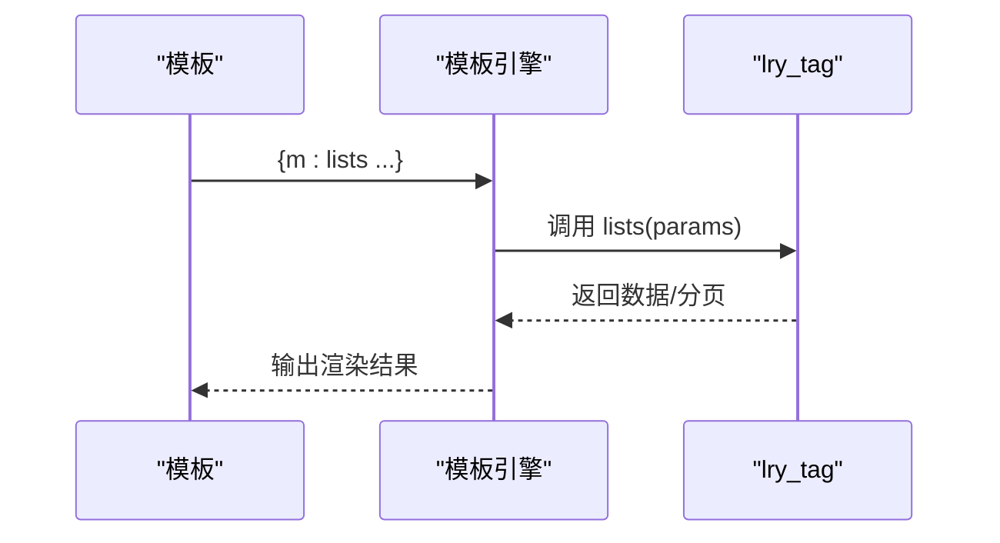
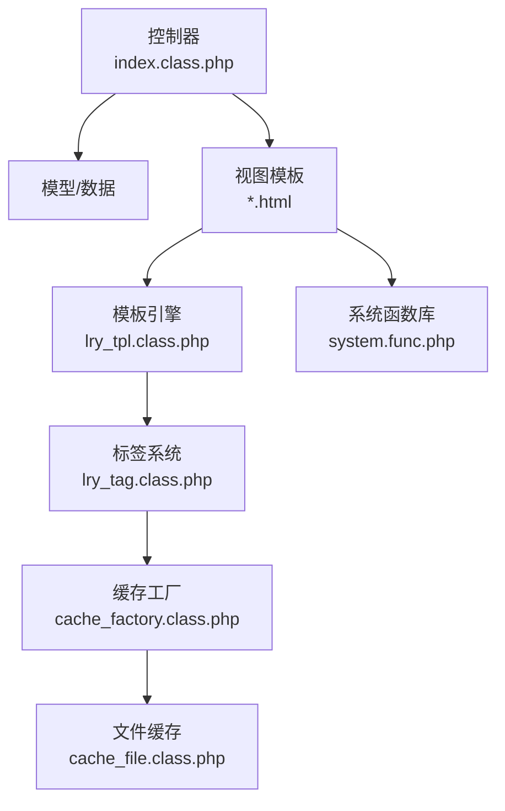

# View层实现

<cite>
**本文引用的文件**
- [index.php](file://index.php)
- [ryphp.php](file://ryphp/ryphp.php)
- [lry_tpl.class.php](file://ryphp/core/class/lry_tpl.class.php)
- [lry_tag.class.php](file://ryphp/core/class/lry_tag.class.php)
- [system.func.php](file://common/function/system.func.php)
- [cache_factory.class.php](file://ryphp/core/class/cache_factory.class.php)
- [cache_file.class.php](file://ryphp/core/class/cache_file.class.php)
- [index.class.php](file://application/index/controller/index.class.php)
- [config.php](file://application/index/view/rongyao/config.php)
- [show_article.html](file://application/index/view/rongyao/show_article.html)
- [category_article.html](file://application/index/view/rongyao/category_article.html)
- [list_article.html](file://application/index/view/rongyao/list_article.html)
</cite>

## 目录
1. [引言](#引言)
2. [项目结构](#项目结构)
3. [核心组件](#核心组件)
4. [架构总览](#架构总览)
5. [详细组件分析](#详细组件分析)
6. [依赖分析](#依赖分析)
7. [性能考虑](#性能考虑)
8. [故障排查指南](#故障排查指南)
9. [结论](#结论)
10. [附录](#附录)

## 引言
本文件面向LRYBlog系统的View层实现，围绕MVC架构中View层的职责与作用展开，重点解释视图渲染、模板处理与前端资源管理。文档深入剖析自定义模板引擎的实现原理（模板语法解析、变量替换、条件与循环控制、自定义标签），梳理模板系统的组织结构（命名规范、目录结构、继承关系），并结合具体模板示例说明布局、内容与组件模板的编写方式。同时，文档覆盖CSS与JavaScript资源管理策略（静态资源引用、延迟加载、缓存策略），以及View层与Controller层之间的数据传递与响应生成流程。

## 项目结构
LRYBlog采用“应用-模块-视图”三层组织方式，View层位于application/*/view目录下，按模块划分（如index模块），每个模块内包含多个主题目录（如rongyao）。模板文件以.html为扩展名，配合自定义模板语法与标签系统进行渲染。

**图表来源**
- [index.php:1-18](file://index.php#L1-L18)
- [ryphp.php:83-204](file://ryphp/ryphp.php#L83-L204)
- [index.class.php:1-18](file://application/index/controller/index.class.php#L1-L18)
- [lry_tpl.class.php:10-134](file://ryphp/core/class/lry_tpl.class.php#L10-L134)
- [lry_tag.class.php:10-492](file://ryphp/core/class/lry_tag.class.php#L10-L492)
- [cache_factory.class.php:36-84](file://ryphp/core/class/cache_factory.class.php#L36-L84)
- [cache_file.class.php:1-130](file://ryphp/core/class/cache_file.class.php#L1-L130)
- [system.func.php:8-17](file://common/function/system.func.php#L8-L17)

**章节来源**
- [index.php:1-18](file://index.php#L1-L18)
- [ryphp.php:83-204](file://ryphp/ryphp.php#L83-L204)

## 核心组件
- 模板引擎：负责将模板语法转换为可执行的PHP代码，并支持变量输出、条件判断、循环遍历、自定义标签等。
- 标签系统：提供内容查询、分页、导航、评论、搜索等常用业务标签，供模板直接调用。
- 缓存机制：通过缓存工厂选择合适的缓存实现（文件/Redis/Memcache），提升标签数据的渲染效率。
- 系统函数库：提供主题列表、URL生成、站点信息等辅助函数，支撑模板渲染与资源引用。
- 视图模板：按模块与主题组织的HTML模板，包含布局、列表、详情等页面模板。

**章节来源**
- [lry_tpl.class.php:10-134](file://ryphp/core/class/lry_tpl.class.php#L10-L134)
- [lry_tag.class.php:10-492](file://ryphp/core/class/lry_tag.class.php#L10-L492)
- [cache_factory.class.php:36-84](file://ryphp/core/class/cache_factory.class.php#L36-L84)
- [cache_file.class.php:1-130](file://ryphp/core/class/cache_file.class.php#L1-L130)
- [system.func.php:8-17](file://common/function/system.func.php#L8-L17)

## 架构总览
View层在MVC中的职责：
- 接收来自Controller的数据（模型查询结果、分页信息、SEO信息等）。
- 通过模板引擎解析模板语法，生成最终HTML。
- 输出HTML响应给客户端。

**图表来源**
- [index.class.php:14-17](file://application/index/controller/index.class.php#L14-L17)
- [lry_tpl.class.php:31-59](file://ryphp/core/class/lry_tpl.class.php#L31-L59)
- [lry_tag.class.php:18-65](file://ryphp/core/class/lry_tag.class.php#L18-L65)
- [cache_factory.class.php:77-82](file://ryphp/core/class/cache_factory.class.php#L77-L82)

## 详细组件分析

### 模板引擎：lry_tpl.class.php
职责与能力：
- 将模板中的自定义标签语法转换为PHP代码，实现变量输出、条件判断、循环、自增自减、函数调用等。
- 支持m:include嵌套包含其他模板。
- 支持m:标签调用，将标签参数解析为PHP数组并动态调用标签类方法。
- 提供统一的变量转义与数组序列化工具，保证输出安全与格式正确。

关键实现要点：
- 语法解析：通过正则表达式匹配模板标签，替换为对应的PHP语句。
- 变量输出：支持$变量、常量、对象属性访问与函数调用输出。
- 控制结构：支持if/else/elseif、for、loop foreach等。
- 标签回调：将m:action params语法解析为标签类方法调用，支持cache与page参数。

**图表来源**
- [lry_tpl.class.php:31-59](file://ryphp/core/class/lry_tpl.class.php#L31-L59)
- [lry_tpl.class.php:62-92](file://ryphp/core/class/lry_tpl.class.php#L62-L92)
- [lry_tpl.class.php:101-132](file://ryphp/core/class/lry_tpl.class.php#L101-L132)

**章节来源**
- [lry_tpl.class.php:10-134](file://ryphp/core/class/lry_tpl.class.php#L10-L134)

### 标签系统：lry_tag.class.php
职责与能力：
- 提供内容列表、分页、导航、评论、搜索、标签云、轮播图、相关文章等常用业务标签。
- 支持分页标签返回分页HTML与总数，支持缓存标签数据以提升性能。
- 支持按模型、栏目、条件过滤，灵活组合查询参数。

典型标签流程：
- lists：根据catid/modelid/id等参数查询内容列表，支持分页与排序。
- pages：根据上一步的分页对象生成分页HTML。
- relation/centent_tag/tag/guestbook/banner/comment_list等：分别提供相关内容、标签关联、评论列表等。

**图表来源**
- [lry_tag.class.php:18-65](file://ryphp/core/class/lry_tag.class.php#L18-L65)
- [lry_tag.class.php:73-77](file://ryphp/core/class/lry_tag.class.php#L73-L77)
- [lry_tag.class.php:458-477](file://ryphp/core/class/lry_tag.class.php#L458-L477)

**章节来源**
- [lry_tag.class.php:10-492](file://ryphp/core/class/lry_tag.class.php#L10-L492)

### 缓存机制：cache_factory.class.php 与 cache_file.class.php
职责与能力：
- 缓存工厂根据配置选择缓存实现（文件/Redis/Memcache），并提供懒加载实例。
- 文件缓存实现提供get/set/delete/flush等操作，支持过期时间与序列化存储。

**图表来源**
- [cache_factory.class.php:36-84](file://ryphp/core/class/cache_factory.class.php#L36-L84)
- [cache_file.class.php:1-130](file://ryphp/core/class/cache_file.class.php#L1-L130)

**章节来源**
- [cache_factory.class.php:36-84](file://ryphp/core/class/cache_factory.class.php#L36-L84)
- [cache_file.class.php:17-46](file://ryphp/core/class/cache_file.class.php#L17-L46)

### 模板系统组织结构
- 主题配置：通过config.php声明主题名称、作者、版本及各类模板映射（分类、列表、内容页）。
- 目录结构：application/{module}/view/{theme}/{template}.html。
- 命名规范：模板文件以.html结尾；模板内使用自定义语法（如{m:action ...}、{if}/{loop}、{$变量}）。
- 继承关系：通过m:include在模板中包含header/footer等公共部分，形成布局-内容-组件的层次化结构。

**图表来源**
- [config.php:1-29](file://application/index/view/rongyao/config.php#L1-L29)
- [category_article.html:1-53](file://application/index/view/rongyao/category_article.html#L1-L53)
- [list_article.html:1-150](file://application/index/view/rongyao/list_article.html#L1-L150)
- [show_article.html:1-518](file://application/index/view/rongyao/show_article.html#L1-L518)

**章节来源**
- [config.php:1-29](file://application/index/view/rongyao/config.php#L1-L29)

### 模板标签系统：自定义标签的定义、解析与执行
- 定义：在lry_tag.class.php中定义标签方法（如lists、pages、nav、relation等），方法内部构造查询条件并返回数据。
- 解析：lry_tpl.class.php将m:action params解析为PHP代码，调用lry_tag类对应方法。
- 执行：模板引擎生成的PHP代码在运行时调用标签类，返回数据或分页HTML，再由模板输出。

**图表来源**
- [lry_tpl.class.php:62-92](file://ryphp/core/class/lry_tpl.class.php#L62-L92)
- [lry_tag.class.php:18-65](file://ryphp/core/class/lry_tag.class.php#L18-L65)

**章节来源**
- [lry_tpl.class.php:62-92](file://ryphp/core/class/lry_tpl.class.php#L62-L92)
- [lry_tag.class.php:18-65](file://ryphp/core/class/lry_tag.class.php#L18-L65)

### 视图模板示例与最佳实践
- 布局模板：通过m:include包含header/footer，实现头部与底部的复用。
- 内容模板：在列表页与详情页中使用m:lists、m:relation、m:comment_list等标签获取数据并循环输出。
- 组件模板：将重复使用的UI片段（如侧边栏推荐、标签云）拆分为独立模板并通过include复用。

参考模板路径：
- 详情页模板：[show_article.html](file://application/index/view/rongyao/show_article.html)
- 列表页模板：[list_article.html](file://application/index/view/rongyao/list_article.html)
- 分类页模板：[category_article.html](file://application/index/view/rongyao/category_article.html)

**章节来源**
- [show_article.html:1-518](file://application/index/view/rongyao/show_article.html#L1-L518)
- [list_article.html:1-150](file://application/index/view/rongyao/list_article.html#L1-L150)
- [category_article.html:1-53](file://application/index/view/rongyao/category_article.html#L1-L53)

### CSS与JavaScript资源管理
- 静态资源引用：模板中通过{SITE_URL}与{STATIC_URL}常量拼接资源路径，确保跨环境兼容。
- 关键资源优先：将关键CSS/JS置于<head>/<body>顶部，减少阻塞。
- 预加载与延迟加载：使用<link rel="preload">预加载关键资源，使用setTimeout延迟加载非关键资源，优化首屏性能。
- 第三方库：模板中引入CDN字体图标与插件，注意HTTPS与跨域策略。

**章节来源**
- [show_article.html:9-43](file://application/index/view/rongyao/show_article.html#L9-L43)
- [list_article.html:9-30](file://application/index/view/rongyao/list_article.html#L9-L30)
- [category_article.html:9-30](file://application/index/view/rongyao/category_article.html#L9-L30)

### View层与Controller层的数据传递与响应生成
- 数据组装：Controller从模型层获取数据（如分类、内容、分页），并注入模板变量。
- 模板渲染：模板通过lry_tpl解析，标签系统提供数据，最终生成HTML。
- 响应输出：框架统一设置UTF-8编码与时区，确保输出一致。

**章节来源**
- [index.class.php:14-17](file://application/index/controller/index.class.php#L14-L17)
- [ryphp.php:10-14](file://ryphp/ryphp.php#L10-L14)

## 依赖分析
- 模板引擎依赖标签系统与缓存工厂，以实现标签数据的高效渲染与缓存。
- 视图模板依赖系统函数库提供的URL与站点信息，确保资源路径与SEO信息正确。
- 控制器依赖模型与系统函数库，向视图传递数据。

**图表来源**
- [index.class.php:14-17](file://application/index/controller/index.class.php#L14-L17)
- [lry_tpl.class.php:31-59](file://ryphp/core/class/lry_tpl.class.php#L31-L59)
- [lry_tag.class.php:18-65](file://ryphp/core/class/lry_tag.class.php#L18-L65)
- [cache_factory.class.php:36-84](file://ryphp/core/class/cache_factory.class.php#L36-L84)
- [cache_file.class.php:1-130](file://ryphp/core/class/cache_file.class.php#L1-L130)
- [system.func.php:8-17](file://common/function/system.func.php#L8-L17)

**章节来源**
- [index.class.php:14-17](file://application/index/controller/index.class.php#L14-L17)
- [lry_tpl.class.php:31-59](file://ryphp/core/class/lry_tpl.class.php#L31-L59)
- [lry_tag.class.php:18-65](file://ryphp/core/class/lry_tag.class.php#L18-L65)
- [cache_factory.class.php:36-84](file://ryphp/core/class/cache_factory.class.php#L36-L84)
- [cache_file.class.php:1-130](file://ryphp/core/class/cache_file.class.php#L1-L130)
- [system.func.php:8-17](file://common/function/system.func.php#L8-L17)

## 性能考虑
- 标签缓存：通过cache参数对标签数据进行缓存，减少重复查询；分页场景下仅缓存列表数据，避免缓存过大。
- 文件缓存：文件缓存实现支持过期时间与序列化存储，适合中小规模数据缓存。
- 资源优化：关键资源前置、非关键资源延迟加载，降低首屏渲染时间。
- 模板解析：模板引擎将标签转换为PHP，减少运行时解析成本，提高执行效率。

[本节为通用性能建议，不直接分析具体文件]

## 故障排查指南
- 模板语法错误：检查模板中m:标签、if/loop等语法是否闭合，变量是否正确输出。
- 标签未生效：确认标签类方法是否存在，参数是否正确，缓存是否命中。
- 缓存异常：检查缓存目录权限与过期时间设置，必要时执行flush清空缓存。
- 资源路径问题：确认{SITE_URL}与{STATIC_URL}常量是否正确，CDN资源是否可用。

**章节来源**
- [lry_tpl.class.php:31-59](file://ryphp/core/class/lry_tpl.class.php#L31-L59)
- [lry_tag.class.php:73-77](file://ryphp/core/class/lry_tag.class.php#L73-L77)
- [cache_file.class.php:61-73](file://ryphp/core/class/cache_file.class.php#L61-L73)

## 结论
LRYBlog的View层通过自定义模板引擎与标签系统实现了清晰的视图渲染与数据绑定，配合缓存机制与资源优化策略，在保证开发效率的同时兼顾了性能与可维护性。模板系统的模块化与主题化组织使得视图层具备良好的扩展性与复用性。

[本节为总结性内容，不直接分析具体文件]

## 附录
- 模板语法速查：变量输出、条件判断、循环遍历、自增自减、函数调用、m:include嵌套、m:标签调用。
- 常用标签：lists、pages、nav、relation、centent_tag、tag、guestbook、banner、comment_list、search、get等。
- 资源管理：关键资源前置、预加载与延迟加载、CDN与本地资源结合。

[本节为概览性内容，不直接分析具体文件]