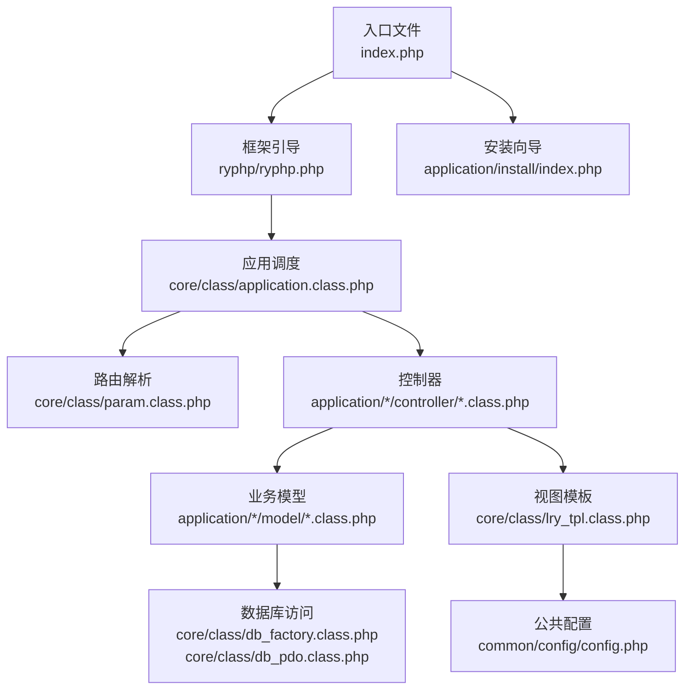
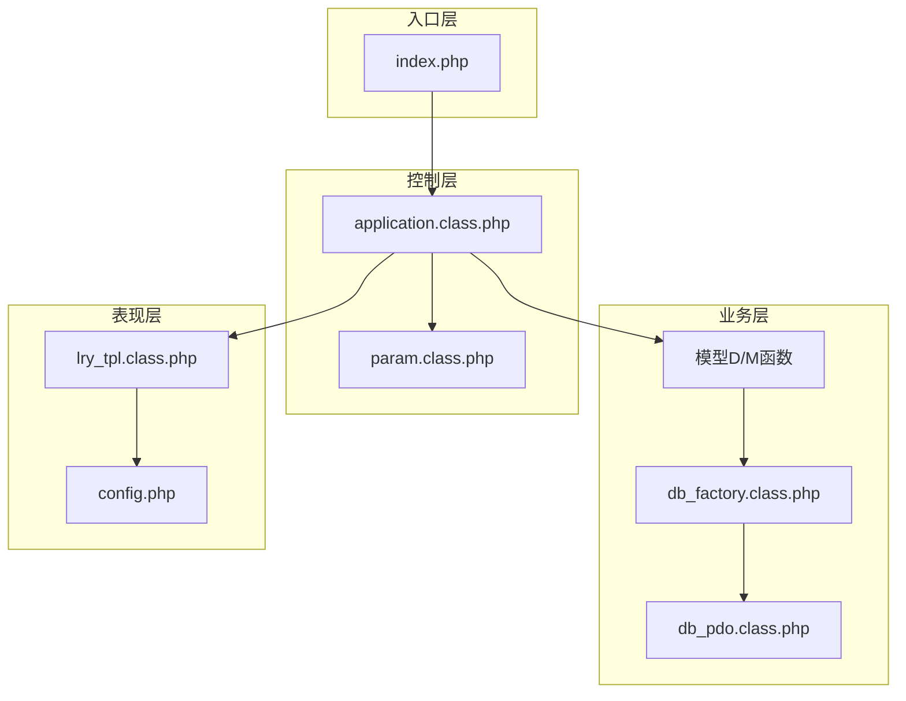
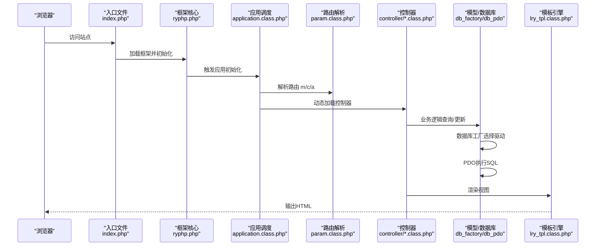
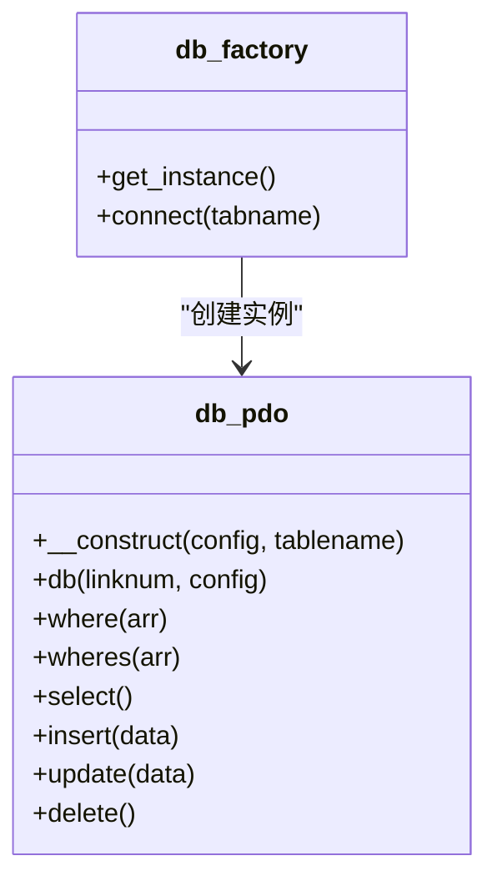
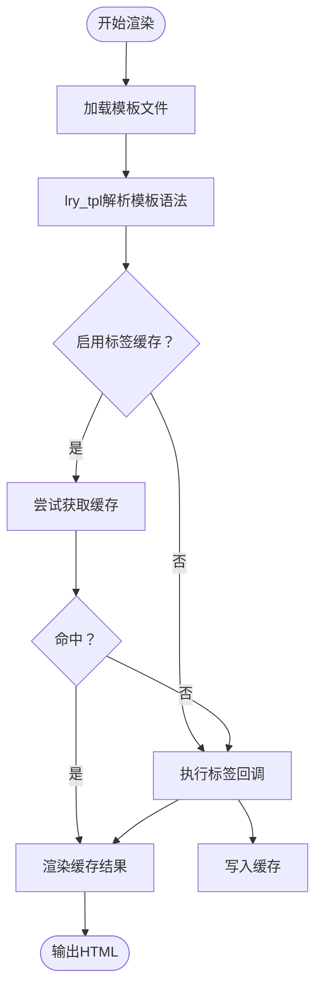
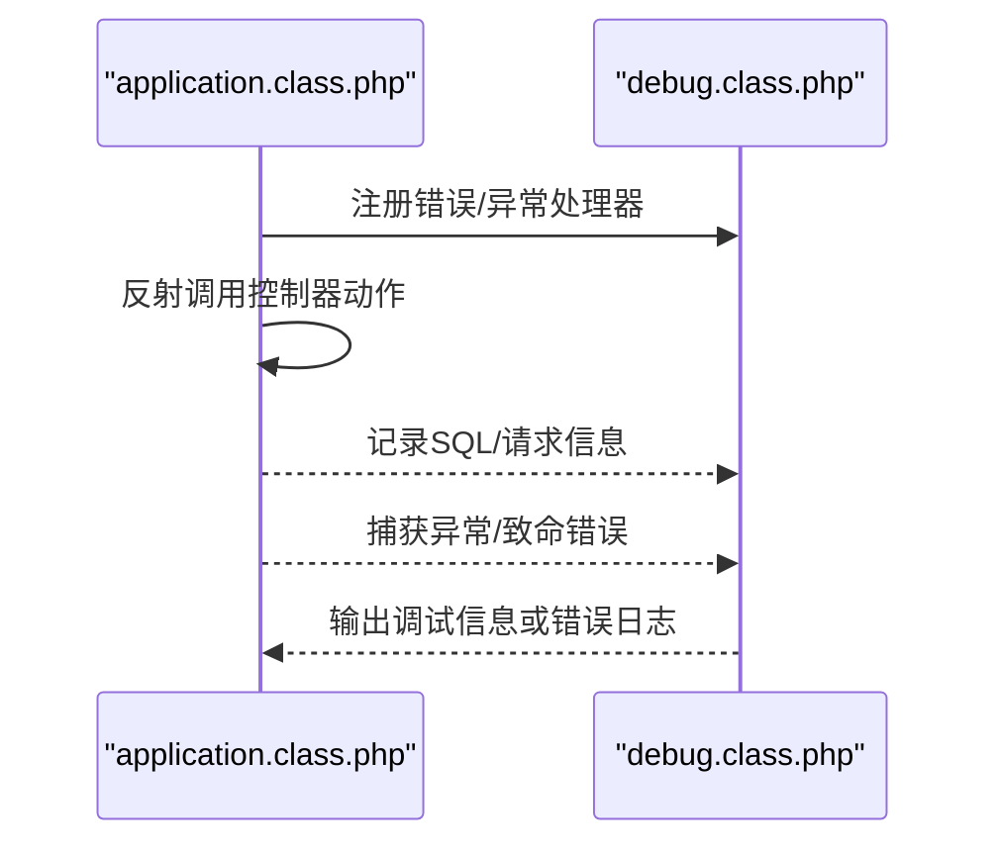
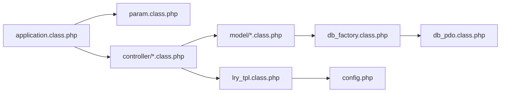

# 整体架构设计

<cite>
**本文引用的文件**
- [index.php](file://index.php)
- [ryphp.php](file://ryphp/ryphp.php)
- [application.class.php](file://ryphp/core/class/application.class.php)
- [param.class.php](file://ryphp/core/class/param.class.php)
- [db_factory.class.php](file://ryphp/core/class/db_factory.class.php)
- [db_pdo.class.php](file://ryphp/core/class/db_pdo.class.php)
- [lry_tpl.class.php](file://ryphp/core/class/lry_tpl.class.php)
- [debug.class.php](file://ryphp/core/class/debug.class.php)
- [config.php](file://common/config/config.php)
- [index.class.php（前台首页）](file://application/index/controller/index.class.php)
- [index.class.php（API验证码）](file://application/api/controller/index.class.php)
- [index.php（安装向导）](file://application/install/index.php)
- [index.class.php（后台首页）](file://application/lry_admin_center/controller/index.class.php)
- [global.func.php](file://ryphp/core/function/global.func.php)
</cite>

## 目录
1. [引言](#引言)
2. [项目结构](#项目结构)
3. [核心组件](#核心组件)
4. [架构总览](#架构总览)
5. [详细组件分析](#详细组件分析)
6. [依赖分析](#依赖分析)
7. [性能考虑](#性能考虑)
8. [故障排查指南](#故障排查指南)
9. [结论](#结论)
10. [附录](#附录)

## 引言
本设计文档面向LRYBlog系统，围绕自研RYPHP框架的整体架构理念，系统性阐述MVC三层架构在本项目中的落地方式、模块化设计理念与组件协作关系。文档从入口层、控制层、业务层、数据层、表现层五个分层出发，结合前台展示模块、后台管理模块、API接口模块与安装向导模块的职责边界，给出启动流程与请求处理流程的完整数据流图，并提供架构图与组件关系图，帮助开发者快速理解技术选型与实现细节。

## 项目结构
LRYBlog采用典型的多模块分层结构：
- 入口层：站点入口文件负责常量定义与框架引导
- 应用层：application目录按模块划分，每个模块包含controller/model/view/common
- 框架层：ryphp目录提供核心框架类与工具函数
- 公共层：common目录提供全局配置、函数与静态资源
- 缓存层：cache目录用于缓存文件存储
- 安装向导：独立的安装流程模块，独立于常规MVC

**图表来源**
- [index.php](file://index.php#L1-L18)
- [ryphp.php](file://ryphp/ryphp.php#L1-L204)
- [application.class.php](file://ryphp/core/class/application.class.php#L1-L118)
- [param.class.php](file://ryphp/core/class/param.class.php#L1-L195)
- [db_factory.class.php](file://ryphp/core/class/db_factory.class.php#L1-L50)
- [db_pdo.class.php](file://ryphp/core/class/db_pdo.class.php#L1-L200)
- [lry_tpl.class.php](file://ryphp/core/class/lry_tpl.class.php#L1-L134)
- [config.php](file://common/config/config.php#L1-L88)
- [index.php（安装向导）](file://application/install/index.php#L1-L373)

**章节来源**
- [index.php](file://index.php#L1-L18)
- [ryphp.php](file://ryphp/ryphp.php#L1-L204)

## 核心组件
- 框架入口与引导
  - 入口文件定义调试开关、根路径常量，加载框架核心文件并触发应用初始化
  - 框架核心文件负责系统常量、URL计算、函数库与类库加载、模块路由等
- 应用调度器
  - 负责注册错误/异常处理、解析路由参数、加载控制器并反射调用动作方法
- 路由解析器
  - 支持PATHINFO模式与URL映射，解析m/c/a与附加参数，提供安全处理
- 数据库工厂与PDO实现
  - 工厂按配置选择具体数据库驱动，PDO实现提供预处理、绑定参数、SQL执行与错误处理
- 模板引擎
  - 自定义模板语法解析，支持循环、条件、函数调用与标签缓存
- 调试与错误处理
  - 统一记录SQL、请求与信息，支持致命错误捕获与错误日志输出
- 公共配置
  - 系统、数据库、路由、缓存、Cookie、上传等配置集中管理

**章节来源**
- [ryphp.php](file://ryphp/ryphp.php#L1-L204)
- [application.class.php](file://ryphp/core/class/application.class.php#L1-L118)
- [param.class.php](file://ryphp/core/class/param.class.php#L1-L195)
- [db_factory.class.php](file://ryphp/core/class/db_factory.class.php#L1-L50)
- [db_pdo.class.php](file://ryphp/core/class/db_pdo.class.php#L1-L200)
- [lry_tpl.class.php](file://ryphp/core/class/lry_tpl.class.php#L1-L134)
- [debug.class.php](file://ryphp/core/class/debug.class.php#L1-L147)
- [config.php](file://common/config/config.php#L1-L88)

## 架构总览
LRYBlog遵循MVC分层与模块化设计：
- 入口层：index.php加载RYPHP框架并初始化应用
- 控制层：application调度器解析路由，加载对应模块控制器，反射调用动作方法
- 业务层：模型封装业务逻辑，通过工厂模式获取数据库连接执行查询
- 数据层：数据库工厂按配置选择PDO/MySQLi/MySQL驱动，统一执行SQL
- 表现层：模板引擎解析视图模板，渲染输出；后台管理与前台展示分别使用各自主题与视图

**图表来源**
- [index.php](file://index.php#L1-L18)
- [application.class.php](file://ryphp/core/class/application.class.php#L1-L118)
- [param.class.php](file://ryphp/core/class/param.class.php#L1-L195)
- [db_factory.class.php](file://ryphp/core/class/db_factory.class.php#L1-L50)
- [db_pdo.class.php](file://ryphp/core/class/db_pdo.class.php#L1-L200)
- [lry_tpl.class.php](file://ryphp/core/class/lry_tpl.class.php#L1-L134)
- [config.php](file://common/config/config.php#L1-L88)

## 详细组件分析

### 启动流程与请求处理流程
从入口到模块的完整数据流如下：

**图表来源**
- [index.php](file://index.php#L1-L18)
- [ryphp.php](file://ryphp/ryphp.php#L1-L204)
- [application.class.php](file://ryphp/core/class/application.class.php#L1-L118)
- [param.class.php](file://ryphp/core/class/param.class.php#L1-L195)
- [db_factory.class.php](file://ryphp/core/class/db_factory.class.php#L1-L50)
- [db_pdo.class.php](file://ryphp/core/class/db_pdo.class.php#L1-L200)
- [lry_tpl.class.php](file://ryphp/core/class/lry_tpl.class.php#L1-L134)

**章节来源**
- [index.php](file://index.php#L1-L18)
- [ryphp.php](file://ryphp/ryphp.php#L1-L204)
- [application.class.php](file://ryphp/core/class/application.class.php#L1-L118)
- [param.class.php](file://ryphp/core/class/param.class.php#L1-L195)

### MVC分层与模块化职责
- 入口层（入口文件与框架引导）
  - 定义调试与根路径常量，加载框架核心，设置URL与静态资源路径，触发应用初始化
- 控制层（控制器处理请求）
  - application调度器注册错误/异常处理，解析路由，动态加载控制器并反射调用动作方法
  - 控制器内调用模型与模板，组织响应数据
- 业务层（模型处理业务逻辑）
  - 通过D()/M()函数加载模型，模型内部通过数据库工厂获取连接，执行查询与更新
- 数据层（数据库访问）
  - db_factory按配置选择驱动，db_pdo提供预处理、绑定参数、SQL执行与错误处理
- 表现层（视图模板渲染）
  - lry_tpl解析模板语法，支持循环、条件、函数调用与标签缓存，结合公共配置输出页面

模块边界与职责：
- 前台展示模块（application/index）
  - 负责首页、分类、文章列表等前台页面渲染
  - 示例：前台首页控制器与视图模板
- 后台管理模块（application/lry_admin_center）
  - 负责后台登录、首页、权限校验、系统信息等管理功能
  - 示例：后台首页控制器与登录流程
- API接口模块（application/api）
  - 提供验证码等接口能力
  - 示例：验证码生成控制器
- 安装向导模块（application/install）
  - 独立的安装流程，包含环境检测、数据库初始化、配置写入与锁定文件生成
  - 示例：安装向导主流程与模板

**章节来源**
- [application.class.php](file://ryphp/core/class/application.class.php#L1-L118)
- [index.class.php（前台首页）](file://application/index/controller/index.class.php#L1-L18)
- [index.class.php（后台首页）](file://application/lry_admin_center/controller/index.class.php#L1-L162)
- [index.class.php（API验证码）](file://application/api/controller/index.class.php#L1-L22)
- [index.php（安装向导）](file://application/install/index.php#L1-L373)

### 数据库访问与工厂模式
- 工厂模式
  - db_factory根据配置选择具体数据库驱动（pdo/mysqli/mysql），统一对外接口
- PDO实现
  - db_pdo提供连接、预处理、绑定参数、执行SQL、错误处理与断线重连机制
- 安全与性能
  - 使用预处理与绑定参数防止注入，记录SQL执行时间，支持调试模式输出

**图表来源**
- [db_factory.class.php](file://ryphp/core/class/db_factory.class.php#L1-L50)
- [db_pdo.class.php](file://ryphp/core/class/db_pdo.class.php#L1-L200)

**章节来源**
- [db_factory.class.php](file://ryphp/core/class/db_factory.class.php#L1-L50)
- [db_pdo.class.php](file://ryphp/core/class/db_pdo.class.php#L1-L200)

### 模板引擎与视图渲染
- lry_tpl模板引擎
  - 支持include、php标签、if/for/loop、变量输出、函数调用与标签缓存
  - 将模板语法转换为PHP代码，结合视图目录进行渲染
- 主题与配置
  - 通过公共配置指定默认主题目录，不同模块可设置主题覆盖

**图表来源**
- [lry_tpl.class.php](file://ryphp/core/class/lry_tpl.class.php#L1-L134)
- [config.php](file://common/config/config.php#L1-L88)

**章节来源**
- [lry_tpl.class.php](file://ryphp/core/class/lry_tpl.class.php#L1-L134)
- [config.php](file://common/config/config.php#L1-L88)

### 调试与错误处理
- 统一错误处理
  - 注册错误/异常处理器，记录信息、SQL与请求详情
  - 致命错误捕获并输出调试页或错误日志
- 调试模式
  - 开启调试时输出详细信息，关闭时记录日志并友好提示

**图表来源**
- [application.class.php](file://ryphp/core/class/application.class.php#L1-L118)
- [debug.class.php](file://ryphp/core/class/debug.class.php#L1-L147)

**章节来源**
- [debug.class.php](file://ryphp/core/class/debug.class.php#L1-L147)
- [application.class.php](file://ryphp/core/class/application.class.php#L1-L118)

## 依赖分析
- 组件耦合与内聚
  - application调度器与param解耦，通过常量传递路由参数
  - 控制器依赖模型与模板，模型依赖数据库工厂，形成清晰的单向依赖
- 外部依赖
  - 数据库驱动选择受配置影响，支持PDO/Mysqli/MySQL三种
  - 模板引擎依赖公共配置的主题设置
- 循环依赖
  - 未发现直接循环依赖；工厂与驱动之间为单向依赖

**图表来源**
- [application.class.php](file://ryphp/core/class/application.class.php#L1-L118)
- [param.class.php](file://ryphp/core/class/param.class.php#L1-L195)
- [db_factory.class.php](file://ryphp/core/class/db_factory.class.php#L1-L50)
- [db_pdo.class.php](file://ryphp/core/class/db_pdo.class.php#L1-L200)
- [lry_tpl.class.php](file://ryphp/core/class/lry_tpl.class.php#L1-L134)
- [config.php](file://common/config/config.php#L1-L88)

**章节来源**
- [application.class.php](file://ryphp/core/class/application.class.php#L1-L118)
- [param.class.php](file://ryphp/core/class/param.class.php#L1-L195)
- [db_factory.class.php](file://ryphp/core/class/db_factory.class.php#L1-L50)
- [db_pdo.class.php](file://ryphp/core/class/db_pdo.class.php#L1-L200)
- [lry_tpl.class.php](file://ryphp/core/class/lry_tpl.class.php#L1-L134)
- [config.php](file://common/config/config.php#L1-L88)

## 性能考虑
- 数据库层
  - 使用预处理与绑定参数，减少SQL注入风险并提升执行效率
  - 支持断线重连，增强稳定性
- 模板层
  - 标签缓存可显著降低重复标签渲染成本
- 调试与日志
  - 调试模式会增加内存与输出开销，生产环境建议关闭
- 路由与URL
  - PATHINFO模式与URL映射可优化SEO与可读性，但需合理配置避免过度解析

## 故障排查指南
- 路由参数非法
  - param对m/c/a进行安全处理，超长或包含非法字符会被拒绝
- 控制器不存在
  - application在加载控制器文件或类失败时会输出错误提示
- 数据库连接失败
  - db_pdo捕获连接异常并根据调试模式输出详细信息或友好提示
- 模板语法错误
  - lry_tpl解析失败时检查模板语法与标签使用
- 安装向导问题
  - 安装向导独立运行，注意环境检测与数据库配置正确性

**章节来源**
- [param.class.php](file://ryphp/core/class/param.class.php#L1-L195)
- [application.class.php](file://ryphp/core/class/application.class.php#L1-L118)
- [db_pdo.class.php](file://ryphp/core/class/db_pdo.class.php#L1-L200)
- [lry_tpl.class.php](file://ryphp/core/class/lry_tpl.class.php#L1-L134)
- [index.php（安装向导）](file://application/install/index.php#L1-L373)

## 结论
LRYBlog基于RYPHP框架实现了清晰的MVC分层与模块化设计，入口层简洁、控制层灵活、业务层可扩展、数据层稳定、表现层可定制。通过工厂模式与配置中心，系统具备良好的可维护性与可移植性。建议在生产环境中关闭调试模式、完善缓存策略与监控体系，持续优化数据库与模板渲染性能。

## 附录
- 关键函数与宏
  - D()/M()：模型与数据库操作入口
  - C()：读取公共配置
  - debug()：屏蔽调试输出
  - set_module_theme()：设置模块主题
  - delcache()：清理缓存

**章节来源**
- [global.func.php](file://ryphp/core/function/global.func.php#L1480-L1523)