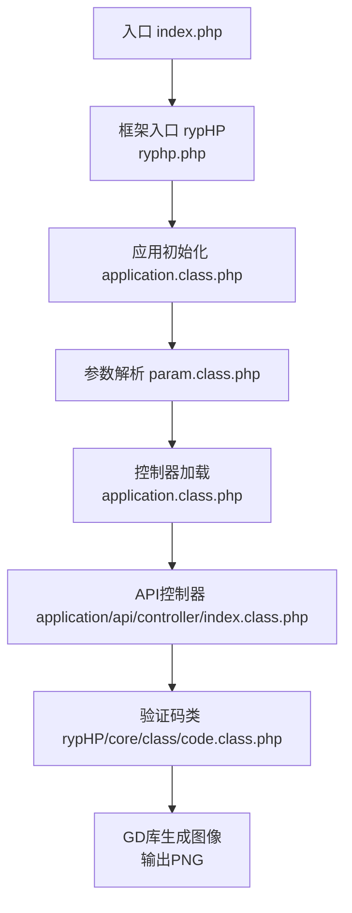
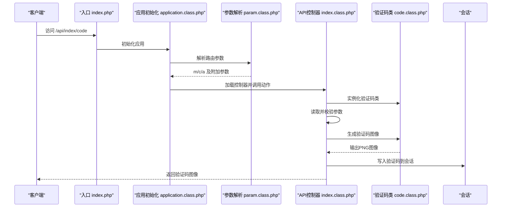
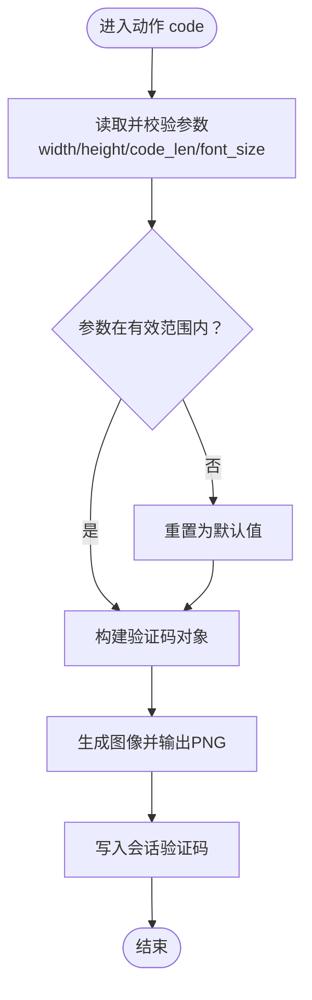
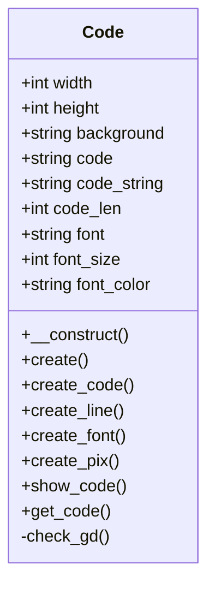
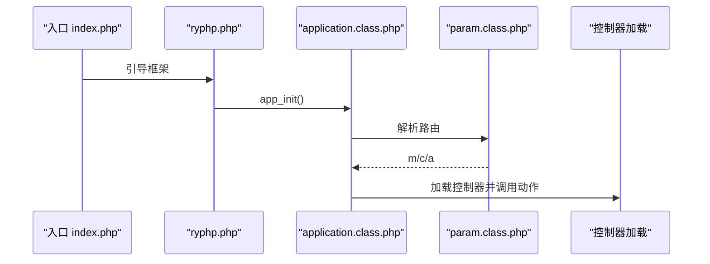
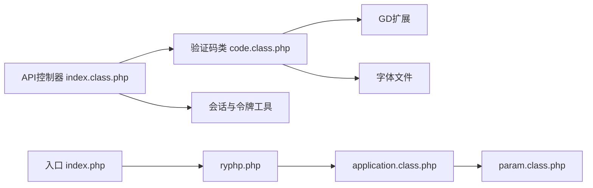

# API接口模块

<cite>
**本文引用的文件列表**
- [index.class.php](file://application/api/controller/index.class.php)
- [code.class.php](file://ryphp/core/class/code.class.php)
- [ryphp.php](file://ryphp/ryphp.php)
- [application.class.php](file://ryphp/core/class/application.class.php)
- [param.class.php](file://ryphp/core/class/param.class.php)
- [global.func.php](file://ryphp/core/function/global.func.php)
- [config.php](file://common/config/config.php)
- [index.php](file://index.php)
- [login.html](file://application/lry_admin_center/view/login.html)
- [show_article.html](file://application/index/view/rongyao/show_article.html)
- [admin.class.php](file://application/lry_admin_center/model/admin.class.php)
- [debug.class.php](file://ryphp/core/class/debug.class.php)
- [global.func.php](file://ryphp/core/function/global.func.php)
</cite>

## 目录
1. [简介](#简介)
2. [项目结构](#项目结构)
3. [核心组件](#核心组件)
4. [架构总览](#架构总览)
5. [组件详解](#组件详解)
6. [依赖关系分析](#依赖关系分析)
7. [性能与限流](#性能与限流)
8. [安全与认证](#安全与认证)
9. [数据格式与响应规范](#数据格式与响应规范)
10. [集成指南](#集成指南)
11. [测试与调试](#测试与调试)
12. [故障排查](#故障排查)
13. [结论](#结论)

## 简介
本文件面向LRYBlog的API接口模块，聚焦于对外提供数据服务的设计目标与实现原理，重点覆盖验证码生成接口的实现机制与使用方法，并结合现有框架能力说明认证、访问控制、请求验证与防刷策略。同时给出API数据格式、响应标准、集成示例、性能优化建议、测试与调试方法及常见问题解决方案，帮助开发者快速理解并正确集成API接口。

## 项目结构
API模块位于application/api/controller目录，当前版本仅包含一个控制器类，负责验证码生成接口；验证码绘制逻辑由框架核心类实现；路由与入口由框架统一调度。

图表来源
- [index.php:1-18](file://index.php#L1-L18)
- [ryphp.php:1-204](file://ryphp/ryphp.php#L1-L204)
- [application.class.php:1-118](file://ryphp/core/class/application.class.php#L1-L118)
- [param.class.php:63-151](file://ryphp/core/class/param.class.php#L63-L151)
- [index.class.php:1-22](file://application/api/controller/index.class.php#L1-L22)
- [code.class.php:1-175](file://ryphp/core/class/code.class.php#L1-L175)

章节来源
- [index.php:1-18](file://index.php#L1-L18)
- [ryphp.php:1-204](file://ryphp/ryphp.php#L1-L204)
- [application.class.php:1-118](file://ryphp/core/class/application.class.php#L1-L118)
- [param.class.php:63-151](file://ryphp/core/class/param.class.php#L63-L151)
- [index.class.php:1-22](file://application/api/controller/index.class.php#L1-L22)
- [code.class.php:1-175](file://ryphp/core/class/code.class.php#L1-L175)

## 核心组件
- API控制器：提供验证码生成接口，接收宽、高、验证码长度、字体大小等参数，生成图像并写入会话。
- 验证码类：封装GD绘图、干扰线、像素点、随机字符生成与输出。
- 框架入口与路由：统一入口、参数解析、控制器加载与动作分发。
- 会话与令牌：提供安全的会话启动与令牌校验工具函数。

章节来源
- [index.class.php:5-17](file://application/api/controller/index.class.php#L5-L17)
- [code.class.php:10-175](file://ryphp/core/class/code.class.php#L10-L175)
- [ryphp.php:83-204](file://ryphp/ryphp.php#L83-L204)
- [param.class.php:63-151](file://ryphp/core/class/param.class.php#L63-L151)
- [global.func.php:1693-1731](file://ryphp/core/function/global.func.php#L1693-L1731)

## 架构总览
API接口采用MVC分层与框架路由机制：
- 入口文件加载框架并初始化应用。
- 应用初始化后解析URL路由，定位模块、控制器与动作。
- 控制器实例化后调用对应动作方法。
- 动作方法内部加载验证码类，生成图像并写入会话，供后续业务校验使用。

图表来源
- [index.php:10-18](file://index.php#L10-L18)
- [application.class.php:24-40](file://ryphp/core/class/application.class.php#L24-L40)
- [param.class.php:95-116](file://ryphp/core/class/param.class.php#L95-L116)
- [index.class.php:6-17](file://application/api/controller/index.class.php#L6-L17)
- [code.class.php:160-165](file://ryphp/core/class/code.class.php#L160-L165)

## 组件详解

### 验证码生成接口实现
- 接口路径：/api/index/code
- 请求方式：GET
- 参数说明：
  - width：图像宽度，默认100，范围[10, 500]
  - height：图像高度，默认35，范围[10, 300]
  - code_len：验证码长度，默认4，范围[2, 8]
  - font_size：字体大小，默认20
- 处理流程：
  - 读取并校验参数边界，设置验证码类属性
  - 调用验证码类生成图像并输出PNG
  - 将验证码字符串写入会话，供后续校验使用

图表来源
- [index.class.php:6-17](file://application/api/controller/index.class.php#L6-L17)
- [code.class.php:160-165](file://ryphp/core/class/code.class.php#L160-L165)

章节来源
- [index.class.php:6-17](file://application/api/controller/index.class.php#L6-L17)
- [code.class.php:160-165](file://ryphp/core/class/code.class.php#L160-L165)

### 验证码类设计与渲染
- 属性与默认值：宽、高、背景色、验证码字符串集合、长度、字体、字号、字体颜色等
- 渲染流程：
  - 生成随机验证码字符串
  - 创建画布并填充背景
  - 绘制网格线与干扰像素
  - 写入带倾斜角度的字符
  - 输出PNG图像并销毁资源
- GD库要求：启用GD扩展并支持imagepng函数

图表来源
- [code.class.php:10-175](file://ryphp/core/class/code.class.php#L10-L175)

章节来源
- [code.class.php:10-175](file://ryphp/core/class/code.class.php#L10-L175)

### 路由与入口
- 入口：index.php加载框架并初始化应用
- 路由：param类解析PATH_INFO，支持路由映射与规则
- 控制器加载：application类按模块、控制器、动作加载并调用

图表来源
- [index.php:10-18](file://index.php#L10-L18)
- [ryphp.php:83-204](file://ryphp/ryphp.php#L83-L204)
- [application.class.php:24-40](file://ryphp/core/class/application.class.php#L24-L40)
- [param.class.php:95-116](file://ryphp/core/class/param.class.php#L95-L116)

章节来源
- [index.php:10-18](file://index.php#L10-L18)
- [ryphp.php:83-204](file://ryphp/ryphp.php#L83-L204)
- [application.class.php:24-40](file://ryphp/core/class/application.class.php#L24-L40)
- [param.class.php:95-116](file://ryphp/core/class/param.class.php#L95-L116)

## 依赖关系分析
- API控制器依赖验证码类进行图像生成
- 验证码类依赖GD扩展与字体文件
- 入口与框架类负责路由与控制器加载
- 会话与令牌工具函数提供安全基础

图表来源
- [index.class.php:7-16](file://application/api/controller/index.class.php#L7-L16)
- [code.class.php:46-50](file://ryphp/core/class/code.class.php#L46-L50)
- [index.php:14](file://index.php#L14)
- [ryphp.php:88-90](file://ryphp/ryphp.php#L88-L90)
- [application.class.php:14-18](file://ryphp/core/class/application.class.php#L14-L18)
- [param.class.php:95-116](file://ryphp/core/class/param.class.php#L95-L116)

章节来源
- [index.class.php:7-16](file://application/api/controller/index.class.php#L7-L16)
- [code.class.php:46-50](file://ryphp/core/class/code.class.php#L46-L50)
- [index.php:14](file://index.php#L14)
- [ryphp.php:88-90](file://ryphp/ryphp.php#L88-L90)
- [application.class.php:14-18](file://ryphp/core/class/application.class.php#L14-L18)
- [param.class.php:95-116](file://ryphp/core/class/param.class.php#L95-L116)

## 性能与限流
- 图像生成：验证码类通过GD库直接输出PNG，避免额外中间存储；参数边界检查减少无效渲染。
- 会话存储：验证码写入会话，建议结合缓存策略（如文件/Redis/Memcache）提升并发性能。
- 路由与加载：框架采用单例缓存类加载，降低重复加载成本。
- 限流建议（基于现有能力扩展）：
  - 基于IP的访问频率限制（可在控制器动作中增加计数与冷却窗口）
  - 对频繁刷新验证码的行为进行阈值控制（如每分钟最多N次）
  - 结合CDN与静态资源缓存，减少重复生成

章节来源
- [code.class.php:160-165](file://ryphp/core/class/code.class.php#L160-L165)
- [config.php:39-66](file://common/config/config.php#L39-L66)

## 安全与认证
- 会话安全：框架提供安全的会话启动函数，启用HttpOnly Cookie，防止XSS窃取
- 令牌机制：提供创建与校验令牌的工具函数，可用于表单提交与跨站请求防护
- 登录防刷：后台登录模型具备失败次数与等待时间控制，可作为API接口防刷参考
- 使用建议：
  - 在需要鉴权的业务场景引入令牌校验
  - 对验证码接口增加IP白名单或频率限制
  - 对敏感操作强制HTTPS与CSRF保护

章节来源
- [global.func.php:1693-1731](file://ryphp/core/function/global.func.php#L1693-L1731)
- [admin.class.php:52-96](file://application/lry_admin_center/model/admin.class.php#L52-L96)

## 数据格式与响应规范
- 当前验证码接口返回二进制图像数据（PNG），非JSON结构
- 响应头：Content-Type为image/png
- 会话约定：验证码字符串以小写形式写入会话，供后续校验使用
- 建议扩展（如需JSON接口）：
  - 统一JSON响应结构：{status, message, data, code}
  - 明确状态码与错误码含义
  - 对于验证码接口，可返回验证码ID与过期时间，客户端轮询或一次性使用

章节来源
- [code.class.php:160-165](file://ryphp/core/class/code.class.php#L160-L165)
- [index.class.php:16](file://application/api/controller/index.class.php#L16)

## 集成指南
- 客户端调用示例（思路）：
  - 获取验证码：GET /api/index/code?width=120&height=40&code_len=4&font_size=18
  - 展示图像并记录会话中的验证码
  - 提交表单时携带验证码与令牌（如启用）
- 参数说明：
  - width：图像宽度（10~500）
  - height：图像高度（10~300）
  - code_len：验证码长度（2~8）
  - font_size：字体大小
- 错误处理：
  - 参数越界时自动回退到默认值
  - GD库不可用或字体缺失时触发系统消息

章节来源
- [index.class.php:8-15](file://application/api/controller/index.class.php#L8-L15)
- [code.class.php:46-50](file://ryphp/core/class/code.class.php#L46-L50)

## 测试与调试
- 开启调试：入口文件定义了调试开关，便于开发阶段查看错误与性能信息
- 错误捕获：框架提供错误处理与异常捕获，支持写入错误日志
- 调试信息：可输出请求参数、SQL执行与耗时统计
- 建议：
  - 使用浏览器开发者工具观察响应头与图像数据
  - 在生产环境关闭调试，启用错误日志记录
  - 对验证码接口增加单元测试，覆盖参数边界与GD可用性

章节来源
- [index.php:10](file://index.php#L10)
- [debug.class.php:46-112](file://ryphp/core/class/debug.class.php#L46-L112)

## 故障排查
- 验证码无法显示：
  - 检查GD扩展是否启用且支持imagepng
  - 确认字体文件存在
- 图像异常或尺寸不符：
  - 核对传入参数是否在有效范围内
  - 查看会话中验证码是否正确写入
- 登录/评论验证码不生效：
  - 确认前端点击更换验证码时更新了img的src
  - 检查会话是否开启且HttpOnly设置合理

章节来源
- [code.class.php:46-50](file://ryphp/core/class/code.class.php#L46-L50)
- [code.class.php:160-165](file://ryphp/core/class/code.class.php#L160-L165)
- [login.html:25](file://application/lry_admin_center/view/login.html#L25)
- [show_article.html:296](file://application/index/view/rongyao/show_article.html#L296)
- [global.func.php:1693-1707](file://ryphp/core/function/global.func.php#L1693-L1707)

## 结论
LRYBlog API接口模块以最小实现提供验证码生成能力，依托框架的路由与控制器机制完成请求分发，验证码类通过GD库高效生成图像并写入会话。当前接口返回二进制图像而非JSON，适合在表单与登录场景中进行人机验证。建议在后续版本中扩展统一的JSON响应规范与更完善的认证、限流与安全策略，以满足更广泛的外部系统与移动端集成需求。