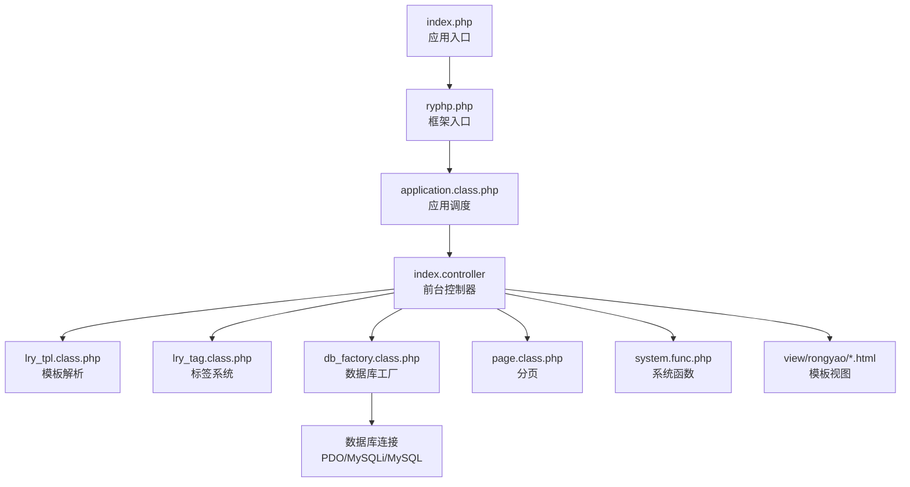
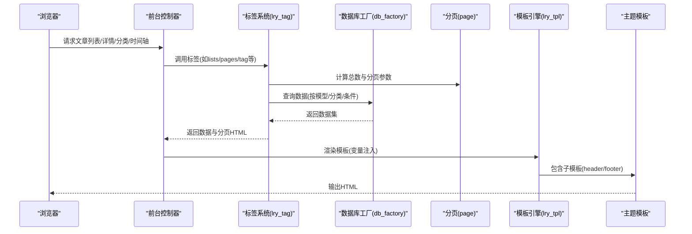
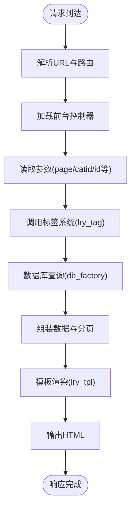
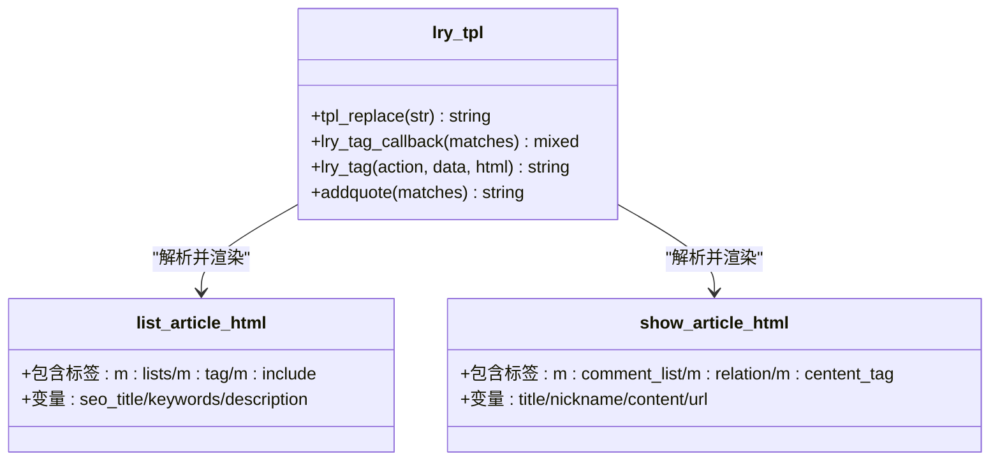
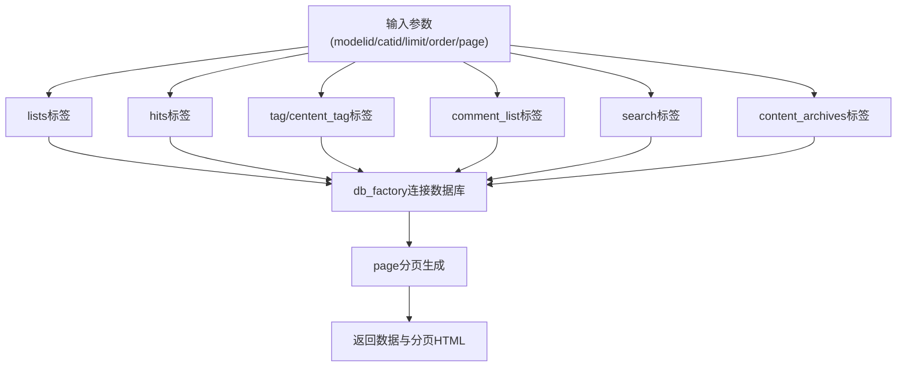
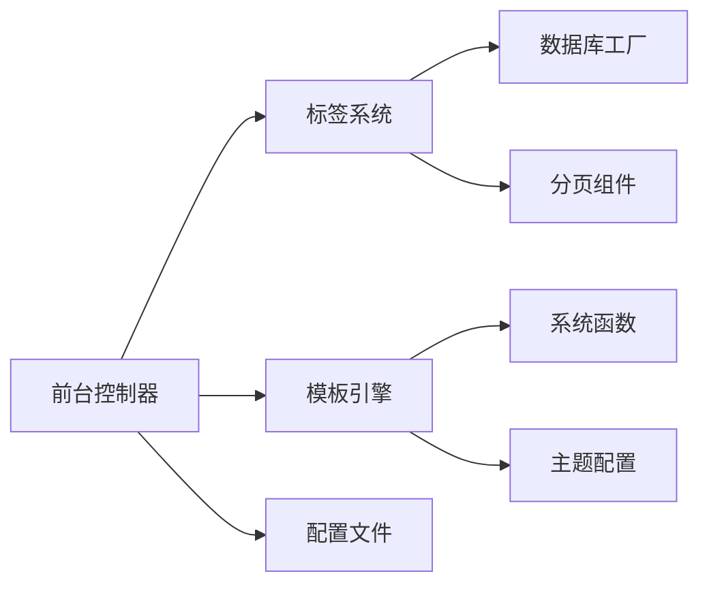

# 前台展示模块

<cite>
**本文引用的文件**
- [index.php](file://index.php)
- [ryphp.php](file://ryphp/ryphp.php)
- [application.class.php](file://ryphp/core/class/application.class.php)
- [db_factory.class.php](file://ryphp/core/class/db_factory.class.php)
- [page.class.php](file://ryphp/core/class/page.class.php)
- [lry_tpl.class.php](file://ryphp/core/class/lry_tpl.class.php)
- [lry_tag.class.php](file://ryphp/core/class/lry_tag.class.php)
- [system.func.php](file://common/function/system.func.php)
- [config.php](file://common/config/config.php)
- [index.class.php](file://application/index/controller/index.class.php)
- [config.php](file://application/index/view/rongyao/config.php)
- [list_article.html](file://application/index/view/rongyao/list_article.html)
- [list_time.html](file://application/index/view/rongyao/list_time.html)
- [show_article.html](file://application/index/view/rongyao/show_article.html)
</cite>

## 目录
1. [引言](#引言)
2. [项目结构](#项目结构)
3. [核心组件](#核心组件)
4. [架构总览](#架构总览)
5. [详细组件分析](#详细组件分析)
6. [依赖关系分析](#依赖关系分析)
7. [性能考虑](#性能考虑)
8. [故障排查指南](#故障排查指南)
9. [结论](#结论)
10. [附录](#附录)

## 引言
本文件面向LRYBlog前台展示模块，系统性阐述其架构设计与实现原理，重点覆盖以下方面：
- 前台控制器工作机制：文章列表、详情页、分类页、时间轴等页面的渲染流程
- 模板系统：模板继承、变量传递与渲染过程
- 数据层交互：文章数据获取、分类信息查询、分页与标签系统
- 配置与定制：主题切换、样式调整、功能扩展
- 性能与SEO优化策略
- 故障排查与最佳实践

## 项目结构
前台模块位于 application/index 目录，采用 MVC 分层组织：
- 控制器：application/index/controller/index.class.php
- 视图：application/index/view/rongyao/*.html
- 模型：application/index/model（未在本次分析中直接使用，但通过D函数间接访问）
- 配置：common/config/config.php

入口文件 index.php 负责应用初始化，加载 RYPHP 框架并启动应用。

图表来源
- [index.php](file://index.php#L1-L18)
- [ryphp.php](file://ryphp/ryphp.php#L83-L90)
- [application.class.php](file://ryphp/core/class/application.class.php)
- [index.class.php](file://application/index/controller/index.class.php#L1-L18)
- [lry_tpl.class.php](file://ryphp/core/class/lry_tpl.class.php#L1-L134)
- [lry_tag.class.php](file://ryphp/core/class/lry_tag.class.php#L1-L492)
- [db_factory.class.php](file://ryphp/core/class/db_factory.class.php#L1-L50)
- [page.class.php](file://ryphp/core/class/page.class.php#L1-L202)
- [system.func.php](file://common/function/system.func.php#L1-L200)
- [list_article.html](file://application/index/view/rongyao/list_article.html#L1-L150)

章节来源
- [index.php](file://index.php#L1-L18)
- [ryphp.php](file://ryphp/ryphp.php#L83-L90)

## 核心组件
- 应用入口与框架初始化：index.php 调用 RYPHP 框架入口，设置调试开关、根路径与 URL 模式，并执行应用初始化。
- 模板引擎：lry_tpl.class.php 提供模板标签解析、循环、条件判断、include 包含等能力，将模板语法转换为 PHP 代码。
- 标签系统：lry_tag.class.php 实现内容列表、分页、点击排行、标签、评论、搜索、归档等常用标签，统一数据查询与分页逻辑。
- 数据库访问：db_factory.class.php 根据配置选择 PDO/MySQLi/MySQL 实现，封装连接与模型切换。
- 分页组件：page.class.php 提供分页 URL 生成、页码计算、跳转与列表渲染。
- 系统函数：system.func.php 提供主题列表、SEO、URL 生成、站点信息等通用工具。
- 主题配置：application/index/view/rongyao/config.php 定义主题名称、作者、版本及模板映射。

章节来源
- [index.php](file://index.php#L10-L18)
- [lry_tpl.class.php](file://ryphp/core/class/lry_tpl.class.php#L31-L92)
- [lry_tag.class.php](file://ryphp/core/class/lry_tag.class.php#L18-L65)
- [db_factory.class.php](file://ryphp/core/class/db_factory.class.php#L11-L49)
- [page.class.php](file://ryphp/core/class/page.class.php#L26-L152)
- [system.func.php](file://common/function/system.func.php#L8-L28)
- [config.php](file://application/index/view/rongyao/config.php#L1-L29)

## 架构总览
前台模块遵循“控制器-模板-标签-模型”的数据流：
- 控制器接收请求参数（如分页、分类ID），调用标签系统生成数据与分页，再渲染模板。
- 模板通过 lry_tpl 解析标签语法，动态包含头部/底部等子模板。
- 标签系统通过 db_factory 选择数据库实现，结合 page 组件进行分页查询。
- system.func.php 提供 SEO、URL、主题等辅助能力。

图表来源
- [index.class.php](file://application/index/controller/index.class.php#L14-L17)
- [lry_tag.class.php](file://ryphp/core/class/lry_tag.class.php#L18-L65)
- [page.class.php](file://ryphp/core/class/page.class.php#L56-L152)
- [db_factory.class.php](file://ryphp/core/class/db_factory.class.php#L38-L49)
- [lry_tpl.class.php](file://ryphp/core/class/lry_tpl.class.php#L31-L59)
- [list_article.html](file://application/index/view/rongyao/list_article.html#L48-L150)

## 详细组件分析

### 前台控制器工作机理
- 入口与路由：index.php 设置 URL 模式与调试标志，随后由框架加载 application.class.php 并进入应用调度。
- 控制器职责：application/index/controller/index.class.php 接收 page 参数并调用模型查询（示例中演示了分类数据查询），实际业务通常在对应模块控制器中实现（此处为占位示例）。
- 模板渲染：控制器将数据注入模板，模板通过 lry_tpl 的标签语法调用标签系统与 include 子模板。

图表来源
- [index.php](file://index.php#L16-L18)
- [application.class.php](file://ryphp/core/class/application.class.php)
- [index.class.php](file://application/index/controller/index.class.php#L9-L17)
- [lry_tag.class.php](file://ryphp/core/class/lry_tag.class.php#L18-L65)
- [db_factory.class.php](file://ryphp/core/class/db_factory.class.php#L38-L49)
- [lry_tpl.class.php](file://ryphp/core/class/lry_tpl.class.php#L31-L59)

章节来源
- [index.php](file://index.php#L10-L18)
- [index.class.php](file://application/index/controller/index.class.php#L9-L17)

### 模板系统与页面渲染
- 模板标签：lry_tpl.class.php 将 {m:tag ...}、{loop ...}、{if ...} 等模板语法转换为 PHP 代码，并支持 include 子模板。
- 主题模板：application/index/view/rongyao/ 下包含多种模板，如文章列表、时间轴、详情页等，均通过 {m:include ...} 引入公共头部与底部。
- 变量传递：模板中使用 {$变量名} 形式，由控制器注入；同时支持函数调用如 {get_category(...)}/{U(...)} 等。

图表来源
- [lry_tpl.class.php](file://ryphp/core/class/lry_tpl.class.php#L31-L92)
- [list_article.html](file://application/index/view/rongyao/list_article.html#L54-L149)
- [show_article.html](file://application/index/view/rongyao/show_article.html#L202-L384)

章节来源
- [lry_tpl.class.php](file://ryphp/core/class/lry_tpl.class.php#L31-L92)
- [list_article.html](file://application/index/view/rongyao/list_article.html#L48-L150)
- [show_article.html](file://application/index/view/rongyao/show_article.html#L50-L384)

### 数据层交互与标签系统
- 列表标签 lists：支持按模型/分类/缩略图/推荐位等条件筛选，支持分页与排序，最终返回数据集。
- 分页 pages：根据总数与每页条数生成分页 HTML，支持 URL 规则与 Cookie 记忆每页数量。
- 点击排行 hits：按点击数降序返回内容列表，支持天数与缩略图过滤。
- 标签 tag/centent_tag：提供全站标签列表与内容页关联标签，支持分页。
- 评论 comment_list：按评论ID聚合返回评论列表，支持分页与排序。
- 搜索 search：支持按标题/全文检索，支持按模型或全站检索，支持标签与归档模式。
- 归档 content_archives：按月/年统计内容发布数量。

图表来源
- [lry_tag.class.php](file://ryphp/core/class/lry_tag.class.php#L18-L65)
- [lry_tag.class.php](file://ryphp/core/class/lry_tag.class.php#L98-L129)
- [lry_tag.class.php](file://ryphp/core/class/lry_tag.class.php#L174-L193)
- [lry_tag.class.php](file://ryphp/core/class/lry_tag.class.php#L288-L310)
- [lry_tag.class.php](file://ryphp/core/class/lry_tag.class.php#L356-L450)
- [lry_tag.class.php](file://ryphp/core/class/lry_tag.class.php#L340-L353)
- [db_factory.class.php](file://ryphp/core/class/db_factory.class.php#L38-L49)
- [page.class.php](file://ryphp/core/class/page.class.php#L56-L152)

章节来源
- [lry_tag.class.php](file://ryphp/core/class/lry_tag.class.php#L18-L65)
- [page.class.php](file://ryphp/core/class/page.class.php#L26-L152)

### 页面功能实现逻辑

#### 文章列表展示
- 模板：list_article.html
- 关键点：使用 {m:lists} 获取文章列表，支持分页；侧边栏包含推荐、随机推荐、点击排行、标签云等模块；顶部横幅背景可按分类设置。

章节来源
- [list_article.html](file://application/index/view/rongyao/list_article.html#L54-L149)

#### 时间轴展示
- 模板：list_time.html
- 关键点：按日期倒序列出文章标题与链接，适合时间线风格展示。

章节来源
- [list_time.html](file://application/index/view/rongyao/list_time.html#L40-L48)

#### 文章详情页面
- 模板：show_article.html
- 关键点：展示标题、作者、更新时间、点击数、摘要与正文；包含标签展示、原文链接复制、上下篇导航、相关推荐、评论区与回复验证码等。

章节来源
- [show_article.html](file://application/index/view/rongyao/show_article.html#L54-L384)

#### 分类页面
- 模板：category_article.html（主题配置中声明）
- 关键点：通过主题配置文件声明分类模板映射，具体实现依赖模板与标签系统。

章节来源
- [config.php](file://application/index/view/rongyao/config.php#L8-L11)

### 主题配置与定制化
- 主题配置：application/index/view/rongyao/config.php 定义主题元信息与模板映射（分类/列表/内容页模板）。
- 主题切换：common/config/config.php 中的 site_theme 指定默认主题目录，系统函数 get_theme_list 可枚举可用主题。
- 样式与脚本：各模板通过 {C('site_theme')} 动态引用主题目录下的 CSS/JS 资源，便于切换与扩展。

章节来源
- [config.php](file://application/index/view/rongyao/config.php#L1-L29)
- [config.php](file://common/config/config.php#L9-L11)
- [system.func.php](file://common/function/system.func.php#L8-L17)

### SEO与URL优化
- SEO：system.func.php 提供 get_site_seo/get_seo_suffix 等函数，配合模板中的 {$seo_title}/{$keywords}/{$description} 实现页面 SEO 标签注入。
- URL：get_content_url 提供内容页 URL 生成，支持不同 URL 模式与伪静态后缀；page.class.php 支持伪静态分页 URL 生成。

章节来源
- [system.func.php](file://common/function/system.func.php#L46-L74)
- [page.class.php](file://ryphp/core/class/page.class.php#L172-L200)

## 依赖关系分析
- 控制器依赖标签系统与模板引擎，间接依赖数据库工厂与分页组件。
- 标签系统依赖数据库工厂与分页组件，提供统一的数据查询接口。
- 模板引擎依赖系统函数与主题配置，负责模板解析与渲染。
- 配置文件贯穿全局，决定数据库类型、URL 模式、主题目录等。

图表来源
- [index.class.php](file://application/index/controller/index.class.php#L14-L17)
- [lry_tag.class.php](file://ryphp/core/class/lry_tag.class.php#L18-L65)
- [lry_tpl.class.php](file://ryphp/core/class/lry_tpl.class.php#L31-L59)
- [db_factory.class.php](file://ryphp/core/class/db_factory.class.php#L38-L49)
- [page.class.php](file://ryphp/core/class/page.class.php#L56-L152)
- [system.func.php](file://common/function/system.func.php#L8-L28)
- [config.php](file://common/config/config.php#L9-L11)

章节来源
- [index.class.php](file://application/index/controller/index.class.php#L14-L17)
- [lry_tag.class.php](file://ryphp/core/class/lry_tag.class.php#L18-L65)
- [lry_tpl.class.php](file://ryphp/core/class/lry_tpl.class.php#L31-L59)
- [db_factory.class.php](file://ryphp/core/class/db_factory.class.php#L38-L49)
- [page.class.php](file://ryphp/core/class/page.class.php#L56-L152)
- [system.func.php](file://common/function/system.func.php#L8-L28)
- [config.php](file://common/config/config.php#L9-L11)

## 性能考虑
- 模板解析：lry_tpl 将标签转换为 PHP 代码，建议避免在模板中过度嵌套复杂逻辑，减少重复查询。
- 分页优化：page 组件支持 Cookie 记忆每页数量，合理设置 page_size 与分页 URL，降低数据库压力。
- 数据库访问：db_factory 根据配置选择 PDO/MySQLi/MySQL，建议在高并发场景使用 PDO 并启用连接池。
- 缓存策略：标签系统支持基于标签的缓存（见 lry_tpl::lry_tag），可在高频查询处启用缓存以减轻数据库负担。
- 资源加载：模板中对关键资源进行预加载与非关键资源延迟加载，有助于提升首屏性能。

## 故障排查指南
- 模板无法渲染：检查模板中 {m:include} 路径与主题目录配置，确认 lry_tpl 是否正确解析标签。
- 数据为空：核对标签参数（modelid/catid/limit/order/page）与数据库连接配置，确认分类是否存在且状态正常。
- 分页异常：检查 page 组件的 URL 规则与伪静态后缀配置，确保分页参数传递正确。
- SEO 标签缺失：确认 system.func.php 中的 SEO 函数调用与模板变量绑定，检查站点配置中的关键词与描述字段。

章节来源
- [lry_tpl.class.php](file://ryphp/core/class/lry_tpl.class.php#L31-L59)
- [lry_tag.class.php](file://ryphp/core/class/lry_tag.class.php#L18-L65)
- [page.class.php](file://ryphp/core/class/page.class.php#L39-L50)
- [system.func.php](file://common/function/system.func.php#L46-L57)

## 结论
前台展示模块通过清晰的 MVC 分层与强大的标签系统，实现了灵活的内容展示与良好的可扩展性。借助模板引擎与分页组件，能够高效地构建文章列表、详情页、分类页与时间轴等页面。结合合理的缓存与资源加载策略，可进一步提升性能与用户体验。建议在生产环境中启用合适的缓存与监控，持续优化数据库查询与模板渲染效率。

## 附录
- 最佳实践
  - 在模板中尽量使用标签系统提供的统一接口，避免直接拼接 SQL。
  - 对高频查询启用标签缓存，减少数据库压力。
  - 合理设置分页大小与伪静态规则，兼顾 SEO 与性能。
  - 使用主题配置集中管理样式与脚本资源，便于主题切换与维护。