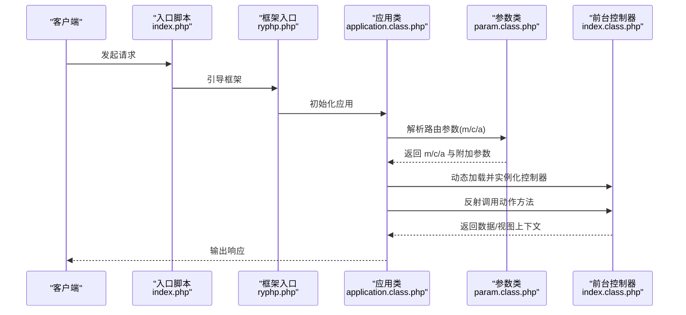
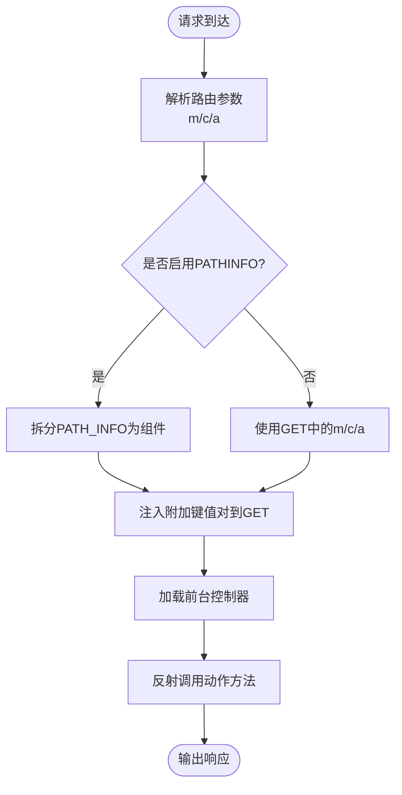
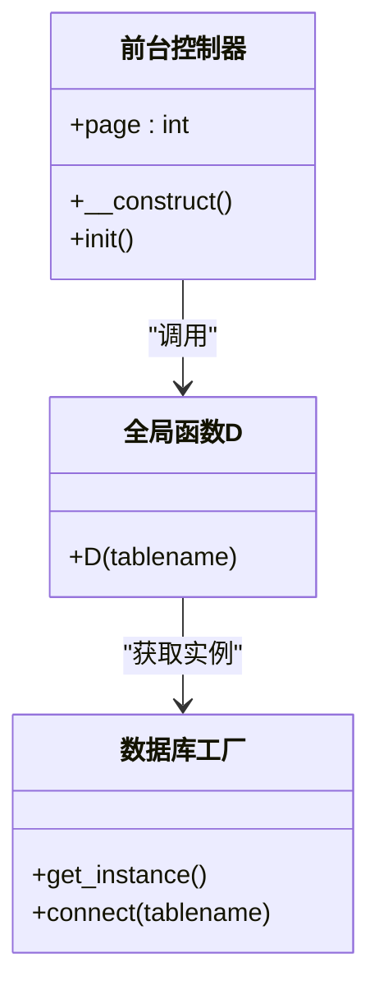
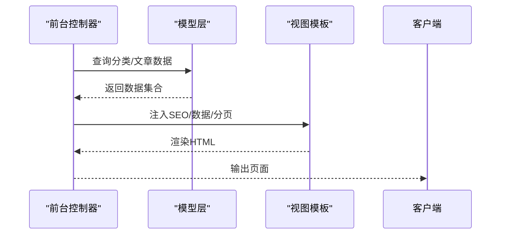
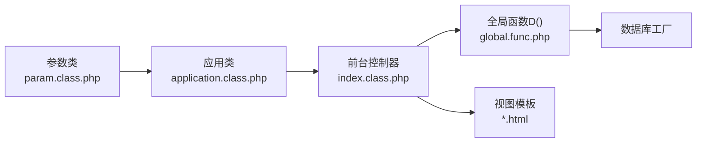

# 前台控制器

<cite>
**本文引用的文件**
- [index.class.php](file://application/index/controller/index.class.php)
- [index.php](file://index.php)
- [config.php](file://common/config/config.php)
- [application.class.php](file://ryphp/core/class/application.class.php)
- [ryphp.php](file://ryphp/ryphp.php)
- [param.class.php](file://ryphp/core/class/param.class.php)
- [global.func.php](file://ryphp/core/function/global.func.php)
- [config.php](file://application/index/view/rongyao/config.php)
- [list_article.html](file://application/index/view/rongyao/list_article.html)
- [show_article.html](file://application/index/view/rongyao/show_article.html)
</cite>

## 目录
1. [简介](#简介)
2. [项目结构](#项目结构)
3. [核心组件](#核心组件)
4. [架构总览](#架构总览)
5. [详细组件分析](#详细组件分析)
6. [依赖关系分析](#依赖关系分析)
7. [性能考量](#性能考量)
8. [故障排查指南](#故障排查指南)
9. [结论](#结论)
10. [附录](#附录)

## 简介
本技术文档面向 LRYBlog 前台控制器，系统性阐述其架构设计、初始化流程、URL 参数解析、分页处理、请求路由机制、与模型层交互方式、关键方法实现（如文章列表获取、分类信息查询、页面渲染准备），并提供扩展开发指南与最佳实践，帮助开发者快速理解与修改控制器逻辑。

## 项目结构
- 应用入口位于根目录的入口脚本，负责初始化框架与路由。
- 前台控制器位于 application/index/controller/index.class.php，对外暴露统一入口方法。
- 路由与参数解析由框架核心 param.class.php 完成，支持 PATHINFO 模式与路由映射。
- 配置集中于 common/config/config.php，包含 URL 模式、路由规则、模板主题等。
- 视图模板位于 application/index/view/{theme}/，主题配置与模板映射由主题 config.php 管理。
- 数据访问通过全局函数 D() 获取数据库操作对象，遵循工厂模式与静态缓存。

```mermaid
graph TB
A["入口脚本<br/>index.php"] --> B["框架引导<br/>ryphp.php"]
B --> C["应用启动<br/>application.class.php"]
C --> D["参数解析<br/>param.class.php"]
D --> E["控制器加载<br/>application.class.php"]
E --> F["前台控制器<br/>application/index/controller/index.class.php"]
F --> G["模型访问<br/>D() -> db_factory"]
F --> H["视图渲染<br/>application/index/view/rongyao/*.html"]
```

**图表来源**
- [index.php:1-18](file://index.php#L1-L18)
- [ryphp.php:83-90](file://ryphp/ryphp.php#L83-L90)
- [application.class.php:24-40](file://ryphp/core/class/application.class.php#L24-L40)
- [param.class.php:95-116](file://ryphp/core/class/param.class.php#L95-L116)
- [index.class.php:4-18](file://application/index/controller/index.class.php#L4-L18)
- [global.func.php:100-108](file://ryphp/core/function/global.func.php#L100-L108)

**章节来源**
- [index.php:1-18](file://index.php#L1-L18)
- [ryphp.php:83-90](file://ryphp/ryphp.php#L83-L90)
- [application.class.php:24-40](file://ryphp/core/class/application.class.php#L24-L40)
- [param.class.php:95-116](file://ryphp/core/class/param.class.php#L95-L116)
- [config.php:23-30](file://common/config/config.php#L23-L30)

## 核心组件
- 入口与框架引导
  - 入口脚本定义调试开关、根路径、URL 模式，并调用框架入口初始化应用。
  - 框架入口负责加载公共函数、常量定义、时区设置、以及应用类实例化。
- 应用调度器
  - 应用类负责参数注入（m/c/a）、控制器加载、反射调用、异常与致命错误处理。
- 参数与路由
  - 参数类解析 GET/POST 的 m、c、a，并支持 PATHINFO 模式与路由映射；同时处理额外键值对。
- 前台控制器
  - 当前实现包含分页属性与一个演示方法，实际业务逻辑需按需扩展。
- 数据访问
  - 全局函数 D() 通过工厂模式获取数据库对象，支持静态缓存避免重复实例化。
- 视图与模板
  - 主题配置与模板映射由主题 config.php 管理，视图模板采用标签语法进行数据绑定与循环渲染。

**章节来源**
- [index.php:10-18](file://index.php#L10-L18)
- [ryphp.php:83-90](file://ryphp/ryphp.php#L83-L90)
- [application.class.php:14-40](file://ryphp/core/class/application.class.php#L14-L40)
- [param.class.php:18-46](file://ryphp/core/class/param.class.php#L18-L46)
- [index.class.php:7-17](file://application/index/controller/index.class.php#L7-L17)
- [global.func.php:100-108](file://ryphp/core/function/global.func.php#L100-L108)
- [config.php:1-29](file://application/index/view/rongyao/config.php#L1-L29)

## 架构总览
前台控制器在 MVC 架构中承担“控制器”职责，接收请求、解析参数、协调模型与视图，最终输出页面。其控制流如下：

**图表来源**
- [index.php:10-18](file://index.php#L10-L18)
- [ryphp.php:88-90](file://ryphp/ryphp.php#L88-L90)
- [application.class.php:14-40](file://ryphp/core/class/application.class.php#L14-L40)
- [param.class.php:18-46](file://ryphp/core/class/param.class.php#L18-L46)
- [index.class.php:14-18](file://application/index/controller/index.class.php#L14-L18)

## 详细组件分析

### 前台控制器初始化与路由
- 分页属性
  - 控制器在构造函数中读取 URL 参数 page 并赋值到成员变量，便于后续分页逻辑使用。
- 动作方法
  - 当前仅包含一个演示方法 init，内部通过 D() 获取分类模型，查询分类数据并输出（调试用途）。
- 路由与参数
  - URL 中的 m/c/a 由参数类解析；若启用 PATHINFO，会将 PATH_INFO 解析为 m/c/a，并将后续键值对注入到 GET。
  - URL 模式与路由映射在配置中开启，支持将旧路径映射为新路径。

**图表来源**
- [param.class.php:95-116](file://ryphp/core/class/param.class.php#L95-L116)
- [param.class.php:138-151](file://ryphp/core/class/param.class.php#L138-L151)
- [application.class.php:24-40](file://ryphp/core/class/application.class.php#L24-L40)
- [index.class.php:9-12](file://application/index/controller/index.class.php#L9-L12)
- [index.class.php:14-18](file://application/index/controller/index.class.php#L14-L18)

**章节来源**
- [index.class.php:7-18](file://application/index/controller/index.class.php#L7-L18)
- [param.class.php:18-46](file://ryphp/core/class/param.class.php#L18-L46)
- [param.class.php:95-116](file://ryphp/core/class/param.class.php#L95-L116)
- [param.class.php:138-151](file://ryphp/core/class/param.class.php#L138-L151)
- [config.php:10-11](file://common/config/config.php#L10-L11)
- [config.php:23-30](file://common/config/config.php#L23-L30)

### 控制器与模型层交互
- 数据访问入口
  - D() 通过工厂模式获取数据库对象，内部维护静态缓存，避免重复连接。
- 查询示例
  - 控制器 init 方法展示了如何通过 D() 获取模型实例，设置字段、条件、排序与查询。
- 扩展建议
  - 在实际业务中，应将查询封装为模型方法，控制器仅负责参数校验与调用。

**图表来源**
- [index.class.php:14-18](file://application/index/controller/index.class.php#L14-L18)
- [global.func.php:100-108](file://ryphp/core/function/global.func.php#L100-L108)

**章节来源**
- [global.func.php:100-108](file://ryphp/core/function/global.func.php#L100-L108)
- [index.class.php:14-18](file://application/index/controller/index.class.php#L14-L18)

### 关键方法实现与页面渲染准备
- 文章列表获取
  - 视图模板通过标签语法调用列表标签，传入 catid、limit、page 等参数，实现分类文章列表渲染。
- 分类信息查询
  - 视图模板通过辅助函数获取分类标题、封面图、链接等信息，配合 CSS 实现动态样式。
- 页面渲染准备
  - 控制器可在此阶段准备 SEO 标题、关键词、描述等元数据，交由视图模板渲染。
- 分页处理
  - 控制器 page 属性可作为分页起始偏移或页码，结合模板标签生成分页链接。

**图表来源**
- [list_article.html:54-74](file://application/index/view/rongyao/list_article.html#L54-L74)
- [show_article.html:50-120](file://application/index/view/rongyao/show_article.html#L50-L120)
- [index.class.php:7-18](file://application/index/controller/index.class.php#L7-L18)

**章节来源**
- [list_article.html:54-74](file://application/index/view/rongyao/list_article.html#L54-L74)
- [show_article.html:50-120](file://application/index/view/rongyao/show_article.html#L50-L120)
- [index.class.php:7-18](file://application/index/controller/index.class.php#L7-L18)

### 扩展开发指南
- 新增动作方法
  - 在前台控制器中新增方法，遵循参数校验、数据查询、上下文组装、模板渲染的流程。
- 参数验证
  - 对 URL 参数（如 catid、page、modelid）进行类型与范围校验，必要时使用白名单策略。
- 错误处理
  - 使用应用类的错误处理机制，统一输出错误页面或返回 JSON。
- 分页扩展
  - 结合控制器 page 属性与模板分页标签，实现前后端一致的分页体验。
- 模板映射
  - 通过主题配置与路由映射，实现 URL 到模板的灵活映射。

**章节来源**
- [application.class.php:108-115](file://ryphp/core/class/application.class.php#L108-L115)
- [config.php:23-30](file://common/config/config.php#L23-L30)
- [config.php:1-29](file://application/index/view/rongyao/config.php#L1-L29)

## 依赖关系分析
- 控制器依赖
  - 控制器依赖参数解析与应用调度，间接依赖数据库工厂与视图模板。
- 数据流
  - URL 参数经参数类解析后注入应用类，应用类加载控制器并反射调用动作方法，方法通过 D() 访问模型，最终渲染视图。
- 配置耦合
  - URL 模式、路由映射、模板主题等配置影响控制器行为与视图渲染。

**图表来源**
- [param.class.php:18-46](file://ryphp/core/class/param.class.php#L18-L46)
- [application.class.php:24-40](file://ryphp/core/class/application.class.php#L24-L40)
- [index.class.php:14-18](file://application/index/controller/index.class.php#L14-L18)
- [global.func.php:100-108](file://ryphp/core/function/global.func.php#L100-L108)
- [list_article.html:54-74](file://application/index/view/rongyao/list_article.html#L54-L74)

**章节来源**
- [param.class.php:18-46](file://ryphp/core/class/param.class.php#L18-L46)
- [application.class.php:24-40](file://ryphp/core/class/application.class.php#L24-L40)
- [index.class.php:14-18](file://application/index/controller/index.class.php#L14-L18)
- [global.func.php:100-108](file://ryphp/core/function/global.func.php#L100-L108)

## 性能考量
- 控制器层面
  - 合理使用分页，避免一次性加载大量数据；对高频查询结果进行缓存。
- 数据访问层面
  - D() 已具备静态缓存，避免重复实例化；建议对热点查询增加业务层缓存。
- 视图渲染层面
  - 模板中尽量减少嵌套循环与复杂计算，将逻辑前置到控制器或模型层。

## 故障排查指南
- 路由无效
  - 检查 URL 模式与路由映射配置，确认 PATHINFO 是否正确设置。
- 控制器找不到
  - 确认 m/c/a 参数是否正确，控制器文件路径与命名是否符合约定。
- 数据查询异常
  - 检查 D() 的表名与工厂配置，确认数据库连接参数与表前缀。
- 错误页面显示
  - 非调试模式下，应用类会根据配置输出错误页面，检查错误日志与配置项。

**章节来源**
- [config.php:10-11](file://common/config/config.php#L10-L11)
- [config.php:23-30](file://common/config/config.php#L23-L30)
- [application.class.php:108-115](file://ryphp/core/class/application.class.php#L108-L115)
- [global.func.php:100-108](file://ryphp/core/function/global.func.php#L100-L108)

## 结论
前台控制器作为 LRYBlog 前台的核心入口，通过参数解析、控制器加载与反射调用，实现了清晰的请求处理链路。当前实现提供了分页属性与演示方法，实际业务需在控制器中完善数据查询、上下文准备与模板渲染流程。结合配置与模板映射，可实现灵活的 URL 与页面展示策略。

## 附录
- 代码示例路径
  - 控制器初始化与演示方法：[index.class.php:7-18](file://application/index/controller/index.class.php#L7-L18)
  - 入口与框架引导：[index.php:10-18](file://index.php#L10-L18)，[ryphp.php:83-90](file://ryphp/ryphp.php#L83-L90)
  - 应用调度与错误处理：[application.class.php:14-40](file://ryphp/core/class/application.class.php#L14-L40)
  - 参数解析与路由映射：[param.class.php:95-116](file://ryphp/core/class/param.class.php#L95-L116)，[param.class.php:138-151](file://ryphp/core/class/param.class.php#L138-L151)
  - 数据访问入口：[global.func.php:100-108](file://ryphp/core/function/global.func.php#L100-L108)
  - 主题配置与模板映射：[config.php:1-29](file://application/index/view/rongyao/config.php#L1-L29)
  - 列表页模板示例：[list_article.html:54-74](file://application/index/view/rongyao/list_article.html#L54-L74)
  - 内容页模板示例：[show_article.html:50-120](file://application/index/view/rongyao/show_article.html#L50-L120)