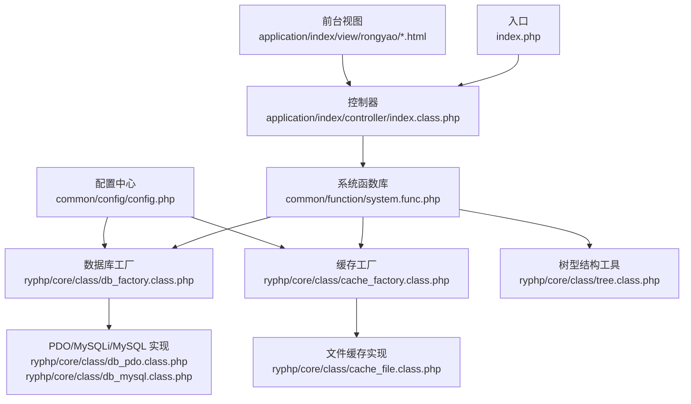
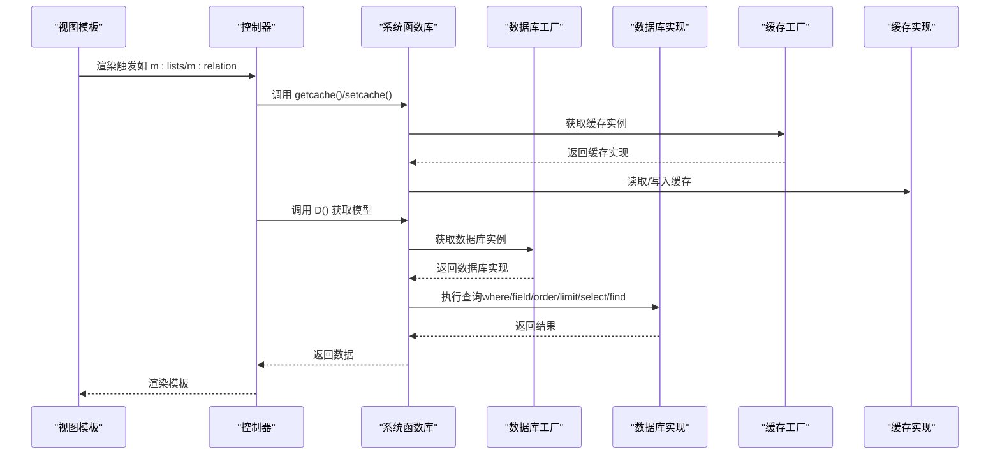
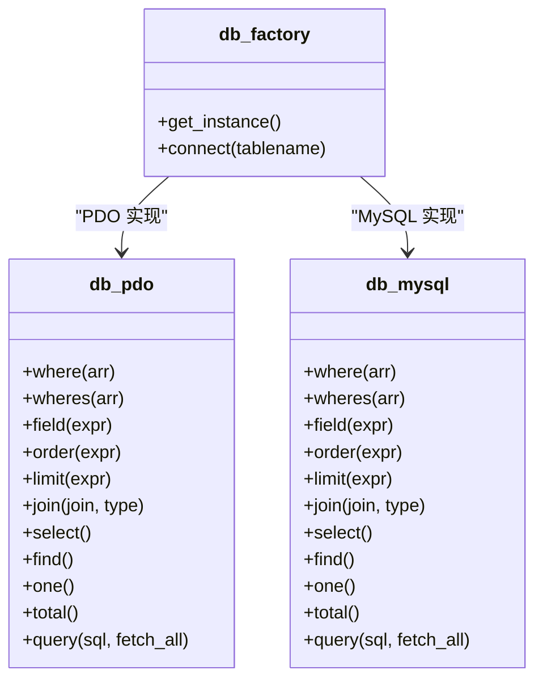
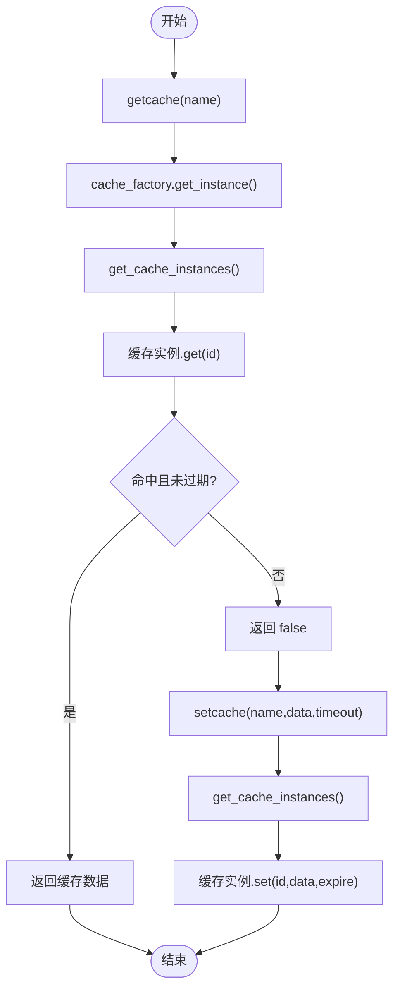
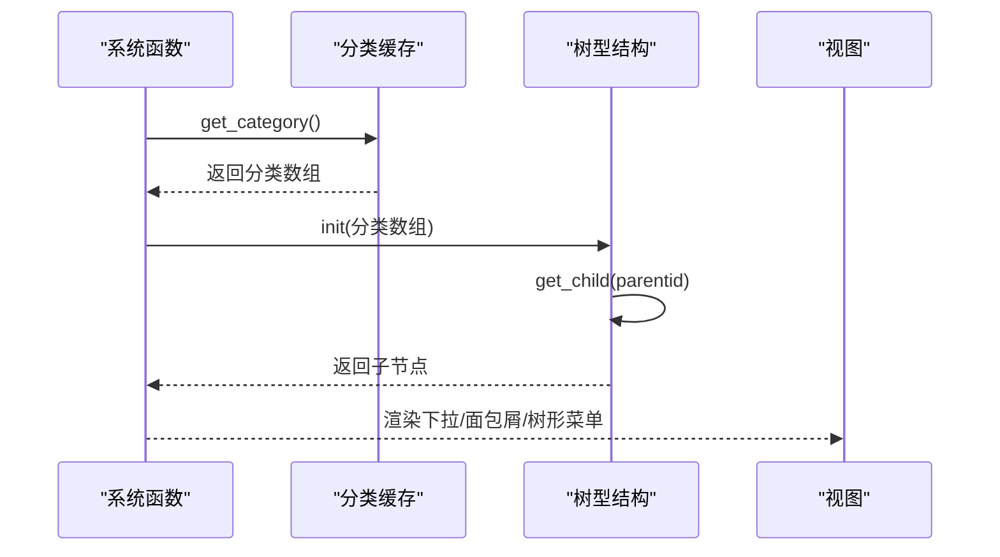
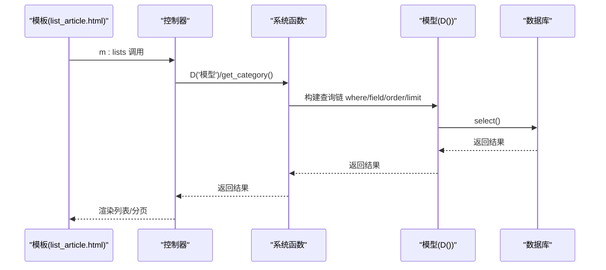
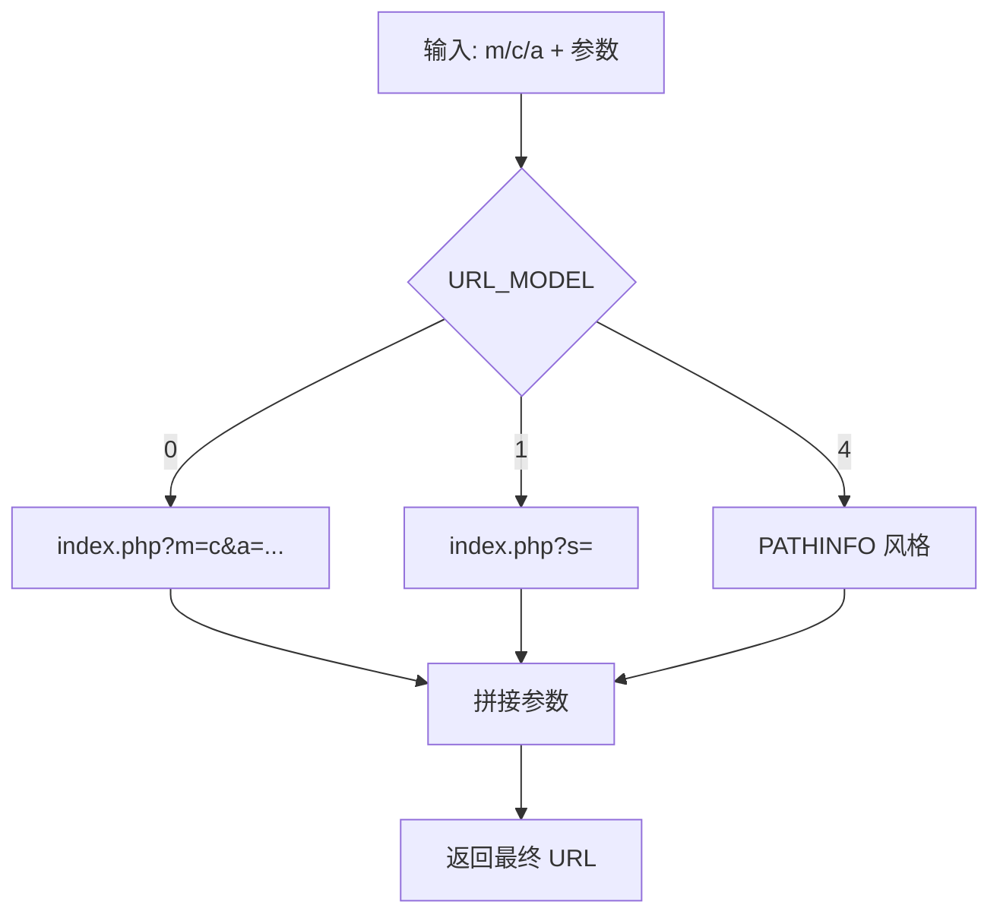
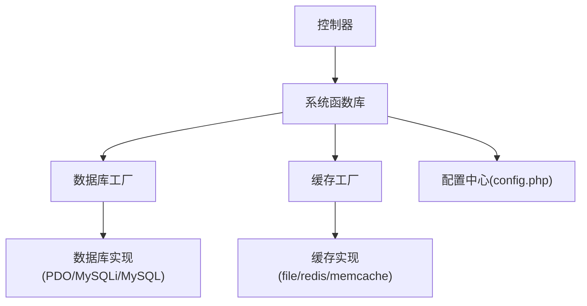

# 前台数据交互

<cite>
**本文引用的文件**
- [index.php](file://index.php)
- [index.class.php](file://application/index/controller/index.class.php)
- [system.func.php](file://common/function/system.func.php)
- [global.func.php](file://ryphp/core/function/global.func.php)
- [db_factory.class.php](file://ryphp/core/class/db_factory.class.php)
- [db_mysql.class.php](file://ryphp/core/class/db_mysql.class.php)
- [db_pdo.class.php](file://ryphp/core/class/db_pdo.class.php)
- [cache_factory.class.php](file://ryphp/core/class/cache_factory.class.php)
- [cache_file.class.php](file://ryphp/core/class/cache_file.class.php)
- [tree.class.php](file://ryphp/core/class/tree.class.php)
- [config.php](file://common/config/config.php)
- [list_article.html](file://application/index/view/rongyao/list_article.html)
- [show_article.html](file://application/index/view/rongyao/show_article.html)
- [category_page.html](file://application/index/view/rongyao/category_page.html)
</cite>

## 目录
1. [引言](#引言)
2. [项目结构](#项目结构)
3. [核心组件](#核心组件)
4. [架构总览](#架构总览)
5. [详细组件分析](#详细组件分析)
6. [依赖关系分析](#依赖关系分析)
7. [性能考量](#性能考量)
8. [故障排查指南](#故障排查指南)
9. [结论](#结论)
10. [附录](#附录)

## 引言
本技术文档聚焦于 LRYBlog 前台数据交互模块，系统梳理从前端模板到数据库层的完整数据流，涵盖文章列表与详情获取、分类数据处理、缓存策略、安全与验证、调试与性能监控等关键主题。文档旨在帮助开发者快速理解并高效维护前台数据交互能力。

## 项目结构
- 应用入口与框架初始化
  - 入口文件负责常量定义、框架引导与应用初始化。
- 前台控制器与视图
  - 控制器负责接收请求参数、组织数据并调用模型；视图负责渲染模板。
- 核心框架与数据访问
  - 数据库工厂与多种数据库适配器；缓存工厂与多种缓存适配器；通用函数库提供 D()、C()、getcache()/setcache() 等便捷接口。
- 配置中心
  - 统一管理数据库、缓存、路由、Cookie 等配置项。

**图表来源**
- [index.php:1-18](file://index.php#L1-L18)
- [index.class.php:1-18](file://application/index/controller/index.class.php#L1-L18)
- [system.func.php:147-151](file://common/function/system.func.php#L147-L151)
- [db_factory.class.php:1-50](file://ryphp/core/class/db_factory.class.php#L1-L50)
- [db_pdo.class.php:1-646](file://ryphp/core/class/db_pdo.class.php#L1-L646)
- [db_mysql.class.php:1-667](file://ryphp/core/class/db_mysql.class.php#L1-L667)
- [cache_factory.class.php:1-84](file://ryphp/core/class/cache_factory.class.php#L1-L84)
- [cache_file.class.php:1-130](file://ryphp/core/class/cache_file.class.php#L1-L130)
- [tree.class.php:1-484](file://ryphp/core/class/tree.class.php#L1-L484)
- [config.php:1-88](file://common/config/config.php#L1-L88)

**章节来源**
- [index.php:1-18](file://index.php#L1-L18)
- [config.php:1-88](file://common/config/config.php#L1-L88)

## 核心组件
- 数据库访问层
  - 工厂模式统一创建数据库实例，支持 PDO、MySQLi、MySQL 三种实现，自动注入配置与表前缀。
- 缓存访问层
  - 工厂模式统一创建缓存实例，支持 file、redis、memcache 三种实现，提供 get/set/flush 等常用接口。
- 系统函数库
  - D() 获取模型实例；C() 读取配置；getcache()/setcache() 读写缓存；URL 生成、模板标签、分类树等。
- 视图与模板标签
  - 列表页、详情页、单页模板通过 m:lists、m:relation、m:tag 等标签调用后台数据接口，实现文章列表、相关推荐、标签云等展示。

**章节来源**
- [db_factory.class.php:1-50](file://ryphp/core/class/db_factory.class.php#L1-L50)
- [db_pdo.class.php:1-646](file://ryphp/core/class/db_pdo.class.php#L1-L646)
- [db_mysql.class.php:1-667](file://ryphp/core/class/db_mysql.class.php#L1-L667)
- [cache_factory.class.php:1-84](file://ryphp/core/class/cache_factory.class.php#L1-L84)
- [cache_file.class.php:1-130](file://ryphp/core/class/cache_file.class.php#L1-L130)
- [system.func.php:147-151](file://common/function/system.func.php#L147-L151)

## 架构总览
前台数据交互遵循“视图模板 -> 控制器 -> 模型/系统函数 -> 数据库/缓存”的链路。系统通过工厂模式解耦具体实现，通过配置中心集中管理数据库与缓存参数，确保跨环境一致性与可扩展性。

**图表来源**
- [system.func.php:147-151](file://common/function/system.func.php#L147-L151)
- [db_factory.class.php:1-50](file://ryphp/core/class/db_factory.class.php#L1-L50)
- [cache_factory.class.php:1-84](file://ryphp/core/class/cache_factory.class.php#L1-L84)
- [cache_file.class.php:1-130](file://ryphp/core/class/cache_file.class.php#L1-L130)
- [db_pdo.class.php:364-377](file://ryphp/core/class/db_pdo.class.php#L364-L377)
- [db_mysql.class.php:386-421](file://ryphp/core/class/db_mysql.class.php#L386-L421)

## 详细组件分析

### 组件A：数据库访问与查询封装
- 设计要点
  - 工厂选择：根据配置选择 PDO/MySQLi/MySQL 实现，统一构造参数（主机、端口、用户名、密码、字符集、表前缀）。
  - 查询链式 API：where/wheres/field/order/limit/join/alias 等方法组合 SQL，select/find/one 返回不同粒度结果。
  - 安全与容错：内置安全过滤（字符串转义、HTML 实体转义）、异常捕获与错误上报、断线重连。
- 关键流程
  - where/wheres：支持数组条件与表达式（=、<>、>,>=,<,<=、LIKE、IN、BETWEEN 等），wheres 支持回调函数。
  - 执行：execute 统一封装 SQL 执行与调试日志记录。
  - 结果：fetch_all/fetch_array/rowCount 等辅助方法。
- 复杂度与性能
  - where/wheres 组合复杂度受条件数量与表达式类型影响；建议合理使用索引与 limit。
  - 断线重连避免长时间查询中断，提升稳定性。

**图表来源**
- [db_factory.class.php:1-50](file://ryphp/core/class/db_factory.class.php#L1-L50)
- [db_pdo.class.php:1-646](file://ryphp/core/class/db_pdo.class.php#L1-L646)
- [db_mysql.class.php:1-667](file://ryphp/core/class/db_mysql.class.php#L1-L667)

**章节来源**
- [db_factory.class.php:1-50](file://ryphp/core/class/db_factory.class.php#L1-L50)
- [db_pdo.class.php:134-221](file://ryphp/core/class/db_pdo.class.php#L134-L221)
- [db_mysql.class.php:161-244](file://ryphp/core/class/db_mysql.class.php#L161-L244)

### 组件B：缓存策略与生命周期
- 设计要点
  - 工厂模式：根据配置选择 file/redis/memcache 实现，懒加载缓存实例。
  - 文件缓存：基于文件系统持久化，支持过期时间、序列化/可执行文件两种存储模式。
  - 读写流程：getcache -> cache_factory -> cache 实例 -> 读取；setcache -> 写入。
- 关键流程
  - get：检测文件存在与过期，返回内容或 false。
  - set：序列化数据与过期时间，写入文件。
  - flush：遍历缓存目录清理过期或全部缓存。
- 性能与运维
  - 建议为热点数据设置合理过期时间；定期清理过期缓存；生产环境建议使用 redis/memcache。

**图表来源**
- [cache_factory.class.php:1-84](file://ryphp/core/class/cache_factory.class.php#L1-L84)
- [cache_file.class.php:17-46](file://ryphp/core/class/cache_file.class.php#L17-L46)

**章节来源**
- [cache_factory.class.php:1-84](file://ryphp/core/class/cache_factory.class.php#L1-L84)
- [cache_file.class.php:1-130](file://ryphp/core/class/cache_file.class.php#L1-L130)

### 组件C：分类数据处理与树形结构
- 设计要点
  - 分类缓存：get_category/get_site_modelinfo 等函数通过缓存减少数据库查询。
  - 树型结构：tree 类提供 get_child/get_tree/get_tree_category 等方法，支持多级分类渲染与模板解析。
  - 选择器：select_category 基于树结构生成下拉菜单，支持模型筛选、投稿权限、禁用规则等。
- 关键流程
  - 分类查询：按 siteid/parentid/arrparentid/arrchildid 等字段组织数据。
  - 树构建：init -> get_child -> 递归渲染，支持图标、缩进、选中态。
  - 模板渲染：parseTemplate 安全替换变量，避免 eval 风险。
- 性能与安全
  - 缓存与数组列提取降低查询成本；模板解析避免动态执行，提升安全性。

**图表来源**
- [system.func.php:631-656](file://common/function/system.func.php#L631-L656)
- [tree.class.php:61-116](file://ryphp/core/class/tree.class.php#L61-L116)
- [tree.class.php:149-194](file://ryphp/core/class/tree.class.php#L149-L194)

**章节来源**
- [system.func.php:631-656](file://common/function/system.func.php#L631-L656)
- [tree.class.php:1-484](file://ryphp/core/class/tree.class.php#L1-L484)

### 组件D：前台数据获取与展示（列表、详情、单页）
- 文章列表页
  - 模板标签：m:lists 支持 field/catid/modelid/limit/order/page 等参数，渲染文章列表与分页。
  - 数据来源：系统函数库通过 D() 获取模型，执行 where/field/order/limit/select。
- 文章详情页
  - 模板标签：m:relation 提供相关文章推荐；m:tag/content_tag 提供标签；m:comment_list 提供评论。
  - 数据来源：D() + where/field/order/limit/select，配合 get_content_url、get_catname 等函数生成链接与面包屑。
- 单页模板
  - 模板标签：直接输出分类内容字段，适合独立页面展示。

**图表来源**
- [list_article.html:54-70](file://application/index/view/rongyao/list_article.html#L54-L70)
- [show_article.html:183-198](file://application/index/view/rongyao/show_article.html#L183-L198)
- [system.func.php:85-91](file://common/function/system.func.php#L85-L91)
- [system.func.php:65-74](file://common/function/system.func.php#L65-L74)

**章节来源**
- [list_article.html:54-70](file://application/index/view/rongyao/list_article.html#L54-L70)
- [show_article.html:183-198](file://application/index/view/rongyao/show_article.html#L183-L198)
- [category_page.html:52-56](file://application/index/view/rongyao/category_page.html#L52-L56)

### 组件E：URL 生成与路由映射
- 设计要点
  - U() 函数根据 URL_MODEL 生成不同风格的 URL（普通/带 s 参数/PATHINFO），支持域名前缀控制。
  - set_mapping() 基于分类目录与规则表生成路由映射，加速 URL 解析。
- 关键流程
  - URL 生成：解析模块/控制器/动作与参数，拼接路径与查询串。
  - 路由映射：将分类目录映射到 lists/show 控制器，支持列表与详情路由。

**图表来源**
- [system.func.php:764-800](file://common/function/system.func.php#L764-L800)
- [system.func.php:486-505](file://common/function/system.func.php#L486-L505)

**章节来源**
- [system.func.php:764-800](file://common/function/system.func.php#L764-L800)
- [system.func.php:486-505](file://common/function/system.func.php#L486-L505)

## 依赖关系分析
- 组件耦合
  - 控制器依赖系统函数库；系统函数库依赖数据库工厂与缓存工厂；视图依赖控制器提供的数据。
- 外部依赖
  - 数据库：PDO/MySQLi/MySQL 三选一；缓存：file/redis/memcache 三选一。
- 配置中心
  - 数据库与缓存类型、连接参数、路由规则、Cookie 设置均来自配置文件。

**图表来源**
- [index.class.php:1-18](file://application/index/controller/index.class.php#L1-L18)
- [system.func.php:147-151](file://common/function/system.func.php#L147-L151)
- [db_factory.class.php:1-50](file://ryphp/core/class/db_factory.class.php#L1-L50)
- [cache_factory.class.php:1-84](file://ryphp/core/class/cache_factory.class.php#L1-L84)
- [config.php:1-88](file://common/config/config.php#L1-L88)

**章节来源**
- [config.php:1-88](file://common/config/config.php#L1-L88)

## 性能考量
- 查询优化
  - 合理使用 where/wheres 与索引字段；避免 select *，仅取必要字段；分页使用 limit。
  - 复杂查询可考虑 join/子查询，但需评估性能与可维护性。
- 缓存策略
  - 热点数据（分类、模型、SEO、URL 规则）使用缓存；设置合理过期时间；定期清理过期缓存。
  - 生产环境建议使用 redis/memcache 替代文件缓存，提升并发与可靠性。
- 模板渲染
  - 避免在模板中进行复杂计算；将逻辑前置到控制器或系统函数库。
- URL 与路由
  - set_mapping() 生成映射缓存，减少运行时解析开销；URL_MODEL 选择合适模式。

[本节为通用指导，无需特定文件引用]

## 故障排查指南
- 数据库连接与错误
  - 检查配置文件中的数据库参数；确认扩展可用（PDO/MySQLi/MySQL）；查看错误日志与调试信息。
  - 断线重连：数据库实现内置断线检测与重连逻辑，避免长时间查询中断。
- 缓存问题
  - 检查缓存目录权限与磁盘空间；确认缓存键命名规范；必要时执行 flush 清理。
- 模板与路由
  - 确认 URL_MODEL 与路由映射配置；检查模板标签参数（field/catid/modelid/limit/order/page）。
- 安全与验证
  - XSS 防护：系统函数库提供 remove_xss/safe_replace 等过滤；模板输出时注意 HTML 实体转义。
  - SQL 注入防护：数据库实现对字符串进行转义与 LIKE/IN/BETWEEN 等表达式安全处理；wheres 支持回调函数白名单。

**章节来源**
- [db_mysql.class.php:515-528](file://ryphp/core/class/db_mysql.class.php#L515-L528)
- [db_pdo.class.php:492-505](file://ryphp/core/class/db_pdo.class.php#L492-L505)
- [cache_file.class.php:61-73](file://ryphp/core/class/cache_file.class.php#L61-L73)
- [system.func.php:450-474](file://common/function/system.func.php#L450-L474)
- [system.func.php:500-516](file://common/function/system.func.php#L500-L516)

## 结论
LRYBlog 前台数据交互模块通过工厂模式与配置中心实现了数据库与缓存的灵活适配，配合系统函数库与模板标签，形成了清晰、可扩展的数据获取与展示链路。建议在生产环境中启用缓存与合适的 URL 模式，持续关注查询性能与安全防护，以保障用户体验与系统稳定。

## 附录
- 关键函数与类速览
  - D()：获取模型实例
  - C()：读取配置
  - getcache()/setcache()：缓存读写
  - db_factory/db_pdo/db_mysql：数据库访问
  - cache_factory/cache_file：缓存访问
  - tree：树型结构工具
  - U()：URL 生成
- 常用配置项
  - 数据库：db_type/db_host/db_name/db_user/db_pwd/db_port/db_charset/db_prefix
  - 缓存：cache_type/file_config/redis_config/memcache_config
  - 路由：route_config/route_mapping/route_rules
  - Cookie：cookie_domain/cookie_path/cookie_ttl/cookie_pre/cookie_secure/cookie_httponly

**章节来源**
- [global.func.php:100-108](file://ryphp/core/function/global.func.php#L100-L108)
- [global.func.php:4-26](file://ryphp/core/function/global.func.php#L4-L26)
- [system.func.php:147-151](file://common/function/system.func.php#L147-L151)
- [db_factory.class.php:1-50](file://ryphp/core/class/db_factory.class.php#L1-L50)
- [cache_factory.class.php:1-84](file://ryphp/core/class/cache_factory.class.php#L1-L84)
- [tree.class.php:1-484](file://ryphp/core/class/tree.class.php#L1-L484)
- [system.func.php:764-800](file://common/function/system.func.php#L764-L800)
- [config.php:1-88](file://common/config/config.php#L1-L88)