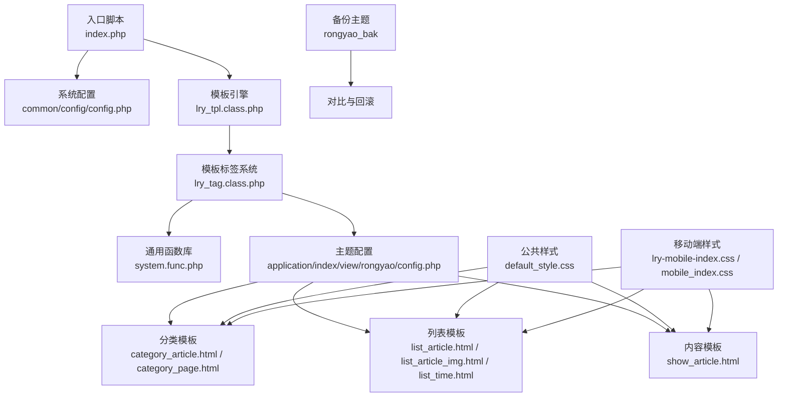
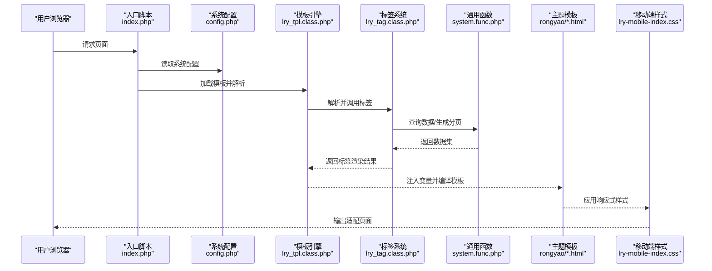
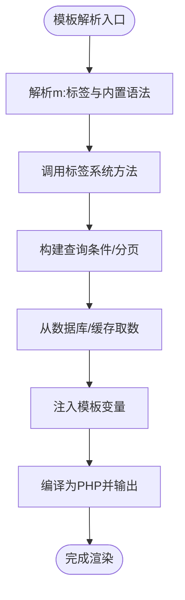
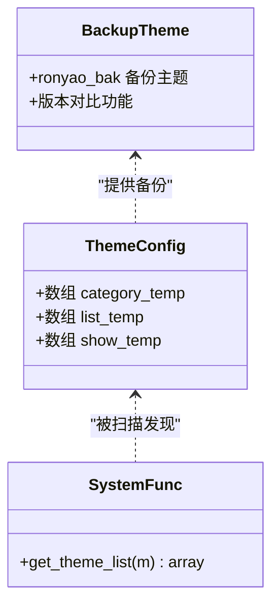
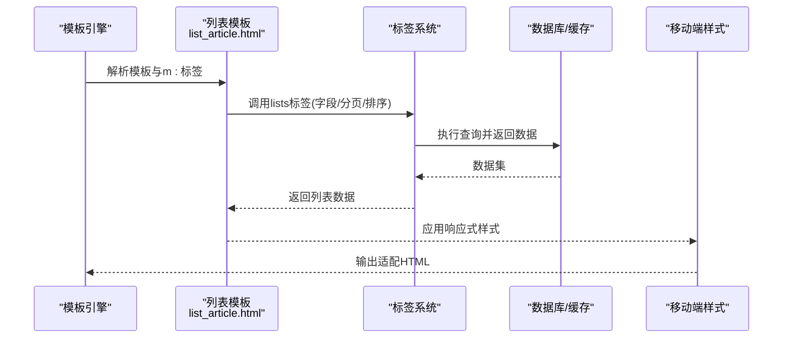
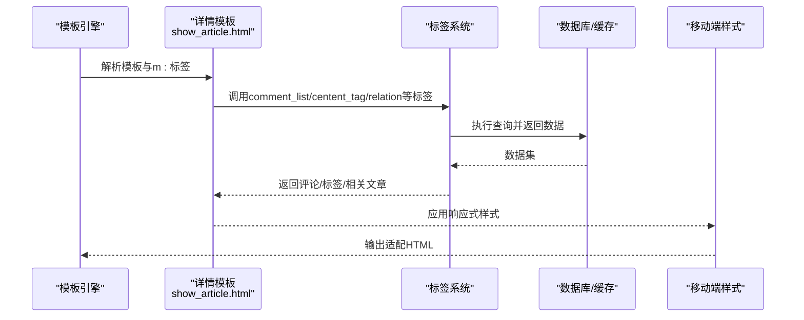
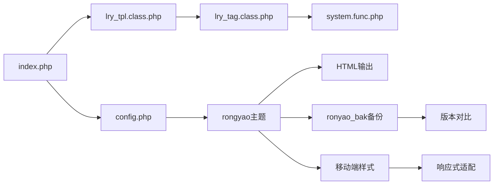

# 前台模板系统

<cite>
**本文引用的文件**
- [index.php](file://index.php)
- [config.php](file://common/config/config.php)
- [lry_tpl.class.php](file://ryphp/core/class/lry_tpl.class.php)
- [lry_tag.class.php](file://ryphp/core/class/lry_tag.class.php)
- [system.func.php](file://common/function/system.func.php)
- [config.php](file://application/index/view/rongyao/config.php)
- [category_article.html](file://application/index/view/rongyao/category_article.html)
- [category_page.html](file://application/index/view/rongyao/category_page.html)
- [list_article.html](file://application/index/view/rongyao/list_article.html)
- [list_article_img.html](file://application/index/view/rongyao/list_article_img.html)
- [list_time.html](file://application/index/view/rongyao/list_time.html)
- [show_article.html](file://application/index/view/rongyao/show_article.html)
- [default_style.css](file://common/static/css/default_style.css)
- [lry-mobile-index.css](file://common/static/css/lry-mobile-index.css)
- [mobile_index.css](file://common/static/css/mobile_index.css)
</cite>

## 更新摘要
**所做更改**
- 新增响应式设计章节，详细说明移动端适配和现代化设计特性
- 更新模板文件组织结构，反映 rongyao 和 rongyao_bak 主题目录的并存状态
- 增强模板现代化设计说明，包括 CSS 架构和组件化设计
- 补充移动端样式文件的集成说明
- 更新模板文件的现代化特性和响应式特性的技术细节

## 目录
1. [引言](#引言)
2. [项目结构](#项目结构)
3. [核心组件](#核心组件)
4. [架构总览](#架构总览)
5. [详细组件分析](#详细组件分析)
6. [响应式设计与现代化特性](#响应式设计与现代化特性)
7. [依赖关系分析](#依赖关系分析)
8. [性能考量](#性能考量)
9. [故障排查指南](#故障排查指南)
10. [结论](#结论)
11. [附录](#附录)

## 引言
本文件面向LRYBlog前台模板系统，提供从架构设计到实现细节的全景式技术文档。重点覆盖模板文件组织与命名规范、各类模板页面（文章列表、文章详情、分类页面、时间轴）的实现逻辑、模板配置文件的作用与选项、模板变量传递与数据绑定机制、定制化指南（主题切换、样式修改、布局调整）、最佳实践与性能优化建议，以及常见问题的解决方案。

**更新** 本次更新重点关注模板系统的现代化设计和响应式特性，包括移动端适配、组件化样式架构和现代化的模板设计模式。

## 项目结构
前台模板系统位于应用层的视图目录中，采用按模块划分的主题目录结构。以"rongyao"为主题目录，内置多个模板文件及配置文件，配合模板引擎与标签系统实现动态渲染。系统同时维护着 rongyao 和 rongyao_bak 两个主题目录，提供版本备份和对比功能。

**图表来源**
- [index.php:1-18](file://index.php#L1-L18)
- [config.php:1-88](file://common/config/config.php#L1-L88)
- [lry_tpl.class.php:1-134](file://ryphp/core/class/lry_tpl.class.php#L1-L134)
- [lry_tag.class.php:1-492](file://ryphp/core/class/lry_tag.class.php#L1-L492)
- [system.func.php:1-200](file://common/function/system.func.php#L1-L200)
- [config.php:1-29](file://application/index/view/rongyao/config.php#L1-L29)
- [category_article.html:1-53](file://application/index/view/rongyao/category_article.html#L1-L53)
- [category_page.html:1-59](file://application/index/view/rongyao/category_page.html#L1-L59)
- [list_article.html:1-150](file://application/index/view/rongyao/list_article.html#L1-L150)
- [list_article_img.html:1-55](file://application/index/view/rongyao/list_article_img.html#L1-L55)
- [list_time.html:1-50](file://application/index/view/rongyao/list_time.html#L1-L50)
- [show_article.html:1-518](file://application/index/view/rongyao/show_article.html#L1-L518)
- [default_style.css:1-200](file://common/static/css/default_style.css#L1-L200)
- [lry-mobile-index.css:1-200](file://common/static/css/lry-mobile-index.css#L1-L200)
- [mobile_index.css:1-200](file://common/static/css/mobile_index.css#L1-L200)

**章节来源**
- [index.php:1-18](file://index.php#L1-L18)
- [config.php:1-88](file://common/config/config.php#L1-L88)

## 核心组件
- 模板引擎与标签系统
  - 模板引擎负责将模板中的自定义标签转换为PHP可执行代码，并注入数据变量。
  - 标签系统提供内容列表、分页、评论、标签、相关文章等常用业务标签，统一由模板引擎调度。
- 主题配置与发现
  - 主题配置文件声明可用模板集合与描述；系统通过函数扫描主题目录，动态发现可用主题。
- 模板文件组织
  - 按页面类型划分模板：分类模板、列表模板、内容模板；每个模板内嵌入SEO、样式与脚本资源引用。
- 公共样式与资源
  - 公共CSS提供基础样式与组件样式，各模板通过相对路径引用主题内的CSS/JS资源。
- **新增** 响应式设计支持
  - 移动端样式文件提供断点适配，确保在不同设备上的良好显示效果。

**章节来源**
- [lry_tpl.class.php:1-134](file://ryphp/core/class/lry_tpl.class.php#L1-L134)
- [lry_tag.class.php:1-492](file://ryphp/core/class/lry_tag.class.php#L1-L492)
- [system.func.php:1-200](file://common/function/system.func.php#L1-L200)
- [config.php:1-29](file://application/index/view/rongyao/config.php#L1-L29)
- [default_style.css:1-200](file://common/static/css/default_style.css#L1-L200)
- [lry-mobile-index.css:1-200](file://common/static/css/lry-mobile-index.css#L1-L200)

## 架构总览
模板系统遵循"入口脚本 → 系统配置 → 模板引擎 → 标签系统 → 主题模板 → 输出"的控制流。系统通过配置文件指定默认主题，模板引擎解析模板中的标签，标签系统从数据库或缓存中读取数据，最终输出HTML。

**图表来源**
- [index.php:1-18](file://index.php#L1-L18)
- [config.php:1-88](file://common/config/config.php#L1-L88)
- [lry_tpl.class.php:1-134](file://ryphp/core/class/lry_tpl.class.php#L1-L134)
- [lry_tag.class.php:1-492](file://ryphp/core/class/lry_tag.class.php#L1-L492)
- [system.func.php:1-200](file://common/function/system.func.php#L1-L200)
- [category_article.html:1-53](file://application/index/view/rongyao/category_article.html#L1-L53)
- [list_article.html:1-150](file://application/index/view/rongyao/list_article.html#L1-L150)
- [show_article.html:1-518](file://application/index/view/rongyao/show_article.html#L1-L518)
- [lry-mobile-index.css:1-200](file://common/static/css/lry-mobile-index.css#L1-L200)

## 详细组件分析

### 模板引擎与标签系统
- 模板标签解析
  - 引擎支持包含、PHP原生代码、条件/循环、函数调用、变量输出等语法，统一转换为PHP代码。
  - m:标签语法由引擎回调至标签系统，按参数构造查询与分页。
- 标签系统能力
  - 列表标签：支持按栏目、模型、缩略图、推荐位等筛选，支持分页与排序。
  - 评论标签：按内容标识获取评论列表，支持分页。
  - 标签与相关文章：基于标签关联计算相关内容。
  - 归档与搜索：支持按时间归档与全文检索。
- 性能与缓存
  - 标签支持缓存参数，减少重复查询；分页标签自动注入分页变量供模板使用。

**图表来源**
- [lry_tpl.class.php:31-92](file://ryphp/core/class/lry_tpl.class.php#L31-L92)
- [lry_tag.class.php:18-65](file://ryphp/core/class/lry_tag.class.php#L18-L65)
- [lry_tag.class.php:292-310](file://ryphp/core/class/lry_tag.class.php#L292-L310)
- [lry_tag.class.php:201-206](file://ryphp/core/class/lry_tag.class.php#L201-L206)

**章节来源**
- [lry_tpl.class.php:1-134](file://ryphp/core/class/lry_tpl.class.php#L1-L134)
- [lry_tag.class.php:1-492](file://ryphp/core/class/lry_tag.class.php#L1-L492)

### 主题配置与模板集合
- 主题配置文件声明三类模板集合：分类模板、列表模板、内容模板，每项包含模板标识与中文描述。
- 系统通过函数扫描主题目录，动态获取可用主题列表，便于后台选择与切换。
- **更新** 支持主题备份与对比功能，ronyao_bak 提供历史版本对照。

**图表来源**
- [config.php:1-29](file://application/index/view/rongyao/config.php#L1-L29)
- [system.func.php:8-17](file://common/function/system.func.php#L8-L17)

**章节来源**
- [config.php:1-29](file://application/index/view/rongyao/config.php#L1-L29)
- [system.func.php:1-200](file://common/function/system.func.php#L1-L200)

### 文章列表模板（图文/纯文/时间轴）
- 图文列表模板
  - 引入关键CSS与预加载关键JS，延迟加载非关键资源；支持分类横幅背景样式注入；列表项包含标题、摘要、作者、时间、点击量与缩略图。
- 纯文列表模板
  - 与图文模板类似，但侧重文字展示，侧栏包含推荐、随机文章、点击排行与标签云等辅助模块。
- 时间轴模板
  - 以时间线形式展示文章标题与发布时间，适合归档与回顾场景。
- **新增** 响应式设计特性
  - 移动端断点适配，确保在小屏幕设备上的良好阅读体验。

**图表来源**
- [list_article.html:54-73](file://application/index/view/rongyao/list_article.html#L54-L73)
- [lry_tag.class.php:18-65](file://ryphp/core/class/lry_tag.class.php#L18-L65)
- [lry-mobile-index.css:1-200](file://common/static/css/lry-mobile-index.css#L1-L200)

**章节来源**
- [list_article.html:1-150](file://application/index/view/rongyao/list_article.html#L1-L150)
- [list_article_img.html:1-55](file://application/index/view/rongyao/list_article_img.html#L1-L55)
- [list_time.html:1-50](file://application/index/view/rongyao/list_time.html#L1-L50)

### 文章详情模板
- 结构组成
  - 包含面包屑导航、文章标题、作者、时间、点击量、摘要、正文、标签、原文链接、点赞、上一篇/下一篇导航、相关推荐、评论区等模块。
- 交互与性能
  - 关键资源预加载，非关键资源延迟加载；评论区支持回复与验证码；标签与原文链接区域具备复制与访问功能。
- 数据绑定
  - 模板变量直接来源于标签系统返回的数据集，如文章基本信息、评论列表、相关文章等。
- **新增** 现代化设计元素
  - 采用卡片式布局、阴影效果和渐变色彩，提升视觉层次感。

**图表来源**
- [show_article.html:202-311](file://application/index/view/rongyao/show_article.html#L202-L311)
- [lry_tag.class.php:292-310](file://ryphp/core/class/lry_tag.class.php#L292-L310)
- [lry_tag.class.php:201-206](file://ryphp/core/class/lry_tag.class.php#L201-L206)
- [lry_tag.class.php:214-243](file://ryphp/core/class/lry_tag.class.php#L214-L243)
- [lry-mobile-index.css:1-200](file://common/static/css/lry-mobile-index.css#L1-L200)

**章节来源**
- [show_article.html:1-518](file://application/index/view/rongyao/show_article.html#L1-L518)

### 分类页面模板
- 文章频道页模板
  - 展示子分类标题与简介，支持子分类下的文章列表与分页；顶部横幅背景可按分类设置。
- 单页面模板
  - 用于展示独立页面内容，模板内嵌入分类SEO与面包屑导航。
- **新增** 组件化设计
  - 采用模块化组件设计，便于维护和扩展。

**章节来源**
- [category_article.html:1-53](file://application/index/view/rongyao/category_article.html#L1-L53)
- [category_page.html:1-59](file://application/index/view/rongyao/category_page.html#L1-L59)

### 模板变量传递与数据绑定
- 变量注入
  - 模板引擎将标签系统返回的数据集注入模板变量，模板中通过占位符输出。
- 常用变量
  - SEO相关：标题、关键词、描述；文章相关：标题、摘要、正文、作者、时间、点击量、缩略图；导航与分页：面包屑、分页HTML。
- 函数辅助
  - 通用函数提供URL生成、站点信息、模型信息、移动端判断等辅助能力，供模板与标签系统共同使用。

**章节来源**
- [lry_tpl.class.php:31-58](file://ryphp/core/class/lry_tpl.class.php#L31-L58)
- [system.func.php:1-200](file://common/function/system.func.php#L1-L200)

### 模板定制化指南
- 主题切换
  - 在系统配置中设置默认主题目录，后台可选择不同主题；主题目录下需包含完整的模板文件与配置文件。
- 样式修改
  - 各模板通过相对路径引用主题CSS/JS；可在主题目录新增或覆盖样式文件，注意与公共样式的兼容性。
- 布局调整
  - 模板中包含侧栏与主内容区结构，可根据需求增删模块或调整模块顺序；注意保持语义化结构与SEO友好性。
- **新增** 响应式定制
  - 利用移动端样式文件进行断点调整，确保在不同设备上的最佳显示效果。

**章节来源**
- [config.php:1-88](file://common/config/config.php#L1-L88)
- [config.php:1-29](file://application/index/view/rongyao/config.php#L1-L29)
- [default_style.css:1-200](file://common/static/css/default_style.css#L1-L200)
- [lry-mobile-index.css:1-200](file://common/static/css/lry-mobile-index.css#L1-L200)

## 响应式设计与现代化特性

### 移动端适配架构
前台模板系统采用移动优先的设计理念，通过专门的移动端样式文件实现跨设备适配：

- **断点设计**
  - 使用标准断点（768px、1024px、1200px）适配不同屏幕尺寸
  - 响应式网格系统支持多列布局在小屏幕设备上的自动调整
- **触摸友好的交互**
  - 触摸目标尺寸优化，确保手指操作的便利性
  - 触摸反馈效果增强用户体验
- **性能优化**
  - 移动端专用样式文件减少桌面端不必要样式加载
  - 图片懒加载和资源压缩提升移动端加载速度

### 现代化设计元素
- **视觉层次**
  - 采用卡片式设计，营造立体感和层次感
  - 渐变色彩和阴影效果提升视觉吸引力
- **动画与过渡**
  - 平滑的页面切换动画和元素过渡效果
  - 加载状态的视觉反馈
- **无障碍设计**
  - 语义化HTML结构支持屏幕阅读器
  - 高对比度色彩方案确保可读性

### 样式架构优化
- **模块化CSS**
  - 组件化样式架构，便于维护和复用
  - BEM命名规范确保样式类的可预测性和可维护性
- **CSS变量系统**
  - 使用CSS自定义属性实现主题色和间距的统一管理
  - 动态样式切换支持夜间模式等功能
- **性能优化策略**
  - 样式文件压缩和合并减少HTTP请求
  - 关键CSS内联提升首屏渲染速度

**章节来源**
- [lry-mobile-index.css:1-200](file://common/static/css/lry-mobile-index.css#L1-L200)
- [mobile_index.css:1-200](file://common/static/css/mobile_index.css#L1-L200)
- [default_style.css:1-200](file://common/static/css/default_style.css#L1-L200)

## 依赖关系分析
- 模板引擎依赖标签系统与通用函数，标签系统依赖数据库与分页类。
- 主题配置文件与主题目录结构决定模板可用性与页面渲染结果。
- 入口脚本与系统配置决定运行环境与默认主题。
- **新增** 响应式样式文件与模板文件的协同工作机制。

**图表来源**
- [index.php:1-18](file://index.php#L1-L18)
- [config.php:1-88](file://common/config/config.php#L1-L88)
- [lry_tpl.class.php:1-134](file://ryphp/core/class/lry_tpl.class.php#L1-L134)
- [lry_tag.class.php:1-492](file://ryphp/core/class/lry_tag.class.php#L1-L492)
- [system.func.php:1-200](file://common/function/system.func.php#L1-L200)
- [config.php:1-29](file://application/index/view/rongyao/config.php#L1-L29)
- [lry-mobile-index.css:1-200](file://common/static/css/lry-mobile-index.css#L1-L200)

**章节来源**
- [index.php:1-18](file://index.php#L1-L18)
- [config.php:1-88](file://common/config/config.php#L1-L88)

## 性能考量
- 资源加载策略
  - 关键CSS/JS预加载，非关键资源延迟加载，减少首屏阻塞。
  - **新增** 移动端资源优化，根据设备能力智能加载资源。
- 标签缓存
  - 对热点标签启用缓存，降低数据库压力；合理设置缓存有效期。
- 分页与限制
  - 列表与评论等标签应设置合理的limit与分页，避免一次性加载大量数据。
- 样式与脚本合并
  - 生产环境建议合并与压缩静态资源，减少请求数与体积。
  - **新增** 响应式样式文件的条件加载，提升移动端性能。

## 故障排查指南
- 模板无法渲染
  - 检查主题目录是否存在且配置正确；确认模板文件语法与标签使用是否符合引擎规范。
- 数据为空或异常
  - 检查标签参数（字段、条件、排序、分页）是否正确；核对数据库连接与权限。
- SEO与链接异常
  - 检查站点URL与伪静态后缀配置；确认URL生成函数返回值。
- 性能问题
  - 启用标签缓存；优化查询条件与索引；减少不必要的资源请求。
- **新增** 响应式问题
  - 检查移动端样式文件是否正确加载；验证CSS断点设置；测试不同设备上的显示效果。

**章节来源**
- [lry_tpl.class.php:31-92](file://ryphp/core/class/lry_tpl.class.php#L31-L92)
- [lry_tag.class.php:18-65](file://ryphp/core/class/lry_tag.class.php#L18-L65)
- [config.php:1-88](file://common/config/config.php#L1-L88)

## 结论
LRYBlog前台模板系统以清晰的模块化设计与灵活的标签体系为核心，结合主题配置与资源加载策略，实现了高可定制与高性能的前端渲染。本次更新进一步强化了系统的现代化设计和响应式特性，通过组件化样式架构、移动端适配和性能优化，为用户提供了更加优质的浏览体验。通过理解模板引擎、标签系统、主题配置与数据绑定机制，开发者可高效地进行模板定制与优化。

## 附录
- 模板文件命名规范
  - 分类模板：category_article.html、category_page.html
  - 列表模板：list_article.html、list_article_img.html、list_time.html
  - 内容模板：show_article.html
- 关键标签参考
  - 列表标签：lists（字段、栏目、模型、缩略图、推荐位、分页、排序）
  - 评论标签：comment_list（分页）
  - 标签与相关文章：centent_tag、relation
  - 归档与搜索：content_archives、search
- **新增** 响应式设计参考
  - 断点设置：768px、1024px、1200px
  - 移动端样式文件：lry-mobile-index.css、mobile_index.css
  - 组件化设计原则：BEM命名规范、模块化CSS架构